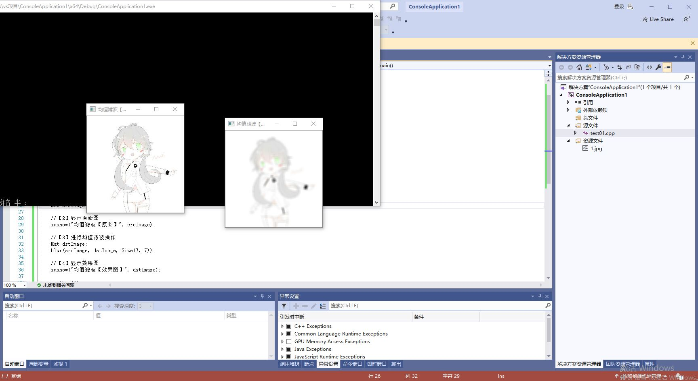
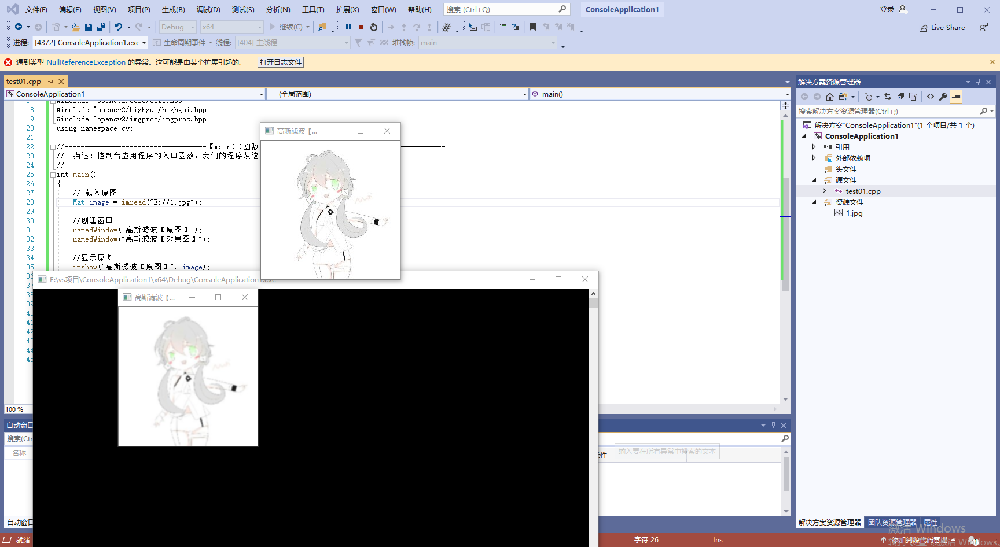
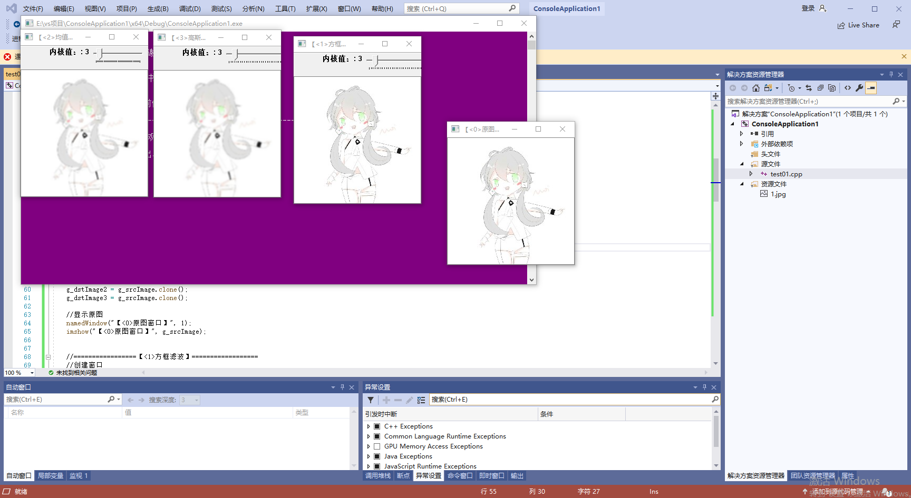
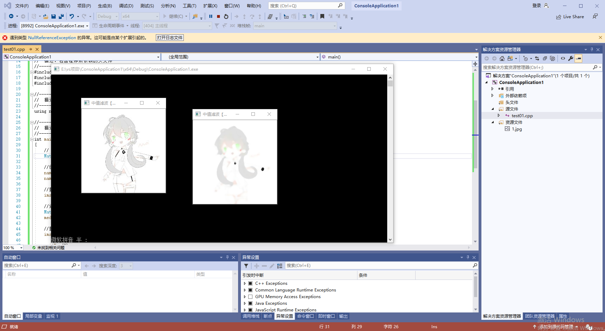
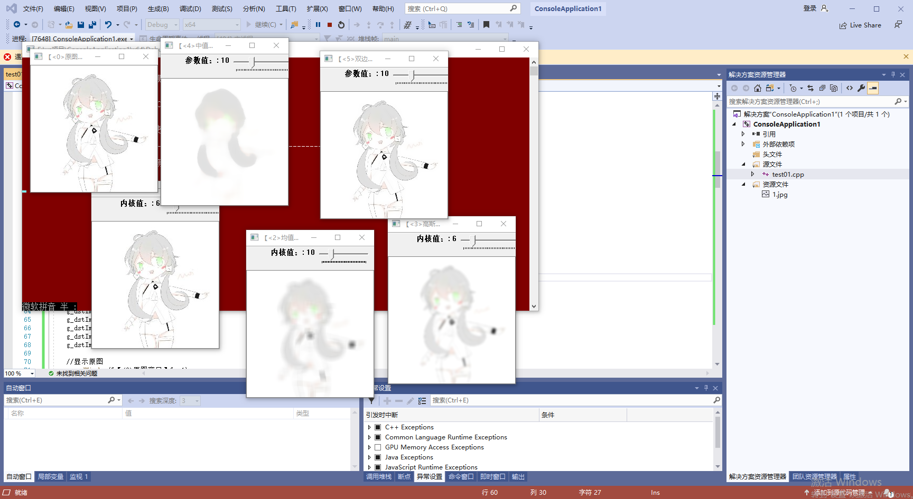
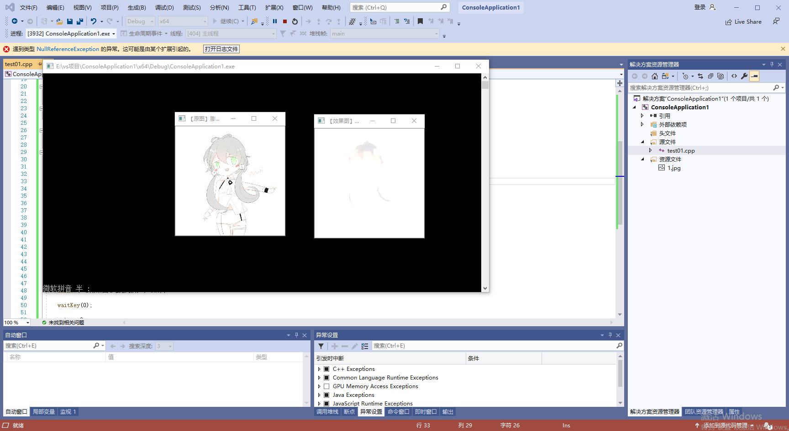
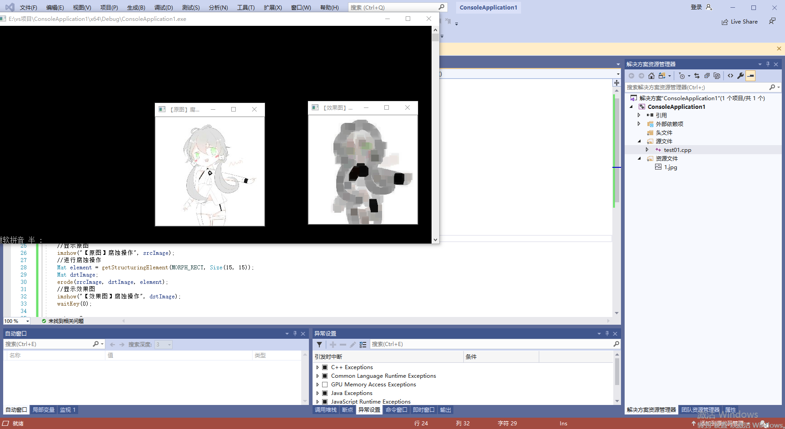
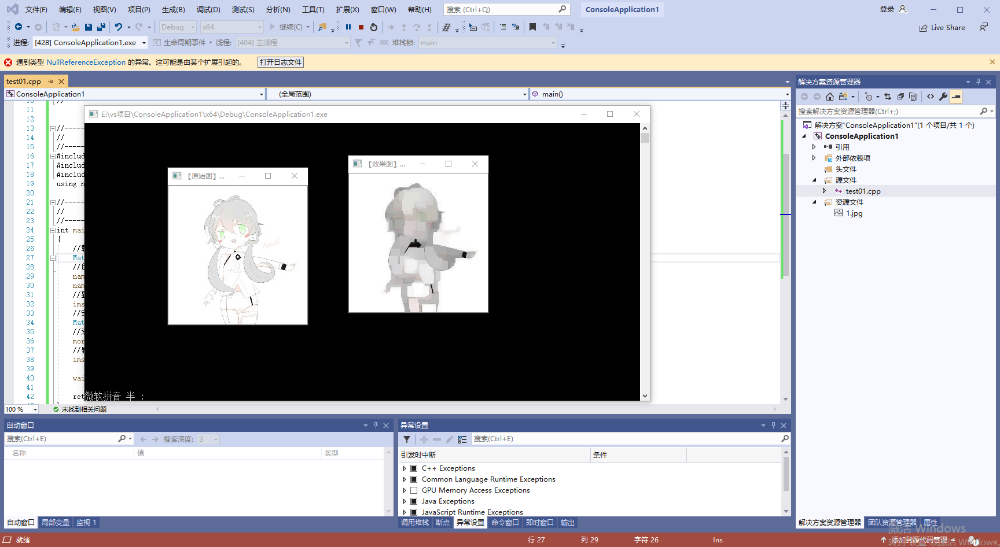

# 第三次作业
## 均值滤波
均值滤波是最简单的一种滤波操作，输出图像的每一个像素是和窗口内输入图像对应像素的平均值，运行输出结果如下图所示

## 高斯滤波
GaussianBlur函数的作用是利用高斯滤波器来模糊一张图片，对输入的头像src进行高斯滤波后用dst输出，它将原图像和指定的高斯核函数做卷积运算，并且支持就地过滤

## 图像线性滤波综合示例
线性综合滤波用滑动条来控制图像在三钟线性滤波下的模糊度，运行输出结果如下图所示

## 中值滤波
medianBlur函数使用中值滤波来平滑处理一张图片，从src输入，结果从dst输出，对于多通道图片，它对每一个图片都单独处理，并且支持就地操作，运行效果图如下图所示

## 双边滤波
此函数的作用是用双边滤波器来模糊处理一张图片，运行效果图如下图所示

## 5种滤波的综合示例
通过各种截图可以发现，方框滤波和均值滤波效果很相似，中值滤波对原图颠覆很大，而双边滤波和原图差别不大，需要仔细看才能看出结果,运行效果图如下图所示

## 形态学滤波，膨胀与腐蚀
简单来说，形态学操作就是基于形状的一系列图像处理操作，opencv为图像的形态变换学提供了快捷方便的函数，最基本的形态操作学有两种，膨胀与腐蚀，膨胀与腐蚀能实现多种多样的功能，消除噪音，分割出独立的图像元素，在图像中连接相同的元素，寻找图像中明显的极大值区域和极小值区域，求出图像的梯度，运行的效果图如下图所示

## 开运算
开运算其实就是先腐蚀后膨胀的过程，开运算可以用来消除小物体，并且在平滑较大物体的边界同时不明显改变其面积

# 总结
在本次课程中我们学习了很多类型的图形变换方法，包括利用opencv进行边缘检测所用的canny算子，sobel算子，laplace算子以及scharr滤波器
腐蚀和膨胀是针对白色部分（高亮部分）而言的。膨胀就是对图像高亮部分进行“领域扩张”，效果图拥有比原图更大的高亮区域；腐蚀是原图中的高亮区域被蚕食，效果图拥有比原图更小的高亮区域。
开运算：先腐蚀再膨胀，用来消除小物体
闭运算：先膨胀再腐蚀，用于排除小型黑洞
形态学梯度：就是膨胀图与俯视图之差，用于保留物体的边缘轮廓。
顶帽：原图像与开运算图之差，用于分离比邻近点亮一些的斑块。
黑帽：闭运算与原图像之差，用于分离比邻近点暗一些的斑块。
通过本节课的学习，我们为以后opencv的学习打下了很坚固的基础。

