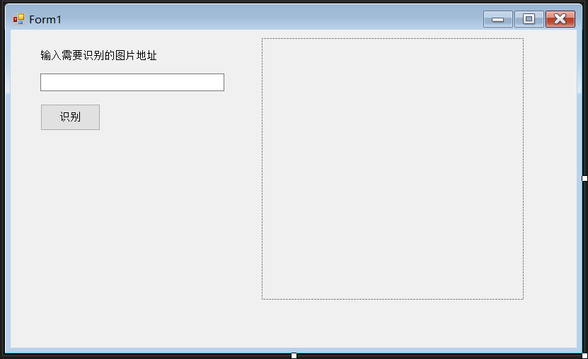
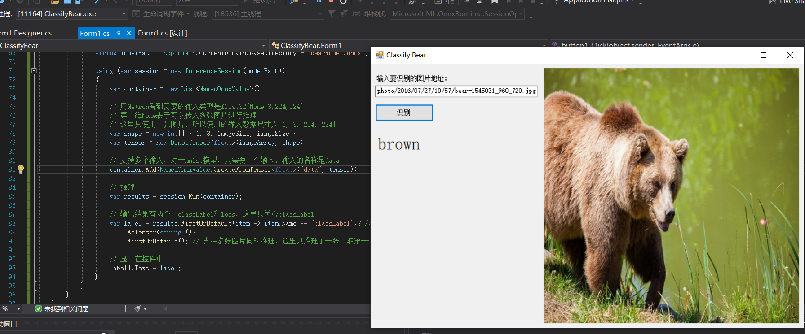

># 目标检测与识别
第七组成员：201702058黄智超、201702045赵良标、201702049张嘉惠
## 使用ONNX Runtime封装onnx模型并推理
## 一.界面设计
1. 创建Windows窗体应用(.NET Framework)项目，这里给项目起名ClassifyBear。

2. 在解决方案资源管理器中找到Form1.cs，双击，打开界面设计器。从工具箱中向Form中依次拖入控件并调整，最终效果如下图所示：

* ### 左侧从上下到依次是：

  * Label控件，将内容改为“输入要识别的图片地址：”
  * TextBox控件，可以将控件拉长一些，方便输入URL
  * Button控件，将内容改为“识别”
  此外要注意的是： Lable控件，将label的内容清空，用来显示识别后的结果。因为label也没有边框，所以在界面看不出来。可以将此控件的字体调大一些，能更清楚的显示推理结果。

* ### 右侧控件为：PictureBox.用来预览输入的图片，也从这个控件中取出对应的图片数据，传给我们的模型推理类库去推理。
    （建议将控件属性的SizeMode更改为StretchImage，并将控件长和宽设置为同样的值，保持一个正方形的形状，这样可以方便我们直观的了解模型的输入，因为在前面查看模型信息的时候也看到了，该模型的输入图片应是正方形）

    当前最新的定制化视觉服务导出的模型需要的输入图片大小为224*224。

## 二.添加模型文件到项目中
1. 打开解决方案资源管理器中，在项目上点右键->添加->现有项，在弹出的对话框中，将文件类型过滤器改为所有文件，然后导航到模型所在目录，选择模型文件并添加。本示例中使用的模型文件是BearModel.onnx。

2. 模型是在应用运行期间加载的，所以在编译时需要将模型复制到运行目录下。在模型文件上点右键，属性，然后在属性面板上，将生成操作属性改为内容，将复制到输出目录属性改为如果较新则复制。

## 三.添加OnnxRuntime库
1. 打开解决方案资源管理器，在引用上点右键，管理NuGet程序包。

2. 在打开的NuGet包管理器中，切换到浏览选项卡，搜索onnxruntime，找到Microsoft.ML.OnnxRuntime包，当前版本是0.4.0，点击安装，稍等片刻，按提示即可完成安装。

3. 当前NuGet发布的OnnxRuntime库支持x64及x86架构的运行库，建议使用x64的，所以这里将项目的目标架构改为x64。（在解决方案上点右键，选择配置管理器。在配置管理器对话框中，将活动解决方案平台切换为x64。如果没有x64，在下拉框中选择新建，按提示新建x64平台。）
## 四.处理输入并加载模型进行推理
* 在Form1.cs上点右键，选择查看代码，打开Form1.cs的代码编辑窗口。
* 回到Form1的设计界面，双击识别按钮，会自动跳转到代码页面并添加了button1_Click方法。
* 首先，每次点击识别按钮时都先将界面上显示的上一次的结果清除
添加一个成员变量
* 让图片控件加载图片，如果加载成功，将图片数据处理成需要的大小，然后加载模型进行推理。 
  注意：这里的数据转换一定要按照前面查看的模型的信息来转换，图片大小需要长宽都是224像素，并且要依次放置所有的蓝色分量、所有的绿色分量、所有的红色分量，如果顺序不正确，不能达到最佳的推理结果。
## 五.测试及效果图
测试代码：

// Copyright (c) Microsoft. All rights reserved.
// Licensed under the MIT license. See LICENSE file in the project root for full license information.

using Microsoft.ML.OnnxRuntime;
using System;
using System.Collections.Generic;
using System.ComponentModel;
using System.Data;
using System.Drawing;
using System.Linq;
using System.Numerics.Tensors;
using System.Text;
using System.Threading.Tasks;
using System.Windows.Forms;

namespace ClassifyBear
{
    public partial class Form1 : Form
    {
        public Form1()
        {
            InitializeComponent();
        }

        // 使用Netron查看模型，得到模型的输入应为224*224大小的图片
        private const int imageSize = 224;

        private void button1_Click(object sender, EventArgs e)
        {
            // 识别之前先重置界面显示的内容
            label1.Text = string.Empty;
            pictureBox1.Image = null;
            pictureBox1.Refresh();

            bool isSuccess = false;
            try
            {
                pictureBox1.Load(textBox1.Text);
                isSuccess = true;
            }
            catch (Exception ex)
            {
                MessageBox.Show($"读取图片时出现错误：{ex.Message}");
                throw;
            }

            if (isSuccess)
            {
                // 图片加载成功后，从图片控件中取出224*224的位图对象
                Bitmap bitmap = new Bitmap(pictureBox1.Image, imageSize, imageSize);

                float[] imageArray = new float[imageSize * imageSize * 3];

                // 按照先行后列的方式依次取出图片的每个像素值
                for (int y = 0; y < imageSize; y++)
                {
                    for (int x = 0; x < imageSize; x++)
                    {
                        var color = bitmap.GetPixel(x, y);

                        // 使用Netron查看模型的输入发现
                        // 需要依次放置224 *224的蓝色分量、224*224的绿色分量、224*224的红色分量
                        imageArray[y * imageSize + x] = color.B;
                        imageArray[y * imageSize + x + 1 * imageSize * imageSize] = color.G;
                        imageArray[y * imageSize + x + 2 * imageSize * imageSize] = color.R;
                    }
                }

                string modelPath = AppDomain.CurrentDomain.BaseDirectory + "BearModel.onnx";

                using (var session = new InferenceSession(modelPath))
                {
                    var container = new List<NamedOnnxValue>();

                    // 用Netron看到需要的输入类型是float32[None,3,224,224]
                    // 第一维None表示可以传入多张图片进行推理
                    // 这里只使用一张图片，所以使用的输入数据尺寸为[1, 3, 224, 224]
                    var shape = new int[] { 1, 3, imageSize, imageSize };
                    var tensor = new DenseTensor<float>(imageArray, shape);

                    // 支持多个输入，对于mnist模型，只需要一个输入，输入的名称是data
                    container.Add(NamedOnnxValue.CreateFromTensor<float>("data", tensor));

                    // 推理
                    var results = session.Run(container);

                    // 输出结果有两个，classLabel和loss，这里只关心classLabel
                    var label = results.FirstOrDefault(item => item.Name == "classLabel")? // 取出名为classLabel的输出
                        .AsTensor<string>()?
                        .FirstOrDefault(); // 支持多张图片同时推理，这里只推理了一张，取第一个结果值

                    // 显示在控件中
                    label1.Text = label;
                }
            }
        }
    }
}

效果图如下：

## 六.小组总结
本次实验是由小组合作分工共同完成：黄智超负责程序，张嘉惠负责文档，赵良标负责演讲。本文计划让我们的程序可以识别一张熊的图片， 输入要搜索图片的地址，右侧就可以预览搜索结果。注意，这个URL应该是图片的URL，而不是包含该图片的网页的URL。此外，在测试过程中，也出现了一些问题，经过反复检查，甚至重新进行实验，最终发现部分问题是抄写程序代码是出现的失误，改正之后达到了实验的要求。最后一次实验用了老师已给的代码，得到了同样的结果。本次小组合作分工充分利用了组内成员的优点，意识到团队合作的重要性。