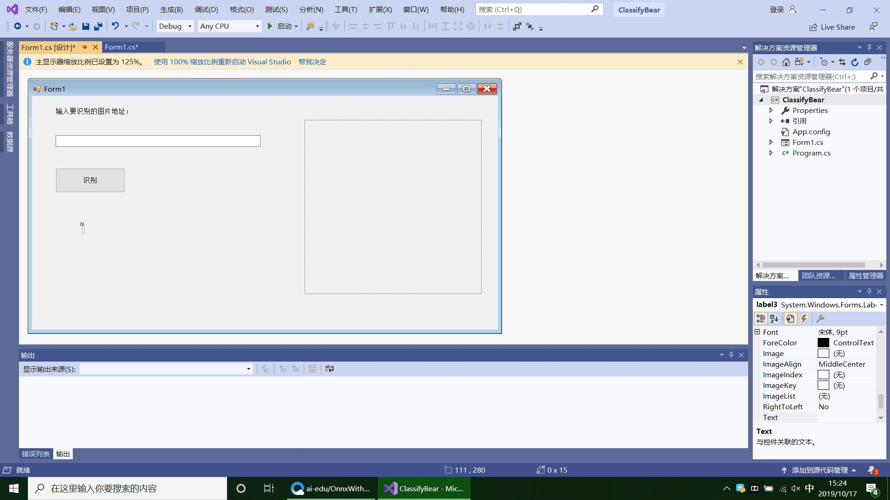

**201702048（武宇飞）
201702072（程世茂）
201702051（卢剑宇）**
***
# 目标检测与识别实验
***

## 一、界面设计

### （1）创建Windows窗体应用(.NET Framework)项目，命名ClassifyBear；

### （2）在解决方案资源管理器中找到Form1.cs，双击，打开界面设计器。向Form中依次拖入控件并调整，效果如下图所示：

#### 左侧从上下到依次是：

#### Label控件，将内容改为“输入要识别的图片地址：”

#### TextBox控件，可以将控件拉长一些，方便输入URL

#### Button控件，将内容改为“识别”

**（注：Lable控件，将label的内容清空，用来显示识别后的结果。因为label也没有边框，所以在界面看不出来。可以将此控件内字体调大一些，能更清楚的显示推理结果。）**

#### 右侧的控件是一个PictureBox，用来预览输入的图片同时将控件中取出对应的图片数据，传给我们的模型推理类库去推理。

**（注：控件属性的SizeMode更改为StretchImage，并将控件长和宽设置为同样的值，为正方形。当前图片大小为224*224。）**

## 二、项目设计

### （1）添加模型文件到项目

**打开解决方案资源管理器,点右键->添加->现有项，在弹出的对话框中，将文件类型过滤器改为所有文件，然后导航到模型所在目录，选择模型文件(BearModel.onnx)并添加。在模型文件上点右键，属性，然后在属性面板上，将生成操作属性改为内容，将复制到输出目录属性改为如果较新则复制。**

### （2）添加OnnxRuntime库

**微软开源的OnnxRuntime库提供了NuGet包，可以很方便的集成到Visual Studio项目中。右键，管理NuGet程序包。在NuGet包管理器找到浏览选项卡，搜索onnxruntime，找到Microsoft .ML.OnnxR untime包，按提示完成安装。**

### （3）处理输入并加载模型进行推理

#### a.Form1.cs上点右键，选择查看代码，打开Form1.cs的代码编辑窗口。

#### b.回到Form1的设计界面，双击识别按钮，自动跳转到代码页面，并添加button1_Click方法。

#### c.让图片控件加载图片，如果加载成功，改变图片数据大小，然后加载模型进行推理。

**（注：每次点击识别按钮时都先将界面上显示的上一次的结果清除）**

### （4）测试代码

***

// Copyright (c) Microsoft. All rights reserved.
// Licensed under the MIT license. See LICENSE file in the project root for full license information.

using Microsoft.ML.OnnxRuntime;
using System;
using System.Collections.Generic;
using System.ComponentModel;
using System.Data;
using System.Drawing;
using System.Linq;
using System.Numerics.Tensors;
using System.Text;
using System.Threading.Tasks;
using System.Windows.Forms;

namespace ClassifyBear
{
    public partial class Form1 : Form
    {
        public Form1()
        {
            InitializeComponent();
        }
        private const int imageSize = 224;

        private void button1_Click(object sender, EventArgs e)
        {
            // 识别之前先重置界面显示的内容
            label1.Text = string.Empty;
            pictureBox1.Image = null;
            pictureBox1.Refresh();

            bool isSuccess = false;
            try
            {
                pictureBox1.Load(textBox1.Text);
                isSuccess = true;
            }
            catch (Exception ex)
            {
                MessageBox.Show($"读取图片时出现错误：{ex.Message}");
                throw;
            }

            if (isSuccess)
            {
                // 图片加载成功后，从图片控件中取出224*224的位图对象
                Bitmap bitmap = new Bitmap(pictureBox1.Image, imageSize, imageSize);

                float[] imageArray = new float[imageSize * imageSize * 3];

                // 按照先行后列的方式依次取出图片的每个像素值
                for (int y = 0; y < imageSize; y++)
                {
                    for (int x = 0; x < imageSize; x++)
                    {
                        var color = bitmap.GetPixel(x, y);

                        // 使用Netron查看模型的输入发现
                        // 需要依次放置224 *224的蓝色分量、224*224的绿色分量、224*224的红色分量
                        imageArray[y * imageSize + x] = color.B;
                        imageArray[y * imageSize + x + 1 * imageSize * imageSize] = color.G;
                        imageArray[y * imageSize + x + 2 * imageSize * imageSize] = color.R;
                    }
                }

                string modelPath = AppDomain.CurrentDomain.BaseDirectory + "BearModel.onnx";

                using (var session = new InferenceSession(modelPath))
                {
                    var container = new List<NamedOnnxValue>();

                    // 用Netron看到需要的输入类型是float32[None,3,224,224]
                    // 第一维None表示可以传入多张图片进行推理
                    // 这里只使用一张图片，所以使用的输入数据尺寸为[1, 3, 224, 224]
                    var shape = new int[] { 1, 3, imageSize, imageSize };
                    var tensor = new DenseTensor<float>(imageArray, shape);

                    // 支持多个输入，对于mnist模型，只需要一个输入，输入的名称是data
                    container.Add(NamedOnnxValue.CreateFromTensor<float>("data", tensor));

                    // 推理
                    var results = session.Run(container);

                    // 输出结果有两个，classLabel和loss，这里只关心classLabel
                    var label = results.FirstOrDefault(item => item.Name == "classLabel")? // 取出名为classLabel的输出
                        .AsTensor<string>()?
                        .FirstOrDefault(); // 支持多张图片同时推理，这里只推理了一张，取第一个结果值

                    // 显示在控件中
                    label1.Text = label;
                }
            }
        }
    }
}
***

## 三、效果展示

## 四、总结

**经过本次实验，主要使用ONNX Runtime封装onnx模型并推理，对界面设计有一定的认识。了解到了团队的合作和队友之间的相互协助非常重要。同时让我们更深一步的对自己的专业，对自己的能力，对自己所学的有正确的认识，并且能在以后的学习中不断提高和完善自己。实验中，我们3人分工不同，但是通过我们互相合作，最后达到了我们想要的实验效果 总的来说，这次实验还是比较成功的，无论是个人动手能力还是团队协作能力都得到了很好的锻炼。**
