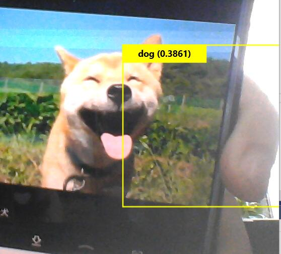

# 学习总结
 # 基于YOLO-V1.2在WINML下的目标检测与识别
  1. YOLO简介
   YOLO为一种新的目标检测方法，该方法的特点是实现快速检测的同时还达到较高的准确率。作者将目标检测任务看作目标区域预测和类别预测的回归问题。该方法采用单个神经网络直接预测物品边界和类别概率，实现端到端的物品检测。

  2. YOLO的优点
 
    一，非常快。YOLO预测流程简单，速度很快。我们的基础版在Titan X GPU上可以达到45帧/s； 快速版可以达到150帧/s。因此，YOLO可以实现实时检测。

    二，YOLO采用全图信息来进行预测。与滑动窗口方法和region proposal-based方法不同，YOLO在训练和预测过程中可以利用全图信息。Fast R-CNN检测方法会错误的将背景中的斑块检测为目标，原因在于Fast R-CNN在检测中无法看到全局图像。相对于Fast R-CNN，YOLO背景预测错误率低一半。

    三，YOLO可以学习到目标的概括信息（generalizable representation），具有一定普适性。我们采用自然图片训练YOLO，然后采用艺术图像来预测。YOLO比其它目标检测方法（DPM和R-CNN）准确率高很多
   

  3. YOLO目标检测的流程
    3.1 分割单元格

    3.2 预测bbox类别信息，得到最终的specificconfidence

    3.3 设置阈值，滤掉低分的bbox

    3.4 非极大值抑制得到最终的bbox

  4. YOLO目标检测的实例                                                               
    4.1 新建项目                                                                                                                        
    4.2 添加tiny-yolov2-1.2.onnx文件，自动生成cs文件                                        
    4.3 调试代码                                                                           
    4.4 运行                                                                       
 # 总结
   YOLO为一种基于单独神经网络模型的目标检测方法，具有特点可以高准确率快速检测可以适用于实时目标检测。 但是缺点很明显，不能准确定位目标特别是小目标，通过对YOLO的学习让我了解到目标检测在智能车中的重要性，对于今天的代码，我本身理解的不是很好，还是要加强对编程语言的学习。

      
  

