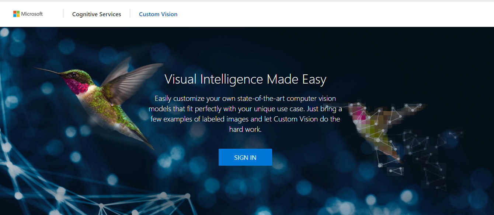

车载信息处理课程设计开题报告
--------

201702052 计算机172班 王欣

初步想法
-------
使用ONNX方法实现对物体的识别，对识别界面的UI设计使得界面变得更加美观，及加入opencv图像处理的部分算法。

对于摄像头调度的算法、以及某些参数的调整也可以做一些适当的改进，以便我们能够更好地运行摄像头以减少卡顿现象的发生。

设计思路
------
除了上述的一些初步想法外，我查阅关于机器学习的一些资料发现，还有通过云端训练识别物体的方法--**Custom Vision**

利用Microsoft提供的订阅服务--**Custom Vision**，通过向云端上传目标物体的图片，当达到一定数量以后，模型训练完成，然后反馈给
我识别的结果。当然由于样本过小，可能会导致存在一些误差。

但这种方式无疑也是对物体进行识别的一种好方法。

在上述的这些工作完成以后，总结经验然后完成报告的撰写。

预期结果
-------
    能够在实用ONNX已有的训练模型的基础上进一步完善，提升识别效率，降低卡顿，最大限度地发挥计算机的图像处理性能。识别的界面也能够变得更加美观易用。

另外对于另一种machine learning的方案也能够很好地作为一种学习上的补充。这样就能掌握两种对物体识别处理的好方法。

