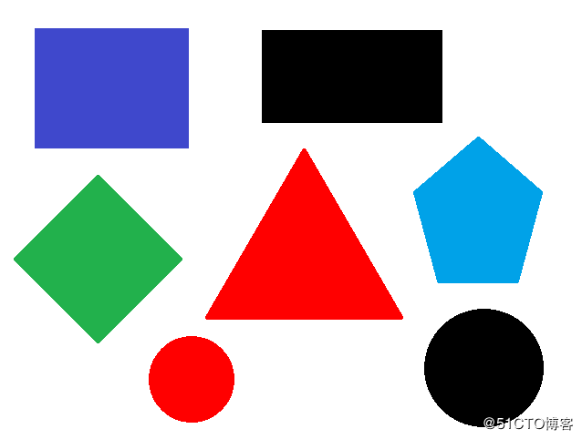
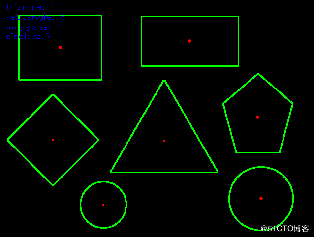

### 设计任务
+ 1.识别几何形状（三角形、四边形/矩形、多边形、圆形）
+ 2.计算几何形状面积与周长、中心位置
+ 3.提取几何形状的颜色。

### 进展情况
+ 在写自己识别几何形状
  * 发现轮廓：简单说轮廓就是一些列点相连组成形状、它们拥有同样的颜色、轮廓发现在图像的对象分析、对象检测等方面是非常有用的工具，在OpenCV中使用轮廓发现相关函数时候要求输入图像是二值图像，这样便于轮廓提取、边缘提取等操作。
  
  * findContours(image, mode, method, contours=None, hierarchy=None, offset=None)
   - image输入/输出的二值图像
   - mode 迒回轮廓的结构、可以是List、Tree、External
   - method 轮廓点的编码方式，基本是基于链式编码
   - contours 迒回的轮廓集合
   - hieracrchy 迒回的轮廓层次关系
   - offset 点是否有位移

  * 多边形逼近：是通过对轮廓外形无限逼近，删除非关键点、得到轮廓的关键点，不断逼近轮廓真实形状的方法
  
  * approxPolyDP(curve, epsilon, closed, approxCurve=None)
    - curve 表示输入的轮廓点集合
    - epsilon 表示逼近曲率，越小表示相似逼近越厉害
    - close 是否闭合
  

### 下一步工作
+ 下一步将会进行写出几何距离计算：用 moment(array,binaryImage=None)函数
+ 整个代码实现分为如下几步完成
  * 加载图像，
  * 图像二值化
  * 轮廓发现
  * 几何形状识别
  * 测量周长、面积、计算中心
  * 颜色提取
  * 将要放上的图片
  
  * 出来的大概效果
  