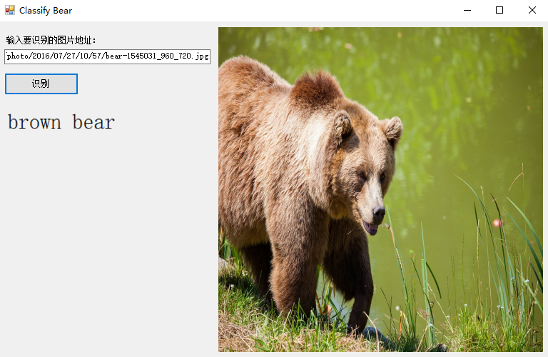
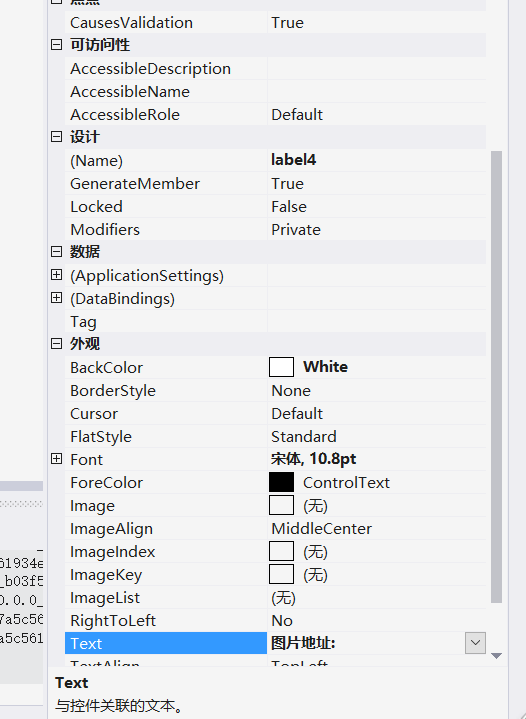
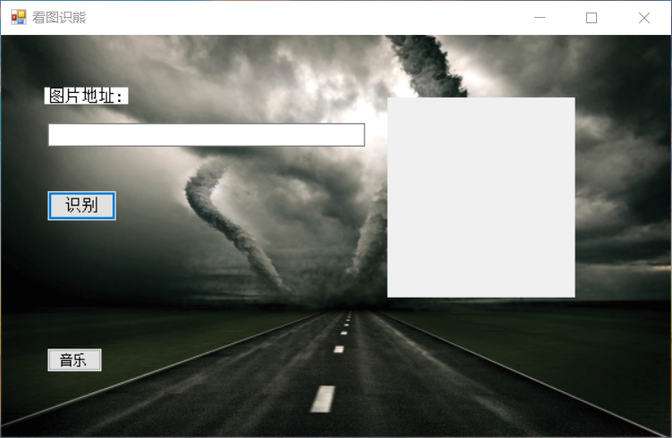
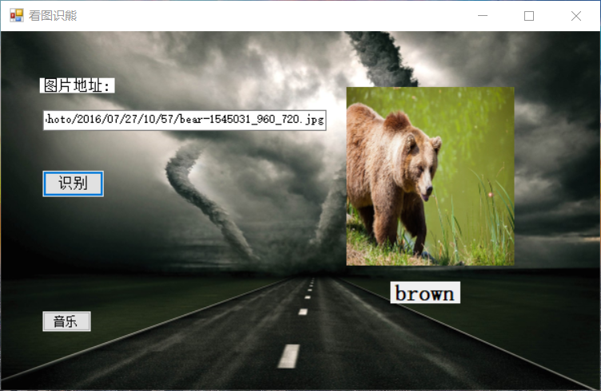
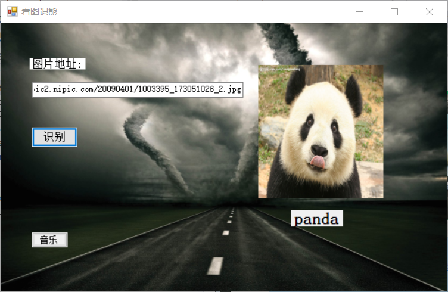
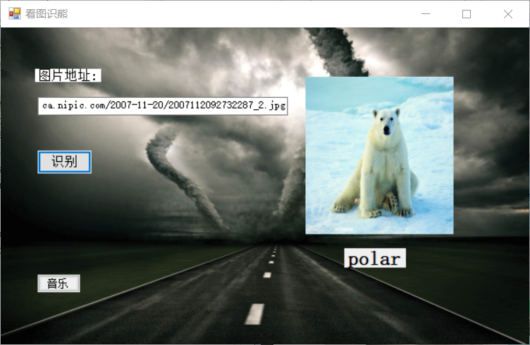

#    <center> 基于onnx模型的看图识熊优化</center> 
# **摘要
能够完成基于onnx模型的看图识熊实例，并且能够对成品进行更加完美的优化，使其功能更完善，界面更优美。最终做成的模型能够识别熊，并且单调的背景也加以修饰，还能够在界面进行音乐的播放。
# **关键词
看图识熊; onnx模型;  界面优化.
# **引言
首先确保已正确安装配置了Visual Studio 2017 和 C#开发环境
创建Windows窗体应用(.NET Framework)项目，这里给项目起名ClassifyBear。
在解决方案资源管理器中找到Form1.cs，打开界面设计器。从工具箱中向Form中依次拖入控件并调整。
打开解决方案资源管理器中，选择模型文件并添加。管理NuGet程序包，NuGet发布的OnnxRuntime库支持x64及x86架构的运行库，建议使用x64的，所以将项目的目标架构改为x64。编译运行，然后在网上找一张熊的图片，把地址填到输入框内，然后点击识别按钮，就可以看到识别的结果了。
# **使用ONNX Runtime封装onnx模型并推理

进行这一步之前，请确保已正确安装配置了Visual Studio 2017 和 C#开发环境。

项目的代码可以在[这里](./src/OnnxWithRuntime)找到。
## **界面设计

创建Windows窗体应用(.NET
    Framework)项目，这里给项目起名ClassifyBear。

在解决方案资源管理器中找到Form1.cs，双击，打开界面设计器。从工具箱中向Form中依次拖入控件并调整，最终效果如下图所示：

  

左侧从上下到依次是：

  - Label控件，将内容改为“输入要识别的图片地址：”

  - TextBox控件，可以将控件拉长一些，方便输入URL

  - Button控件，将内容改为“识别”

  - Lable控件，将label的内容清空，用来显示识别后的结果。因为label也没有边框，所以在界面看不出来。可以将此控件的字体调大一些，能更清楚的显示推理结果。

右侧的控件是一个PictureBox，用来预览输入的图片，同时，我们也从这个控件中取出对应的图片数据，传给我们的模型推理类库去推理。建议将控件属性的SizeMode更改为StretchImage，并将控件长和宽设置为同样的值，保持一个正方形的形状，这样可以方便我们直观的了解模型的输入，因为在前面查看模型信息的时候也看到了，该模型的输入图片应是正方形（当前最新的定制化视觉服务导出的模型需要的输入图片大小为`224*224`）。

## **添加模型文件到项目中

打开解决方案资源管理器中，在项目上点右键->添加->现有项，在弹出的对话框中，将文件类型过滤器改为所有文件，然后导航到模型所在目录，选择模型文件并添加。本示例中使用的模型文件是`BearModel.onnx`。

模型是在应用运行期间加载的，所以在编译时需要将模型复制到运行目录下。在模型文件上点右键，属性，然后在属性面板上，将`生成操作`属性改为`内容`，将`复制到输出目录`属性改为`如果较新则复制`。

## **添加OnnxRuntime库

微软开源的[OnnxRuntime](https://github.com/Microsoft/onnxruntime)库提供了NuGet包，可以很方便的集成到Visual Studio项目中。

打开解决方案资源管理器，在引用上点右键，管理NuGet程序包。

在打开的NuGet包管理器中，切换到浏览选项卡，搜索`onnxruntime`，找到`Microsoft.ML.OnnxRuntime`包，当前版本是0.4.0，点击安装，稍等片刻，按提示即可完成安装。

当前NuGet发布的OnnxRuntime库支持x64及x86架构的运行库，建议使用x64的，所以这里将项目的目标架构改为x64。

在解决方案上点右键，选择配置管理器。在配置管理器对话框中，将活动解决方案平台切换为x64。如果没有x64，在下拉框中选择新建，按提示新建x64平台。

## **处理输入并加载模型进行推理

在Form1.cs上点右键，选择查看代码，打开Form1.cs的代码编辑窗口。

添加一个成员变量
```C#
// 使用Netron查看模型，得到模型的输入应为224*224大小的图片
private const int imageSize = 224;
```

回到Form1的设计界面，双击识别按钮，会自动跳转到代码页面并添加了button1\_Click方法，在其中添加以下代码：

首先，每次点击识别按钮时都先将界面上显示的上一次的结果清除
```C#
// 识别之前先重置界面显示的内容
label1.Text = string.Empty;
pictureBox1.Image = null;
pictureBox1.Refresh();
```

然后，让图片控件加载图片
```C#
bool isSuccess = false;
try
{
    pictureBox1.Load(textBox1.Text);
    isSuccess = true;
}
catch (Exception ex)
{
    MessageBox.Show($"读取图片时出现错误：{ex.Message}");
    throw;
}
```

如果加载成功，将图片数据处理成需要的大小，然后加载模型进行推理。
```C#
if (isSuccess)
{
    // 图片加载成功后，从图片控件中取出224*224的位图对象
    Bitmap bitmap = new Bitmap(pictureBox1.Image, imageSize, imageSize);

    float[] imageArray = new float[imageSize * imageSize * 3];

    // 按照先行后列的方式依次取出图片的每个像素值
    for (int y = 0; y < imageSize; y++)
    {
        for (int x = 0; x < imageSize; x++)
        {
            var color = bitmap.GetPixel(x, y);

            // 使用Netron查看模型的输入发现
            // 需要依次放置224 *224的蓝色分量、224*224的绿色分量、224*224的红色分量
            imageArray[y * imageSize + x] = color.B;
            imageArray[y * imageSize + x + 1 * imageSize * imageSize] = color.G;
            imageArray[y * imageSize + x + 2 * imageSize * imageSize] = color.R;
        }
    }

    // 设置要加载的模型的路径，跟据需要改为你的模型名称
    string modelPath = AppDomain.CurrentDomain.BaseDirectory + "BearModel.onnx";

    using (var session = new InferenceSession(modelPath))
    {
        var container = new List<NamedOnnxValue>();

        // 用Netron看到需要的输入类型是float32[None,3,224,224]
        // 第一维None表示可以传入多张图片进行推理
        // 这里只使用一张图片，所以使用的输入数据尺寸为[1, 3, 224, 224]
        var shape = new int[] { 1, 3, imageSize, imageSize };
        var tensor = new DenseTensor<float>(imageArray, shape);

        // 支持多个输入，对于mnist模型，只需要一个输入，输入的名称是data
        container.Add(NamedOnnxValue.CreateFromTensor<float>("data", tensor));

        // 推理
        var results = session.Run(container);

        // 输出结果有两个，classLabel和loss，这里只关心classLabel
        var label = results.FirstOrDefault(item => item.Name == "classLabel")? // 取出名为classLabel的输出
            .AsTensor<string>()?
            .FirstOrDefault(); // 支持多张图片同时推理，这里只推理了一张，取第一个结果值

        // 显示在控件中
        label1.Text = label;
    }
}
```

注意，这里的数据转换一定要按照前面查看的模型的信息来转换，图片大小需要长宽都是224像素，并且要依次放置所有的蓝色分量、所有的绿色分量、所有的红色分量，如果顺序不正确，不能达到最佳的推理结果。

## **测试

编译运行，然后在网上找一张[熊的图片](https://cdn.pixabay.com/photo/2016/07/27/10/57/bear-1545031_960_720.jpg)，把地址填到输入框内，然后点击识别按钮，就可以看到识别的结果了。注意，这个URL应该是图片的URL，而不是包含该图片的网页的URL。

如果运行时遇到类似于找不到`onnxruntime`的dll的问题，可能是编译时相关库没有拷到运行目录下，可以尝试先清理解决方案，然后再重新编译解决方案。也可以手动到`解决方案目录\packages\Microsoft.ML.OnnxRuntime.0.4.0\runtimes\win-x64\native`下将`onnxruntime.dll`拷到程序运行目录。

# **优化
在界面上添加一些控件，如音频播放按钮，背景图等对界面进行一些优化，同时还能根据个人需求对桌面已有组件参数进行调节。
选中相应组件后点击鼠标右键得到如下界面：

通过这一窗口我们就可以对相应的组件进行参数的调控了，例如模块背景颜色、字体、模块大小等。
# **优化过程
在上述界面中找到我们设计窗口的背景项，导入我们想要的背景图片。于是就得到了这样的简单优化界面。

在解决方案资源管理器中找到Form1.cs，双击，打开界面设计器。从工具箱中向Form中依次拖入控件并调整。（即重复界面设计的步骤，只不过所需控件不同）

这里我以一个音频播放控件为优化例子，在相应项目路径下放一个wav格式的音频文件，只需点击音乐按钮即可对该音频进行播放。
启动项目，在图片地址下方的输入栏中输入我们想要识别的图片地址，然后点击识别就行了。
# **优化后的测试结果




# **参考文献
[1] https://github.com/microsoft/ai-edu/

[2] 刘少山等. 第一本无人驾驶技术书. 电子工业出版社，2017.

[3] 毛星云，冷雪飞等. OpenCV3编程入门. 电子工业出版社，2015.

[4] 冈萨雷斯等著，阮秋琦等译. 数字图像处理（MATLAB版），电子工业出版社，2014.01.

[5] Alberto Fernández Villán. Mastering OpenCV4 with Python, Packt Publishing, 2019.