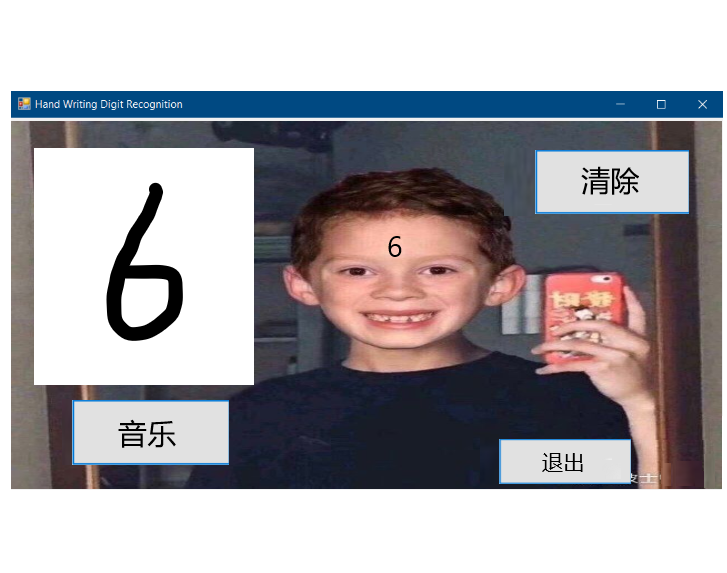

#                                              **基于MNIST实现手写数字识别优化**
###                                                     作者：王振宇

## 摘要：

手写字实现的简单识别及优化并**计算简单手写数学表达式**，**字体颜色的改进**。
- 基础单个字的手写识别
- 音乐播放**button**并添加**gif**作为背景图片布局
- **Form**优化
- **UI**美化，壁纸添加
- **picturebox** 透明化  


## 关键字：
UI美化;Mnist数据集；手写字简单计算；字体改进；音乐播放。

## 引言：
这次实验通过利用vs 2017平台，基于对相对应的 **c#** 代码学习，
结合之前上课所写的手写字的实验和在网上所查找的资料利用相关模型. 
代码改进来实现简单计算.字体上色。这次报告我对实验从基本原理，基本思路，基本过程，关键代码描述，测试结果，
分析和总结这六个方面做了论述，简要的描述了基于 OnnxRuntime 实现识别手写字及其它功能是如何实现的。

## 正文：
### 基本原理：
OnnxRuntime是识别手写字

### 基本思路：
1. MNIST（手写字）手写字在上课时已经详细讲过，在github网站上都有相应的代码
（https://github.com/gjy2poincare/RobotVision/tree/master/Lectures/5-%E7%9B%AE%E6%A0%87%E6%A3%80%E6%B5%8B%E4%B8%8E%E8%AF%86%E5%88%AB1-AI301）
   在这里就不详细的阐述了，在布局文件中，InkCanvas绘制数字。 用于解释数字并清除画布的按钮。 帮助程序将InkCanvas输出转换为VideoFrame的例程。 在解决方案资源管理器内部，该项目具有三个主要代码文件：MainPage.xaml-我们所有的XAML代码都为InkCanvas，按钮和标签创建UI 。MainPage.xaml.cs-我们的应用程序代码所在的位置。Helper.cs-裁剪和转换图像格式的帮助程序例程。在上课时实现了能识别单个手写字母、基于MNIST数据集的人工智能应用
   在这里将其进行改进和优化，让其能识别多个数字，并实现简单的数学公式的计算(2÷（7+6）).因为上课所训练的MNIST模型是基于（0——9）数字的训练识别所以只能识别单个字符。首先对于多个数字这种情况，既然MNIST模型已经能很好地识别单个数字，那只需要把多个数字分开，一个一个地让MNIST模型进行识别就好了；对于识别其他数学符号，可以尝试通过扩展MNIST模型的识别范围，也即扩展MNIST数据集来实现。两者合二为一，就是一种非常可行的解决方案。这样，就需要解决了两个新的子问题，即“扩充MNIST数据集”和“多个手写字符的分割”。由于训练模型方法较为复杂，所以这个方法（扩充MNIST数据集）没有去实现。
   所以用分割多个手写字符方法来实现其识别多个字符，最终用作输入的图形，是用户当场写下的，而非通过图片文件导入的静态图片。也就是说，我们拥有笔画产生过程中的全部动态信息，比如笔画的先后顺序，笔画的重叠关系等等。而且期望这些笔画基本都是横向书写的。考虑到这些信息，可以设计一种基本的分割规则：在水平面上的投影相重叠的笔画，我们就认为它们同属于一个数字，因此书写时，就要求不同的数字之间尽量隔开。当然为了尽可能处理不经意的重叠，还可以为重叠部分相对每一笔画的位置设定一个阈值，如至少进入笔画一端的10%以内。
   在新应用的代码部分，和在上课手写数字识别的代码比起来，差别最大的地方就在于如何处理输入。
   必须先对笔画进行分割处理。分割笔画之后我们再将每一个笔画组合转换成MNIST模型所需的单个输入。
   新应用需要响应的界面事件，还是和之前一致：需要响应鼠标的按下、移动和抬起三类事件。我们对其中按下和移动的响应事件的修改比较简单，我们只需要在这些响应时间里对新写下的笔画做记录就好了。

   记录笔画的产生过程：

   首先我们为窗体类新增一个List<point>类型的字段，用于记录每次鼠标按下、抬起之间鼠标移动过的点，将这些点按顺序连接起来就形成了一道笔画。我们在鼠标按下事件里清空以前记录的所有鼠标移动点，以便记录这次书写产生的新一动点；并在鼠标抬起事件里将这些点转换成笔画对应的数据结构StrokeRecord（定义见后文）。同样的，我们也为窗体类新增一个List<StrokeRecord>类型的字段，用于记录已经写下的所有笔画。

   private List<Point> strokePoints = new List<Point>();

   private List<StrokeRecord> allStrokes = new List<StrokeRecord>();

   在writeArea_MouseUp方法里将这次鼠标按下、抬起之间产生的所有点转换成笔画对应的数据结构。并且因为如果鼠标在抬起之前并没有移动，就不会有点被记录，在这之前我们还通过strokePoints.Any()先判断一下是否有点被记录。下面是转化移动点的代码：
   var thisStrokeRecord = new StrokeRecord(strokePoints);

   allStrokes.Add(thisStrokeRecord);

   推理：

    在新应用中，一次需要识别多个字符。而以前一次只需要识别一个字符，每次都为了识别一个字符调用了一次模型的推理方法
    不过现在已经准备好了多组数据，这使得有机会利用底层AI框架的并行处理能力，来加速的推理过程，还省去了手动处理多线程的麻烦。在这里采用Visual Studio Tools for AI提供的批量推理功能，一次对所有数据进行推理并得到全部结果。
    首先我们在为所得分组创建位图之前，需要先创建一个用于储存所有数据的动态数组：

   var batchInferInput = new List<IEnumerable<float>>();

   计算表达式：

   直接复用System.Data.DataTable类提供的Compute方法来进行表达式的计算。这个方法完全支持本文案例中出现的表达式语法。因为表达式的计算这部分逻辑边界非常清晰，我们引入一个独立的方法来获取最后的结果。

   string EvaluateAndFormatExpression(List<int> recognizedLabels)

   EvaluateAndFormatExpression方法接受一个标签序列，其中仍在用整数10-15来表示各种数学符号。在这个方法内对字符标签做两种映射，分别将标签序列转换成用于输入到计算器进行求值的，和用于在用户界面上展示的。EvaluateAndFormatExpression方法的返回结果形如“(3+2)÷2=2.5”。其中各种符号皆采用传统的数学写法。同时需要注意的是，根据表达式求值方案的不同，可能需要对表达式中的字符进行对应的调整。比如当希望在用户界面上将除号显示为更可读的“÷”时，采用的求值方案可能并不支持这种除号，而只支持C#语言中的除号/。那么我们在将识别出的结果输入到表达式计算器中之前，还需要对识别的结果进行合适的映射。

   **界面优化：（添加关闭功能，背景改进）**

   添加关闭功能:

   在form1.cs中添加一个关闭按钮用来识别完数字字符后直接可以关闭，就不用在vs中通过终止调试来进行关闭，使整个过程更加方便。按钮关闭关闭功能如下：

     private void button2_Click(object sender, EventArgs e)

        {
            Application.Exit();
        }

   背景改进:

   在各个组件，画板的属性中的background中改进，其效果图会在结果中展示。


## 效果展示


1. 加入播放音乐的函数并与按钮绑定
 ```private void button2_Click(object sender, EventArgs e)
        {
            SoundPlayer player = new SoundPlayer("bgm.wav");
            bool isPlaying = false;
            if (isPlaying)
                player.Stop();
            else
                player.Play();
            player.Play();
        }
        
 ```

 2. 按钮控制清除
        
 ``` private void button1_Click(object sender, EventArgs e)
        {
            //当点击清除时，重新绘制一个白色方框，同时清除label1显示的文本
            digitImage = new Bitmap(pictureBox1.Width, pictureBox1.Height);
            Graphics g = Graphics.FromImage(digitImage);
            g.Clear(Color.White);
            pictureBox1.Image = digitImage;
            label1.Text = "";
        }
 ```
 3.退出函数
```
private void button3_Click(object sender, EventArgs e)
        {
            Application.Exit();
        }
```


####效果展示图



## 总结
1. 在进行手写字优化的过程中，其中添加背景这些操作都很简单没有出现太多问题。但是在实现对数学表达式的计算时出现如何识别了手写字符的方法实现，其中代码和算法有点复杂，后来请教了同学，并且查询了网上相关的资料，才完成了这个实验。希望自己在后续过程中来继续实现更多的优化，通过这个设计进一步了解了手写字的过程及应用，对其中的各个细节有更加的了解。并且能清楚的知晓如何利用这些组件，按钮来实现想要的功能，丰富自己更多的知识，减少自己的知识空缺。


## 参考文献

[1]（https://github.com/gjy2poincare/RobotVision）

[2]（https://www.cnblogs.com/ms-uap/p/9182530.html）

[3]（https://blog.csdn.net/Dream_sunny/article/details/79982579）

[4] (https://blog.csdn.net/guankeliang/article/details/82910524)

[5] (https://www.cnblogs.com/jinqier/p/3497201.html)