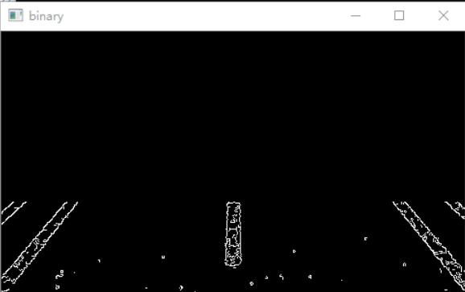
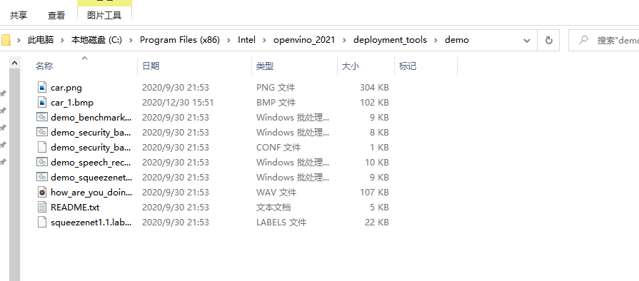
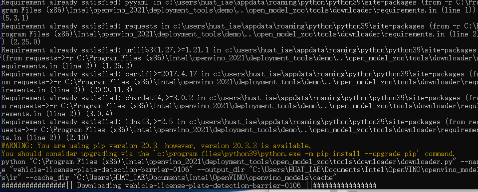

# 题目：基于opencv进行车道线检测
## OpenCV简介
Open Source Computer Vision Library（开源计算机视觉库)跨平台、轻量级而且高效、免费

OpenCV用C++语言编写，它的主要接口也是C++语言，但是依然保留了大量的初级版本的C语言接口
## 车道检测与识别系统


## 车道线特征提取:
1.二值化

2.图像边缘提取

3.透视变换
## 道路预处理
1.道路图像灰度化

2.道路图像滤波

3.道路图像增强

## 图像边缘提取:
三种边缘检测算法
1.Sobel算子:先对图像进行加权平滑处理,然后进行微分运算

2.Canny算子:先用高斯滤波去噪,对图像进行平滑处理;对平滑以后的图像分别沿x,y方向求取偏导数,来得到其边缘梯度,然后分别在边缘梯度的水平、垂直、45度和135度等四个方向上,用比较各自邻近的像素,来得到局部极大值。

3.Kirsch算子:通过在八个不同的方向上,提取图像的边缘点,来获得信息完整的图像边缘

## 霍夫变换检测直线原理
它是将原始图像空间中给定的直线上的点转换成为参数空间中的一条直线,即在原始图像中的直线上的所有点经过转换以后都会集中在变换空间中的某个点上形成峰值点。这样就将直线的检测问题简化成找寻峰值点的问题。

## 问题及解决方案 
1.一条道车线旁可能会标出几条线

解决措施:先用随机抽样一致性算法（Ransac）合并直线，比较麻烦;后来采用角度去最值的方法，效果不错。

2.检测不连续

解决措施:如果某一帧没检测出符合条件的线（特别是虚线），用上一帧结果代替。

3.视频中摄像头俯仰角变化的影响

解决措施:通过建立摄像机与车体坐标系模型来标定摄像机参数，然后在图像坐标系下，分割图像获得感兴趣区域(ROI);在ROI中提取车道线信息。

4.明显的错误检测结果的剔除

解决措施:有时候车道线明显的检测错误（如两条标记车道线交叉)，尝试用把视频图片分为左半图，右半图分别处理解决

5.算法的优化，减少每帧图片处理的平均时间

解决措施：图片压缩后再进行处理；跳帧检测

## 实验代码
``` c++
#include <opencv2/opencv.hpp>
#include <iostream>
#include <cmath>

using namespace cv;
using namespace std;

/**
**1、读取视频  
**2、二值化
**3、轮廓发现
**4、轮廓分析、面积就算，角度分析
**5、直线拟合
**6、画出直线
**
*/

Point left_line[2];
Point right_line[2];

void process(Mat &frame, Point *left_line, Point *right_line);
Mat fitLines(Mat &image, Point *left_line, Point *right_line);

int main(int argc, char** argv) {
	//读取视频
	VideoCapture capture("1.mp4");

	int height = capture.get(CAP_PROP_FRAME_HEIGHT);
	int width = capture.get(CAP_PROP_FRAME_WIDTH);
	int count = capture.get(CAP_PROP_FRAME_COUNT);
	int fps = capture.get(CAP_PROP_FPS);
	//初始化

	left_line[0] = Point(0,0);

	left_line[1] = Point(0, 0);
	
	right_line[0] = Point(0, 0);
	
	right_line[1] = Point(0, 0);

	cout << height<<"       "<< width<< "       " <<count<< "       " <<fps << endl;

	//循环读取视频
	Mat frame;
	while (true) {
		int ret = capture.read(frame);
		if (!ret) {
			break;
		}
		imshow("input", frame);
		process(frame, left_line, right_line);

		char c = waitKey(5);
		if (c == 27) {
			break;
		}
		
		
	}

}

void process(Mat &frame, Point *left_line, Point *right_line ){
	Mat gray,binary;
	/**灰度化*/
	cvtColor(frame, gray, COLOR_BGR2GRAY);
	
	//threshold(gray, binary, );
	//边缘检测
	Canny(gray, binary, 150, 300);
	//imshow("Canny", binary);
	for (size_t i = 0; i < (gray.rows/2+40); i++) {
		for (size_t j = 0; j < gray.cols; j++)
		{
			binary.at<uchar>(i, j) = 0;
		}
	}
	imshow("binary", binary);
	
	//寻找轮廓
	vector<vector<Point>> contours;
	findContours(binary, contours, RETR_EXTERNAL, CHAIN_APPROX_SIMPLE);

	Mat out_image = Mat::zeros(gray.size(), gray.type());

	for (int i = 0; i < contours.size(); i++)
	{
		
		//计算面积与周长
		double length = arcLength(contours[i], true);
		double area = contourArea(contours[i]);
		//cout << "周长 length:" << length << endl;
		//cout << "面积 area:" << area << endl;

		//外部矩形边界
		Rect rect = boundingRect(contours[i]);
		int h = gray.rows - 50;

		//轮廓分析：
		if (length < 5.0 || area < 10.0) {
			continue;
		}
		if (rect.y > h) {
			continue;
		}

		//最小包围矩形
		RotatedRect rrt = minAreaRect(contours[i]);
		//关于角度问题：https://blog.csdn.net/weixin_41887615/article/details/91411086
		
		
		//cout << "最小包围矩形 angle:" << rrt.angle << endl;

		double angle = abs(rrt.angle);
		
		//angle < 50.0 || angle>89.0

		if (angle < 20.0 || angle>84.0) {

			continue;

		}
		

		if (contours[i].size() > 5) {
			//用椭圆拟合
			RotatedRect errt = fitEllipse(contours[i]);
			//cout << "用椭圆拟合err.angle:" << errt.angle << endl;

			if ((errt.angle<5.0) || (errt.angle>160.0))
			{
				if (80.0 < errt.angle && errt.angle < 100.0) {
					continue;
				}
				
			}
		}


		//cout << "开始绘制：" << endl;
		drawContours(out_image, contours, i, Scalar(255), 2, 8);
		imshow("out_image", out_image);

	}
	Mat result = fitLines(out_image, left_line, right_line);
	imshow("result", result);

	Mat dst;
	addWeighted(frame, 0.8, result, 0.5,0, dst);
	imshow("lane-lines", dst);

}

//直线拟合
Mat fitLines(Mat &image, Point *left_line, Point *right_line) {
	int height = image.rows;
	int width = image.cols;

	Mat out = Mat::zeros(image.size(), CV_8UC3);

	int cx = width / 2;
	int cy = height / 2;

	vector<Point> left_pts;
	vector<Point> right_pts;
	Vec4f left;
	

	for (int i = 100; i < (cx-10); i++)
	{
		for (int j = cy; j < height; j++)
		{
			int pv = image.at<uchar>(j, i);
			if (pv == 255) 
			{
				left_pts.push_back(Point(i, j));
			}
		}
	}

	for (int i = cx; i < (width-20); i++)
	{
		for (int j = cy; j < height; j++)
		{
			int pv = image.at<uchar>(j, i);
			if (pv == 255)
			{
				right_pts.push_back(Point(i, j));
			}
		}
	}

	if (left_pts.size() > 2)
	{
		fitLine(left_pts, left, DIST_L1, 0, 0.01, 0.01);
		
		double k1 = left[1] / left[0];
		double step = left[3] - k1 * left[2];

		int x1 = int((height - step) / k1);
		int y2 = int((cx - 25)*k1 + step);

		Point left_spot_1 = Point(x1, height);
		Point left_spot_end = Point((cx - 25), y2);
		

		line(out, left_spot_1, left_spot_end, Scalar(0, 0, 255), 8, 8, 0);
		left_line[0] = left_spot_1;
		left_line[1] = left_spot_end;

	}
	else
	{
		line(out, left_line[0], left_line[1], Scalar(0, 0, 255), 8, 8, 0);
	}


	if (right_pts.size()>2)
	{
		
		Point spot_1 = right_pts[0];
		Point spot_end = right_pts[right_pts.size()-1];

		int x1 = spot_1.x;
		
		int y1 = spot_1.y;

		int x2 = spot_end.x;
		int y2 = spot_end.y;

	

		line(out, spot_1, spot_end, Scalar(0, 0, 255), 8, 8, 0);
		right_line[0] = spot_1;
		right_line[1] = spot_end;

	}
	else
	{
		line(out, right_line[0], right_line[1], Scalar(0, 0, 255), 8, 8, 0);
	}

	return out;}
 ```


实现的功能：实现了车道线检测的基本功能，反透视变换矩阵实现了但效

缺点：整个识别系统都是固定的参数，只能在特定的环境产生良好的效果。

改进空间：提取全部关键参数，每次对ROI图像进行快速扫描更新参数，否则使用默认参数。例如，可以选择每次5间隔取点，以像素最高点的85%作为该次二值化的阈值。从而做到动态车道线识别。
## 实验结果





## 总结
经过包括图像ROI提取、图像灰度化处理、图像降噪、图像阈值分割、canny算子边缘提取、霍夫变换检测直线、与原图结合的最终图片等步骤，通过OpenCV，最终得到了车道线的检测与识别。
实验的不足之处主要有:

a）对于车道线实线、虚线的识别未作出相应的算法，故识别效果会不准确;

b)实际路况中会存在转弯等状况，本文未作涉及，在实际应用中会有所欠缺;

c）实际道路状况车道线会因各种原因残缺以及其他物体的遮挡，按照本文的处理方法，处理出的车道线会有残缺。
d）夜间光线暗的情况下，噪点增多，系统处理精

通过这次实验的选题、制作、报告撰写，可以说把之前所学到的计算机图像处理的内容重新回顾以及学习了一遍。更加透彻地知道了边缘检测的方法的优缺，以及明白了在什么样的需求之下，可以采用什么样的方法。
以车道线的检测为题，实验主要用到了车道线的直线特征，但是行车环境往往是很复杂的，仅仅凭借一个特征很难讲车道线正确识别出来。后续可以继续加入其它的特征与识别方法。比如一般车道线是白色与黄色的，因此可以加入颜色信息进行判断，车道线与路面还可以进行纹理检测。鉴于时间及能力所限，仅对直线这一特征进行判断，效果并不是很理想。

## 心得体会
这次实验完成的过程中也遇到了诸多麻烦，比如最开始的配置环境，各个算法的选取，在选定算法之后各个参数的选取，题目的选取等，但是，最终在老师和同学的帮助下都得到了很好的解决。我对于opencv的也有了更深一步的理解。


# 题目：基于openvino进行车辆识别


## 实验代码
```
:: Copyright (C) 2018-2019 Intel Corporation
:: SPDX-License-Identifier: Apache-2.0

@echo off
setlocal enabledelayedexpansion

set TARGET=CPU
set SAMPLE_OPTIONS=
set BUILD_FOLDER=%USERPROFILE%\Documents\Intel\OpenVINO

:: command line arguments parsing
:input_arguments_loop
if not "%1"=="" (
    if "%1"=="-d" (
        set TARGET=%2
        echo target = !TARGET!
        shift
    )
    if "%1"=="-sample-options" (
        set SAMPLE_OPTIONS=%2 %3 %4 %5 %6
        echo sample_options = !SAMPLE_OPTIONS!
        shift
    )
    if "%1"=="-help" (
        echo %~n0%~x0 is security barrier camera demo that showcases three models coming with the product
        echo.
        echo Options:
        echo -d name     Specify the target device to infer on; CPU, GPU, FPGA, HDDL or MYRIAD are acceptable. Sample will look for a suitable plugin for device specified
        exit /b
    )
    shift
    goto :input_arguments_loop
)

set ROOT_DIR=%~dp0

set target_image_path=%ROOT_DIR%car_1.bmp


set TARGET_PRECISION=FP16


echo target_precision = !TARGET_PRECISION!

if exist "%ROOT_DIR%..\..\bin\setupvars.bat" (
    call "%ROOT_DIR%..\..\bin\setupvars.bat"
) else (
    echo setupvars.bat is not found, INTEL_OPENVINO_DIR can't be set
    goto error
)

echo INTEL_OPENVINO_DIR is set to %INTEL_OPENVINO_DIR%

:: Check if Python is installed
python --version 2>NUL
if errorlevel 1 (
   echo Error^: Python is not installed. Please install Python 3.5 ^(64-bit^) or higher from https://www.python.org/downloads/
   goto error
)

:: Check if Python version is equal or higher 3.4
for /F "tokens=* USEBACKQ" %%F IN (`python --version 2^>^&1`) DO (
   set version=%%F
)
echo %var%

for /F "tokens=1,2,3 delims=. " %%a in ("%version%") do (
   set Major=%%b
   set Minor=%%c
)

if "%Major%" geq "3" (
   if "%Minor%" geq "5" (
  set python_ver=okay
   )
)
if not "%python_ver%"=="okay" (
   echo Unsupported Python version. Please install Python 3.5 ^(64-bit^) or higher from https://www.python.org/downloads/
   goto error
)

:: install yaml python modules required for downloader.py
pip3 install --user -r "%ROOT_DIR%..\open_model_zoo\tools\downloader\requirements.in"
if ERRORLEVEL 1 GOTO errorHandling


set models_path=%BUILD_FOLDER%\openvino_models\ir
set models_cache=%BUILD_FOLDER%\openvino_models\cache

if not exist "%models_cache%" (
  mkdir "%models_cache%"
)

set downloader_dir=%INTEL_OPENVINO_DIR%\deployment_tools\open_model_zoo\tools\downloader

for /F "tokens=1,2 usebackq" %%a in ("%ROOT_DIR%demo_security_barrier_camera.conf") do (
   echo python "%downloader_dir%\downloader.py" --name "%%b" --output_dir "%models_path%" --cache_dir "%models_cache%"
   python "%downloader_dir%\downloader.py" --name "%%b" --output_dir "%models_path%" --cache_dir "%models_cache%"

   for /F "tokens=* usebackq" %%d in (
      `python "%downloader_dir%\info_dumper.py" --name "%%b" ^|
         python -c "import sys, json; print(json.load(sys.stdin)[0]['subdirectory'])"`
   ) do (
      set model_args=!model_args! %%a "%models_path%\%%d\%target_precision%\%%b.xml"
   )
)

echo.
echo ###############^|^| Generate VS solution for Inference Engine demos using cmake ^|^|###############
echo.
timeout 3

if "%PROCESSOR_ARCHITECTURE%" == "AMD64" (
   set "PLATFORM=x64"
) else (
   set "PLATFORM=Win32"
)

set VSWHERE="false"
if exist "%ProgramFiles(x86)%\Microsoft Visual Studio\Installer\vswhere.exe" (
   set VSWHERE="true"
   cd "%ProgramFiles(x86)%\Microsoft Visual Studio\Installer"
) else if exist "%ProgramFiles%\Microsoft Visual Studio\Installer\vswhere.exe" (
      set VSWHERE="true"
      cd "%ProgramFiles%\Microsoft Visual Studio\Installer"
) else (
   echo "vswhere tool is not found"
)

set MSBUILD_BIN=
set VS_PATH=

if !VSWHERE! == "true" (
   for /f "usebackq tokens=*" %%i in (`vswhere -latest -products * -requires Microsoft.Component.MSBuild -property installationPath`) do (
      set VS_PATH=%%i
   )
   if exist "!VS_PATH!\MSBuild\14.0\Bin\MSBuild.exe" (
      set "MSBUILD_BIN=!VS_PATH!\MSBuild\14.0\Bin\MSBuild.exe"
   )
   if exist "!VS_PATH!\MSBuild\15.0\Bin\MSBuild.exe" (
      set "MSBUILD_BIN=!VS_PATH!\MSBuild\15.0\Bin\MSBuild.exe"
   )
   if exist "!VS_PATH!\MSBuild\Current\Bin\MSBuild.exe" (
      set "MSBUILD_BIN=!VS_PATH!\MSBuild\Current\Bin\MSBuild.exe"
   )
)

if "!MSBUILD_BIN!" == "" (
   if exist "C:\Program Files (x86)\MSBuild\14.0\Bin\MSBuild.exe" (
      set "MSBUILD_BIN=C:\Program Files (x86)\MSBuild\14.0\Bin\MSBuild.exe"
      set "MSBUILD_VERSION=14 2015"
   )
   if exist "C:\Program Files (x86)\Microsoft Visual Studio\2017\BuildTools\MSBuild\15.0\Bin\MSBuild.exe" (
      set "MSBUILD_BIN=C:\Program Files (x86)\Microsoft Visual Studio\2017\BuildTools\MSBuild\15.0\Bin\MSBuild.exe"
      set "MSBUILD_VERSION=15 2017"
   )
   if exist "C:\Program Files (x86)\Microsoft Visual Studio\2017\Professional\MSBuild\15.0\Bin\MSBuild.exe" (
      set "MSBUILD_BIN=C:\Program Files (x86)\Microsoft Visual Studio\2017\Professional\MSBuild\15.0\Bin\MSBuild.exe"
      set "MSBUILD_VERSION=15 2017"
   )
   if exist "C:\Program Files (x86)\Microsoft Visual Studio\2017\Community\MSBuild\15.0\Bin\MSBuild.exe" (
      set "MSBUILD_BIN=C:\Program Files (x86)\Microsoft Visual Studio\2017\Community\MSBuild\15.0\Bin\MSBuild.exe"
      set "MSBUILD_VERSION=15 2017"
   )
) else (
   if not "!MSBUILD_BIN:2019=!"=="!MSBUILD_BIN!" set "MSBUILD_VERSION=16 2019"
   if not "!MSBUILD_BIN:2017=!"=="!MSBUILD_BIN!" set "MSBUILD_VERSION=15 2017"
   if not "!MSBUILD_BIN:2015=!"=="!MSBUILD_BIN!" set "MSBUILD_VERSION=14 2015"
)

if "!MSBUILD_BIN!" == "" (
   echo Build tools for Visual Studio 2015 / 2017 / 2019 cannot be found. If you use Visual Studio 2017 / 2019, please download and install build tools from https://www.visualstudio.com/downloads/#build-tools-for-visual-studio-2017
   GOTO errorHandling
)

set "SOLUTION_DIR64=%BUILD_FOLDER%\inference_engine_demos_build"

echo Creating Visual Studio !MSBUILD_VERSION! %PLATFORM% files in %SOLUTION_DIR64%... && ^
if exist "%SOLUTION_DIR64%\CMakeCache.txt" del "%SOLUTION_DIR64%\CMakeCache.txt"
cd "%INTEL_OPENVINO_DIR%\deployment_tools\inference_engine\demos" && cmake -E make_directory "%SOLUTION_DIR64%" && cd "%SOLUTION_DIR64%" && cmake -G "Visual Studio !MSBUILD_VERSION!" -A %PLATFORM% "%INTEL_OPENVINO_DIR%\deployment_tools\inference_engine\demos"
if ERRORLEVEL 1 GOTO errorHandling

timeout 7
echo.
echo ###############^|^| Build Inference Engine demos using MS Visual Studio (MSBuild.exe) ^|^|###############
echo.
timeout 3
echo "!MSBUILD_BIN!" Demos.sln /p:Configuration=Release /t:security_barrier_camera_demo /clp:ErrorsOnly /m
"!MSBUILD_BIN!" Demos.sln /p:Configuration=Release /t:security_barrier_camera_demo /clp:ErrorsOnly /m
if ERRORLEVEL 1 GOTO errorHandling

timeout 7

:runSample
echo.
echo ###############^|^| Run Inference Engine security barrier camera demo ^|^|###############
echo.
timeout 3
cd "%SOLUTION_DIR64%\intel64\Release"
echo "%SOLUTION_DIR64%\intel64\Release\security_barrier_camera_demo.exe" -i "%target_image_path%" %model_args% -d !TARGET! -d_va !TARGET! -d_lpr !TARGET! !SAMPLE_OPTIONS!
security_barrier_camera_demo.exe -i "%target_image_path%" %model_args% ^
                                 -d !TARGET! -d_va !TARGET! -d_lpr !TARGET! !SAMPLE_OPTIONS!
if ERRORLEVEL 1 GOTO errorHandling

echo.
echo ###############^|^| Demo completed successfully ^|^|###############
cd "%ROOT_DIR%"

goto :eof

:errorHandling
echo Error
cd "%ROOT_DIR%"
```
## 实验步骤




## 实验结果

