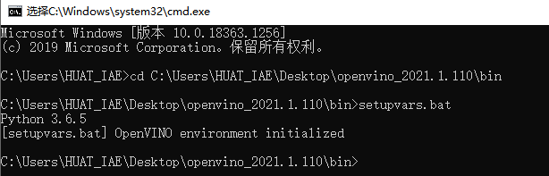
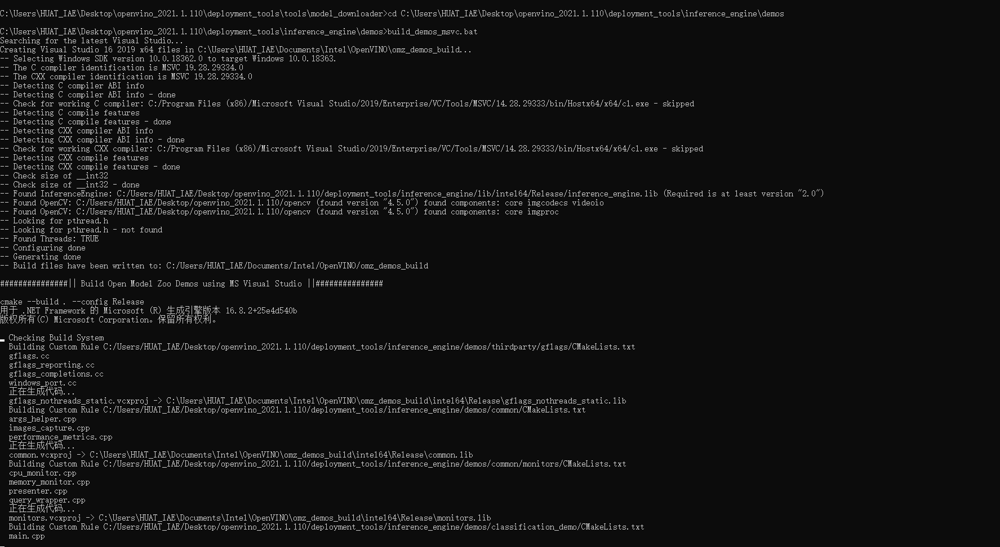
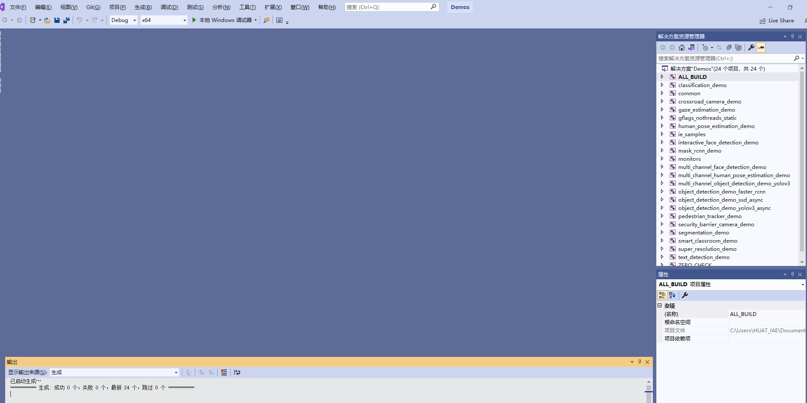
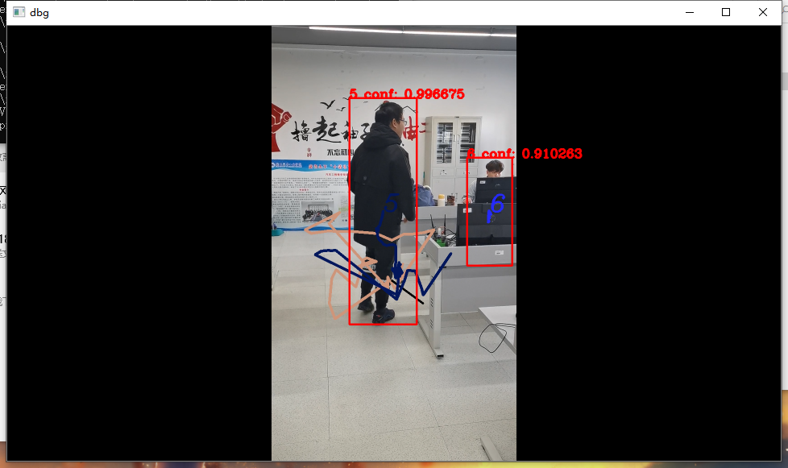

## openvino 设计报告

### openvino 简述

OpenVINO™视觉库(CVSDK)可快速部署模拟人类视觉的应用程序和解决方案。主要包括基于卷积神经网络（CNN）推断模块IE，可以部署深度学习模型部署工具包(DLDT)。

 - 下载地址及预览
 - https://docs.openvinotoolkit.org/latest/index.html
 - 

OpenVINO模块：

IE推断引擎，在边缘启用基于CNN的深度学习推理

支持跨英特尔®CPU，英特尔®集成显卡，英特尔®FPGA，英特尔®Movidius™神经计算棒，英特尔®神经计算棒2和采用英特尔®Movidius™VPU的英特尔®视觉加速器设计的异构执行

预训练模型库与转换工具，通过易于使用的计算机视觉功能库和预优化的内核，加快产品上市速度

第三方视觉库的集成调用。针对计算机视觉标准的优化调用，包括OpenCV，OpenCL和OpenVX

### 实验步骤

1. 创建openvino临时环境



2. 下载实验模型，行人检测需要的是person-detection-retail-0013和person-reidentification-retail-0031

 - 使用命令： python downloader.py --name（模型名） --output_dir（目标文件夹）
 - 命令在根目录下运行，示例路径为 C:\Users\xxx\Desktop\openvino_2021.1.110\deployment_tools\tools\model_downloader（xxx为用户文件夹）
   


3. 运行命令build_demos_msvc.bat,通过visual studio生成可执行文件





4. 运行命令，执行训练
   
pedestrian_tracker_demo.exe -i C:\Users\HUAT_IAE\Desktop\1.mp4 -m_det C:\Users\HUAT_IAE\Desktop\model\intel\person-detection-retail-0013\FP32\person-detection-retail-0013.xml -m_reid C:\Users\HUAT_IAE\Desktop\model\intel\person-reidentification-retail-0031\FP32\person-reidentification-retail-0031.xml -d_det CPU


5. 运行效果截图




```c++
代码内容：

#include "core.hpp"
#include "utils.hpp"
#include "tracker.hpp"
#include "descriptor.hpp"
#include "distance.hpp"
#include "detector.hpp"
#include "pedestrian_tracker_demo.hpp"
#include <monitors/presenter.h>
#include <opencv2/core.hpp>
#include <iostream>
#include <utility>
#include <vector>
#include <map>
#include <memory>
#include <string>
#include <gflags/gflags.h>

using namespace InferenceEngine;
using ImageWithFrameIndex = std::pair<cv::Mat, int>;

std::unique_ptr<PedestrianTracker>
CreatePedestrianTracker(const std::string& reid_model,
                        const InferenceEngine::Core & ie,
                        const std::string & deviceName,
                        bool should_keep_tracking_info) {
    TrackerParams params;

    if (should_keep_tracking_info) {
        params.drop_forgotten_tracks = false;
        params.max_num_objects_in_track = -1;
    }

    std::unique_ptr<PedestrianTracker> tracker(new PedestrianTracker(params));

std::shared_ptr<IImageDescriptor> descriptor_fast =
        std::make_shared<ResizedImageDescriptor>(
            cv::Size(16, 32), cv::InterpolationFlags::INTER_LINEAR);
    std::shared_ptr<IDescriptorDistance> distance_fast =
        std::make_shared<MatchTemplateDistance>();

    tracker->set_descriptor_fast(descriptor_fast);
    tracker->set_distance_fast(distance_fast);

    if (!reid_model.empty()) {
        CnnConfig reid_config(reid_model);
        reid_config.max_batch_size = 16;


std::shared_ptr<IImageDescriptor> descriptor_strong =
            std::make_shared<DescriptorIE>(reid_config, ie, deviceName);

        if (descriptor_strong == nullptr) {
            THROW_IE_EXCEPTION << "[SAMPLES] internal error - invalid descriptor";
        }
        std::shared_ptr<IDescriptorDistance> distance_strong =
            std::make_shared<CosDistance>(descriptor_strong->size());

        tracker->set_descriptor_strong(descriptor_strong);
        tracker->set_distance_strong(distance_strong);
    } else {
        std::cout << "WARNING: Reid model "
            << "was not specified. "
            << "Only fast reidentification approach will be used." << std::endl;
    }

    return tracker;
}

int main(int argc, char **argv) {
    try {
        std::cout << "InferenceEngine: " << GetInferenceEngineVersion() << std::endl;

        if (!ParseAndCheckCommandLine(argc, argv)) {
            return 0;
        }

        auto det_model = FLAGS_m_det;
        auto reid_model = FLAGS_m_reid;

        auto detlog_out = FLAGS_out;

        auto detector_mode = FLAGS_d_det;
        auto reid_mode = FLAGS_d_reid;

        auto custom_cpu_library = FLAGS_l;
        auto path_to_custom_layers = FLAGS_c;
        bool should_use_perf_counter = FLAGS_pc;

        bool should_print_out = FLAGS_r;

        bool should_show = !FLAGS_no_show;
        int delay = FLAGS_delay;
        if (!should_show)
            delay = -1;
        should_show = (delay >= 0);

        bool should_save_det_log = !detlog_out.empty();

        if ((FLAGS_last >= 0) && (FLAGS_first > FLAGS_last)) {
            throw std::runtime_error("The first frame index (" + std::to_string(FLAGS_first) + ") must be greater than the "
                "last frame index (" + std::to_string(FLAGS_last) + ')');
        }

        std::vector<std::string> devices{detector_mode, reid_mode};
        InferenceEngine::Core ie =
            LoadInferenceEngine(
                devices, custom_cpu_library, path_to_custom_layers,
                should_use_perf_counter);

        DetectorConfig detector_confid(det_model);
        ObjectDetector pedestrian_detector(detector_confid, ie, detector_mode);

        bool should_keep_tracking_info = should_save_det_log || should_print_out;
        std::unique_ptr<PedestrianTracker> tracker =
            CreatePedestrianTracker(reid_model, ie, reid_mode,
                                    should_keep_tracking_info);

        cv::VideoCapture cap;
        try {
            int intInput = std::stoi(FLAGS_i);
            if (!cap.open(intInput)) {
                throw std::runtime_error("Can't open " + std::to_string(intInput));
            }
        } catch (const std::invalid_argument&) {
            if (!cap.open(FLAGS_i)) {
                throw std::runtime_error("Can't open " + FLAGS_i);
            }
        } catch (const std::out_of_range&) {
            if (!cap.open(FLAGS_i)) {
                throw std::runtime_error("Can't open " + FLAGS_i);
            }
        }
        double video_fps = cap.get(cv::CAP_PROP_FPS);
        if (0.0 == video_fps) {
           

if (0 >= FLAGS_first && !cap.set(cv::CAP_PROP_POS_FRAMES, FLAGS_first)) {
            throw std::runtime_error("Can't set the frame to begin with");
        }

        std::cout << "To close the application, press 'CTRL+C' here";
        if (!FLAGS_no_show) {
            std::cout << " or switch to the output window and press ESC key";
        }
        std::cout << std::endl;

        cv::Size graphSize{static_cast<int>(cap.get(cv::CAP_PROP_FRAME_WIDTH) / 4), 60};
        Presenter presenter(FLAGS_u, 10, graphSize);

        for (int32_t frame_idx = std::max(0, FLAGS_first); 0 > FLAGS_last || frame_idx <= FLAGS_last; ++frame_idx) {
            cv::Mat frame;
            if (!cap.read(frame)) {
                break;
            }

            pedestrian_detector.submitFrame(frame, frame_idx);
            pedestrian_detector.waitAndFetchResults();

            TrackedObjects detections = pedestrian_detector.getResults();

            uint64_t cur_timestamp = static_cast<uint64_t >(1000.0 / video_fps * frame_idx);
            tracker->Process(frame, detections, cur_timestamp);

            presenter.drawGraphs(frame);

            if (should_show) {
              
                frame = tracker->DrawActiveTracks(frame);

               
                for (const auto &detection : detections) {
                    cv::rectangle(frame, detection.rect, cv::Scalar(255, 0, 0), 3);
                }

                
                for (const auto &detection : tracker->TrackedDetections()) {
                    cv::rectangle(frame, detection.rect, cv::Scalar(0, 0, 255), 3);
                    std::string text = std::to_string(detection.object_id) +
                        " conf: " + std::to_string(detection.confidence);
                    cv::putText(frame, text, detection.rect.tl(), cv::FONT_HERSHEY_COMPLEX,
                                1.0, cv::Scalar(0, 0, 255), 3);
                }
                cv::resize(frame, frame, cv::Size(), 0.5, 0.5);
                cv::imshow("dbg", frame);
                char k = cv::waitKey(delay);
                if (k == 27)
                    break;
                presenter.handleKey(k);
            }

            if (should_save_det_log && (frame_idx % 100 == 0)) {
                DetectionLog log = tracker->GetDetectionLog(true);
                SaveDetectionLogToTrajFile(detlog_out, log);
            }
        }

        if (should_keep_tracking_info) {
            DetectionLog log = tracker->GetDetectionLog(true);

            if (should_save_det_log)
                SaveDetectionLogToTrajFile(detlog_out, log);
            if (should_print_out)
                PrintDetectionLog(log);
        }
        if (should_use_perf_counter) {
            pedestrian_detector.PrintPerformanceCounts(getFullDeviceName(ie, FLAGS_d_det));
            tracker->PrintReidPerformanceCounts(getFullDeviceName(ie, FLAGS_d_reid));
        }

        std::cout << presenter.reportMeans() << '\n';
    }
    catch (const std::exception& error) {
        std::cerr << "[ ERROR ] " << error.what() << std::endl;
        return 1;
    }
    catch (...) {
        std::cerr << "[ ERROR ] Unknown/internal exception happened." << std::endl;
        return 1;
    }

    std::cout << "Execution successful" << std::endl;

    return 0;
}
```
分析：

1. 代码库文件区，需要opencv2等其他库支持，包括intel自家的core库
2. 在识别区主要运用的是cv库，通过opencv的图像处理实现跟踪识别
3. 函数部分不仅可以识别图片，还能逐帧识别avi和mp4文件

总结：

1. 实验思路基本上继续遵循深度学习的基本思路，环境，模型，训练，应用
2. openvino提供的模型功能强大，通过模型训练可以解决大多数的问题
3. 支持图片格式和影像格式，该次实验应用的是mp4格式
4. 识别文件大小不建议设置太大，视频会出现明显的卡顿
5. 更新之后，过去的永久设置环境变量方法失效，请参考别的方法

心得：

- openvino的demo和simple库的功能强大，涉及的方面也比较多，从人像追踪和图像识别都能有简单的例程供测试和修改。除此之外，openvino的例程库还在补充之中，通过downloader可以下载新的模型文件。但是在openvino的使用过程中也实际的感受到了阻力，包括本次实验需要的031模型，通过国内网是无法下载的，官方的downloader的组件在国内环境中作用有限。