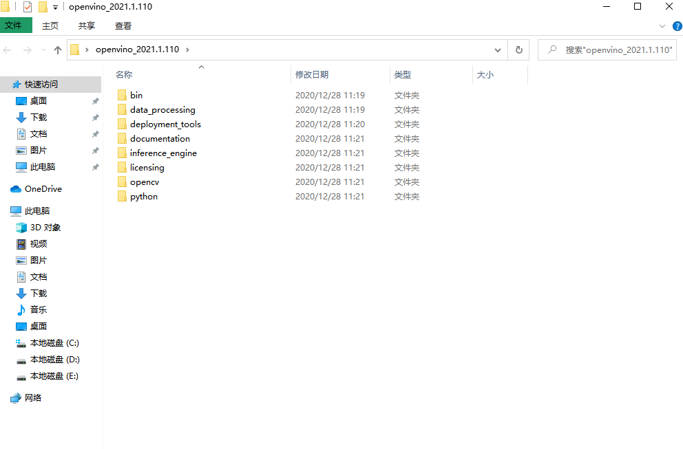
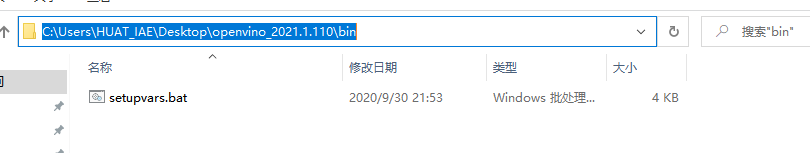
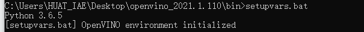
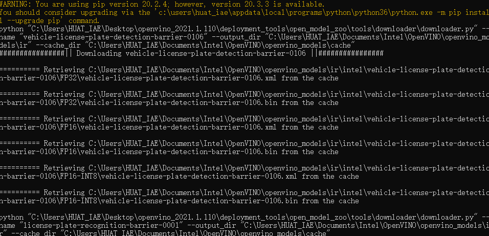
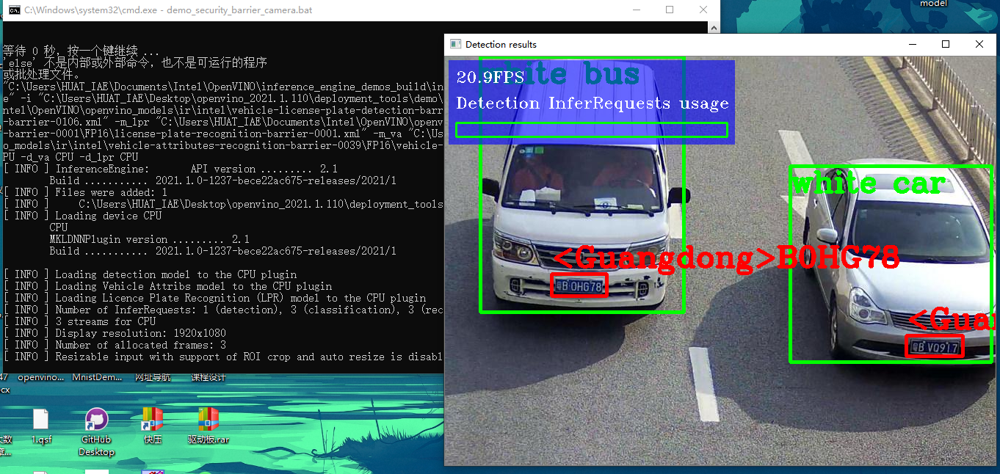

## 课程设计 (基于openVINO的图像处理，检测和识别)    

这次课程设计的主要目的是实现对车牌的识别以及对车辆类型，颜色的识别。这是人工智能领域一个非常重要的功能。

### openvino下载安装

从官网上可以直接下载openvin 但是这里面有CMake没有添加进去，所以下载完再把CMake下载添加。

#### 截图



进行环境的配置，你可以选择在环境变量里配置永久环境，也可以在每次使用终端都配置一次暂时环境。

在终端cd C:\Users\HUAT_IAE\Desktop\openvino_2021.1.110\bin
再执行setupvars.bat




#### 识别车辆

通过openvino这个系统可以识别车辆的颜色，类型以及车牌的数字省份。

##### 代码实现（部分代码节选）
1.引入一些库（尺寸，图形，颜色等等）
```Python
#include <algorithm>
#include <chrono>
#include <iomanip>
#include <list>
#include <map>
#include <memory>
#include <stdexcept>
#include <string>
#include <utility>
#include <vector>
#include <set>

#include <cldnn/cldnn_config.hpp>
#include <inference_engine.hpp>
#include <vpu/vpu_plugin_config.hpp>
#include <monitors/presenter.h>
#include <samples/args_helper.hpp>
#include <samples/ocv_common.hpp>
#include <samples/slog.hpp>

#include "common.hpp"
#include "grid_mat.hpp"
#include "input_wrappers.hpp"
#include "security_barrier_camera_demo.hpp"
#include "net_wrappers.hpp"
```
2.函数长宽高的设定
```Python
if (FLAGS_display_resolution.find("x") == std::string::npos) {
        throw std::logic_error("Incorrect format of -displayresolution parameter. Correct format is  \"width\"x\"height\". For example \"1920x1080\"");
    }
```
3.图像捕捉
```Python
struct {
        std::vector<std::shared_ptr<InputChannel>> inputChannels;
        std::vector<int64_t> lastCapturedFrameIds;
        std::vector<std::mutex> lastCapturedFrameIdsMutexes;
        std::weak_ptr<Worker> readersWorker;
    } readersContext;
```
4.运行实例
```Python
case BboxAndDescr::ObjectType::NONE: cv::rectangle(sharedVideoFrame->frame, bboxAndDescr.rect, {255, 255, 0},  4);
break;
case BboxAndDescr::ObjectType::VEHICLE: cv::rectangle(sharedVideoFrame->frame, bboxAndDescr.rect, {0, 255, 0},  4);
cv::putText(sharedVideoFrame->frame, bboxAndDescr.descr,
cv::Point{bboxAndDescr.rect.x, bboxAndDescr.rect.y + 35},cv::FONT_HERSHEY_COMPLEX, 1.3, cv::Scalar(0, 255, 0), 4);
break;
case BboxAndDescr::ObjectType::PLATE: cv::rectangle(sharedVideoFrame->frame, bboxAndDescr.rect, {0, 0, 255},  4);
cv::putText(sharedVideoFrame->frame, bboxAndDescr.descr,
cv::Point{bboxAndDescr.rect.x, bboxAndDescr.rect.y - 10},
cv::FONT_HERSHEY_COMPLEX, 1.3, cv::Scalar(0, 0, 255), 4);
 break;
default: throw std::exception();  // must never happen
break;
 }
  }
 tryPush(context.drawersContext.drawersWorker, std::make_shared<Drawer>(sharedVideoFrame));
    } else {
        if (!context.isVideo) {
           try {
                std::shared_ptr<Worker>(context.drawersContext.drawersWorker)->stop();
            } catch (const std::bad_weak_ptr&) {}
        }
    }
}

bool DetectionsProcessor::isReady() {
    Context& context = static_cast<ReborningVideoFrame*>(sharedVideoFrame.get())->context;
    if (requireGettingNumberOfDetections) {
        classifiersAggregator = std::make_shared<ClassifiersAggregator>(sharedVideoFrame);
        std::list<Detector::Result> results;
        if (!(FLAGS_r && ((sharedVideoFrame->frameId == 0 && !context.isVideo) || context.isVideo))) {
            results = context.inferTasksContext.detector.getResults(*inferRequest, sharedVideoFrame->frame.size());
        } else {
            std::ostringstream rawResultsStream;
            results = context.inferTasksContext.detector.getResults(*inferRequest, sharedVideoFrame->frame.size(), &rawResultsStream);
            classifiersAggregator->rawDetections = rawResultsStream.str();
        }
        for (Detector::Result result : results) {
            switch (result.label) {
                case 1:
                {
                    vehicleRects.emplace_back(result.location & cv::Rect{cv::Point(0, 0), sharedVideoFrame->frame.size()});
                    break;
                }
                case 2:
                {
                    // expanding a bounding box a bit, better for the license plate recognition
                    result.location.x -= 5;
                    result.location.y -= 5;
                    result.location.width += 10;
                    result.location.height += 10;
                    plateRects.emplace_back(result.location & cv::Rect{cv::Point(0, 0), sharedVideoFrame->frame.size()});
                    break;
                }
                default: throw std::exception();  // must never happen
                         break;
            }
        }
        context.detectorsInfers.inferRequests.lockedPush_back(*inferRequest);
        requireGettingNumberOfDetections = false;
    }

    if ((vehicleRects.empty() || FLAGS_m_va.empty()) && (plateRects.empty() || FLAGS_m_lpr.empty())) {
        return true;
    } else {
        // isReady() is called under mutexes so it is assured that available InferRequests will not be taken, but new InferRequests can come in
        // acquire as many InferRequests as it is possible or needed
        InferRequestsContainer& attributesInfers = context.attributesInfers;
        attributesInfers.inferRequests.mutex.lock();
        const std::size_t numberOfAttributesInferRequestsAcquired = std::min(vehicleRects.size(), attributesInfers.inferRequests.container.size());
        reservedAttributesRequests.assign(attributesInfers.inferRequests.container.end() - numberOfAttributesInferRequestsAcquired,
                                          attributesInfers.inferRequests.container.end());
        attributesInfers.inferRequests.container.erase(attributesInfers.inferRequests.container.end() - numberOfAttributesInferRequestsAcquired,
                                                       attributesInfers.inferRequests.container.end());
        attributesInfers.inferRequests.mutex.unlock();

        InferRequestsContainer& platesInfers = context.platesInfers;
        platesInfers.inferRequests.mutex.lock();
        const std::size_t numberOfLprInferRequestsAcquired = std::min(plateRects.size(), platesInfers.inferRequests.container.size());
        reservedLprRequests.assign(platesInfers.inferRequests.container.end() - numberOfLprInferRequestsAcquired, platesInfers.inferRequests.container.end());
        platesInfers.inferRequests.container.erase(platesInfers.inferRequests.container.end() - numberOfLprInferRequestsAcquired,
                                                   platesInfers.inferRequests.container.end());
        platesInfers.inferRequests.mutex.unlock();
        return numberOfAttributesInferRequestsAcquired || numberOfLprInferRequestsAcquired;
    }
}

```
### 实验结果展示




识别出来俩个车辆都是白色，广东省 以及一个bus一个car。

### 总结

我感觉这个还是存在一点问题，这个实例代码并不是很灵活，有一些汽车是识别不出来的，包括他的运行代码，可以作为我们参考的基础。里面涉及了对车辆颜色识别的函数，以及如何调用他们。
如果车辆过于靠近，就会识别不出来。而且我发现车辆越模糊，车牌识别的正确率也越高。

### 心得体会

这次实验让我又一次加深了对人工智能的了解，龚老师之前教过我们做jetbot小车实验，当时就感觉到了小车是如何跟踪人的，如何识别障碍的。这回通过openVINO的车辆识别技术，让我知道了高速公路上，那些摄像头是如何运行的。识别的是否清晰。接下来，我会更加努力的学习关于人工智能方面的知识。
