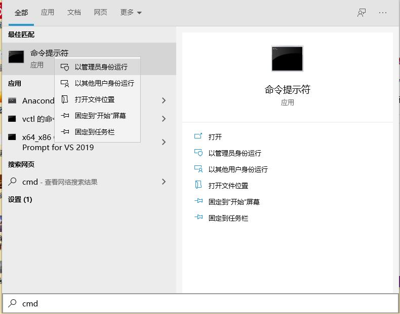
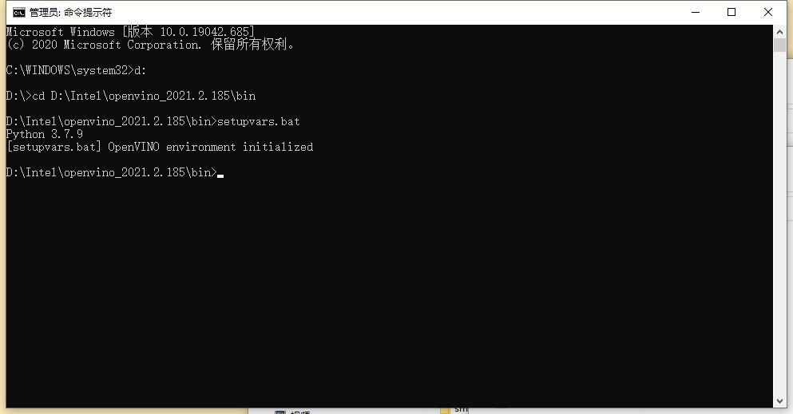
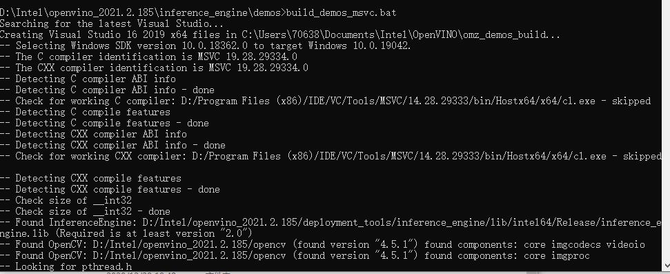
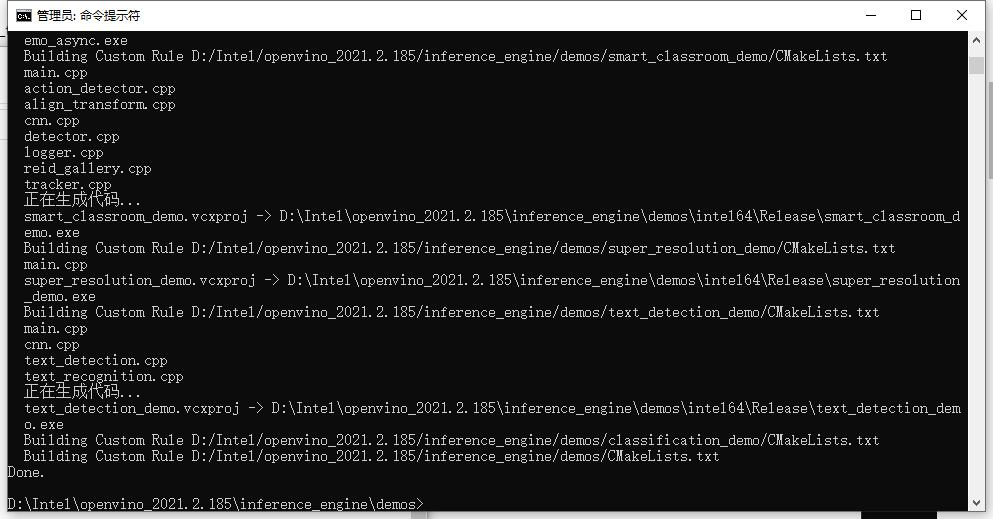
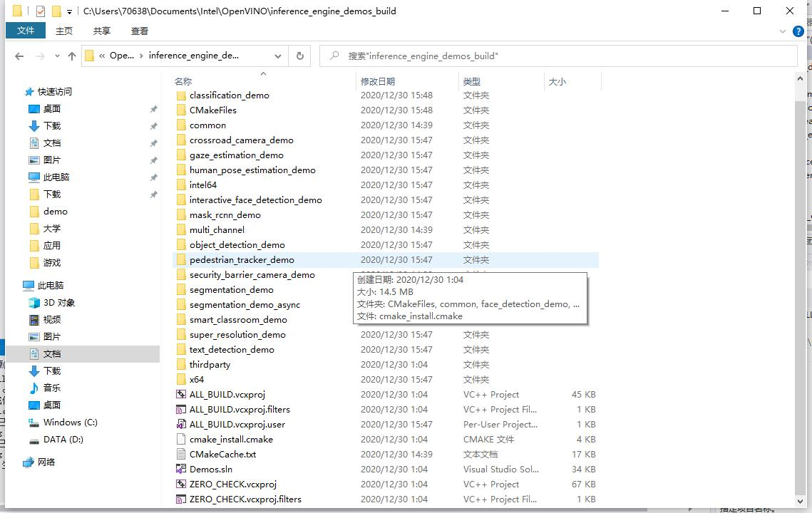
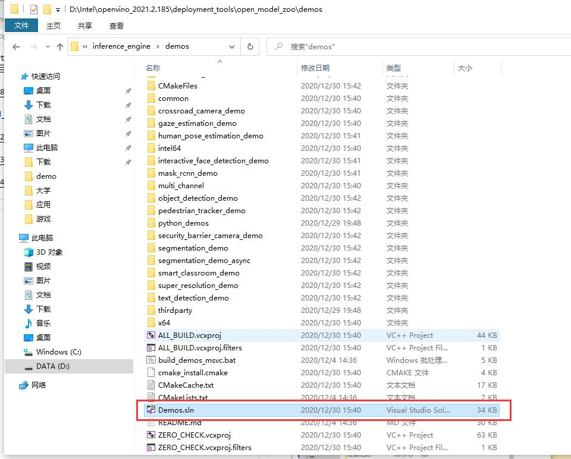
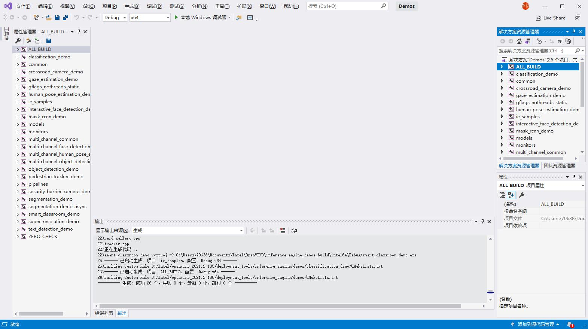
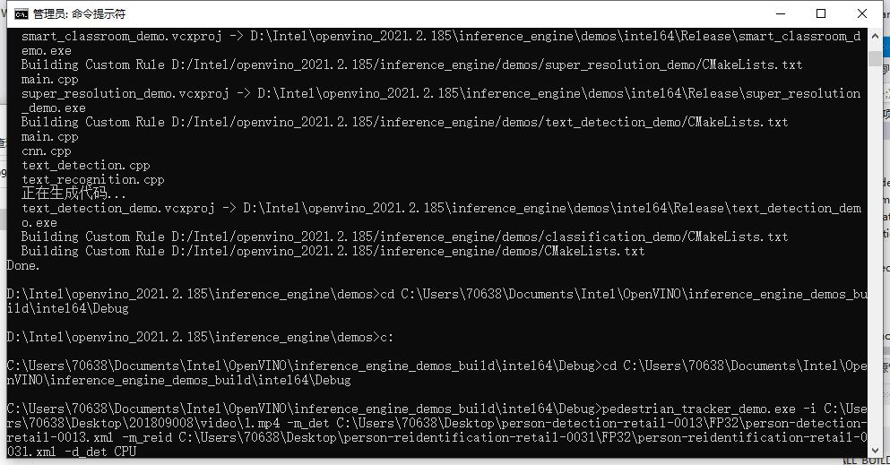
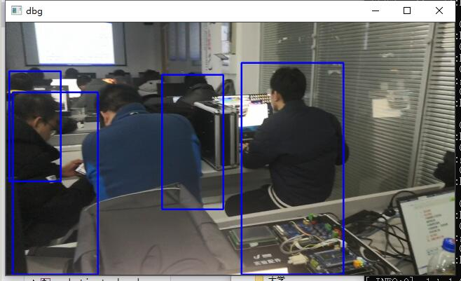

# 设计报告

## openvino

**概述：**

OpenVINO是英特尔基于自身现有的硬件平台开发的一种可以加快高性能计算机视觉和深度学习视觉应用开发速度工具套件，支持各种英特尔平台的硬件加速器上进行深度学习，并且允许直接异构执行。 支持在Windows与Linux系统，Python/C++语言。

**主要特点：**

* 在Intel平台上提升计算机视觉相关深度学习性能达19倍以上
* 解除CNN-based的网络在边缘设备的性能瓶颈
* 对OpenCV，OpenXV*视觉库的传统API实现加速与优化
* 基于通用API接口在CPU、GPU、FPGA等设备上运行加上

OpenVINO工具包(ToolKit)主要包括两个核心组件，模型优化器(Model Optimizer)和（Model Optimizer）。

**模型优化器(Model Optimizer)**

模型优化器(Model Optimizer)将给定的模型转化为标准的 Intermediate Representation (IR) ，并对模型优化。
模型优化器支持的深度学习框架：

* ONNX 
* TensorFlow
* Caffe
* MXNet
* Kaldi

**推断引擎(Inference Engine)**

推断引擎(Inference Engine)支持硬件指令集层面的深度学习模型加速运行，同时对传统的OpenCV图像处理库也进行了指令集优化，有显著的性能与速度提升。
支持的硬件设备：

* CPU
* GPU
* FPGA
* VPU

## 实验步骤

1.安装openvino组件

2.搭建临时环境

>用管理员模式打开CMD



>进入openvino文件夹bin，运行setupvars.bat



运行完后，临时的openvino环境就搭建好了，关闭CMD窗口后，临时环境自动恢复。

3.下载实验模型

person-detection-retail-0013

person-reidentification-retail-0031

- 使用命令： python downloader.py --name（模型名） --output_dir（目标文件夹）


4.运行文件build_demos_msvc.bat







5.运行生成的sln文件





6.运行命令，执行训练

pedestrian_tracker_demo.exe -i C:\Users\70638\Desktop\201809008\video\1.mp4 -m_det C:\Users\70638\Desktop\person-detection-retail-0013\FP32\person-detection-retail-0013.xml -m_reid C:\Users\70638\Desktop\person-reidentification-retail-0031\FP32\person-reidentification-retail-0031.xml -d_det CPU

7.运行结果





实验代码

```c++
#include "core.hpp"
#include "utils.hpp"
#include "tracker.hpp"
#include "descriptor.hpp"
#include "distance.hpp"
#include "detector.hpp"
#include "pedestrian_tracker_demo.hpp"
#include <monitors/presenter.h>
#include <opencv2/core.hpp>
#include <iostream>
#include <utility>
#include <vector>
#include <map>
#include <memory>
#include <string>
#include <gflags/gflags.h>

using namespace InferenceEngine;
using ImageWithFrameIndex = std::pair<cv::Mat, int>;

std::unique_ptr<PedestrianTracker>
CreatePedestrianTracker(const std::string& reid_model,
                        const InferenceEngine::Core & ie,
                        const std::string & deviceName,
                        bool should_keep_tracking_info) {
    TrackerParams params;

    if (should_keep_tracking_info) {
        params.drop_forgotten_tracks = false;
        params.max_num_objects_in_track = -1;
    }

    std::unique_ptr<PedestrianTracker> tracker(new PedestrianTracker(params));

std::shared_ptr<IImageDescriptor> descriptor_fast =
        std::make_shared<ResizedImageDescriptor>(
            cv::Size(16, 32), cv::InterpolationFlags::INTER_LINEAR);
    std::shared_ptr<IDescriptorDistance> distance_fast =
        std::make_shared<MatchTemplateDistance>();

    tracker->set_descriptor_fast(descriptor_fast);
    tracker->set_distance_fast(distance_fast);

    if (!reid_model.empty()) {
        CnnConfig reid_config(reid_model);
        reid_config.max_batch_size = 16;


std::shared_ptr<IImageDescriptor> descriptor_strong =
            std::make_shared<DescriptorIE>(reid_config, ie, deviceName);

        if (descriptor_strong == nullptr) {
            THROW_IE_EXCEPTION << "[SAMPLES] internal error - invalid descriptor";
        }
        std::shared_ptr<IDescriptorDistance> distance_strong =
            std::make_shared<CosDistance>(descriptor_strong->size());

        tracker->set_descriptor_strong(descriptor_strong);
        tracker->set_distance_strong(distance_strong);
    } else {
        std::cout << "WARNING: Reid model "
            << "was not specified. "
            << "Only fast reidentification approach will be used." << std::endl;
    }

    return tracker;
}

int main(int argc, char **argv) {
    try {
        std::cout << "InferenceEngine: " << GetInferenceEngineVersion() << std::endl;

        if (!ParseAndCheckCommandLine(argc, argv)) {
            return 0;
        }

        auto det_model = FLAGS_m_det;
        auto reid_model = FLAGS_m_reid;

        auto detlog_out = FLAGS_out;

        auto detector_mode = FLAGS_d_det;
        auto reid_mode = FLAGS_d_reid;

        auto custom_cpu_library = FLAGS_l;
        auto path_to_custom_layers = FLAGS_c;
        bool should_use_perf_counter = FLAGS_pc;

        bool should_print_out = FLAGS_r;

        bool should_show = !FLAGS_no_show;
        int delay = FLAGS_delay;
        if (!should_show)
            delay = -1;
        should_show = (delay >= 0);

        bool should_save_det_log = !detlog_out.empty();

        if ((FLAGS_last >= 0) && (FLAGS_first > FLAGS_last)) {
            throw std::runtime_error("The first frame index (" + std::to_string(FLAGS_first) + ") must be greater than the "
                "last frame index (" + std::to_string(FLAGS_last) + ')');
        }

        std::vector<std::string> devices{detector_mode, reid_mode};
        InferenceEngine::Core ie =
            LoadInferenceEngine(
                devices, custom_cpu_library, path_to_custom_layers,
                should_use_perf_counter);

        DetectorConfig detector_confid(det_model);
        ObjectDetector pedestrian_detector(detector_confid, ie, detector_mode);

        bool should_keep_tracking_info = should_save_det_log || should_print_out;
        std::unique_ptr<PedestrianTracker> tracker =
            CreatePedestrianTracker(reid_model, ie, reid_mode,
                                    should_keep_tracking_info);

        cv::VideoCapture cap;
        try {
            int intInput = std::stoi(FLAGS_i);
            if (!cap.open(intInput)) {
                throw std::runtime_error("Can't open " + std::to_string(intInput));
            }
        } catch (const std::invalid_argument&) {
            if (!cap.open(FLAGS_i)) {
                throw std::runtime_error("Can't open " + FLAGS_i);
            }
        } catch (const std::out_of_range&) {
            if (!cap.open(FLAGS_i)) {
                throw std::runtime_error("Can't open " + FLAGS_i);
            }
        }
        double video_fps = cap.get(cv::CAP_PROP_FPS);
        if (0.0 == video_fps) {
           

if (0 >= FLAGS_first && !cap.set(cv::CAP_PROP_POS_FRAMES, FLAGS_first)) {
            throw std::runtime_error("Can't set the frame to begin with");
        }

        std::cout << "To close the application, press 'CTRL+C' here";
        if (!FLAGS_no_show) {
            std::cout << " or switch to the output window and press ESC key";
        }
        std::cout << std::endl;

        cv::Size graphSize{static_cast<int>(cap.get(cv::CAP_PROP_FRAME_WIDTH) / 4), 60};
        Presenter presenter(FLAGS_u, 10, graphSize);

        for (int32_t frame_idx = std::max(0, FLAGS_first); 0 > FLAGS_last || frame_idx <= FLAGS_last; ++frame_idx) {
            cv::Mat frame;
            if (!cap.read(frame)) {
                break;
            }

            pedestrian_detector.submitFrame(frame, frame_idx);
            pedestrian_detector.waitAndFetchResults();

            TrackedObjects detections = pedestrian_detector.getResults();

            uint64_t cur_timestamp = static_cast<uint64_t >(1000.0 / video_fps * frame_idx);
            tracker->Process(frame, detections, cur_timestamp);

            presenter.drawGraphs(frame);

            if (should_show) {
              
                frame = tracker->DrawActiveTracks(frame);

               
                for (const auto &detection : detections) {
                    cv::rectangle(frame, detection.rect, cv::Scalar(255, 0, 0), 3);
                }

                
                for (const auto &detection : tracker->TrackedDetections()) {
                    cv::rectangle(frame, detection.rect, cv::Scalar(0, 0, 255), 3);
                    std::string text = std::to_string(detection.object_id) +
                        " conf: " + std::to_string(detection.confidence);
                    cv::putText(frame, text, detection.rect.tl(), cv::FONT_HERSHEY_COMPLEX,
                                1.0, cv::Scalar(0, 0, 255), 3);
                }
                cv::resize(frame, frame, cv::Size(), 0.5, 0.5);
                cv::imshow("dbg", frame);
                char k = cv::waitKey(delay);
                if (k == 27)
                    break;
                presenter.handleKey(k);
            }

            if (should_save_det_log && (frame_idx % 100 == 0)) {
                DetectionLog log = tracker->GetDetectionLog(true);
                SaveDetectionLogToTrajFile(detlog_out, log);
            }
        }

        if (should_keep_tracking_info) {
            DetectionLog log = tracker->GetDetectionLog(true);

            if (should_save_det_log)
                SaveDetectionLogToTrajFile(detlog_out, log);
            if (should_print_out)
                PrintDetectionLog(log);
        }
        if (should_use_perf_counter) {
            pedestrian_detector.PrintPerformanceCounts(getFullDeviceName(ie, FLAGS_d_det));
            tracker->PrintReidPerformanceCounts(getFullDeviceName(ie, FLAGS_d_reid));
        }

        std::cout << presenter.reportMeans() << '\n';
    }
    catch (const std::exception& error) {
        std::cerr << "[ ERROR ] " << error.what() << std::endl;
        return 1;
    }
    catch (...) {
        std::cerr << "[ ERROR ] Unknown/internal exception happened." << std::endl;
        return 1;
    }

    std::cout << "Execution successful" << std::endl;

    return 0;
}
```

分析：
1. 使用openvino时还需要opencv的库
2. 主要通过opencv来识别图片
3. 此文件不仅能识别图片，还能识别视频和gif文件

总结：
1. openvino官方提供了许多的模型，也有许多示例，只需简单修改就能运行
2. openvino的功能非常强大，能解决很多问题
3. 使用视频做为识别文件时，不宜过大，分辨率也不宜过高，不然运行出来的视频就会卡顿
   
心得：

openvino的功能强大，能解决许多方面的问题。在这次实验中遇到了很多问题，python的环境问题，openvino配置的问题，下载模型出现的问题等等。花费的时间很多。通过这次实验，体会到了动手能力的重要性。此次实验总体上还算成功，结果比较满意。