#openvino车辆检测课设
##汪统 201809012
##openvino的安装
$安装步骤：$
###安装openvino
1. 进入OpenVINO官网，网址：https://software.intel.com/zh-cn/openvino-toolkit
2. 进入主页，主页显示如下：
   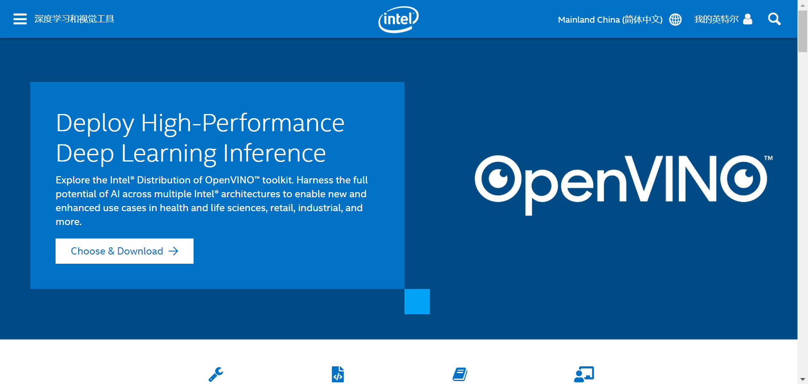
3. 进入如下界面：
   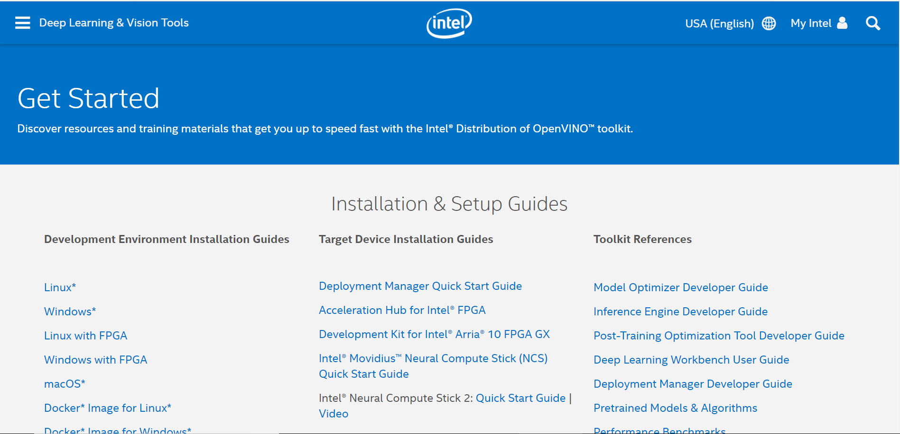
4. 选择Windows*进行下载安装：
   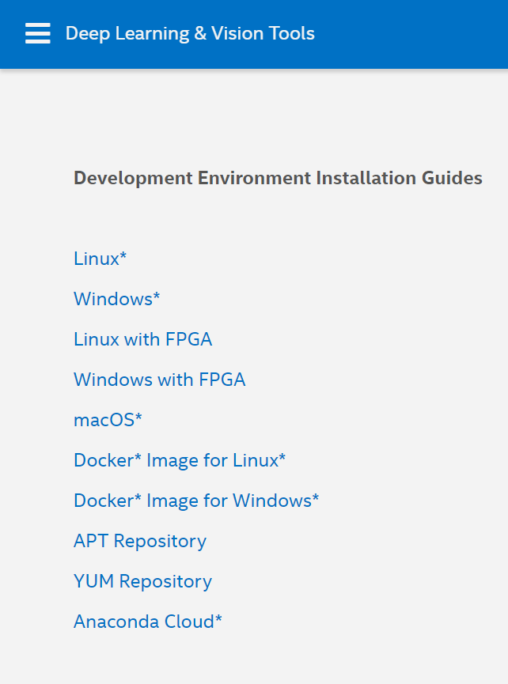
5. 安装完成：
   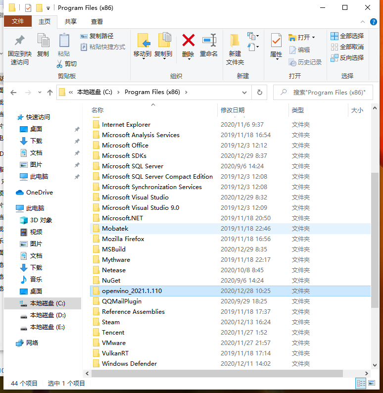
###安装cmake文件
1. 进入官网，网址：https://cmake.org/download/
2. 下滑至Windows win64-x64 Installer行。
   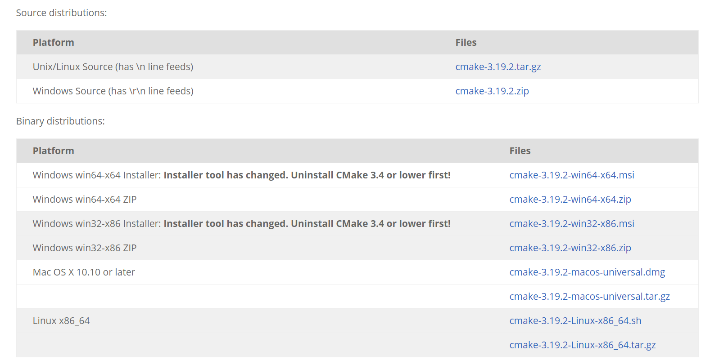
3. 单击关联的文件名，下载安装扩展名为.msi的程序。
4. 打开下载文件，运行可执行文件，安装过程中选择“将CMake添加到系统PATH”。
5. 根据默认路径安装即可：
    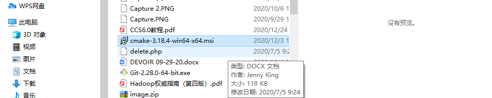
###安装Microsoft Visual Studio 
1. 进入官网，网址：http://visualstudio.microsoft.com/downloads/
2. 进入主页，选择“社区”下的“免费下载”：
3. 下载结束后运行可执行文件安装程序。
4. 安装过程中选择通用Windows平台开发和使用C ++进行桌面开发；在Individual components选项卡下，选择MSBuild。
5. 其余安装选项默认即可。
###安装python的环境
1. 进入官网，网址：https://www.python.org/downloads/release/python-365/
2. 单击Windows x86-64可执行安装程序以下载可执行文件。
3. 运行可执行文件python-3.6.5-amd64.exe进行安装。
4. 安装选择默认路径及设置即可。
$还需要安装好的visual studio installer软件和安装好visual studio 2019$
###设置系统环境变量，需要设置系统变量：
C:\Program Files(x86)\openvino_2021.1.110\deployment_tools\inference_engine\samples\c
C:\Users\HUAT_IAE\Downloads\python-3.6.5-embed-amd64
C:\Users\HUAT_IAE\Desktop\openvino_2021.1.110
 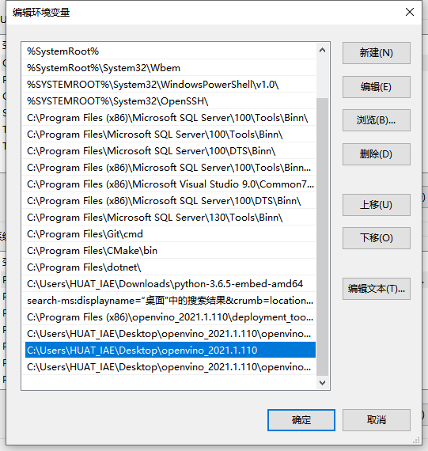
##配置模型优化器
 1.进入优化器文件路径:
 cd C:\Program Files (x86)\IntelSWTools\openvino_2021.1.110\deployment_tools\model_optimizer\install_prerequisites
 2.输入代码:
 install_prerequisites.bat
 注：该条命令是下载所有的配置模型优化器
  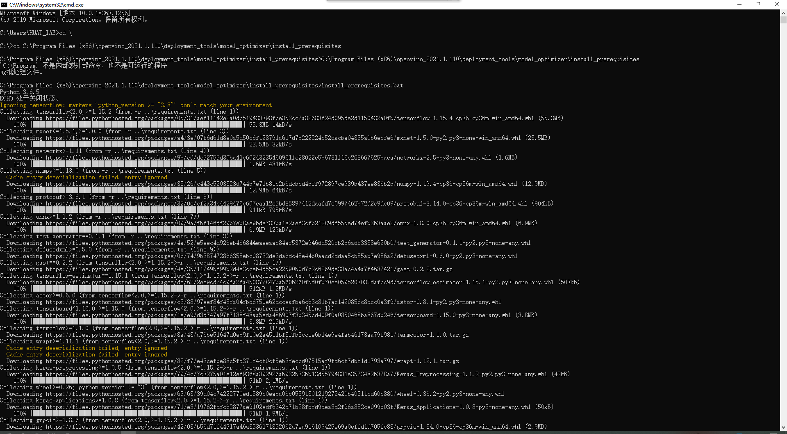
##进行车辆识别测试案例
1.进入demo的文件路径：
cd C:\Program Files (x86)\IntelSWTools\openvino_2021.1.110\deployment_tools\demo
2.直接执行demo_security_barrier_camera.bat文件：
测试代码：

:: Copyright (C) 2018-2019 Intel Corporation
:: SPDX-License-Identifier: Apache-2.0

@echo off
setlocal enabledelayedexpansion

set TARGET=CPU
set SAMPLE_OPTIONS=
set BUILD_FOLDER=%USERPROFILE%\Documents\Intel\OpenVINO

:: command line arguments parsing
:input_arguments_loop
if not "%1"=="" (
    if "%1"=="-d" (
        set TARGET=%2
        echo target = !TARGET!
        shift
    )
    if "%1"=="-sample-options" (
        set SAMPLE_OPTIONS=%2 %3 %4 %5 %6
        echo sample_options = !SAMPLE_OPTIONS!
        shift
    )
    if "%1"=="-help" (
        echo %~n0%~x0 is security barrier camera demo that showcases three models coming with the product
        echo.
        echo Options:
        echo -d name     Specify the target device to infer on; CPU, GPU, FPGA, HDDL or MYRIAD are acceptable. Sample will look for a suitable plugin for device specified
        exit /b
    )
    shift
    goto :input_arguments_loop
)

set ROOT_DIR=%~dp0

set target_image_path=%ROOT_DIR%car_1.bmp

set TARGET_PRECISION=FP16

echo target_precision = !TARGET_PRECISION!

if exist "%ROOT_DIR%..\..\bin\setupvars.bat" (
    call "%ROOT_DIR%..\..\bin\setupvars.bat"
) else (
    echo setupvars.bat is not found, INTEL_OPENVINO_DIR can't be set
    goto error
)

echo INTEL_OPENVINO_DIR is set to %INTEL_OPENVINO_DIR%

:: Check if Python is installed
python --version 2>NUL
if errorlevel 1 (
   echo Error^: Python is not installed. Please install Python 3.5 ^(64-bit^) or higher from https://www.python.org/downloads/
   goto error
)

:: Check if Python version is equal or higher 3.4
for /F "tokens=* USEBACKQ" %%F IN (`python --version 2^>^&1`) DO (
   set version=%%F
)
echo %var%

for /F "tokens=1,2,3 delims=. " %%a in ("%version%") do (
   set Major=%%b
   set Minor=%%c
)

if "%Major%" geq "3" (
   if "%Minor%" geq "5" (
  set python_ver=okay
   )
)
if not "%python_ver%"=="okay" (
   echo Unsupported Python version. Please install Python 3.5 ^(64-bit^) or higher from https://www.python.org/downloads/
   goto error
)

:: install yaml python modules required for downloader.py
pip3 install --user -r "%ROOT_DIR%..\open_model_zoo\tools\downloader\requirements.in"
if ERRORLEVEL 1 GOTO errorHandling

set models_path=%BUILD_FOLDER%\openvino_models\ir
set models_cache=%BUILD_FOLDER%\openvino_models\cache

if not exist "%models_cache%" (
  mkdir "%models_cache%"
)

set downloader_dir=%INTEL_OPENVINO_DIR%\deployment_tools\open_model_zoo\tools\downloader

for /F "tokens=1,2 usebackq" %%a in ("%ROOT_DIR%demo_security_barrier_camera.conf") do (
   echo python "%downloader_dir%\downloader.py" --name "%%b" --output_dir "%models_path%" --cache_dir "%models_cache%"
   python "%downloader_dir%\downloader.py" --name "%%b" --output_dir "%models_path%" --cache_dir "%models_cache%"

   for /F "tokens=* usebackq" %%d in (
      `python "%downloader_dir%\info_dumper.py" --name "%%b" ^|
         python -c "import sys, json; print(json.load(sys.stdin)[0]['subdirectory'])"`
   ) do (
      set model_args=!model_args! %%a "%models_path%\%%d\%target_precision%\%%b.xml"
   )
)

echo.
echo ###############^|^| Generate VS solution for Inference Engine demos using cmake ^|^|###############
echo.
timeout 3

if "%PROCESSOR_ARCHITECTURE%" == "AMD64" (
   set "PLATFORM=x64"
) else (
   set "PLATFORM=Win32"
)

set VSWHERE="false"
if exist "%ProgramFiles(x86)%\Microsoft Visual Studio\Installer\vswhere.exe" (
   set VSWHERE="true"
   cd "%ProgramFiles(x86)%\Microsoft Visual Studio\Installer"
) else if exist "%ProgramFiles%\Microsoft Visual Studio\Installer\vswhere.exe" (
      set VSWHERE="true"
      cd "%ProgramFiles%\Microsoft Visual Studio\Installer"
) else (
   echo "vswhere tool is not found"
)

set MSBUILD_BIN=
set VS_PATH=

测试结果如下图所示：
  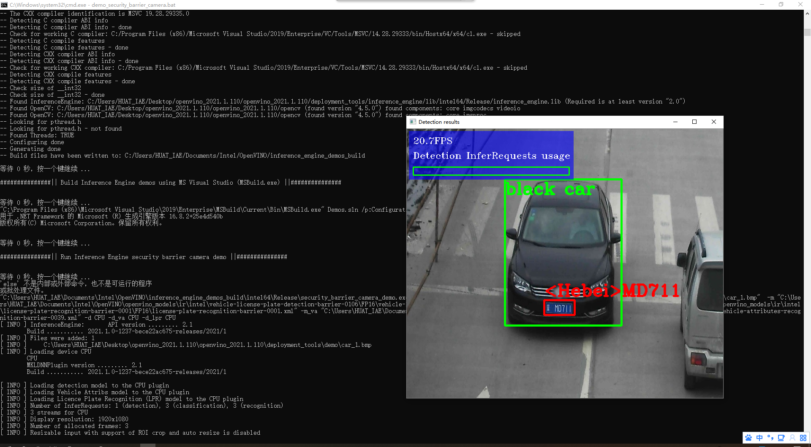
####代码分析：
该段代码是对车辆进行识别的，代码中的car_1.bmp文件进行替换可以对不同图片中的车辆进行识别，同时本段代码标识了车辆的属性同时对车牌进行了标识，包括有车牌的颜色和车牌号的信息。
###交互式人脸检测实验
1.使用cmd命令下载所需要的文件通过官网找到代码：先进入下载的位置：
找到downloader.py的路径位置：
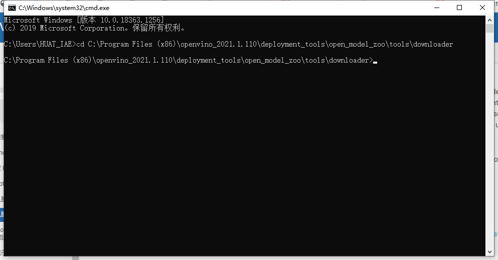
2.下载所需要的文件模型到指定的路径（下到电脑桌面的model文件夹中）：
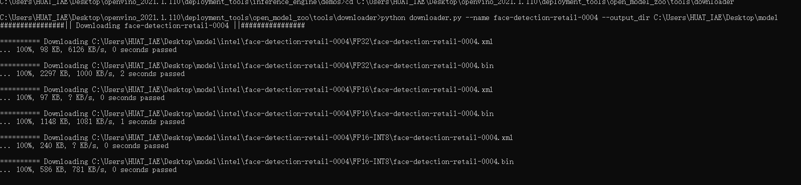
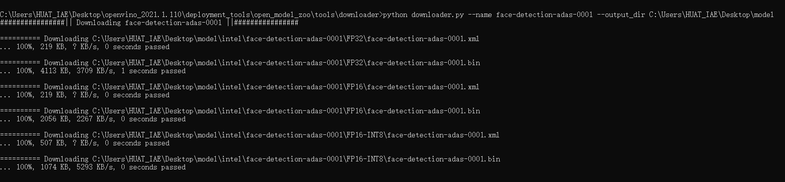
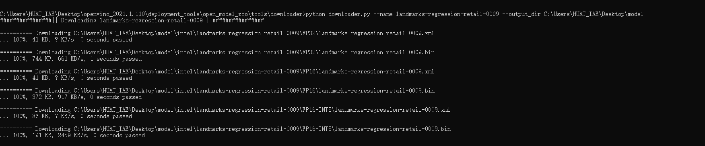
3.打开窗口命令行，设置环境变量导入opencv2的环境：
cd C:\Program Files (x86)\IntelSWTools\openvino\bin setupvars.bat python import cv2
4.找到安装路径下的interactive_face_detection_demo目录，并且创建face-age-emotion-head.bat，并Run bat文件，最后得到的运行结果。
代码：
import sys
import cv2
import numpy as np
import time
import logging as log
from openvino.inference_engine import IENetwork, IEPlugin

plugin_dir = "C:/Intel/openvino/deployment_tools/inference_engine/bin/intel64/Release"
cpu_extension = "C:/Users/kang/Documents/Intel/OpenVINO/inference_engine_samples_build_2017/intel64/Release/cpu_extension.dll"
# face-detection-adas-0001
model_xml  = "C:/Users/kang/Downloads/openvino_sample_show/open_model_zoo/model_downloader/Transportation/object_detection/face/pruned_mobilenet_reduced_ssd_shared_weights/dldt/face-detection-adas-0001.xml"
model_bin = "C:/Users/kang/Downloads/openvino_sample_show/open_model_zoo/model_downloader/Transportation/object_detection/face/pruned_mobilenet_reduced_ssd_shared_weights/dldt/face-detection-adas-0001.bin"

# emotions-recognition-retail-0003
emotions_xml = "C:/Users/kang/Downloads/openvino_sample_show/open_model_zoo/model_downloader/Retail/object_attributes/emotions_recognition/0003/dldt/emotions-recognition-retail-0003.xml"
emotions_bin = "C:/Users/kang/Downloads/openvino_sample_show/open_model_zoo/model_downloader/Retail/object_attributes/emotions_recognition/0003/dldt/emotions-recognition-retail-0003.bin"

labels = ['neutral', 'happy', 'sad', 'surprise', 'anger']

def face_emotions_demo():
    log.basicConfig(format="[ %(levelname)s ] %(message)s",
                    level=log.INFO,
                    stream=sys.stdout)
    # Plugin initialization for specified device and load extensions library if specified
    log.info("Initializing plugin for {} device...".format("CPU"))
    plugin = IEPlugin(device="CPU", plugin_dirs=plugin_dir)
    plugin.add_cpu_extension(cpu_extension)
    # Read IR
    log.info("Reading IR...")
    net = IENetwork(model=model_xml, weights=model_bin)

    emotions_net = IENetwork(model=emotions_xml, weights=emotions_bin)

    if plugin.device == "CPU":
        supported_layers = plugin.get_supported_layers(net)
        not_supported_layers = [
            l for l in net.layers.keys() if l not in supported_layers
        ]
        if len(not_supported_layers) != 0:
            log.error(
                "Following layers are not supported by the plugin for specified device {}:\n {}"
                .format(plugin.device, ', '.join(not_supported_layers)))
            log.error(
                "Please try to specify cpu extensions library path in demo's command line parameters using -l "
                "or --cpu_extension command line argument")
            sys.exit(1)
    assert len(
        net.inputs.keys()) == 1, "Demo supports only single input topologies"
    assert len(net.outputs) == 1, "Demo supports only single output topologies"

    input_blob = next(iter(net.inputs))
    out_blob = next(iter(net.outputs))
    em_input_blob = next(iter(emotions_net.inputs))
    em_out_blob = next(iter(emotions_net.outputs))

    log.info("Loading IR to the plugin...")

    # 生成可执行网络,异步执行 num_requests=2
    exec_net = plugin.load(network=net, num_requests=2)
    exec_emotions_net = plugin.load(network=emotions_net)

    # Read and pre-process input image
    n, c, h, w = net.inputs[input_blob].shape
    en, ec, eh, ew = emotions_net.inputs[em_input_blob].shape

    del net
    del emotions_net

    cap = cv2.VideoCapture("C:/Users/kang/Downloads/openvino_sample_show/material/face_detection_demo.mp4")

    cur_request_id = 0
    next_request_id = 1

    log.info("Starting inference in async mode...")
    log.info("To switch between sync and async modes press Tab button")
    log.info("To stop the demo execution press Esc button")
    is_async_mode = True
    render_time = 0
    ret, frame = cap.read()

    print(
        "To close the application, press 'CTRL+C' or any key with focus on the output window"
    )
    while cap.isOpened():
        if is_async_mode:
            ret, next_frame = cap.read()
        else:
            ret, frame = cap.read()
        if not ret:
            break
        initial_w = cap.get(3)
        initial_h = cap.get(4)
        inf_start = time.time()
        if is_async_mode:
            in_frame = cv2.resize(next_frame, (w, h))
            in_frame = in_frame.transpose(
                (2, 0, 1))  # Change data layout from HWC to CHW
            in_frame = in_frame.reshape((n, c, h, w))
            exec_net.start_async(request_id=next_request_id,
                                inputs={input_blob: in_frame})
        else:
            in_frame = cv2.resize(frame, (w, h))
            in_frame = in_frame.transpose(
                (2, 0, 1))  # Change data layout from HWC to CHW
            in_frame = in_frame.reshape((n, c, h, w))
            exec_net.start_async(request_id=cur_request_id,
                                inputs={input_blob: in_frame})
        if exec_net.requests[cur_request_id].wait(-1) == 0:

            res = exec_net.requests[cur_request_id].outputs[out_blob]

            # 输出格式：[1,1,N,7] 从N行人脸中找到7个值 = [image_id,label,conf,x_min,y_min,x_max,y_max]
            for obj in res[0][0]:
                if obj[2] > 0.5:
                    xmin = int(obj[3] * initial_w)
                    ymin = int(obj[4] * initial_h)
                    xmax = int(obj[5] * initial_w)
                    ymax = int(obj[6] * initial_h)
                    if xmin > 0 and ymin > 0 and (xmax < initial_w) and (ymax < initial_h):
                        roi = frame[ymin:ymax,xmin:xmax,:]
                        face_roi = cv2.resize(roi,(ew,eh))
                        face_roi =face_roi.transpose((2, 0, 1)) 
                        face_roi= face_roi.reshape((en, ec, eh, ew))
                        # 解析结果
                        landmark_res = exec_emotions_net.infer(inputs={input_blob: [face_roi]})
                        landmark_res = landmark_res['prob_emotion']
                        landmark_res = np.reshape(landmark_res, (5))
                        landmark_res = labels[np.argmax(landmark_res)]
                        cv2.putText(frame, landmark_res, (np.int32(xmin), np.int32(ymin)), cv2.FONT_HERSHEY_SIMPLEX, 1.0,
                                (255, 0, 0), 2)
                        cv2.rectangle(frame, (np.int32(xmin), np.int32(ymin)), (np.int32(xmax), np.int32(ymax)),
                                    (0, 0, 255), 2, 8, 0)
                    cv2.rectangle(frame, (xmin,ymin), (xmax,ymax), (0, 0, 255), 2, 8, 0)

            inf_end = time.time()
            det_time = inf_end - inf_start

            # Draw performance stats
            inf_time_message = "Inference time: {:.3f} ms, FPS:{:.3f}".format(det_time * 1000, 1000 / (det_time*1000 + 1))
            render_time_message = "OpenCV rendering time: {:.3f} ms".format(
                render_time * 1000)
            async_mode_message = "Async mode is on. Processing request {}".format(cur_request_id) if is_async_mode else \
                "Async mode is off. Processing request {}".format(cur_request_id)

            cv2.putText(frame, inf_time_message, (15, 15),
                        cv2.FONT_HERSHEY_COMPLEX, 0.5, (200, 10, 10), 1)
            cv2.putText(frame, render_time_message, (15, 30),
                        cv2.FONT_HERSHEY_COMPLEX, 0.5, (10, 10, 200), 1)
            cv2.putText(frame, async_mode_message, (10, int(initial_h - 20)),
                        cv2.FONT_HERSHEY_COMPLEX, 0.5, (10, 10, 200), 1)

        render_start = time.time()
        cv2.imshow("face emotions demo", frame)
        render_end = time.time()
        render_time = render_end - render_start

        if is_async_mode:
            cur_request_id, next_request_id = next_request_id, cur_request_id
            frame = next_frame

        key = cv2.waitKey(1)
        if key == 27:
            break
    cv2.destroyAllWindows()

    del exec_net
    del exec_emotions_net
    del plugin

if __name__ == '__main__':
    sys.exit(face_emotions_demo() or 0) 
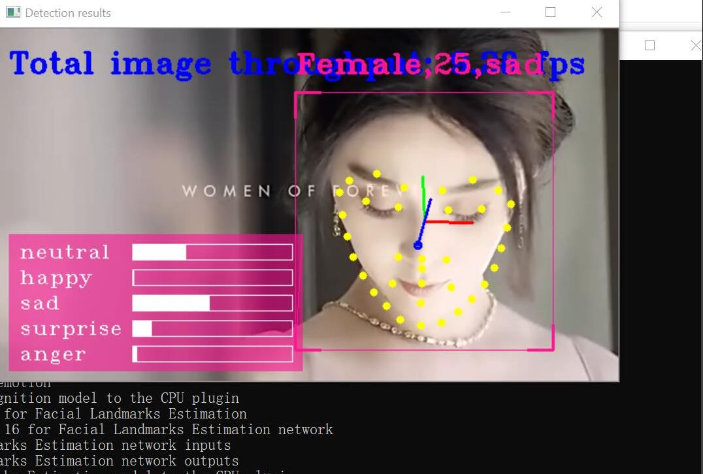
###心得：对人脸的面部表情进行分析。

###遇到的问题及解决方法：
1.问题：在安装的过程中显示缺少pip
出现问题的原因：在安装openvino的时候需要配置python的环境架构，在下载python的安装包时出现了问题缺少了pip文件，不能执行pip指令。
解决方法：在电脑中重新安装了一个python的安装包，同时在电脑的系统变量中设置python的变量。
2.问题：执行安装检测的时候，在运行车辆识别检测的时候跑不出来？
出现问题的原因：下载openvino的模型的时候，模型没有下载完整，所以导致代码无法运行，同时可能少跑了一个文件。
解决方法：重新输入指令 install_prerequisites.bat，下载完所需要的模型。
3.问题：在进行人脸检测的时候下载openvino的所需的模型的时候，指令无法正常运行，找不到requests文件
出现问题的原因：可能是python中缺少requests的插件，或者也可能是在downlaoder的文件下没有python目录。
解决方法：在命令指示窗中输入pip install requests命令下载requests插件，同时将电脑中的python文件复制粘贴到openvino中的downlaoder文件中。

###总结
在本次的课程设计实验中，我主要完成车辆检测的实验和人脸检测的实验，通过对openvino环境的熟悉和运用，同时对代码的不断解析，成功的完成了和运行出了openvino中两种检测的模型，得到了车辆检测和人脸检测的图像。
###心得感想
在本次的实验中，我基本熟悉了openvino的架构，知道了openvino的环境，同时在做实验的时候我遇到了一些问题，但是在逐步的解决的过程中，也学习到了很多的知识，培养了自我学习知识的能力。同时在实验的时候，对代码更加的熟悉，对python的环境和c++有了更清楚的认识。