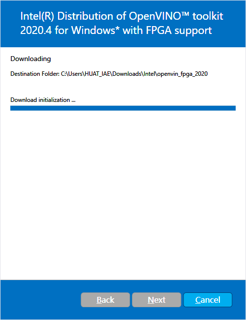
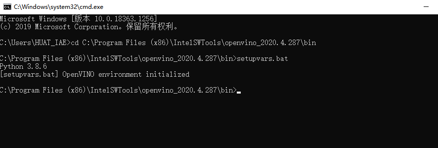
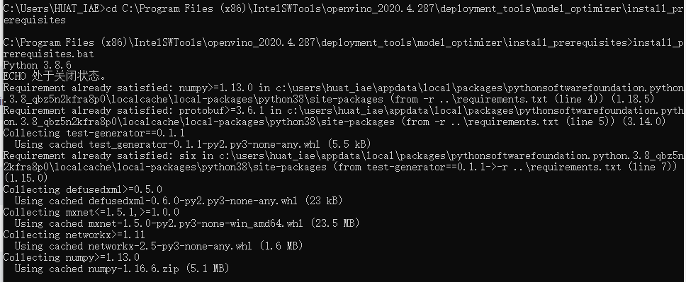
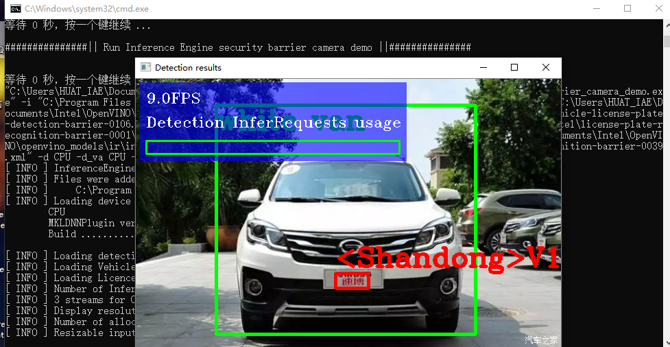
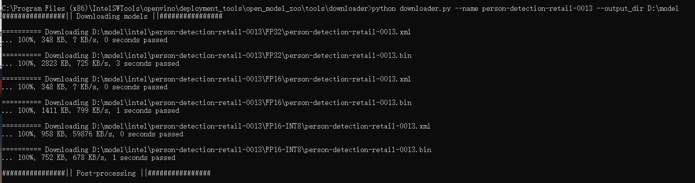
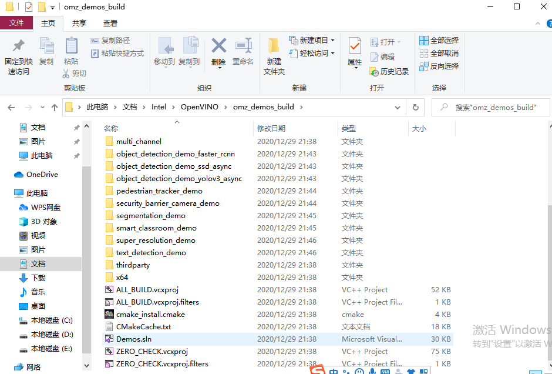
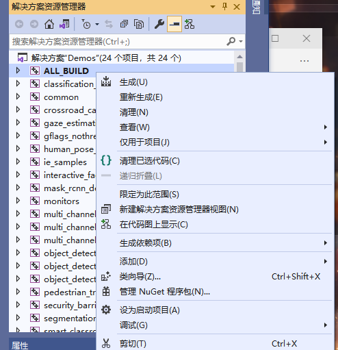
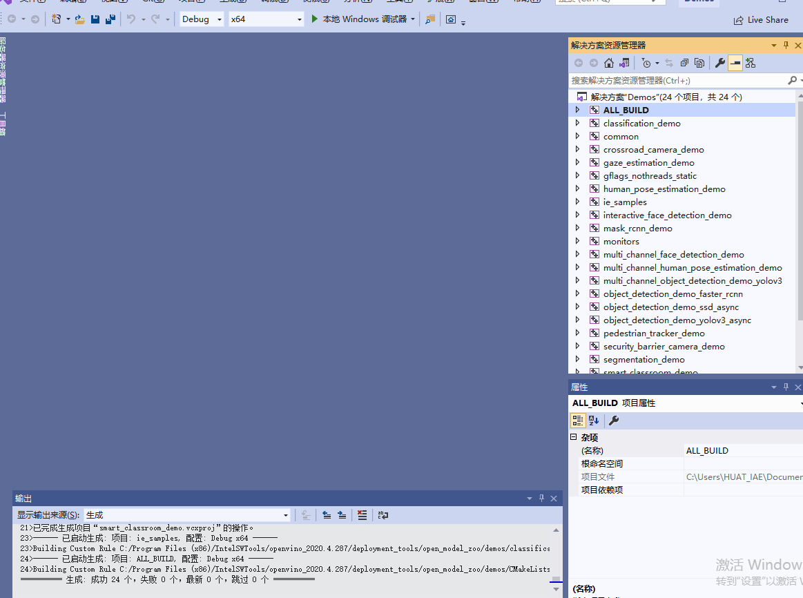
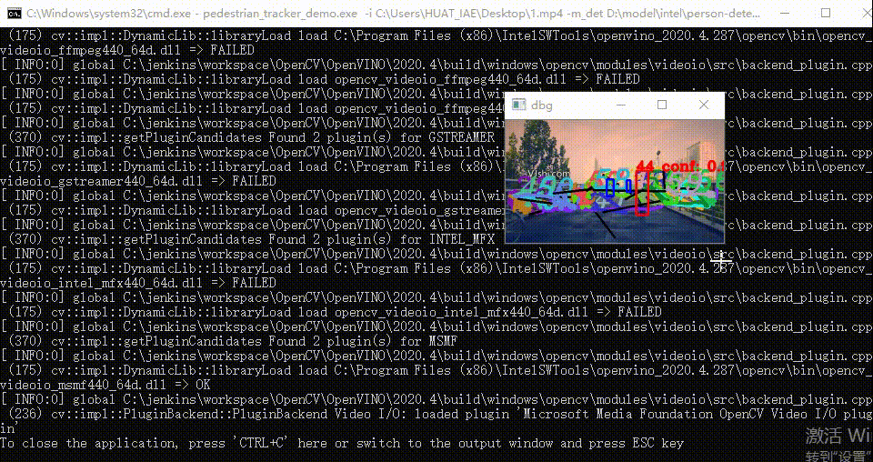

# OpenVINO实现关于车辆目标的识别

## OpenVINO的安装和配置

### 1.下载并安装OpenVINO

#### 1.1 下载OpenVINO

下载地址：https://software.seek.intel.com/openvino-toolkit?os=windows
需要先注册，邮箱会收到下载链接和Serial Number来激活软件。

#### 1.2 开始安装

双击下载好的OpenVINO开始安装


#### 1.3 选择安装路径


一直下一步

#### 1.4 安装完成


### 2.安装依赖包

#### 2.1  下载 Microsoft Visual Studio* with C++ 2017 or 2015, with MSBuild, and the Build Tools for Microsoft Visual Studio

Build Tools for Microsoft Visual Studio：
https://visualstudio.microsoft.com/zh-hans/downloads/
Build Tools for Microsoft Visual Studio：
https://visualstudio.microsoft.com/downloads/#build-tools-for-visual-studio-2015
https://visualstudio.microsoft.com/downloads/#build-tools-for-visual-studio-2017

#### 2.2下载CMake>=3.4

下载地址：https://cmake.org/download/

#### 2.3下载 Python >= 3.6

下载地址：https://www.anaconda.com/distribution/

### 3.设置环境变量

首先win+R再输入cmd进入命令行，然后cd  C:\Program Files (x86)\IntelSWTools\openvino_2020.4.287\bin 进入目录
再输入setupvars.bat，如下图所示


### 4.配置模型优化器（Model Optimizer）

同上 win+R再加cmd进入命令行，然后C:\Program Files (x86)\IntelSWTools\openvino_2020.4.287\deployment_tools\model_optimizer\install_prerequisites 进入目录
运行install_prerequisites.bat
如下图所示：

也可以根据需要运行对应的脚本
```
Caffe : install_prerequisites_caffe.bat
TensorFlow : install_prerequisites_tf.bat
ONNX (Caffe2, PyTorch, MXNet，ML. NET，TensorRT，Microsoft CNTK) : install_prerequisites_onnx.bat
MXNet : install_prerequisites_mxnet.bat
Kaldi : install_prerequisites_kaldi.bat
```

### 5.运行示例


进入目录
C:\Program Files (x86)\IntelSWTools\openvino_2020.4.287\deployment_tools\demo

#### 5.1 目标检查与识别

车辆识别模型


#### 5.2 行人识别实验

网址
https://docs.openvinotoolkit.org/cn/latest/_demos_pedestrian_tracker_demo_README.html

本实验是基于该网址的Pedestrian Tracker C++ Demo进行的

1.在此之前首先要初始化环境也就是上面3中的环境配置

2.之后win+R然后cmd打开命令行，用命令cd C:\Program Files (x86)\IntelSWTools\openvino_2020.4.287\deployment_tools\open_model_zoo\tools\downloader进入目录，然后输入python downloader.py --name person-detection-retail-0013 --output_dir D:\model运行
这里--name后面接的是模型名字，--output_dir后面是这个模型下载的位置
另外一个模型person-detection-retail-0031也是这么下载。

3.下载素材，在任何一个网站上下载视频即可
由于MP4不便插入，因此转化为gif
gif图如下：

4.编译执行文件
(1)找到demo.sln
(2)右键all build
(3)点击生成



5.运行。同样进入命令行
首先输入命令cd C:\Users\HUAT_IAE \Documents\Intel OpenVINO\omz_demos_build\inte164\Debug进入目录
然后输入命令
pedestrian_tracker_demo.exe -i C:\Users\HUAT_IAE\Desktop\1.mp4 -m_det D:\model\intel\person-detection-retail-0013\FP32\person-detection-retail-0013.xml -m_reid C:\Users\HUAT_IAE\Desktop\person-reidentification-retail-0031\FP32\person-reidentification-retail-0031.xml -d_det CPU
之后目标检测就成功了。
gif图如下：


### 6.代码分析

```
#include "core.hpp"
#include "utils.hpp"
#include "tracker.hpp"
#include "descriptor.hpp"
#include "distance.hpp"
#include "detector.hpp"
#include "pedestrian_tracker_demo.hpp"

#include <monitors/presenter.h>

#include <opencv2/core.hpp>

#include <iostream>
#include <utility>
#include <vector>
#include <map>
#include <memory>
#include <string>
#include <gflags/gflags.h>

using namespace InferenceEngine;
using ImageWithFrameIndex = std::pair<cv::Mat, int>;

std::unique_ptr<PedestrianTracker>
CreatePedestrianTracker(const std::string& reid_model,
                        const InferenceEngine::Core & ie,
                        const std::string & deviceName,
                        bool should_keep_tracking_info) {
    TrackerParams params;//创建函数行人识别

    if (should_keep_tracking_info) {
        params.drop_forgotten_tracks = false;
        params.max_num_objects_in_track = -1;
    }

    std::unique_ptr<PedestrianTracker> tracker(new PedestrianTracker(params));

    // Load reid-model.
    std::shared_ptr<IImageDescriptor> descriptor_fast =
        std::make_shared<ResizedImageDescriptor>(
            cv::Size(16, 32), cv::InterpolationFlags::INTER_LINEAR);
    std::shared_ptr<IDescriptorDistance> distance_fast =
        std::make_shared<MatchTemplateDistance>();

    tracker->set_descriptor_fast(descriptor_fast);
    tracker->set_distance_fast(distance_fast);

    if (!reid_model.empty()) {
        CnnConfig reid_config(reid_model);
        reid_config.max_batch_size = 16;   // defaulting to 16

        std::shared_ptr<IImageDescriptor> descriptor_strong =
            std::make_shared<DescriptorIE>(reid_config, ie, deviceName);

        if (descriptor_strong == nullptr) {
            THROW_IE_EXCEPTION << "[SAMPLES] internal error - invalid descriptor";
        }
        std::shared_ptr<IDescriptorDistance> distance_strong =
            std::make_shared<CosDistance>(descriptor_strong->size());

        tracker->set_descriptor_strong(descriptor_strong);
        tracker->set_distance_strong(distance_strong);
    } else {
        std::cout << "WARNING: Reid model "
            << "was not specified. "
            << "Only fast reidentification approach will be used." << std::endl;
    }

    return tracker;
}

bool ParseAndCheckCommandLine(int argc, char *argv[]) {  //解析和检查命令线
    // ---------------------------Parsing and validation of input args--------------------------------------

    gflags::ParseCommandLineNonHelpFlags(&argc, &argv, true);
    if (FLAGS_h) {
        showUsage();
        showAvailableDevices();
        return false;
    }

    if (FLAGS_i.empty()) {
        throw std::logic_error("Parameter -i is not set");
    }

    if (FLAGS_m_det.empty()) {
        throw std::logic_error("Parameter -m_det is not set");
    }

    if (FLAGS_m_reid.empty()) {
        throw std::logic_error("Parameter -m_reid is not set");
    }

    return true;
}

int main_work(int argc, char **argv) {
    std::cout << "InferenceEngine: " << GetInferenceEngineVersion() << std::endl;

    if (!ParseAndCheckCommandLine(argc, argv)) {
        return 0;
    }


    // Reading command line parameters.
    auto det_model = FLAGS_m_det;
    auto reid_model = FLAGS_m_reid;

    auto detlog_out = FLAGS_out;

    auto detector_mode = FLAGS_d_det;
    auto reid_mode = FLAGS_d_reid;

    auto custom_cpu_library = FLAGS_l;
    auto path_to_custom_layers = FLAGS_c;
    bool should_use_perf_counter = FLAGS_pc;

    bool should_print_out = FLAGS_r;

    bool should_show = !FLAGS_no_show;
    int delay = FLAGS_delay;
    if (!should_show)
        delay = -1;
    should_show = (delay >= 0);

    bool should_save_det_log = !detlog_out.empty();

    if ((FLAGS_last >= 0) && (FLAGS_first > FLAGS_last)) {
        throw std::runtime_error("The first frame index (" + std::to_string(FLAGS_first) + ") must be greater than the "
            "last frame index (" + std::to_string(FLAGS_last) + ')');
    }

    std::vector<std::string> devices{detector_mode, reid_mode};
    InferenceEngine::Core ie =
        LoadInferenceEngine(
            devices, custom_cpu_library, path_to_custom_layers,
            should_use_perf_counter);

    DetectorConfig detector_confid(det_model);
    ObjectDetector pedestrian_detector(detector_confid, ie, detector_mode);

    bool should_keep_tracking_info = should_save_det_log || should_print_out;
    std::unique_ptr<PedestrianTracker> tracker =
        CreatePedestrianTracker(reid_model, ie, reid_mode,
                                should_keep_tracking_info);

    cv::VideoCapture cap;
    try {
        int intInput = std::stoi(FLAGS_i);
        if (!cap.open(intInput)) {
            throw std::runtime_error("Can't open " + std::to_string(intInput));
        }
    } catch (const std::invalid_argument&) {
        if (!cap.open(FLAGS_i)) {
            throw std::runtime_error("Can't open " + FLAGS_i);
        }
    } catch (const std::out_of_range&) {
        if (!cap.open(FLAGS_i)) {
            throw std::runtime_error("Can't open " + FLAGS_i);
        }
    }
    double video_fps = cap.get(cv::CAP_PROP_FPS);
    if (0.0 == video_fps) {
        // the default frame rate for DukeMTMC dataset
        video_fps = 60.0;
    }
    if (0 >= FLAGS_first && !cap.set(cv::CAP_PROP_POS_FRAMES, FLAGS_first)) {
        throw std::runtime_error("Can't set the frame to begin with");
    }

    std::cout << "To close the application, press 'CTRL+C' here";
    if (!FLAGS_no_show) {
        std::cout << " or switch to the output window and press ESC key";
    }
    std::cout << std::endl;

    cv::Size graphSize{static_cast<int>(cap.get(cv::CAP_PROP_FRAME_WIDTH) / 4), 60};
    Presenter presenter(FLAGS_u, 10, graphSize);

    for (int32_t frame_idx = std::max(0, FLAGS_first); 0 > FLAGS_last || frame_idx <= FLAGS_last; ++frame_idx) {
        cv::Mat frame;
        if (!cap.read(frame)) {
            break;
        }

        pedestrian_detector.submitFrame(frame, frame_idx);
        pedestrian_detector.waitAndFetchResults();

        TrackedObjects detections = pedestrian_detector.getResults();

        // timestamp in milliseconds
        uint64_t cur_timestamp = static_cast<uint64_t >(1000.0 / video_fps * frame_idx);
        tracker->Process(frame, detections, cur_timestamp);

        presenter.drawGraphs(frame);

        if (should_show) {
            // Drawing colored "worms" (tracks).
            frame = tracker->DrawActiveTracks(frame);

            // Drawing all detected objects on a frame by BLUE COLOR
            for (const auto &detection : detections) {
                cv::rectangle(frame, detection.rect, cv::Scalar(255, 0, 0), 3);
            }

            // Drawing tracked detections only by RED color and print ID and detection
            // confidence level.
            for (const auto &detection : tracker->TrackedDetections()) {
                cv::rectangle(frame, detection.rect, cv::Scalar(0, 0, 255), 3);
                std::string text = std::to_string(detection.object_id) +
                    " conf: " + std::to_string(detection.confidence);
                cv::putText(frame, text, detection.rect.tl(), cv::FONT_HERSHEY_COMPLEX,
                            1.0, cv::Scalar(0, 0, 255), 3);
            }

            cv::resize(frame, frame, cv::Size(), 0.5, 0.5);
            cv::imshow("dbg", frame);
            char k = cv::waitKey(delay);
            if (k == 27)
                break;
            presenter.handleKey(k);
        }

        if (should_save_det_log && (frame_idx % 100 == 0)) {
            DetectionLog log = tracker->GetDetectionLog(true);
            SaveDetectionLogToTrajFile(detlog_out, log);
        }
    }

    if (should_keep_tracking_info) {
        DetectionLog log = tracker->GetDetectionLog(true);

        if (should_save_det_log)
            SaveDetectionLogToTrajFile(detlog_out, log);
        if (should_print_out)
            PrintDetectionLog(log);
    }
    if (should_use_perf_counter) {
        pedestrian_detector.PrintPerformanceCounts(getFullDeviceName(ie, FLAGS_d_det));
        tracker->PrintReidPerformanceCounts(getFullDeviceName(ie, FLAGS_d_reid));
    }

    std::cout << presenter.reportMeans() << '\n';
    return 0;
}

int main(int argc, char **argv) {
    try {
        main_work(argc, argv);
    }
    catch (const std::exception& error) {
        std::cerr << "[ ERROR ] " << error.what() << std::endl;
        return 1;
    }
    catch (...) {
        std::cerr << "[ ERROR ] Unknown/internal exception happened." << std::endl;
        return 1;
    }

    std::cout << "Execution successful" << std::endl;

    return 0;
}
```

### 7.实验总结

行人识别实验可以总结为从一张图片中识别出所有的人，具体可以分为哪些是人，分别在什么地方，也就是识别和定位。我们在这一任务中的主要任务是希望区分出行人和背景，并将行人定位。这和行人目标检测基本同义。

行人重识别（Person re-identification，简称ReID）也称行人再识别，主要解决跨摄像头跨场景下行人的识别与检索。该技术能够根据行人的穿着、体态、发型等信息智能认知行人。主要用于行人检测、行人分割、骨架关键点检测及姿态识别、行人跟踪、动作识别、行人属性结构化等。是人脸识别之后一个重要的研究方向。

### 8.心得体会

本次实验理论上也有车辆识别，不过那个是已经下载好的模型，只需要在网上找图片或者视频然后直接替换掉就可以实现车辆检测。行人识别这个实验就是在官网上下载模型，然后下载素材。最后运行模型就可以成功。本次实验理论上不难弄，但是就是因为第一次做不熟练导致在路径上经常出错。做完这个实验后，基本学会了该如何去做。其他部分内容也是类似，比如车道线之类。我们只需要在官网上下载模型，最后直接运行就都可以实现。

<font face="黑体" color=green size=5>实验完成！</font>


