# 一、用opencv进行车道线检测
## 基本原理：
算法基本思想说明：
传统的车道线检测，多数是基于霍夫直线检测，其实这个里面有个很大的误区，霍夫直线拟合容易受到各种噪声干扰，直接运用有时候效果不好，更多的时候通过霍夫直线检测进行初步的筛选，然后再有针对性的进行直线拟合，根据拟合的直线四个点坐标，绘制出车道线，这种方式可以有效避免霍夫直线拟合不良后果，是一种更加稳定的车道线检测方法，在实际项目中，可以选择两种方法并行，在计算出结果后进行叠加或者对比提取，今天分享的案例主要是绕开了霍夫直线检测，通过对二值图像进行轮廓分析与几何分析，提取到相关的车道线信息、然后进行特定区域的像素扫描，拟合生成直线方程，确定四个点绘制出车道线，对连续的视频来说，如果某一帧无法正常检测，就可以通过缓存来替代绘制，从而实现在视频车道线检测中实时可靠。

## 基本流程
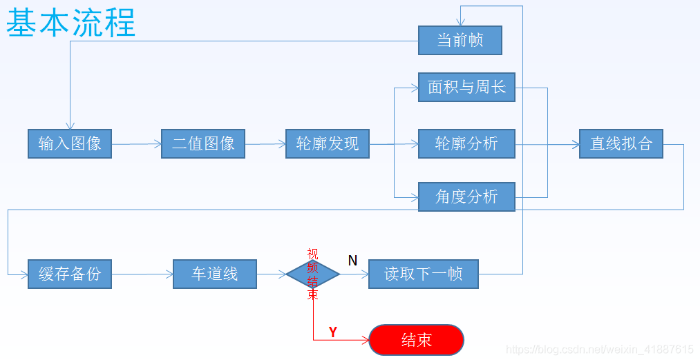

## 实验步骤

### 1. 安装Visual Studio 2019

在Visual Studio 官网上进行软件的安装

### 2. 安装opencv

在之前的实验过程中已经安装过opencv

### 3. 环境配置

在此电脑高级系统设置中配置环境变量，编辑path并输入lib的路径


在vs 2019中新建一个空项目并修改包含目录如下

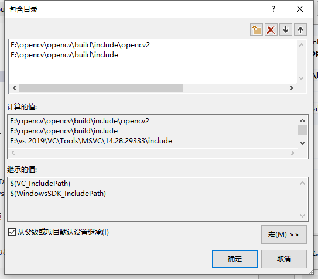

修改库目录如下

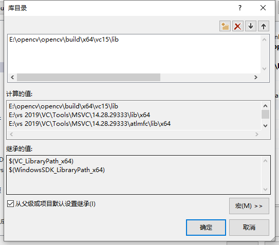

修改附加依赖项如下

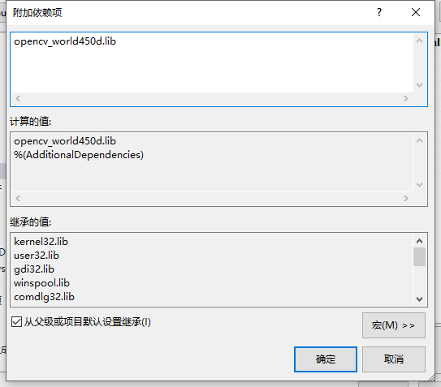

### 4. 创建一个新的源文件

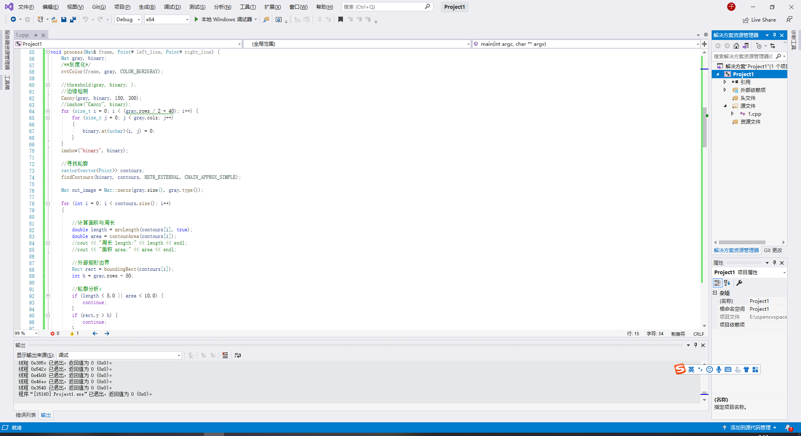

### 5. 代码如下
``` c++
#include <opencv2/opencv.hpp>
#include <iostream>
#include <cmath>

using namespace cv;
using namespace std;


Point left_line[2];
Point right_line[2];

void process(Mat& frame, Point* left_line, Point* right_line);
Mat fitLines(Mat& image, Point* left_line, Point* right_line);

int main(int argc, char** argv) {
	//读取视频
	VideoCapture capture("1.mp4");

	int height = capture.get(CAP_PROP_FRAME_HEIGHT);
	int width = capture.get(CAP_PROP_FRAME_WIDTH);
	int count = capture.get(CAP_PROP_FRAME_COUNT);
	int fps = capture.get(CAP_PROP_FPS);
	//初始化

	left_line[0] = Point(0, 0);

	left_line[1] = Point(0, 0);

	right_line[0] = Point(0, 0);

	right_line[1] = Point(0, 0);

	cout << height << "       " << width << "       " << count << "       " << fps << endl;

	//循环读取视频
	Mat frame;
	while (true) {
		int ret = capture.read(frame);
		if (!ret) {
			break;
		}
		imshow("input", frame);
		process(frame, left_line, right_line);

		char c = waitKey(5);
		if (c == 27) {
			break;
		}


	}

}

void process(Mat& frame, Point* left_line, Point* right_line) {
	Mat gray, binary;
	/**灰度化*/
	cvtColor(frame, gray, COLOR_BGR2GRAY);

	//threshold(gray, binary, );
	//边缘检测
	Canny(gray, binary, 150, 300);
	//imshow("Canny", binary);
	for (size_t i = 0; i < (gray.rows / 2 + 40); i++) {
		for (size_t j = 0; j < gray.cols; j++)
		{
			binary.at<uchar>(i, j) = 0;
		}
	}
	imshow("binary", binary);

	//寻找轮廓
	vector<vector<Point>> contours;
	findContours(binary, contours, RETR_EXTERNAL, CHAIN_APPROX_SIMPLE);

	Mat out_image = Mat::zeros(gray.size(), gray.type());

	for (int i = 0; i < contours.size(); i++)
	{

		//计算面积与周长
		double length = arcLength(contours[i], true);
		double area = contourArea(contours[i]);
		//cout << "周长 length:" << length << endl;
		//cout << "面积 area:" << area << endl;

		//外部矩形边界
		Rect rect = boundingRect(contours[i]);
		int h = gray.rows - 50;

		//轮廓分析：
		if (length < 5.0 || area < 10.0) {
			continue;
		}
		if (rect.y > h) {
			continue;
		}

		//最小包围矩形
		RotatedRect rrt = minAreaRect(contours[i]);
		


		//cout << "最小包围矩形 angle:" << rrt.angle << endl;

		double angle = abs(rrt.angle);

		//angle < 50.0 || angle>89.0

		if (angle < 20.0 || angle>84.0) {

			continue;

		}


		if (contours[i].size() > 5) {
			//用椭圆拟合
			RotatedRect errt = fitEllipse(contours[i]);
			//cout << "用椭圆拟合err.angle:" << errt.angle << endl;

			if ((errt.angle < 5.0) || (errt.angle > 160.0))
			{
				if (80.0 < errt.angle && errt.angle < 100.0) {
					continue;
				}

			}
		}


		//cout << "开始绘制：" << endl;
		drawContours(out_image, contours, i, Scalar(255), 2, 8);
		imshow("out_image", out_image);

	}
	Mat result = fitLines(out_image, left_line, right_line);
	imshow("result", result);

	Mat dst;
	addWeighted(frame, 0.8, result, 0.5, 0, dst);
	imshow("lane-lines", dst);

}

//直线拟合
Mat fitLines(Mat& image, Point* left_line, Point* right_line) {
	int height = image.rows;
	int width = image.cols;

	Mat out = Mat::zeros(image.size(), CV_8UC3);

	int cx = width / 2;
	int cy = height / 2;

	vector<Point> left_pts;
	vector<Point> right_pts;
	Vec4f left;


	for (int i = 100; i < (cx - 10); i++)
	{
		for (int j = cy; j < height; j++)
		{
			int pv = image.at<uchar>(j, i);
			if (pv == 255)
			{
				left_pts.push_back(Point(i, j));
			}
		}
	}

	for (int i = cx; i < (width - 20); i++)
	{
		for (int j = cy; j < height; j++)
		{
			int pv = image.at<uchar>(j, i);
			if (pv == 255)
			{
				right_pts.push_back(Point(i, j));
			}
		}
	}

	if (left_pts.size() > 2)
	{
		fitLine(left_pts, left, DIST_L1, 0, 0.01, 0.01);

		double k1 = left[1] / left[0];
		double step = left[3] - k1 * left[2];

		int x1 = int((height - step) / k1);
		int y2 = int((cx - 25) * k1 + step);

		Point left_spot_1 = Point(x1, height);
		Point left_spot_end = Point((cx - 25), y2);


		line(out, left_spot_1, left_spot_end, Scalar(0, 0, 255), 8, 8, 0);
		left_line[0] = left_spot_1;
		left_line[1] = left_spot_end;

	}
	else
	{
		line(out, left_line[0], left_line[1], Scalar(0, 0, 255), 8, 8, 0);
	}


	if (right_pts.size() > 2)
	{

		Point spot_1 = right_pts[0];
		Point spot_end = right_pts[right_pts.size() - 1];

		int x1 = spot_1.x;

		int y1 = spot_1.y;

		int x2 = spot_end.x;
		int y2 = spot_end.y;


		line(out, spot_1, spot_end, Scalar(0, 0, 255), 8, 8, 0);
		right_line[0] = spot_1;
		right_line[1] = spot_end;

	}
	else
	{
		line(out, right_line[0], right_line[1], Scalar(0, 0, 255), 8, 8, 0);
	}

	return out;
}
```

###  6. 运行结果如下

原视频在文件夹根目录中

原视频效果

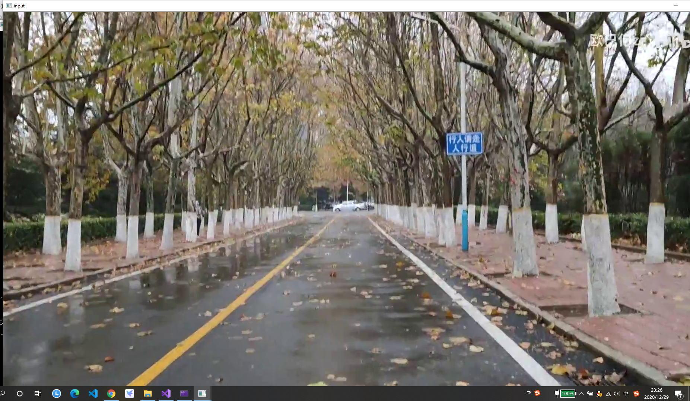

车道线检测结果

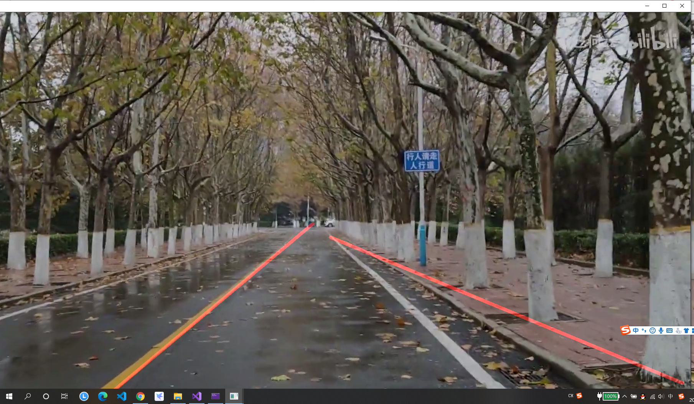

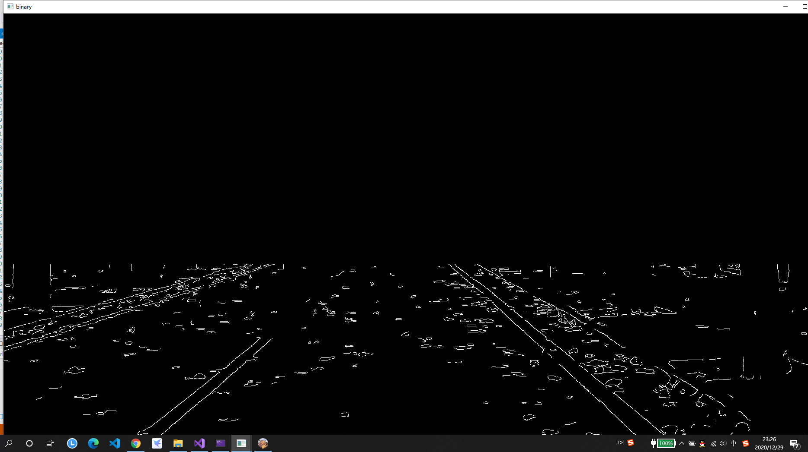

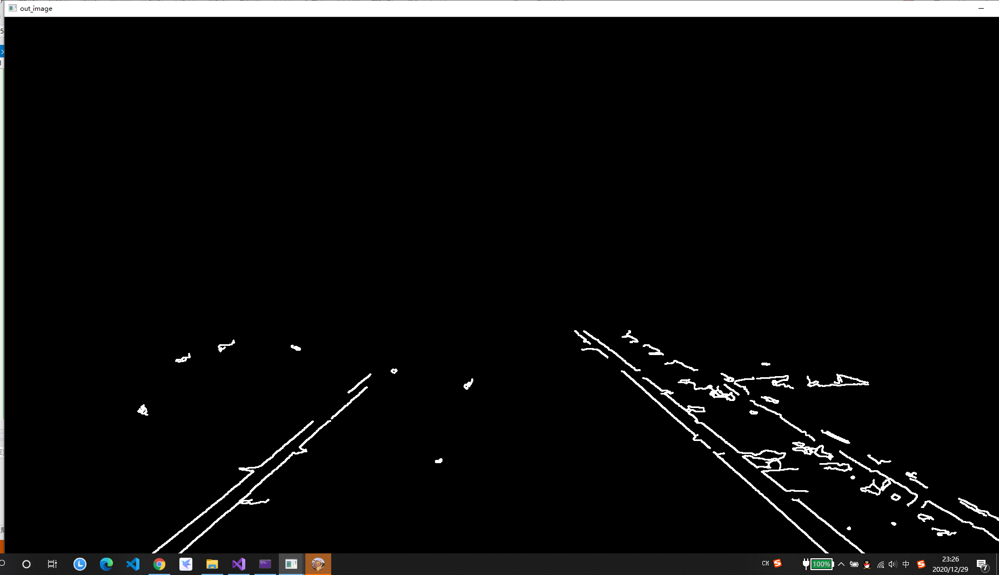

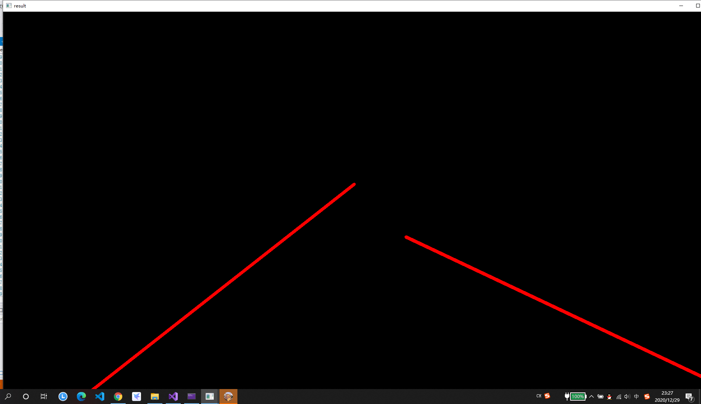

## 课程设计总结
用此方法做opencv会存在一些问题，当道路两旁同样出现白色物体或者黄色物体时车道线检测会不太准确。由于使用的Hough办法为概率霍夫变换，因此在变道时，若车道线偏斜较多，在线段拼合时会出现这种线段交杂，连接错误的情况。
大致步骤如下：
1、读取视频  
2、二值化
3、轮廓发现
4、轮廓分析、面积就算，角度分析
5、直线拟合
6、画出直线
实现的功能：实现了车道线检测的基本功能，反透视变换矩阵实现了但效果不太理想，车道线识别抗干扰能力较弱。
缺点：整个识别系统都是固定的参数，只能在特定的环境产生良好的效果。

## 课程设计心得
在网上找了许多opencv的不同的车道线检测实验作为参考，但都会多多少少出现代码与opencv的版本不匹配的情况。这次实验是使用的C++代码来实现的，使用的是opencv4.5版本。在实验时遇到过许多次无法检测到头文件的情况，因为4.5版本文件夹中只有opencv2文件夹而没有opencv的文件夹，所以导致很多头文件不可用，在经过不断的查询修改代码和查阅网上的资料后最后找到了解决方法成功运行出代码的结果。
这次课程设计是在老师没有提供教程的情况下完成的，主要难点在于寻找合适的实验教程和代码还有对于代码的理解，实验过程中遇到过很多次困难，有时候会在一个坎上卡好几个小时，但最后还是在不断的发现问题和解决问题的情况下完成了实验，有很多时候就算自己知道了实验的流程也还是很难完成实验，因为实验过程不会是一帆风顺，在很多地方即使和教程上一模一样的操作也会出问题，实验过程就是一个发现和解决问题的过程，所以想要成功完成实验需要坚持不懈的努力和寻找答案的能力。


# 二、openvino进行车辆检测

## 实验步骤

### 1. 在openvino官网安装openvino

### 2. 安装Intel®OpenVINO™工具包发行版

### 3. 安装CMake
CMake3.4或更高版本的64位，下载安装相应版本即可

### 4. 安装python
安装时最好选择默认路径，并勾选添加至路径

### 5. 配置环境
通过网上教程为 Windows®10永久设置 OpenVINO™环境变量。

### 6. 运行代码
通过openvino库中自带的代码来运行
代码如下：
```
:: Copyright (C) 2018-2019 Intel Corporation
:: SPDX-License-Identifier: Apache-2.0

@echo off
setlocal enabledelayedexpansion

set TARGET=CPU
set SAMPLE_OPTIONS=
set BUILD_FOLDER=%USERPROFILE%\Documents\Intel\OpenVINO

:: command line arguments parsing
:input_arguments_loop
if not "%1"=="" (
    if "%1"=="-d" (
        set TARGET=%2
        echo target = !TARGET!
        shift
    )
    if "%1"=="-sample-options" (
        set SAMPLE_OPTIONS=%2 %3 %4 %5 %6
        echo sample_options = !SAMPLE_OPTIONS!
        shift
    )
    if "%1"=="-help" (
        echo %~n0%~x0 is security barrier camera demo that showcases three models coming with the product
        echo.
        echo Options:
        echo -d name     Specify the target device to infer on; CPU, GPU, FPGA, HDDL or MYRIAD are acceptable. Sample will look for a suitable plugin for device specified
        exit /b
    )
    shift
    goto :input_arguments_loop
)

set ROOT_DIR=%~dp0

set target_image_path=%ROOT_DIR%car_1.bmp


set TARGET_PRECISION=FP16


echo target_precision = !TARGET_PRECISION!

if exist "%ROOT_DIR%..\..\bin\setupvars.bat" (
    call "%ROOT_DIR%..\..\bin\setupvars.bat"
) else (
    echo setupvars.bat is not found, INTEL_OPENVINO_DIR can't be set
    goto error
)

echo INTEL_OPENVINO_DIR is set to %INTEL_OPENVINO_DIR%

:: Check if Python is installed
python --version 2>NUL
if errorlevel 1 (
   echo Error^: Python is not installed. Please install Python 3.5 ^(64-bit^) or higher from https://www.python.org/downloads/
   goto error
)

:: Check if Python version is equal or higher 3.4
for /F "tokens=* USEBACKQ" %%F IN (`python --version 2^>^&1`) DO (
   set version=%%F
)
echo %var%

for /F "tokens=1,2,3 delims=. " %%a in ("%version%") do (
   set Major=%%b
   set Minor=%%c
)

if "%Major%" geq "3" (
   if "%Minor%" geq "5" (
  set python_ver=okay
   )
)
if not "%python_ver%"=="okay" (
   echo Unsupported Python version. Please install Python 3.5 ^(64-bit^) or higher from https://www.python.org/downloads/
   goto error
)

:: install yaml python modules required for downloader.py
pip3 install --user -r "%ROOT_DIR%..\open_model_zoo\tools\downloader\requirements.in"
if ERRORLEVEL 1 GOTO errorHandling


set models_path=%BUILD_FOLDER%\openvino_models\ir
set models_cache=%BUILD_FOLDER%\openvino_models\cache

if not exist "%models_cache%" (
  mkdir "%models_cache%"
)

set downloader_dir=%INTEL_OPENVINO_DIR%\deployment_tools\open_model_zoo\tools\downloader

for /F "tokens=1,2 usebackq" %%a in ("%ROOT_DIR%demo_security_barrier_camera.conf") do (
   echo python "%downloader_dir%\downloader.py" --name "%%b" --output_dir "%models_path%" --cache_dir "%models_cache%"
   python "%downloader_dir%\downloader.py" --name "%%b" --output_dir "%models_path%" --cache_dir "%models_cache%"

   for /F "tokens=* usebackq" %%d in (
      `python "%downloader_dir%\info_dumper.py" --name "%%b" ^|
         python -c "import sys, json; print(json.load(sys.stdin)[0]['subdirectory'])"`
   ) do (
      set model_args=!model_args! %%a "%models_path%\%%d\%target_precision%\%%b.xml"
   )
)

echo.
echo ###############^|^| Generate VS solution for Inference Engine demos using cmake ^|^|###############
echo.
timeout 3

if "%PROCESSOR_ARCHITECTURE%" == "AMD64" (
   set "PLATFORM=x64"
) else (
   set "PLATFORM=Win32"
)

set VSWHERE="false"
if exist "%ProgramFiles(x86)%\Microsoft Visual Studio\Installer\vswhere.exe" (
   set VSWHERE="true"
   cd "%ProgramFiles(x86)%\Microsoft Visual Studio\Installer"
) else if exist "%ProgramFiles%\Microsoft Visual Studio\Installer\vswhere.exe" (
      set VSWHERE="true"
      cd "%ProgramFiles%\Microsoft Visual Studio\Installer"
) else (
   echo "vswhere tool is not found"
)

set MSBUILD_BIN=
set VS_PATH=

if !VSWHERE! == "true" (
   for /f "usebackq tokens=*" %%i in (`vswhere -latest -products * -requires Microsoft.Component.MSBuild -property installationPath`) do (
      set VS_PATH=%%i
   )
   if exist "!VS_PATH!\MSBuild\14.0\Bin\MSBuild.exe" (
      set "MSBUILD_BIN=!VS_PATH!\MSBuild\14.0\Bin\MSBuild.exe"
   )
   if exist "!VS_PATH!\MSBuild\15.0\Bin\MSBuild.exe" (
      set "MSBUILD_BIN=!VS_PATH!\MSBuild\15.0\Bin\MSBuild.exe"
   )
   if exist "!VS_PATH!\MSBuild\Current\Bin\MSBuild.exe" (
      set "MSBUILD_BIN=!VS_PATH!\MSBuild\Current\Bin\MSBuild.exe"
   )
)

if "!MSBUILD_BIN!" == "" (
   if exist "C:\Program Files (x86)\MSBuild\14.0\Bin\MSBuild.exe" (
      set "MSBUILD_BIN=C:\Program Files (x86)\MSBuild\14.0\Bin\MSBuild.exe"
      set "MSBUILD_VERSION=14 2015"
   )
   if exist "C:\Program Files (x86)\Microsoft Visual Studio\2017\BuildTools\MSBuild\15.0\Bin\MSBuild.exe" (
      set "MSBUILD_BIN=C:\Program Files (x86)\Microsoft Visual Studio\2017\BuildTools\MSBuild\15.0\Bin\MSBuild.exe"
      set "MSBUILD_VERSION=15 2017"
   )
   if exist "C:\Program Files (x86)\Microsoft Visual Studio\2017\Professional\MSBuild\15.0\Bin\MSBuild.exe" (
      set "MSBUILD_BIN=C:\Program Files (x86)\Microsoft Visual Studio\2017\Professional\MSBuild\15.0\Bin\MSBuild.exe"
      set "MSBUILD_VERSION=15 2017"
   )
   if exist "C:\Program Files (x86)\Microsoft Visual Studio\2017\Community\MSBuild\15.0\Bin\MSBuild.exe" (
      set "MSBUILD_BIN=C:\Program Files (x86)\Microsoft Visual Studio\2017\Community\MSBuild\15.0\Bin\MSBuild.exe"
      set "MSBUILD_VERSION=15 2017"
   )
) else (
   if not "!MSBUILD_BIN:2019=!"=="!MSBUILD_BIN!" set "MSBUILD_VERSION=16 2019"
   if not "!MSBUILD_BIN:2017=!"=="!MSBUILD_BIN!" set "MSBUILD_VERSION=15 2017"
   if not "!MSBUILD_BIN:2015=!"=="!MSBUILD_BIN!" set "MSBUILD_VERSION=14 2015"
)

if "!MSBUILD_BIN!" == "" (
   echo Build tools for Visual Studio 2015 / 2017 / 2019 cannot be found. If you use Visual Studio 2017 / 2019, please download and install build tools from https://www.visualstudio.com/downloads/#build-tools-for-visual-studio-2017
   GOTO errorHandling
)

set "SOLUTION_DIR64=%BUILD_FOLDER%\inference_engine_demos_build"

echo Creating Visual Studio !MSBUILD_VERSION! %PLATFORM% files in %SOLUTION_DIR64%... && ^
if exist "%SOLUTION_DIR64%\CMakeCache.txt" del "%SOLUTION_DIR64%\CMakeCache.txt"
cd "%INTEL_OPENVINO_DIR%\deployment_tools\inference_engine\demos" && cmake -E make_directory "%SOLUTION_DIR64%" && cd "%SOLUTION_DIR64%" && cmake -G "Visual Studio !MSBUILD_VERSION!" -A %PLATFORM% "%INTEL_OPENVINO_DIR%\deployment_tools\inference_engine\demos"
if ERRORLEVEL 1 GOTO errorHandling

timeout 7
echo.
echo ###############^|^| Build Inference Engine demos using MS Visual Studio (MSBuild.exe) ^|^|###############
echo.
timeout 3
echo "!MSBUILD_BIN!" Demos.sln /p:Configuration=Release /t:security_barrier_camera_demo /clp:ErrorsOnly /m
"!MSBUILD_BIN!" Demos.sln /p:Configuration=Release /t:security_barrier_camera_demo /clp:ErrorsOnly /m
if ERRORLEVEL 1 GOTO errorHandling

timeout 7

:runSample
echo.
echo ###############^|^| Run Inference Engine security barrier camera demo ^|^|###############
echo.
timeout 3
cd "%SOLUTION_DIR64%\intel64\Release"
if not exist security_barrier_camera_demo.exe (
   cd "%INTEL_OPENVINO_DIR%\inference_engine\demos\intel64\Release"
   echo "%INTEL_OPENVINO_DIR%\inference_engine\demos\intel64\Release\security_barrier_camera_demo.exe" -i "%target_image_path%" %model_args% -d !TARGET! -d_va !TARGET! -d_lpr !TARGET! !SAMPLE_OPTIONS!
)
else (
   echo "%SOLUTION_DIR64%\intel64\Release\security_barrier_camera_demo.exe" -i "%target_image_path%" %model_args% -d !TARGET! -d_va !TARGET! -d_lpr !TARGET! !SAMPLE_OPTIONS!
)
security_barrier_camera_demo.exe -i "%target_image_path%" %model_args% ^
                                 -d !TARGET! -d_va !TARGET! -d_lpr !TARGET! !SAMPLE_OPTIONS!
if ERRORLEVEL 1 GOTO errorHandling

echo.
echo ###############^|^| Demo completed successfully ^|^|###############
cd "%ROOT_DIR%"

goto :eof

:errorHandling
echo Error
cd "%ROOT_DIR%"
```

### 7. 运行结果
原图片

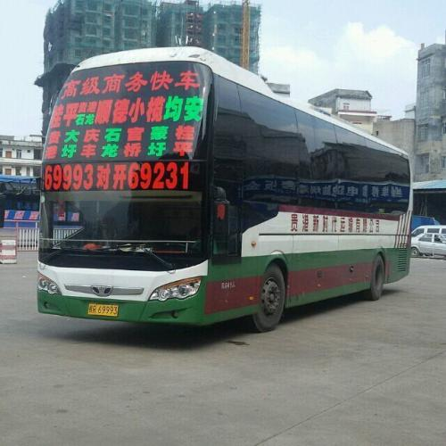

检测结果

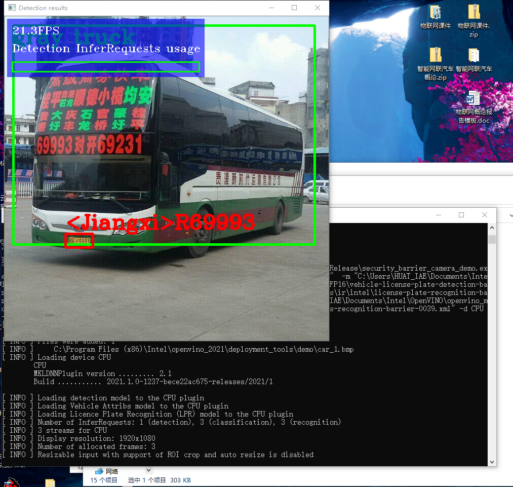

## 总结
openvino的车辆检测代码使用openvino库中的代码即可，此实验难点主要在于openvino环境的配置，只有完全配置好代码才能成功运行，openvino和CMake最好都下载在系统盘里面，不然可能会出错。

## 心得
openvino功能强大，但想要熟练掌握起来是十分困难的，所以需要多尝试，在不断的错误中能有很多收获，最后完成实验。