# 课程报告 
# 基于openCV的人脸识别
# 学号：201809015  
# 姓名：王涵
## 一、下载并处理图
1.1从网络上下载图片
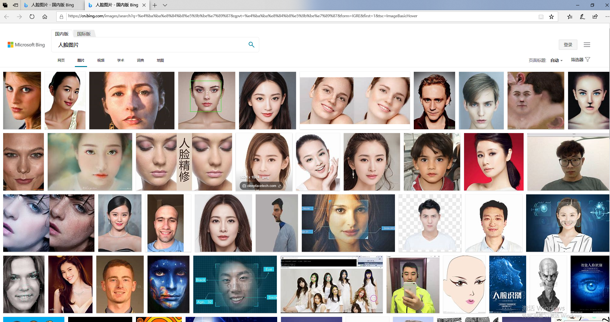
1.2处理图片的大小和格式
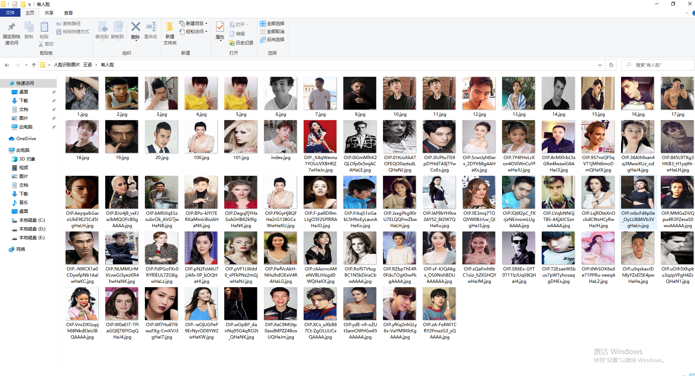

1.3准备好两个文件夹，分别命名为posdata（正样本）和negdata（负样本）
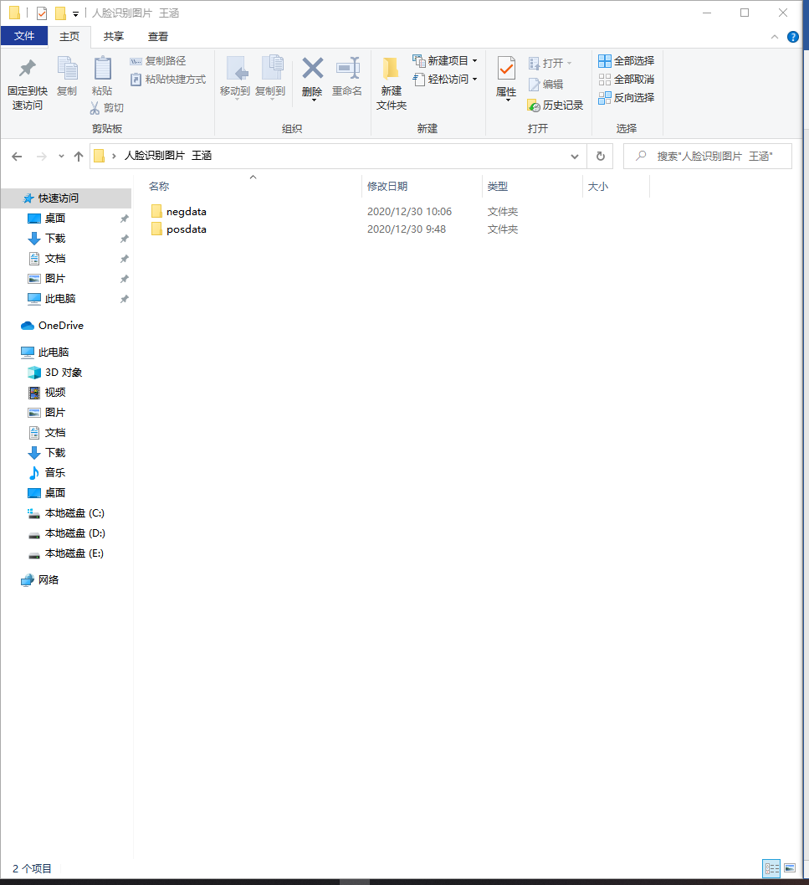
### 注意
1.所有样本的尺寸必须一致，给分类器展示的必须是正确的样本如果不一致的或者尺寸较大的，可以先将所有样本统一缩放到一样大小.
2.posdata中的图片为人脸样本,negdata中的图片为一些背景样本，里面不包含人脸，是用来告诉分类器哪些是错误的样本。

## 二、切换文件夹位置
2.1使用命令提示符（win + r），输入cmd
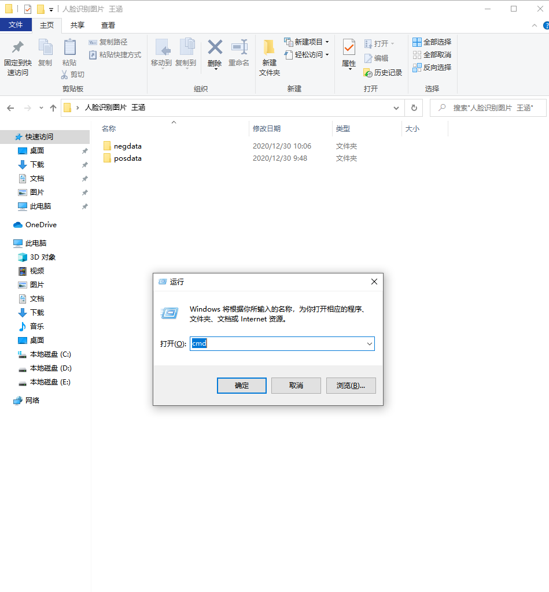

2.2然后在里面输入“ dir /b/s/p/w *.jpg > pos.txt ”，将会在posdata文件夹中产生一个pos.txt的文档。
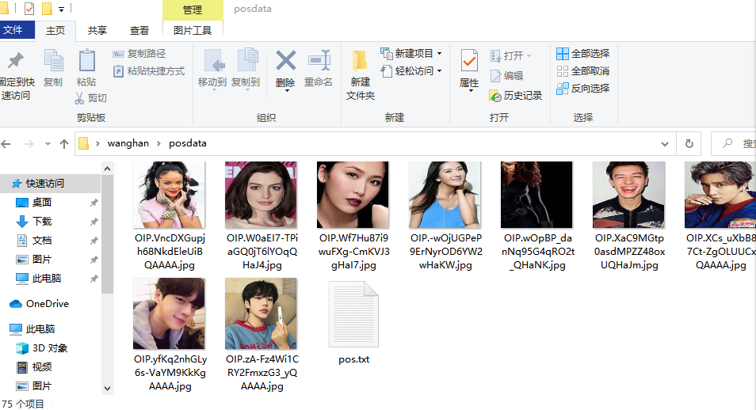

2.3打开pos.txt，选择编辑-替换，在查找中搜索jpg,替换为jpg 1 0 0 240 240，之后保存，将pos.txt复制到上一级目录中。

2.4 negdata文件夹进行相同的操作，在cmd中输入的语句为“ dir /b/s/p/w *.jpg > neg.txt ”。
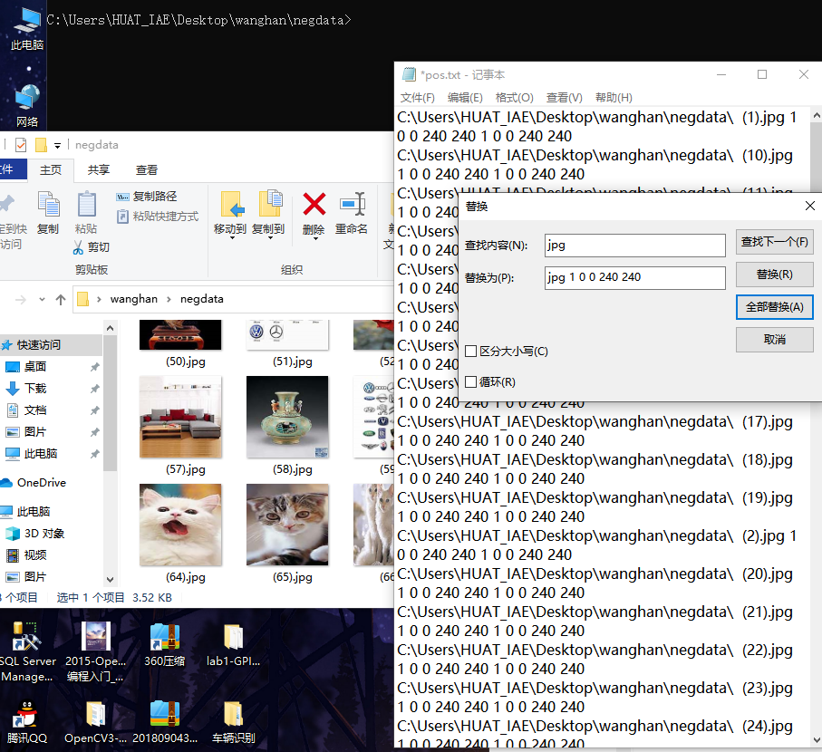

## 三、使用OpenCV，找到文件夹
3.1 选择opencv_createsamples.exe和opencv_traincascade.exe两项，将其复制到需要的文件夹中，与negdata、posdata并列。 
 

## 四、cmd
4.1在该文件目录下输入“ opencv_createsamples.exe -vec pos.vec -info pos.txt -num 32 -w 240 -h 240 ” 。
 
  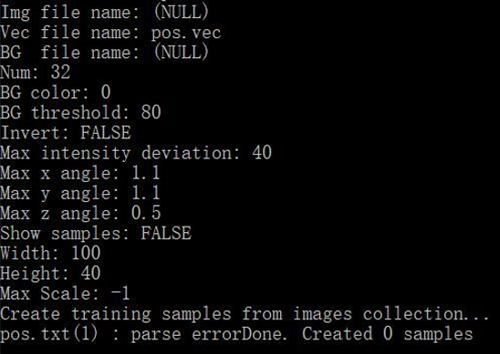

4.2文件夹中会出现pos.vec
 
 
4.3重复该步骤，cmd输入的语句换为“ opencv_createsamples.exe -vec neg.vec -info neg.txt -num 100 -w 240 -h 240 ”，产生neg.vec。

## 五、在主文件夹下创建一个txt文档，命名为“traincascade”。
5.1在该txt中输入“ opencv_traincascade.exe -data xml -vec pos.vec -bg neg.txt -numPos 60 -numNeg 68 -numStages 20 -w 240 -h 240 -mode ALL pause”
注意：numPos 60 代表正样本照片数量 numNeg68 表示负样本照片数量

5.2对“traincascade.txt”进行重命名，将后缀名改为bat。
 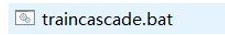
 之后双击“traincascade.bat”。会产生如下效果
 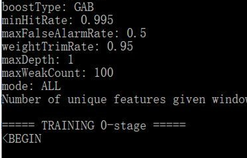
5.3处理完成之后将会在文件夹下生成一个cascade.xml。
 

## 六、 运行VS

6.1配置环境
 
6.2运行代码
 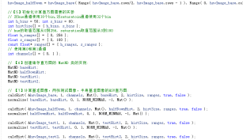

代码为：
#include<opencv2\opencv.hpp>
#include<iostream>
using namespace cv;
using namespace std;

CascadeClassifier face_classifier;
int main(int argc, char**argv)
{
    if (!face_classifier.load(filename))
    {
        printf("could not laod face feature data..\n");
        return -1;
    }
    Mat src = imread("c:/wanghan/15.jpg"); //需要检测的图片
    if (src.empty())
    {
        printf("could not laod image...\n");
        return -1;
    }
    imshow("inupt image", src);
    Mat gray;
    cvtColor(src, gray, COLOR_BGR2GRAY);
    equalizeHist(gray, gray);
    vector<Rect>faces;
    face_classifier.detectMultiScale(gray, faces, 1.1, 3, 0, Size(50, 50));
    for (size_t t = 0; t < faces.size(); t++)
    {
        rectangle(src, faces[static_cast<int>(t)], Scalar(0, 0, 255), 2, 8, 0);
    }
    imshow("detect faces", src);
    waitKey(0);
    return 0;
}

## 七、运行结果
用自己训练的分类器替换opencv自带的分类器进行人脸识别

  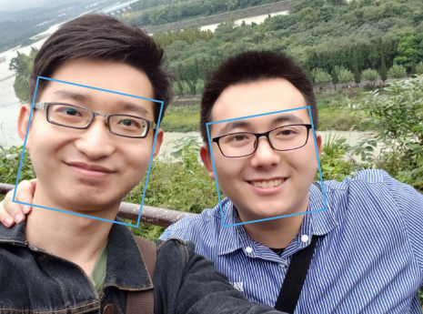

## 学习心得
1.训练分类器时占用CPU空间多，电脑运行将会变卡，处理时间较长
2.其他生物识别需要一些人配合，而人脸识别不需要被动配合，更方便使用
3.自己做的训练集效果比较差，如果用更大的样本集效果会更好
4.一定要注意统一图片格式，不然无法训练
5.在比较基础的无人驾中驶监控驾驶员的状态也是非常重要的一种方法
6.识别之前应该有灰度操作
7.虽然负样本就是样本中不存在正样本的内容，但是负样本也需要配合正样本去选择，不能太过相像
