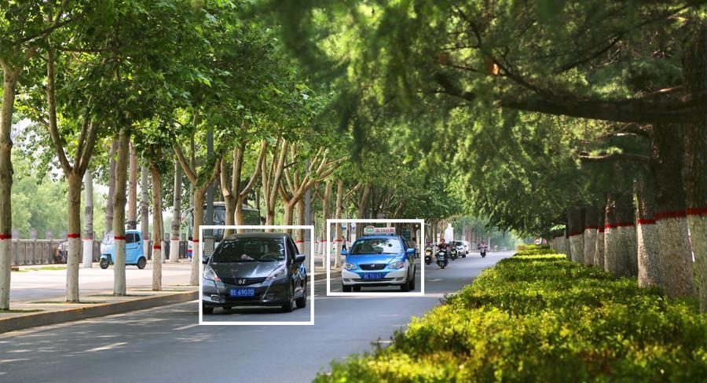

# OpenVINO设计报告
## OpenVINO简介

主要特点：

在Intel平台上提升计算机视觉相关深度学习性能达19倍以上
解除CNN-based的网络在边缘设备的性能瓶颈
对OpenCV，OpenXV*视觉库的传统API实现加速与优化
基于通用API接口在CPU、GPU、FPGA等设备上运行加上
OpenVINO工具包(ToolKit)主要包括两个核心组件，模型优化器(Model Optimizer)和（Model Optimizer）。

OpenVINO模块：

IE推断引擎，在边缘启用基于CNN的深度学习推理

支持跨英特尔CPU，英特尔集成显卡，英特尔FPGA，英特尔Movidius神经计算棒，英特尔神经计算棒2和采用英特尔MovidiusVPU的英特尔视觉加速器设计的异构执行

预训练模型库与转换工具，通过易于使用的计算机视觉功能库和预优化的内核，加快产品上市速度

第三方视觉库的集成调用。针对计算机视觉标准的优化调用，包括OpenCV *，OpenCL和OpenVX *
## 实验内容
下载安装好OpenVINO
上网搜索教程搭建好环境，并配置好代码。
照一张图片，放到指定路径，运行可得结果。

### 代码
import sys
import cv2
from PyQt5.QtGui import *
from PyQt5.QtWidgets import *
from PyQt5.QtGui import QIcon, QPalette, QPixmap, QBrush, QRegExpValidator

class mainWin(QWidget):
    def init(self):
       
        super().init()
        self.initUI()
        self.openBtn.clicked.connect(self.openFile)  
        self.grayBtn.clicked.connect(self.imgGray)  
        self.carCheckBtn.clicked.connect(self.carCheck)

    def initUI(self):
       
        self.setFixedSize(860, 600)
      
        self.setWindowTitle("")
        self.setWindowIcon(QIcon("img/icon.jpg")) 
      
        self.leftLab = QLabel(":", self)
        self.leftLab.setGeometry(10, 50, 400, 400) 
        self.leftLab.setStyleSheet("background:white")

        self.newLab = QLabel(":", self)
        self.newLab.setGeometry(420, 50, 400, 400) 
        self.newLab.setStyleSheet("background-color:white")

        self.openBtn = QPushButton(" ", self)
        self.openBtn.setGeometry(10, 10, 80, 30)

        self.grayBtn = QPushButton(" ", self)
        self.grayBtn.setGeometry(100, 10, 80, 30)

        self.carCheckBtn = QPushButton(" ", self)
        self.carCheckBtn.setGeometry(200, 10, 80, 30)

        def openFile(self):

        print("")

        self.img,imgType = QFileDialog.getOpenFileName(self, "打开图片", "", "*.jpg;;*.png;;ALL FILES(*)")
        print(self.img)

        #jpg = QPixmap(self.img)
        self.leftLab.setPixmap(QPixmap(self.img))
        self.leftLab.setScaledContents(True)

    def imgGray(self):
        print("")
        img1 = cv2.imread(self.img)
        
        img_gray = cv2.cvtColor(img1, cv2.COLOR_RGB2GRAY)

        car_detector = cv2.CascadeClassifier("./cars.xml")
     
        cars = car_detector.detectMultiScale(img_gray, 1.05, 2, cv2.CASCADE_SCALE_IMAGE, (20,20), (100,100))
        print(cars)
        #(274  46  28  28) --(x,y,w,h)

        for(x, y, w, h) in cars:
            print(x, y, w, h)
            #img, pt1, pt2, color, thickness = None, lineType = None, shift = None
            cv2.rectangle(img1,(x,y), (x+w, y+h), (255, 255, 255), 1, cv2.LINE_AA)

        img_gray_name = "1.png" 
        cv2.imwrite(img_gray_name, img1)  

        self.newLab.setPixmap(QPixmap(img_gray_name))
        self.newLab.setScaledContents(True)

### 分析

此函数只能识别图片，如果是视频文件的话，需要添加另一个函数代码。
### 总结
OpenVino给我的感觉就是一个比较成熟而且仍在快速发展的推理库，提供的demo和sample都很充足，上手比较容易，可以用来快速部署开发。
### 心得
网上找的代码并不单一，实用度也不相同，当然做出来的效果也不一样。有的识别度高，有的低。在真正做车辆识别时，一个良好的训练集模型很重要。