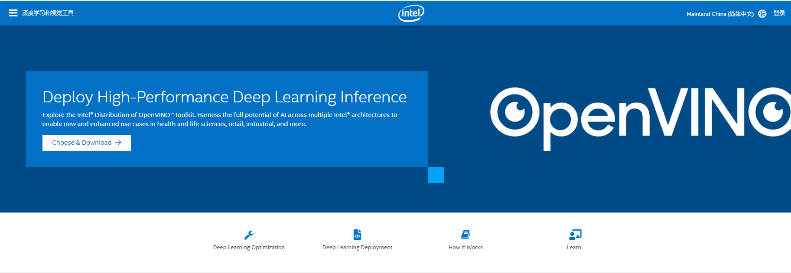
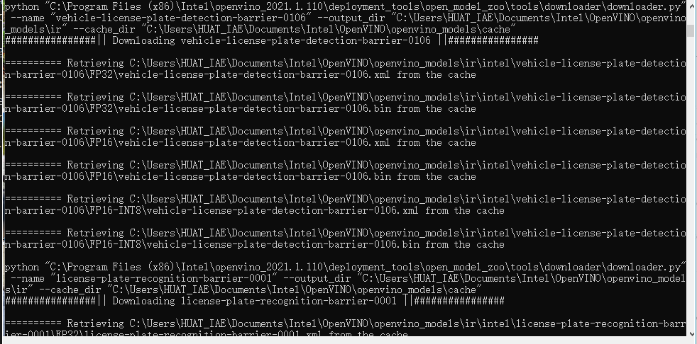
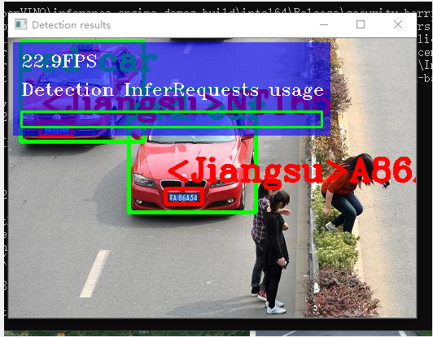

## OpenVINO设计报告
#### openVINO简介
OpenVINO是英特尔推出的一款全面的工具套件，用于快速部署应用和解决方案，支持计算机视觉的CNN网络结构超过150余种。
OpenVINO是一个Pipeline工具集，同时可以兼容各种开源框架训练好的模型，拥有算法模型上线部署的各种能力，只要掌握了该工具，你可以轻松的将预训练模型在Intel的CPU上快速部署起来。
对于AI工作负载来说，OpenVINO提供了深度学习推理套件（DLDT)，该套件可以将各种开源框架训练好的模型进行线上部署，除此之外，还包含了图片处理工具包OpenCV，视频处理工具包Media SDK。
openvino下载地址：https://software.intel.com/content/www/cn/zh/develop/tools/openvino-toolkit.html

支持平台与硬件：
windows
第6代 - 第8代Intel®Core™
英特尔®至强®v5系列
英特尔®至强®v6系列
英特尔®Movidius™神经计算棒
英特尔®神经计算棒2
采用Intel®Movidius™VPU的英特尔®视觉加速器设计

#### 实验步骤
基于OpenVINO的图像处理、检测与识别————车辆目标
在官网上下载好openvino

使用官网教程完成安装并配置好环境
在网络上寻找检测所用图片
放到目标路径下
建议使用CMD窗口运行代码，直接点击bat文件，如果运行出错会直接闪退，不知道错误在哪。

源代码：
```
:: Copyright (C) 2018-2019 Intel Corporation
:: SPDX-License-Identifier: Apache-2.0

@echo off
setlocal enabledelayedexpansion

set TARGET=CPU
set SAMPLE_OPTIONS=
set BUILD_FOLDER=%USERPROFILE%\Documents\Intel\OpenVINO

:: command line arguments parsing
:input_arguments_loop
if not "%1"=="" (
    if "%1"=="-d" (
        set TARGET=%2
        echo target = !TARGET!
        shift
    )
    if "%1"=="-sample-options" (
        set SAMPLE_OPTIONS=%2 %3 %4 %5 %6
        echo sample_options = !SAMPLE_OPTIONS!
        shift
    )
    if "%1"=="-help" (
        echo %~n0%~x0 is security barrier camera demo that showcases three models coming with the product
        echo.
        echo Options:
        echo -d name     Specify the target device to infer on; CPU, GPU, FPGA, HDDL or MYRIAD are acceptable. Sample will look for a suitable plugin for device specified
        exit /b
    )
    shift
    goto :input_arguments_loop
)

set ROOT_DIR=%~dp0

set target_image_path=%ROOT_DIR%car_1.bmp


set TARGET_PRECISION=FP16


echo target_precision = !TARGET_PRECISION!

if exist "%ROOT_DIR%..\..\bin\setupvars.bat" (
    call "%ROOT_DIR%..\..\bin\setupvars.bat"
) else (
    echo setupvars.bat is not found, INTEL_OPENVINO_DIR can't be set
    goto error
)

echo INTEL_OPENVINO_DIR is set to %INTEL_OPENVINO_DIR%

:: Check if Python is installed
python --version 2>NUL
if errorlevel 1 (
   echo Error^: Python is not installed. Please install Python 3.5 ^(64-bit^) or higher from https://www.python.org/downloads/
   goto error
)

:: Check if Python version is equal or higher 3.4
for /F "tokens=* USEBACKQ" %%F IN (`python --version 2^>^&1`) DO (
   set version=%%F
)
echo %var%

for /F "tokens=1,2,3 delims=. " %%a in ("%version%") do (
   set Major=%%b
   set Minor=%%c
)

if "%Major%" geq "3" (
   if "%Minor%" geq "5" (
  set python_ver=okay
   )
)
if not "%python_ver%"=="okay" (
   echo Unsupported Python version. Please install Python 3.5 ^(64-bit^) or higher from https://www.python.org/downloads/
   goto error
)

:: install yaml python modules required for downloader.py
pip3 install --user -r "%ROOT_DIR%..\open_model_zoo\tools\downloader\requirements.in"
if ERRORLEVEL 1 GOTO errorHandling


set models_path=%BUILD_FOLDER%\openvino_models\ir
set models_cache=%BUILD_FOLDER%\openvino_models\cache

if not exist "%models_cache%" (
  mkdir "%models_cache%"
)

set downloader_dir=%INTEL_OPENVINO_DIR%\deployment_tools\open_model_zoo\tools\downloader

for /F "tokens=1,2 usebackq" %%a in ("%ROOT_DIR%demo_security_barrier_camera.conf") do (
   echo python "%downloader_dir%\downloader.py" --name "%%b" --output_dir "%models_path%" --cache_dir "%models_cache%"
   python "%downloader_dir%\downloader.py" --name "%%b" --output_dir "%models_path%" --cache_dir "%models_cache%"

   for /F "tokens=* usebackq" %%d in (
      `python "%downloader_dir%\info_dumper.py" --name "%%b" ^|
         python -c "import sys, json; print(json.load(sys.stdin)[0]['subdirectory'])"`
   ) do (
      set model_args=!model_args! %%a "%models_path%\%%d\%target_precision%\%%b.xml"
   )
)

echo.
echo ###############^|^| Generate VS solution for Inference Engine demos using cmake ^|^|###############
echo.
timeout 3

if "%PROCESSOR_ARCHITECTURE%" == "AMD64" (
   set "PLATFORM=x64"
) else (
   set "PLATFORM=Win32"
)

set VSWHERE="false"
if exist "%ProgramFiles(x86)%\Microsoft Visual Studio\Installer\vswhere.exe" (
   set VSWHERE="true"
   cd "%ProgramFiles(x86)%\Microsoft Visual Studio\Installer"
) else if exist "%ProgramFiles%\Microsoft Visual Studio\Installer\vswhere.exe" (
      set VSWHERE="true"
      cd "%ProgramFiles%\Microsoft Visual Studio\Installer"
) else (
   echo "vswhere tool is not found"
)

set MSBUILD_BIN=
set VS_PATH=

if !VSWHERE! == "true" (
   for /f "usebackq tokens=*" %%i in (`vswhere -latest -products * -requires Microsoft.Component.MSBuild -property installationPath`) do (
      set VS_PATH=%%i
   )
   if exist "!VS_PATH!\MSBuild\14.0\Bin\MSBuild.exe" (
      set "MSBUILD_BIN=!VS_PATH!\MSBuild\14.0\Bin\MSBuild.exe"
   )
   if exist "!VS_PATH!\MSBuild\15.0\Bin\MSBuild.exe" (
      set "MSBUILD_BIN=!VS_PATH!\MSBuild\15.0\Bin\MSBuild.exe"
   )
   if exist "!VS_PATH!\MSBuild\Current\Bin\MSBuild.exe" (
      set "MSBUILD_BIN=!VS_PATH!\MSBuild\Current\Bin\MSBuild.exe"
   )
)

if "!MSBUILD_BIN!" == "" (
   if exist "C:\Program Files (x86)\MSBuild\14.0\Bin\MSBuild.exe" (
      set "MSBUILD_BIN=C:\Program Files (x86)\MSBuild\14.0\Bin\MSBuild.exe"
      set "MSBUILD_VERSION=14 2015"
   )
   if exist "C:\Program Files (x86)\Microsoft Visual Studio\2017\BuildTools\MSBuild\15.0\Bin\MSBuild.exe" (
      set "MSBUILD_BIN=C:\Program Files (x86)\Microsoft Visual Studio\2017\BuildTools\MSBuild\15.0\Bin\MSBuild.exe"
      set "MSBUILD_VERSION=15 2017"
   )
   if exist "C:\Program Files (x86)\Microsoft Visual Studio\2017\Professional\MSBuild\15.0\Bin\MSBuild.exe" (
      set "MSBUILD_BIN=C:\Program Files (x86)\Microsoft Visual Studio\2017\Professional\MSBuild\15.0\Bin\MSBuild.exe"
      set "MSBUILD_VERSION=15 2017"
   )
   if exist "C:\Program Files (x86)\Microsoft Visual Studio\2017\Community\MSBuild\15.0\Bin\MSBuild.exe" (
      set "MSBUILD_BIN=C:\Program Files (x86)\Microsoft Visual Studio\2017\Community\MSBuild\15.0\Bin\MSBuild.exe"
      set "MSBUILD_VERSION=15 2017"
   )
) else (
   if not "!MSBUILD_BIN:2019=!"=="!MSBUILD_BIN!" set "MSBUILD_VERSION=16 2019"
   if not "!MSBUILD_BIN:2017=!"=="!MSBUILD_BIN!" set "MSBUILD_VERSION=15 2017"
   if not "!MSBUILD_BIN:2015=!"=="!MSBUILD_BIN!" set "MSBUILD_VERSION=14 2015"
)

if "!MSBUILD_BIN!" == "" (
   echo Build tools for Visual Studio 2015 / 2017 / 2019 cannot be found. If you use Visual Studio 2017 / 2019, please download and install build tools from https://www.visualstudio.com/downloads/#build-tools-for-visual-studio-2017
   GOTO errorHandling
)

set "SOLUTION_DIR64=%BUILD_FOLDER%\inference_engine_demos_build"

echo Creating Visual Studio !MSBUILD_VERSION! %PLATFORM% files in %SOLUTION_DIR64%... && ^
if exist "%SOLUTION_DIR64%\CMakeCache.txt" del "%SOLUTION_DIR64%\CMakeCache.txt"
cd "%INTEL_OPENVINO_DIR%\deployment_tools\inference_engine\demos" && cmake -E make_directory "%SOLUTION_DIR64%" && cd "%SOLUTION_DIR64%" && cmake -G "Visual Studio !MSBUILD_VERSION!" -A %PLATFORM% "%INTEL_OPENVINO_DIR%\deployment_tools\inference_engine\demos"
if ERRORLEVEL 1 GOTO errorHandling

timeout 7
echo.
echo ###############^|^| Build Inference Engine demos using MS Visual Studio (MSBuild.exe) ^|^|###############
echo.
timeout 3
echo "!MSBUILD_BIN!" Demos.sln /p:Configuration=Release /t:security_barrier_camera_demo /clp:ErrorsOnly /m
"!MSBUILD_BIN!" Demos.sln /p:Configuration=Release /t:security_barrier_camera_demo /clp:ErrorsOnly /m
if ERRORLEVEL 1 GOTO errorHandling

timeout 7

:runSample
echo.
echo ###############^|^| Run Inference Engine security barrier camera demo ^|^|###############
echo.
timeout 3
cd "%SOLUTION_DIR64%\intel64\Release"
if not exist security_barrier_camera_demo.exe (
   cd "%INTEL_OPENVINO_DIR%\inference_engine\demos\intel64\Release"
   echo "%INTEL_OPENVINO_DIR%\inference_engine\demos\intel64\Release\security_barrier_camera_demo.exe" -i "%target_image_path%" %model_args% -d !TARGET! -d_va !TARGET! -d_lpr !TARGET! !SAMPLE_OPTIONS!
)
else (
   echo "%SOLUTION_DIR64%\intel64\Release\security_barrier_camera_demo.exe" -i "%target_image_path%" %model_args% -d !TARGET! -d_va !TARGET! -d_lpr !TARGET! !SAMPLE_OPTIONS!
)
security_barrier_camera_demo.exe -i "%target_image_path%" %model_args% ^
                                 -d !TARGET! -d_va !TARGET! -d_lpr !TARGET! !SAMPLE_OPTIONS!
if ERRORLEVEL 1 GOTO errorHandling

echo.
echo ###############^|^| Demo completed successfully ^|^|###############
cd "%ROOT_DIR%"

goto :eof

:errorHandling
echo Error
cd "%ROOT_DIR%"

```

运行代码：



运行结果：

#### 分析
物件定位：一张影像中可同时出现多个相同或不同物件，大小不据，辨识后会对每个物件产生一个边界框（Bounding Box），如此即可获得较为准确的物件位置（座标）及尺寸（边界框长宽）。

OpenVINO 主要是用来推论用的，特定模型的参数必须在其它框架（TensorFlow、Cafee、Mxnet）下训练好才可使用。OpenVINO 除了可提供硬体加速外，更提供模型优化器（Model Optimizer）功能，可协助去除已训练好的模型中的冗余参数，并可将32bits 浮点数的参数降阶，以牺牲数个百分点正确率来换取推论速度提升数十倍到百倍。
英特尔在OpenVINO模型加速库中设计了一个全新的车牌识别模型用于识别各种车牌包括中文车牌识别，其中在BITVehicle数据集上对中文车牌的识别准确率高达95%以上。官方发布的OpenVINO支持预训练模型中已经包含了LRPNet模型，可以用于实时的车牌识别。

#### 总结
Intel 所提供的开放（免费）电脑视觉推论及神经网路（深度学习）优化工具包「OpenVINO」让对电脑视觉和深度学习原理的初学者可以在很短的时间上手，不必担心如何建置开发平台、选择深度学习框架、训练及优化模型和硬体加速等问题，只需利用预先训练及优化过的语义分割模型，瞬间就可制作出一组看起来很专业的自驾车视觉分析系统。

若觉得执行效能不佳，未来还可轻松从CPU 移植到GPU、FPGA 甚至Movidius 神经计算棒（VPU），实在让我们在学习中方便许多。

#### 心得体会
通过本次学习了解到了openvino的demo库的强大功能，包括了图像检测和人脸追踪等测试例程。加深了对openvino功能的了解，在实训过程中熟悉了操作过程。
OpenVINO主要特点：
- 在Intel平台上提升计算机视觉相关深度学习性能达19倍以上
- 解除CNN-based的网络在边缘设备的性能瓶颈
- 对OpenCV，OpenXV*视觉库的传统API实现加速与优化
- 基于通用API接口在CPU、GPU、FPGA等设备上运行加上

OpenVINO™视觉库(CVSDK)可快速部署模拟人类视觉的应用程序和解决方案。主要包括基于卷积神经网络（CNN）推断模块IE，可以部署深度学习模型部署工具包(DLDT)。
OpenVINO模块：
IE推断引擎，在边缘启用基于CNN的深度学习推理
支持跨英特尔®CPU，英特尔®集成显卡，英特尔®FPGA，英特尔®Movidius™神经计算棒，英特尔®神经计算棒2和采用英特尔®Movidius™VPU的英特尔®视觉加速器设计的异构执行
预训练模型库与转换工具，通过易于使用的计算机视觉功能库和预优化的内核，加快产品上市速度。
第三方视觉库的集成调用。针对计算机视觉标准的优化调用，包括OpenCV *，OpenCL™和OpenVX *