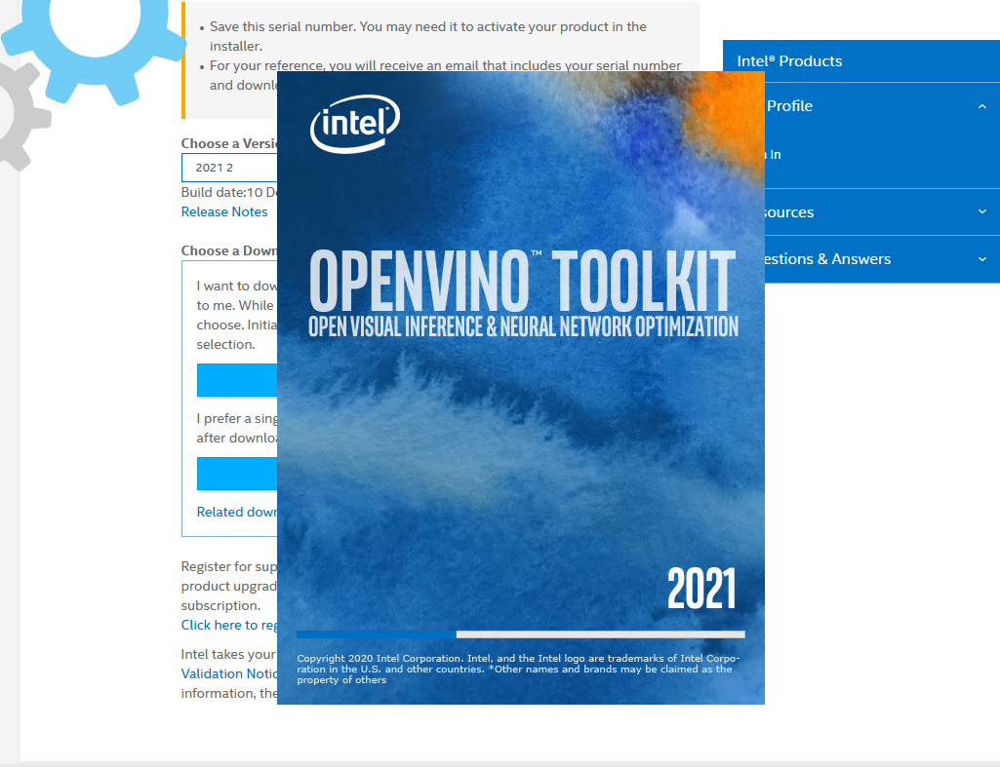
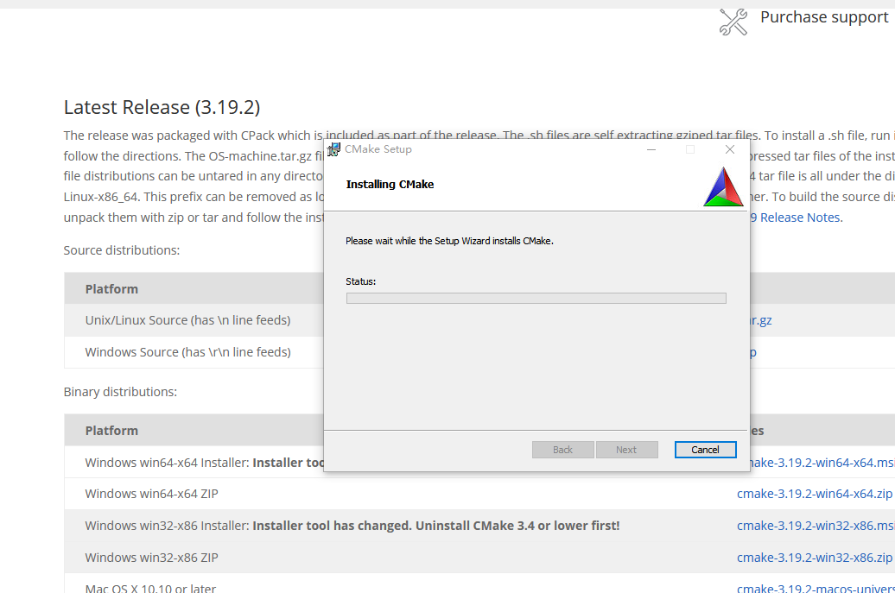
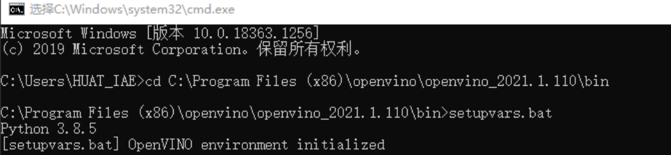
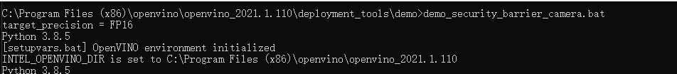
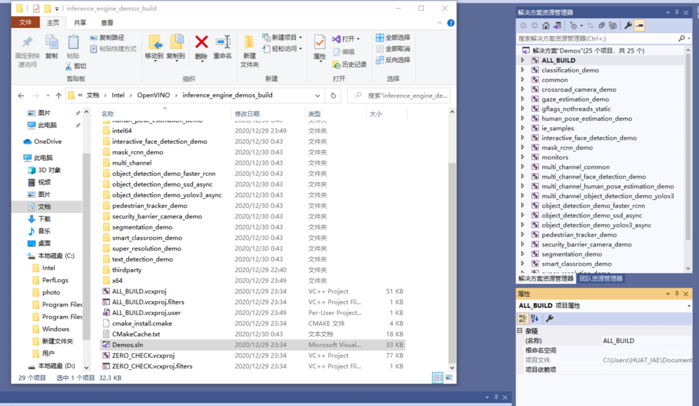
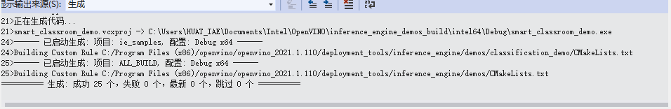
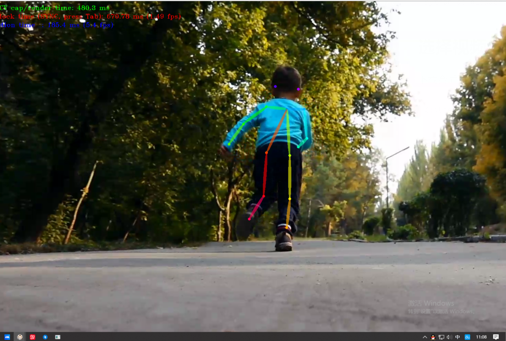

<font color=#0099ff size=7 face="楷体">基于OpenVINO 的人类姿势检测识别</font>
<!-- TOC -->

- [安装openvino及配置环境](#安装openvino及配置环境)
  - [安装openvino](#安装openvino)
  - [安装cmake](#安装cmake)
  - [配置环境变量](#配置环境变量)
  - [使用demo代码检测是否安装成功](#使用demo代码检测是否安装成功)
- [基于openvino的人类姿势识别](#基于openvino的人类姿势识别)
  - [获取相关示例](#获取相关示例)
  - [选择视频](#选择视频)
  - [生成示例文件](#生成示例文件)
  - [运行文件](#运行文件)
  - [结果显示](#结果显示)
  - [模型代码](#模型代码)
- [心得体会](#心得体会)

<!-- /TOC -->
# 安装openvino及配置环境

## 安装openvino

官网下载安装包并解压安装如下图，按照安装提示补充安装其他所需工具。


   注：需配合安装cmake python vs2017或其他版本下载所需工具集即可。

## 安装cmake



## 配置环境变量

打开cmd 进入相应文件路径并打开.bat文件



## 使用demo代码检测是否安装成功

运行摄像头下小车识别程序，得到图片如下。openvino安装成功

   **步骤**：
      1.更换图片修改名字
      2.找到代码地址并运行



**遇到问题**：运行过程中出现提示：cmake运行产生问题。
**解决方案**：检查python版本是否有误，检查vs是否含有所需工具集。更新软件，获取和python相关工具集。成功

<font color=#006400 size=5 face="楷体">至此openvino能正常工作。</font>

# 基于openvino的人类姿势识别

## 获取相关示例

进入官网获取完整示例程序下载到本地

```c
python downloader.py --name human-pose-estimation-0001 --output_dir C:\Users\HUAT_IAE\Desktop\model
```

## 选择视频

下载合适视频到自己熟知的路径中

```c
C:\Users\HUAT_IAE\Desktop\pao.mp4
```

## 生成示例文件

在文档下找到demo.sln文件，打开用VS进行编写生成新文件。

成功后进入下一步，不成功继续增加SDK组件


## 运行文件

进入模型文件夹下

```c
cd C:\Users\HUAT_IAE\Documents\Intel\OpenVINO\inference_engine_demos_build\intel64\Debug
```

运行指令

```c
human_pose_estimation_demo.exe -i C:\Users\HUAT_IAE\Desktop\pao.mp4 -m C:\Users\HUAT_IAE\Desktop\model\intel\human-pose-estimation-0001\FP32\human-pose-estimation-0001.xml
```

## 结果显示



## 模型代码

```c++
// Copyright (C) 2018-2019 Intel Corporation
// SPDX-License-Identifier: Apache-2.0
//

/**
* \brief The entry point for the Inference Engine Human Pose Estimation demo application
* \file human_pose_estimation_demo/main.cpp
* \example human_pose_estimation_demo/main.cpp
*/

#include <vector>
#include <chrono>

#include <inference_engine.hpp>

#include <monitors/presenter.h>
#include <samples/images_capture.h>
#include <samples/ocv_common.hpp>

#include "human_pose_estimation_demo.hpp"
#include "human_pose_estimator.hpp"
#include "render_human_pose.hpp"

using namespace InferenceEngine;
using namespace human_pose_estimation;

bool ParseAndCheckCommandLine(int argc, char* argv[]) {
    // ---------------------------Parsing and validation of input args--------------------------------------

    gflags::ParseCommandLineNonHelpFlags(&argc, &argv, true);
    if (FLAGS_h) {
        showUsage();
        showAvailableDevices();
        return false;
    }

    std::cout << "Parsing input parameters" << std::endl;

    if (FLAGS_i.empty()) {
        throw std::logic_error("Parameter -i is not set");
    }

    if (FLAGS_m.empty()) {
        throw std::logic_error("Parameter -m is not set");
    }

    return true;
}

int main(int argc, char* argv[]) {
    try {
        std::cout << "InferenceEngine: " << *GetInferenceEngineVersion() << std::endl;

        // ------------------------------ Parsing and validation of input args ---------------------------------
        if (!ParseAndCheckCommandLine(argc, argv)) {
            return EXIT_SUCCESS;
        }

        HumanPoseEstimator estimator(FLAGS_m, FLAGS_d, FLAGS_pc);

        std::unique_ptr<ImagesCapture> cap = openImagesCapture(FLAGS_i, FLAGS_loop);
        cv::Mat curr_frame = cap->read();
        if (!curr_frame.data) {
            throw std::runtime_error("Can't read an image from the input");
        }

        cv::Size graphSize{curr_frame.cols / 4, 60};
        Presenter presenter(FLAGS_u, curr_frame.rows - graphSize.height - 10, graphSize);

        estimator.re
```

# 心得体会

本次课设学习了openvino的安装和使用，在课上了解openvino的基础上进一步完善学习过程。软件使用初期因为配置了其他软件更改了环境变量和一些路径，导致软件使用失常。后来在教室电脑重新安装成功并使用如上。使用示例文件和图片检测是否安装成功，安装过程需注意软件的版本配合，不同的VS版本需要配合安装工具集。再结合官网的英文教程一步步完成实验。