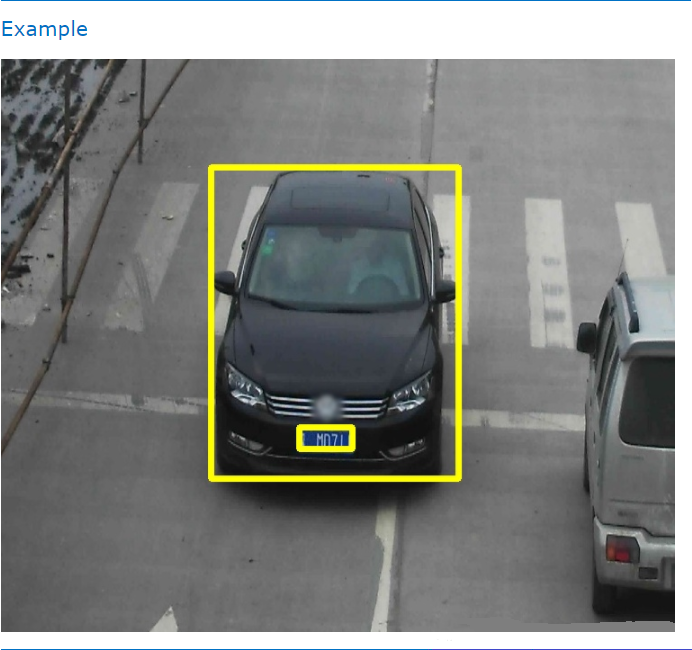
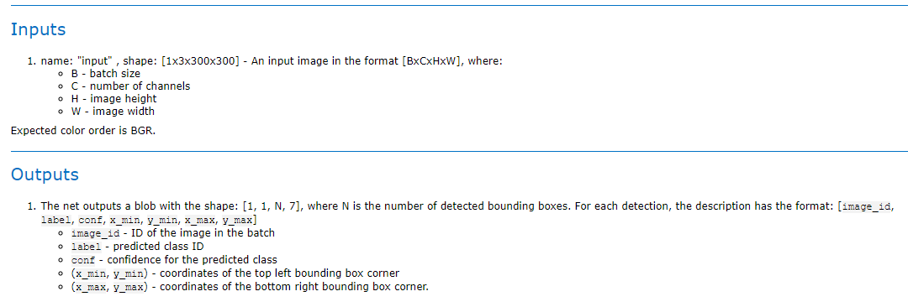
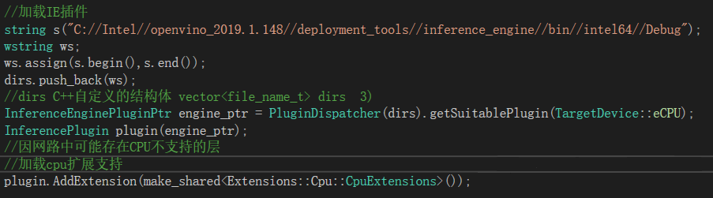
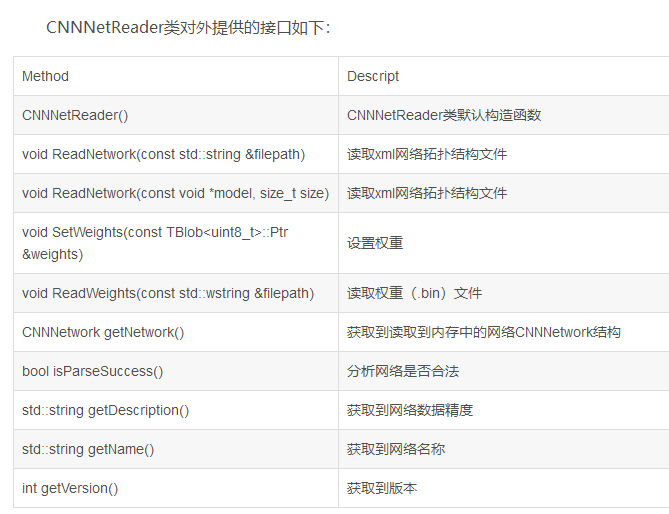
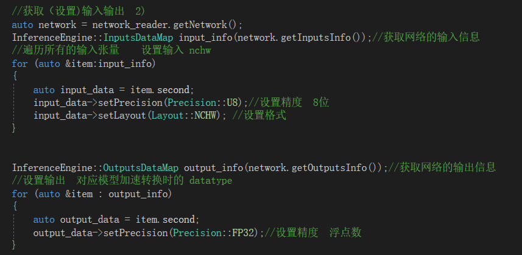
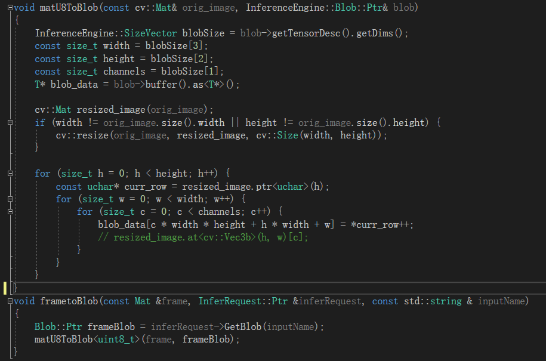

# 1 基于OpenVINO的图像处理、检测与识别
## 1 OpenVINO的主要工作流程
主要流程如下：
1.根据自己的需求选择合适的网络并训练模型。
2.根据自己的训练模型需要配置 Mode Optimizer。
3.根据设置的模型参数运行 Model Optimizer，生成相对应的 IR（主要是 xml 和 bin ）。xml 主要用来描述网络拓扑结构，bin 包括生成的 weights and biases 二进制数据。
4.在实际应用场景中使用 Inference Engine 测试生成的 IR 。（此步骤非常重要，自行生成的 IR 模型，一定要测试是否转换完全及是否成功）
5.在应用程序中调用 Inference Engine 相应接口，将生成的模型 IR 部署到实际环境中。

OpenVINO的主要工作流程图：

## 2 Model Optimizer 及 Model Zoo 介绍
Model optimizer （模型优化器）
Model Optimizer 是一个跨平台命令行工具，用于促进训练与具体实施平台中的过渡，主要是进行静态模型分析 以及根据配置参照自动调整深度模型。
Model Optimizer 被用来设计成支持常用的框架（ Caffe, TensorFlow, MXNet, Kaldi, ONNX 等），相当于封装了一层，便于进行开发。

Model Optimizer 主要工作流程：
1.根据需要所用到的框架，配置 Model Optimizer。
2.提供训练模型作为输入，包括网络拓扑以及参数。
3.运行 Model Optimizer (根据选择的网络拓扑进行训练）。
4. IR 作为 Model Optimizer 输出。
PS：模型优化器对各种深度学习框架模型的支持并非100%的，需要慎重选择。

Model Zoo 介绍
Intel 公开了大量的预训练模型，模型涵盖了人脸检测、年龄检测、文字识别、行人识别、道路分割、表情识别等许多方面，且这些模型是通过优化的，可以直接拿来用于加速产品开发和部署。
Model Zoo 下载链接为 —— https://github.com/opencv/open_model_zoo
除了从上述链接下载自己需要的模型，OpenVINO 提供了一个模型下载工具 downloader.py ,可以直接下载这些预训练模型。

使用方法：
1.以管理员身份运行 Windows 命令终端，进入 “C:\Intel\openvino_2019.1.148\deployment_tools\tools\model_downloader” 路径。
2.使用命令：python downloader.py --name “想要下载的模型名称” 。
PS：name 参数最好不要使用默认值（–all），使用默认值会下载所有的模型，有点多余。

## 3 OpenVINO 应用开发
模型介绍
在本文中选用了 Model Zoo 中的 “vehicle-license-plate-detection-barrier-0106” 模型进行车辆及车牌检测。模型介绍如图：

基于 OpenVINO 的应用开发，简单的讲使用 OpenVINO 工具开发 AI 推理计算应用只需两步：
1.使用 Model Optimizer 工具优化模型。
2.调用 Inference Engine API 函数进行推理计算。

下面详细介绍一下调用 Inference Engine API 函数进行推理计算的流程和相关 API。
1.调用流程

2.各步 API 介绍及调用
(1)加载IE插件支持
针对不同的网络、不同的应用场合可以使用不同的插件作计算后台。在此以 CPU 为例（CPU 需要加载扩展库）

(2)读取网络结构和权重
InferenceEngine::CNNNetReader 将整个网络的拓扑结构（xml 文件）和相关权重（bin 文件）读取到内存中。有多个 API 可以获得网络的各种信息。

(3)设置输入和输出
InferenceEngine::CNNNetwork 对整个网络进行管理，获取网络的信息 输入、输出信息。设置和图像转换。 将模型载入内存后，使用如下 API 指定模型的输入和输出张量的精度和布局。
CNNNetwork::getInputInfo() 获得输入信息
CNNNetwork::getOutputInfo() 获得输出信息

(4)载入模型，创建可执行网络
plugin.LoadNetwork ：将模型载入 AI 计算硬件中，此处需要指定所使用的devicename 参数所指定的计算硬件。

(5)创建推断器
exec_network.CreateInferRequest()

(6)图像数据转换
通常我们是通过 OpenCV 读入图像数据到 Mat 对象，需要使用 frameToBlob() 函数将 OpenCV Mat 对象中的图像数据传给 InferenceEngine Blob 对象，AI 模型从 InferenceEngine Blob 中获得图像数据。

(7)同步/异步推断
使用 InferenceEngine::InferRequest::Infer() 方法进行同步推理计算。同步推断常用于对单张图像或少量图像处理不太注重处理效率时使用。

异步推断常用于图像的批量处理和视频处理当中，用到的方法有：
InferenceEngine::InferRequest::StartAsync() 和InferenceEngine::InferRequest::wait()

(8)解析输出
处理预测结果 [11N*7] [image_id label conf x_min y_min x_max y_max] 需要注意的是：x_min y_min x_max y_max 为占比系数，需要乘以图像的宽和高转换为实际尺寸。
InferenceEngine::InferRequest::GetBlob() 获得推理计算结果。

程序检测结果如图所示：
