# <center>智能AI课程设计</center>

## <center>Title：基于OpenVino的预训练SSD模型之实现行人检测</center>
## <center>Desinger：智能181曹梓妍</center>

### 一、Introduction

OpenVino和TensorRT类似，是硬件厂商针对自家的硬件平台开发的一套深度学习工具库，包含推断库，模型优化等等一系列与深度学习模型部署相关的功能。通俗易懂点说想要在intel-cpu或者嵌入式上部署深度学习模型，之前你使用libtorch或者tvm，这个时候可以考虑考虑openvino，其针对intel的多代cpu以及其他硬件平台做了针对的优化。

其工作流程，同TensorRT以及其他的部署工具都差不多，训练好模型，解析成openvino专用的.xml和.bin，随后传入Inference Engine中进行推理。唯一不同的是与TensorRT一样，是闭源的，给你.so文件你去调用就行。

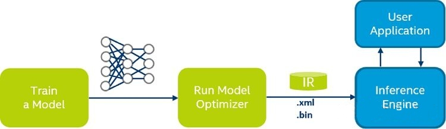

Intel OpenVINO 可以将 pre-trained deep learning models 部署在多个平台，并充分利用平台特性进行推理加速。无论是官方提供的模型，还是我们使用工具进行转换后的模型，都在 OpenVINO 推理引擎上有很好的性能。

但 OpenVINO 复杂的结构、庞大的内容为学习带来困难，此外深度学习模型如何运用于实际带来许多困扰。在本次课程设计报告中，就从 OpenVINO 的例子中，精选出“行人识别“案例，讲如何转化运用。

### 二、Theory

#### （一）行人检测

行人检测( Pedestrian Detection)是利用计算机视觉技术判断图像或者视频序列中是否存在行人并给予精确定位。简单来说，利用计算机对图像或者视频进行处理，来达到识别行人是否存在的目的。

#### （二）SSD模型

SSD网络是继YOLO之后的one-stage目标检测网络，是为了改善YOLO网络设置的anchor设计的太过于粗糙而提出的，其设计思想主要是多尺度多长宽比的密集锚点设计和特征金字塔。

- 模型来自OpenVINO官方提供的预训练模型库
- 网络结构：
- 详细版：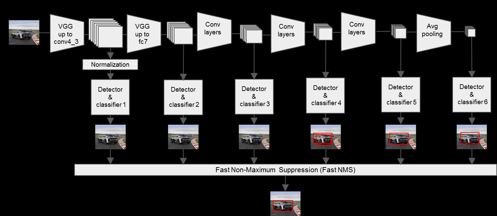

通过上面的图，我们可以清楚的看到SSD的网络结构主要分为以下几个部分：

    VGG16 Base Layer
    Extra Feature Layer
    Detection Layer
    NMS

补充说明：在整个SSD网络中，其实还隐藏了两个重要的部分：

    Anchor 
    MultiBoxLoss

### 三、Process

#### （一）安装openvino

准备：

- step1:进入官网下载对应版本的openvino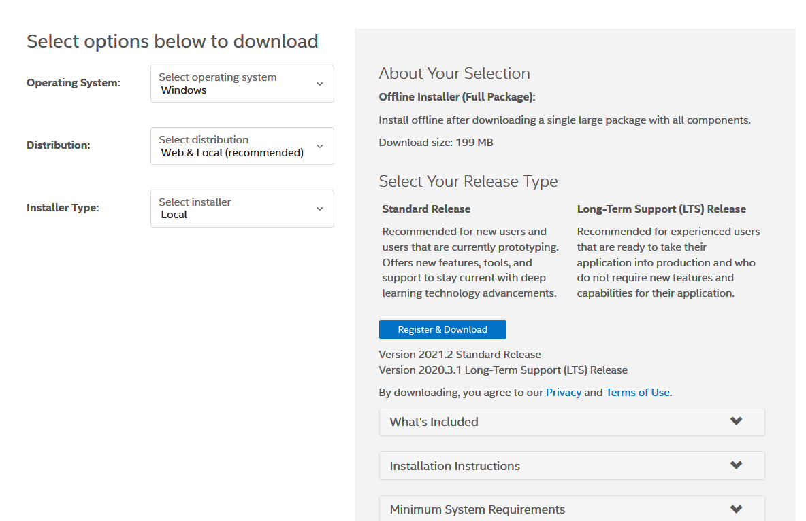
- step2:填写选择信息
- step3:下载安装openvino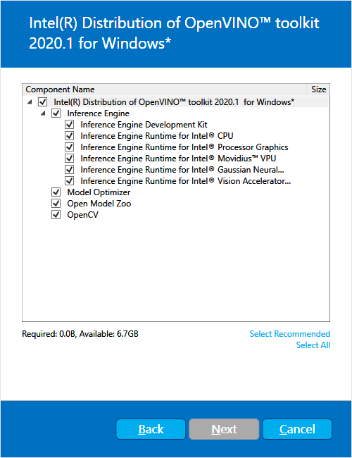
- step4:cmake安装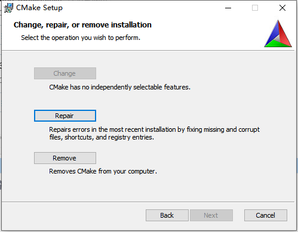
- step5:python安装

验证：

- step1:运行相应文件使openvino环境初始化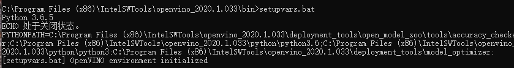
- step2:示例运行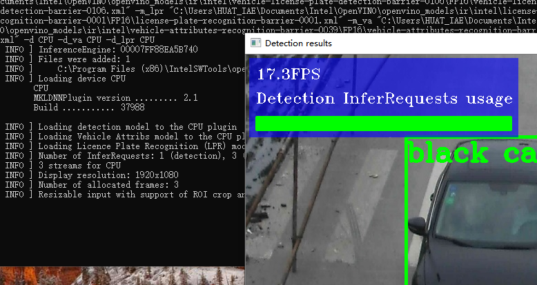

运行编辑:

- step1:编译运行文件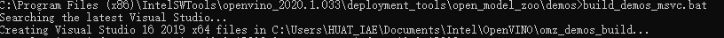
- step2:生成EXE文件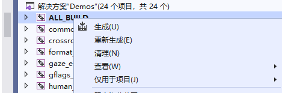
  
模型、素材下载：

- step1:下载SDD模型准备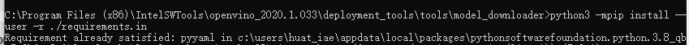
- step2:下载SDD模型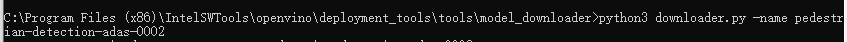
- step3:下载素材（本次素材选用的为小学生过马路节选视频）

结果展示：

- 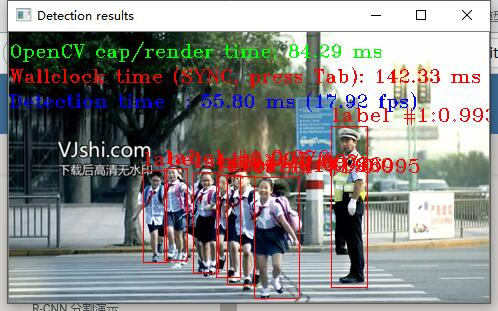
- 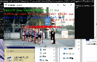

### 四、总结与个人体会

#### （一）总结

本次设计的灵感来源于当前火热话题-无人驾驶，由此而想到在无人驾驶的进行中如何检测到行人并及时做出反应。在此想法之下，本次课程设计完成了对行人检测模块的设计，同时尝试了对于SSD模型的有效训练，熟练使用C++高级语言训练模型和代码可视化。

程序基于OpenVINO的异步推断实现了视频实时的行人检测，在行人检测得到行人ROI的基础上，调用行人属性识别模型实现行人属性识别，输出结果显示。

在本次课程设计中，我从中学习到了深度学习开发的基本过程，增强了使用实际动手操作训练模型的能力，巩固了机器视觉开发工具OpenCV的数据库，熟练了Openvino的使用和开发。

#### （二）个人体会

刚开始拿到这个课程设计的题目我的心情有些起伏不定：一方面我的心情很难受：期末都快结束了，突然增加了两门课设，放假的心，熬夜的头~。


但没办法呀，还是要毕业可不是。于是乎，经过仔细研究，我选择了课设题目中的Openvino。（能加分不要是傻子可不是）


另一方面呢，可以多花时间加深对Openvino的理解与应用。

我们可以在此课设中，加强对Openvino开发过程的了解，增加熟悉度为以后更加熟练使用和开发做准备。（主要是我参加的竞赛是无人驾驶项目组，我们组准备通过深度学习，训练相关模型，完成我们的设计~）


想到Openvino作业Paddle Paddle中，我们为了得到准确率为1，疯狂训练模型，浪费了我一晚上的时间，还是回到了最初的起点。人生啊，还是要尝试，不尝试你怎么知道自己会失败呢

于是，胡厚淮同学给我推荐了一个小天使-“SSD模型”。直接训练好的模型，我们只需要下载并使用~


于是，在我的两位竞赛小组队友的帮助下，我非常顺利而且快速的完成了本次课程设计~ 队友选的好，打团只用躺~ 

C'est fini! Bonne année!


代码展示：
```C++
// Copyright (C) 2018-2019 Intel Corporation
// SPDX-License-Identifier: Apache-2.0
//

/**
* \brief The entry point for the Inference Engine object_detection demo application
* \file object_detection_demo_ssd_async/main.cpp
* \example object_detection_demo_ssd_async/main.cpp
*/

#include <gflags/gflags.h>

#include <chrono>
#include <iostream>
#include <memory>
#include <vector>
#include <string>
#include <algorithm>

#include <inference_engine.hpp>

#include <monitors/presenter.h>
#include <samples/ocv_common.hpp>
#include <samples/slog.hpp>

#include "object_detection_demo_ssd_async.hpp"
#ifdef WITH_EXTENSIONS
#include <ext_list.hpp>
#endif

using namespace InferenceEngine;

bool ParseAndCheckCommandLine(int argc, char *argv[]) {
    // ---------------------------Parsing and validation of input args--------------------------------------
    gflags::ParseCommandLineNonHelpFlags(&argc, &argv, true);
    if (FLAGS_h) {
       showUsage();
       showAvailableDevices();
       return false;
    }
    slog::info << "Parsing input parameters" << slog::endl;

    if (FLAGS_i.empty()) {
        throw std::logic_error("Parameter -i is not set");
    }

    if (FLAGS_m.empty()) {
        throw std::logic_error("Parameter -m is not set");
    }

    return true;
}

void frameToBlob(const cv::Mat& frame,
                 InferRequest::Ptr& inferRequest,
                 const std::string& inputName) {
    if (FLAGS_auto_resize) {
        /* Just set input blob containing read image. Resize and layout conversion will be done automatically */
        inferRequest->SetBlob(inputName, wrapMat2Blob(frame));
    } else {
        /* Resize and copy data from the image to the input blob */
        Blob::Ptr frameBlob = inferRequest->GetBlob(inputName);
        matU8ToBlob<uint8_t>(frame, frameBlob);
    }
}

int main(int argc, char *argv[]) {
    try {
        /** This demo covers certain topology and cannot be generalized for any object detection **/
        std::cout << "InferenceEngine: " << GetInferenceEngineVersion() << std::endl;

        // ------------------------------ Parsing and validation of input args ---------------------------------
        if (!ParseAndCheckCommandLine(argc, argv)) {
            return 0;
        }

        slog::info << "Reading input" << slog::endl;
        cv::VideoCapture cap;
        if (!((FLAGS_i == "cam") ? cap.open(0) : cap.open(FLAGS_i.c_str()))) {
            throw std::logic_error("Cannot open input file or camera: " + FLAGS_i);
        }
        const size_t width  = (size_t) cap.get(cv::CAP_PROP_FRAME_WIDTH);
        const size_t height = (size_t) cap.get(cv::CAP_PROP_FRAME_HEIGHT);

        // read input (video) frame
        cv::Mat curr_frame;  cap >> curr_frame;
        cv::Mat next_frame;

        if (!cap.grab()) {
            throw std::logic_error("This demo supports only video (or camera) inputs !!! "
                                   "Failed getting next frame from the " + FLAGS_i);
        }
        // -----------------------------------------------------------------------------------------------------

        // --------------------------- 1. Load inference engine -------------------------------------
        slog::info << "Loading Inference Engine" << slog::endl;
        Core ie;

        slog::info << "Device info: " << slog::endl;
        std::cout << ie.GetVersions(FLAGS_d);

        /** Load extensions for the plugin **/

#ifdef WITH_EXTENSIONS
        /** Loading default extensions **/
        if (FLAGS_d.find("CPU") != std::string::npos) {
            /**
             * cpu_extensions library is compiled from "extension" folder containing
             * custom MKLDNNPlugin layer implementations. These layers are not supported
             * by mkldnn, but they can be useful for inferring custom topologies.
            **/
            ie.AddExtension(std::make_shared<Extensions::Cpu::CpuExtensions>(), "CPU");
        }
#endif

        if (!FLAGS_l.empty()) {
            // CPU(MKLDNN) extensions are loaded as a shared library and passed as a pointer to base extension
            IExtensionPtr extension_ptr = make_so_pointer<IExtension>(FLAGS_l.c_str());
            ie.AddExtension(extension_ptr, "CPU");
        }
        if (!FLAGS_c.empty()) {
            // clDNN Extensions are loaded from an .xml description and OpenCL kernel files
            ie.SetConfig({{PluginConfigParams::KEY_CONFIG_FILE, FLAGS_c}}, "GPU");
        }

        /** Per layer metrics **/
        if (FLAGS_pc) {
            ie.SetConfig({ { PluginConfigParams::KEY_PERF_COUNT, PluginConfigParams::YES } });
        }
        // -----------------------------------------------------------------------------------------------------

        // --------------------------- 2. Read IR Generated by ModelOptimizer (.xml and .bin files) ------------
        slog::info << "Loading network files" << slog::endl;
        /** Read network model **/
        auto cnnNetwork = ie.ReadNetwork(FLAGS_m);
        /** Set batch size to 1 **/
        slog::info << "Batch size is forced to  1." << slog::endl;
        cnnNetwork.setBatchSize(1);
        /** Read labels (if any)**/
        std::string labelFileName = fileNameNoExt(FLAGS_m) + ".labels";
        std::vector<std::string> labels;
        std::ifstream inputFile(labelFileName);
        std::copy(std::istream_iterator<std::string>(inputFile),
                  std::istream_iterator<std::string>(),
                  std::back_inserter(labels));
        // -----------------------------------------------------------------------------------------------------

        /** SSD-based network should have one input and one output **/
        // --------------------------- 3. Configure input & output ---------------------------------------------
        // --------------------------- Prepare input blobs -----------------------------------------------------
        slog::info << "Checking that the inputs are as the demo expects" << slog::endl;
        InputsDataMap inputInfo(cnnNetwork.getInputsInfo());

        std::string imageInputName, imageInfoInputName;
        size_t netInputHeight, netInputWidth;

        for (const auto & inputInfoItem : inputInfo) {
            if (inputInfoItem.second->getTensorDesc().getDims().size() == 4) {  // first input contains images
                imageInputName = inputInfoItem.first;
                inputInfoItem.second->setPrecision(Precision::U8);
                if (FLAGS_auto_resize) {
                    inputInfoItem.second->getPreProcess().setResizeAlgorithm(ResizeAlgorithm::RESIZE_BILINEAR);
                    inputInfoItem.second->getInputData()->setLayout(Layout::NHWC);
                } else {
                    inputInfoItem.second->getInputData()->setLayout(Layout::NCHW);
                }
                const TensorDesc& inputDesc = inputInfoItem.second->getTensorDesc();
                netInputHeight = getTensorHeight(inputDesc);
                netInputWidth = getTensorWidth(inputDesc);
            } else if (inputInfoItem.second->getTensorDesc().getDims().size() == 2) {  // second input contains image info
                imageInfoInputName = inputInfoItem.first;
                inputInfoItem.second->setPrecision(Precision::FP32);
            } else {
                throw std::logic_error("Unsupported " +
                                       std::to_string(inputInfoItem.second->getTensorDesc().getDims().size()) + "D "
                                       "input layer '" + inputInfoItem.first + "'. "
                                       "Only 2D and 4D input layers are supported");
            }
        }

        // --------------------------- Prepare output blobs -----------------------------------------------------
        slog::info << "Checking that the outputs are as the demo expects" << slog::endl;
        OutputsDataMap outputInfo(cnnNetwork.getOutputsInfo());
        if (outputInfo.size() != 1) {
            throw std::logic_error("This demo accepts networks having only one output");
        }
        DataPtr& output = outputInfo.begin()->second;
        auto outputName = outputInfo.begin()->first;
        const int num_classes = cnnNetwork.getLayerByName(outputName.c_str())->GetParamAsInt("num_classes");
        if (static_cast<int>(labels.size()) != num_classes) {
            if (static_cast<int>(labels.size()) == (num_classes - 1))  // if network assumes default "background" class, having no label
                labels.insert(labels.begin(), "fake");
            else
                labels.clear();
        }
        const SizeVector outputDims = output->getTensorDesc().getDims();
        const int maxProposalCount = outputDims[2];
        const int objectSize = outputDims[3];
        if (objectSize != 7) {
            throw std::logic_error("Output should have 7 as a last dimension");
        }
        if (outputDims.size() != 4) {
            throw std::logic_error("Incorrect output dimensions for SSD");
        }
        output->setPrecision(Precision::FP32);
        output->setLayout(Layout::NCHW);
        // -----------------------------------------------------------------------------------------------------

        // --------------------------- 4. Loading model to the device ------------------------------------------
        slog::info << "Loading model to the device" << slog::endl;
        ExecutableNetwork network = ie.LoadNetwork(cnnNetwork, FLAGS_d);
        // -----------------------------------------------------------------------------------------------------

        // --------------------------- 5. Create infer request -------------------------------------------------
        InferRequest::Ptr async_infer_request_curr = network.CreateInferRequestPtr();
        InferRequest::Ptr async_infer_request_next = network.CreateInferRequestPtr();

        /* it's enough just to set image info input (if used in the model) only once */
        if (!imageInfoInputName.empty()) {
            auto setImgInfoBlob = [&](const InferRequest::Ptr &inferReq) {
                auto blob = inferReq->GetBlob(imageInfoInputName);
                auto data = blob->buffer().as<PrecisionTrait<Precision::FP32>::value_type *>();
                data[0] = static_cast<float>(netInputHeight);  // height
                data[1] = static_cast<float>(netInputWidth);  // width
                data[2] = 1;
            };
            setImgInfoBlob(async_infer_request_curr);
            setImgInfoBlob(async_infer_request_next);
        }
        // -----------------------------------------------------------------------------------------------------

        // --------------------------- 6. Do inference ---------------------------------------------------------
        slog::info << "Start inference " << slog::endl;

        bool isLastFrame = false;
        bool isAsyncMode = false;  // execution is always started using SYNC mode
        bool isModeChanged = false;  // set to TRUE when execution mode is changed (SYNC<->ASYNC)

        typedef std::chrono::duration<double, std::ratio<1, 1000>> ms;
        auto total_t0 = std::chrono::high_resolution_clock::now();
        auto wallclock = std::chrono::high_resolution_clock::now();
        double ocv_decode_time = 0, ocv_render_time = 0;

        std::cout << "To close the application, press 'CTRL+C' here or switch to the output window and press ESC key" << std::endl;
        std::cout << "To switch between sync/async modes, press TAB key in the output window" << std::endl;
        cv::Size graphSize{static_cast<int>(cap.get(cv::CAP_PROP_FRAME_WIDTH) / 4), 60};
        Presenter presenter(FLAGS_u, static_cast<int>(cap.get(cv::CAP_PROP_FRAME_HEIGHT)) - graphSize.height - 10, graphSize);
        while (true) {
            auto t0 = std::chrono::high_resolution_clock::now();
            // Here is the first asynchronous point:
            // in the async mode we capture frame to populate the NEXT infer request
            // in the regular mode we capture frame to the CURRENT infer request
            if (!cap.read(next_frame)) {
                if (next_frame.empty()) {
                    isLastFrame = true;  // end of video file
                } else {
                    throw std::logic_error("Failed to get frame from cv::VideoCapture");
                }
            }
            if (isAsyncMode) {
                if (isModeChanged) {
                    frameToBlob(curr_frame, async_infer_request_curr, imageInputName);
                }
                if (!isLastFrame) {
                    frameToBlob(next_frame, async_infer_request_next, imageInputName);
                }
            } else if (!isModeChanged) {
                frameToBlob(curr_frame, async_infer_request_curr, imageInputName);
            }

            auto t1 = std::chrono::high_resolution_clock::now();
            ocv_decode_time = std::chrono::duration_cast<ms>(t1 - t0).count();

            t0 = std::chrono::high_resolution_clock::now();
            // Main sync point:
            // in the truly Async mode we start the NEXT infer request, while waiting for the CURRENT to complete
            // in the regular mode we start the CURRENT request and immediately wait for it's completion
            if (isAsyncMode) {
                if (isModeChanged) {
                    async_infer_request_curr->StartAsync();
                }
                if (!isLastFrame) {
                    async_infer_request_next->StartAsync();
                }
            } else if (!isModeChanged) {
                async_infer_request_curr->StartAsync();
            }

            if (OK == async_infer_request_curr->Wait(IInferRequest::WaitMode::RESULT_READY)) {
                t1 = std::chrono::high_resolution_clock::now();
                ms detection = std::chrono::duration_cast<ms>(t1 - t0);

                t0 = std::chrono::high_resolution_clock::now();
                ms wall = std::chrono::duration_cast<ms>(t0 - wallclock);
                wallclock = t0;

                t0 = std::chrono::high_resolution_clock::now();

                presenter.drawGraphs(curr_frame);

                std::ostringstream out;
                out << "OpenCV cap/render time: " << std::fixed << std::setprecision(2)
                    << (ocv_decode_time + ocv_render_time) << " ms";
                cv::putText(curr_frame, out.str(), cv::Point2f(0, 25), cv::FONT_HERSHEY_TRIPLEX, 0.6, cv::Scalar(0, 255, 0));
                out.str("");
                out << "Wallclock time " << (isAsyncMode ? "(TRUE ASYNC):      " : "(SYNC, press Tab): ");
                out << std::fixed << std::setprecision(2) << wall.count() << " ms (" << 1000.f / wall.count() << " fps)";
                cv::putText(curr_frame, out.str(), cv::Point2f(0, 50), cv::FONT_HERSHEY_TRIPLEX, 0.6, cv::Scalar(0, 0, 255));
                if (!isAsyncMode) {  // In the true async mode, there is no way to measure detection time directly
                    out.str("");
                    out << "Detection time  : " << std::fixed << std::setprecision(2) << detection.count()
                        << " ms ("
                        << 1000.f / detection.count() << " fps)";
                    cv::putText(curr_frame, out.str(), cv::Point2f(0, 75), cv::FONT_HERSHEY_TRIPLEX, 0.6,
                                cv::Scalar(255, 0, 0));
                }

                // ---------------------------Process output blobs--------------------------------------------------
                // Processing results of the CURRENT request
                const float *detections = async_infer_request_curr->GetBlob(outputName)->buffer().as<PrecisionTrait<Precision::FP32>::value_type*>();
                for (int i = 0; i < maxProposalCount; i++) {
                    float image_id = detections[i * objectSize + 0];
                    if (image_id < 0) {
                        break;
                    }

                    float confidence = detections[i * objectSize + 2];
                    auto label = static_cast<int>(detections[i * objectSize + 1]);
                    float xmin = detections[i * objectSize + 3] * width;
                    float ymin = detections[i * objectSize + 4] * height;
                    float xmax = detections[i * objectSize + 5] * width;
                    float ymax = detections[i * objectSize + 6] * height;

                    if (FLAGS_r) {
                        std::cout << "[" << i << "," << label << "] element, prob = " << confidence <<
                                  "    (" << xmin << "," << ymin << ")-(" << xmax << "," << ymax << ")"
                                  << ((confidence > FLAGS_t) ? " WILL BE RENDERED!" : "") << std::endl;
                    }

                    if (confidence > FLAGS_t) {
                        /** Drawing only objects when > confidence_threshold probability **/
                        std::ostringstream conf;
                        conf << ":" << std::fixed << std::setprecision(3) << confidence;
                        cv::putText(curr_frame,
                                    (static_cast<size_t>(label) < labels.size() ?
                                    labels[label] : std::string("label #") + std::to_string(label)) + conf.str(),
                                    cv::Point2f(xmin, ymin - 5), cv::FONT_HERSHEY_COMPLEX_SMALL, 1,
                                    cv::Scalar(0, 0, 255));
                        cv::rectangle(curr_frame, cv::Point2f(xmin, ymin), cv::Point2f(xmax, ymax), cv::Scalar(0, 0, 255));
                    }
                }
            }

            if (!FLAGS_no_show) {
                cv::imshow("Detection results", curr_frame);
            }

            t1 = std::chrono::high_resolution_clock::now();
            ocv_render_time = std::chrono::duration_cast<ms>(t1 - t0).count();

            if (isLastFrame) {
                break;
            }

            if (isModeChanged) {
                isModeChanged = false;
            }

            // Final point:
            // in the truly Async mode we swap the NEXT and CURRENT requests for the next iteration
            curr_frame = next_frame;
            next_frame = cv::Mat();
            if (isAsyncMode) {
                async_infer_request_curr.swap(async_infer_request_next);
            }

            const int key = cv::waitKey(1);
            if (27 == key)  // Esc
                break;
            if (9 == key) {  // Tab
                isAsyncMode ^= true;
                isModeChanged = true;
            } else {
                presenter.handleKey(key);
            }
        }
        // -----------------------------------------------------------------------------------------------------
        auto total_t1 = std::chrono::high_resolution_clock::now();
        ms total = std::chrono::duration_cast<ms>(total_t1 - total_t0);
        std::cout << "Total Inference time: " << total.count() << std::endl;

        /** Show performace results **/
        if (FLAGS_pc) {
            printPerformanceCounts(*async_infer_request_curr, std::cout, getFullDeviceName(ie, FLAGS_d));
        }
        std::cout << presenter.reportMeans() << '\n';
    }
    catch (const std::exception& error) {
        std::cerr << "[ ERROR ] " << error.what() << std::endl;
        return 1;
    }
    catch (...) {
        std::cerr << "[ ERROR ] Unknown/internal exception happened." << std::endl;
        return 1;
    }

    slog::info << "Execution successful" << slog::endl;
    return 0;
}
```
