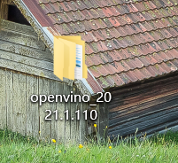
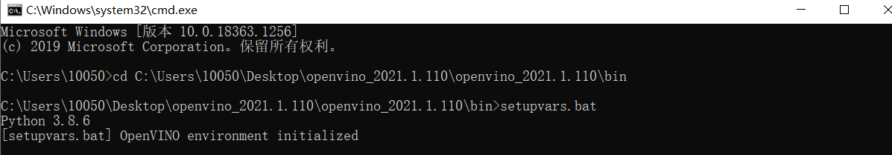
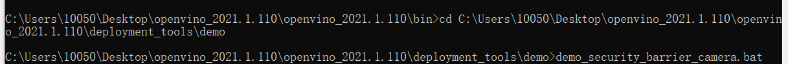
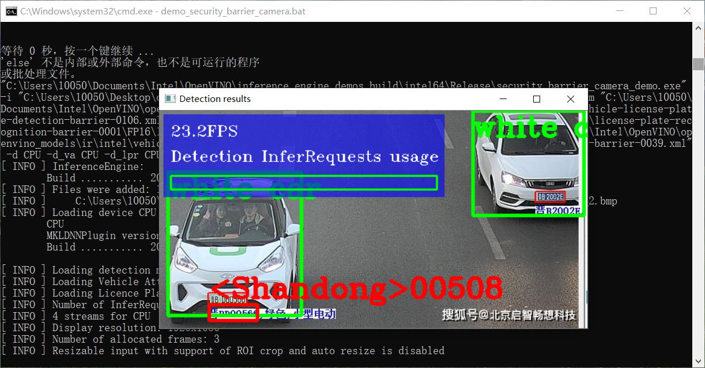
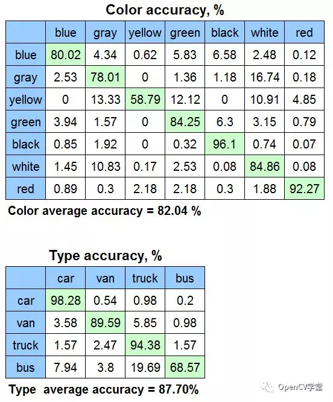

# OpenVINO的图像处理、检测与识别
## 1.OpenVINO的安装和配置环境
首先在网上下载OpenVINO

我没有配置环境变量，所以每次运行OpenVINO都需要先运行C:\Program Files (x86)\IntelSWTools\openvino_<版本号>\bin 目录下的setupvars.bat批处理文件

## 2.OpenVINO识别车辆目标
运行代码

结果


## 3.代码
```
:: Copyright (C) 2018-2019 Intel Corporation
:: SPDX-License-Identifier: Apache-2.0

@echo off
setlocal enabledelayedexpansion

set TARGET=CPU
set SAMPLE_OPTIONS=
set BUILD_FOLDER=%USERPROFILE%\Documents\Intel\OpenVINO

:: command line arguments parsing
:input_arguments_loop
if not "%1"=="" (
    if "%1"=="-d" (
        set TARGET=%2
        echo target = !TARGET!
        shift
    )
    if "%1"=="-sample-options" (
        set SAMPLE_OPTIONS=%2 %3 %4 %5 %6
        echo sample_options = !SAMPLE_OPTIONS!
        shift
    )
    if "%1"=="-help" (
        echo %~n0%~x0 is security barrier camera demo that showcases three models coming with the product
        echo.
        echo Options:
        echo -d name     Specify the target device to infer on; CPU, GPU, FPGA, HDDL or MYRIAD are acceptable. Sample will look for a suitable plugin for device specified
        exit /b
    )
    shift
    goto :input_arguments_loop
)

set ROOT_DIR=%~dp0

set target_image_path=%ROOT_DIR%car_2.bmp


set TARGET_PRECISION=FP16


echo target_precision = !TARGET_PRECISION!

if exist "%ROOT_DIR%..\..\bin\setupvars.bat" (
    call "%ROOT_DIR%..\..\bin\setupvars.bat"
) else (
    echo setupvars.bat is not found, INTEL_OPENVINO_DIR can't be set
    goto error
)

echo INTEL_OPENVINO_DIR is set to %INTEL_OPENVINO_DIR%

:: Check if Python is installed
python --version 2>NUL
if errorlevel 1 (
   echo Error^: Python is not installed. Please install Python 3.5 ^(64-bit^) or higher from https://www.python.org/downloads/
   goto error
)

:: Check if Python version is equal or higher 3.4
for /F "tokens=* USEBACKQ" %%F IN (`python --version 2^>^&1`) DO (
   set version=%%F
)
echo %var%

for /F "tokens=1,2,3 delims=. " %%a in ("%version%") do (
   set Major=%%b
   set Minor=%%c
)

if "%Major%" geq "3" (
   if "%Minor%" geq "5" (
  set python_ver=okay
   )
)
if not "%python_ver%"=="okay" (
   echo Unsupported Python version. Please install Python 3.5 ^(64-bit^) or higher from https://www.python.org/downloads/
   goto error
)

:: install yaml python modules required for downloader.py
pip3 install --user -r "%ROOT_DIR%..\open_model_zoo\tools\downloader\requirements.in"
if ERRORLEVEL 1 GOTO errorHandling


set models_path=%BUILD_FOLDER%\openvino_models\ir
set models_cache=%BUILD_FOLDER%\openvino_models\cache

if not exist "%models_cache%" (
  mkdir "%models_cache%"
)

set downloader_dir=%INTEL_OPENVINO_DIR%\deployment_tools\open_model_zoo\tools\downloader

for /F "tokens=1,2 usebackq" %%a in ("%ROOT_DIR%demo_security_barrier_camera.conf") do (
   echo python "%downloader_dir%\downloader.py" --name "%%b" --output_dir "%models_path%" --cache_dir "%models_cache%"
   python "%downloader_dir%\downloader.py" --name "%%b" --output_dir "%models_path%" --cache_dir "%models_cache%"

   for /F "tokens=* usebackq" %%d in (
      `python "%downloader_dir%\info_dumper.py" --name "%%b" ^|
         python -c "import sys, json; print(json.load(sys.stdin)[0]['subdirectory'])"`
   ) do (
      set model_args=!model_args! %%a "%models_path%\%%d\%target_precision%\%%b.xml"
   )
)

echo.
echo ###############^|^| Generate VS solution for Inference Engine demos using cmake ^|^|###############
echo.
timeout 3

if "%PROCESSOR_ARCHITECTURE%" == "AMD64" (
   set "PLATFORM=x64"
) else (
   set "PLATFORM=Win32"
)

set VSWHERE="false"
if exist "%ProgramFiles(x86)%\Microsoft Visual Studio\Installer\vswhere.exe" (
   set VSWHERE="true"
   cd "%ProgramFiles(x86)%\Microsoft Visual Studio\Installer"
) else if exist "%ProgramFiles%\Microsoft Visual Studio\Installer\vswhere.exe" (
      set VSWHERE="true"
      cd "%ProgramFiles%\Microsoft Visual Studio\Installer"
) else (
   echo "vswhere tool is not found"
)

set MSBUILD_BIN=
set VS_PATH=

if !VSWHERE! == "true" (
   for /f "usebackq tokens=*" %%i in (`vswhere -latest -products * -requires Microsoft.Component.MSBuild -property installationPath`) do (
      set VS_PATH=%%i
   )
   if exist "!VS_PATH!\MSBuild\14.0\Bin\MSBuild.exe" (
      set "MSBUILD_BIN=!VS_PATH!\MSBuild\14.0\Bin\MSBuild.exe"
   )
   if exist "!VS_PATH!\MSBuild\15.0\Bin\MSBuild.exe" (
      set "MSBUILD_BIN=!VS_PATH!\MSBuild\15.0\Bin\MSBuild.exe"
   )
   if exist "!VS_PATH!\MSBuild\Current\Bin\MSBuild.exe" (
      set "MSBUILD_BIN=!VS_PATH!\MSBuild\Current\Bin\MSBuild.exe"
   )
)

if "!MSBUILD_BIN!" == "" (
   if exist "C:\Program Files (x86)\MSBuild\14.0\Bin\MSBuild.exe" (
      set "MSBUILD_BIN=C:\Program Files (x86)\MSBuild\14.0\Bin\MSBuild.exe"
      set "MSBUILD_VERSION=14 2015"
   )
   if exist "C:\Program Files (x86)\Microsoft Visual Studio\2017\BuildTools\MSBuild\15.0\Bin\MSBuild.exe" (
      set "MSBUILD_BIN=C:\Program Files (x86)\Microsoft Visual Studio\2017\BuildTools\MSBuild\15.0\Bin\MSBuild.exe"
      set "MSBUILD_VERSION=15 2017"
   )
   if exist "C:\Program Files (x86)\Microsoft Visual Studio\2017\Professional\MSBuild\15.0\Bin\MSBuild.exe" (
      set "MSBUILD_BIN=C:\Program Files (x86)\Microsoft Visual Studio\2017\Professional\MSBuild\15.0\Bin\MSBuild.exe"
      set "MSBUILD_VERSION=15 2017"
   )
   if exist "C:\Program Files (x86)\Microsoft Visual Studio\2017\Community\MSBuild\15.0\Bin\MSBuild.exe" (
      set "MSBUILD_BIN=C:\Program Files (x86)\Microsoft Visual Studio\2017\Community\MSBuild\15.0\Bin\MSBuild.exe"
      set "MSBUILD_VERSION=15 2017"
   )
) else (
   if not "!MSBUILD_BIN:2019=!"=="!MSBUILD_BIN!" set "MSBUILD_VERSION=16 2019"
   if not "!MSBUILD_BIN:2017=!"=="!MSBUILD_BIN!" set "MSBUILD_VERSION=15 2017"
   if not "!MSBUILD_BIN:2015=!"=="!MSBUILD_BIN!" set "MSBUILD_VERSION=14 2015"
)

if "!MSBUILD_BIN!" == "" (
   echo Build tools for Visual Studio 2015 / 2017 / 2019 cannot be found. If you use Visual Studio 2017 / 2019, please download and install build tools from https://www.visualstudio.com/downloads/#build-tools-for-visual-studio-2017
   GOTO errorHandling
)

set "SOLUTION_DIR64=%BUILD_FOLDER%\inference_engine_demos_build"

echo Creating Visual Studio !MSBUILD_VERSION! %PLATFORM% files in %SOLUTION_DIR64%... && ^
if exist "%SOLUTION_DIR64%\CMakeCache.txt" del "%SOLUTION_DIR64%\CMakeCache.txt"
cd "%INTEL_OPENVINO_DIR%\deployment_tools\inference_engine\demos" && cmake -E make_directory "%SOLUTION_DIR64%" && cd "%SOLUTION_DIR64%" && cmake -G "Visual Studio !MSBUILD_VERSION!" -A %PLATFORM% "%INTEL_OPENVINO_DIR%\deployment_tools\inference_engine\demos"
if ERRORLEVEL 1 GOTO errorHandling

timeout 7
echo.
echo ###############^|^| Build Inference Engine demos using MS Visual Studio (MSBuild.exe) ^|^|###############
echo.
timeout 3
echo "!MSBUILD_BIN!" Demos.sln /p:Configuration=Release /t:security_barrier_camera_demo /clp:ErrorsOnly /m
"!MSBUILD_BIN!" Demos.sln /p:Configuration=Release /t:security_barrier_camera_demo /clp:ErrorsOnly /m
if ERRORLEVEL 1 GOTO errorHandling

timeout 7

:runSample
echo.
echo ###############^|^| Run Inference Engine security barrier camera demo ^|^|###############
echo.
timeout 3
cd "%SOLUTION_DIR64%\intel64\Release"
if not exist security_barrier_camera_demo.exe (
   cd "%INTEL_OPENVINO_DIR%\inference_engine\demos\intel64\Release"
   echo "%INTEL_OPENVINO_DIR%\inference_engine\demos\intel64\Release\security_barrier_camera_demo.exe" -i "%target_image_path%" %model_args% -d !TARGET! -d_va !TARGET! -d_lpr !TARGET! !SAMPLE_OPTIONS!
)
else (
   echo "%SOLUTION_DIR64%\intel64\Release\security_barrier_camera_demo.exe" -i "%target_image_path%" %model_args% -d !TARGET! -d_va !TARGET! -d_lpr !TARGET! !SAMPLE_OPTIONS!
)
security_barrier_camera_demo.exe -i "%target_image_path%" %model_args% ^
                                 -d !TARGET! -d_va !TARGET! -d_lpr !TARGET! !SAMPLE_OPTIONS!
if ERRORLEVEL 1 GOTO errorHandling

echo.
echo ###############^|^| Demo completed successfully ^|^|###############
cd "%ROOT_DIR%"

goto :eof

:errorHandling
echo Error
cd "%ROOT_DIR%"

```

## 4.总结
使用对象检测网络MobileNet SSD V2版本实现车辆与车牌检测，对得到车辆与车牌ROI对象，分别送到后续的车辆属性识别网络与车牌识别网络中，实现对车辆属性(颜色与车辆类型)识别输出与车牌识别输出。图示如下：


其中车辆属性识别模型输入大小为72x72，支持的颜色与车辆类别如下：


## 5.代码分析
##### 加载插件

注意可以使用多个插件，对不同的网络使用不同的插件作为计算后台，OpenVINO是支持这种方式，加载CPU插件，代码如下：
```
// 创建IE插件
InferenceEnginePluginPtr engine_ptr = PluginDispatcher(dirs).getSuitablePlugin(TargetDevice::eCPU);
InferencePlugin plugin(engine_ptr);

// 加载CPU扩展库支持
plugin.AddExtension(std::make_shared<Extensions::Cpu::CpuExtensions>());
```
##### 加载检测与识别网络

需要预先加载对象检测与识别网络，加载好的网络信息，存储到如下结构体中：
``` 
struct MyDetectionNet {
    ExecutableNetwork net;
    std::string inputName;
    std::string sencondOutputName;
    std::string outputName;
};
```
加载网络的代码如下：
```
// 加载车辆与车牌检测网络
loadVehiclePlateNetWork(plugin);

// 加载车辆属性识别网络
loadVehicleAttributesNetWork(plugin);

// 加载车牌识别网络
loadVehicleLicenseNetWork(plugin);
```
输入图像数据，开始执行网络预测推断，这个部分代码实现如下：
```
/** Getting input blob **/
auto input = vehicleplateDetectorinfer.GetBlob(vehicleDetector.inputName);
size_t num_channels = input->getTensorDesc().getDims()[1];
size_t h = input->getTensorDesc().getDims()[2];
size_t w = input->getTensorDesc().getDims()[3];
size_t image_size = h*w;
Mat blob_image;
resize(src, blob_image, Size(h, w));

// NCHW
unsigned char* data = static_cast<unsigned char*>(input->buffer());
for (size_t row = 0; row < h; row++) {
    for (size_t col = 0; col < w; col++) {
        for (size_t ch = 0; ch < num_channels; ch++) {
            data[image_size*ch + row*w + col] = blob_image.at<Vec3b>(row, col)[ch];
        }
    }
}

// 执行预测
vehicleplateDetectorinfer.Infer();
```

解析输出实现车辆属性识别与车牌识别
##### 车牌识别
```
Rect roi;
roi.x = rect.x - padding;
roi.y = rect.y - padding;
roi.width = rect.width + padding*2;
roi.height = rect.height + padding*2;
LicensePlateObject lpo;
lpo.location = roi;
fetchLicenseText(src(roi), lpo);
putText(src,  lpo.text.c_str(), Point(roi.x-40, roi.y - 10), FONT_HERSHEY_SIMPLEX, 0.8, Scalar(0, 0, 255), 2, 8);
```

##### 车辆属性识别
```
VehicleObject vo;
vo.location = rect;
fetchVehicleAttributes(src(rect), vo);
putText(src, format("vehicle color: %s", vo.color.c_str()), Point(rect.x, rect.y - 20), FONT_HERSHEY_SIMPLEX, 1.0, Scalar(255, 0, 255), 2, 8);
putText(src, format("vehicle type: %s", vo.type.c_str()), Point(rect.x, rect.y - 40), FONT_HERSHEY_SIMPLEX, 1.0, Scalar(255, 0, 255), 2, 8);

```
车辆属性检测网络，输入，推断与解析输出的函数实现代码如下：

```
// 设置输入数据
Blob::Ptr inputBlob = vehicleAttrDetectorInfer.GetBlob(attrDetector.inputName);
matU8ToBlob<uint8_t>(blob, inputBlob);

// 执行推断图
vehicleAttrDetectorInfer.Infer();

// 获取输出结果
auto colorsValues = vehicleAttrDetectorInfer.GetBlob(attrDetector.outputName)->buffer().as<float*>();
auto typesValues = vehicleAttrDetectorInfer.GetBlob(attrDetector.sencondOutputName)->buffer().as<float*>();

// 获取最大可能行
const auto color_id = max_element(colorsValues, colorsValues + 7) - colorsValues;
const auto type_id = max_element(typesValues, typesValues + 4) - typesValues;

info.color = colors[color_id];
info.type = types[type_id];
```
车牌识别网络的输入，推断与解析输出的函数实现代码如下：

// 执行推断
plateLicenseRecognizerInfer.Infer();
```
// 解析输出结果
const auto data = plateLicenseRecognizerInfer.GetBlob(PLRDetector.outputName)->buffer().as<float*>();
string result;
for (int i = 0; i < maxSequenceSizePerPlate; i++) {
    if (data[i] == -1)
        break;
    result += items[data[i]];
}
info.text = result;
```

## 6.心得体会
通过这次设计实验，我学会了安装OpenVINO，如何配置OpenVINO的环境变量和如何使用它。我选择的是对车辆目标的识别，通过代码运行，可以识别出车辆的颜色和车牌号。通过在网上查找代码，查看注释，学会了一些代码的基础应用。