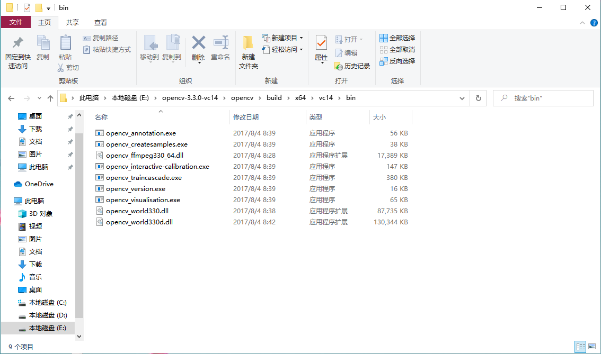

# 设计报告

## 实验目标

围绕智能驾驶环境感知的任务，实现对图像中的车辆进行识别
实验形式 openvino 、opencv 两种方法

## 实验设计报告内容介绍

本人分别用openvino和opencv两种方式
进行了尝试，都成功了！！！

个人认为我的opencv实验做得更加完美，因为opencv本人自己做出了训练集
openvino实现了，但是是用的自带训练集
实验设计报告主要内容为使用安装openvino，及其识别步骤、opencv模板匹配算法(当然这不是主要内容但是是我接下来步骤的思路)、opencv训练集生成，opencv对车辆检测

## 实验过程

### openvino安装

在这个过程中我们必须安装python、vs、cmake、环境变量配置（注意版本要求--》安装提示已经给出这里不再赘述）

#### 配置模型优化器

进入目录
C:\Program Files (x86)\Intel\openvino_2021\deplopment_tools\model_optimizer\install_prerequisites

运行以下批处理文件，为 Caffe*、TensorFlow*、MXNet*、Kaldi* 和 ONNX* 配置模型优化器：

通过模型优化器来使用的框架的批处理文件。您可以运行多个：

用于 Caffe:


用于 TensorFlow:


用于 MXNet：


用于 ONNX：


用于 Kaldi：


模型优化器针对一个或多个框架得到配置。通过和下列画面类似的画面来表示配置成功

使用验证脚本来验证您的安装

进入demo目录，将自己要准备的车辆图片加入文件夹中

修改demo_sercurity_barrier_camera.bat文件


这里改为你要识别文件的名字就ok了

运行图像分类验证脚本


当验证脚本完成时，您将拥有十个最常用类别的标签和推理能力如图所示


接下来运行demo_sercurity_barrier_camera.bat文件


### openvino实验结果

结果图


有一说一这个太容易了,我还没有发现其中的精髓，没有真正的弄懂它，感觉它不是这么用的，我看了openvino的一些xml文件训练集和一些训练图片，感觉那个就是训练集，那里面好像还有识别人脸，动物的什么的

### opencv做法

#### 设想

我认为可以从书中模板匹配做文章

于是我修改代码操作一波

```c++

#include "opencv2/highgui/highgui.hpp"
#include "opencv2/imgproc/imgproc.hpp"
using namespace cv;


//-----------------------------------【宏定义部分】-------------------------------------------- 
//  描述：定义一些辅助宏 
//------------------------------------------------------------------------------------------------ 
#define WINDOW_NAME1 "【原始图片】"        //为窗口标题定义的宏 
#define WINDOW_NAME2 "【匹配窗口】"        //为窗口标题定义的宏
#define WINDOW_NAME3 "【匹配窗口】"        //为窗口标题定义的宏

//-----------------------------------【全局变量声明部分】------------------------------------
//          描述：全局变量的声明
//-----------------------------------------------------------------------------------------------
Mat g_srcImage; Mat g_templateImage; Mat g_resultImage; Mat g_templateImage2; Mat g_resultImage2;
int g_nMatchMethod;
int g_nMatchMethod2;
int g_nMaxTrackbarNum = 5;

//-----------------------------------【全局函数声明部分】--------------------------------------
//          描述：全局函数的声明
//-----------------------------------------------------------------------------------------------
void on_Matching(int, void*);
static void ShowHelpText();


//-----------------------------------【main( )函数】--------------------------------------------
//          描述：控制台应用程序的入口函数，我们的程序从这里开始执行
//-----------------------------------------------------------------------------------------------
int main()
{
	//【0】改变console字体颜色
	system("color 1F");

	//【0】显示帮助文字
	ShowHelpText();

	//【1】载入原图像和模板块
	g_srcImage = imread("D:/img/test/test.jpg", 1);
	g_templateImage = imread("D:/img/data/data1.jpg", 1);
	g_templateImage2 = imread("D:/img/data/data2.jpg", 1);
	//【2】创建窗口
	namedWindow(WINDOW_NAME1, WINDOW_AUTOSIZE);
	namedWindow(WINDOW_NAME2, WINDOW_AUTOSIZE);
	namedWindow(WINDOW_NAME3, WINDOW_AUTOSIZE);
	//【3】创建滑动条并进行一次初始化
	createTrackbar("方法", WINDOW_NAME1, &g_nMatchMethod, g_nMaxTrackbarNum, on_Matching);
	on_Matching(0, 0);

	waitKey(0);
	return 0;

}

//-----------------------------------【on_Matching( )函数】--------------------------------
//          描述：回调函数
//-------------------------------------------------------------------------------------------
void on_Matching(int, void*)
{
	//【1】给局部变量初始化
	Mat srcImage;
	g_srcImage.copyTo(srcImage);

	//【2】初始化用于结果输出的矩阵
	int resultImage_rows = g_srcImage.rows - g_templateImage.rows + 1;
	int resultImage_cols = g_srcImage.cols - g_templateImage.cols + 1;
	g_resultImage.create(resultImage_rows, resultImage_cols, CV_32FC1);

	int resultImage2_rows = g_srcImage.rows - g_templateImage2.rows + 1;
	int resultImage2_cols = g_srcImage.cols - g_templateImage2.cols + 1;
	g_resultImage2.create(resultImage2_rows, resultImage2_cols, CV_32FC1);
	//【3】进行匹配和标准化
	matchTemplate(g_srcImage, g_templateImage, g_resultImage, g_nMatchMethod);
	normalize(g_resultImage, g_resultImage, 0, 1, NORM_MINMAX, -1, Mat());

	matchTemplate(g_srcImage, g_templateImage2, g_resultImage2, g_nMatchMethod2);
	normalize(g_resultImage2, g_resultImage2, 0, 1, NORM_MINMAX, -1, Mat());

	//【4】通过函数 minMaxLoc 定位最匹配的位置
	double minValue; double maxValue; Point minLocation; Point maxLocation;
	Point matchLocation;
	double minValue2; double maxValue2; Point minLocation2; Point maxLocation2;
	Point matchLocation2;
	minMaxLoc(g_resultImage, &minValue, &maxValue, &minLocation, &maxLocation, Mat());
	minMaxLoc(g_resultImage2, &minValue2, &maxValue2, &minLocation2, &maxLocation2, Mat());

	//【5】对于方法 SQDIFF 和 SQDIFF_NORMED, 越小的数值有着更高的匹配结果. 而其余的方法, 数值越大匹配效果越好
	//此句代码的OpenCV2版为：
	//if( g_nMatchMethod  == CV_TM_SQDIFF || g_nMatchMethod == CV_TM_SQDIFF_NORMED )
	//此句代码的OpenCV3版为：
	if (g_nMatchMethod == TM_SQDIFF || g_nMatchMethod == TM_SQDIFF_NORMED)
	{
		matchLocation = minLocation;
	}
	else
	{
		matchLocation = maxLocation;
	}

	if (g_nMatchMethod2 == TM_SQDIFF || g_nMatchMethod2 == TM_SQDIFF_NORMED)
	{
		matchLocation2 = minLocation2;
	}
	else
	{
		matchLocation2 = maxLocation2;
	}

	//【6】绘制出矩形，并显示最终结果
	rectangle(srcImage, matchLocation, Point(matchLocation.x + g_templateImage.cols, matchLocation.y + g_templateImage.rows), Scalar(0, 0, 255), 2, 8, 0);
	rectangle(g_resultImage, matchLocation, Point(matchLocation.x + g_templateImage.cols, matchLocation.y + g_templateImage.rows), Scalar(0, 0, 255), 2, 8, 0);
	rectangle(srcImage, matchLocation2, Point(matchLocation2.x + g_templateImage2.cols, matchLocation2.y + g_templateImage2.rows), Scalar(0, 0, 255), 2, 8, 0);
	rectangle(g_resultImage2, matchLocation2, Point(matchLocation2.x + g_templateImage2.cols, matchLocation2.y + g_templateImage2.rows), Scalar(0, 0, 255), 2, 8, 0);
	imshow(WINDOW_NAME1, srcImage);
	imshow(WINDOW_NAME2, g_resultImage);
	imshow(WINDOW_NAME3, g_resultImage);

}


//-----------------------------------【ShowHelpText( )函数】----------------------------------
//          描述：输出一些帮助信息
//----------------------------------------------------------------------------------------------
static void ShowHelpText()
{

	//输出一些帮助信息
	printf("\t欢迎来到【模板匹配】示例程序~\n");
	printf("\n\n\t请调整滑动条观察图像效果\n\n");
	printf("\n\t滑动条对应的方法数值说明: \n\n"
		"\t\t方法【0】- 平方差匹配法(SQDIFF)\n"
		"\t\t方法【1】- 归一化平方差匹配法(SQDIFF NORMED)\n"
		"\t\t方法【2】- 相关匹配法(TM CCORR)\n"
		"\t\t方法【3】- 归一化相关匹配法(TM CCORR NORMED)\n"
		"\t\t方法【4】- 相关系数匹配法(TM COEFF)\n"
		"\t\t方法【5】- 归一化相关系数匹配法(TM COEFF NORMED)\n");
}

```

运行结果


### 启发并开始重头戏

模板匹配肯定是不满足我们的实验要求的，我就开始寻找资料最终发现我需要自己训练训练集

#### 训练训练集

#### 创建文件夹

一个文件夹是需要识别对象的图片
另一个文件夹是和需要识别对象一起的干扰图片

这个就和我们之前做得小车实验是一样的
训练集做我是在教室电脑完成，因为需要opencv3.0及其以下版本才行，所以选择用教室电脑，本人电脑内存不太够

先选择好样本图片，一个是我们需要识别的对象图片，另一个是可能与对象混杂在一起的图片，我的实验是对车辆（汽车）的识别，所以识别对象的例子当然选择的是车辆。干扰识别的图像我选择使用行人，摩托，道路、红绿灯等，图片的大小和格式都要相同，准备好两个文件夹，分别命名为posdata（正样本）和negdata（负样本），所有样本的尺寸必须一致

当然这些样本要很多才精准(起码3000张)所以我实验完成后又调整了样本，这里由于时间关系，我最后去某些图片下载网站批量下载了一下，去github上找了一些最后差不多posdata文件夹(4213张)，negdata(2347张)<我实验的时候只用了30张图片主要试一试方法，所给图片为试验图片>

接下来就是训练了

输入“ dir /b/s/p/w *.jpg > pos.txt ”，将会在posdata文件夹中产生一个pos.txt的文档。打开pos.txt，选择编辑-替换，在查找中搜索jpg,替换为jpg 1 0 0 100 40，之后保存，将pos.txt复制到上一级目录中


之后对negdata文件夹进行相同的操作，在cmd中输入的语句为“ dir /b/s/p/w *.jpg > neg.txt 

找到自己下载的OpenCV文件夹，打开opencv,打开build，打开x64,打开vc14，打开bin文件夹。



选择opencv_createsamples.exe和opencv_traincascade.exe两项，将其复制到需要的文件夹中，与negdata、posdata并列


pos.txt 表明这是正样本；
num 30 代表正样本照片数量；
还有一点需要注意就是图片大小，我这里给的图片最后是出错了的。不过我最后调整了，调成32是可以的，240最后一步生成不出训练集

 

之后在该文件夹中会出现pos.vec


之后重复该步骤，cmd输入的语句换为“ opencv_createsamples.exe -vec neg.vec -info neg.txt -num 100 -w 100 -h 40 ”，产生neg.vec

在该txt中输入“ 

opencv_traincascade.exe -data xml -vec pos.vec -bg neg.txt -numPos 4213  -numNeg 2347 -numStages 20 -w 100 -h 40 -mode ALL


pause

对“traincascade.txt”进行重命名，将后缀名改为bat。


运行产生xml文件
我这里也将训练集分享到了csdn上

https://download.csdn.net/download/qq_44901946/13976421


接下来我使用了下面的代码

```c++
#include<opencv2\opencv.hpp>
#include<iostream>

using namespace cv;
using namespace std;

String filename = "D:\\data\\cascade562.2.xml";  //训练集放置的位置
CascadeClassifier car_classifier;

int main(int argc, char** argv)
{
    if (!car_classifier.load(filename))
    {
        printf("could not laod car feature data..\n");
        return -1;
    }

    Mat src = imread("D:\\img\\data\\3.jpg"); //需要检测的图片
    if (src.empty())
    {
        printf("could not laod image...\n");
        return -1;
    }
    imshow("inupt image", src);
    Mat gray;
    cvtColor(src, gray, COLOR_BGR2GRAY);
    equalizeHist(gray, gray);

    vector<Rect>cars;
    car_classifier.detectMultiScale(gray, cars, 1.1, 3, 0, Size(50, 50));
    for (size_t t = 0; t < cars.size(); t++)
    {
        rectangle(src, cars[static_cast<int>(t)], Scalar(0, 0, 255), 2, 8, 0);
    }

    imshow("detect cars", src);
    waitKey(0);
    return 0;

}

```

#### opencv实验结果

最后开始测试我的图片看识别效果如何
这里其实训练集样本的选择是关键，最后我把最好的情况展示


这里我们可以看到第三张图有些汽车没有识别出来，这就是我正样本还是不足够，车的尾部部分图片还是收集过少

## 实验总结与感悟

首先做了openvino的实验，感觉openvino其实自带训练集（优点就是类型很广有人脸的、有车辆的、还有动物的），因为我查看了它里面的文件，不过其实openvino的训练集也不太完美，它识别道路交通的车辆比较准确，但是如果是车厂发布的车的海报（可能更加光鲜亮丽一些就不行了），当然我也查了资料关于yolo的，暂时还没有搞得非常明白，有时间再去琢磨。

opencv是我最感兴趣的部分，虽然可能我只弄懂了一点皮毛，但是我实现了一个在自己心里过得去的训练集，然后测试成功，其中训练集有很多要注意的点，这里总结三点（耗时相对最多）：
一、就是opencv版本的问题，高于3的版本好像缺一个东西，暂时我没有研究出来，3及其一下的版本可以完成；
二、就是正负样本的选取一定要符合应用要求（比如识别汽车那么正样本不能出现其他无关对象，查找的对象必须是多角度的不然就可能出现识别不出部分对象的情况，负样本尽量找与识别对象容易混合在一起的，比如其他品种车辆、行人、车道线、红绿灯等等，如果负样本太少可能出现很多个框框的情况）。
三、图片大小不能太大，而且必须尺寸一致，因为我们到时候训练是批处理的方式，这是比较重要的一点。

从openvino的实现（自带训练集感觉做得很简单）到opencv模板识别和之前jetbot小车实验的启发，开始做opencv训练集，最后完成实验.

有一说一这个实验，激起了视觉这块的兴趣，做完这个之后我还想尝试做视频识别这一个小实验，但是由于时间与能力原因暂时没有完成。