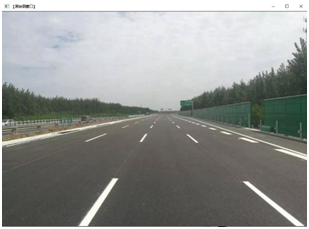
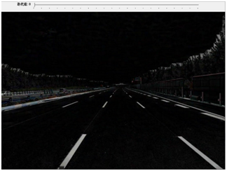
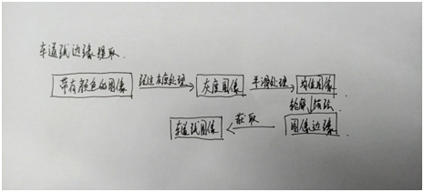
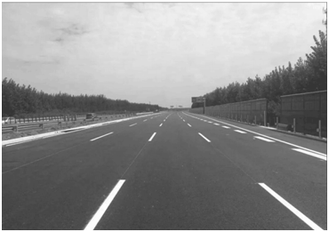
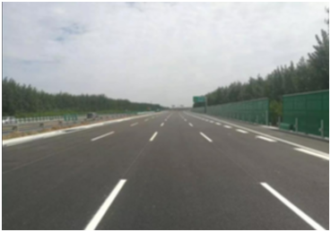
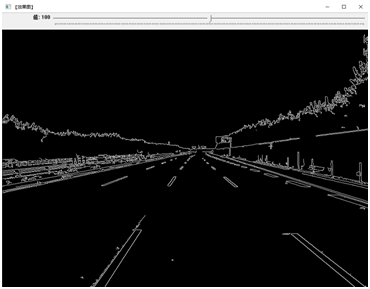
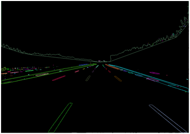
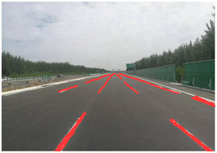

## 基于OpenCV的车道线的检测、处理与识别

### 摘要 
针对自动驾驶汽车车道检测的问题，想出了一种基于OpenCV的方法，用于有效识别车道目标的线性轮廓。首先，执行Canny边缘检测以基于图像预处理找到轮廓。然后使用感兴趣区域截取并创建梯形的mask掩膜。将此与边缘检测结果图混合，以保留其白色的部分。最后，使用Hough变换从而得到通过转换获得多条直线的起点和终点，并且通过计算仅获得左右车道。大量数据内容表明该方法能有效地完成了直线车道轮廓的处理和检测。

### 车道线图像检测

为提升分类算法的针对性，将车道线检测算法得到的车道线边缘进行膨胀处理，膨胀区域即为车道线分类算法的处理区域。

基于颜色特征的车道线分类
颜色分类多基于不同颜色区域的灰度值不同这一规律进行处理，但道路环境过于复杂，光照、阴影等都会对灰度值的计算造成影响，因此采用更稳定的学习类算法进行分类。通过训练后的多层感知器对车道线区域进行分类处理。

原始图片

颜色提取

### 车道线图像的处理
车道线轮廓的提取
下图是我从网上找到的关于采用canny算子对车道线边缘提取的流程，结合OpenCV进行一系列的图像处理

为了更好地使用Cany 算法检测车道线,需要对上一步得到的图像进行预处理,主要分为两个步骤。第一步,将图像转化为灰度图片。车道线检测不需要彩色细节,将彩色图片进行灰度转化可以很大程度地减少不必要的数据﹐进而提升检测效率。第二步,对粗糙的边缘进行平滑处理。进行灰度处理后,图像仍然会有许多粗糙的边缘,之后可以使用高斯滤波对上一步得到的灰度图进行平滑处理。通过设置合适的高斯核得到了处理结果，可以看出此时粗糙的边缘都变得更加平滑,利于接下来的边缘检测。
经过以上两个步骤的图像预处理,接下来使用Canny算法检测边缘。来进行图像中车道线轮廓的提取

灰度处理

平滑处理

轮廓提取

ROI提取

### 车道线的处理
因为Hough变换常常作为数字图像处理领域识别几何形状的基本方法,具有良好的抗干扰能力和鲁棒性,被广泛地应用于计算机视觉和模式识别领域。Hough是一种符合要求的特征提取变换方法,这种方法可以理解为在一个坐标范围内通过累积结果得到局部最大值,从而获得一个特定形状的集合,并将该集合作为Hough变换的结果。
基于车道线的几何特征可以使用Hough 变换直线检测来检测车道线。将检测到的直线放入列表中,以便在原始彩色图像中画上直线。检测到的每条车道线往往会有多条线,如左边缘右边缘等,可以使用求平均值的方法得到一条平均车道线。而车道线往往只有部分被识别,向两个方向延长外推即可得到完整的左右车道线,左车道线斜率为正,右车道线斜率为负。外延的结果如图所示。

原始标注

外延标注后

## 参考代码：

#### 颜色提取：
import cv2
import numpy as np
img = cv2.imread("1.png")
//转到HSV
hsv = cv2.cvtColor(img, cv2.COLOR_BGR2HSV)
print(hsv)
//设置阈值
l_blue = np.array([[0,43,46]])
h_blue = np.array([10,255,255])
//构建掩模
mask = cv2.inRange(hsv, l_blue, h_blue)
//进行位运算
res = cv2.bitwise_and(img, img, mask = mask)
cv2.imshow("img", img)
cv2.imshow("mask", mask)
cv2.imshow("res", res)
cv2.waitKey(0)
cv2.destroyAllWindows()

#### 轮廓提取：
 #include <opencv2/opencv.hpp>
 #include "opencv2/highgui/highgui.hpp"
 #include "opencv2/imgproc/imgproc.hpp"
using namespace cv;
using namespace std;
int main(int argc, char** argv){
// 	载入原始图，且必须以二值图模式载入
Mat srcImage = imread("1.png", 0);
imshow("原始图", srcImage);
//	初始化结果图
Mat dstImage = Mat::zeros(srcImage.rows, srcImage.cols, CV_8UC3);
//	srcImage取大于阈值119的那部分
srcImage = srcImage > 119;
imshow("取阈值后的原始图", srcImage);
//	定义轮廓和层次结构
vector<vector<Point> > contours;
vector<Vec4i> hierarchy;
//	查找轮廓
//此句代码的OpenCV2版为：
//	此句代码的OpenCV3版为：
findContours(srcImage, contours, hierarchy, RETR_CCOMP, CHAIN_APPROX_SIMPLE);
//	遍历所有顶层的轮廓， 以随机颜色绘制出每个连接组件颜色
int index = 0;
for (; index >= 0; index = hierarchy[index][0])
{
Scalar color(rand() & 255, rand() & 255, rand() & 255);
drawContours(dstImage, contours, index, color, FILLED, 8, hierarchy);
}
//	显示最后的轮廓图
imshow("轮廓图", dstImage);
waitKey(0);
}

#### ROI提取
import cv2
// 图像预处理
image = cv2.imread(path)
gray = cv2.cvtColor(image, cv2.COLOR_BGR2GRAY)
blur = cv2.GaussianBlur(gray, (5,5), 0)
thresh = cv2.threshold(blur,0,255,cv2.THRESH_OTSU + cv2.THRESH_BINARY_INV)[1]
//排除干扰
kernel = cv2.getStructuringElement(cv2.MORPH_RECT, (3,3))
opening = cv2.morphologyEx(thresh, cv2.MORPH_OPEN, kernel, iterations=1)
cnts = cv2.findContours(opening, cv2.RETR_TREE, cv2.CHAIN_APPROX_SIMPLE)
cnts = cnts[0] if len(cnts) == 2 else cnts[1]
//使用面积进行过滤提取
ROI_number = 0
for c in cnts:
    area = cv2.contourArea(c)
    peri = cv2.arcLength(c, True)
    approx = cv2.approxPolyDP(c, 0.02 * peri, True)
    x,y,w,h = cv2.boundingRect(approx)
    if len(approx) == 4 and (area > 1000) and (area < 80000):
        ROI = image[y:y+h, x:x+w]
        cv2.imwrite(&apos;ROI_{}.png&apos;.format(ROI_number), ROI)
        ROI_number += 1
cv2.imshow(&apos;thresh&apos;, thresh)
cv2.imshow(&apos;opening&apos;, opening)
cv2.waitKey()

#### 平滑处理
 #include "opencv2/highgui/highgui.hpp" 
 #include "opencv2/imgproc/imgproc.hpp" 
using namespace cv;
int main(){
//	载入原始图
Mat srcImage = imread("1.png");
//	显示原始图
imshow("均值滤波【原图】", srcImage);
//	进行均值滤波操作
Mat dstImage;
blur(srcImage, dstImage, Size(7, 7));
//	显示效果图
imshow("均值滤波【效果图】", dstImage);
waitKey(0);
}

#### Hough变换
 #include <opencv2/opencv.hpp>
 #include <opencv2/highgui/highgui.hpp>
 #include <opencv2/imgproc/imgproc.hpp>
using namespace std;
using namespace cv;
static void on_HoughLines(int, void*);//回调函数
static void ShowHelpText();
intmain( )
{
	//改变console字体颜色
	system("color 4F");  
	ShowHelpText();
	//载入原始图和Mat变量定义   
	Mat g_srcImage = imread("1.png");  //工程目录下应该有一张名为1.jpg的素材图
	//显示原始图  
	imshow("【原始图】", g_srcImage);  
	//创建滚动条
	namedWindow("【效果图】",1);
	createTrackbar("值", "【效果图】",&g_nthreshold,200,on_HoughLines);
	//进行边缘检测和转化为灰度图
	Canny(g_srcImage, g_midImage, 50, 200, 3);//进行一次canny边缘检测
	cvtColor(g_midImage,g_dstImage, COLOR_GRAY2BGR);//转化边缘检测后的图为灰图
	//调用一次回调函数，调用一次HoughLinesP函数
	on_HoughLines(g_nthreshold,0);
	HoughLinesP(g_midImage, g_lines, 1, CV_PI/180, 80, 50, 10 );
	//显示效果图  
	imshow("【效果图】", g_dstImage);  
	waitKey(0);  
	return 0;  
}
//		on_HoughLines( )函数
//		【顶帽运算/黑帽运算】窗口的回调函数
static void on_HoughLines(int, void*)
{
	//定义局部变量储存全局变量
	Mat dstImage=g_dstImage.clone();
	Mat midImage=g_midImage.clone();
	//调用HoughLinesP函数
	vector<Vec4i>mylines;
	HoughLinesP(midImage, mylines, 1, CV_PI/180, g_nthreshold+1, 50, 10 );
	//循环遍历绘制每一条线段
	for( size_ti = 0; i<mylines.size(); i++ )
{
		Vec4i l = mylines[i];
		line( dstImage, Point(l[0], l[1]), Point(l[2], l[3]),Scalar(23,180,55), 1, LINE_AA);
	}
	//显示图像
	imshow("【效果图】",dstImage);
}
//ShowHelpText( )函数
static void ShowHelpText(){
	//输出
	printf("\n ");
}

#### Canny边缘算子

 #include <opencv2/opencv.hpp>
 #include<opencv2/highgui/highgui.hpp>
 #include<opencv2/imgproc/imgproc.hpp>
using namespace cv;
intmain( ){
	//载入原始图  
	Mat srcImage = imread("1.png");  
	Mat srcImage1=srcImage.clone();
	//显示原始图 
	imshow("【原始图】Canny边缘检测", srcImage); 
	Mat dstImage,edge,grayImage;
	//	创建与src同类型和大小的矩阵(dst)
	dstImage.create( srcImage1.size(), srcImage1.type() );
	//	将原图像转换为灰度图像
	cvtColor( srcImage1, grayImage, COLOR_BGR2GRAY );
	//	先用使用 3x3内核来降噪
	blur( grayImage, edge, Size(3,3) );
	//	运行Canny算子
	Canny( edge, edge, 3, 9,3 );
	//	将g_dstImage内的所有元素设置为0 
	dstImage = Scalar::all(0);
	//	使用Canny算子输出的边缘图g_cannyDetectedEdges作为掩码，来将原图g_srcImage拷到目标图g_dstImage中
	srcImage1.copyTo( dstImage, edge);
	//	显示效果图 
	imshow("【效果图】Canny边缘检测2", dstImage); 
	waitKey(0); 
	return 0; 
}

### 总结
车道线检测领域的应用场景具有很明显的时序信息特征，为了利用到时序信息，可以参考人的视觉暂留现象，人在开车时观察车道线，能够自觉地把虚线识别为一条空间上连续的线，也是利用了前后的时序信息。
由基本算法处理后得到道路的特征图像，这里以边缘为例，需要进一步分析特性，去除干扰，保留符合车道特征的边缘，如平行性、宽度等结果特征，结构特征分析做得好，可以弥补基本算法的不足。
在分割全图的思路外，出现了一些以目标检测或目标分类的思路来处理车道线检测问题的方法。除了车道线检测本身，通过增加一些额外的相关任务，引导网络更好地学习，从而才能获取更好的效果。
总之，采用OpenCV的图像处理效果是不错的。

### 心得体会
为传统OpenCV在图像处理通过对压板图像进行颜色提取、灰度处理、平滑处理、提取轮廓以及ROI等一系列图像处理来获取车道线的检测处理效果。
在图像预处理的基础上配置相应深度学习网络推演加速卡的条件下，该方法的检测速度不会损失很多，但识别准确度大大提高。
通过采用OpenCV的方法来对车道线图像的处理，在整个过程中，都能体会到一种乐趣。