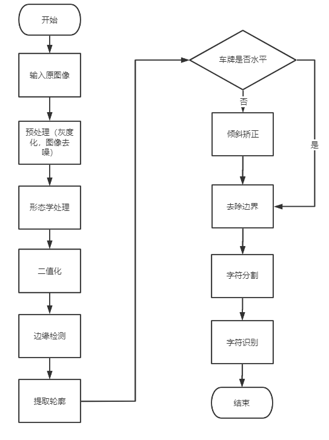
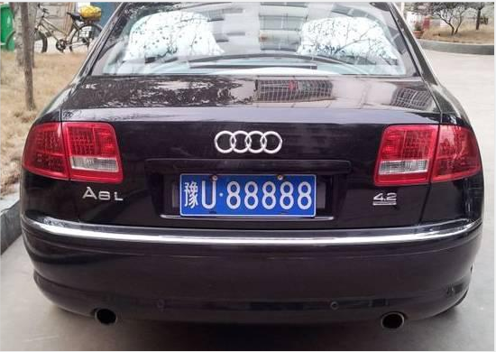
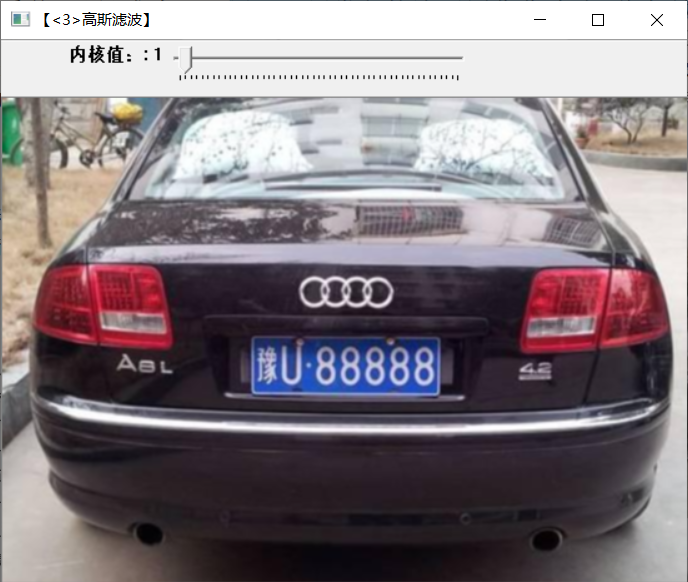
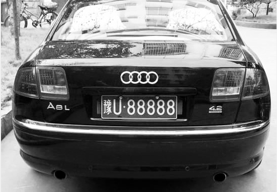
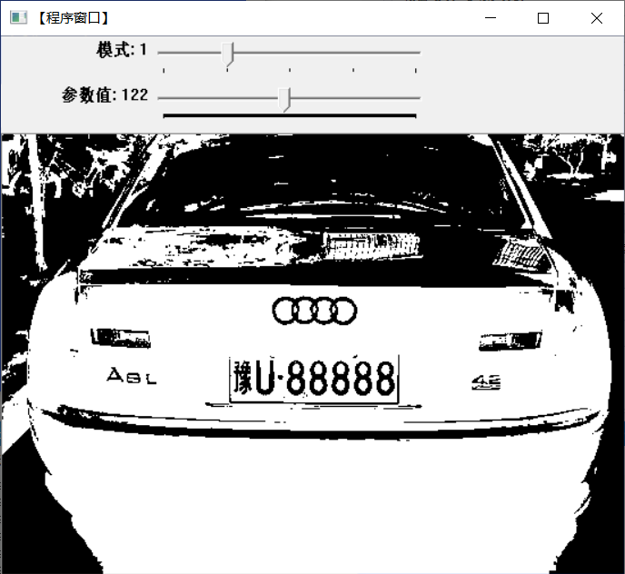
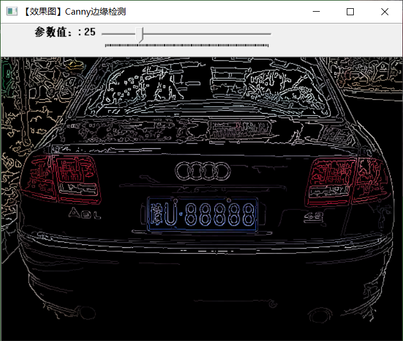
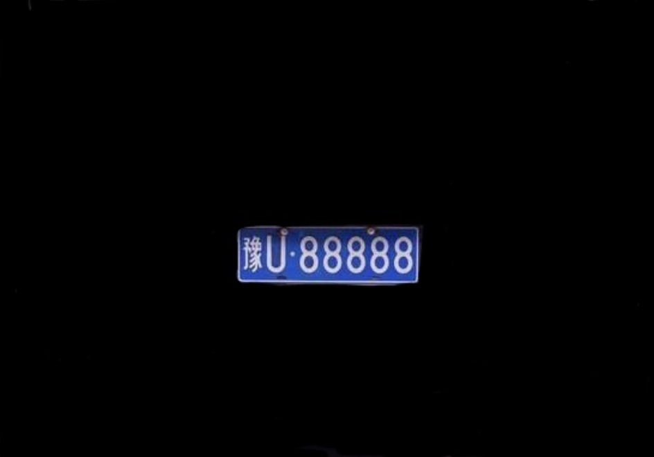
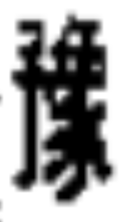
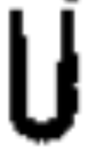
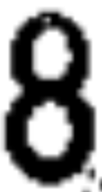

# 基于OpenCV的车牌检测
车牌检测系统在生活中安全便捷、出入口通行效率高、可降低停车场管理成本，代替了传统的取卡收费系统和远距离识别蓝牙系统，已经成为智能交通中不可分割的一部分。报告对车牌定位、字符分割和训练等关键点进行解释，给出了车牌识别所需要的图片处理步骤，并展示了车牌的识别效果，旨在寻求更为高效的识别方法。通过OpenCV机器视觉库技术与Python开发平台对车牌检测进行了研究与分析，该车牌识别系统主要由图像预处理、车牌定位、字符分割与识别等部分组成，实验表明该系统具有良好的识别效果。

这个车牌识别流程需要完成以下步骤，其中核心部分是车牌定位，字符识别和分割，下图展示了车牌识别大致需要的处理流程。

## 图片预处理
### 图片去噪
为了突显车牌所在的区域，去除不需要的干扰信息，本文采用高斯滤波实现平滑图像。高斯滤波适用于消除高斯噪声，去噪的过程中不会对图像边缘造成明显的模糊，它在图像预处理阶段被广泛应用。即用卷积核遍历图像像素点，将邻域内各个像素值与对应位置权值相乘求和。

下图分别为原图和高斯滤波之后的图片。

### 灰度化
接下来对图像进行灰度化，彩色图像中具有大量的颜色数据信息，转换成8位的灰度值图像能够提高运算效率。主流是加权平均法，将RGB分量赋予不同权值进行加权平均。
如下图

## 形态学处理
对图像进行形态学处理：开运算，目的是增加准确提取车牌轮廓的概率。开运算具有降低噪声、去除小物体和平滑轮廓等作用。通过进行阈值处理，从背景中分离出研究对象。阈值选择不同造成结果不同，阈值过高会丢失真边缘，阈值过低会产生假边缘。
如下图

## 车牌定位
### 边缘检测
边缘检测
边缘检测的一般标准包括：
1.以低的错误率检测边缘——尽可能准确的捕获图像中尽可能多的边缘
2.检测到的边缘应精确定位在真实边缘的中心。
3.图像中给定的边缘应只被标记一次，并且在可能的情况下，图像的噪声不应产生假的边缘。边缘只要一个精确的点宽度。
边缘检测也就是对图像求导数的过程，图像的边缘也就是一阶导数出现极值点，或者二阶导数为零的情况。在opencv中有3种边缘检测算子，一阶导数Roberts、Sobel、Prewitt。二阶导数Laplacian、Log/Marr、(Kirsch、Nevitia)，非微分边缘检测算子：Canny。

通过以上算子，来对整个图像求解梯度，我们可以看出在Sobel图像中可以提取出明显的车道线边缘，以及汽车边缘，周围较为明显景物的边缘。Sobel算子对于灰度渐变和噪声较多的图像有着较好的处理效果，Sobel算子对于边缘定位比较准确。相比之下Reberts，Prewitt、Laplacian都是跟Sobel算子不同，针对的图像也不同，导致最后得到的效果不同，而Canny（）是内部使用了Sobel算子，对每个像素点计算出梯度强度和方向之后，通过应用非极大值（Non-Maximum Suppression）抑制，以消除边缘检测带来的杂散响应。

为了尽可能减少噪声对边缘检测结果的影响，所以必须滤除噪声以防止由噪声引起的错误检测。为了平滑图像，使用高斯滤波器与图像进行卷积，该步骤将平滑图像，以减少边缘检测器上明显的噪声影响。

Canny滤波器根据选择不同的low_threshold，最终获取的图像也是不同，这种方法可以把图片中距离较远，树木车俩等较为模糊的物体，最后的由于阈值取的较高而被抑制，最终图像也就不再包含其边缘。
如下图

车牌截取如下图

## 字符分割和识别
使用霍夫变换
原理：对于一条直线，我们可以将直线上的点用极坐标来表示出来。因此一条直线也就被转换为θ角度内(r,θ)的集合，也被称为霍夫空间。

去除边界。车牌上下边缘通常是不规范的，去除无用边缘及铆钉，确定上下边框。根据设定阈值和图像直方图，找出波峰。对二值图每行灰度值求和，存于长为二值图高度的列表，在高度跨度最大的波峰为车牌所在。 
进行分割。分割的效果直接影响到下一步识别的正确率。笔者借助二分K－均值算法，它 
是在K－均值算法上演变而来，对车牌的二值图进 行水平方向切分。原理是将所有点作为一个簇，将 该簇一分为二，再选择其中一个簇划分，划分原则为最大程度降低SSE值。采取度量聚类效果指标：误差平方和。分割后的车牌二值图如图
        

使用图像像素特征训练SVM，训练数据存储在N* M，Ｎ代表样本，Ｍ代表特征数。任意数据集为一行存在训练矩阵中，即训练矩阵N* M个特征。类别存储在N*1矩阵中，每类通过一个浮点数来识别。

## 代码分析
#### 高斯滤波
int main()
{
	system("color 4F");

	ShowHelpText();

	// 载入原图
	g_srcImage = imread("1.jpg", 1);
	if (!g_srcImage.data) { printf("读取srcImage错误~！ \n"); return false; }

	//克隆原图到四个Mat类型中
	g_dstImage1 = g_srcImage.clone();
	g_dstImage2 = g_srcImage.clone();
	g_dstImage3 = g_srcImage.clone();
	g_dstImage4 = g_srcImage.clone();
	g_dstImage5 = g_srcImage.clone();

	//显示原图
	namedWindow("【<0>原图窗口】", 1);
	imshow("【<0>原图窗口】", g_srcImage);

	//=================【<3>高斯滤波】===========================
	//创建窗口
	namedWindow("【<3>高斯滤波】", 1);
	//创建轨迹条
	createTrackbar("内核值：", "【<3>高斯滤波】", &g_nGaussianBlurValue, 50, on_GaussianBlur);
	on_GaussianBlur(g_nGaussianBlurValue, 0);

#### 形态开运算
int main()
{
	//载入原始图   
	Mat image = imread("1.jpg");  
	//创建窗口   
	namedWindow("【原始图】开运算");
	namedWindow("【效果图】开运算");
	//显示原始图  
	imshow("【原始图】开运算", image);
	//定义核
	Mat element = getStructuringElement(MORPH_RECT, Size(15, 15));
	//进行形态学操作
	morphologyEx(image, image, MORPH_OPEN, element);
	//显示效果图  
	imshow("【效果图】开运算", image);

	waitKey(0);

	return 0;
}

#### Canny边缘检测
int main( )
{
	//载入原始图  
	Mat srcImage = imread("1.jpg");  //工程目录下应该有一张名为1.jpg的素材图
	Mat srcImage1=srcImage.clone();

	//显示原始图 
	imshow("【原始图】Canny边缘检测", srcImage); 

	//----------------------------------------------------------------------------------
	//	一、最简单的canny用法，拿到原图后直接用。
	//	注意：此方法在OpenCV2中可用，在OpenCV3中已失效
	//----------------------------------------------------------------------------------
 	//Canny( srcImage, srcImage, 150, 100,3 );
	//imshow("【效果图】Canny边缘检测", srcImage); 

	//----------------------------------------------------------------------------------
	//	二、高阶的canny用法，转成灰度图，降噪，用canny，最后将得到的边缘作为掩码，拷贝原图到效果图上，得到彩色的边缘图
	//----------------------------------------------------------------------------------
	Mat dstImage,edge,grayImage;

	// 【1】创建与src同类型和大小的矩阵(dst)
	dstImage.create( srcImage1.size(), srcImage1.type() );

	// 【2】将原图像转换为灰度图像
	cvtColor( srcImage1, grayImage, COLOR_BGR2GRAY );

	// 【3】先用使用 3x3内核来降噪
	blur( grayImage, edge, Size(3,3) );

	// 【4】运行Canny算子
	Canny( edge, edge, 3, 9,3 );

	//【5】将g_dstImage内的所有元素设置为0 
	dstImage = Scalar::all(0);

	//【6】使用Canny算子输出的边缘图g_cannyDetectedEdges作为掩码，来将原图g_srcImage拷到目标图g_dstImage中
	srcImage1.copyTo( dstImage, edge);

	//【7】显示效果图 
	imshow("【效果图】Canny边缘检测2", dstImage); 

	waitKey(0); 

	return 0; 
}

#### 图像截取
void process(Mat& frame, Point* left_line, Point* right_line) {
	Mat gray, binary;
	/**灰度化*/
	cvtColor(frame, gray, COLOR_BGR2GRAY);

	//threshold(gray, binary, );
	//边缘检测
	Canny(gray, binary, 150, 200);
	//imshow("Canny", binary);
	for (size_t i = 0; i < (gray.rows / 2 + 40); i++) {
		for (size_t j = 0; j < gray.cols; j++)
		{
			binary.at<uchar>(i, j) = 0;
		}
	}
	imshow("binary", binary);

	//寻找轮廓
	vector<vector<Point>> contours;
	findContours(binary, contours, RETR_EXTERNAL, CHAIN_APPROX_SIMPLE);

	Mat out_image = Mat::zeros(gray.size(), gray.type());

	for (int i = 0; i < contours.size(); i++)
	{

		//计算面积与周长
		double length = arcLength(contours[i], true);
		double area = contourArea(contours[i]);
		//cout << "周长 length:" << length << endl;
		//cout << "面积 area:" << area << endl;

		//外部矩形边界
		Rect rect = boundingRect(contours[i]);
		int h = gray.rows - 50;

		//轮廓分析：
		if (length < 5.0 || area < 10.0) {
			continue;
		}
		if (rect.y > h) {
			continue;
		}

		//最小包围矩形
		RotatedRect rrt = minAreaRect(contours[i]);
		//关于角度问题：https://blog.csdn.net/weixin_41887615/article/details/91411086

		//cout << "最小包围矩形 angle:" << rrt.angle << endl;

		double angle = abs(rrt.angle);

		//angle < 50.0 || angle>89.0

		if (angle < 20.0 || angle>84.0) {

			continue;

		}

		if (contours[i].size() > 5) {
			//用椭圆拟合
			RotatedRect errt = fitEllipse(contours[i]);
			//cout << "用椭圆拟合err.angle:" << errt.angle << endl;

			if ((errt.angle < 5.0) || (errt.angle > 160.0))
			{
				if (80.0 < errt.angle && errt.angle < 100.0) {
					continue;
				}

			}
		}

		//cout << "开始绘制：" << endl;
		drawContours(out_image, contours, i, Scalar(255), 2, 8);
		imshow("out_image", out_image);

	}
	Mat result = fitLines(out_image, left_line, right_line);
	imshow("result", result);

	Mat dst;
	addWeighted(frame, 0.8, result, 0.5, 0, dst);
	imshow("lane-lines", dst);

}

## 实验总结
车牌识别系统一直是智能交通领域的热点问题，它广泛应用实现了车辆的现代化管理，提高了出行效率。报告给出了图像预处理、牌照定位、字符分割及字符训练识别过程等过程的图片和源代码。但在实际图片处理效果上还存在一些缺陷，识别的图片还不够准确，泛化能力还有待提高。

## 心得体会
在本次实验中，主要通过高斯滤波，Canny边缘检测，形态开运算和阈值转换完成大部分内容，本次实验也只是对这一个车牌照片进行识别，该实验也只是粗略的整理了下步骤，如果真正要实现这个系统需要的内容更多，遇到的问题也更多，需要结合其他方面的内容。通过这次动手也加深了对高通滤波，Canny边缘检测和阈值的变换这些理论，进行了各种实践与尝试，颇有收获。