# 基于OpenCV的车辆识别

通过查阅相关资料，我做的是基于分类器训练集进行的图片中车辆目标进行识别，之所以基于这样的做法是由于做了jetbot小车避障实验和自主巡航实验的启发，在小车的避障实验中我们就收集了很多避障的图片和直行的图片也就是正例样本和负例样本，这些图片经过训练再经过相关代码的编写就能让小车识别障碍物进行避障，由此我就基于这种方法思想做了基于OpenCV的车辆识别。

由于事先我们的OpenCV软件已经下载好了，环境也搭建好了所以，我们就直接进行车辆训练的图片的收集，图片的大小和格式都要相同，准备好两个文件夹，分别命名为posdata（正样本）和negdata（负样本），所有样本的尺寸必须一致，如果不一致的或者尺寸较大的，可以先将所有样本统一缩放到相同的尺寸。posdata中的图片为车辆样本，是给分类器展示的是正确的样本识别为汽车。而negdata中的图片就是不是车辆的图片从而判断不是汽车。

## 进行训练模型的训练。

在negdata和posdata文件夹准备好之后。
通过cmd进入到Windows命令行模式，通过cd命令把位置切换到posdata文件夹的位置下。
输入“ dir /b/s/p/w *.jpg > pos.txt ”，将会在posdata文件夹中产生一个pos.txt的文档。
打开pos.txt，选择编辑-替换，
在查找中搜索jpg,替换为jpg 1 0 0 100 40，之后保存，
将pos.txt复制到上一级目录中。
同样的对negdata文件夹进行相同的操作，
输入的语句为“ dir /b/s/p/w *.jpg > neg.txt ”
文件夹中产生一个neg.txt的文档

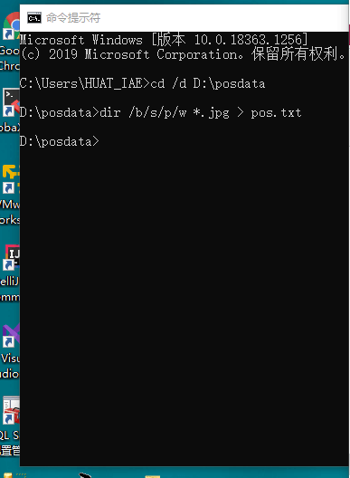
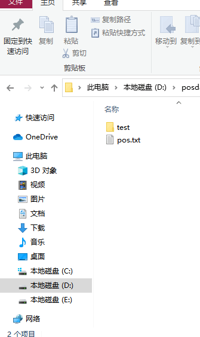
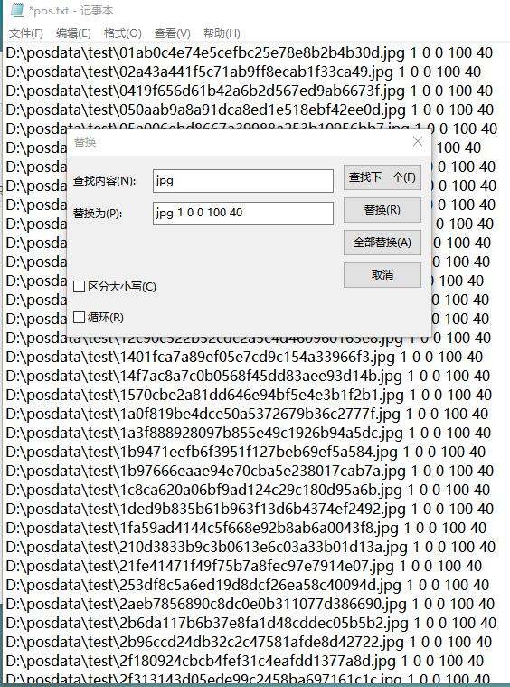
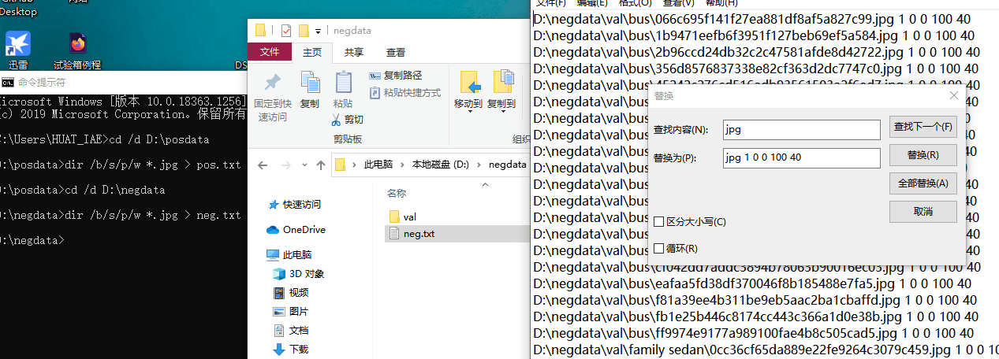


找到自己下载的OpenCV文件夹，打开opencv,打开build，打开x64,打开vc15，打开bin文件夹

/*
注意：OpenCV的版本为4.0以下否则将会没有相关文件进行训练*/

选择opencv_createsamples.exe和opencv_traincascade.exe两项，将其复制到需要的文件夹中，与negdata、posdata并列。 

打开cmd，在该文件目录下输入“ opencv_createsamples.exe -vec pos.vec -info pos.txt -num 32 -w 100 -h 40 ” 。
pos.txt 表明这是正样本；

num 32 代表正样本照片数量；

w 100  h40表示图片分辨率
之后在该文件夹中会出现pos.vec

重复该步骤，cmd输入的语句换为“ opencv_createsamples.exe -vec neg.vec -info neg.txt -num 100 -w 100 -h 40 ”，
产生neg.vec

在主文件夹下创建一个txt文档，命名为“traincascade”。
在该txt中输入：

opencv_traincascade.exe -data xml -vec pos.vec -bg neg.txt -numPos 32 -numNeg 100 -numStages 20 -w 100 -h 40 -mode ALL pause

numPos 32 代表正样本照片数量   
numNeg100 表示负样本照片数量     
numStage 20表示检测次数   
pause为暂停

对“traincascade.txt”进行重命名，将后缀名改为bat。
图片如下：


之后双击“traincascade.bat”就开始进行模型的训练，处理完成之后将会在文件夹下生成一个cascade.xml文件所以我们就
能用训练好的训练文件对图像中的车辆进行识别。
图片如下：
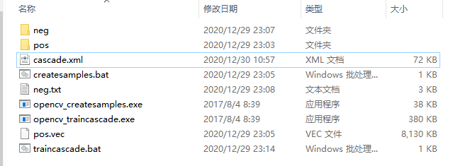

首先用我自己进行的模型训练生成的cascade.xml文件由于样本集数量级不够大数据不够准确，车辆识别不够准确，图片如下：
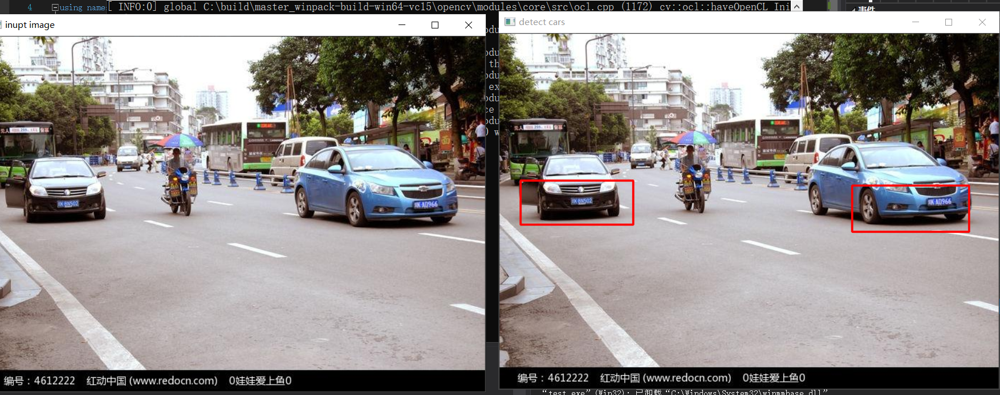
后来在网站上寻找相关车辆识别的训练集生成文件xml文件：
cascade_562_0625.xml
车辆识别图片如下：
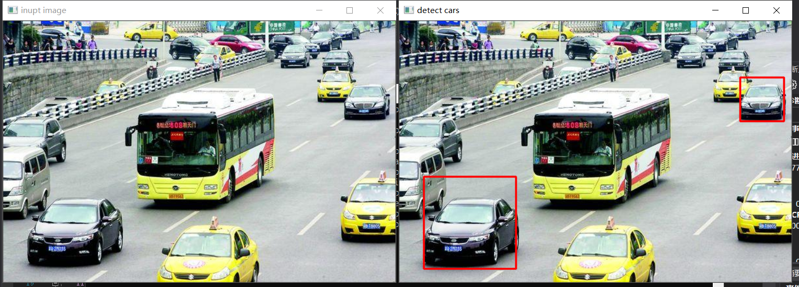
车辆识别很好但是，也是由于车辆数据收集不够完善所以有些类型的车辆如：公交大巴，面包车，还有车身颜色不够多的数据，所以有些车辆也识别不了。
后来我又在网上找了一个好的训练集xml文件：
cascade562.2.xml
识别的车辆如下图所示：
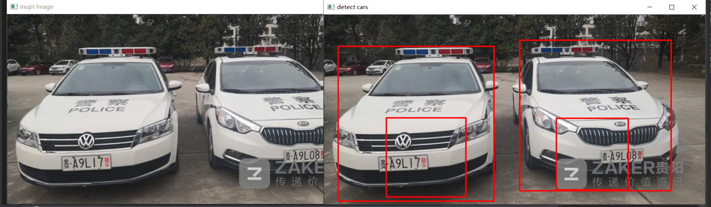
这里是很好的相关的训练集xml文件，汽车识别很好但是用于其他情况效果就差了点，
最后所以我就又在此基础上有找到相关的车辆训练的图片文件，然后自己又对车辆的图片进行了筛选最终训练生成了一个我认为我做的最终能达到的最好的生成的xml文件：
cascade2.xml
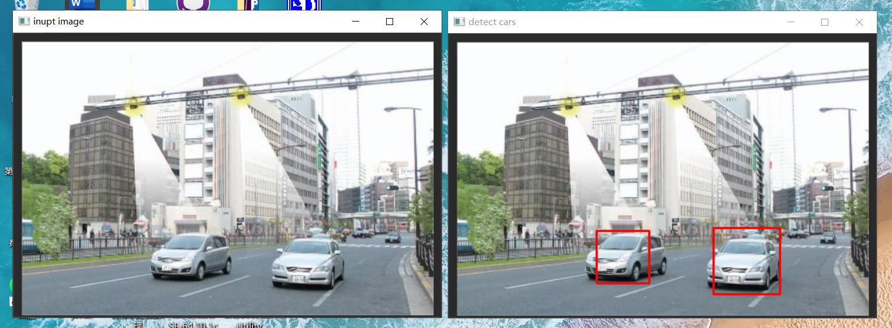
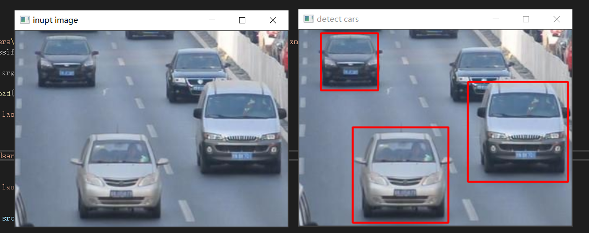
我认为这是我能做到的识别精确度最高的模型训练集文件了。


实验代码：

```c++
/*

#include<opencv2\opencv.hpp>
#include<iostream>

using namespace cv;
using namespace std;

String filename = "C:\\Users\\Lenovo\\Desktop\\设计报告\\Cascade-Classifier-master\\cascade163.xml";  
\\加载训练好的车辆识别模型文件

CascadeClassifier car_classifier;

int main(int argc, char** argv)
{
    if (!car_classifier.load(filename))
    {
        printf("could not laod car feature data..\n");
        return -1;
    }

    Mat src = imread("C:/Users/Lenovo/Pictures/联想锁屏壁纸/chenyuan1.jpg"); //需要检测的图片
    if (src.empty())
    {
        printf("could not laod image...\n");
        return -1;
    }
    imshow("inupt image", src);
    Mat gray;
    cvtColor(src, gray, COLOR_BGR2GRAY);
    equalizeHist(gray, gray);

    vector<Rect>cars;
    car_classifier.detectMultiScale(gray, cars, 1.1, 3, 0, Size(50, 50));
    for (size_t t = 0; t < cars.size(); t++)
    {
        rectangle(src, cars[static_cast<int>(t)], Scalar(0, 0, 255), 2, 8, 0);
    }

    imshow("detect cars", src);
    waitKey(0);
    return 0;

}

*/
```

## 分析：

遇到的问题及解决方法
做车辆识别检测模型的训练时参考了文章到完成了pos.txt和neg.txt后却发现自己电脑中装的opencv没有opencv_createsamples.exe和opencv_traincascade.exe这两个进行训练的应用，后来经过查阅资料发现要找一个opencv4.0之前的版本，因为4.0后opencv并不默认内置这两个应用。于是我就重新下载了OpenCV3.0的版本进行了车辆识别训练集的训练生成了相应的训练集编译xml文件，最后通过代码调用该文件最终识别了图片中的车辆。


## 代码的相关分析：

cvtColor()函数用于将图像从一个颜色空间转换到另一个颜色空间的转换，并且在转换的过程中能够保证数据的类型不变，即转换后的图像的数据类型和位深与源图像一致。
equalizeHist()函数用于图像的直方图均衡化，提高图像的质量方便识别。
vector 是向量类型，它可以容纳许多类型的数据，如若干个整数，所以称其为容器。代码中使用了vector在结构体中的应用。

## 总结：

虽然能进行简单的车辆识别，但是仍然存在很多的问题：
1，对于有些车辆识别时，有时候会出现几个框的原因是这些经过膨胀处理后，没有将膨胀连接到一起，而且当调大膨胀参数后，距离较近的车辆会连接到一起造成同框出现的问题。
2，对于较远的车辆和部分轮廓被遮挡的车辆，由于设置了轮廓面积阈值，所以有时候识别不出来。
3，图像腐蚀效果并不明显，在原始图像处理时腐蚀汽车以外的相关物体时也会造成将一辆车的识别轮廓分为两个。

## 心得体会：

在车辆识别的过程中我们就涉及到了机器学习方法，分为训练和应用的过程
训练：需要构建训练集，使用HOG、SIFT等特征描述获取特征，使用SVM、决策树等对上一步获取的特征和对应的正样本或者负样本进行训练，训练指：自动生成SVM或者决策树等的参数，使其可以用来分类。

应用：提取需要识别的图片的HOG、SIFT等特征，使用训练好的SVM或者决策树对提取的特征进行分类。

在做车辆的识别过程中我发现对车辆识别精确度的高低，其实是和你自己的训练集的密不可分的，当然也和你编写的图像处理代码也又很大的关系但是我发现，更直观的感受是训练集好坏有更大影响，因为我自己查阅了相关资料如何基于OpenCV构建自己的训练集，但是由于自己收集的训练集训练的图片包含的类型单一，相关特点不够明显最终训练生成的文件，识别图片效果不好，但是网上找的国外的相关训练集图片进行分类训练生成自己的文件，识别车辆效果有了明显的改善，所以我认为在做车辆识别时，一个良好的训练集模型很重要。

# 基于openvino的车辆识别

由于在安装openvino时我们检查安装环境安装是否成功时会出现张车辆的识别图片，于是我就想在此基础上也就是直接修改相关代码就能识别不一样图片中的车辆。但是我是了解了一点相关训练模型的应用。
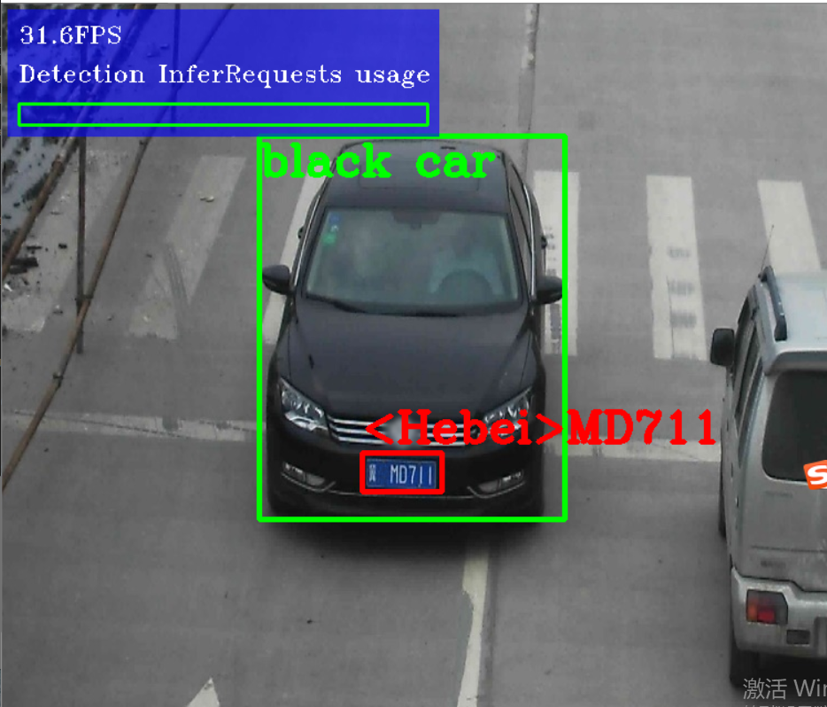


我基于openvino做的车辆检测图片如下：
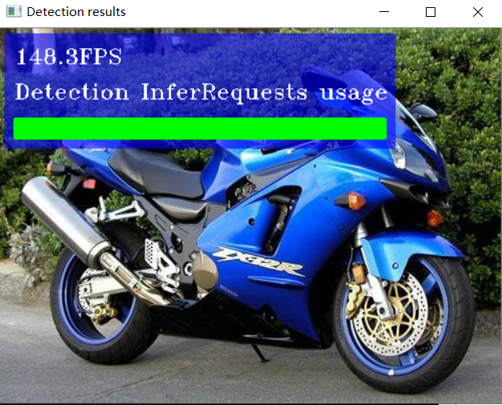
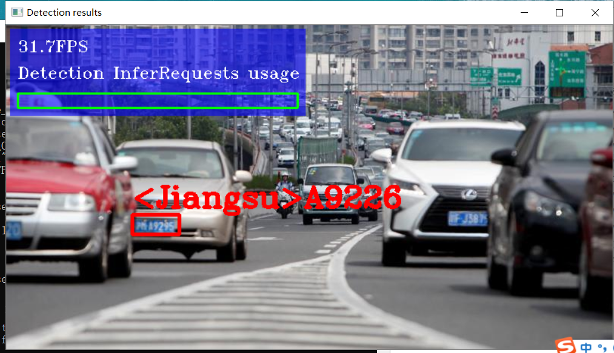
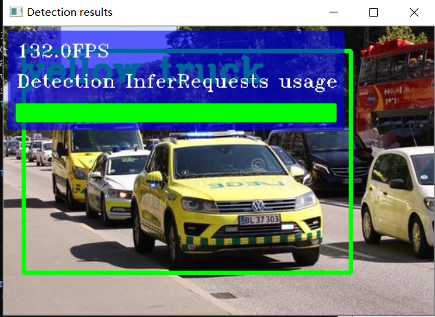
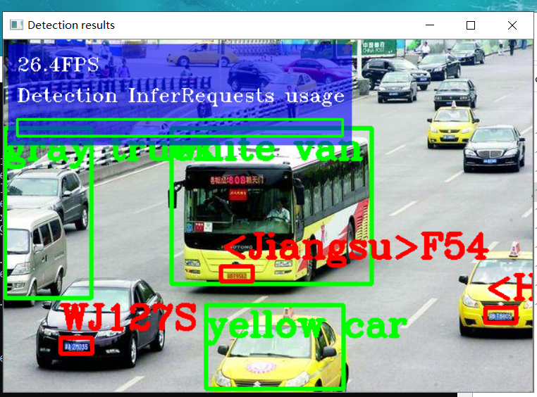

由上面图片可以看出，和opencv一样在训练集里没有摩托车，机车的图片训练，所以识别这一类型的图片时就不能识别出来，再就是在很多车辆的情况下也不能很好额识别，这也是因为做图像是识别中相关处理时由于参数的值是确定的在识别不同图片时，识别的效果就不相同。总的来说其实openvino也是基于了opencv来做图像处理，而且过程也大致相同，图片如下：
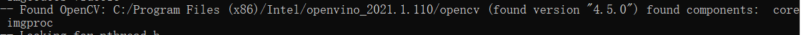
他也是调用了我们安装的OpenCV版本里面的库文件进行图像的处理
而且他也有自己训练集生成文件，进行图像识别图片如下：
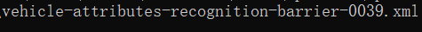

## 总结：

通过学习和相关资料了解到openvino车辆检测模型基于SSD MobileNetv1实现
车辆检测模型加载与推理解析

加载车辆检测模型，推理与解析SSD输出结果的代码如下：

```c++
/*
vnet = ie.read_network(model=vehicel_xml, weights=vehicel_bin)
vehicle_input_blob = next(iter(vnet.input_info))
vehicle_out_blob = next(iter(vnet.outputs))

vn, vc, vh, vw = vnet.input_info[vehicle_input_blob].input_data.shape
print(n, c, h, w)
vehicle_exec_net = ie.load_network(network=vnet, device_name="CPU")

inf_start = time.time()
image = cv.resize(frame, (vw, vh))
image = image.transpose(2, 0, 1)
vec_res = vehicle_exec_net.infer(inputs={vehicle_input_blob:[image]})

ih, iw, ic = frame.shape
vec_res = vec_res[vehicle_out_blob]
for obj in vec_res[0][0]:
if obj[2] > 0.5:
xmin = int(obj[3] * iw)
ymin = int(obj[4] * ih)
xmax = int(obj[5] * iw)
ymax = int(obj[6] * ih)
cv.rectangle(frame, (xmin, ymin), (xmax, ymax), (0, 0, 255), 2, 8)
cv.putText(frame, str(obj[2]), (xmin, ymin), cv.FONT_HERSHEY_PLAIN, 1.0, (0, 0, 255), 1)

*/
```
最后说一下利用openvino做实验步骤：
1，安装openvino
2，配置环境变量
3，配置模型优化器
4，提前准备训练好的模型参数
5，模型优化器运行
6，进行推断
由于openvino安装了模型优化器，建立执行网络过程提供给用户, 对于固定的网络, 省略这个过程, 比同样tensorflow的CPU版本节省不少时间.
