# openvino 设计报告

## openvino 总述
OpenVINO的深度学习部署工具套件主要包括两部分，一个是模型优化器，另外一个是推理引擎。模型优化器是由Python编写的，推理引擎是一套C++函数库以及C++的类

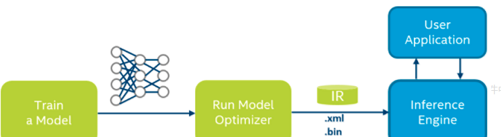

工作原理是对训练产生的网络模型进行优化，优化结果转换成中间表示文件，得到IR文件（xml文件和bin文件）。xml文件中包含优化以后的网络拓扑结构，bin文件优化之后的模型参数和模型变量。

对于TensorFlow框架，对应的模型为pb文件。

对于mxnet框架,对应的模型为.params文件

环境配置参照官方

https://software.intel.com/en-us/articles/get-started-with-neural-compute-stick


## openvino安装

安装目录：C:\Program Files (x86)\IntelSWTools\openvino

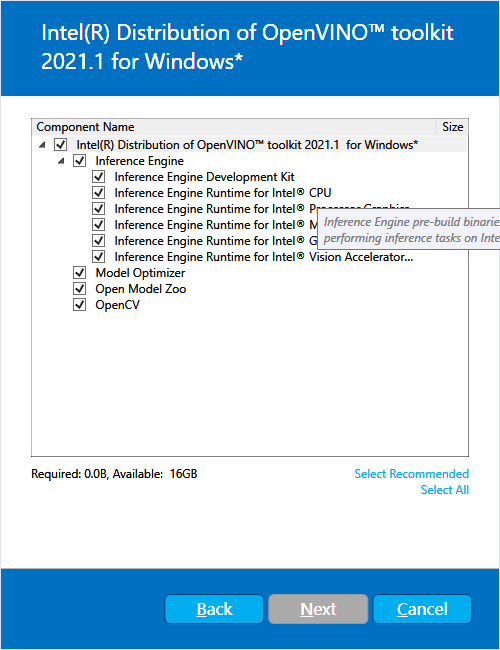 

## cmake 安装
CMake是一个跨平台的安装（编译）工具，可以用简单的语句来描述所有平台的安装(编译过程)。
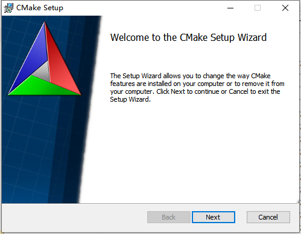

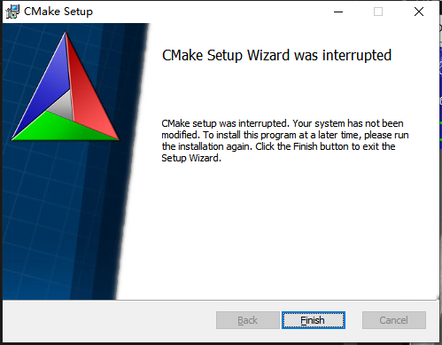

## 配置环境变量


设置环境变量


## 配置模型优化器

设置神经网络模型

同时为所有支持的框架配置模型优化器

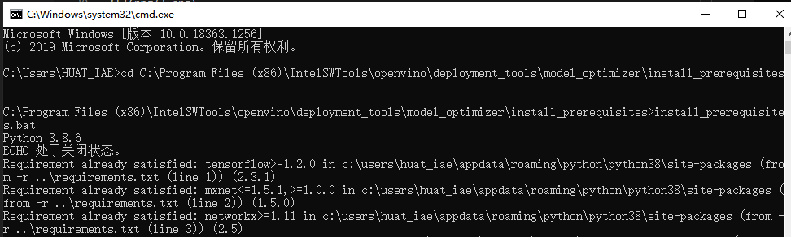

## 运行推理管道验证脚本

前往推理引擎演示目录：

cd C:\Program Files (x86)\IntelSWTools\openvino\deployment_tools\demo\

运行推理管道验证脚本

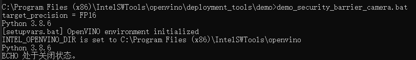

运行结果：

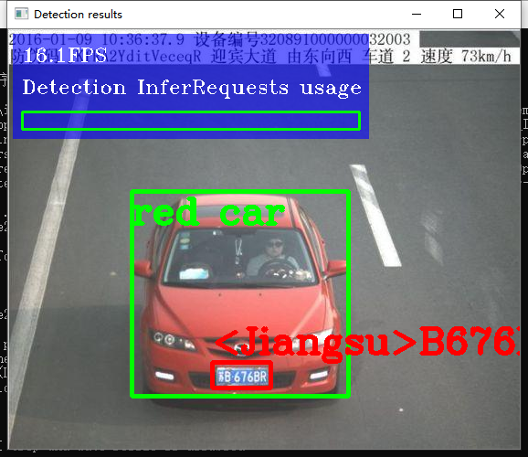

## 行人追踪演示


先下载两个模型，分别是person-detection-retail-0013和person-reidentification-retail-0031

使用命令： python downloader.py --name --output_dir
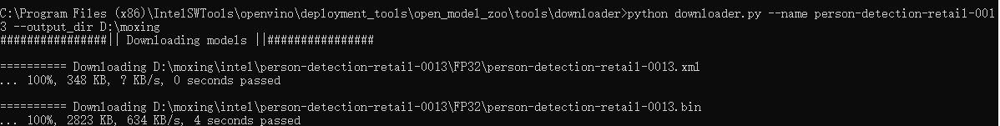

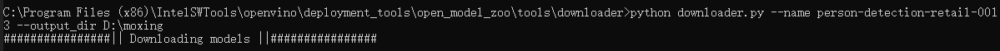

使用build_demos_msvc.bat,使用vs studio生成可执行文件。

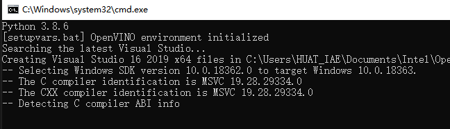

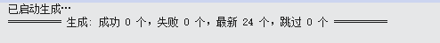

要使用OpenVINO™工具包的预训练模型运行应用程序，该模型具有GPU上的行人检测器推理功能和CPU上的行人重新识别功能，运行以下命令:

./pedestrian_tracker_demo -i <path_video_file> \
                          -m_det <path_to_model>/person-detection-retail-0013.xml \
                          -m_reid <path_to_model>/person-reidentification-retail-0031.xml \
                          -d_det GPU


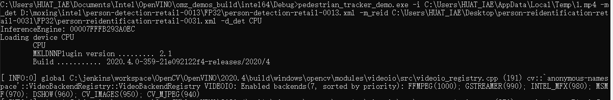

运行结果：

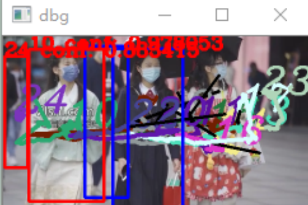

## 代码分析


```c++

#include "core.hpp"
#include "utils.hpp"
#include "tracker.hpp"
#include "descriptor.hpp"
#include "distance.hpp"
#include "detector.hpp"
#include "pedestrian_tracker_demo.hpp"

#include <monitors/presenter.h>

#include <opencv2/core.hpp>

#include <iostream>
#include <utility>
#include <vector>
#include <map>
#include <memory>
#include <string>
#include <gflags/gflags.h>

using namespace InferenceEngine;
using ImageWithFrameIndex = std::pair<cv::Mat, int>;

std::unique_ptr<PedestrianTracker>
CreatePedestrianTracker(const std::string& reid_model,
                        const InferenceEngine::Core & ie,
                        const std::string & deviceName,
                        bool should_keep_tracking_info) {
    TrackerParams params;

    if (should_keep_tracking_info) {
        params.drop_forgotten_tracks = false;
        params.max_num_objects_in_track = -1;
    }

    std::unique_ptr<PedestrianTracker> tracker(new PedestrianTracker(params));

/// 一些库文件，然后加载ReID(Person Re-identification)，也就是行人重识别，希望能够利用计算机视觉的算法来进行跨摄像头的追踪。行人充实别非常重要，是次识别模型的重点。


std::shared_ptr<IImageDescriptor> descriptor_fast =
        std::make_shared<ResizedImageDescriptor>(
            cv::Size(16, 32), cv::InterpolationFlags::INTER_LINEAR);
    std::shared_ptr<IDescriptorDistance> distance_fast =
        std::make_shared<MatchTemplateDistance>();

    tracker->set_descriptor_fast(descriptor_fast);
    tracker->set_distance_fast(distance_fast);

    if (!reid_model.empty()) {
        CnnConfig reid_config(reid_model);
        reid_config.max_batch_size = 16;

/// 确定输出的结果大小，当识别的图像人物大小大于16时，break

std::shared_ptr<IImageDescriptor> descriptor_strong =
            std::make_shared<DescriptorIE>(reid_config, ie, deviceName);

        if (descriptor_strong == nullptr) {
            THROW_IE_EXCEPTION << "[SAMPLES] internal error - invalid descriptor";
        }
        std::shared_ptr<IDescriptorDistance> distance_strong =
            std::make_shared<CosDistance>(descriptor_strong->size());

        tracker->set_descriptor_strong(descriptor_strong);
        tracker->set_distance_strong(distance_strong);
    } else {
        std::cout << "WARNING: Reid model "
            << "was not specified. "
            << "Only fast reidentification approach will be used." << std::endl;
    }

    return tracker;
}

int main(int argc, char **argv) {
    try {
        std::cout << "InferenceEngine: " << GetInferenceEngineVersion() << std::endl;

        if (!ParseAndCheckCommandLine(argc, argv)) {
            return 0;
        }

        // 读取命令行
        auto det_model = FLAGS_m_det;
        auto reid_model = FLAGS_m_reid;

        auto detlog_out = FLAGS_out;

        auto detector_mode = FLAGS_d_det;
        auto reid_mode = FLAGS_d_reid;

        auto custom_cpu_library = FLAGS_l;
        auto path_to_custom_layers = FLAGS_c;
        bool should_use_perf_counter = FLAGS_pc;

        bool should_print_out = FLAGS_r;

        bool should_show = !FLAGS_no_show;
        int delay = FLAGS_delay;
        if (!should_show)
            delay = -1;
        should_show = (delay >= 0);

        bool should_save_det_log = !detlog_out.empty();

        if ((FLAGS_last >= 0) && (FLAGS_first > FLAGS_last)) {
            throw std::runtime_error("The first frame index (" + std::to_string(FLAGS_first) + ") must be greater than the "
                "last frame index (" + std::to_string(FLAGS_last) + ')');
        }

        std::vector<std::string> devices{detector_mode, reid_mode};
        InferenceEngine::Core ie =
            LoadInferenceEngine(
                devices, custom_cpu_library, path_to_custom_layers,
                should_use_perf_counter);

        DetectorConfig detector_confid(det_model);
        ObjectDetector pedestrian_detector(detector_confid, ie, detector_mode);

        bool should_keep_tracking_info = should_save_det_log || should_print_out;
        std::unique_ptr<PedestrianTracker> tracker =
            CreatePedestrianTracker(reid_model, ie, reid_mode,
                                    should_keep_tracking_info);

        cv::VideoCapture cap;
        try {
            int intInput = std::stoi(FLAGS_i);
            if (!cap.open(intInput)) {
                throw std::runtime_error("Can't open " + std::to_string(intInput));
            }
        } catch (const std::invalid_argument&) {
            if (!cap.open(FLAGS_i)) {
                throw std::runtime_error("Can't open " + FLAGS_i);
            }
        } catch (const std::out_of_range&) {
            if (!cap.open(FLAGS_i)) {
                throw std::runtime_error("Can't open " + FLAGS_i);
            }
        }
        double video_fps = cap.get(cv::CAP_PROP_FPS);
        if (0.0 == video_fps) {
            // DukeMTMC数据集的默认帧速率

if (0 >= FLAGS_first && !cap.set(cv::CAP_PROP_POS_FRAMES, FLAGS_first)) {
            throw std::runtime_error("Can't set the frame to begin with");
        }

        std::cout << "To close the application, press 'CTRL+C' here";
        if (!FLAGS_no_show) {
            std::cout << " or switch to the output window and press ESC key";
        }
        std::cout << std::endl;

        cv::Size graphSize{static_cast<int>(cap.get(cv::CAP_PROP_FRAME_WIDTH) / 4), 60};
        Presenter presenter(FLAGS_u, 10, graphSize);

        for (int32_t frame_idx = std::max(0, FLAGS_first); 0 > FLAGS_last || frame_idx <= FLAGS_last; ++frame_idx) {
            cv::Mat frame;
            if (!cap.read(frame)) {
                break;
            }

            pedestrian_detector.submitFrame(frame, frame_idx);
            pedestrian_detector.waitAndFetchResults();

            TrackedObjects detections = pedestrian_detector.getResults();

            // 时间以毫秒为基准


            uint64_t cur_timestamp = static_cast<uint64_t >(1000.0 / video_fps * frame_idx);
            tracker->Process(frame, detections, cur_timestamp);

            presenter.drawGraphs(frame);

            if (should_show) {
              
                frame = tracker->DrawActiveTracks(frame);

               
                for (const auto &detection : detections) {
                    cv::rectangle(frame, detection.rect, cv::Scalar(255, 0, 0), 3);
                }

                
                for (const auto &detection : tracker->TrackedDetections()) {
                    cv::rectangle(frame, detection.rect, cv::Scalar(0, 0, 255), 3);
                    std::string text = std::to_string(detection.object_id) +
                        " conf: " + std::to_string(detection.confidence);
                    cv::putText(frame, text, detection.rect.tl(), cv::FONT_HERSHEY_COMPLEX,
                                1.0, cv::Scalar(0, 0, 255), 3);
                }
/// 识别框架颜色，追踪目标，用蓝色将所有检测到的对象绘制在边框上。
                cv::resize(frame, frame, cv::Size(), 0.5, 0.5);
                cv::imshow("dbg", frame);
                char k = cv::waitKey(delay);
                if (k == 27)
                    break;
                presenter.handleKey(k);
            }

            if (should_save_det_log && (frame_idx % 100 == 0)) {
                DetectionLog log = tracker->GetDetectionLog(true);
                SaveDetectionLogToTrajFile(detlog_out, log);
            }
        }

        if (should_keep_tracking_info) {
            DetectionLog log = tracker->GetDetectionLog(true);

            if (should_save_det_log)
                SaveDetectionLogToTrajFile(detlog_out, log);
            if (should_print_out)
                PrintDetectionLog(log);
        }
        if (should_use_perf_counter) {
            pedestrian_detector.PrintPerformanceCounts(getFullDeviceName(ie, FLAGS_d_det));
            tracker->PrintReidPerformanceCounts(getFullDeviceName(ie, FLAGS_d_reid));
        }

        std::cout << presenter.reportMeans() << '\n';
    }
    catch (const std::exception& error) {
        std::cerr << "[ ERROR ] " << error.what() << std::endl;
        return 1;
    }
    catch (...) {
        std::cerr << "[ ERROR ] Unknown/internal exception happened." << std::endl;
        return 1;
    }

    std::cout << "Execution successful" << std::endl;

    return 0;
}

```
# 心得

<font face="宋体" size=5>对于智能车来说，影像识别十分重要。所以英特尔提出了一项免费、跨硬体（CPU、 GPU、FPGA、ASIC）的开放电脑视觉推论及神经网路（深度学习）优化工具包「OpenVINO」（ Open Visual Inference & Neural Network Optimization Toolkit），同时提供很多预先训谏及优化好的神经网路模型可供所有人直接使用。


OpenVINO能够让小白快速上手，特别适合我们大学生使用。不必担心如何建置开发平台、选择深度学习框架、训练及优化模型和硬体加速等问题，只需利用预先训练及优化过的语义分割模型，瞬间就可像模像样的拼出来一组看起来很专业的自驾车视觉分析系统。

其实我理解openvino最关键的一点是--整合。OpenVino给我的感觉就是一个比较成熟而且仍在快速发展的推理库，提供的demo和sample都很充足，上手比较容易，可以用来快速部署开发，在Intel的硬件平台上性能超过了大部分开源库。

<font color=red>感谢openvino。</font> </font>