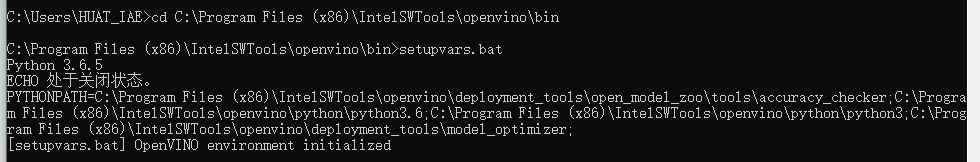
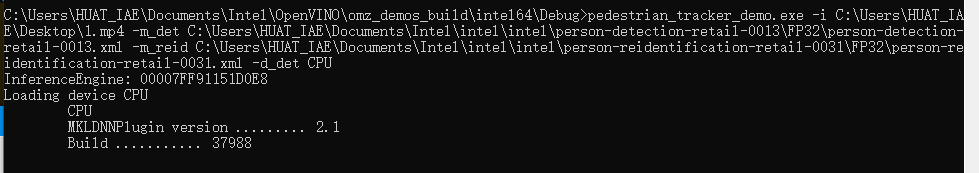
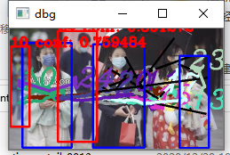
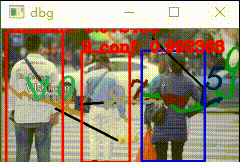

## 设计报告
本实验是基于Openvino进行行人检测的实验报告

根据openvino提供的实验模型PedestrianTracker进行检测，本次**人物识别**采用CNN类中的ResMobNet_v4(LReLu) with single ssD head网络模型。***行人重识别**采用ICV-RMNet-PD-ReID-Light模型


由于换了自己的电脑做，需要重新开始
 - 1 Openvino 安装
安装配置Cmake3.1.8，python3.6.5 在Visual Studio2019中安装MSBUILD和SDK最新版本和C++桌面开发
根据安装提示最后运行样例demo均成功。

- 2 没有配置永久环境变量需要初始化Openvino的环境变量


- 3 运行编译build_demos_msvc.bat，并且在编译好的目录下打开Demo.sln然后**生成**可执行文件
- 4 下载PedestrianTracker对应需要下载模型
person-detection-retail-0013
person-reidentification-retail-0031
- 5 下载样本(1.mp4)
- 6 运行pedestrian_tracker_demo.exe和他的模型即可得到结果




### 代码分析(main.cpp)
#### 创建Tracker对象
```C++
CreatePedestrianTracker(const std::string& reid_model,
                        const InferenceEngine::Core & ie,
                        const std::string & deviceName,
                        bool should_keep_tracking_info) {
    TrackerParams params;

    if (should_keep_tracking_info) {
        params.drop_forgotten_tracks = false;
        params.max_num_objects_in_track = -1;
    }

    std::unique_ptr<PedestrianTracker> tracker(new PedestrianTracker(params));

    // Load reid-model行人重识别模型.
    std::shared_ptr<IImageDescriptor> descriptor_fast =
        std::make_shared<ResizedImageDescriptor>(
            cv::Size(16, 32), cv::InterpolationFlags::INTER_LINEAR);
    std::shared_ptr<IDescriptorDistance> distance_fast =
        std::make_shared<MatchTemplateDistance>();

    tracker->set_descriptor_fast(descriptor_fast);
    tracker->set_distance_fast(distance_fast);

    if (!reid_model.empty()) {
        CnnConfig reid_config(reid_model);     //创建CNN类型的行人重识别模型
        reid_config.max_batch_size = 16;   // defaulting to 16设置他的最大批处理为16

        std::shared_ptr<IImageDescriptor> descriptor_strong =
            std::make_shared<DescriptorIE>(reid_config, ie, deviceName);

        if (descriptor_strong == nullptr) {
            THROW_IE_EXCEPTION << "[SAMPLES] internal error - invalid descriptor";
        }
        std::shared_ptr<IDescriptorDistance> distance_strong =
            std::make_shared<CosDistance>(descriptor_strong->size());

        tracker->set_descriptor_strong(descriptor_strong);
        tracker->set_distance_strong(distance_strong);
    } else {
        std::cout << "WARNING: Reid model "
            << "was not specified. "
            << "Only fast reidentification approach will be used." << std::endl;
    }

    return tracker;
}
```
代码内容主要为创建pedestrianTracker对象利用行人重识别模型，该函数大多调用静态方法实现缩放生成16x32大小的视频采用线性插值法。
- Fast_distance快速距离算法
- descriptor_fast快速特征点描述算法
- '_strong'表示强引用。只要引用存在那么保证对象不会被消除，当强应用消除时，对象才能被消除。

### 主要工作模块
```C++
int main_work(int argc, char **argv) {
    std::cout << "InferenceEngine: " << GetInferenceEngineVersion() << std::endl;
    auto det_model = FLAGS_m_det;
    auto reid_model = FLAGS_m_reid;

    auto detlog_out = FLAGS_out;

    auto detector_mode = FLAGS_d_det;
    auto reid_mode = FLAGS_d_reid;

    auto custom_cpu_library = FLAGS_l;
    auto path_to_custom_layers = FLAGS_c;
    bool should_use_perf_counter = FLAGS_pc;

    bool should_print_out = FLAGS_r;

    bool should_show = !FLAGS_no_show;
    int delay = FLAGS_delay;
    if (!should_show)
        delay = -1;
    should_show = (delay >= 0);

    std::vector<std::string> devices{detector_mode, reid_mode};
    InferenceEngine::Core ie =//主要功能是负责openvino中所支持的硬件设备类型注册(主要包括CPU,GPU, Modividus,VPU等
        LoadInferenceEngine(
            devices, custom_cpu_library, path_to_custom_layers,
            should_use_perf_counter);

    DetectorConfig detector_confid(det_model);
    ObjectDetector pedestrian_detector(detector_confid, ie, detector_mode);

    bool should_keep_tracking_info = should_save_det_log || should_print_out;
    std::unique_ptr<PedestrianTracker> tracker =
        CreatePedestrianTracker(reid_model, ie, reid_mode,
                                should_keep_tracking_info);

   
    double video_fps = cap.get(cv::CAP_PROP_FPS);
    if (0.0 == video_fps) {
        // the default frame rate for DukeMTMC dataset
        video_fps = 60.0;
    }
   
    std::cout << std::endl;

    cv::Size graphSize{static_cast<int>(cap.get(cv::CAP_PROP_FRAME_WIDTH) / 4), 60};
    Presenter presenter(FLAGS_u, 10, graphSize);

    for (int32_t frame_idx = std::max(0, FLAGS_first); 0 > FLAGS_last || frame_idx <= FLAGS_last; ++frame_idx) {
        cv::Mat frame;
        if (!cap.read(frame)) {
            break;
        }

        pedestrian_detector.submitFrame(frame, frame_idx);
        pedestrian_detector.waitAndFetchResults();

        TrackedObjects detections = pedestrian_detector.getResults();

        // timestamp in milliseconds
        uint64_t cur_timestamp = static_cast<uint64_t >(1000.0 / video_fps * frame_idx);
        tracker->Process(frame, detections, cur_timestamp);

        presenter.drawGraphs(frame);

        if (should_show) {//绘制描绘包裹的行人的方框
            // Drawing colored "worms" (tracks).
            frame = tracker->DrawActiveTracks(frame);

            // Drawing all detected objects on a frame by BLUE COLOR
            for (const auto &detection : detections) {
                cv::rectangle(frame, detection.rect, cv::Scalar(255, 0, 0), 3);
            }

            // Drawing tracked detections only by RED color and print ID and detection
            // confidence level.
            for (const auto &detection : tracker->TrackedDetections()) {
                cv::rectangle(frame, detection.rect, cv::Scalar(0, 0, 255), 3);
                std::string text = std::to_string(detection.object_id) +
                    " conf: " + std::to_string(detection.confidence);
                cv::putText(frame, text, detection.rect.tl(), cv::FONT_HERSHEY_COMPLEX,
                            1.0, cv::Scalar(0, 0, 255), 3);
            }

            cv::resize(frame, frame, cv::Size(), 0.5, 0.5);
            cv::imshow("dbg", frame);
            char k = cv::waitKey(delay);
            if (k == 27)
                break;
            presenter.handleKey(k);
        }

        if (should_save_det_log && (frame_idx % 100 == 0)) {
            DetectionLog log = tracker->GetDetectionLog(true);
            SaveDetectionLogToTrajFile(detlog_out, log);
        }
    }

    if (should_keep_tracking_info) {
        DetectionLog log = tracker->GetDetectionLog(true);

        if (should_save_det_log)
            SaveDetectionLogToTrajFile(detlog_out, log);
        if (should_print_out)
            PrintDetectionLog(log);
    }
    if (should_use_perf_counter) {
        pedestrian_detector.PrintPerformanceCounts(getFullDeviceName(ie, FLAGS_d_det));
        tracker->PrintReidPerformanceCounts(getFullDeviceName(ie, FLAGS_d_reid));
    }//记录行人行为表现数量

    std::cout << presenter.reportMeans() << '\n';
    return 0;
}
```

**总结**：本次实验利用一个人物探测模型（ResMobNet）和一个行人重识别模型(ICV-RMNet-PD-ReID-Light)实现行人检测，其中行人重识别模型可以跨不同设备解决人们兼具柔性和刚性的特性且外观易受穿着，尺度，遮挡，姿态，和视角等影响的问题。完成识别行人并且检测动作。

**心得**：本次实验学习了Openvino的基本开发流程和编译流程结合Visual Studio 2019，学习和掌握神经网络的运用和特点。理解代码每个部分的特点和作用。对人物检测有着基本的流程了解和学习ResMobNet基本结构和特点以及行人重识别解决行人的着装和其他现实问题其中在人物探测中学会了快速特征点描述算法，快速距离算法。

