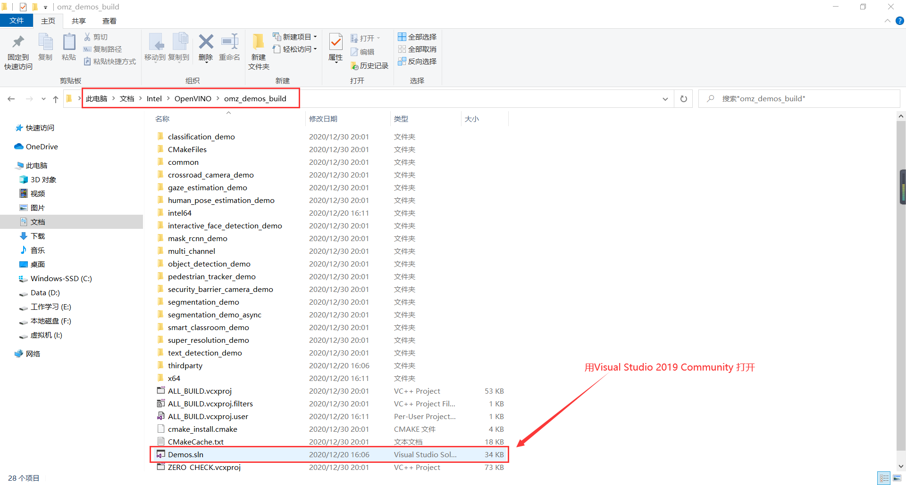

<font face=kaiti>

# <center>车载信息处理课程设计</center>
 &nbsp;
  &nbsp;
   &nbsp;
    &nbsp;
     &nbsp;
      &nbsp;

<center>课程：<u>________车载信息处理__________</u></center>
<center>授课教师：<u>_________龚家元___________</u></center>
<center>报告名称：<u>基于OpenVINO的人体动作检测_</u></center>
<center>学号：<u>__________201809058___________</u></center>
<center>姓名：<u>____________王宇龙____________</u></center>
<center>完成时间：<u>______  2020.12.28__________</u></center>


 &nbsp;
  &nbsp;
   &nbsp;
    &nbsp;
    &nbsp;
        &nbsp;
            &nbsp;

# 一. 实验目的
 &nbsp; 本实验是基于OpenVINO的图像处理、检测与识别，实现对行人目标进行感知。在自动驾驶领域中，车载视觉摄像头对前方道路行人的动作侦测十分重要，帮助车辆进行行人动作的判断以控制实现车辆的制动与通过动作。当前，中国的道路条件错综复杂，从掩体中突然窜出的人或人驾驶的车辆造成的交通事故被称为“鬼探头”，是诱发交通事故的主要诱因之一。因此，如想实现自动驾驶汽车技术，确保乘员与外部人员的安全，基于车载摄像头与相关算法对行人动作进行感知是十分重要的。

&nbsp;
 
<center>鬼探头示意图</center>
&nbsp;

&nbsp;从2014年开始，以欧洲E-NCAP新车评估测试为首的非盈利组织开始倡导各国汽车安全组织，将汽车主动安全方面进行评分化，纳入汽车安全性评价且占较大评分比例。足见欧洲汽车对于该项的重视，正因如此，支持主动安全技术的汽车越来越多，装备毫米波雷达+摄像头初步实现L2级别自动驾驶的汽车越来越多，对于该项的评价也越来越严格（法律法规的推陈出新也推动了自动驾驶汽车行业的发展）。
&nbsp;

<center>  E-NCAP测试汽车针对行人感知的主动安全系统 </center>
            &nbsp;

# 二. 实验过程
1.编译 build_demos_msvc.bat 文件
进入以下目录：
```
cd C:\IntelTools\openvino\openvino_2021\deployment_tools\inference_engine\demos
```

```
输入 build_demos_msvc.bat 编译脚本文件
```

<center>图1 编译脚本文件</center>

2.执行完脚本之后，会在文档目录下生成一个 Intel 的文件夹，进入 Intel 文件夹下的 OpenVINO\omz_demos_build 文件夹，使用 VS2017 打开 Demos.sln 文件。


<center>图2 Demo.sln</center>

- 进入 Visual Studio 2019 后，右键点击 ALL_BUILD ，然后点击生成，开始进行编译


<center>图3 complier</center>

- 在电脑的这个路径下：
```
C:\Users\NewAdmin\Documents\Intel\OpenVINO\omz_demos_build\intel64\Debug
```
可以看到有许多编译出来的文件，这里我们找到实验的human_pose_estimation_demo.exe程序


<center>图4 complier_exe</center>

3.执行exe程序的准备工作
- 添加环境变量
```
C:\IntelTools\openvino\openvino_2021\opencv\bin
C:\IntelTools\openvino\openvino_2021\deployment_tools\inference_engine\bin\intel64\Debug
C:\IntelTools\openvino\openvino_2021\deployment_tools\inference_engine\bin\intel64\Release
C:\IntelTools\openvino\openvino_2021\deployment_tools\inference_engine\external\tbb\bin
C:\IntelTools\openvino\openvino_2021\deployment_tools\ngraph\lib
C:\Users\NewAdmin\Documents\Intel\OpenVINO\omz_demos_build\intel64\Debug
C:\Users\NewAdmin\Documents\Intel\OpenVINO\omz_demos_build\intel64\Release
```

<center>图5 Path</center>

- 下载模型文件
这个路径下的downloader.py文件可以用于下载模型文件：
```
C:\IntelTools\openvino\openvino_2021\deployment_tools\tools\model_downloader
```
具体模型名称，可以在以下路径查看：
```
C:\IntelTools\openvino\openvino_2021\deployment_tools\intel_models
```

<center>图6 model</center>
由于我们要执行的 demo 是 human_pose_estimation_demo.exe ，所以我们需要下载 human-pose-estimation-0001 模型
```
命令：
python C:\IntelTools\openvino\openvino_2021\deployment_tools\tools\model_downloader\downloader.py --name human_pose_estimation_demo
```


<center>图7 download_model</center>

- 下载成功后，会在C盘的Intel文件夹下看到human-pose-estimation-0001的文件夹

<center>图8 model_success</center>

4.执行程序
- 进入以下路径的文件夹
```
cd C:\Users\NewAdmin\Documents\Intel\OpenVINO\omz_demos_build\intel64\Debug
```

<center>图9 run_exe</center>

- 输入以下命令
```
human_pose_estimation_demo.exe -i C:\Users\NewAdmin\Videos\7.mp4 -m C:\intel\human-pose-estimation-0001\FP32\human-pose-estimation-0001.xml -d CPU
```


<center>图10 cmd_exe</center>

# 三.测试展示

<center>运行截图1</center>


<center>运行截图2</center>


<center>运行截图3</center>


<center>运行截图4</center>

# 四.代码分析
```C++
main.cpp
// Copyright (C) 2018-2019 Intel Corporation
// SPDX-License-Identifier: Apache-2.0
//

/**
* \brief The entry point for the Inference Engine Human Pose Estimation demo application
* \file human_pose_estimation_demo/main.cpp
* \example human_pose_estimation_demo/main.cpp
*/

#include <vector>
#include <chrono>

#include <inference_engine.hpp>

#include <monitors/presenter.h>
#include <samples/images_capture.h>
#include <samples/ocv_common.hpp>

#include "human_pose_estimation_demo.hpp"
#include "human_pose_estimator.hpp"
#include "render_human_pose.hpp"

using namespace InferenceEngine;
using namespace human_pose_estimation;

bool ParseAndCheckCommandLine(int argc, char* argv[]) {
    // ---------------------------Parsing and validation of input args--------------------------------------

    gflags::ParseCommandLineNonHelpFlags(&argc, &argv, true);
    if (FLAGS_h) {
        showUsage();
        showAvailableDevices();
        return false;
    }

    std::cout << "Parsing input parameters" << std::endl;

    if (FLAGS_i.empty()) {
        throw std::logic_error("Parameter -i is not set");
    }

    if (FLAGS_m.empty()) {
        throw std::logic_error("Parameter -m is not set");
    }

    return true;
}

int main(int argc, char* argv[]) {
    try {
        std::cout << "InferenceEngine: " << printable(*GetInferenceEngineVersion()) << std::endl;

        // ------------------------------ Parsing and validation of input args ---------------------------------
        if (!ParseAndCheckCommandLine(argc, argv)) {
            return EXIT_SUCCESS;
        }

        HumanPoseEstimator estimator(FLAGS_m, FLAGS_d, FLAGS_pc);

        std::unique_ptr<ImagesCapture> cap = openImagesCapture(FLAGS_i, FLAGS_loop);
        cv::Mat curr_frame = cap->read();
        if (!curr_frame.data) {
            throw std::runtime_error("Can't read an image from the input");
        }

        cv::Size graphSize{curr_frame.cols / 4, 60};
        Presenter presenter(FLAGS_u, curr_frame.rows - graphSize.height - 10, graphSize);

        estimator.reshape(curr_frame);  // Do not measure network reshape, if it happened

        std::cout << "To close the application, press 'CTRL+C' here";
        if (!FLAGS_no_show) {
            std::cout << " or switch to the output window and press ESC key" << std::endl;
            std::cout << "To pause execution, switch to the output window and press 'p' key" << std::endl;
        }
        std::cout << std::endl;

        int delay = 1;
        bool isAsyncMode = false; // execution is always started in SYNC mode
        bool isModeChanged = false; // set to true when execution mode is changed (SYNC<->ASYNC)
        bool blackBackground = FLAGS_black;

        typedef std::chrono::duration<double, std::ratio<1, 1000>> ms;
        auto total_t0 = std::chrono::high_resolution_clock::now();
        auto wallclock = std::chrono::high_resolution_clock::now();
        double render_time = 0;
        do {
            auto t0 = std::chrono::high_resolution_clock::now();
            //here is the first asynchronus point:
            //in the async mode we capture frame to populate the NEXT infer request
            //in the regular mode we capture frame to the current infer request

            cv::Mat next_frame = cap->read();
            if (isAsyncMode) {
                if (isModeChanged) {
                    estimator.frameToBlobCurr(curr_frame);
                }
                if (next_frame.data) {
                    estimator.frameToBlobNext(next_frame);
                }
            } else if (!isModeChanged) {
                estimator.frameToBlobCurr(curr_frame);
            }
            auto t1 = std::chrono::high_resolution_clock::now();
            double decode_time = std::chrono::duration_cast<ms>(t1 - t0).count();

            t0 = std::chrono::high_resolution_clock::now();
            // Main sync point:
            // in the truly Async mode we start the NEXT infer request, while waiting for the CURRENT to complete
            // in the regular mode we start the CURRENT request and immediately wait for it's completion
            if (isAsyncMode) {
                if (isModeChanged) {
                    estimator.startCurr();
                }
                if (next_frame.data) {
                    estimator.startNext();
                }
            } else if (!isModeChanged) {
                estimator.startCurr();
            }

            estimator.waitCurr();
            t1 = std::chrono::high_resolution_clock::now();
            ms detection = std::chrono::duration_cast<ms>(t1 - t0);
            t0 = std::chrono::high_resolution_clock::now();
            ms wall = std::chrono::duration_cast<ms>(t0 - wallclock);
            wallclock = t0;

            t0 = std::chrono::high_resolution_clock::now();

            if (blackBackground) {
                curr_frame = cv::Mat::zeros(curr_frame.size(), curr_frame.type());
            }
            std::ostringstream out;
            out << "OpenCV cap/render time: " << std::fixed << std::setprecision(1)
                << (decode_time + render_time) << " ms";
            cv::putText(curr_frame, out.str(), cv::Point2f(0, 25),
                        cv::FONT_HERSHEY_TRIPLEX, 0.6, cv::Scalar(0, 255, 0));
            out.str("");
            out << "Wallclock time " << (isAsyncMode ? "(TRUE ASYNC):      " : "(SYNC, press Tab): ");
            out << std::fixed << std::setprecision(2) << wall.count()
                << " ms (" << 1000.0 / wall.count() << " fps)";
            cv::putText(curr_frame, out.str(), cv::Point2f(0, 50),
                        cv::FONT_HERSHEY_TRIPLEX, 0.6, cv::Scalar(0, 0, 255));
            if (!isAsyncMode) {  // In the true async mode, there is no way to measure detection time directly
                out.str("");
                out << "Detection time  : " << std::fixed << std::setprecision(1) << detection.count()
                << " ms ("
                << 1000.0 / detection.count() << " fps)";
                cv::putText(curr_frame, out.str(), cv::Point2f(0, 75), cv::FONT_HERSHEY_TRIPLEX, 0.6,
                    cv::Scalar(255, 0, 0));
            }

            std::vector<HumanPose> poses = estimator.postprocessCurr();

            if (FLAGS_r) {
                if (!poses.empty()) {
                    std::time_t result = std::time(nullptr);
                    char timeString[sizeof("2020-01-01 00:00:00: ")];
                    std::strftime(timeString, sizeof(timeString), "%Y-%m-%d %H:%M:%S: ", std::localtime(&result));
                    std::cout << timeString;
                    }

                for (HumanPose const& pose : poses) {
                    std::stringstream rawPose;
                    rawPose << std::fixed << std::setprecision(0);
                    for (auto const& keypoint : pose.keypoints) {
                        rawPose << keypoint.x << "," << keypoint.y << " ";
                    }
                    rawPose << pose.score;
                    std::cout << rawPose.str() << std::endl;
                }
            }

            presenter.drawGraphs(curr_frame);
            renderHumanPose(poses, curr_frame);

            if (!FLAGS_no_show) {
                cv::imshow("Human Pose Estimation on " + FLAGS_d, curr_frame);
            }

            t1 = std::chrono::high_resolution_clock::now();
            render_time = std::chrono::duration_cast<ms>(t1 - t0).count();

            if (isModeChanged) {
                isModeChanged = false;
            }

            // Final point:
            // in the truly Async mode we swap the NEXT and CURRENT requests for the next iteration
            curr_frame = std::move(next_frame);
            if (isAsyncMode) {
                estimator.swapRequest();
            }

            if (!FLAGS_no_show) {
                const int key = cv::waitKey(delay) & 255;
                if (key == 'p') {
                    delay = (delay == 0) ? 1 : 0;
                } else if (27 == key) { // Esc
                    break;
                } else if (9 == key) { // Tab
                    isAsyncMode = !isAsyncMode;
                    isModeChanged = true;
                } else if (32 == key) { // Space
                    blackBackground = !blackBackground;
                }
                presenter.handleKey(key);
            }
        } while (curr_frame.data);

        auto total_t1 = std::chrono::high_resolution_clock::now();
        ms total = std::chrono::duration_cast<ms>(total_t1 - total_t0);
        std::cout << "Total Inference time: " << total.count() << std::endl;
        std::cout << presenter.reportMeans() << '\n';
    }
    catch (const std::exception& error) {
        std::cerr << "[ ERROR ] " << error.what() << std::endl;
        return EXIT_FAILURE;
    }
    catch (...) {
        std::cerr << "[ ERROR ] Unknown/internal exception happened." << std::endl;
        return EXIT_FAILURE;
    }

    std::cout << "Execution successful" << std::endl;
    return EXIT_SUCCESS;
}
```
# 五.实验心得

&nbsp; 通过本次实验，我学习了通过OpenVINO实现行人动作感知的相关知识。通过分析源代码可知OpenVINO开发人员实现该技术的相关方式与开放算法流程。通过对行人的眼睛、头、身体、胳膊、腿等进行行人识别及动作预测，能够较为准确的在光线充足且要素充足的条件下进行识别，能够通过相应预测行人即将发生的肢体动作。

&nbsp; 当前自动驾驶技术发展日趋成熟，但由于在汽车行驶过程中有多种不确定的因素，会导致复杂的后果产生，因此如何将人工智能技术、互联网技术与汽车相结合是当今最为重要的发展目标。智能汽车的研发初衷，首先是要做到汽车自身的“安全”，拥有稳定有效的主动安全技术将会为后续的智能汽车研发减少许多困难与降低研发成本。本实验通过OpenVINO与车载摄像头实现行人动作感知检测，能够有效地帮助自动驾驶汽车提高其主动安全性能，判断行人的动作可以为汽车自主避险、自主避障有很大帮助。

&nbsp; 通过本次实验，实现了使用OpenVINO实现行人动作感知的流程，系统能够监测到视频中实时出现的行人并标明行人的肢体轮廓与动作，从而做出行人动作预测（human pose estimation）。在基本实现行人动作预测的基础上：通过本次实验步骤一步一步实现，我熟练掌握了Visual Studio Community软件的使用方式与程序配置，当实验遇到困难和问题时，我学会自主发现问题并解决问题的方法（例如将错误代码复制至网页中寻找解决方法）。通过这次课程设计，令我感触良多、受益匪浅。

</font>