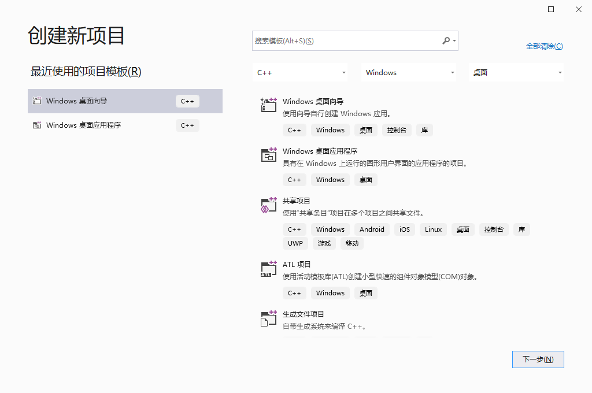
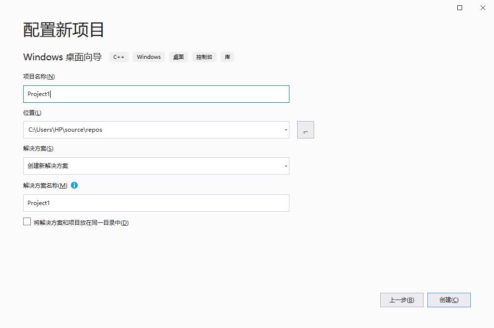
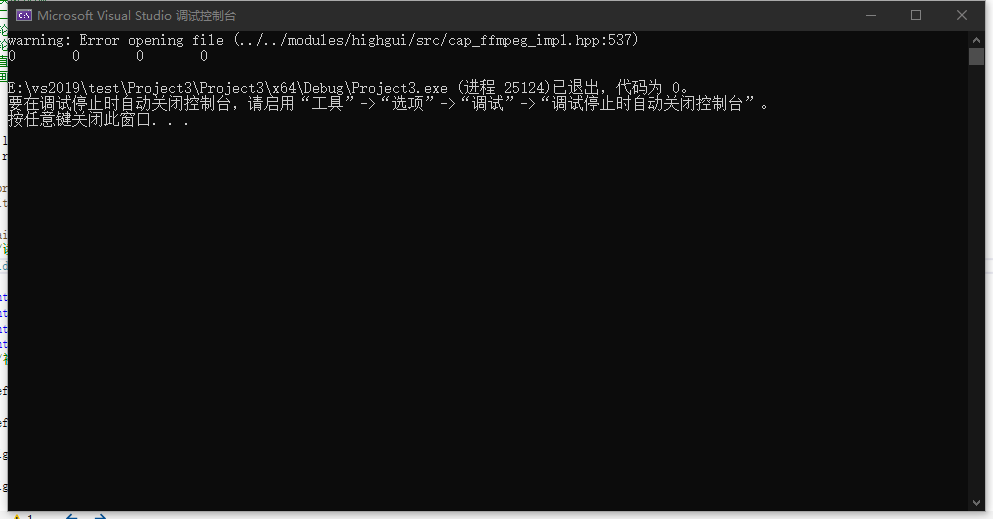
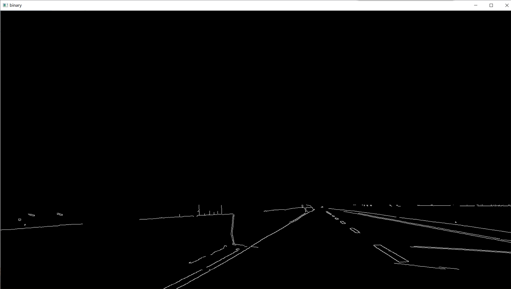
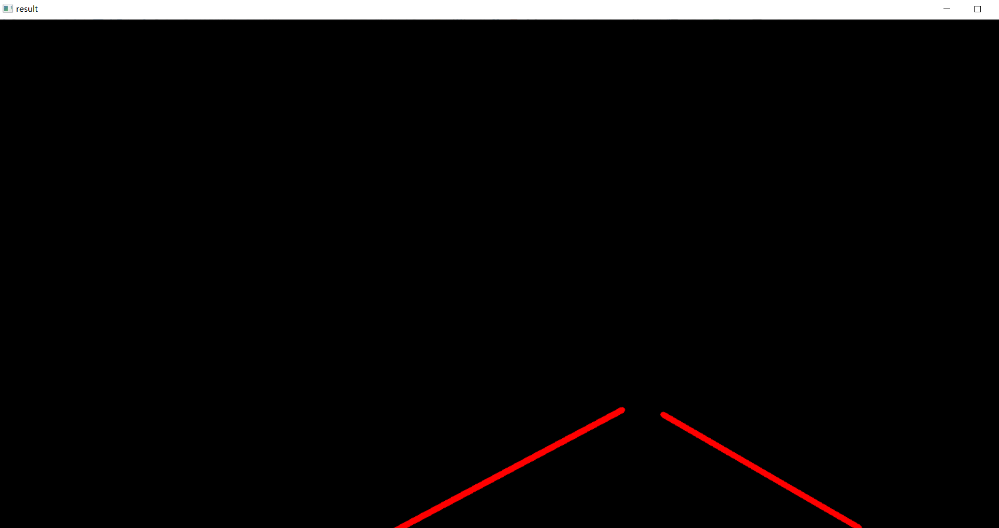
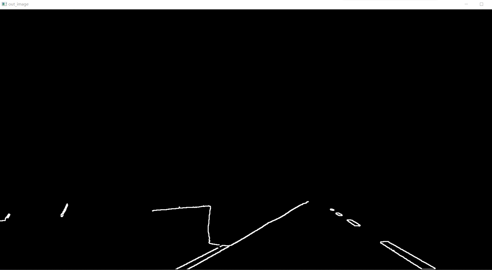
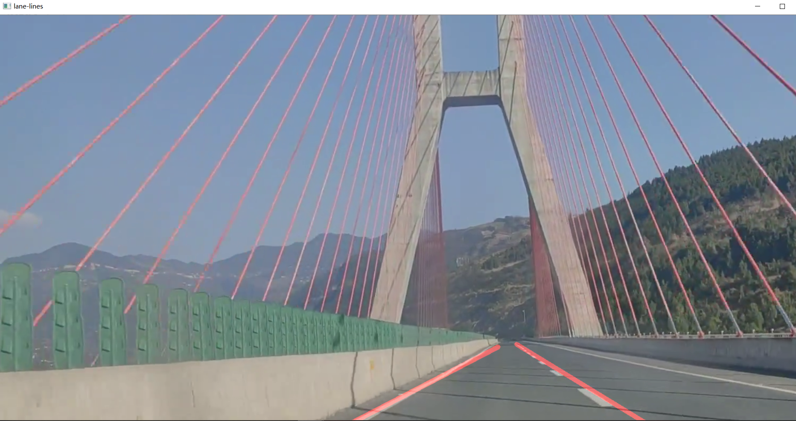
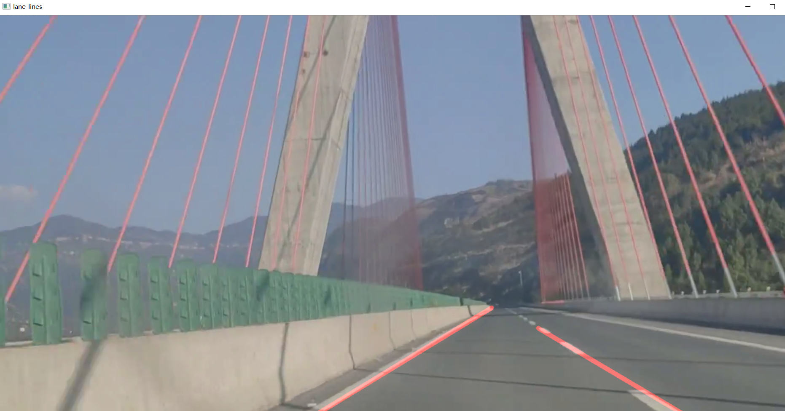
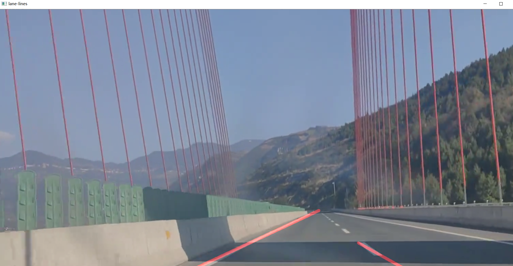

# 基于OpenCV的图像处理、检测与识别，完成车道线检测

## 步骤

首先在电脑上配置OpenCV的环境


打开Visual Studio，新建一个项目





## 代码：

```
#include <opencv2/opencv.hpp>
#include <iostream>
#include <cmath>

using namespace cv;
using namespace std;


Point left_line[2];
Point right_line[2];

void process(Mat& frame, Point* left_line, Point* right_line);
Mat fitLines(Mat& image, Point* left_line, Point* right_line);

int main(int argc, char** argv) {
	//读取视频
	VideoCapture capture("2.mp4");

	int height = capture.get(CV_CAP_PROP_FRAME_HEIGHT);
	int width = capture.get(CV_CAP_PROP_FRAME_WIDTH);
	int count = capture.get(CV_CAP_PROP_FRAME_COUNT);
	int fps = capture.get(CV_CAP_PROP_FPS);
	//初始化

	left_line[0] = Point(0, 0);

	left_line[1] = Point(0, 0);

	right_line[0] = Point(0, 0);

	right_line[1] = Point(0, 0);

	cout << height << "       " << width << "       " << count << "       " << fps << endl;

	//循环读取视频
	Mat frame;
	while (true) {
		int ret = capture.read(frame);
		if (!ret) {
			break;
		}
		imshow("input", frame);
		process(frame, left_line, right_line);

		char c = waitKey(5);
		if (c == 27) {
			break;
		}


	}

}

void process(Mat& frame, Point* left_line, Point* right_line) {
	Mat gray, binary;
	/**灰度化*/
	cvtColor(frame, gray, COLOR_BGR2GRAY);

	//threshold(gray, binary, );
	//边缘检测
	Canny(gray, binary, 150, 300);
	//imshow("Canny", binary);
	for (size_t i = 0; i < (gray.rows / 2 + 40); i++) {
		for (size_t j = 0; j < gray.cols; j++)
		{
			binary.at<uchar>(i, j) = 0;
		}
	}
	imshow("binary", binary);

	//寻找轮廓
	vector<vector<Point>> contours;
	findContours(binary, contours, RETR_EXTERNAL, CHAIN_APPROX_SIMPLE);

	Mat out_image = Mat::zeros(gray.size(), gray.type());

	for (int i = 0; i < contours.size(); i++)
	{

		//计算面积与周长
		double length = arcLength(contours[i], true);
		double area = contourArea(contours[i]);
		//cout << "周长 length:" << length << endl;
		//cout << "面积 area:" << area << endl;

		//外部矩形边界
		Rect rect = boundingRect(contours[i]);
		int h = gray.rows - 50;

		//轮廓分析：
		if (length < 5.0 || area < 10.0) {
			continue;
		}
		if (rect.y > h) {
			continue;
		}

		//最小包围矩形
		RotatedRect rrt = minAreaRect(contours[i]);
		


		//cout << "最小包围矩形 angle:" << rrt.angle << endl;

		double angle = abs(rrt.angle);

		//angle < 50.0 || angle>89.0

		if (angle < 20.0 || angle>84.0) {

			continue;

		}


		if (contours[i].size() > 5) {
			//用椭圆拟合
			RotatedRect errt = fitEllipse(contours[i]);
			//cout << "用椭圆拟合err.angle:" << errt.angle << endl;

			if ((errt.angle < 5.0) || (errt.angle > 160.0))
			{
				if (80.0 < errt.angle && errt.angle < 100.0) {
					continue;
				}

			}
		}


		//cout << "开始绘制：" << endl;
		drawContours(out_image, contours, i, Scalar(255), 2, 8);
		imshow("out_image", out_image);

	}
	Mat result = fitLines(out_image, left_line, right_line);
	imshow("result", result);

	Mat dst;
	addWeighted(frame, 0.8, result, 0.5, 0, dst);
	imshow("lane-lines", dst);

}

//直线拟合
Mat fitLines(Mat& image, Point* left_line, Point* right_line) {
	int height = image.rows;
	int width = image.cols;

	Mat out = Mat::zeros(image.size(), CV_8UC3);

	int cx = width / 2;
	int cy = height / 2;

	vector<Point> left_pts;
	vector<Point> right_pts;
	Vec4f left;


	for (int i = 100; i < (cx - 10); i++)
	{
		for (int j = cy; j < height; j++)
		{
			int pv = image.at<uchar>(j, i);
			if (pv == 255)
			{
				left_pts.push_back(Point(i, j));
			}
		}
	}

	for (int i = cx; i < (width - 20); i++)
	{
		for (int j = cy; j < height; j++)
		{
			int pv = image.at<uchar>(j, i);
			if (pv == 255)
			{
				right_pts.push_back(Point(i, j));
			}
		}
	}

	if (left_pts.size() > 2)
	{
		fitLine(left_pts, left, CV_DIST_L1, 0, 0.01, 0.01);

		double k1 = left[1] / left[0];
		double step = left[3] - k1 * left[2];

		int x1 = int((height - step) / k1);
		int y2 = int((cx - 25) * k1 + step);

		Point left_spot_1 = Point(x1, height);
		Point left_spot_end = Point((cx - 25), y2);


		line(out, left_spot_1, left_spot_end, Scalar(0, 0, 255), 8, 8, 0);
		left_line[0] = left_spot_1;
		left_line[1] = left_spot_end;

	}
	else
	{
		line(out, left_line[0], left_line[1], Scalar(0, 0, 255), 8, 8, 0);
	}


	if (right_pts.size() > 2)
	{

		Point spot_1 = right_pts[0];
		Point spot_end = right_pts[right_pts.size() - 1];

		int x1 = spot_1.x;

		int y1 = spot_1.y;

		int x2 = spot_end.x;
		int y2 = spot_end.y;


		line(out, spot_1, spot_end, Scalar(0, 0, 255), 8, 8, 0);
		right_line[0] = spot_1;
		right_line[1] = spot_end;

	}
	else
	{
		line(out, right_line[0], right_line[1], Scalar(0, 0, 255), 8, 8, 0);
	}

	return out;
}
```

## 出现的错误：





在所有的环境配置完成后，代码没有出现任何问题，但是在打开运行时一直报错，在网上搜索原因后，发现原因是视频文件的路径出现错误，导致OpenCV无法打开视频。

解决办法有几个，我选择的是改成相对路径重新做了一遍，问题解决。


## 运行结果：

这是一个bilibili上下载下来的一个车道线素材视频，素材原文件在<视频文件>里

由于电脑配置问题，只能一帧一帧的看，所以效果并不是很好
下面的是OpenCV运行后的结果：


在二值化处理后进行轮廓发现

轮廓分析、面积就算，角度分析





在直线拟合后画出直线





## 分析:

车道线检测，需要完成以下功能：

图像裁剪：通过设定图像ROI区域，拷贝图像获得裁剪图像
反透视变换：用的是室外采集到的视频，没有对应的变换矩阵。所以建立二维坐标，通过四点映射的方法计算矩阵，进行反透视变化。后因ROI区域的设置易造成变换矩阵获取困难和插值得到的透视图效果不理想，故没应用
二值化：先变化为灰度图，然后设定阈值直接变成二值化图像。
形态学滤波：对二值化图像进行腐蚀，去除噪点，然后对图像进行膨胀，弥补对车道线的腐蚀。
边缘检测：canny变化、sobel变化和laplacian变化中选择了效果比较好的canny变化，三者在代码中均可以使用，canny变化效果稍微好一点。
直线检测：实现了两种方法 
(1)使用opencv库封装好的霍夫直线检测函数，在原图对应区域用红线描出车道线 
(2)自己写一种直线检测，在头文件中，遍历ROI区域进行特定角度范围的直线检测。两种方法均可在视频中体现，第一种方法运行效率较快。

但是这是最简单的车道线检测，当摄像头自动调节亮度，图像亮度变低，二值化时同一阈值把车道线给过滤掉，造成无法识别车道线的现象。如果在阴暗环境下，其实无法准确的识别车道线。

如果旁边还有其他汽车压住车道线，也会造成系统无法准确识别车道线的位置。


## 总结： 

由于我们的能力有限，没有使用任何模型或复杂的图像功能。相反，解决方案仅基于某些图像预处理操作。

但是，在许多情况下，此解决方案将不起作用。例如，当没有车道标记或道路上的交通过多时，该系统将发生故障。还有一个存在的问题是人行道障碍。人行道是线段密集区域，由于进行了膨胀腐蚀算法，所以密集线的边缘会合并而变成块状。此时不会影响直线的检测。但是若边缘存在一些瑕疵，菱角，就会很容易像图中这样与画面中其他因素一起连接成线。但这样产生的线很难通过斜率筛选来去除掉，由于太过紧密同样很难通过Hough变换参数的设置去除。


## 心得体会：

在完成这个实验的过程中，其实更多的是学到如何使用基于OpenCV的图像处理、检测与识别的方法，去检测车道线，这是一个很有意思的过程。虽然中途遇到很多的问题，但是还是一个个的解决了，这种感觉是很棒的，看到最后自己的成果，是让人热血澎湃的。