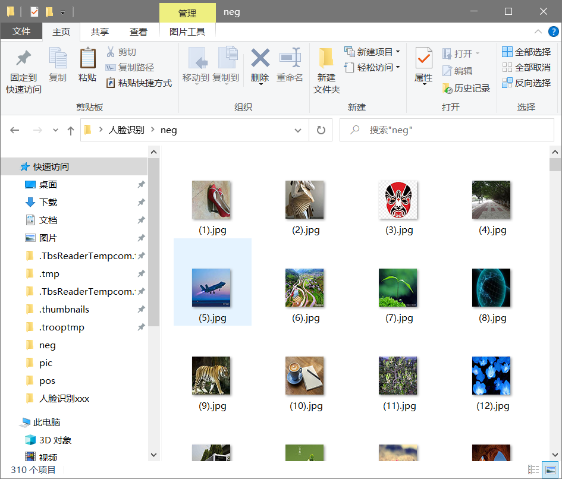
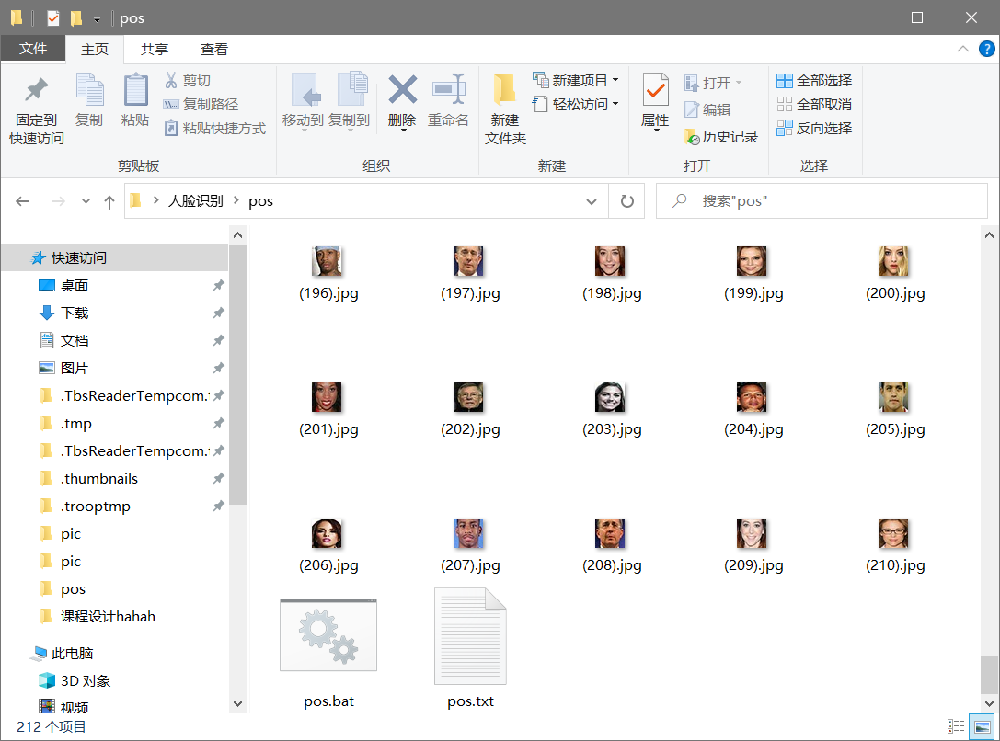
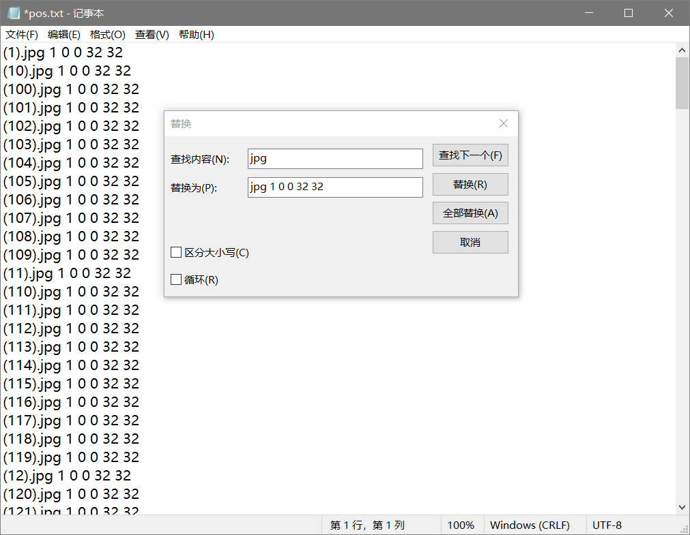
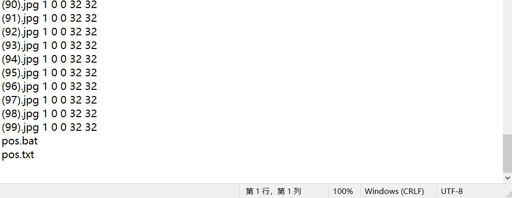
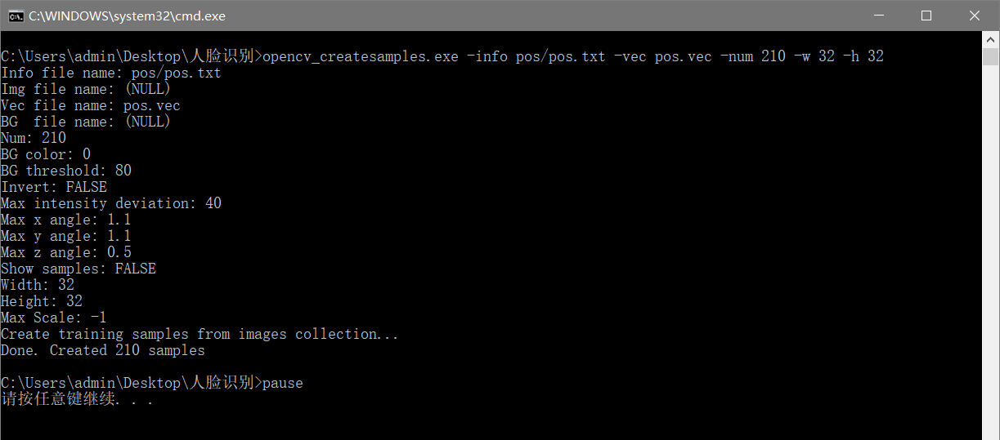
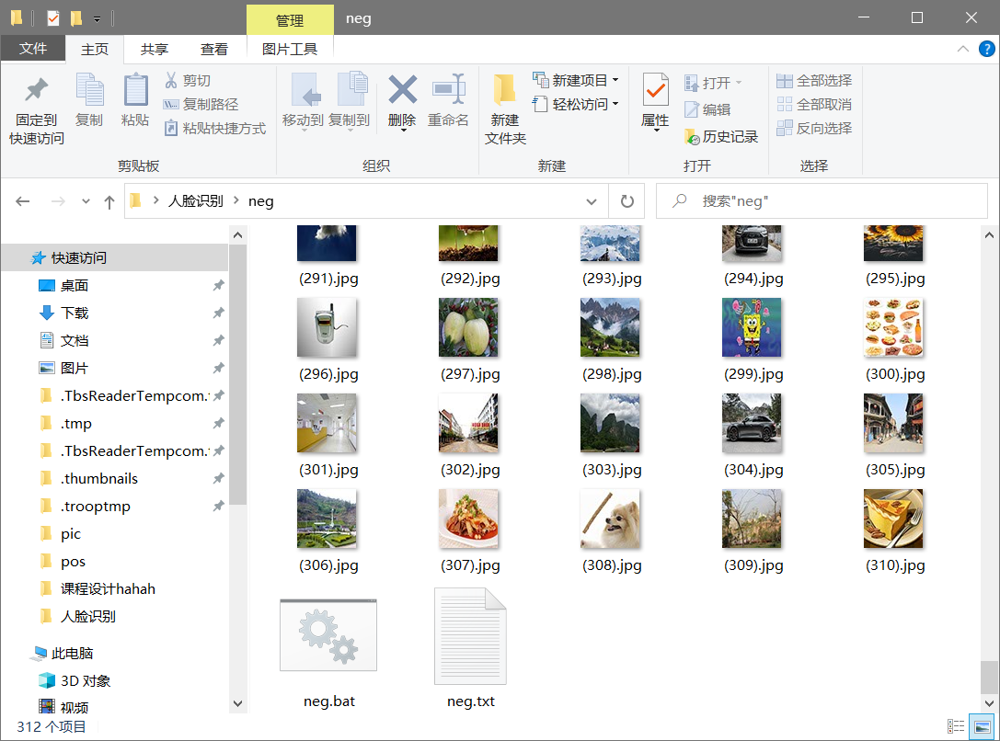
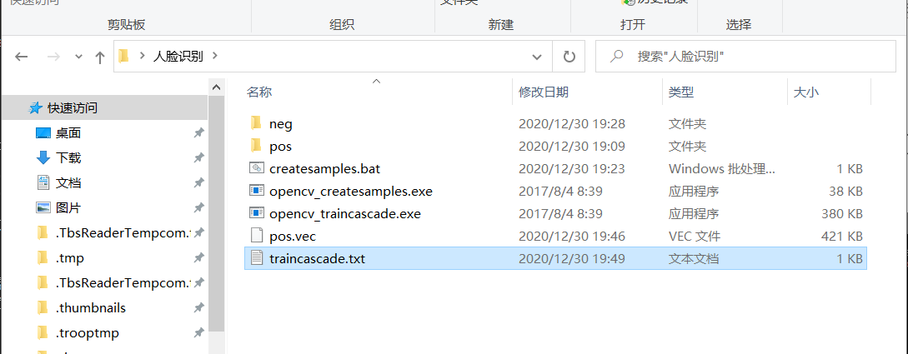
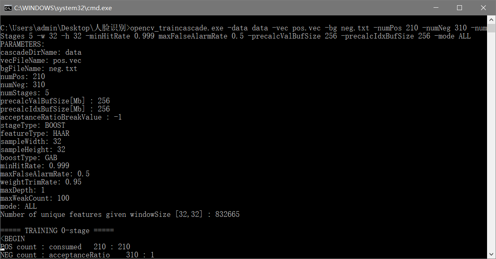
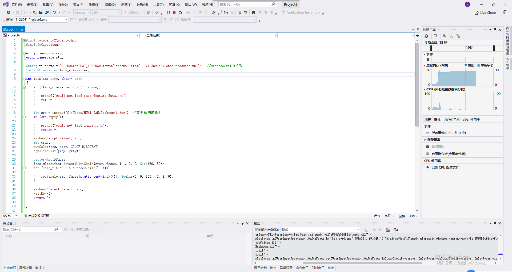
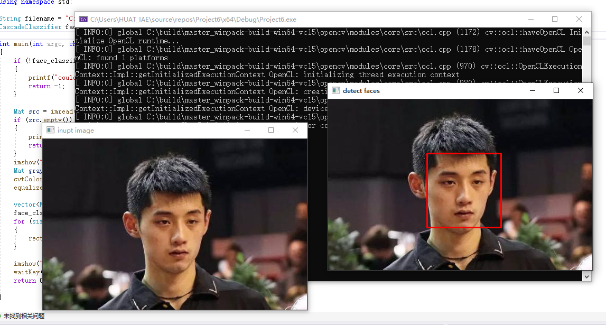

# 人脸识别：
## 搭建环境，准备样本
创建一个文件夹，命名为人脸识别，在人脸识别文件夹中新建两个文件夹pos和neg,分别存放正样本和负样本,我选的正样本分辨率是32x32，负样本分辨率是64x64，正样本数量是210，负样本是310.如图：

将opencv_traincascade.exe和opencv_createsamples.exe从opencv的bin文件夹中拷贝至该文件夹中，如图:

## 生成样本描述文件
在pos文件下新建一个txt文件，在txt文件中输入dir /b > pos.txt后保存，改后缀名为.bat生成脚本文件，双击该.bat文件运行可生成一个pos.txt。

在pos.txt文本中将所有的jpg替换成jpg 1 0 0 32 32。jpg后面的五个数字信息分别表示样本中目标个数、目标在图像中的起始位置x、y、样本的尺寸大小width、height。因为我的正样本只包含目标，所以样本的起始位置为0 0，训练之前最好将正样本规格化为同一尺寸。如图：

pos.txt文件中不应该包含除样本实例之外的条目，刚生成之后的pos.txt后面必然会有之前.bat的条目以及pos.txt自身的条目，将这两个条目删除。

在人脸识别目录下新建一个createsamples.txt文档，输入opencv_createsamples.exe -info pos/pos.txt -vec pos.vec -num 210 -w 32 -h 32 pause

-info表示指定的描述文件，-vec指定输出的vec文件名，-w-h表示规定的样本尺寸，-num表示创建的样本数目

修改后缀名为.bat生成脚本文件createsamples.bat文件，双击运行：

生成了正样本pos.vec文件，如图：

在neg文件夹下新建一个txt文件编辑内容为dir /b /s > neg.txt（加上/s指令是为了生成绝对路径），修改后缀名为.bat生成脚本文件，双击运行后生成neg.txt文件。

在记事本中编辑neg.txt，将所有”\“替换成”/“。将完成好的neg.txt放在人脸识别目录下，供后面的训练使用，如图：

## 训练分类器
在人脸识别目录下新建traincascade.txt文件，输入opencv_traincascade.exe -data data -vec pos.vec -bg neg.txt -numPos 210 -numNeg 310 -numStages 5 -w 32 -h 32 -minHitRate 0.999 maxFalseAlarmRate 0.5 -precalcValBufSize 256 -precalcIdxBufSize 256 -mode ALL pause

各参数含义：
-data <cascade_dir_name>目录名，如不存在训练程序会创建它，用于存放训练好的分类器。
-vec <vec_file_name>包含正样本的vec文件名（由opencv_createsamples程序生成）。
-bg <background_file_name>背景描述文件，也就是包含负样本文件名的那个描述文件。
-numPos <number_of_positive_samples>每级分类器训练时所用的正样本数目。
-numNeg <number_of_negative_samples>每级分类器训练时所用的负样本数目，可以大于 -bg 指定的图片数目。
-numStages <number_of_stages>训练的分类器的级数。
-precalcValBufSize<precalculated_vals_buffer_size_in_Mb>缓存大小，用于存储预先计算的特征值(feature values)，单位为MB。
-precalcIdxBufSize<precalculated_idxs_buffer_size_in_Mb>缓存大小，用于存储预先计算的特征索引(feature indices)，单位为MB。
-baseFormatSave这个参数仅在使用Haar特征时有效。如果指定这个参数，那么级联分类器将以老的格式存储。

修改后缀名为.bat生成脚本文件traincascade.bat，双击运行：

所有的stage全部训练完毕才表示训练完成，最终会生成一个总的cascade.xml文件，检测的时候只需要这一个.xml文件就可以完成检测。

## 测试训练效果
在OpenCV中写入代码

代码：

    #include<opencv2\opencv.hpp>
    #include<iostream>

    using namespace cv;
    using namespace std;

    String filename = "C:\Users\admin\Desktop\人脸识别\data\cascade.xml";   //cascade.xml的位置
    CascadeClassifier face_classifier;

    int main(int argc, char**argv)
    {
        if (!face_classifier.load(filename))
        {
            printf("could not laod face feature data..\n");
            return -1;
        }

        Mat src = imread("D:\图片\1.jpg"); //需要检测的图片
        if (src.empty())
        {
            printf("could not laod image...\n");
            return -1;
        }
        imshow("inupt image", src);
        Mat gray;
        cvtColor(src, gray, COLOR_BGR2GRAY);
        equalizeHist(gray, gray);

        vector<Rect>faces;
        face_classifier.detectMultiScale(gray, faces, 1.1, 3, 0, Size(50, 50));
        for (size_t t = 0; t < faces.size(); t++)
        {
            rectangle(src, faces[static_cast<int>(t)], Scalar(0, 0, 255), 2, 8, 0);
        }

    imshow("detect faces", src);
    waitKey(0);
    return 0;

    }

训练效果：

# 心得
我选择用OpenCV完成实验，参考了很多网上的资料，网上有一些已经很好的训练集。我自己也做了一个训练集。但是遇到了一些问题，比如：最后双击traincascade.bat文件不能生成训练集cascade.xml文件。原因是我选的样本图片的分辨率太大了。遇到问题要想办法解决，上网查资料能给我们提供很大的帮助。