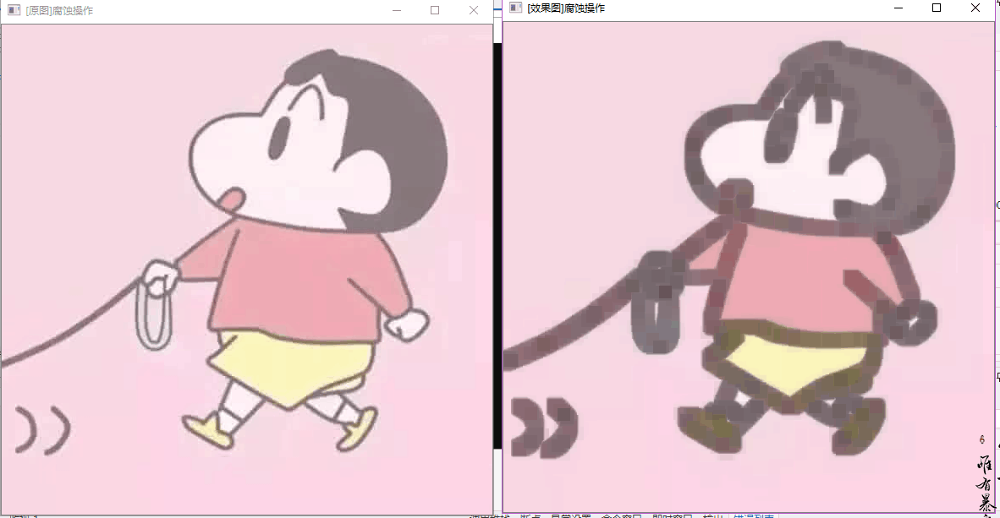
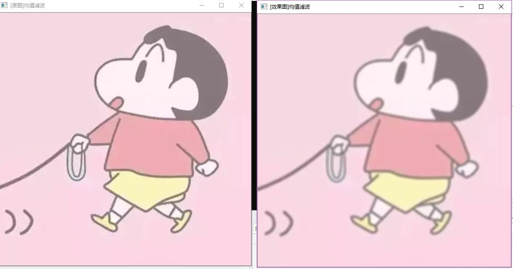
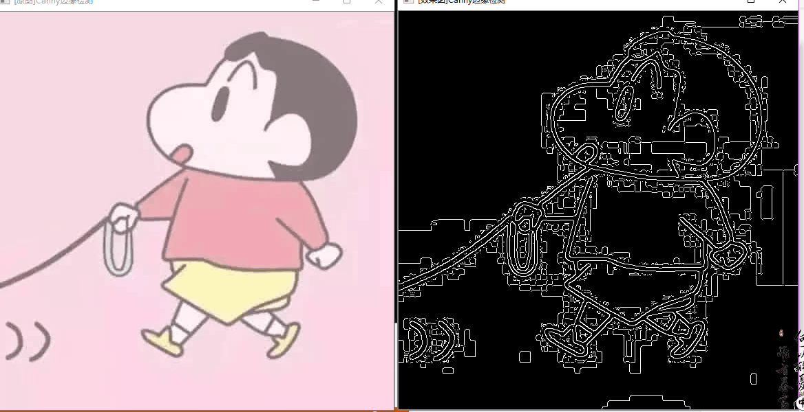

# 第二次作业  
## 快速上手OpenCV  
### 第一个程序：图像显示
只需要imread函数载入到新版本的图像存储数据Mat类中，然后用imshow函数显示即可。
打开Visual Studio,新建一个控制台项目，然后新建一个cpp文件，并在其中提交代码，之后先载入图像，然后显示图像，并且调用waitKey 函数等待按键按下，以便让图像窗口一直显示，直到有按键按下，放置一张图片。然后运行程序，就可以得到图片了。

### 第二个程序：图像腐蚀

程序首先依然是载入和显示一幅图像，然后定义一个Mat类型的变量来获得getStructuringElement函数的返回值，而getStructuringElement 函数的返回值为指定形状和尺寸的结构元素(内核矩阵)。参数准备完毕，接着便可以调用erode函数进行图像腐蚀操作，最后调用imshow函数进行显示，用waitKey函数等待按键按下，以便能让窗口一直显示。

### 第三个程序：图像模糊

主要使用进行均值滤波操作的blur函数,载入并显示原始图后，调用一次blur函数，最后显示效果图。

### 第四个程序：边缘检测

载入图像，并将其转成灰度图，再用blur函数进行图像模糊以降噪，然后用canny函数进行边缘检测，最后进行显示。

  
## 总结  
这次课主要学习了对于OpenCV的基本用法，学会了对于图像的几种基本的处理方法，学到了对于不同的结果要调用不同的函数，同时这些函数也是最基本的一些东西，也是需要我们牢牢记住的。