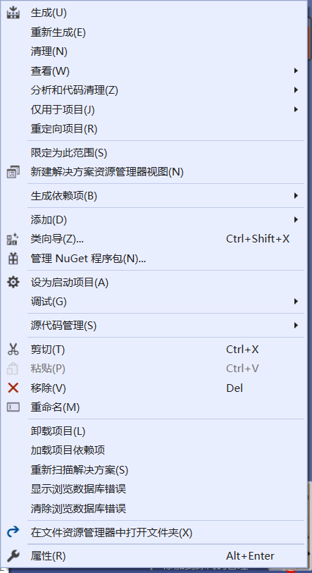
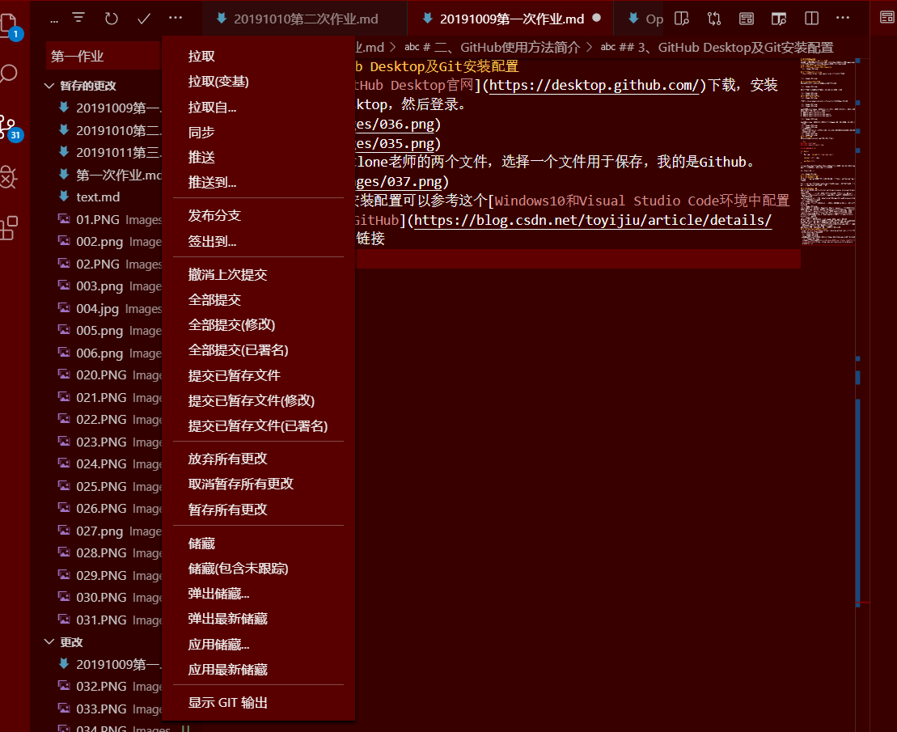

# 20191009第一次作业

本次作业我主要完成老师课上教我们如何配置OpenCV及运行测试，另外我也将介绍如何安装GitHub Desktop、如何使用GitHub Desktop，以及如何使用Git。
# 一、 OpenCV下载及安装配置过程
## 1、安装Visual Studio 2019 Community 


## 2、安装OpenCV 4.1.1版本
从[OpenCV官网](https://www.opencv.org)下载，直接安装。


## 3、配置OpenCV环境变量
在我的电脑上右键“属性”，点击“高级系统环境”。


在用户变量中，点击Path变量并编辑，添加dll所在路径。


## 4、在vs 2019中新建项目


然后右键ConsoleApplication2这个Project，选择最后一个属性。




①工程包含（include）目录的配置：打开属性目录后选择【VC++目录】→【包含目录】，在其中添加以下三个目录。如下：
D:\QQdata\opencv\build\include
D:\QQdata\opencv\build\include\opencv
D:\QQdata\opencv\build\include\opencv2


②工程库（lib）目录的配置：在属性中选择另一个库目录，点击编辑，添加lib的路径。


③链接库的配置
同样打开【属性】→【链接器】→【输入】→【附加的依赖项】依次添加文件后缀为.lib的文件的路径。


## 5、最终测试
在ConsoleApplication2.cpp中添加以下代码：

```C++
#include <iostream>
#include <opencv2/opencv.hpp>

using namespace cv;

int main()
{
    Mat img = imread("D:\\jpg\\ppp.jpg");

	imshow("图片", img);

	waitKey(1000);
}
```
我将waitKey（0）；改成了waitKey（1000）；，这样在窗口图片就能停留一段时间，如果为0的话，窗口会闪一下就退出了。

并编译执行,得到：


# 二、GitHub使用方法简介
## 1、GitHub和Git介绍
GitHub:  是一个git的服务器提供商 帮我们共享代码（托管代码，也是一个开源平台。

Git ： 只是一个源代码管理工具（管理代码的版本） 不能实现代码的共享，使用git 来操作github实现代码的共享。

## 2、GitHub术语介绍
①Watch：“观察”。有四种状态，not watching，releases only，watching，ignoring。
1）watching：关注这个项目的所有动态，只要发生变动，如被提交 pull request、被发起issue等，都会收到通知消息，还可能收到相应的邮件（如果有相关设置的话）。
2）releases only：筛选了部分watching中的通知，当有新的releases，并且参与或被提及时才会被通知。


②Star：通俗来讲，就是“点赞”或“关注”的意思。点击star后，图标文字会变成unstar。


③Fork：英文是“复刻”的意思。一般用来和pull request共同使用。常用情境是这样的：你fork一个你觉得还可以改进的repository，改动后，想原repository的拥有者发起pull request，如果对方通过你的request，你修改的部分和原repository将进行merge（合并），你将对这个repository做出了贡献。
④Clone：通常出现在“clone or download”按钮，作用是将repository或者project下载到本地。


⑤Branch：分支与主线分离出来，做进一步开发时不影响到主线。
GitHub仓库默认有一个master的主分支，当在开发过程中遇到一个新的需求时，可以新建一个分支同步开发，开发完成后，再合并merge到主分支上。
⑥Commit：对repository或者project等做出修改后，都要commit。就是提交的意思。可以在commits中查看提交的历史版本。
⑦Releases：“发布”。运送项目给关注你的用户的方式。
## 3、GitHub Desktop及Git安装配置
 （1）从[GitHub Desktop官网](https://desktop.github.com/)下载，安装GitHub Desktop，然后登录。

 

 

 登录完成后Clone老师的两个文件，选择一个文件用于保存，我的是Github。
  
  （2）Git安装配置可以参考这个[Windows10和Visual Studio Code环境中配置使用Git和GitHub](https://blog.csdn.net/toyijiu/article/details/87828373)链接。
安装成功后就有如下的界面。

  
  
  # 三、总结
在这次课上，我学到了很多新的知识。比如GitHub这个代码管理平台的使用及其客户端的安装及使用，还有Git的安装和配置等相关问题。这些虽然不像课本上的知识一样是固定的知识，但是这是学习这门课的前提和基础。当安装好vs和opencv进行测试运行，出现测试出现图片时，我觉得非常的开心。虽然在配置的过程中，我遇到了一些错误，导致一直未出现图片，但是到后来，我发现是vs中的语法错误，图片的位置要使用绝对路径。在GitHub中我也学到一些如何进行代码管理的方法，如何Clone别的文件，以及如何使用Git进行项目的推送。

这次课开阔了我的视野，我认识到了一个新的课程，通过这次的学习我更加对这次课感兴趣，在以后的学习中我将努力学习这门课，让自己能够真正认识和学到这门课。