RobortVision
----

# 第一次课的总结

机器人视觉感知的基础，主要内容是在visual Studio IDE上，利用开源软件opencv3来做图像处理。我们本学期学习的课程主要是围绕车载信息处理--环境感知来完成的。其中数字图像处理这块儿我们采用OpenCV工程实践来学习，后期如果条件允许，我们将采用openmv来在开发板上进行实践。

## 一、环境感知行业发展
龚老师着重讲解了近几年配合无人驾驶技术的发展，环境感知行业也在取得长足的进步。我尤其感兴趣的在于目前搭载在一般的无人驾驶汽车上的视觉感知设备。具体采取哪些组合搭配来实现无人驾驶的环境感知功能，以及各种感知设备的长处和短板在于哪儿。

                   环境感知设备长处比较
|  激光雷达  |  毫米波雷达 | 超声波雷达 | 摄像头 |
|  -------  |  --------- | --------- |--------| 
| 探测距离远 | 成本比较低  | 成本低    | 成本低  |
| 探测角度宽 | 探测距离远  |夜间适应性强| 探测距离一般|
| 分辨率较高 | 分辨率高    | 探测角度宽 | 分辨率高|
|夜间适应性强| 误报率低    |           |误报率一般|
|温度适应性强|温度适应性强 |           |温度适应性强|
|误报率低  | 夜间适应性强 |           |物体识别率高|
|          | 天气影响低  |            |易于安装   |

                   环境感知设备缺点比较 
|  激光雷达  |  毫米波雷达 | 超声波雷达 | 摄像头 |
|   ------  | ---------- | ---------  | ------ |
|易受天气影响|探测角度窄|探测距离近|探测角度较窄|
|成本高昂|物体识别率低|误报率高|夜间适应性差|
|温度适应性差||温度适应性差|夜间适应性差|
|体积较大||易受天气影响|易受天气影响|
|||物体识别率低||

由此可见，并没有哪一种单一设备可以独立完成所有场景下的任务，更多的汽车厂商将会采用更加综合、全面的设备组合方案来打造自己的无人驾驶汽车。当然也会受限制于环境感知设备的成本考量，当成本过高时，量产肯定就不现实。而如何在现有设备、现有技术下进行整合而达到一个平衡成为了各大汽车厂商现如今的一大课题。

## 二、现阶段领跑感知环境行业的硬件商
1.Velodyne

1983年成立于硅谷，Velodyne最早以音响业务起家，随后业务拓展至激光雷达等领域。
2016年8月，Velodyne公司发布公告称，旗下激光雷达公司Velodyne LiDAR获得百度与福特公司1.5亿美元的共同投资，三方将围绕无人驾驶领域展开全方位合作。
2016年Velodyne将核心业务激光雷达部门剥离，成立新公司Velodyne LiDAR。该公司开发的LiDAR传感器被谷歌等涉及自动驾驶的公司广泛使用。

2.ibeo
德国汽车传感器与激光雷达生产商，利用光距测定和基于飞行时间方法，以运行时间和光速来确定距离。Ibeo已经联合国内合作伙伴欧百拓,开启了本地算法的研发工作。

3.Quanergy
Quanergy成立于2012年，总部位于美国加州，是一家开发小型固态廉价 LiDAR 传感器的公司。Quanergy提供的LiDAR传感器和软件能够实时捕捉和处理高清3D地图数据，并对物体进行检测、跟踪和分类，其应用领域包括交通运输、安全、地图勘测和工业自动化。

## 三、无人驾驶技术三大课题：
1.Perception(感知)=人类感知+机器感知

2.Planning(规划)=人类规划+计算机规划

3.Decision(决策)=人类决策+机器决策

## 四、无人驾驶技术等级划分(Level1-5):
Level1:无自动化，人类操纵，可以得到一些警示和辅助信息

Level2:辅助驾驶，利用环境感知对转向或纵向进行减速等操作， 其余还是人类完成

Level3:部分自动化，利用环境感知对转向和纵向同时减速等控制，其余还是人类完成

Level4:conditional Auto，有条件自动，自动驾驶系统可完成所有驾驶，人类可以根据系统进行操纵

Level5:高度自动化，自动驾驶完成所有驾驶，无需人类干预，但需限定道路和功能

## 五、OpenCV3的安装配置
### 配置流程
1.安装visual studio2019 community
<https://visualstudio.microsoft.com/>

安装完成后进入，

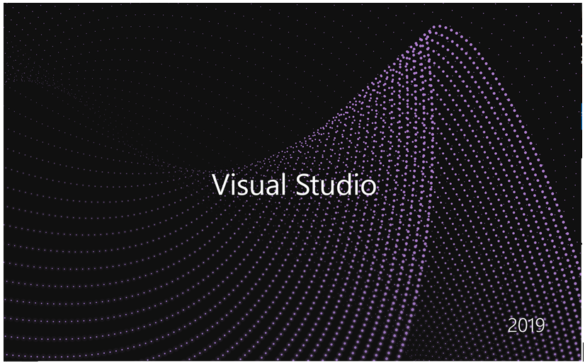

2.下载安装OpenCV环境，

从<www.opencv.org>下载即可

3.安装配置OpenCV3环境变量
在我的电脑上右键“属性”，点击“高级系统环境”。

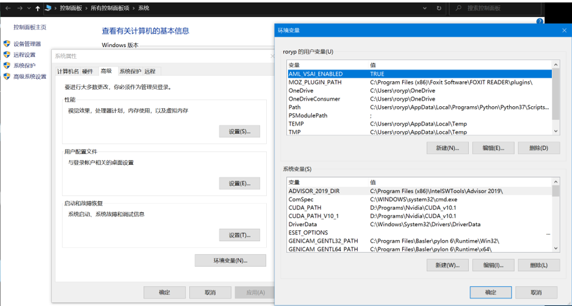
在用户变量中，点击Path变量并编辑，添加dll所在路径

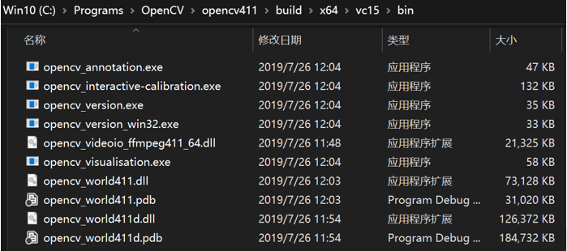

确定后，并重启以使得环境变量生效。

4.在vs2019中新建项目
选择路径“File->New->Project”：
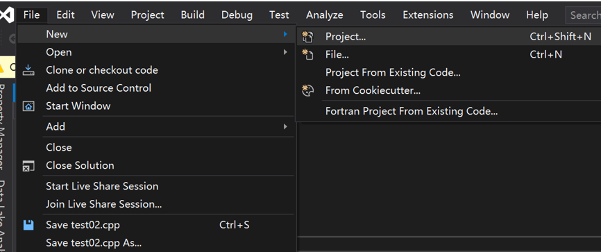

依次选择Language为C++，
Platform为Windows，Project type为desktop.

选择Windows Desktop Wizard，并选择Next,
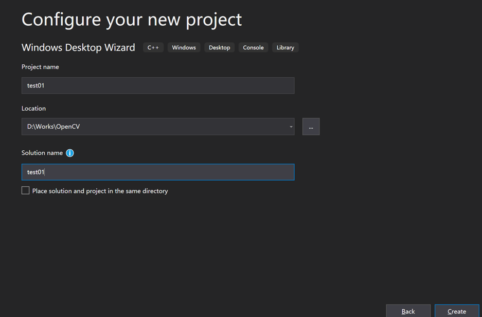
点击Create,并下弹出的对话框中选择，Application type 为Console, 选择Empty Project,
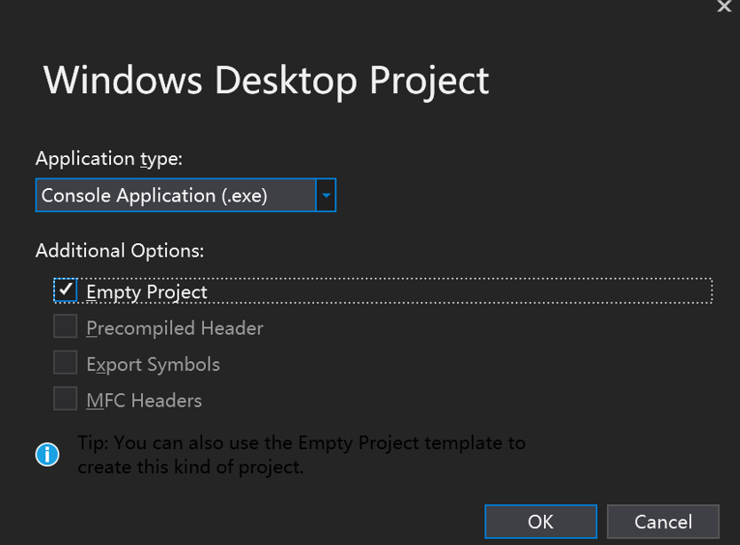
点击OK，在Source files里面右键，添加New item:

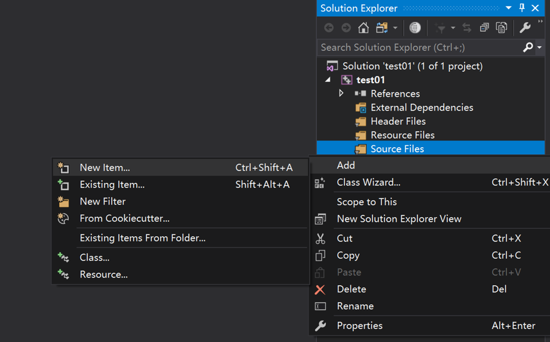
添加test01.cpp源文件。

右键test01这个Project,选择Properties:
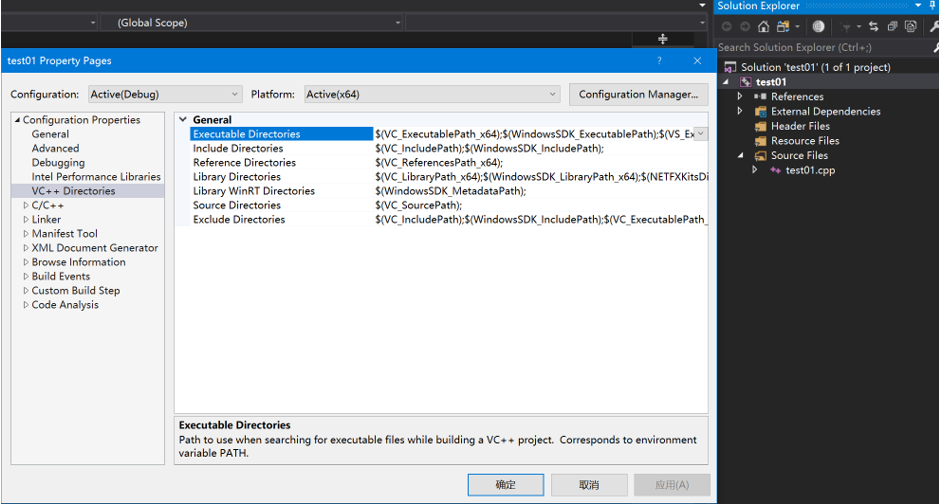

选择VC++ Directories，在Include Directories中，

添加C:\Programs\OpenCV\opencv411\build\include和C:\Programs\OpenCV\opencv411\build\include\opencv2这两个目录。
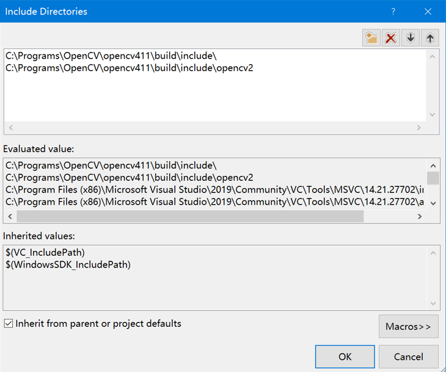
在Library Directories中添加C:\Programs\OpenCV\opencv411\build\x64\vc15\lib：
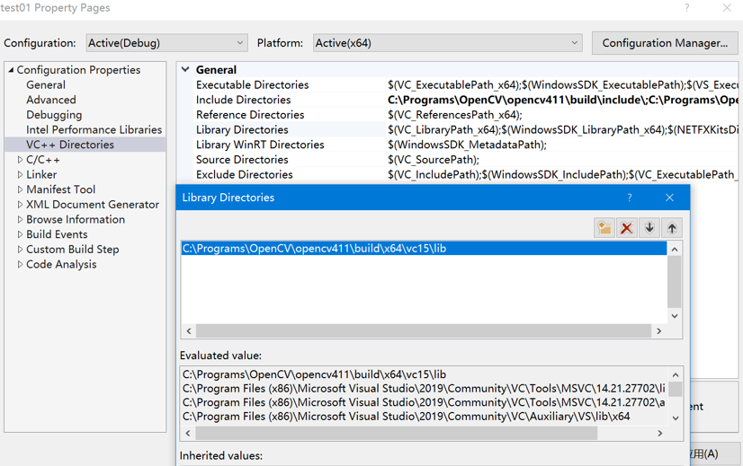
在Linker->Input目录下，点击Additional Dependencies并添加opencv_world411d.lib静态库：
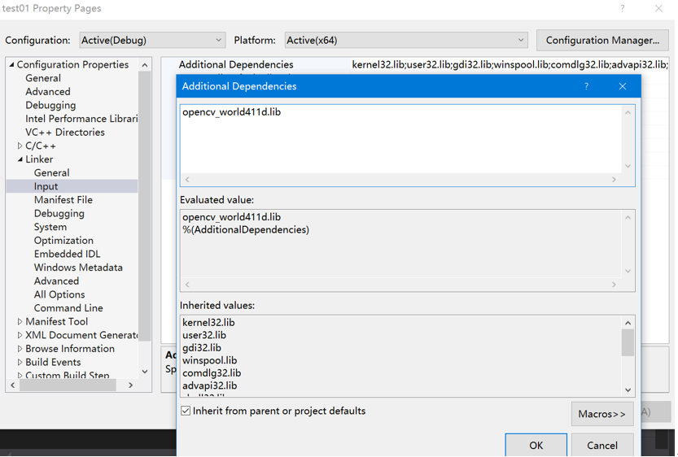
点击OK并确定退出。

经历以上步骤，OpenCV的环境就配好了。

下面紧接着需要用测试代码来检测OpenCV安装是否成功。

5.测试OpenCV代码
在test01.cpp中添加以下代码：

    #include <iostream>
    #include <opencv2/opencv.hpp>

    using namespace cv;

    int main()
    {
	    Mat img = imread("D:\\Works\\Data\\Bear\\001.jpg");

	    imshow("test01", img);

	    waitKey(0);
    }

并编译执行,得到：

