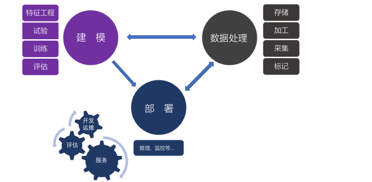
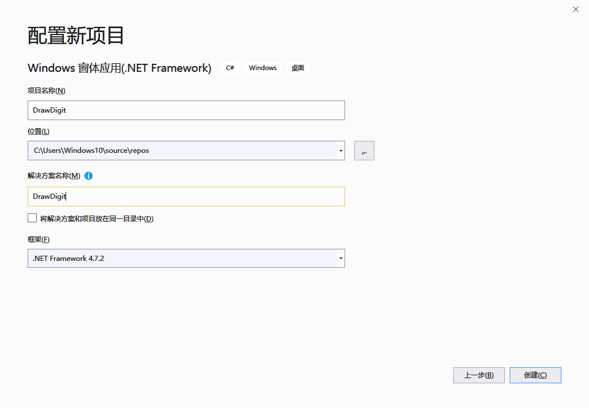
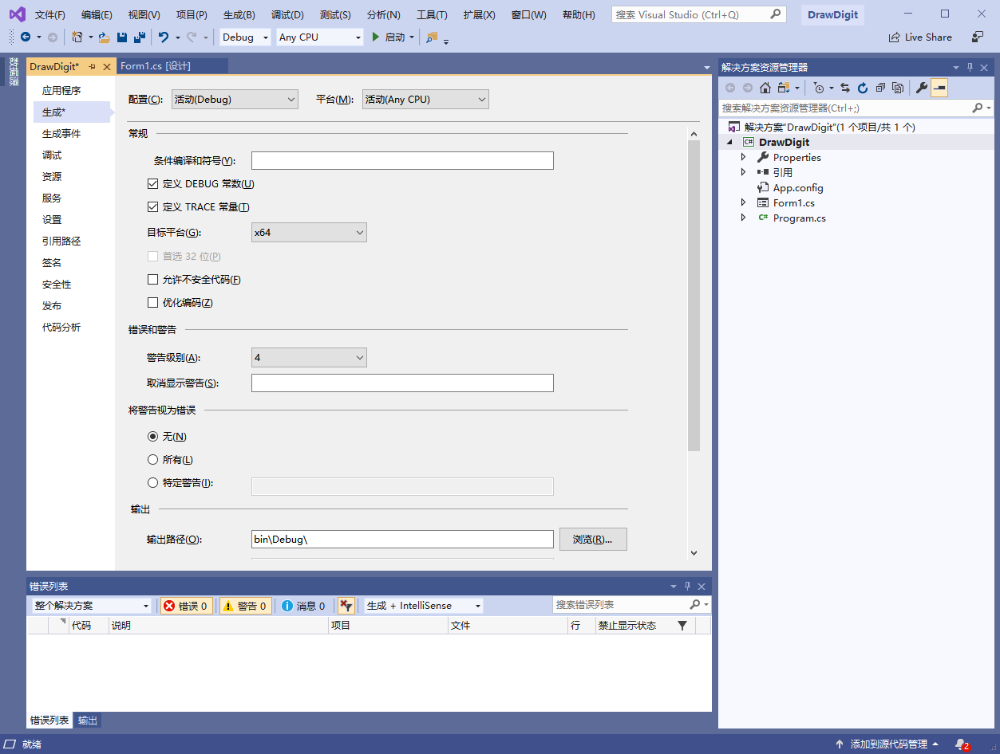
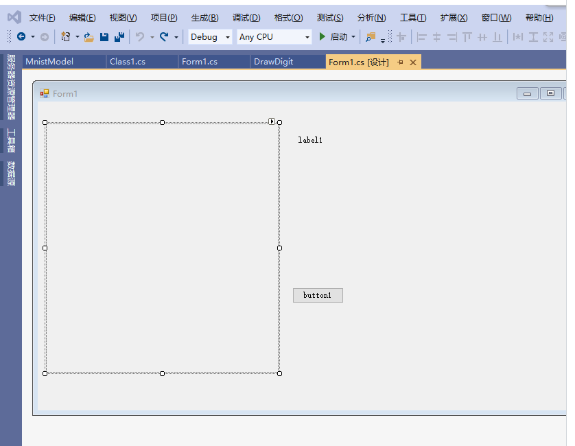
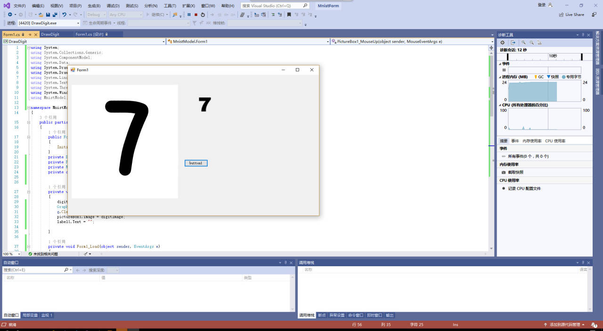

# 第五次作业
本次课学习人工智能AI，机器学习平台建设还有基于MNIST数据集的手写数字识别
## 一.人工智能
人工智能（Artificial Intelligence），英文缩写为AI。它是研究、开发用于模拟、延伸和扩展人的智能的理论、方法、技术及应用系统的一门新的技术科学。
人工智能是计算机科学的一个分支，它企图了解智能的实质，并生产出一种新的能以人类智能相似的方式做出反应的智能机器，该领域的研究包括机器人、语言识别、图像识别、自然语言处理和专家系统等。人工智能从诞生以来，理论和技术日益成熟，应用领域也不断扩大，可以设想，未来人工智能带来的科技产品，将会是人类智慧的“容器”。人工智能可以对人的意识、思维的信息过程的模拟。人工智能不是人的智能，但能像人那样思考、也可能超过人的智能。
## 二.机器学习平台建设
### 1.背景
随着大数据技术的日趋成熟，很多互联网企业都积累了海量的数据资产。如何利用这些数据，充分发掘其价值逐渐成为各个公司亟待解决的新难题。其中机器学习已经被业界证明是十分有用的数据分析与挖掘手段。学术界对机器学习方向的研究已经持续数十年，很多算法已比较成熟。虽然不停有新的改进，但对企业而言不是最重要的。企业级应用最大的障碍在于如何将其平台化和围绕平台化所做的相关工作。因为如果每个使用机器学习的业务都走一整套完整的机器学习流程的话，开发和维护成本是相当高昂的。平台化就是将机器学习系统做成更加通用的、简单易用的平台，相关业务可以很容易接入该平台，从而利用机器学习的手段解决业务问题。
### 2.概述
下图是较简化的机器学习平台架构，概括了机器学习平台的主要功能和流程。本章会进行简要介绍，在功能章节再展开详述。机器学习最主要的三个步骤可概括为：数据处理、建模以及部署。

1. 数据处理：指所有和数据相关的工作，包括存储、加工、采集和标记几大主要功能。将数据在不同的数据源间导入导出，并对数据进行聚合、变形、清洗等操作。
2. 建模：即创建模型的过程，包括特征工程、试验、训练及评估模型。特征工程，即通过数据科学家（也称为算法工程师）的知识来挖掘出数据更多的特征，将数据进行相应的转换后，作为模型的输入。
3. 部署：是将模型部署到生产环境中进行推理应用，真正发挥模型的价值。部署这个词本身，可以仅仅代表将模型拷贝到生产环境中。
### 3.功能
机器学习平台上最重要的三个功能为：数据处理、建模、部署（也可称为推理）。
## 三.手写数字识别
使用Visual Studio Tools for AI快速集成模型、加速人工智能应用开发，以及在代码中处理用户输入，以便人工智能模型能正确地接受输入的数据

步骤：
1. 创建模型项目:打开Visual Studio，选择文件->新建->项目.
  
2. 选择属性，在生成一栏将平台目标从Any CPU改为x64
 
3. 修改窗口  
PictureBox：用来手写数字，并且把数字保存成图片；
Label：用来显示模型的识别结果，可以调整一下label控件大小、字体等，让它更美观；
Button：用来清理PictureBox的手写结果。
修改窗口结果：
 
5. 添加事件
在属性窗口，我们选择某个组件，右键->查看属性，点击闪电符号，给组件绑定对应的事件。每次绑定后，会跳到代码部分，生成一个空函数。点回设计视图继续操作即可。
 
6. 程序调试
 
## 总结
通过本次学习，我初步了解到人工智能AI还有机器学习平台建设，还有如何用VS手写数字识别。AI对于现在社会发展至关重要，人工智能的定义可以分为两部分，即“人工”和“智能”。人工智能在计算机领域内，得到了愈加广泛的重视。并在机器人，经济政治决策，控制系统，仿真系统中得到应用。机器社会平台对于社会各个企业发展有着重要关系，机器学习不仅需要数据科学家研发新模型，软件工程师应用新模型，还需要软件工程师和运维工程师来建设机器学习平台。在应用机器学习的企业和团队中，建设机器学习平台是重要的一环。手写识别，能够让模型正确接受输入的数据等等。本次学习收获很多，学到了不少知识，并且也通过老师讲解了解人工智能的伦理知识，对于以后人工智能的发展有了相对的了解。