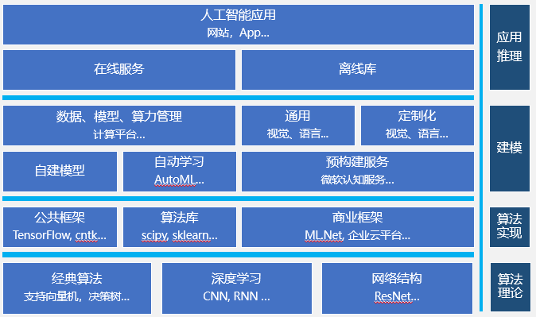
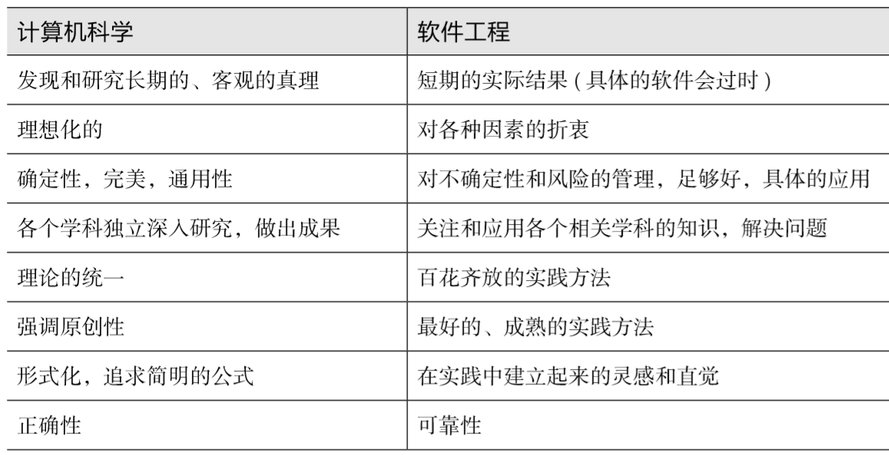

# 学习总结
  今天我学习了有关人工智能领域的一些基础知识和一些关于人工智能发展历程
  # 人工智能发展历程
   
   人工智能经历很多起起伏伏，其中有两个AI 的冬天，我们从中学到什么规律呢？AI 的冬天来自于认识和期望值的巨大落差，外行对AI的效果有巨大的期望值，内行则挣扎于各种具体困难中。 正如Roy Amara 指出的那样，“我们总是高估一项科技所带来的短期效益，却又低估它的长期影响”。经过几十年积累下来的AI 技术，在计算机算力提高，数据大量丰富的背景下，终于找到了爆发的突破口，神经网络和反向传播这些“旧”技术重新找到了用武之地，在过去的10年中不断给我们带来惊喜。这些惊喜又导致了巨大的期望值。

# 人工智能的范围和难题
  当人们谈到人工智能时，我们大致上把人工智能定义分为弱人工智能和强人工智能

  弱人工智能：

  处理特定的问题，并不具有人类的感知能力。前两年名噪一时的AlphaGo 程序并不知道自己在下 “围棋”，它只是忙着处理矩阵运算…
  弱人工智能包括了包含机器学习（Machine Learning)， 机器学习又包括了深度学习（Deep Learning）

 强人工智能：

 是具备与人类同等智慧、或超越人类的人工智能，能表现正常人类所具有的所有智能行为。

 它们之间的关系可以用此图表示
 
 弱AI领域之间有各种层次
#  AI，计算机科学和软件工程
 很多人说AI 应该脱离计算机科学和软件工程， 成为一门独立的学科，那么，我们可以看看计算机科学和软件工程的关系， 从 2002年开始，中国有30多所示范性软件学院开始创立，他们的毕业生也是学习算法，数据结构，好像和传统的计算机系的学生学习的科目没有什么不同，那么他们有什么区别呢？
 下表总结了二者一些明显的区别：
 上表看出，软件工程和计算机科学研究的侧重点的确不一样， 所以，它成为一个独立的学科是有道理的。 那么人工智能学科呢？
如果我们用逻辑来表示智能，那么人工智能就是逻辑学的应用；如果我们走仿人类的方向，那么我们的理论基础并不明确，除了数学和统计学的那些基础之外；如果我们走的是智慧基础设施（Intelligent Infrastructure）和智慧增强（Intelligence Augmentation）的道路，那么，人工智能就是一个复杂的工程学和系统科学的新分支。
我们看目前在“AI”领域的人，他们大致分为几个方向：
做AI的理论研究，在某个细分领域做算法或模型的研究
做AI的应用，基于某个理论的突破，在某个实际环境中解决实际问题，这也是“智慧增强”的一个表现，例如，让语音识别更加准确，让搜索更加准确。
做智慧基础设施的工程，例如智能城市，物联网，智能仓储，等。
做AI 系统本身的研究，让AI （特别是目前的Deep Learning 系统）跑得又快又节约资源。

# 基于本地模型的手写数字识别应用开发案例
  

# 总结和体会
  今天我学习到了人工智能的发展历史，人工智能能分为弱人工智能和强人工智能，弱人工智能不具备人类的感知能力而强人工智能具备与人类同等智慧或超越人类的智慧，并且能够表现正常人类所具有的智能行为， 以及AI和计算机科学和软件工程的学科之间的差异和关系，人工智能是一门边沿学科，属于自然科学、社会科学、技术科学三向交叉学科。涉及学科哲学和认知科学，数学，神经生理学，心理学，计算机科学，信息论，控制论，不定性论，仿生学，社会结构学与科学发展观，通过学习今天的课程，我还做了一个 基于本地模型的手写数字识别应用开发案例并且成功的运行，这极大增加我学习这门的兴趣。

