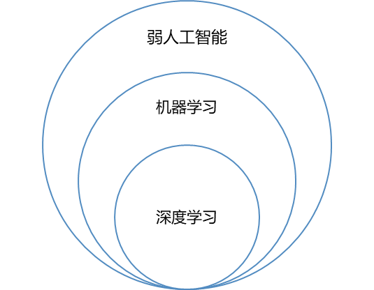

# 一、云服务
        云服务是基于互联网的相关服务的增加、使用和交互模式，通常涉及通过互联网来提供动态易扩展且经常是虚拟化的资源。云是网络、互联网的一种比喻说法。云服务指通过网络以按需、易扩展的方式获得所需服务。
# 二、机器学习平台建设
机器学习最主要的三个步骤可概括为：数据处理、建模以及部署。

# 三、人工智能发展史
## 1、介绍
        人工智能（Artificial Intelligence），英文缩写为AI。它是研究、开发用于模拟、延伸和扩展人的智能的理论、方法、技术及应用系统的一门新的技术科学。人工智能是计算机科学的一个分支，它企图了解智能的实质，并生产出一种新的能以人类智能相似的方式做出反应的智能机器，该领域的研究包括机器人、语言识别、图像识别、自然语言处理和专家系统等。
## 2、人工智能的范围和难题
弱人工智能：

处理特定的问题，并不具有人类的感知能力。前两年名噪一时的AlphaGo 程序并不知道自己在下 “围棋”，它只是忙着处理矩阵运算…弱人工智能包括了包含机器学习（Machine Learning)， 机器学习又包括了深度学习（Deep Learning）

强人工智能：

是具备与人类同等智慧、或超越人类的人工智能，能表现正常人类所具有的所有智能行为。

# 四、基于MNIST数据集的手写数字识别应用开发案例

# 五、总结
        通过这节课的学习，我对人工智能有了一定的感性认识，人工智能是一门极富挑战性的科学，是包括十分广泛的科学，它由不同的领域组成，如机器学习，计算机视觉等等，总的来说，人工智能研究的各个主要目标是使机器能够胜任一些通常需要人类智能才能完成的复杂工作。