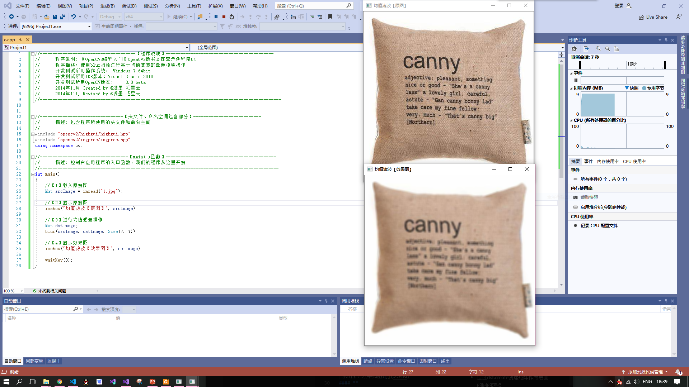

# 总结

## **第一次课堂总结**

>#### OPENCV的安装与环境配置

* 1配置OpenCV环境变量
* 在vs 2019中新建项目并添加.cpp
* 在属性中更改包含目录，库目录和输入中的相应路径
* 在C盘 **SYSTEMWOW64** 和 **SYSTEM31** 中相应的添加.dll文件为系统使用
* 最终配置如图
* 执行测试程序，得到结果程序通过imread（）根据图像中存在的颜色通道数返回2D或3D矩阵再通过imshow显示出来

> #### Github使用方法

* *创建一个新的仓库*  
1、在页面的最右上角，你的头像的左边，点击“＋”，在弹出的下拉选项中选择**“New repository”**。 在仓库名称输入框中输入你的仓库名称：“hello-world”。  
3、写一个简短的描述  

* *做出修改并提交：*  
1、点击“README.md”文件，切换到“README.md”内容页面  
2、点击编辑框右上角的铅笔按钮，进入编辑界面  
3、在 Edit file 标签上，输入一些关于你自己的信息

* *提出更改别人的项目*  
使用** forks** 提出改变的一个很好的例子是漏洞修复。与其记录一个你发现的问题，比如：  
1.Fork 这个仓库  
2.进行修复  
3.向这个项目的拥有者提交一个** pull requset**

如果这个项目的拥有者认同你的成果，他们可能会将你的修复更新到原始的仓库中！
  #
## **第二次课堂总结**

>#### 用户OPENCV实现一些简单的图像识别和变化
#### *图像腐蚀*  
*  通过MAT，immread载入图片
*  用 **getStructuringElement** 进行腐蚀
*  将原图和经处理后的图片一起用**imshow**显示出来，效果如图
#### *图像模糊*
* 同前一个实验一样，通过imshow载入原图
* 调用blur函数进行均值滤波操作将原图转换为模糊图像，效果如图  

#### *边缘检测*  
 * 同前几个项目一样，通过imshow显示原图
 * 通过**dst.create**创建矩阵作为后面的图的转换 
 * cv2默认为BGR顺序，而其他软件一般使用RGB，所以需要转换进而通过**grayimage**方法将图片转换为灰度图像
 * 然后用3*3内核来降噪
 * Canny边缘检测算子是一种多级检测算法,运用Canny算子进行边缘算法的检测  
  【第一步】 消除噪声  
  【第二步】 计算梯度幅值和方向  
  【第三步】 非极大值抑制  
  【第四步】 滞后阈值 
* 最后通过imshow将原图和效果图显示出来，效果如图
#
## **第三次课堂总结**
>### 图像处理部分

#### **线性滤波**
* 方框滤波
* 均值滤波
* 高值滤波
* 中值滤波
* 双边滤波
#### **膨胀腐蚀**
形态学操作是基于形状的一系列图像处理操作。OPENCV为进行图像的形态学变换提供了快捷的函数。最基本的形态操作有两种，膨胀和腐蚀
* 获取自定义核并通过imshow显示原图
* 创建轨迹图，通过拖动滑动条来改变膨胀和腐蚀的效果
* 调用一个名为**on_TrackbarNumChange()**的函数和**on_ElementSizeChange()**的函数分别用作开关的开关和内核的回调函数
* 效果如图
  
#### **漫水填充**
* 通过cvtcloor留一份原图的灰度图
* 创建窗口显示原图
* 创建滑动条**(createTrackbar)**控制阈值，以此切换模式
* 初始化阈值回调函数并调用此函数
* 最后更新效果图并显示，效果图如下

>### **core组建进阶**
访问图像中的像素图像矩阵的大小取决于所用的颜色模型，如果是灰度图像，矩阵如图

**感兴趣区域ROI**

在图像处理中,我们常常需要设置感兴趣区域(**ROI,region of interest**),来专注或者简化工作过程.也就是从图像中选择一个图像区域,这个区域是图像分析所关注的重点。我们圈定这个区域,以便进行进一步处理.而且,使用ROI指定想读入的目标,可以减少处理时间,增加精度,给图像处理带来不小的便利

　　在Ｃ++中定义ROI区域有三种方法:

1---使用表示矩形的**Rect  **
2---使用**range ** 
3--OpemCv1.中的**setImageROI()**函数

#### **ROI图像叠加&图像混合**
* 使用immread方法读入原图片，本体和logo
* 定义一个MAT并为其设定ROI区域，为之后叠加做准备
* 加载掩模也就是logo图
* 将logo图复制到创建的ROI区域内
* 将结果图用imshow显示出来，结果如图

> #### **总结：**

* 对于这三次课，对OPENCV开源库有了更加深入的了解，对图像识别也有了基本的认识
* 有了开源库的支持，我们能更加容易的使用来做自己的项目
* 今后还要继续加强对RobotVISION方面的了解与学习