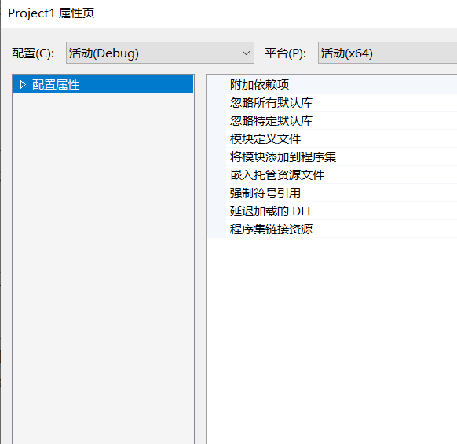
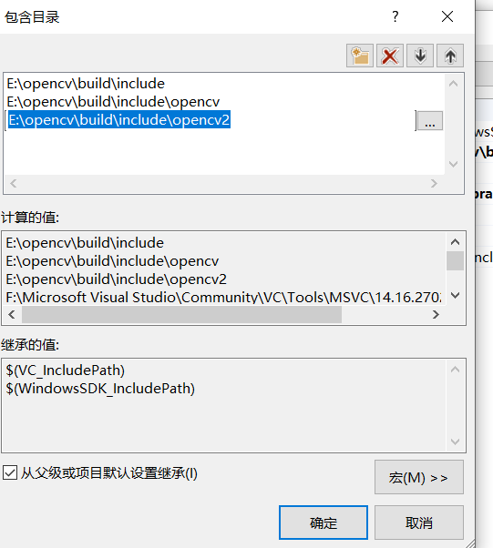
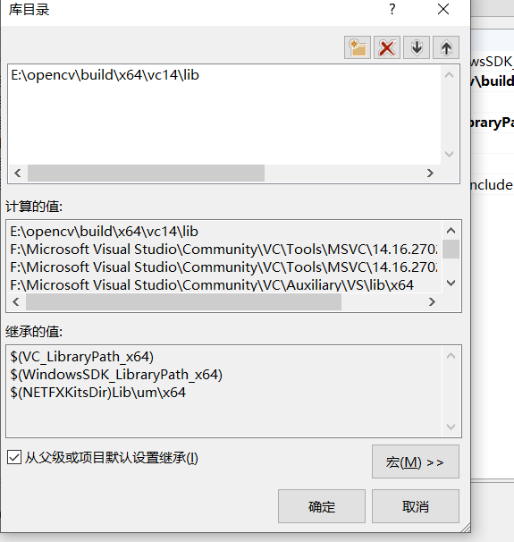
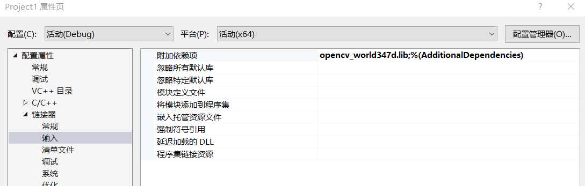

# opencv配置
## opencv 下载与配置
1. 下载opencv
   >可在[opencv](https://opencv.org/)官网下载
   >>
2. windows opencv环境配置
   **如图**： 
---------------
## vs 的opencv 配置
1. 首先建立工程
2. 在工程属性下面进行设置 `将平台调为x64`
3. 配置属性->vc++目录->**包含目录** 编辑添加 
4. **库目录编辑** 
5. **最后**