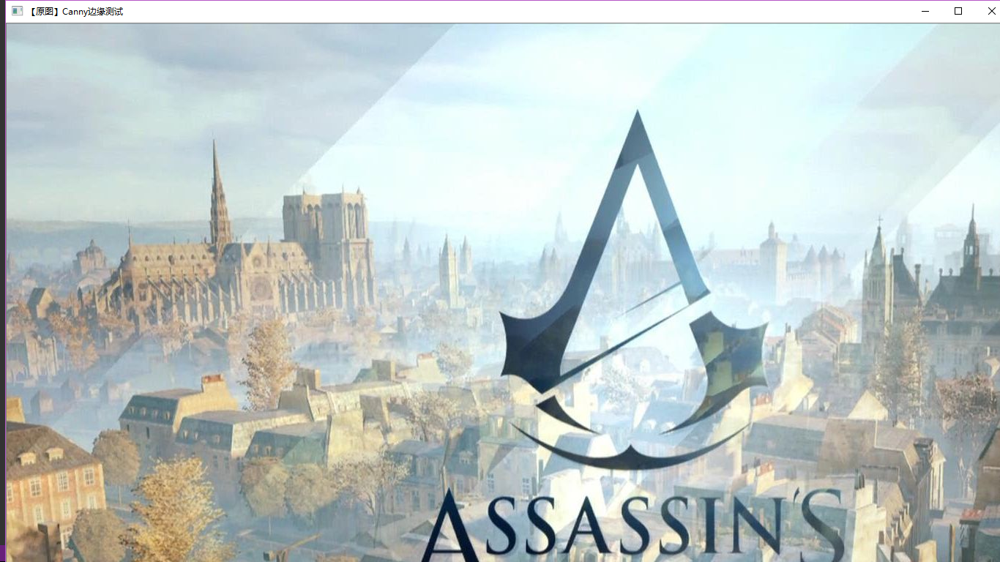
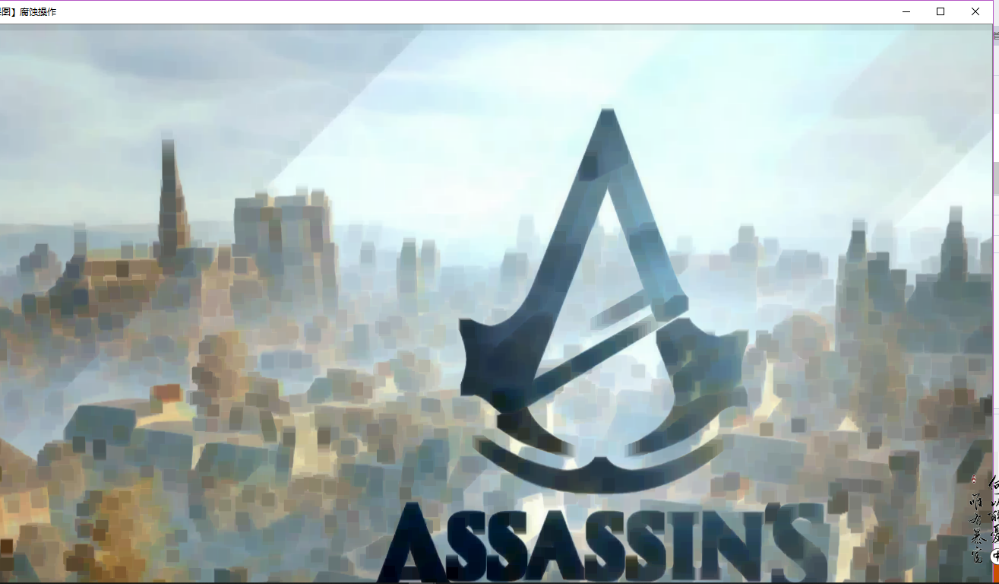
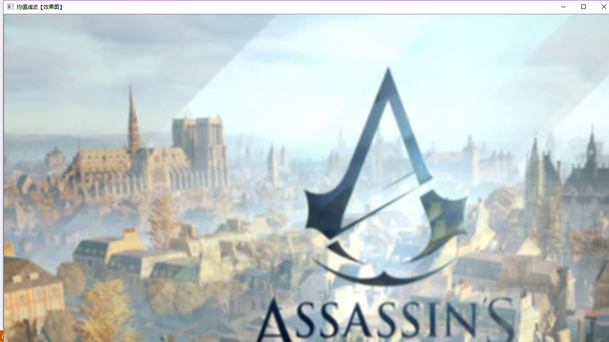
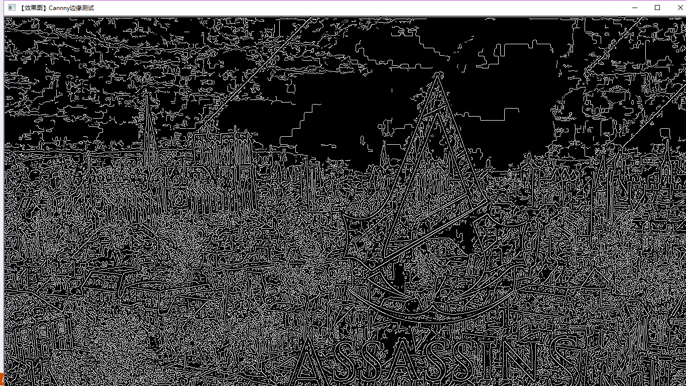

>>>>>>>>> # 第二次作业
#### 由于第一次的配置环境花费了太多时间，在第二次上课的时候，进行了图片腐蚀、模糊、边缘测试和GitHub的注册。
* 进行图片腐蚀。erode这个函数是腐蚀的作用。在写腐蚀函数的时   候要用erode和getStructuringElement函数，这个函数会返会    指定形状和尺寸的结构元素。
* 第一个参数表示内核的形状，有三种   可以选择矩形（MORPH_RECT）、交叉形（MORPH_CROSS）和椭圆    形（MORPH_ELLIPSE）。
* 第二和第三个参数分别是内核的尺寸以    及锚点的位置。一般在调用erode函数之前，先定义一个Mat类型    的变量来获得getStructuringElement函数的返回值。对于锚点    的位置，有默认值Point（-1,-1），表示锚点位于中心点。     
  #### #include <opencv2/highgui/highgui.hpp>
  #### #include <opencv2/imgproc/imgproc.hpp>

    using namespace cv;

    int main()
    {
  	  Mat img = imread("C:\\Users\\e.jpg");
	  imshow("【原图腐蚀】操作", img);
	  Mat element = getStructuringElement(MORPH_RECT, Size(15, 15));
	  Mat dstImage;
	  erode(img, dstImage, element);
	  imshow("【效果图】腐蚀操作",dstImage);
	  waitKey(0);
	  return 0;
    }
  
  
* 进行图片模糊。在图片模糊的代码中，运用blur函数。blur的作用是对输入的图像src进行均值滤波后用dst输出。
* 第一个参数，，输入图像，即源图像，填写显示原图像的函数，填Mat类的对象即可,。
* 第二个参数，目标图像，就是均值滤波之后的函数，经过处理的图片显示。
* 第三个参数，Size类型。内核的大小。这样写Size( w,h )来表示内核的大小( 其中，w 为像素宽度， h为像素高度)。
#### #include <opencv2/highgui/highgui.hpp>
#### #include <opencv2/imgproc/imgproc.hpp>

    using namespace cv;

    int main()
    {
      Mat img = imread("C:\\Users\\e.jpg");
      imshow("均值滤波【原图】", img);
      Mat dstImage;
      blur(img,dstImage,Size(7,7));
      imshow("均值滤波【效果图】",dstImage);
      waitKey(0);
      return 0;
    }

* 进行边缘测试。Canny函数进行边缘测试。
* 灰度转换 - cvtColor()函数
* 
#### #include <opencv2/opencv.hpp>
#### #include <opencv2/imgproc/imgproc.hpp>

    using namespace cv;

    int main()
    {
	  Mat img = imread("C:\\Users\\e.jpg");
	  imshow("【原图】Canny边缘测试", img);
	  Mat dstImage,edge,grayImage;
	  dstImage.create(img.size(), img.type());
	  cvtColor(img,grayImage,COLOR_BGR2GRAY);
	  blur(grayImage, edge, Size(3, 3));
	  Canny(edge,edge,3,9,3 );
	  imshow("【效果图】Cannny边缘测试",edge);
	  waitKey(0);
	  return 0;
    }

* GitHub
  

