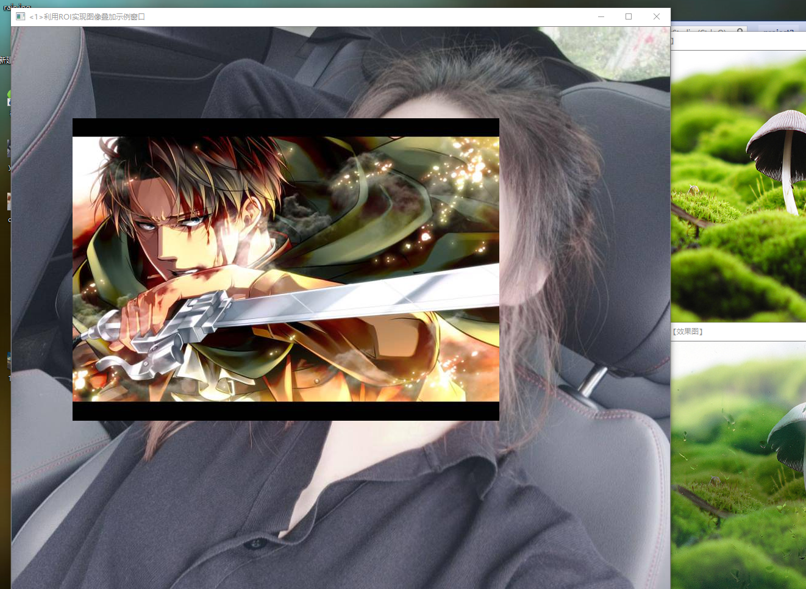
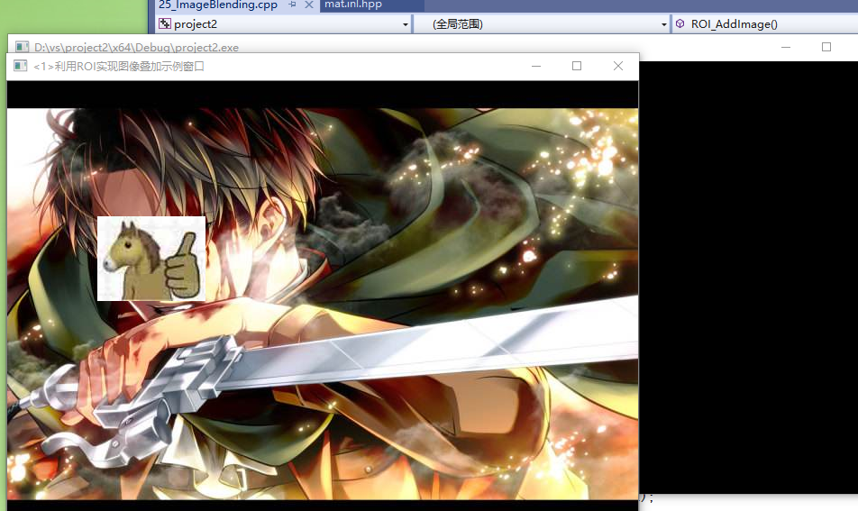

学习总结：
1. 今天我们继续学习图像的深度处理 ，利用opencv来进行对各种图像处理（如图像混合，离散傅里叶变换，线性滤波，腐蚀和膨胀，形态学图像处理，floodFill函数处理，漫水填充处理。
2. 对图像的处理经过第一节的课上的学习和探索 ，其实对图像的处理已经有了深入的了解 基本上处理的步骤都一样 只是利用的函数算法处理不同，总体上都是大同小异
3. 图像混和：

4. 离散傅里叶变换:

5. 线性滤波:

6. 腐蚀和膨胀:

7. 漫水填充处理:

8. floodFill函数处理:

以上都是对图像的不同处理结果的效果显示图；
利用opencv来对图像进行处理原理都一样，代码不一样，对代码进行分析，修改用vs 来运行处理
以腐蚀膨胀为例
消除噪声
分割(isolate)出独立的图像元素，在图像中连接(join)相邻的元素。
寻找图像中的明显的极大值区域或极小值区域
梯度用于对比膨胀与腐蚀运算的“浅墨”字样毛笔字原图：
在进行腐蚀和膨胀的讲解之前，首先需要注意，腐蚀和膨胀是对白色部分（高亮部分）而言的，不是黑色部分。膨胀就是图像中的高亮部分进行膨胀，“领域扩张”，效果图拥有比原图更大的高亮区域。腐蚀就是原图中的高亮部分被腐蚀，“领域被蚕食”，效果图拥有比原图更小的高亮区域。
注意所用图片的大小和尺寸不然在运行时会出现错误(图像的混合处理)
201702062 任文博