# Step8

## 卷积神经网络

 卷积神经网络（CNN，Convolutional Neural Net)是神经网络的类型之一，在图像识别和分类领域中取得了非常好的效果，比如识别人脸、物体、交通标识等，这就为机器人、自动驾驶等应用提供了坚实的技术基础。

例如：


图17-1 识别出四个人在一条船上

|

图17-2 识别出一个农场中的车、狗、马、人等物体

## 卷积神经网络的典型结构

一个典型的卷积神经网络的结构如图所示。


卷积神经网络的典型结构图

层级结构：

1. 原始的输入是一张图片，可以是彩色的，也可以是灰度的或黑白的。这里假设是只有一个通道的图片，目的是识别0~9的手写体数字；
2. 第一层卷积，我们使用了4个卷积核，得到了4张feature map；激活函数层没有单独画出来，这里我们紧接着卷积操作使用了Relu激活函数；
3. 第二层是池化，使用了Max Pooling方式，把图片的高宽各缩小一倍，但仍然是4个feature map；
4. 第三层卷积，我们使用了4x6个卷积核，其中4对应着输入通道，6对应着输出通道，从而得到了6张feature map，当然也使用了Relu激活函数；
5. 第四层再次做一次池化，现在得到的图片尺寸只是原始尺寸的四分之一左右；
6. 第五层把第四层的6个图片展平成一维，成为一个fully connected层；
7. 第六层再接一个小一些的fully connected层；
8. 最后接一个softmax函数，判别10个分类。

所以，在一个典型的卷积神经网络中，会至少包含以下几个层：

- 卷积层
- 激活函数层
- 池化层
- 全连接分类层

## 卷积核的作用

卷积核其实就是一个小矩阵，类似这样：

```
1.1  0.23  -0.45
0.1  -2.1   1.24
0.74 -1.32  0.01
```

## 卷积后续的运算

卷积神经网络通过反向传播而令卷积核自我学习，找到分布在图片中的不同的feature，最后形成的卷积核中的数据。但是如果想达到这种效果，只有卷积层的话是不够的，还需要激活函数、池化等操作的配合。

## 卷积神经网络的学习

在卷积-池化等一些列操作的后面，要接全连接层，这里的全连接层和我们在前面学习的深度网络的功能一模一样，都是做为分类层使用。

在最后一层的池化后面，把所有特征数据变成一个一维的全连接层，然后就和普通的深度全连接网络一样了，通过在最后一层的softmax分类函数，以及多分类交叉熵函数，对比图片的OneHot编码标签，回传误差值，从全连接层传回到池化层，通过激活函数层再回传给卷积层，对卷积核的数值进行梯度更新，实现卷积核数值的自我学习。

## 代码实现

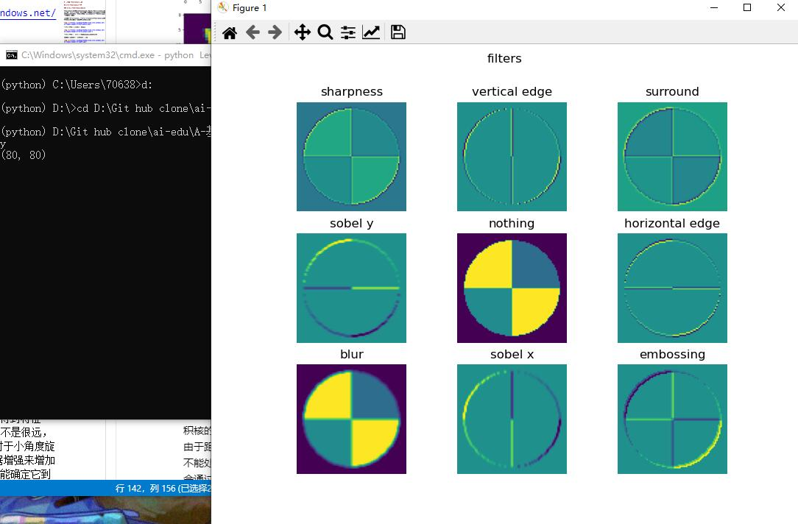

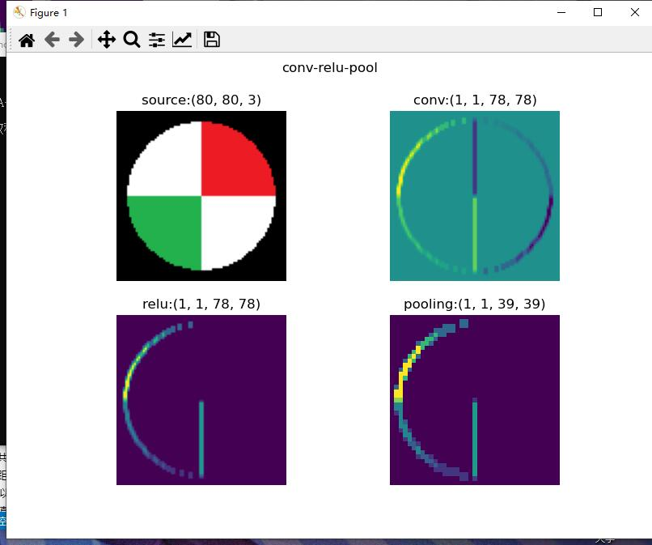

## 卷积的向前计算

### 卷积的数学定义

>连续定义

$$h(x)=(f*g)(x) = \int_{-\infty}^{\infty} f(t)g(x-t)dt \tag{1}$$

卷积与傅里叶变换有着密切的关系。利用这点性质，即两函数的傅里叶变换的乘积等于它们卷积后的傅里叶变换，能使傅里叶分析中许多问题的处理得到简化。

>离散定义

$$h(x) = (f*g)(x) = \sum^{\infty}_{t=-\infty} f(t)g(x-t) \tag{2}$$

### 一维卷积

一维卷积常用于序列模型，自然语言处理领域。

### 二维卷积

二维卷积一般用于图像处理上。

结论：

* 我们实现的卷积操作不是原始数学含义的卷积，而是工程上的卷积，可以简称为卷积

* 在实现卷积操作时，并不会反转卷积核

### 三维卷积

对于三维卷积，有以下特点：

1. 预先定义输出的feature map的数量，而不是根据前向计算自动计算出来，此例中为2，这样就会有两组WeightsBias
2. 对于每个输出，都有一个对应的过滤器Filter，此例中Feature Map-1对应Filter-1
3. 每个Filter内都有一个或多个卷积核Kernal，对应每个输入通道(Input Channel)，此例为3，对应输入的红绿蓝三个通道
4. 每个Filter只有一个Bias值，Filter-1对应b1，Filter-2对应b2
5. 卷积核Kernal的大小一般是奇数如：1x1, 3x3, 5x5, 7x7等，此例为5x5

## 代码实现

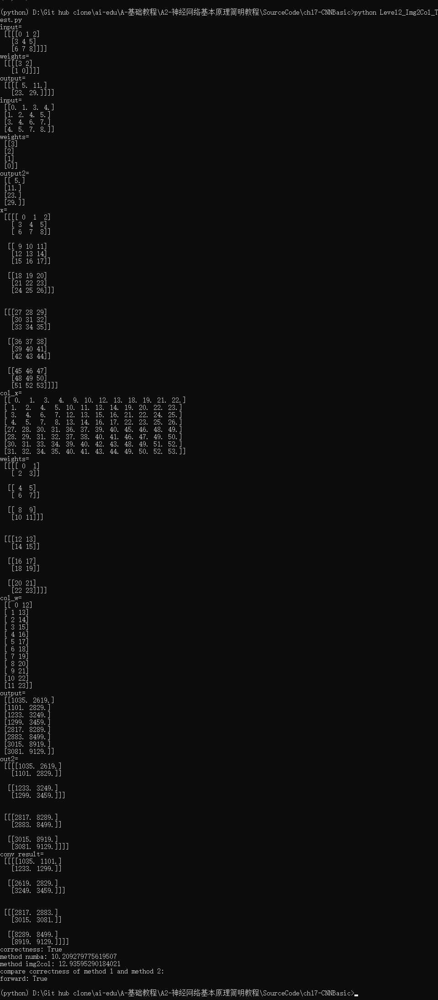

## 卷积的反向传播

### 卷积层的训练

同全连接层一样，卷积层的训练也需要从上一层回传的误差矩阵，然后计算：

1. 本层的权重矩阵的误差项
2. 本层的需要回传到下一层的误差矩阵

## 计算反向传播的梯度矩阵

正向公式：

$$Z = W*A+b \tag{0}$$

其中，W是卷积核，*表示卷积（互相关）计算，A为当前层的输入项，b是偏移（未在图中画出），Z为当前层的输出项，但尚未经过激活函数处理。

## 代码实现

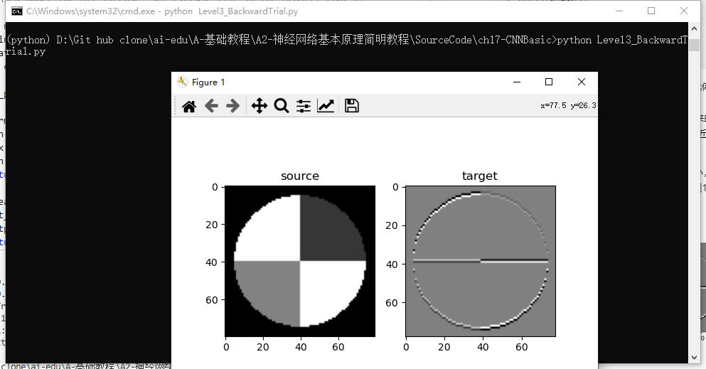

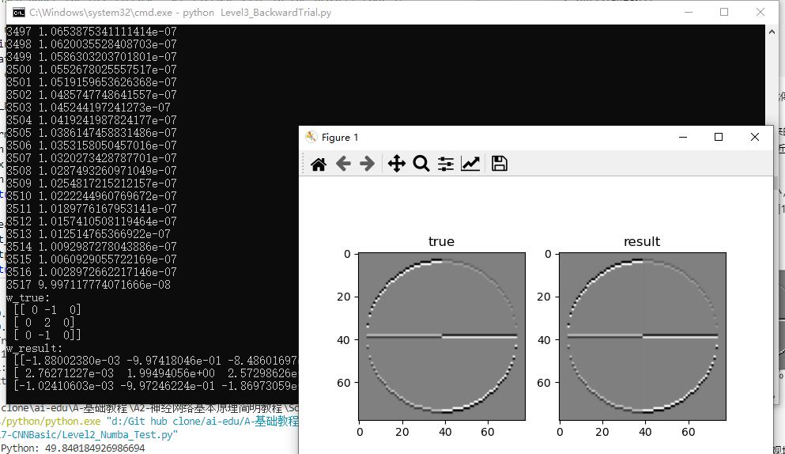

## 常用池化方法

池化 pooling，又称为下采样，downstream sampling or sub-sampling。

池化方法分为两种，一种是最大值池化 Max Pooling，一种是平均值池化 Mean/Average Pooling。

- 最大值池化，是取当前池化视野中所有元素的最大值，输出到下一层特征图中。
- 平均值池化，是取当前池化视野中所有元素的平均值，输出到下一层特征图中。

其目的是：

- 扩大视野：就如同先从近处看一张图片，然后离远一些再看同一张图片，有些细节就会被忽略
- 降维：在保留图片局部特征的前提下，使得图片更小，更易于计算
- 平移不变性，轻微扰动不会影响输出：比如上图中最大值池化的4，即使向右偏一个像素，其输出值仍为4
- 维持同尺寸图片，便于后端处理：假设输入的图片不是一样大小的，就需要用池化来转换成同尺寸图片

一般我们都使用最大值池化。

## 代码实现

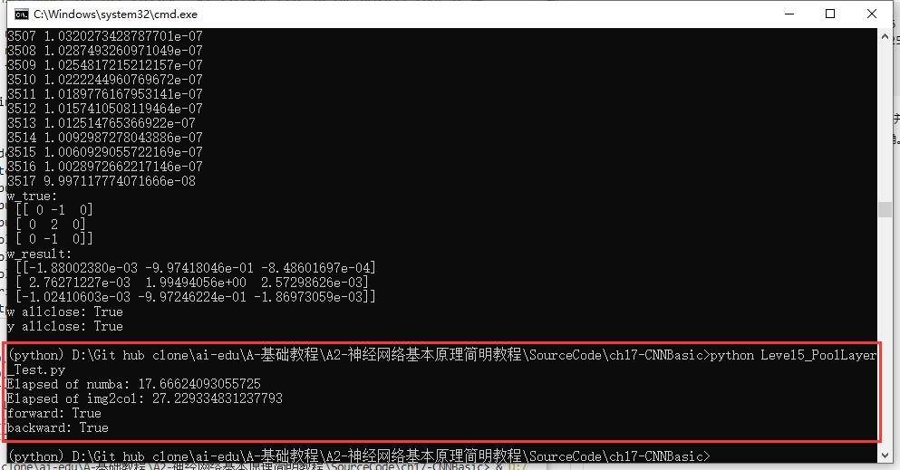

## 经典卷积神经网络模型

### LeNet (1998)

LeNet是卷积神经网络的开创者LeCun在1998年提出，用于解决手写数字识别的视觉任务。自那时起，卷积神经网络的最基本的架构就定下来了：卷积层、池化层、全连接层。


LeNet模型结构图
### AlexNet (2012)

AlexNet$^{[4]}$网络结构在整体上类似于LeNet，都是先卷积然后在全连接。但在细节上有很大不同。AlexNet更为复杂。AlexNet有60 million个参数和65000个神经元，五层卷积，三层全连接网络，最终的输出层是1000通道的Softmax。


AlexNet模型结构图

AlexNet的特点：

- 比LeNet深和宽的网络
  
  使用了5层卷积和3层全连接，一共8层。特征数在最宽处达到384。

- 数据增强
  
  针对原始图片256x256的数据，做了随机剪裁，得到224x224的图片若干张。

- 使用ReLU做激活函数
- 在全连接层使用DropOut
- 使用LRN
  
  LRN的全称为Local Response Normalizatio，局部响应归一化，是想对线性输出做一个归一化，避免上下越界。发展至今，这个技术已经很少使用了。

### ZFNet (2013)

ZFNet$^{[5]}$是2013年ImageNet分类任务的冠军，其网络结构没什么改进，只是调了调参，性能较Alex提升了不少。ZF-Net只是将AlexNet第一层卷积核由11变成7，步长由4变为2，第3，4，5卷积层转变为384，384，256。这一年的ImageNet还是比较平静的一届，其冠军ZF-Net的名堂也没其他届的经典网络架构响亮。


ZFNet模型结构图

### VGGNet (2015)

VGG Net$^{[6]}$由牛津大学的视觉几何组（Visual Geometry Group）和 Google DeepMind公司的研究员一起研发的的深度卷积神经网络，在 ILSVRC 2014 上取得了第二名的成绩，将 Top-5错误率降到7.3%。它主要的贡献是展示出网络的深度（depth）是算法优良性能的关键部分。目前使用比较多的网络结构主要有ResNet（152-1000层），GooleNet（22层），VGGNet（19层），大多数模型都是基于这几个模型上改进，采用新的优化算法，多模型融合等。到目前为止，VGG Net 依然经常被用来提取图像特征。


VGG16模型结构图

VGGNet的卷积层有一个特点：特征图的空间分辨率单调递减，特征图的通道数单调递增，使得输入图像在维度上流畅地转换到分类向量。用通俗的语言讲，就是特征图尺寸单调递减，特征图数量单调递增。从上面的模型图上来看，立体方块的宽和高逐渐减小，但是厚度逐渐增加。

### GoogLeNet (2014)

GoogLeNet跟AlexNet,VGG-Nets这种单纯依靠加深网络结构进而改进网络性能的思路不一样，它另辟幽径，在加深网络的同时（22层），也在网络结构上做了创新，引入Inception结构代替了单纯的卷积+激活的传统操作（这思路最早由Network in Network提出）。GoogLeNet进一步把对卷积神经网络的研究推上新的高度。


GoogLeNet模型结构图

蓝色为卷积运算，红色为池化运算，黄色为softmax分类。

### ResNets (2015)

2015年何恺明推出的ResNet$^{[8]}$在ISLVRC和COCO上横扫所有选手，获得冠军。ResNet在网络结构上做了大创新，而不再是简单的堆积层数，ResNet在卷积神经网络的新思路，绝对是深度学习发展历程上里程碑式的事件。


ResNets模型结构图

###  DenseNet (2017)

DenseNet$^{[9]}$ 是一种具有密集连接的卷积神经网络。在该网络中，任何两层之间都有直接的连接，也就是说，网络每一层的输入都是前面所有层输出的并集，而该层所学习的特征图也会被直接传给其后面所有层作为输入。下图是 DenseNet 的一个dense block示意图，一个block里面的结构如下，与ResNet中的BottleNeck基本一致：BN-ReLU-Conv(1×1)-BN-ReLU-Conv(3×3) ，而一个DenseNet则由多个这种block组成。每个DenseBlock的之间层称为transition layers，由BN−>Conv(1×1)−>averagePooling(2×2)组成。


DenseNet模型结构图

DenseNet作为另一种拥有较深层数的卷积神经网络，具有如下优点：

1. 相比ResNet拥有更少的参数数量
2. 旁路加强了特征的重用
3. 网络更易于训练,并具有一定的正则效果
4. 缓解了gradient vanishing和model degradation的问题

## 实现颜色分类

### 代码实现

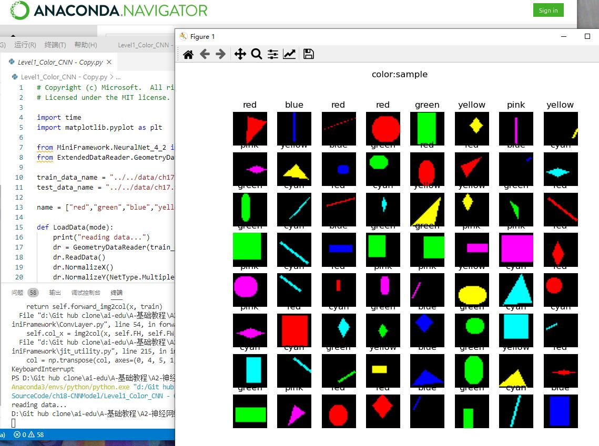

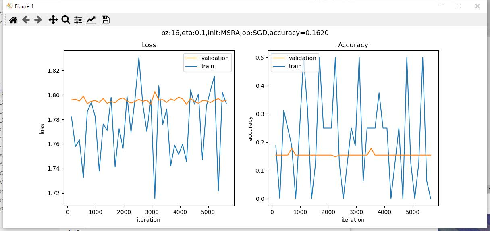

## 实现几何图形分类

### 代码实现

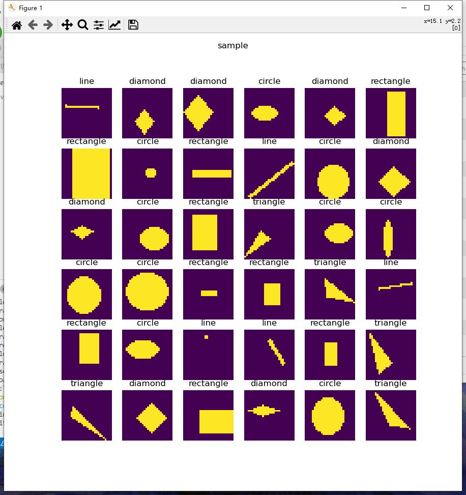

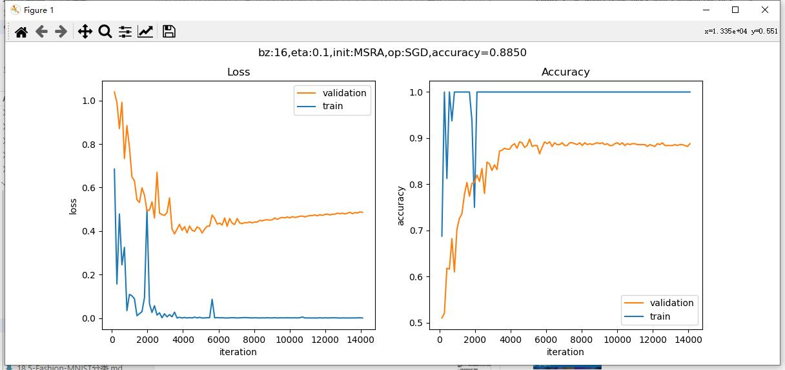

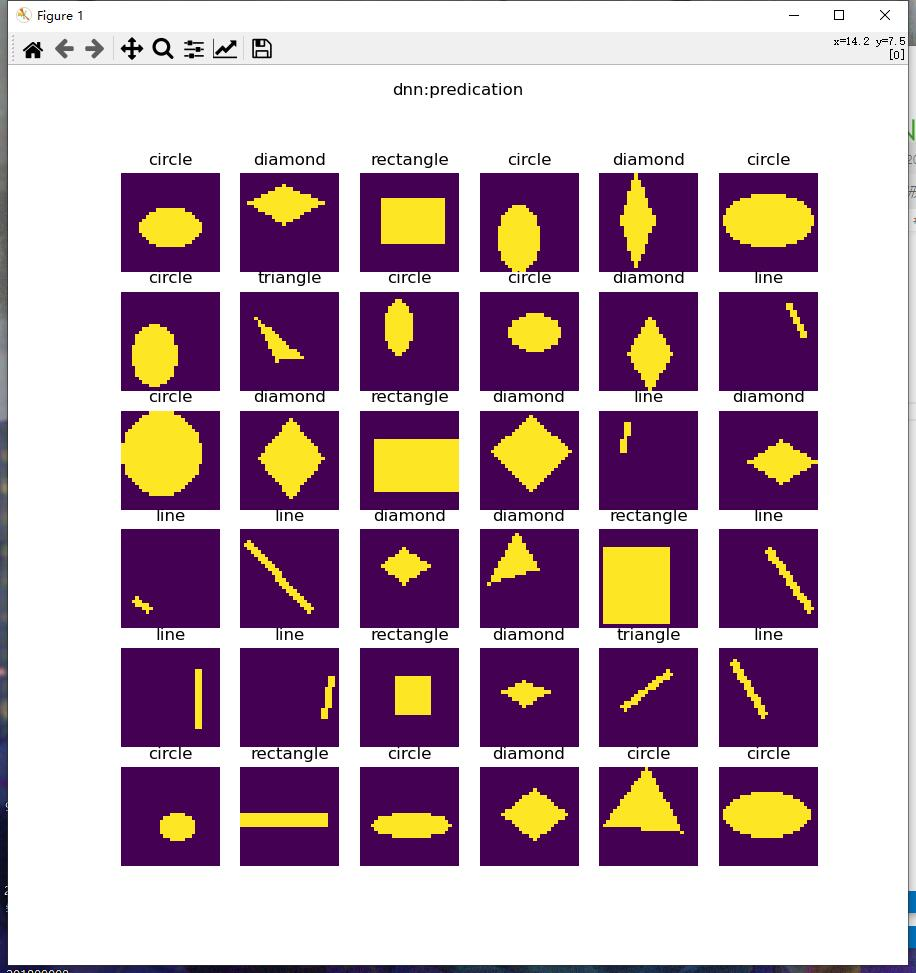

## 实现几何图形及颜色分类

### 代码实现

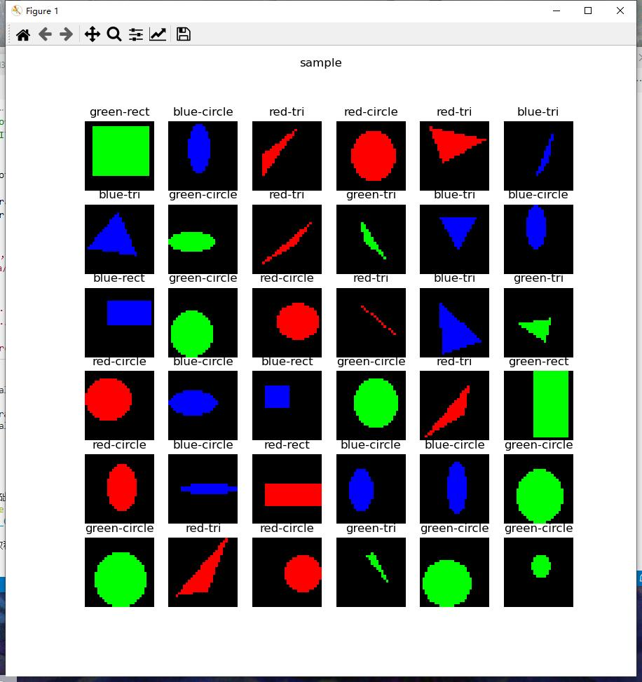

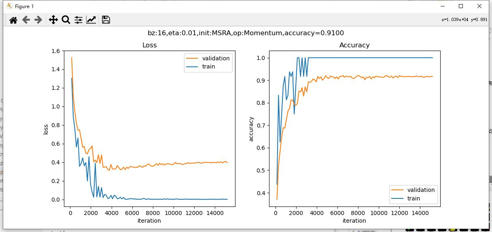

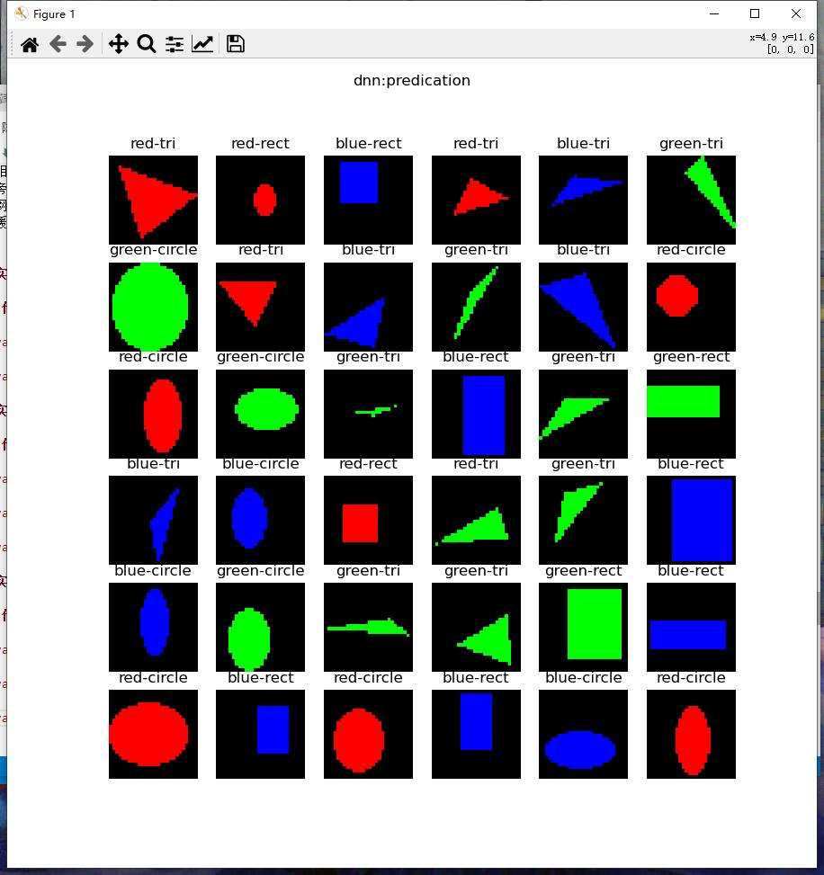

## 解决MNIST分类问题

### 第一组的卷积可视化

下图按行显示了以下内容：

1. 卷积核数值
2. 卷积核抽象
3. 卷积结果
4. 激活结果
5. 池化结果


### 第二组的卷积可视化


第二组卷积核、激活、池化的可视化

- Conv2：由于是在第一层的特征图上卷积后叠加的结果，所以基本不能按照原图理解，但也能大致看出是是一些轮廓抽取的作用；
- Relu2：能看出的是如果黑色区域多的话，说明基本没有激活值，此卷积核效果就没用；
- Pool2：池化后分化明显的特征图是比较有用的特征，比如3、6、12、15、16；信息太多或者太少的特征图，都用途偏小，比如1、7、10、11。

### 代码实现

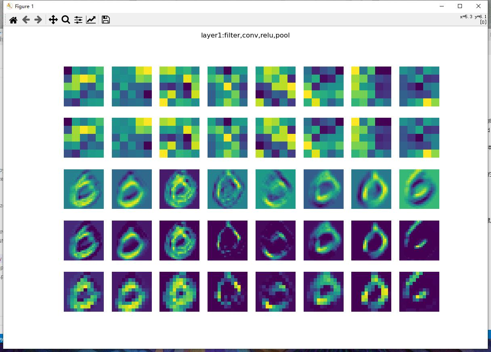

## Fashion-MNIST分类

### 代码实现

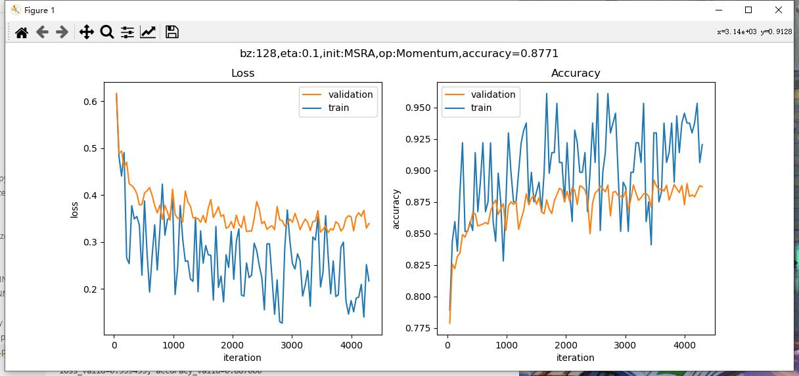

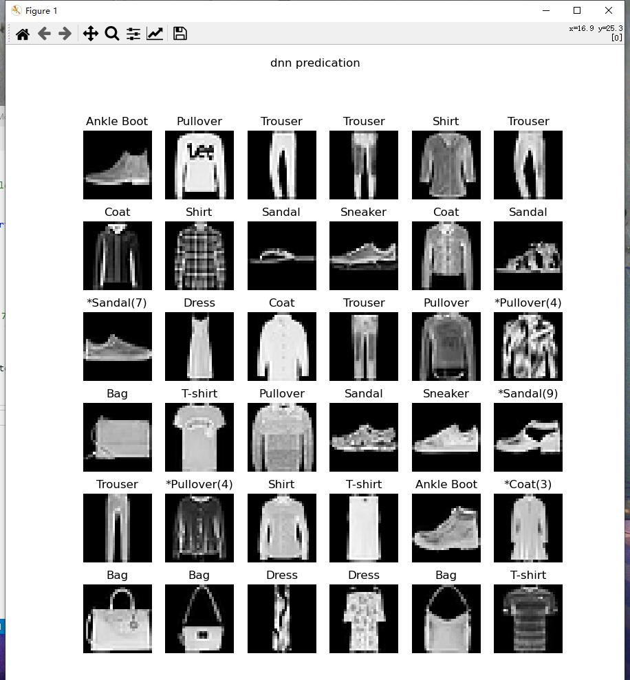

## Cifar-10分类

在这个模型中：

先用卷积->激活->卷积->激活->池化->丢弃层，做为第一梯队，卷积核32个；
然后再用卷积->激活->卷积->激活->池化->丢弃层做为第二梯队，卷积核64个；
Flatten和Dense相当于把池化的结果转成Nx512的全连接层，N是池化输出的尺寸，被Flatten扁平化了；
再接丢弃层，避免过拟合；
最后接10个神经元的全连接层加Softmax输出。

## 总结

这节课我们学习了卷积神经网络，卷积神经网络是深度学习中的一个里程碑式的技术，有了这个技术，才会让计算机有能力理解图片和视频信息，才会有计算机视觉的众多应用。

在这章中，使用代码实现了几何图像及颜色的分类。