# 第八步  卷积神经网络
# 第17章 卷积神经网络原理

## 17.0 卷积神经网络概述

**1.卷积神经网络的能力**
卷积神经网络（CNN，Convolutional Neural Net)是神经网络的类型之一，在图像识别和分类领域中取得了非常好的效果，比如识别人脸、物体、交通标识等，这就为机器人、自动驾驶等应用提供了坚实的技术基础。

在下面图中，卷积神经网络展现了识别人类日常生活中的各种物体的能力。


图 识别出四个人在一条船上

|

图 识别出一个农场中的车、狗、马、人等物体

下面的场景要比前一个更有趣一些。


图 两匹斑马


图 两个骑车人

卷积神经网络可以识别出上面两张图中的物体和场景，图是“两匹斑马站在泥地上”，图是“一个在道路上骑车的男人旁边还有个女人”。当然，识别物体和给出简要的场景描述是两套系统配合才能完成的任务，第一个系统只负责识别，第二个系统可以根据第一个系统的输出形成摘要文字。

**2.卷积神经网络的典型结构**

一个典型的卷积神经网络的结构如图17-5所示。


图17-5 卷积神经网络的典型结构图

我们分析一下它的层级结构：

1. 原始的输入是一张图片，可以是彩色的，也可以是灰度的或黑白的。这里假设是只有一个通道的图片，目的是识别0~9的手写体数字；
2. 第一层卷积，我们使用了4个卷积核，得到了4张feature map；激活函数层没有单独画出来，这里我们紧接着卷积操作使用了Relu激活函数；
3. 第二层是池化，使用了Max Pooling方式，把图片的高宽各缩小一倍，但仍然是4个feature map；
4. 第三层卷积，我们使用了4x6个卷积核，其中4对应着输入通道，6对应着输出通道，从而得到了6张feature map，当然也使用了Relu激活函数；
5. 第四层再次做一次池化，现在得到的图片尺寸只是原始尺寸的四分之一左右；
6. 第五层把第四层的6个图片展平成一维，成为一个fully connected层；
7. 第六层再接一个小一些的fully connected层；
8. 最后接一个softmax函数，判别10个分类。

**3.卷积核的作用**

我们遇到了一个新的概念：卷积核。卷积网络之所以能工作，完全是卷积核的功劳。什么是卷积核呢？卷积核其实就是一个小矩阵，类似这样：

```
1.1  0.23  -0.45
0.1  -2.1   1.24
0.74 -1.32  0.01
```

这是一个3x3的卷积核，还会有1x1、5x5、7x7、9x9、11x11的卷积核。在卷积层中，我们会用输入数据与卷积核相乘，得到输出数据，就类似全连接层中的Weights一样，所以卷积核里的数值，也是通过反向传播的方法学习到的。

下面我们看看卷积核的具体作用。


图 卷积核的作用

**4.卷积后续的运算**

前面我们认识到了卷积核的强大能力，卷积神经网络通过反向传播而令卷积核自我学习，找到分布在图片中的不同的feature，最后形成的卷积核中的数据。但是如果想达到这种效果，只有卷积层的话是不够的，还需要激活函数、池化等操作的配合。

图中的四个子图，依次展示了：

1. 原图
2. 卷积结果
3. 激活结果
4. 池化结果


图 原图经过卷积-激活-池化操作后的效果

1. 注意图一是原始图片，用cv2读取出来的图片，其顺序是反向的，即：

- 第一维是高度
- 第二维是宽度
- 第三维是彩色通道数，但是其顺序为BGR，而不是常用的RGB

1. 我们对原始图片使用了一个3x1x3x3的卷积核，因为原始图片为彩色图片，所以第一个维度是3，对应RGB三个彩色通道；我们希望只输出一张feature map，以便于说明，所以第二维是1；我们使用了3x3的卷积核，用的是sobel x算子。所以图二是卷积后的结果。

2. 图三做了一层Relu激活计算，把小于0的值都去掉了，只留下了一些边的特征。

3. 图四是图三的四分之一大小，虽然图片缩小了，但是特征都没有丢失，反而因为图像尺寸变小而变得密集，亮点的密度要比图三大而粗。

## 17.1 卷积的前向计算

**1.卷积的数学定义**

#### 连续定义

$$h(x)=(f*g)(x) = \int_{-\infty}^{\infty} f(t)g(x-t)dt \tag{1}$$

卷积与傅里叶变换有着密切的关系。利用这点性质，即两函数的傅里叶变换的乘积等于它们卷积后的傅里叶变换，能使傅里叶分析中许多问题的处理得到简化。

#### 离散定义

$$h(x) = (f*g)(x) = \sum^{\infty}_{t=-\infty} f(t)g(x-t) \tag{2}$$

**2.单入单出的二维卷积**

二维卷积一般用于图像处理上。在二维图片上做卷积，如果把图像Image简写为$I$，把卷积核Kernal简写为$K$，则目标图片的第$(i,j)$个像素的卷积值为：

$$
h(i,j) = (I*K)(i,j)=\sum_m \sum_n I(m,n)K(i-m,j-n) \tag{3}
$$

可以看出，这和一维情况下的公式2是一致的。从卷积的可交换性，我们可以把公式3等价地写作：

$$
h(i,j) = (I*K)(i,j)=\sum_m \sum_n I(i-m,j-n)K(m,n) \tag{4}
$$

公式4的成立，是因为我们将Kernal进行了翻转。在神经网络中，一般会实现一个互相关函数(corresponding function)，而卷积运算几乎一样，但不反转Kernal：

$$
h(i,j) = (I*K)(i,j)=\sum_m \sum_n I(i+m,j+n)K(m,n) \tag{5}
$$

在图像处理中，自相关函数和互相关函数定义如下：

- 自相关：设原函数是f(t)，则$h=f(t) \star f(-t)$，其中$\star$表示卷积
- 互相关：设两个函数分别是f(t)和g(t)，则$h=f(t) \star g(-t)$

互相关函数的运算，是两个序列滑动相乘，两个序列都不翻转。卷积运算也是滑动相乘，但是其中一个序列需要先翻转，再相乘。所以，从数学意义上说，机器学习实现的是互相关函数，而不是原始含义上的卷积。但我们为了简化，把公式5也称作为卷积。这就是卷积的来源。

结论：

1. 我们实现的卷积操作不是原始数学含义的卷积，而是工程上的卷积，可以简称为卷积
2. 在实现卷积操作时，并不会反转卷积核

在传统的图像处理中，卷积操作多用来进行滤波，锐化或者边缘检测啥的。我们可以认为卷积是利用某些设计好的参数组合（卷积核）去提取图像空域上相邻的信息。

按照公式5，我们可以在4x4的图片上，用一个3x3的卷积核，通过卷积运算得到一个2x2的图片，运算的过程如图所示。


图 卷积运算的过程

**3.单入多出的升维卷积**

原始输入是一维的图片，但是我们可以用多个卷积核分别对其计算，从而得到多个特征输出。如图17-13所示。


图 单入多出的升维卷积

一张4x4的图片，用两个卷积核并行地处理，输出为2个2x2的图片。在训练过程中，这两个卷积核会完成不同的特征学习。

**4.多入单出的降维卷积**

一张图片，通常是彩色的，具有红绿蓝三个通道。我们可以有两个选择来处理：

1. 变成灰度的，每个像素只剩下一个值，就可以用二维卷积
2. 对于三个通道，每个通道都使用一个卷积核，分别处理红绿蓝三种颜色的信息

显然第2种方法可以从图中学习到更多的特征，于是出现了三维卷积，即有三个卷积核分别对应书的三个通道，三个子核的尺寸是一样的，比如都是2x2，这样的话，这三个卷积核就是一个3x2x2的立体核，称为过滤器Filter，所以称为三维卷积。


图 多入单出的降维卷积

在上图中，每一个卷积核对应着左侧相同颜色的输入通道，三个过滤器的值并不一定相同。对三个通道各自做卷积后，得到右侧的三张特征图，然后再按照原始值不加权地相加在一起，得到最右侧的白色特征图，这张图里面已经把三种颜色的特征混在一起了，所以画成了白色，表示没有颜色特征了。

虽然输入图片是多个通道的，或者说是三维的，但是在相同数量的过滤器的计算后，相加在一起的结果是一个通道，即2维数据，所以称为降维。这当然简化了对多通道数据的计算难度，但同时也会损失多通道数据自带的颜色信息。

**5.多入多出的同维卷积**

在上面的例子中，是一个过滤器Filter内含三个卷积核Kernal。我们假设有一个彩色图片为3x3的，如果有两组3x2x2的卷积核的话，会做什么样的卷积计算？看图17-15。


图 多入多出的卷积运算

第一个过滤器Filter-1为棕色所示，它有三卷积核(Kernal)，命名为Kernal-1，Keanrl-2，Kernal-3，分别在红绿蓝三个输入通道上进行卷积操作，生成三个2x2的输出Feature-1,n。然后三个Feature-1,n相加，并再加上b1偏移值，形成最后的棕色输出Result-1。

对于灰色的过滤器Filter-2也是一样，先生成三个Feature-2,n，然后相加再加b2，最后得到Result-2。

之所以Feature-m,n还用红绿蓝三色表示，是因为在此时，它们还保留着红绿蓝三种色彩的各自的信息，一旦相加后得到Result，这种信息就丢失了。

**6.卷积编程模型**

上图侧重于解释数值计算过程，而图侧重于解释五个概念的关系：

- 输入 Input Channel
- 卷积核组 WeightsBias
- 过滤器 Filter
- 卷积核 kernal
- 输出 Feature Map


图 三通道经过两组过滤器的卷积过程

在此例中，输入是三维数据（3x32x32），经过2x3x5x5的卷积后，输出为三维（2x28x28），维数并没有变化，只是每一维内部的尺寸有了变化，一般都是要向更小的尺寸变化，以便于简化计算。

对于三维卷积，有以下特点：

1. 预先定义输出的feature map的数量，而不是根据前向计算自动计算出来，此例中为2，这样就会有两组WeightsBias
2. 对于每个输出，都有一个对应的过滤器Filter，此例中Feature Map-1对应Filter-1
3. 每个Filter内都有一个或多个卷积核Kernal，对应每个输入通道(Input Channel)，此例为3，对应输入的红绿蓝三个通道
4. 每个Filter只有一个Bias值，Filter-1对应b1，Filter-2对应b2
5. 卷积核Kernal的大小一般是奇数如：1x1, 3x3, 5x5, 7x7等，此例为5x5

对于上图，我们可以用在全连接神经网络中的学到的知识来理解：

1. 每个Input Channel就是特征输入，在上图中是3个
2. 卷积层的卷积核相当于隐层的神经元，上图中隐层有2个神经元
3. $W(m,n), m=[1,2], n=[1,3]$相当于隐层的权重矩阵$w_{11},w_{12},......$
4. 每个卷积核（神经元）有1个偏移值

**7.步长 stride**

前面的例子中，每次计算后，卷积核会向右或者向下移动一个单元，即步长stride = 1。而在图这个卷积操作中，卷积核每次向右或向下移动两个单元，即stride = 2。


图 步长为2的卷积

在后续的步骤中，由于每次移动两格，所以最终得到一个2x2的图片。

**8.填充 padding**

如果原始图为4x4，用3x3的卷积核进行卷积后，目标图片变成了2x2。如果我们想保持目标图片和原始图片为同样大小，该怎么办呢？一般我们会向原始图片周围填充一圈0，然后再做卷积。如图17-18。


图 带填充的卷积

## 17.3 卷积层的训练

同全连接层一样，卷积层的训练也需要从上一层回传的误差矩阵，然后计算：

1. 本层的权重矩阵的误差项
2. 本层的需要回传到下一层的误差矩阵

在下面的描述中，我们假设已经得到了从上一层回传的误差矩阵，并且已经经过了激活函数的反向传导。

**1.计算反向传播的梯度矩阵**

正向公式：

$$Z = W*A+b \tag{0}$$

其中，W是卷积核，*表示卷积（互相关）计算，A为当前层的输入项，b是偏移（未在图中画出），Z为当前层的输出项，但尚未经过激活函数处理。


图 卷积正向运算


图 卷积运算中的误差反向传播

**2.步长不为1时的梯度矩阵还原**

我们先观察一下stride=1和2时，卷积结果的差异如图。


图 步长为1和步长为2的卷积结果的比较

二者的差别就是中间那个结果图的灰色部分。如果反向传播时，传入的误差矩阵是stride=2时的2x2的形状，那么我们只需要把它补上一个十字，变成3x3的误差矩阵，就可以用步长为1的算法了。

以此类推，如果步长为3时，需要补一个双线的十字。所以，当知道当前的卷积层步长为S（S>1）时：

1. 得到从上层回传的误差矩阵形状，假设为$M \times N$
2. 初始化一个$(M \cdot S) \times (N \cdot S)$的零矩阵
3. 把传入的误差矩阵的第一行值放到零矩阵第0行的0,S,2S,3S...位置
4. 然后把误差矩阵的第二行的值放到零矩阵第S行的0,S,2S,3S...位置
5. ......

步长为2时，用实例表示就是这样：

$$
\begin{bmatrix}
  \delta_{11} & 0 & \delta_{12} & 0 & \delta_{13}\\\\
  0 & 0 & 0 & 0 & 0\\\\
  \delta_{21} & 0 & \delta_{22} & 0 & \delta_{23}\\\\
\end{bmatrix}
$$ 

步长为3时，用实例表示就是这样：

$$
\begin{bmatrix}
  \delta_{11} & 0 & 0 & \delta_{12} & 0 & 0 & \delta_{13}\\\\
  0 & 0 & 0 & 0 & 0 & 0 & 0\\\\
  0 & 0 & 0 & 0 & 0 & 0 & 0\\\\
  \delta_{21} & 0 & 0 & \delta_{22} & 0 & 0 & \delta_{23}\\\\
\end{bmatrix}
$$ 

**3.有多个卷积核时的梯度计算**

有多个卷积核也就意味着有多个输出通道。

也就是升维卷积，如图。


图 升维卷积

**4.有多个输入时的梯度计算**

当输入层是多个图层时，每个图层必须对应一个卷积核，如图。


图 多个图层的卷积必须有一一对应的卷积核

**5.权重（卷积核）梯度计算**


图 卷积核的梯度计算

**6.偏移的梯度计算**

根据前向计算公式1，2，3，4，可以得到：

$$
\begin{aligned}
\frac{\partial J}{\partial b} &= \frac{\partial J}{\partial z_{11}}\frac{\partial z_{11}}{\partial b} + \frac{\partial J}{\partial z_{12}}\frac{\partial z_{12}}{\partial b} + \frac{\partial J}{\partial z_{21}}\frac{\partial z_{21}}{\partial b} + \frac{\partial J}{\partial z_{22}}\frac{\partial z_{22}}{\partial b}
\\\\
&=\delta_{z11} + \delta_{z12}  + \delta_{z21} + \delta_{z22} 
\end{aligned}
\tag{12}
$$

所以：

$$
\delta_b = \delta_{in} \tag{13}
$$

每个卷积核W可能会有多个filter，或者叫子核，但是一个卷积核只有一个偏移，无论有多少子核。

## 17.5 池化层

**1.常用池化方法**

池化 pooling，又称为下采样，downstream sampling or sub-sampling。

池化方法分为两种，一种是最大值池化 Max Pooling，一种是平均值池化 Mean/Average Pooling。如图所示。


- 最大值池化，是取当前池化视野中所有元素的最大值，输出到下一层特征图中。
- 平均值池化，是取当前池化视野中所有元素的平均值，输出到下一层特征图中。

其目的是：

- 扩大视野：就如同先从近处看一张图片，然后离远一些再看同一张图片，有些细节就会被忽略
- 降维：在保留图片局部特征的前提下，使得图片更小，更易于计算
- 平移不变性，轻微扰动不会影响输出：比如上图中最大值池化的4，即使向右偏一个像素，其输出值仍为4
- 维持同尺寸图片，便于后端处理：假设输入的图片不是一样大小的，就需要用池化来转换成同尺寸图片

一般我们都使用最大值池化。

**2.池化的其它方式**

在上面的例子中，我们使用了size=2x2，stride=2的模式，这是常用的模式，即步长与池化尺寸相同。

我们很少使用步长值与池化尺寸不同的配置，所以只是提一下，如图。


图 步长为1的池化

上图是stride=1, size=2x2的情况，可以看到，右侧的结果中，有一大堆的3和4，基本分不开了，所以其池化效果并不好。

假设输入图片的形状是 $W_1 \times H_1 \times D_1$，其中W是图片宽度，H是图片高度，D是图片深度（多个图层），F是池化的视野（正方形），S是池化的步长，则输出图片的形状是：

$$
\begin{cases}
W_2 = (W_1 - F)/S + 1 \\\\
H_2 = (H_1 - F)/S + 1 \\\\
D_2 = D_1
\end{cases}
$$

池化层不会改变图片的深度，即D值前后相同。

**3.池化层的训练**

我们假设图中，$[[1,2],[3,4]]$是上一层网络回传的残差，那么：

- 对于最大值池化，残差值会回传到当初最大值的位置上，而其它三个位置的残差都是0。
- 对于平均值池化，残差值会平均到原始的4个位置上。


图 平均池化与最大池化


图 池化层反向传播的示例

# 第18章 卷积神经网络应用

## 18.0 经典的卷积神经网络模型

卷积神经网络是现在深度学习领域中最有用的网络类型，尤其在计算机视觉领域更是一枝独秀。卷积神经网络从90年代的LeNet开始，沉寂了10年，也孵化了10年，直到2012年AlexNet开始再次崛起，后续的ZF Net、VGG、GoogLeNet、ResNet、DenseNet，网络越来越深，架构越来越复杂，解决反向传播时梯度消失的方法也越来越巧妙。

**1.LeNet (1998)**

图是卷积神经网络的鼻祖LeNet$^{[3]}$的模型结构。


图 LeNet模型结构图

**2.AlexNet (2012)**


图 AlexNet模型结构图

**3.ZFNet (2013)**


图 ZFNet模型结构图

**4.VGGNet (2015)**


图 VGG16模型结构图

**5.GoogLeNet (2014)**


图 GoogLeNet模型结构图


图 Inception结构图

**6.ResNets (2015)**


图 ResNets模型结构图

**7.DenseNet (2017)**


图 DenseNet模型结构图

## 18.1 实现颜色分类


图 颜色分类样本数据图

在样本数据中，一共有6种颜色，分别是：

- 红色 red
- 绿色 green
- 蓝色 blue
- 青色（蓝+绿） cyan
- 黄色（红+绿） yellow
- 粉色（红+蓝） pink

而这6种颜色是分布在5种形状之上的：

- 圆形
- 菱形
- 直线
- 矩形

**用前馈神经网络实现**


图 训练过程中的损失函数值和准确度变化曲线


图 可视化结果

**用卷积神经网络实现**


图 训练过程中的损失函数值和准确度变化曲线


图 测试结果


## 18.2 实现几何图形分类


图 样本数据

一共有5种形状：圆形、菱形、直线、矩形、三角形。上图中列出了一些样本，由于图片尺寸是28x28的灰度图，所以在放大显示后可以看到很多锯齿，读者可以忽略。需要强调的是，每种形状的尺寸和位置在每个样本上都是有差异的，它们的大小和位置都是随机的，比如圆形的圆心位置和半径都是不一样的，还有可能是个椭圆。

**用前馈神经网络和卷积神经网络实现**

## 18.3 实现几何图形及颜色分类


图 样本数据

一共有3种形状及3种颜色，如表所示。

表 样本数据分类和数量

||红色|蓝色|绿色|
|---|---|---|---|
|圆形|600:100|600:100|600:100|
|矩形|600:100|600:100|600:100|
|三角形|600:100|600:100|600:100|

表中列出了9种样本的训练集和测试集的样本数量比例，都是600:100

**用前馈神经网络实现**


图 训练过程中损失函数值和准确度的变化
**用卷积神经网络实现**


图 训练过程中损失函数值和准确度的变化

##  解决MNIST分类问题

**1.模型搭建**


图 前馈神经网络模型解决MNIST问题

这一节中，我们将学习如何使用卷积网络来解决MNIST问题。首先搭建模型如图18-32。


图 卷积神经网络模型解决MNIST问题

表展示了模型中各层的功能和参数。

表 模型中各层的功能和参数

|Layer|参数|输入|输出|参数个数|
|---|---|---|---|---|
|卷积层|8x5x5,s=1|1x28x28|8x24x24|200+8|
|激活层|2x2,s=2, max|8x24x24|8x24x24||
|池化层|Relu|8x24x24|8x12x12||
|卷积层|16x5x5,s=1|8x12x12|16x8x8|400+16|
|激活层|Relu|16x8x8|16x8x8||
|池化层|2x2, s=2, max|16x8x8|16x4x4||
|全连接层|256x32|256|32|8192+32|
|批归一化层||32|32||
|激活层|Relu|32|32||
|全连接层|32x10|32|10|320+10|
|分类层|softmax,10|10|10|

**2.结果**

训练5个epoch后的损失函数值和准确率的历史记录曲线如图。


图 训练过程中损失函数值和准确度的变化

## 18.5 Fashion-MNIST分类

MNIST手写识别数据集，对卷积神经网络来说已经太简单了，于是科学家们增加了图片的复杂度，用10种物品代替了10个数字。


图 部分样本图展示

每3行是一类样本，按样本类别（从0开始计数）分行显示：

1. T-Shirt，T恤衫（1-3行）
2. Trouser，裤子（4-6行）
3. Pullover，套头衫（7-9行）
4. Dress，连衣裙（10-12行）
5. Coat，外套（13-15行）
6. Sandal，凉鞋（16-18行）
7. Shirt，衬衫（19-21行）
8. Sneaker，运动鞋（22-24行）
9. Bag，包（25-27行）
10. Ankle Boot，短靴（28-30行）

**用前馈神经网络实现**


图 训练过程中损失函数值和准确度的变化


图 测试结果
**用卷积神经网络实现**


图 训练过程中损失函数值和准确度的变化


图 测试结果

## 18.6 Cifar-10分类

Cifar 是加拿大政府牵头投资的一个先进科学项目研究所。Hinton、Bengio和他的学生在2004年拿到了 Cifar 投资的少量资金，建立了神经计算和自适应感知项目。这个项目结集了不少计算机科学家、生物学家、电气工程师、神经科学家、物理学家、心理学家，加速推动了 Deep Learning 的进程。从这个阵容来看，DL 已经和 ML 系的数据挖掘分的很远了。Deep Learning 强调的是自适应感知和人工智能，是计算机与神经科学交叉；Data Mining 强调的是高速、大数据、统计数学分析，是计算机和数学的交叉。

Cifar-10 是由 Hinton 的学生 Alex Krizhevsky、Ilya Sutskever 收集的一个用于普适物体识别的数据集。

我们在前面的学习中，使用了MNIST和Fashion-MNIST两个数据集来练习卷积网络的分类，但是这两个数据集都是单通道的灰度图。虽然我们用彩色的几何图形作为例子讲解了卷积网络的基本功能，但是仍然与现实的彩色世界有差距。所以，本节我们将使用Cifar-10数据集来进一步检验一下卷积神经网络的能力。

图是Cifar-10的样本数据。


图 Cifar-10样本数据

0. airplane，飞机，6000张
1. automobile，汽车，6000张
2. bird，鸟，6000张
3. cat，猫，6000张
4. deer，鹿，6000张
5. dog，狗，6000张
6. frog，蛙，6000张
7. horse，马，6000张
8. ship，船，6000张
9. truck，卡车，6000张

Cifar-10 由60000张32*32的 RGB 彩色图片构成，共10个分类。50000张训练，10000张测试。分为6个文件，5个训练数据文件，每个文件中包含10000张图片，随机打乱顺序，1个测试数据文件，也是10000张图片。这个数据集最大的特点在于将识别迁移到了普适物体，而且应用于多分类（姊妹数据集Cifar-100达到100类，ILSVRC比赛则是1000类）。

但是，面对彩色数据集，用CPU做训练所花费的时间实在是太长了，所以本节将学习如何使用GPU来训练神经网络。

**环境搭建**

我们将使用Keras$^{[1]}$来训练模型，因为Keras是一个在TensorFlow平台上经过抽象的工具，它的抽象思想与我们在前面学习过的各种Layer的概念完全一致，有利于读者在前面的基础上轻松地继续学习。环境搭建有很多细节，我们在这里不详细介绍，只是把基本步骤列出。

1. 安装Python 3.6（本书中所有案例在Python 3.6上开发测试）
2. 安装CUDA（没有GPU的读者请跳过）
3. 安装cuDNN（没有GPU的读者请跳过）
4. 安装TensorFlow，有GPU硬件的一定要按照GPU版，没有的只能安装CPU版
5. 安装Keras

安装好后用pip list看一下，关键的几个包是：

```
Package              Version
-------------------- ---------
Keras                2.2.5
Keras-Applications   1.0.8
Keras-Preprocessing  1.1.0
matplotlib           3.1.1
numpy                1.17.0
tensorboard          1.13.1
tensorflow-estimator 1.13.0
tensorflow-gpu       1.13.1
```

如果没有GPU，则"tensorflow-gpu"一项会是"tensorflow"。

**训练结果**

#### 在GPU上训练

在GPU上训练，每一个epoch大约需要1分钟；而在一个8核的CPU上训练，每个epoch大约需要2分钟（据笔者观察是因为并行计算占满了8个核）。所以即使读者没有GPU，用CPU训练还是可以接受的。以下是在GPU上的训练输出：

```
Epoch 1/25
1563/1563 [==============================] - 33s 21ms/step - loss: 1.8770 - acc: 0.3103 - val_loss: 1.6447 - val_acc: 0.4098
......
Epoch 25/25
1563/1563 [==============================] - 87s 55ms/step - loss: 0.8809 - acc: 0.6960 - val_loss: 0.7724 - val_acc: 0.7372

Test loss: 0.772429921245575
Test accuracy: 0.7372
```
经过25轮后，模型在测试集上的准确度为73.72%。

#### 在CPU上训练

在CPU上训练，只设置了10个epoch，一共半个小时时间，在测试集上达到63.61%的准确率。观察val_loss和val_acc的趋势，随着训练次数的增加，还可以继续优化。

```
Epoch 1/10
1563/1563 [==============================] - 133s 85ms/step - loss: 1.8563 - acc: 0.3198 - val_loss: 1.5658 - val_acc: 0.4343
......

Epoch 10/10
1563/1563 [==============================] - 131s 84ms/step - loss: 1.0972 - acc: 0.6117 - val_loss: 1.0426 - val_acc: 0.6361

10000/10000 [==============================] - 7s 684us/step
Test loss: 1.042622245979309
Test accuracy: 0.6361
```

# 实验代码结果
# 17 卷积神经网络原理

## 17.0 卷积神经网络概述
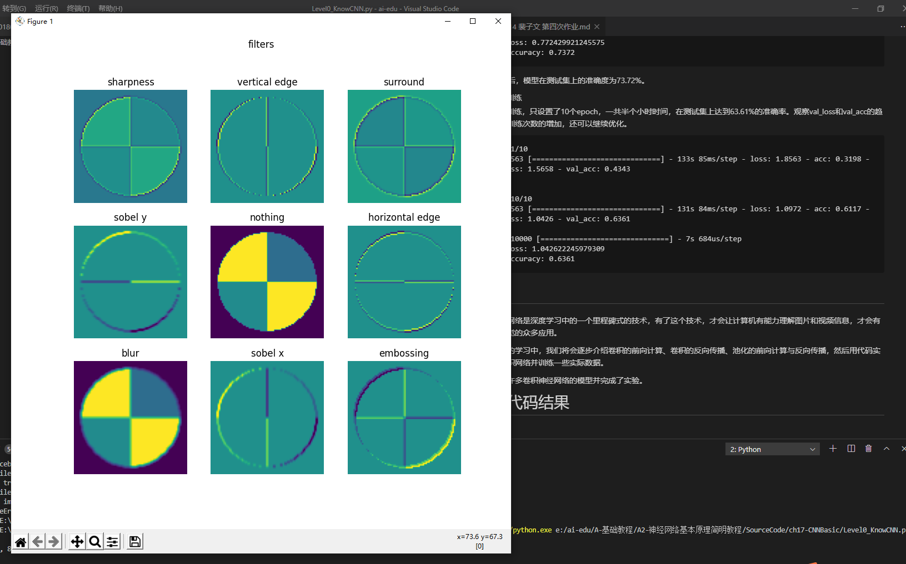

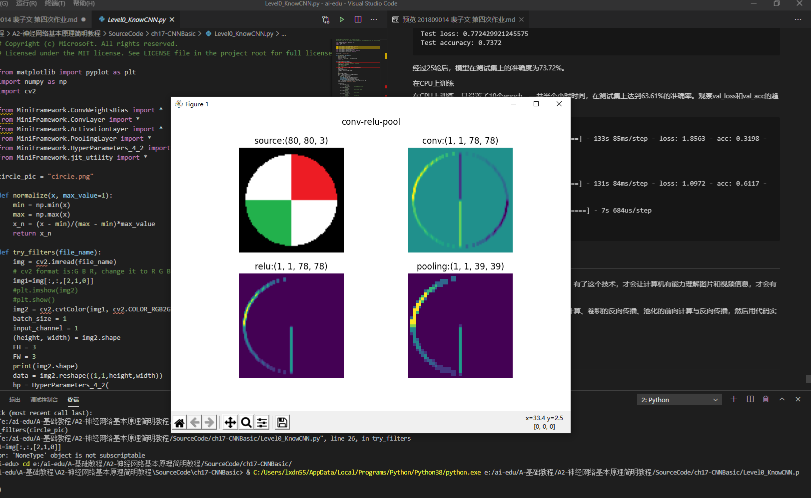

## 17.2 卷积前向计算
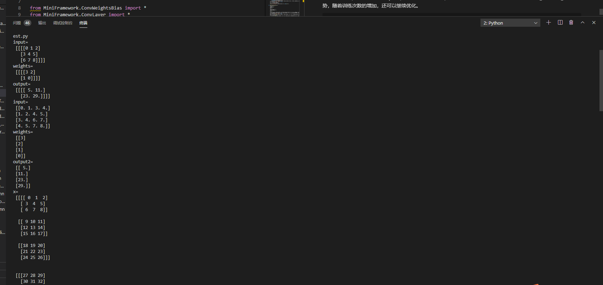


## 17.3 卷积层的训练

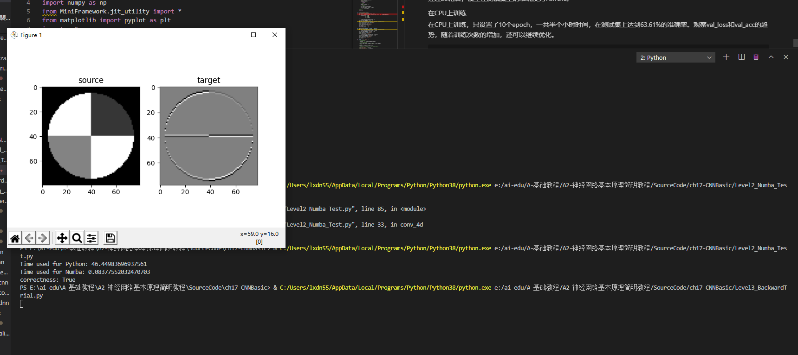

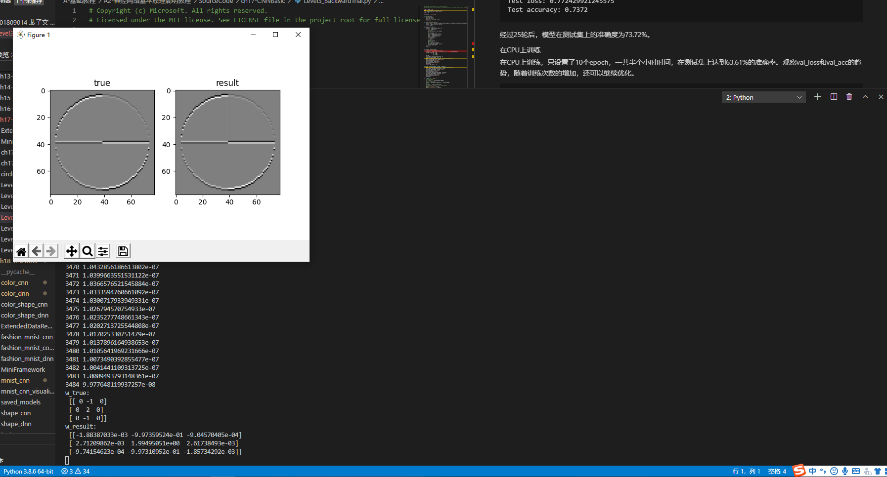

## 17.4 卷积反向传播


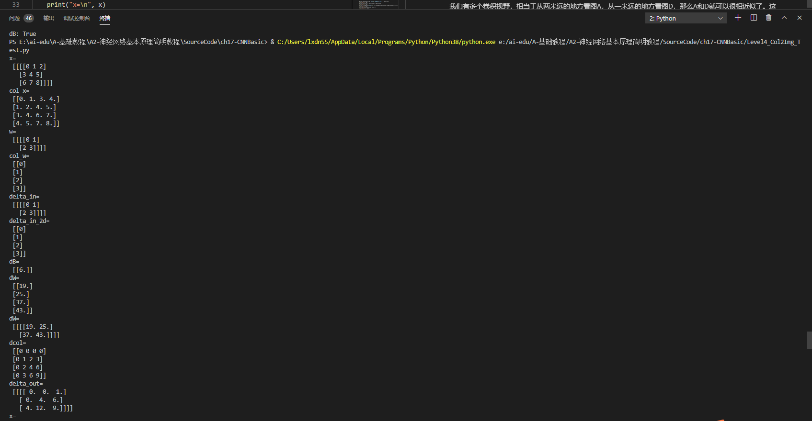

## 17.5 池化层


# 第18章 卷积神经网络应用
## 18.1 实现颜色分类

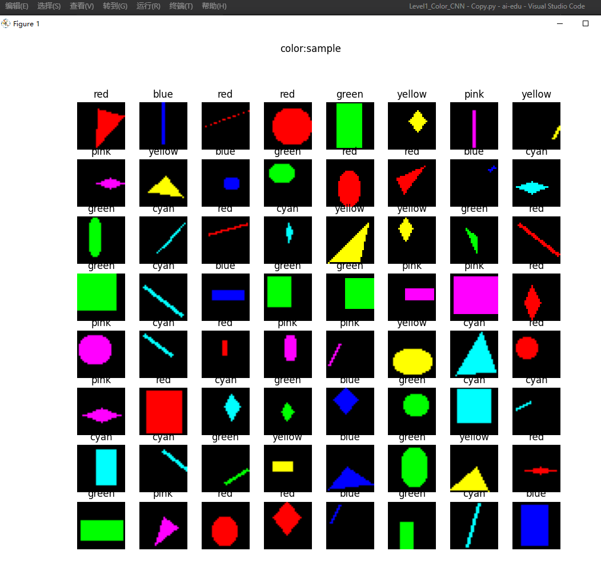

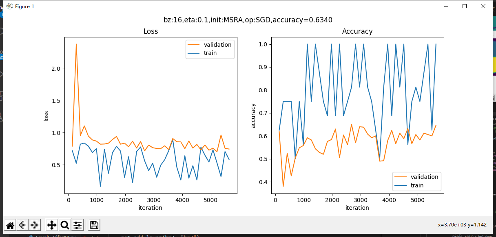

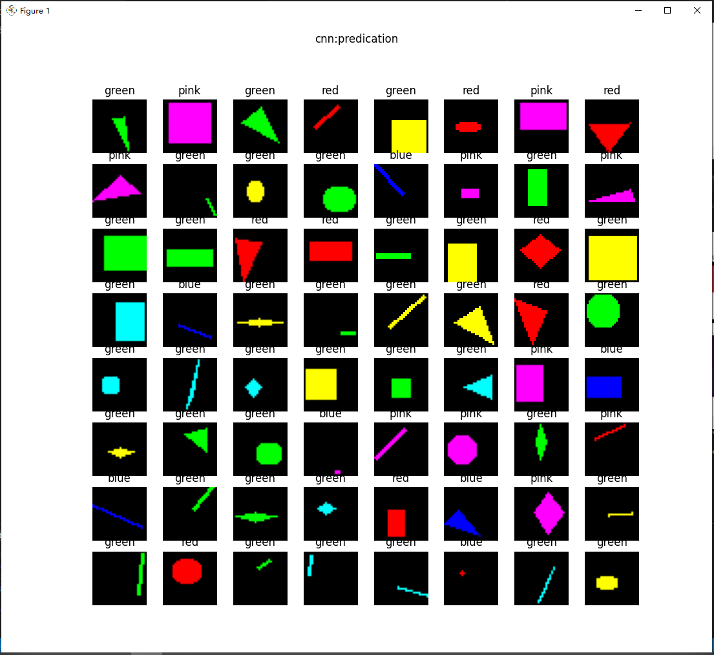

## 18.2 实现几何图形分类

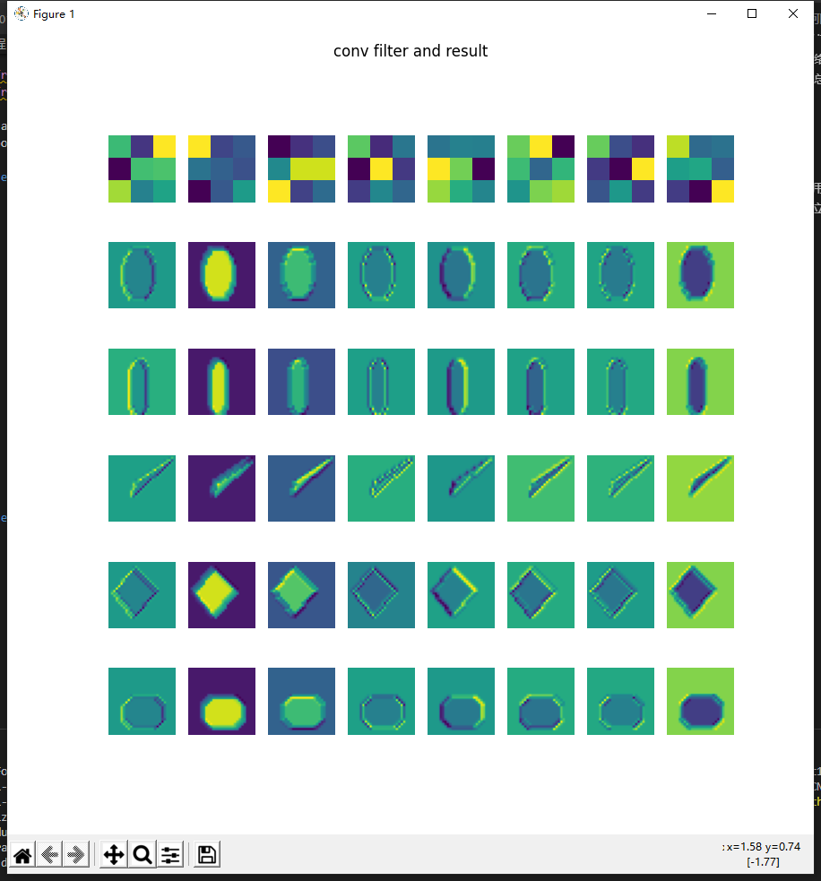

## 18.3 实现几何图形及颜色分类

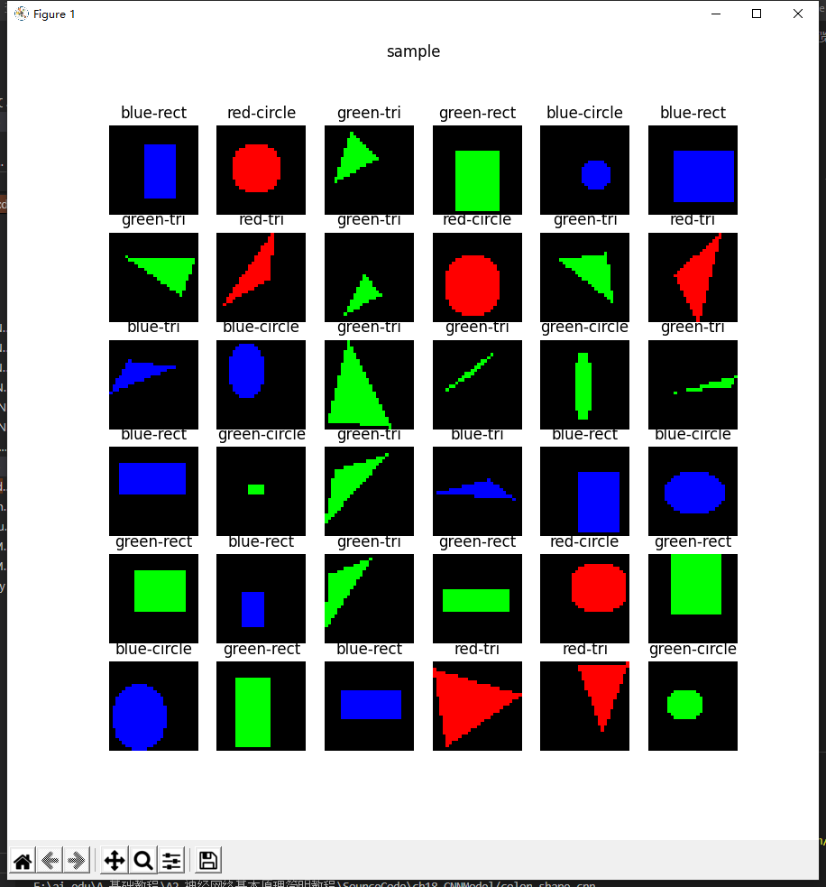

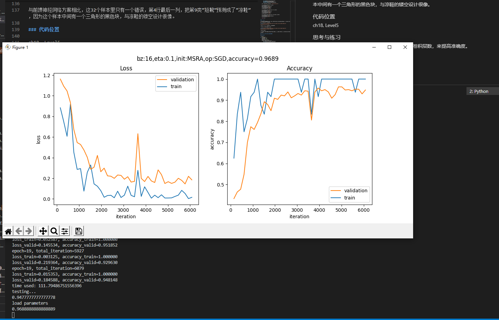

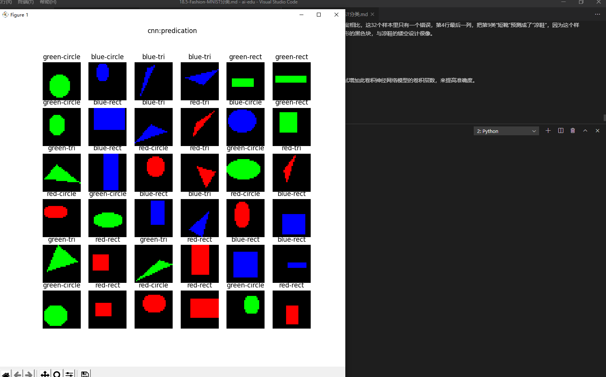

## 18.4 解决MNIST分类问题

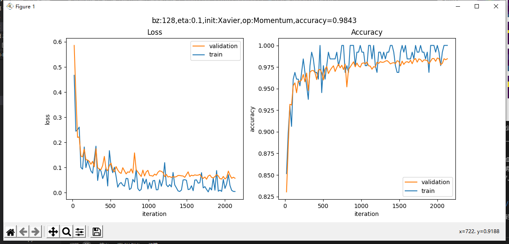

## 18.5 Fashion-MNIST分类

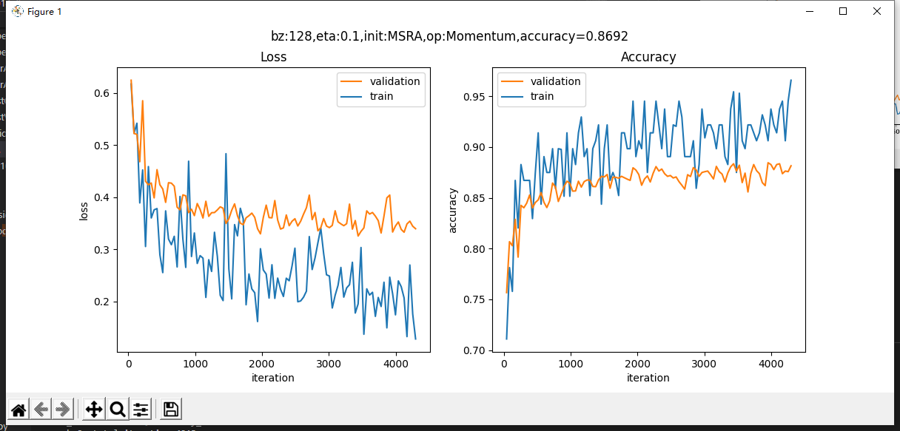

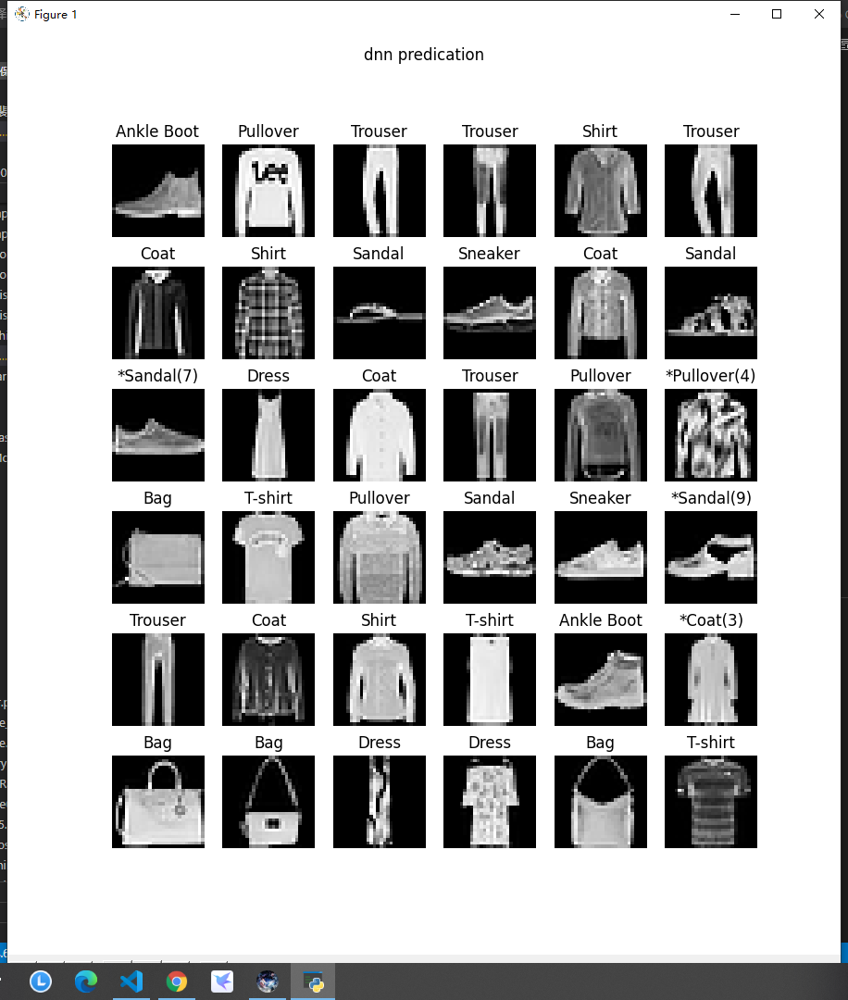

# 总结
卷积神经网络是深度学习中的一个里程碑式的技术，有了这个技术，才会让计算机有能力理解图片和视频信息，才会有计算机视觉的众多应用。

在本部分的学习中，我们将会逐步介绍卷积的前向计算、卷积的反向传播、池化的前向计算与反向传播，然后用代码实现一个卷积网络并训练一些实际数据。

还介绍了许多卷积神经网络的模型并完成了实验。
