# Step8学习笔记
# 201809015 智能181王涵

## 软件安装
输入命令
pip install opencv-python
更新pip
easy_install --upgrade pip
找到python文件夹中的cv2
将cv2文件夹导入到CH17的目录下即可
## 卷积神经网络原理

### 卷积神经网络的典型结构
* 卷积层
* 激活函数层
* 池化层
* 全连接分类层

### 卷积核
一个小矩阵
作用：抓取重要特征，除去非重要特征。

### 卷积神经网络的学习
在最后一层的池化后面，把所有特征数据变成一个一维的全连接层，然后就和普通的深度全连接网络一样了，通过在最后一层的softmax分类函数，以及多分类交叉熵函数，对比图片的OneHot编码标签，回传误差值，从全连接层传回到池化层，通过激活函数层再回传给卷积层，对卷积核的数值进行梯度更新，实现卷积核数值的自我学习。

## 卷积的前向计算
需要理解的概念：
卷积的计算过程，单人单出，单入多出，多入单出，以及多入多出。步长stride，以及填充padding。

离散求和，连续求积分
卷积实际上是滤波器
g函数能够抓取f的重要特征，隐去非重要特征。
特征能够保留，且变少了。
用较小卷积核，深度变深，可以把特征获取更全。

图实际上是一个函数，每个像素对应一个位置，x表示位置，y表示编码。
图形编码中g函数为核函数
图形编码观察二维信号卷积过程

感受野是CNN中的某一层输出结果的一个元素对应输入层的一个映射，即feature map上的一个点所对应的输入图上的区域。

右上图卷积层矩阵输出大小公式中：
s表示步长，以一个像素为单位。
p表示在编码的外围补0的圈数
f表示卷积核的大小

公式含义：以图中黑框为例
（7+2*0-3）/ 1+1=5 （s=1），若s=2，则Nout=3，即图中所示3*3的结果。

可以通过不同的卷积核得到同一个图的不同特征：
多个卷积核即多个通道对特征图进行卷积

彩色图中RGB原理（三基色原理）：任何一种都可以按照红蓝绿三种颜色调和而成。
即彩色图中任意像素可分解成三个矩阵。（分解成RGB三个通道）

多通道卷积
三个通道分别用不同的卷积核卷积，再将相同位置的值相加。

池化：下采样
平均池化：Mean Pooling 进一步把编码压缩
最大池化：Max Pooling 求最突出特征

如果矩阵不对称，则水平和垂直分别计算
p = （f-1）/ 2

Lenet框架：
两对卷积池化层，两个全连接层。
共享权重：压缩成一个像素的过程中，权重相同，含义：对于同一个通道中，（相同指输入输出都相同，若输出有六个，则有六组权重参数）权重相同。

相比于传统神经网络中每个连接数目在训练中的权重都得改变，卷积神经网络因为有权重共享，即参数数目为要训练的权重总数，训练量减少。

参数数目中：2为1+1（2*2的池化核共用一个权重，共用一个偏置）此处与卷积核不同。

如右上图所示：6个变16个过程中一个卷积核对多个特征图分别作卷积再把结果累加。
物理含义：更多的通道可以获得更多的特征，通过融合获得更丰富的特征。
一个卷积核对不同输入通道的权重不同，相同通道中权重相同，每个输入通道对应一个偏置。

第二对卷积和池化之间，方法和前面相同，池化核中2*2的权重只记一个

总结：所谓共享权重，在卷积变化中，指的是一个卷积核的大小，而在池化中指的是2*2池化核始终相同为1。

到此完成了特征获取。深度学习的特征获取通过卷积池化，传统的神经网络通过人工BP算法获取。

通过全连接层Dense函数完成分类。两层映射更充分。
最后的输出层作类别映射。softmax函数

全连接层：作拟合映射工作

把编码转换成向量。Flatten函数

## 卷积核的实现
代码运行示例：
ch17,Level0
运行效果
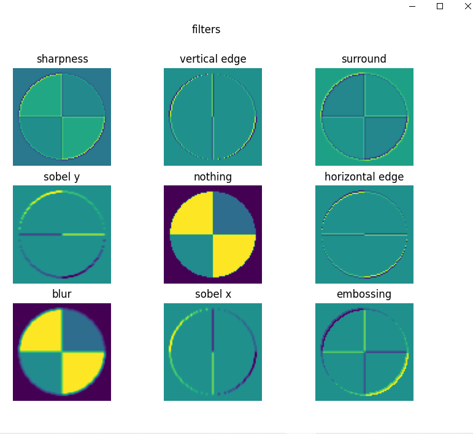
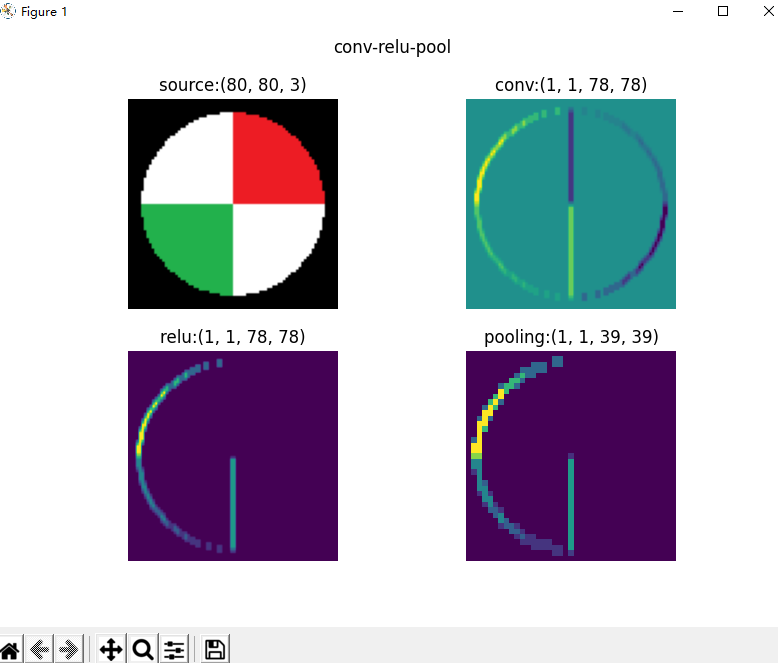
代码运行示例：
ch17,level2
运行效果
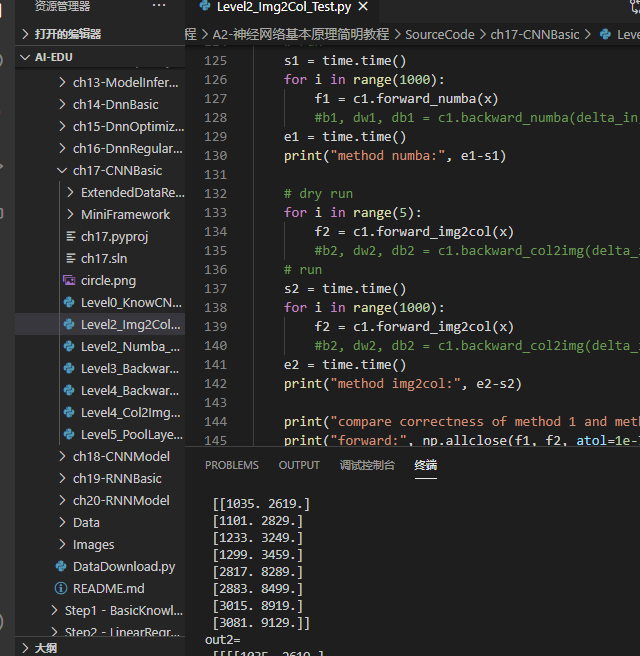
代码运行示例：
ch17，level3
运行效果：
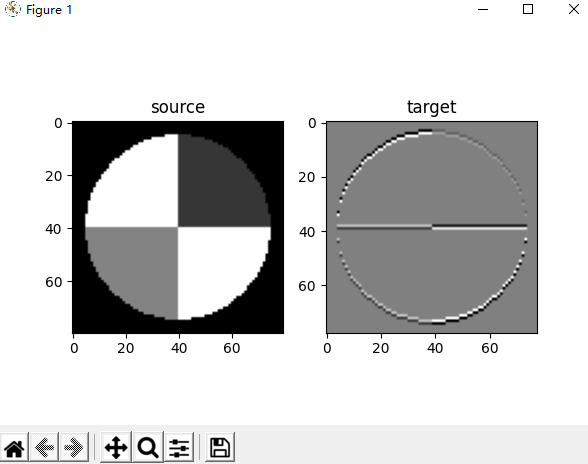
代码运行示例：
ch17，level4
代码效果：

代码运行示例：
ch17，level5
代码效果：

颜色分类：
代码运行示例：
ch18，level1
代码效果：
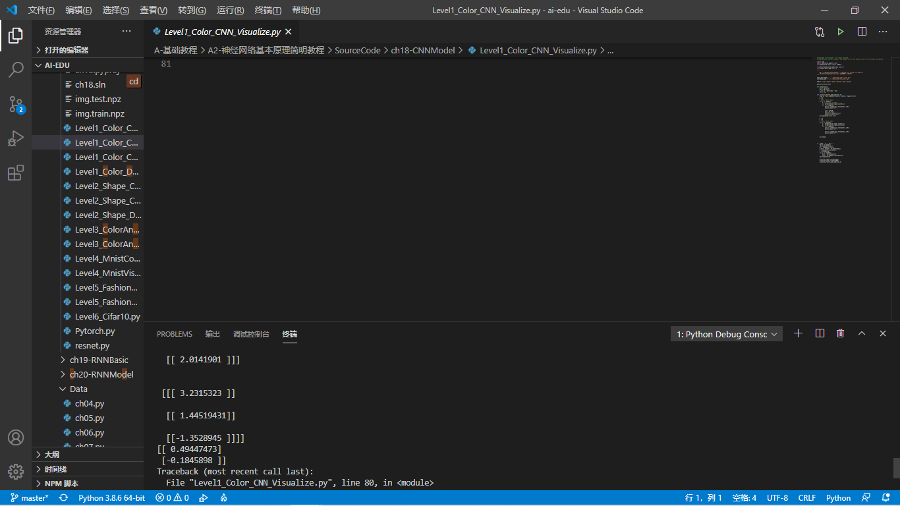
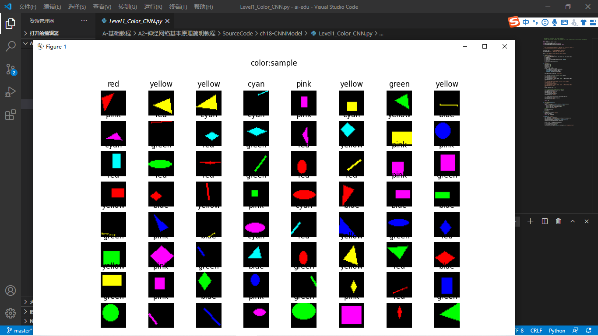
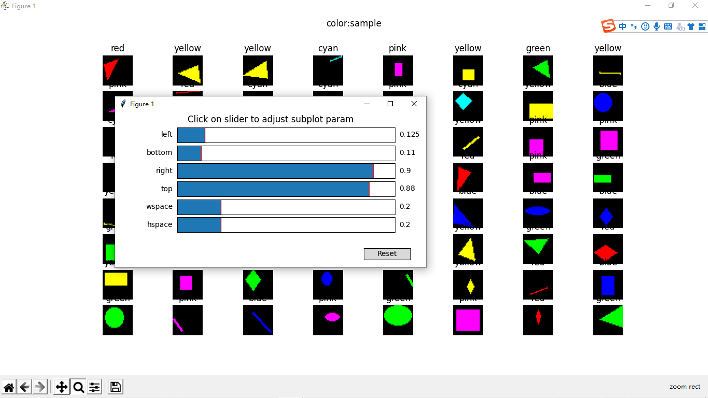
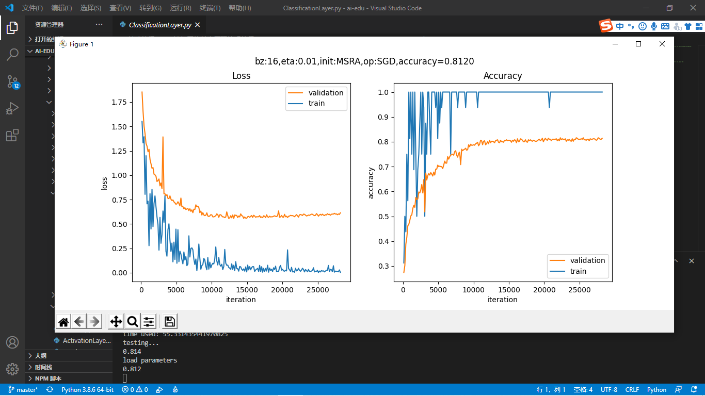
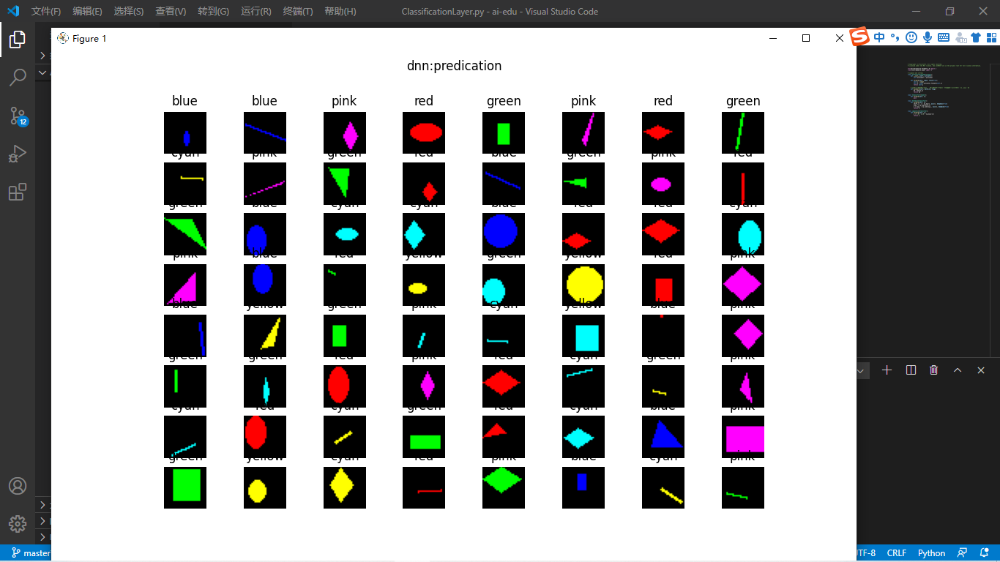
代码运行示例：
ch18，level2
代码效果：
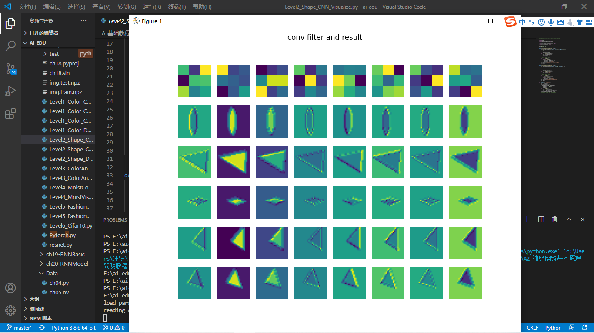
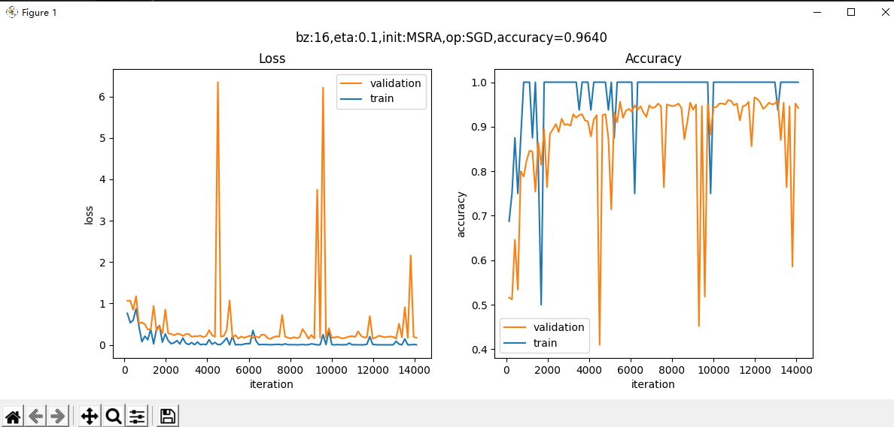
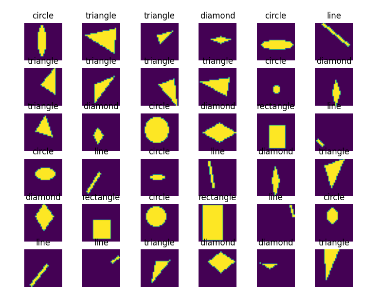
代码运行示例：
ch18，level3
代码效果
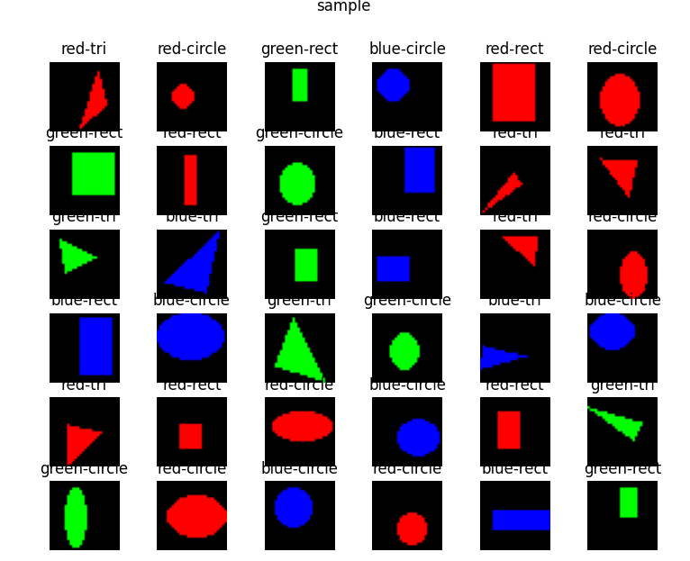
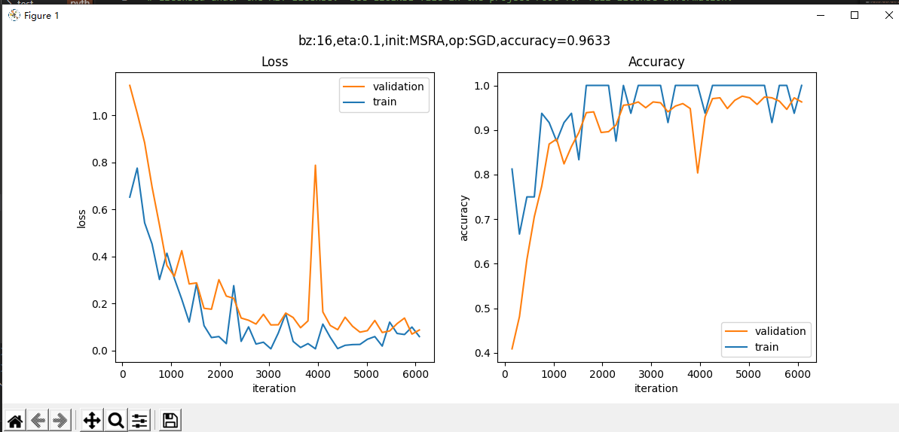
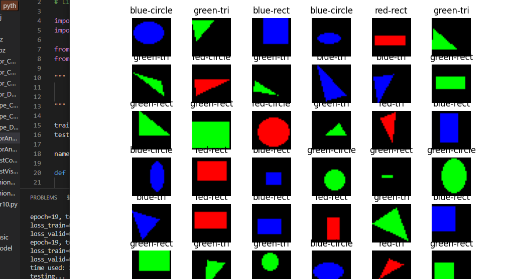
代码运行示例：
ch18，level4
代码效果：
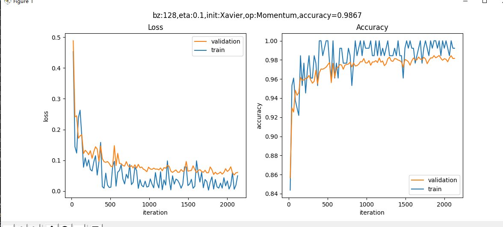
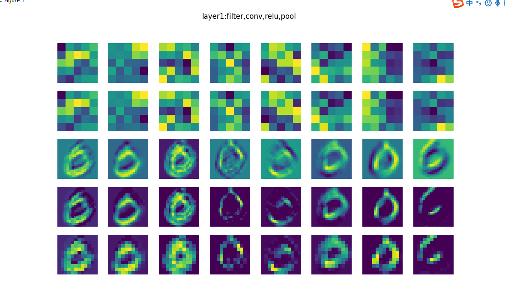

## 学习总结和心得体会
1.在测试图形形状时，DNN的速度明显快于CNN。
2.当增加卷积核数量时，精确度能够得到提升，但是代码跑的时间也会增长。
3.CNN在图像识别的精确度普遍比DNN要高。
4.当将卷积核变大，不能有效的提高精确度，其原因个人分析在于卷积核越小能够有利于提取出更显著的特征。