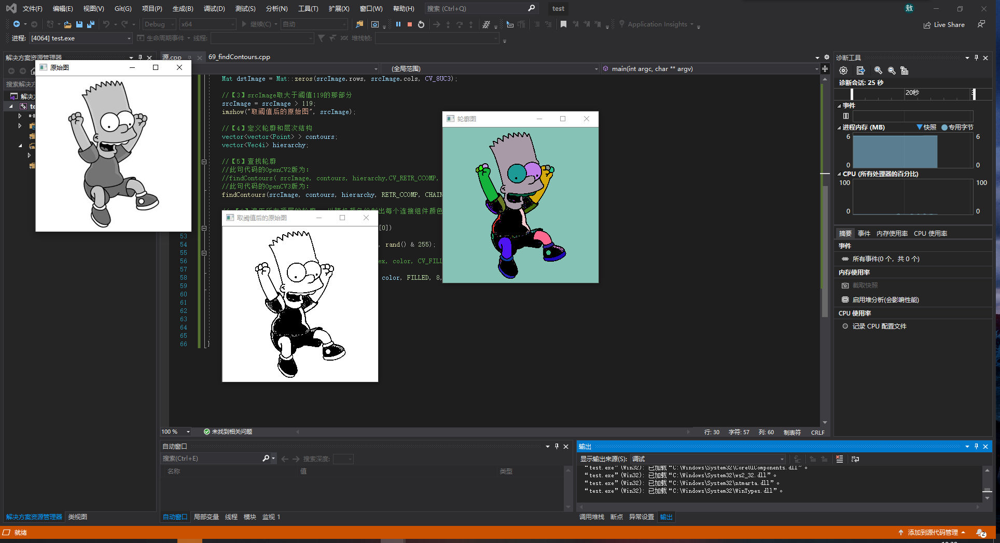
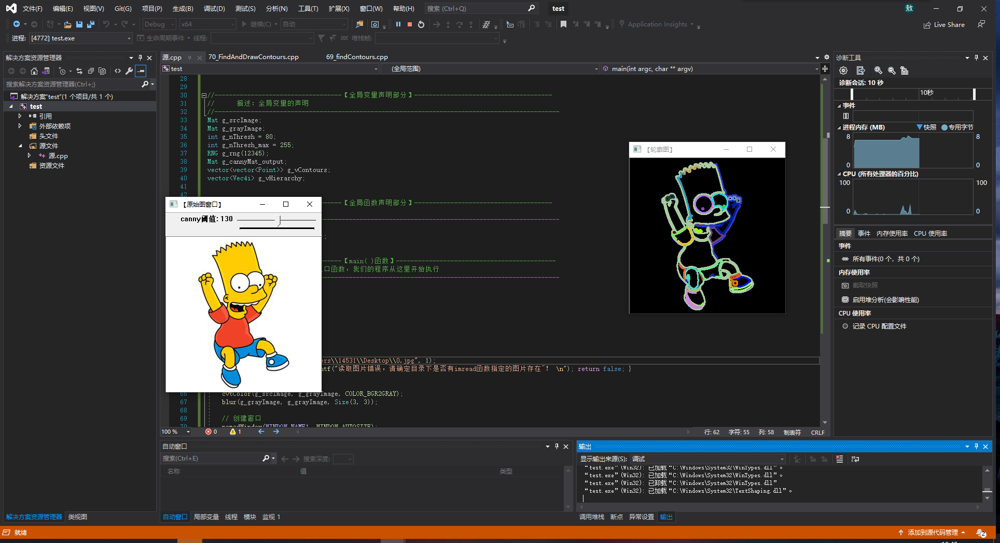
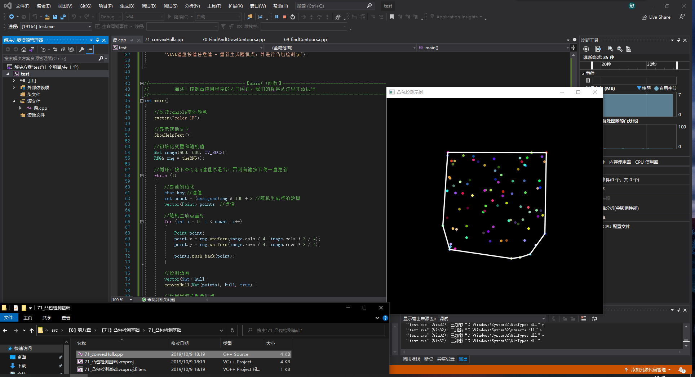
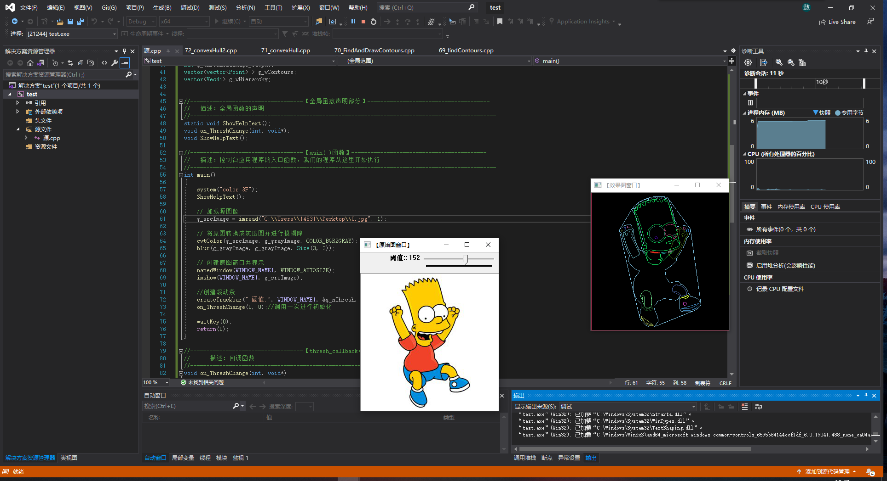
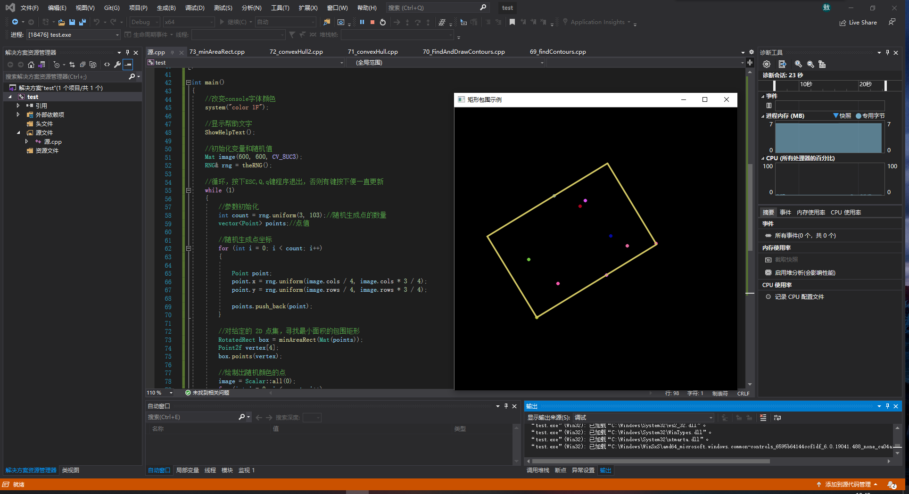
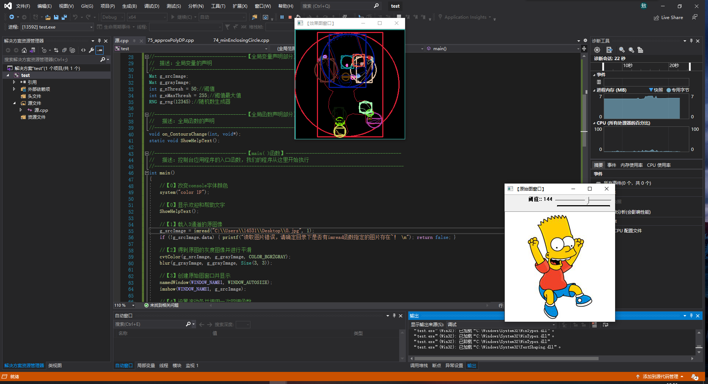
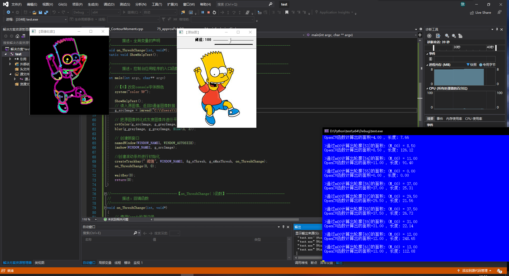
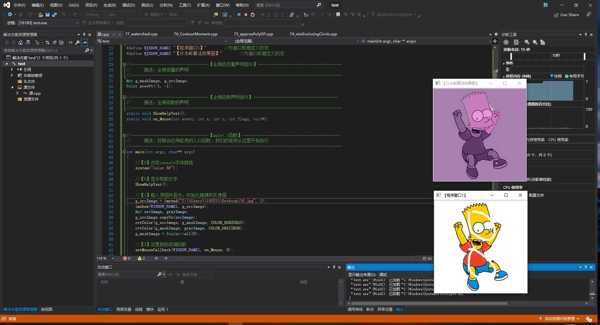
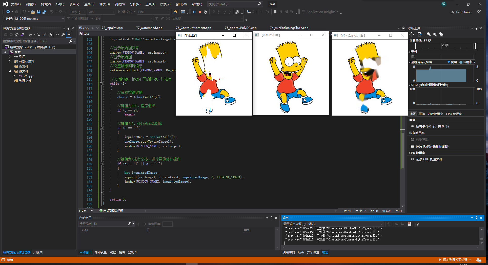

## 69

```

//--------------------------------------【程序说明】-------------------------------------------
//		程序说明：《OpenCV3编程入门》OpenCV3版书本配套示例程序69
//		程序描述：基础轮廓查找——findContours+drawContours
//		开发测试所用操作系统： Windows 7 64bit
//		开发测试所用IDE版本：Visual Studio 2010
//		开发测试所用OpenCV版本：	3.0 beta
//		2014年11月 Created by @浅墨_毛星云
//		2014年12月 Revised by @浅墨_毛星云
//------------------------------------------------------------------------------------------------


//---------------------------------【头文件、命名空间包含部分】----------------------------
//		描述：包含程序所使用的头文件和命名空间
//------------------------------------------------------------------------------------------------
#include <opencv2/opencv.hpp>
#include "opencv2/highgui/highgui.hpp"
#include "opencv2/imgproc/imgproc.hpp"
using namespace cv;
using namespace std;

//-----------------------------------【main( )函数】--------------------------------------------

//		描述：控制台应用程序的入口函数，我们的程序从这里开始
//-------------------------------------------------------------------------------------------------
int main( int argc, char** argv )
{
	// 【1】载入原始图，且必须以二值图模式载入
	Mat srcImage=imread("1.jpg", 0);
	imshow("原始图",srcImage);

	//【2】初始化结果图
	Mat dstImage = Mat::zeros(srcImage.rows, srcImage.cols, CV_8UC3);

	//【3】srcImage取大于阈值119的那部分
	srcImage = srcImage > 119;
	imshow( "取阈值后的原始图", srcImage );

	//【4】定义轮廓和层次结构
	vector<vector<Point> > contours;
	vector<Vec4i> hierarchy;

	//【5】查找轮廓
	//此句代码的OpenCV2版为：
	//findContours( srcImage, contours, hierarchy,CV_RETR_CCOMP, CV_CHAIN_APPROX_SIMPLE );
	//此句代码的OpenCV3版为：
	findContours( srcImage, contours, hierarchy,RETR_CCOMP, CHAIN_APPROX_SIMPLE );

	// 【6】遍历所有顶层的轮廓， 以随机颜色绘制出每个连接组件颜色
	int index = 0;
	for( ; index >= 0; index = hierarchy[index][0] )
	{
		Scalar color( rand()&255, rand()&255, rand()&255 );
		//此句代码的OpenCV2版为：
		//drawContours( dstImage, contours, index, color, CV_FILLED, 8, hierarchy );
		//此句代码的OpenCV3版为：
		drawContours( dstImage, contours, index, color, FILLED, 8, hierarchy );
	}

	//【7】显示最后的轮廓图
	imshow( "轮廓图", dstImage );

	waitKey(0);

}
```

## 70 

```

//--------------------------------------【程序说明】-------------------------------------------
//		程序说明：《OpenCV3编程入门》OpenC3版书本配套示例程序70
//		程序描述：查找并绘制轮廓综合示例
//		开发测试所用操作系统： Windows 7 64bit
//		开发测试所用IDE版本：Visual Studio 2010
//		开发测试所用OpenCV版本：	3.0 beta
//		2014年11月 Created by @浅墨_毛星云
//		2014年12月 Revised by @浅墨_毛星云
//------------------------------------------------------------------------------------------------


//---------------------------------【头文件、命名空间包含部分】----------------------------
//		描述：包含程序所使用的头文件和命名空间
//------------------------------------------------------------------------------------------------
#include "opencv2/highgui/highgui.hpp"
#include "opencv2/imgproc/imgproc.hpp"
#include <iostream>
using namespace cv;
using namespace std;


//-----------------------------------【宏定义部分】-------------------------------------------- 
//		描述：定义一些辅助宏 
//------------------------------------------------------------------------------------------------ 
#define WINDOW_NAME1 "【原始图窗口】"			//为窗口标题定义的宏 
#define WINDOW_NAME2 "【轮廓图】"					//为窗口标题定义的宏 


//-----------------------------------【全局变量声明部分】--------------------------------------
//		描述：全局变量的声明
//-----------------------------------------------------------------------------------------------
Mat g_srcImage; 
Mat g_grayImage;
int g_nThresh = 80;
int g_nThresh_max = 255;
RNG g_rng(12345);
Mat g_cannyMat_output;
vector<vector<Point>> g_vContours;
vector<Vec4i> g_vHierarchy;


//-----------------------------------【全局函数声明部分】--------------------------------------
//		描述：全局函数的声明
//-----------------------------------------------------------------------------------------------
static void ShowHelpText( );
void on_ThreshChange(int, void* );


//-----------------------------------【main( )函数】--------------------------------------------
//		描述：控制台应用程序的入口函数，我们的程序从这里开始执行
//-----------------------------------------------------------------------------------------------
int main( int argc, char** argv )
{
	//【0】改变console字体颜色
	system("color 1F"); 

	//【0】显示欢迎和帮助文字
	ShowHelpText( );

	// 加载源图像
	g_srcImage = imread( "1.jpg", 1 );
	if(!g_srcImage.data ) { printf("读取图片错误，请确定目录下是否有imread函数指定的图片存在~！ \n"); return false; } 

	// 转成灰度并模糊化降噪
	cvtColor( g_srcImage, g_grayImage, COLOR_BGR2GRAY );
	blur( g_grayImage, g_grayImage, Size(3,3) );

	// 创建窗口
	namedWindow( WINDOW_NAME1, WINDOW_AUTOSIZE );
	imshow( WINDOW_NAME1, g_srcImage );

	//创建滚动条并初始化
	createTrackbar( "canny阈值", WINDOW_NAME1, &g_nThresh, g_nThresh_max, on_ThreshChange );
	on_ThreshChange( 0, 0 );

	waitKey(0);
	return(0);
}

//-----------------------------------【on_ThreshChange( )函数】------------------------------  
//      描述：回调函数
//----------------------------------------------------------------------------------------------  
void on_ThreshChange(int, void* )
{

	// 用Canny算子检测边缘
	Canny( g_grayImage, g_cannyMat_output, g_nThresh, g_nThresh*2, 3 );

	// 寻找轮廓
	findContours( g_cannyMat_output, g_vContours, g_vHierarchy, RETR_TREE, CHAIN_APPROX_SIMPLE, Point(0, 0) );

	// 绘出轮廓
	Mat drawing = Mat::zeros( g_cannyMat_output.size(), CV_8UC3 );
	for( int i = 0; i< g_vContours.size(); i++ )
	{
		Scalar color = Scalar( g_rng.uniform(0, 255), g_rng.uniform(0,255), g_rng.uniform(0,255) );//任意值
		drawContours( drawing, g_vContours, i, color, 2, 8, g_vHierarchy, 0, Point() );
	}

	// 显示效果图
	imshow( WINDOW_NAME2, drawing );
}


//-----------------------------------【ShowHelpText( )函数】----------------------------------  
//      描述：输出一些帮助信息  
//----------------------------------------------------------------------------------------------  
static void ShowHelpText()  
{  
	//输出欢迎信息和OpenCV版本
	printf("\n\n\t\t\t非常感谢购买《OpenCV3编程入门》一书！\n");
	printf("\n\n\t\t\t此为本书OpenCV3版的第70个配套示例程序\n");
	printf("\n\n\t\t\t   当前使用的OpenCV版本为：" CV_VERSION );
	printf("\n\n  ----------------------------------------------------------------------------\n");

	//输出一些帮助信息  
	printf(   "\n\n\t欢迎来到【在图形中寻找轮廓】示例程序~\n\n");  
	printf(   "\n\n\t按键操作说明: \n\n"  
		"\t\t键盘按键任意键- 退出程序\n\n"  
		"\t\t滑动滚动条-改变阈值\n" );  
}  

```

## 71

```

//--------------------------------------【程序说明】-------------------------------------------
//		程序说明：《OpenCV3编程入门》OpenCV3版书本配套示例程序71
//		程序描述：凸包检测基础
//		开发测试所用操作系统： Windows 7 64bit
//		开发测试所用IDE版本：Visual Studio 2010
//		开发测试所用OpenCV版本：	3.0 beta
//		2014年11月 Created by @浅墨_毛星云
//		2014年12月 Revised by @浅墨_毛星云
//------------------------------------------------------------------------------------------------


//---------------------------------【头文件、命名空间包含部分】----------------------------
//		描述：包含程序所使用的头文件和命名空间
//------------------------------------------------------------------------------------------------
#include "opencv2/imgproc/imgproc.hpp"
#include "opencv2/highgui/highgui.hpp"
#include <iostream>
using namespace cv;
using namespace std;

//-----------------------------------【ShowHelpText( )函数】----------------------------------
//          描述：输出一些帮助信息
//----------------------------------------------------------------------------------------------
static void ShowHelpText()
{
	//输出欢迎信息和OpenCV版本
	printf("\n\n\t\t\t非常感谢购买《OpenCV3编程入门》一书！\n");
	printf("\n\n\t\t\t此为本书OpenCV3版的第71个配套示例程序\n");
	printf("\n\n\t\t\t   当前使用的OpenCV版本为：" CV_VERSION );
	printf("\n\n  ----------------------------------------------------------------------------\n");
	//输出一些帮助信息
	printf("\n\t欢迎来到【凸包检测】示例程序~\n\n"); 
	printf("\n\t按键操作说明: \n\n" 
		"\t\t键盘按键【ESC】、【Q】、【q】- 退出程序\n\n" 
		"\t\t键盘按键任意键 - 重新生成随机点，并进行凸包检测\n"  );  

}


//--------------------------------------【main( )函数】-----------------------------------------
//          描述：控制台应用程序的入口函数，我们的程序从这里开始执行
//-----------------------------------------------------------------------------------------------
int main( )
{
	//改变console字体颜色
	system("color 1F"); 

	//显示帮助文字
	ShowHelpText();

	//初始化变量和随机值
	Mat image(600, 600, CV_8UC3);
	RNG& rng = theRNG();

	//循环，按下ESC,Q,q键程序退出，否则有键按下便一直更新
	while(1)
	{
		//参数初始化
		char key;//键值
		int count = (unsigned)rng%100 + 3;//随机生成点的数量
		vector<Point> points; //点值

		//随机生成点坐标
		for(int i = 0; i < count; i++ )
		{
			Point point;
			point.x = rng.uniform(image.cols/4, image.cols*3/4);
			point.y = rng.uniform(image.rows/4, image.rows*3/4);

			points.push_back(point);
		}

		//检测凸包
		vector<int> hull;
		convexHull(Mat(points), hull, true);

		//绘制出随机颜色的点
		image = Scalar::all(0);
		for(int i = 0; i < count; i++ )
			circle(image, points[i], 3, Scalar(rng.uniform(0, 255), rng.uniform(0, 255), rng.uniform(0, 255)), FILLED, LINE_AA);

		//准备参数
		int hullcount = (int)hull.size();//凸包的边数
		Point point0 = points[hull[hullcount-1]];//连接凸包边的坐标点

		//绘制凸包的边
		for(int  i = 0; i < hullcount; i++ )
		{
			Point point = points[hull[i]];
			line(image, point0, point, Scalar(255, 255, 255), 2, LINE_AA);
			point0 = point;
		}

		//显示效果图
		imshow("凸包检测示例", image);

		//按下ESC,Q,或者q，程序退出
		key = (char)waitKey();
		if( key == 27 || key == 'q' || key == 'Q' ) 
			break;
	}

	return 0;
}
```

## 72

```

//--------------------------------------【程序说明】-------------------------------------------
//		程序说明：《OpenCV3编程入门》OpenCV2版书本配套示例程序72
//		程序描述：寻找和绘制物体的凸包
//		开发测试所用操作系统： Windows 7 64bit
//		开发测试所用IDE版本：Visual Studio 2010
//		开发测试所用OpenCV版本：	3.0 beta
//		2014年11月 Created by @浅墨_毛星云
//		2014年12月 Revised by @浅墨_毛星云
//------------------------------------------------------------------------------------------------


//---------------------------------【头文件、命名空间包含部分】----------------------------
//		描述：包含程序所使用的头文件和命名空间
//------------------------------------------------------------------------------------------------
#include "opencv2/highgui/highgui.hpp"
#include "opencv2/imgproc/imgproc.hpp"
#include <iostream>
using namespace cv;
using namespace std;


//-----------------------------------【宏定义部分】-------------------------------------------- 
//  描述：定义一些辅助宏 
//------------------------------------------------------------------------------------------------ 
#define WINDOW_NAME1 "【原始图窗口】"					//为窗口标题定义的宏 
#define WINDOW_NAME2 "【效果图窗口】"					//为窗口标题定义的宏 


//-----------------------------------【全局变量声明部分】--------------------------------------
//  描述：全局变量的声明
//-----------------------------------------------------------------------------------------------
Mat g_srcImage; Mat g_grayImage;
int g_nThresh = 50;
int g_maxThresh = 255;
RNG g_rng(12345);
Mat srcImage_copy = g_srcImage.clone();
Mat g_thresholdImage_output;
vector<vector<Point> > g_vContours;
vector<Vec4i> g_vHierarchy;


//-----------------------------------【全局函数声明部分】--------------------------------------
//   描述：全局函数的声明
//-----------------------------------------------------------------------------------------------
static void ShowHelpText( );
void on_ThreshChange(int, void* );
void ShowHelpText();

//-----------------------------------【main( )函数】------------------------------------------
//   描述：控制台应用程序的入口函数，我们的程序从这里开始执行
//-----------------------------------------------------------------------------------------------
int main(  )
{
	system("color 3F");
	ShowHelpText();

	// 加载源图像
	g_srcImage = imread( "1.jpg", 1 );

	// 将原图转换成灰度图并进行模糊降
	cvtColor( g_srcImage, g_grayImage, COLOR_BGR2GRAY );
	blur( g_grayImage, g_grayImage, Size(3,3) );

	// 创建原图窗口并显示
	namedWindow( WINDOW_NAME1, WINDOW_AUTOSIZE );
	imshow( WINDOW_NAME1, g_srcImage );

	//创建滚动条
	createTrackbar( " 阈值:", WINDOW_NAME1, &g_nThresh, g_maxThresh, on_ThreshChange );
	on_ThreshChange( 0, 0 );//调用一次进行初始化

	waitKey(0);
	return(0);
}

//-----------------------------------【thresh_callback( )函数】----------------------------------  
//      描述：回调函数
//----------------------------------------------------------------------------------------------  
void on_ThreshChange(int, void* )
{
	// 对图像进行二值化，控制阈值
	threshold( g_grayImage, g_thresholdImage_output, g_nThresh, 255, THRESH_BINARY );

	// 寻找轮廓
	findContours( g_thresholdImage_output, g_vContours, g_vHierarchy, RETR_TREE, CHAIN_APPROX_SIMPLE, Point(0, 0) );

	// 遍历每个轮廓，寻找其凸包
	vector<vector<Point> >hull( g_vContours.size() );
	for( unsigned int i = 0; i < g_vContours.size(); i++ )
	{  
		convexHull( Mat(g_vContours[i]), hull[i], false );
	}

	// 绘出轮廓及其凸包
	Mat drawing = Mat::zeros( g_thresholdImage_output.size(), CV_8UC3 );
	for(unsigned  int i = 0; i< g_vContours.size(); i++ )
	{
		Scalar color = Scalar( g_rng.uniform(0, 255), g_rng.uniform(0,255), g_rng.uniform(0,255) );
		drawContours( drawing, g_vContours, i, color, 1, 8, vector<Vec4i>(), 0, Point() );
		drawContours( drawing, hull, i, color, 1, 8, vector<Vec4i>(), 0, Point() );
	}

	// 显示效果图
	imshow( WINDOW_NAME2, drawing );
}


//-----------------------------------【ShowHelpText( )函数】-----------------------------
//		 描述：输出一些帮助信息
//----------------------------------------------------------------------------------------------
void ShowHelpText()
{
	//输出欢迎信息和OpenCV版本
	printf("\n\n\t\t\t非常感谢购买《OpenCV3编程入门》一书！\n");
	printf("\n\n\t\t\t此为本书OpenCV3版的第72个配套示例程序\n");
	printf("\n\n\t\t\t   当前使用的OpenCV版本为：" CV_VERSION );
	printf("\n\n  ----------------------------------------------------------------------------\n");
}
```

## 73

```
//--------------------------------------【程序说明】-------------------------------------------
//		程序说明：《OpenCV3编程入门》OpenCV3版书本配套示例程序73
//		程序描述：创建包围轮廓的矩形边界
//		开发测试所用操作系统： Windows 7 64bit
//		开发测试所用IDE版本：Visual Studio 2010
//		开发测试所用OpenCV版本：	3.0 beta
//		2014年11月 Created by @浅墨_毛星云
//		2014年12月 Revised by @浅墨_毛星云
//------------------------------------------------------------------------------------------------


//---------------------------------【头文件、命名空间包含部分】----------------------------
//		描述：包含程序所使用的头文件和命名空间
//------------------------------------------------------------------------------------------------
#include "opencv2/highgui/highgui.hpp"
#include "opencv2/imgproc/imgproc.hpp"
using namespace cv;
using namespace std;


//-----------------------------------【ShowHelpText( )函数】-----------------------------
//          描述：输出一些帮助信息
//----------------------------------------------------------------------------------------------
static void ShowHelpText()
{

	//输出欢迎信息和OpenCV版本
	printf("\n\n\t\t\t非常感谢购买《OpenCV3编程入门》一书！\n");
	printf("\n\n\t\t\t此为本书OpenCV3版的第73个配套示例程序\n");
	printf("\n\n\t\t\t   当前使用的OpenCV版本为：" CV_VERSION );
	printf("\n\n  ----------------------------------------------------------------------------\n");

	//输出一些帮助信息
	printf("\n\n\n\t\t\t欢迎来到【矩形包围示例】示例程序~\n\n"); 
	printf("\n\n\t按键操作说明: \n\n" 
		"\t\t键盘按键【ESC】、【Q】、【q】- 退出程序\n\n" 
		"\t\t键盘按键任意键 - 重新生成随机点，并寻找最小面积的包围矩形\n" );  
}

int main(  )
{
	//改变console字体颜色
	system("color 1F"); 

	//显示帮助文字
	ShowHelpText();

	//初始化变量和随机值
	Mat image(600, 600, CV_8UC3);
	RNG& rng = theRNG();

	//循环，按下ESC,Q,q键程序退出，否则有键按下便一直更新
	while(1)
	{
		//参数初始化
		int count = rng.uniform(3, 103);//随机生成点的数量
		vector<Point> points;//点值

		//随机生成点坐标
		for(int  i = 0; i < count; i++ )
		{

			Point point;
			point.x = rng.uniform(image.cols/4, image.cols*3/4);
			point.y = rng.uniform(image.rows/4, image.rows*3/4);

			points.push_back(point);
		}

		//对给定的 2D 点集，寻找最小面积的包围矩形
		RotatedRect box = minAreaRect(Mat(points));
		Point2f vertex[4];
		box.points(vertex);

		//绘制出随机颜色的点
		image = Scalar::all(0);
		for( int i = 0; i < count; i++ )
			circle( image, points[i], 3, Scalar(rng.uniform(0, 255), rng.uniform(0, 255), rng.uniform(0, 255)), FILLED, LINE_AA );


		//绘制出最小面积的包围矩形
		for( int i = 0; i < 4; i++ )
			line(image, vertex[i], vertex[(i+1)%4], Scalar(100, 200, 211), 2, LINE_AA);

		//显示窗口
		imshow( "矩形包围示例", image );

		//按下ESC,Q,或者q，程序退出
		char key = (char)waitKey();
		if( key == 27 || key == 'q' || key == 'Q' ) // 'ESC'
			break;
	}

	return 0;
}
```

## 74

```
//--------------------------------------【程序说明】-------------------------------------------
//		程序说明：《OpenCV3编程入门》OpenCV3版书本配套示例程序74
//		程序描述：创建包围轮廓的圆形边界
//		开发测试所用操作系统： Windows 7 64bit
//		开发测试所用IDE版本：Visual Studio 2010
//		开发测试所用OpenCV版本：	3.0 beta
//		2014年11月 Created by @浅墨_毛星云
//		2014年12月 Revised by @浅墨_毛星云
//------------------------------------------------------------------------------------------------


//---------------------------------【头文件、命名空间包含部分】----------------------------
//		描述：包含程序所使用的头文件和命名空间
//------------------------------------------------------------------------------------------------
#include "opencv2/highgui/highgui.hpp"
#include "opencv2/imgproc/imgproc.hpp"
using namespace cv;
using namespace std;

//-----------------------------------【ShowHelpText( )函数】----------------------------------
//          描述：输出一些帮助信息
//----------------------------------------------------------------------------------------------
static void ShowHelpText()
{

	//输出欢迎信息和OpenCV版本
	printf("\n\n\t\t\t非常感谢购买《OpenCV3编程入门》一书！\n");
	printf("\n\n\t\t\t此为本书OpenCV3版的第13个配套示例程序\n");
	printf("\n\n\t\t\t   当前使用的OpenCV版本为：" CV_VERSION );
	printf("\n\n  ----------------------------------------------------------------------------\n");

	//输出一些帮助信息
	printf("\n\n\t\t\t欢迎来到【寻找最小面积的包围圆】示例程序~\n"); 
	printf("\n\n\t按键操作说明: \n\n" 
		"\t\t键盘按键【ESC】、【Q】、【q】- 退出程序\n\n" 
		"\t\t键盘按键任意键 - 重新生成随机点，并寻找最小面积的包围圆\n" );  
}

int main(  )
{
	//改变console字体颜色
	system("color 1F"); 

	//显示帮助文字
	ShowHelpText();

	//初始化变量和随机值
	Mat image(600, 600, CV_8UC3);
	RNG& rng = theRNG();

	//循环，按下ESC,Q,q键程序退出，否则有键按下便一直更新
	while(1)
	{
		//参数初始化
		int count = rng.uniform(3, 103);//随机生成点的数量
		vector<Point> points;//点值

		//随机生成点坐标
		for(int  i = 0; i < count; i++ )
		{

			Point point;
			point.x = rng.uniform(image.cols/4, image.cols*3/4);
			point.y = rng.uniform(image.rows/4, image.rows*3/4);

			points.push_back(point);
		}

		//对给定的 2D 点集，寻找最小面积的包围圆
		Point2f center;
		float radius = 0;
		minEnclosingCircle(Mat(points), center, radius);

		//绘制出随机颜色的点
		image = Scalar::all(0);
		for( int i = 0; i < count; i++ )
			circle( image, points[i], 3, Scalar(rng.uniform(0, 255), rng.uniform(0, 255), rng.uniform(0, 255)), FILLED, LINE_AA );


		//绘制出最小面积的包围圆
		circle(image, center, cvRound(radius), Scalar(rng.uniform(0, 255), rng.uniform(0, 255), rng.uniform(0, 255)), 2, LINE_AA);

		//显示窗口
		imshow( "圆形包围示例", image );

		//按下ESC,Q,或者q，程序退出
		char key = (char)waitKey();
		if( key == 27 || key == 'q' || key == 'Q' ) // 'ESC'
			break;
	}

	return 0;
}
```

## 75

```

//--------------------------------------【程序说明】-------------------------------------------
//		程序说明：《OpenCV3编程入门》OpenCV3版书本配套示例程序75
//		程序描述：创建轮廓边界框
//		开发测试所用操作系统： Windows 7 64bit
//		开发测试所用IDE版本：Visual Studio 2010
//		开发测试所用OpenCV版本：	3.0 beta
//		2014年11月 Created by @浅墨_毛星云
//		2014年12月 Revised by @浅墨_毛星云
//------------------------------------------------------------------------------------------------


//---------------------------------【头文件、命名空间包含部分】----------------------------
//		描述：包含程序所使用的头文件和命名空间
//------------------------------------------------------------------------------------------------
#include "opencv2/highgui/highgui.hpp"
#include "opencv2/imgproc/imgproc.hpp"
using namespace cv;
using namespace std;

//-----------------------------------【宏定义部分】-------------------------------------------- 
//  描述：定义一些辅助宏 
//------------------------------------------------------------------------------------------------ 
#define WINDOW_NAME1 "【原始图窗口】"        //为窗口标题定义的宏 
#define WINDOW_NAME2 "【效果图窗口】"        //为窗口标题定义的宏 

//-----------------------------------【全局变量声明部分】--------------------------------------
//  描述：全局变量的声明
//-----------------------------------------------------------------------------------------------
Mat g_srcImage;
Mat g_grayImage;
int g_nThresh = 50;//阈值
int g_nMaxThresh = 255;//阈值最大值
RNG g_rng(12345);//随机数生成器

//-----------------------------------【全局函数声明部分】--------------------------------------
//   描述：全局函数的声明
//-----------------------------------------------------------------------------------------------
void on_ContoursChange(int, void* );
static void ShowHelpText( );

//-----------------------------------【main( )函数】--------------------------------------------
//   描述：控制台应用程序的入口函数，我们的程序从这里开始执行
//-----------------------------------------------------------------------------------------------
int main( )
{
	//【0】改变console字体颜色
	system("color 1F"); 

	//【0】显示欢迎和帮助文字
	ShowHelpText( );

	//【1】载入3通道的原图像
	g_srcImage = imread( "1.jpg", 1 );
	if(!g_srcImage.data ) { printf("读取图片错误，请确定目录下是否有imread函数指定的图片存在~！ \n"); return false; }  

	//【2】得到原图的灰度图像并进行平滑
	cvtColor( g_srcImage, g_grayImage, COLOR_BGR2GRAY );
	blur( g_grayImage, g_grayImage, Size(3,3) );

	//【3】创建原始图窗口并显示
	namedWindow( WINDOW_NAME1, WINDOW_AUTOSIZE );
	imshow( WINDOW_NAME1, g_srcImage );

	//【4】设置滚动条并调用一次回调函数
	createTrackbar( " 阈值:", WINDOW_NAME1, &g_nThresh, g_nMaxThresh, on_ContoursChange );
	on_ContoursChange( 0, 0 );

	waitKey(0);

	return(0);
}

//----------------------------【on_ContoursChange( )函数】---------------------------------
//      描述：回调函数
//-------------------------------------------------------------------------------------------------  
void on_ContoursChange(int, void* )
{
	//定义一些参数
	Mat threshold_output;
	vector<vector<Point>> contours;
	vector<Vec4i> hierarchy;

	// 使用Threshold检测边缘
	threshold( g_grayImage, threshold_output, g_nThresh, 255, THRESH_BINARY );

	// 找出轮廓
	findContours( threshold_output, contours, hierarchy, RETR_TREE, CHAIN_APPROX_SIMPLE, Point(0, 0) );

	// 多边形逼近轮廓 + 获取矩形和圆形边界框
	vector<vector<Point> > contours_poly( contours.size() );
	vector<Rect> boundRect( contours.size() );
	vector<Point2f>center( contours.size() );
	vector<float>radius( contours.size() );

	//一个循环，遍历所有部分，进行本程序最核心的操作
	for( unsigned int i = 0; i < contours.size(); i++ )
	{ 
		approxPolyDP( Mat(contours[i]), contours_poly[i], 3, true );//用指定精度逼近多边形曲线 
		boundRect[i] = boundingRect( Mat(contours_poly[i]) );//计算点集的最外面（up-right）矩形边界
		minEnclosingCircle( contours_poly[i], center[i], radius[i] );//对给定的 2D点集，寻找最小面积的包围圆形 
	}

	// 绘制多边形轮廓 + 包围的矩形框 + 圆形框
	Mat drawing = Mat::zeros( threshold_output.size(), CV_8UC3 );
	for( int unsigned i = 0; i<contours.size( ); i++ )
	{
		Scalar color = Scalar( g_rng.uniform(0, 255), g_rng.uniform(0,255), g_rng.uniform(0,255) );//随机设置颜色
		drawContours( drawing, contours_poly, i, color, 1, 8, vector<Vec4i>(), 0, Point() );//绘制轮廓
		rectangle( drawing, boundRect[i].tl(), boundRect[i].br(), color, 2, 8, 0 );//绘制矩形
		circle( drawing, center[i], (int)radius[i], color, 2, 8, 0 );//绘制圆
	}

	// 显示效果图窗口
	namedWindow( WINDOW_NAME2, WINDOW_AUTOSIZE );
	imshow( WINDOW_NAME2, drawing );
}

//-----------------------------------【ShowHelpText( )函数】----------------------------------  
//      描述：输出一些帮助信息  
//----------------------------------------------------------------------------------------------  
static void ShowHelpText()  
{  
	//输出欢迎信息和OpenCV版本
	printf("\n\n\t\t\t非常感谢购买《OpenCV3编程入门》一书！\n");
	printf("\n\n\t\t\t此为本书OpenCV3版的第75个配套示例程序\n");
	printf("\n\n\t\t\t   当前使用的OpenCV版本为：" CV_VERSION );
	printf("\n\n  ----------------------------------------------------------------------------\n");

	//输出一些帮助信息  
	printf("\n\n\n\t欢迎来到【创建包围轮廓的矩形和圆形边界框】示例程序~\n\n");  
	printf( "\n\n\t按键操作说明: \n\n"  
		"\t\t键盘按键【ESC】- 退出程序\n\n"  
		"\t\t滑动滚动条 - 改变阈值\n\n");  
}  

```

## 76

```

//--------------------------------------【程序说明】-------------------------------------------
//		程序说明：《OpenCV3编程入门》OpenCV3版书本配套示例程序76
//		程序描述：查找和绘制图片轮廓矩
//		开发测试所用操作系统： Windows 7 64bit
//		开发测试所用IDE版本：Visual Studio 2010
//		开发测试所用OpenCV版本：	3.0 beta
//		2014年11月 Created by @浅墨_毛星云
//		2014年12月 Revised by @浅墨_毛星云
//------------------------------------------------------------------------------------------------


//---------------------------------【头文件、命名空间包含部分】----------------------------
//		描述：包含程序所使用的头文件和命名空间
//------------------------------------------------------------------------------------------------
#include "opencv2/highgui/highgui.hpp"
#include "opencv2/imgproc/imgproc.hpp"
#include <iostream>
using namespace cv;
using namespace std;


//-----------------------------------【宏定义部分】-------------------------------------------- 
//		描述：定义一些辅助宏 
//------------------------------------------------------------------------------------------------ 
#define WINDOW_NAME1 "【原始图】"					//为窗口标题定义的宏 
#define WINDOW_NAME2 "【图像轮廓】"        //为窗口标题定义的宏 


//-----------------------------------【全局变量声明部分】--------------------------------------
//		描述：全局变量的声明
//-----------------------------------------------------------------------------------------------
Mat g_srcImage; Mat g_grayImage;
int g_nThresh = 100;
int g_nMaxThresh = 255;
RNG g_rng(12345);
Mat g_cannyMat_output;
vector<vector<Point> > g_vContours;
vector<Vec4i> g_vHierarchy;

//-----------------------------------【全局变量声明部分】--------------------------------------
//		描述：全局变量的声明
//-----------------------------------------------------------------------------------------------
void on_ThreshChange(int, void* );
static void ShowHelpText( );

//-----------------------------------【main( )函数】--------------------------------------------
//		描述：控制台应用程序的入口函数，我们的程序从这里开始执行
//-----------------------------------------------------------------------------------------------
int main( int argc, char** argv )
{
	//【0】改变console字体颜色
	system("color 9F"); 

	ShowHelpText();
	// 读入原图像, 返回3通道图像数据
	g_srcImage = imread( "1.jpg", 1 );

	// 把原图像转化成灰度图像并进行平滑
	cvtColor( g_srcImage, g_grayImage, COLOR_BGR2GRAY );
	blur( g_grayImage, g_grayImage, Size(3,3) );

	// 创建新窗口
	namedWindow( WINDOW_NAME1, WINDOW_AUTOSIZE );
	imshow( WINDOW_NAME1, g_srcImage );

	//创建滚动条并进行初始化
	createTrackbar( " 阈值", WINDOW_NAME1, &g_nThresh, g_nMaxThresh, on_ThreshChange );
	on_ThreshChange( 0, 0 );

	waitKey(0);
	return(0);
}

//-----------------------------------【on_ThreshChange( )函数】-------------------------------
//		描述：回调函数
//-----------------------------------------------------------------------------------------------
void on_ThreshChange(int, void* )
{
	// 使用Canndy检测边缘
	Canny( g_grayImage, g_cannyMat_output, g_nThresh, g_nThresh*2, 3 );

	// 找到轮廓
	findContours( g_cannyMat_output, g_vContours, g_vHierarchy, RETR_TREE, CHAIN_APPROX_SIMPLE, Point(0, 0) );

	// 计算矩
	vector<Moments> mu(g_vContours.size() );
	for(unsigned int i = 0; i < g_vContours.size(); i++ )
	{ mu[i] = moments( g_vContours[i], false ); }

	//  计算中心矩
	vector<Point2f> mc( g_vContours.size() );
	for( unsigned int i = 0; i < g_vContours.size(); i++ )
	{ mc[i] = Point2f( static_cast<float>(mu[i].m10/mu[i].m00), static_cast<float>(mu[i].m01/mu[i].m00 )); }

	// 绘制轮廓
	Mat drawing = Mat::zeros( g_cannyMat_output.size(), CV_8UC3 );
	for( unsigned int i = 0; i< g_vContours.size(); i++ )
	{
		Scalar color = Scalar( g_rng.uniform(0, 255), g_rng.uniform(0,255), g_rng.uniform(0,255) );//随机生成颜色值
		drawContours( drawing, g_vContours, i, color, 2, 8, g_vHierarchy, 0, Point() );//绘制外层和内层轮廓
		circle( drawing, mc[i], 4, color, -1, 8, 0 );;//绘制圆
	}

	// 显示到窗口中
	namedWindow( WINDOW_NAME2, WINDOW_AUTOSIZE );
	imshow( WINDOW_NAME2, drawing );

	// 通过m00计算轮廓面积并且和OpenCV函数比较
	printf("\t 输出内容: 面积和轮廓长度\n");
	for(unsigned  int i = 0; i< g_vContours.size(); i++ )
	{
		printf(" >通过m00计算出轮廓[%d]的面积: (M_00) = %.2f \n OpenCV函数计算出的面积=%.2f , 长度: %.2f \n\n", i, mu[i].m00, contourArea(g_vContours[i]), arcLength( g_vContours[i], true ) );
		Scalar color = Scalar( g_rng.uniform(0, 255), g_rng.uniform(0,255), g_rng.uniform(0,255) );
		drawContours( drawing, g_vContours, i, color, 2, 8, g_vHierarchy, 0, Point() );
		circle( drawing, mc[i], 4, color, -1, 8, 0 );
	}
}


//-----------------------------------【ShowHelpText( )函数】-----------------------------
//		 描述：输出一些帮助信息
//----------------------------------------------------------------------------------------------
void ShowHelpText()
{
	//输出欢迎信息和OpenCV版本
	printf("\n\n\t\t\t非常感谢购买《OpenCV3编程入门》一书！\n");
	printf("\n\n\t\t\t此为本书OpenCV3版的第76个配套示例程序\n");
	printf("\n\n\t\t\t   当前使用的OpenCV版本为：" CV_VERSION );
	printf("\n\n  ----------------------------------------------------------------------------\n");
}
```

## 77

```
//--------------------------------------【程序说明】-------------------------------------------
//		程序说明：《OpenCV3编程入门》OpenCV3版书本配套示例程序77
//		程序描述：分水岭算法综合示例
//		开发测试所用操作系统： Windows 7 64bit
//		开发测试所用IDE版本：Visual Studio 2010
//		开发测试所用OpenCV版本：	3.0 beta
//		2014年11月 Created by @浅墨_毛星云
//		2014年12月 Revised by @浅墨_毛星云
//------------------------------------------------------------------------------------------------


//---------------------------------【头文件、命名空间包含部分】----------------------------
//		描述：包含程序所使用的头文件和命名空间
//------------------------------------------------------------------------------------------------
#include "opencv2/imgproc/imgproc.hpp"
#include "opencv2/highgui/highgui.hpp"
#include <iostream>
using namespace cv;
using namespace std;

//-----------------------------------【宏定义部分】-------------------------------------------- 
//  描述：定义一些辅助宏 
//------------------------------------------------------------------------------------------------ 
#define WINDOW_NAME1 "【程序窗口1】"        //为窗口标题定义的宏 
#define WINDOW_NAME2 "【分水岭算法效果图】"        //为窗口标题定义的宏

//-----------------------------------【全局函变量声明部分】--------------------------------------
//		描述：全局变量的声明
//-----------------------------------------------------------------------------------------------
Mat g_maskImage, g_srcImage;
Point prevPt(-1, -1);

//-----------------------------------【全局函数声明部分】--------------------------------------
//		描述：全局函数的声明
//-----------------------------------------------------------------------------------------------
static void ShowHelpText();
static void on_Mouse( int event, int x, int y, int flags, void* );


//-----------------------------------【main( )函数】--------------------------------------------
//		描述：控制台应用程序的入口函数，我们的程序从这里开始执行
//-----------------------------------------------------------------------------------------------
int main( int argc, char** argv )
{	
	//【0】改变console字体颜色
	system("color 6F"); 

	//【0】显示帮助文字
	ShowHelpText( );

	//【1】载入原图并显示，初始化掩膜和灰度图
	g_srcImage = imread("1.jpg", 1);
	imshow( WINDOW_NAME1, g_srcImage );
	Mat srcImage,grayImage;
	g_srcImage.copyTo(srcImage);
	cvtColor(g_srcImage, g_maskImage, COLOR_BGR2GRAY);
	cvtColor(g_maskImage, grayImage, COLOR_GRAY2BGR);
	g_maskImage = Scalar::all(0);

	//【2】设置鼠标回调函数
	setMouseCallback( WINDOW_NAME1, on_Mouse, 0 );

	//【3】轮询按键，进行处理
	while(1)
	{
		//获取键值
		int c = waitKey(0);

		//若按键键值为ESC时，退出
		if( (char)c == 27 )
			break;

		//按键键值为2时，恢复源图
		if( (char)c == '2' )
		{
			g_maskImage = Scalar::all(0);
			srcImage.copyTo(g_srcImage);
			imshow( "image", g_srcImage );
		}

		//若检测到按键值为1或者空格，则进行处理
		if( (char)c == '1' || (char)c == ' ' )
		{
			//定义一些参数
			int i, j, compCount = 0;
			vector<vector<Point> > contours;
			vector<Vec4i> hierarchy;

			//寻找轮廓
			findContours(g_maskImage, contours, hierarchy, RETR_CCOMP, CHAIN_APPROX_SIMPLE);

			//轮廓为空时的处理
			if( contours.empty() )
				continue;

			//拷贝掩膜
			Mat maskImage(g_maskImage.size(), CV_32S);
			maskImage = Scalar::all(0);

			//循环绘制出轮廓
			for( int index = 0; index >= 0; index = hierarchy[index][0], compCount++ )
				drawContours(maskImage, contours, index, Scalar::all(compCount+1), -1, 8, hierarchy, INT_MAX);

			//compCount为零时的处理
			if( compCount == 0 )
				continue;

			//生成随机颜色
			vector<Vec3b> colorTab;
			for( i = 0; i < compCount; i++ )
			{
				int b = theRNG().uniform(0, 255);
				int g = theRNG().uniform(0, 255);
				int r = theRNG().uniform(0, 255);

				colorTab.push_back(Vec3b((uchar)b, (uchar)g, (uchar)r));
			}

			//计算处理时间并输出到窗口中
			double dTime = (double)getTickCount();
			watershed( srcImage, maskImage );
			dTime = (double)getTickCount() - dTime;
			printf( "\t处理时间 = %gms\n", dTime*1000./getTickFrequency() );

			//双层循环，将分水岭图像遍历存入watershedImage中
			Mat watershedImage(maskImage.size(), CV_8UC3);
			for( i = 0; i < maskImage.rows; i++ )
				for( j = 0; j < maskImage.cols; j++ )
				{
					int index = maskImage.at<int>(i,j);
					if( index == -1 )
						watershedImage.at<Vec3b>(i,j) = Vec3b(255,255,255);
					else if( index <= 0 || index > compCount )
						watershedImage.at<Vec3b>(i,j) = Vec3b(0,0,0);
					else
						watershedImage.at<Vec3b>(i,j) = colorTab[index - 1];
				}

				//混合灰度图和分水岭效果图并显示最终的窗口
				watershedImage = watershedImage*0.5 + grayImage*0.5;
				imshow( WINDOW_NAME2, watershedImage );
		}
	}

	return 0;
}


//-----------------------------------【onMouse( )函数】---------------------------------------
//		描述：鼠标消息回调函数
//-----------------------------------------------------------------------------------------------
static void on_Mouse( int event, int x, int y, int flags, void* )
{
	//处理鼠标不在窗口中的情况
	if( x < 0 || x >= g_srcImage.cols || y < 0 || y >= g_srcImage.rows )
		return;

	//处理鼠标左键相关消息
	if( event == EVENT_LBUTTONUP || !(flags & EVENT_FLAG_LBUTTON) )
		prevPt = Point(-1,-1);
	else if( event == EVENT_LBUTTONDOWN )
		prevPt = Point(x,y);

	//鼠标左键按下并移动，绘制出白色线条
	else if( event == EVENT_MOUSEMOVE && (flags & EVENT_FLAG_LBUTTON) )
	{
		Point pt(x, y);
		if( prevPt.x < 0 )
			prevPt = pt;
		line( g_maskImage, prevPt, pt, Scalar::all(255), 5, 8, 0 );
		line( g_srcImage, prevPt, pt, Scalar::all(255), 5, 8, 0 );
		prevPt = pt;
		imshow(WINDOW_NAME1, g_srcImage);
	}
}


//-----------------------------------【ShowHelpText( )函数】----------------------------------  
//      描述：输出一些帮助信息  
//----------------------------------------------------------------------------------------------  
static void ShowHelpText()  
{  
	//输出欢迎信息和OpenCV版本
	printf("\n\n\t\t\t非常感谢购买《OpenCV3编程入门》一书！\n");
	printf("\n\n\t\t\t此为本书OpenCV3版的第77个配套示例程序\n");
	printf("\n\n\t\t\t   当前使用的OpenCV版本为：" CV_VERSION );
	printf("\n\n  ----------------------------------------------------------------------------\n");

	//输出一些帮助信息  
	printf(  "\n\n\n\t欢迎来到【分水岭算法】示例程序~\n\n");  
	printf(  "\t请先用鼠标在图片窗口中标记出大致的区域，\n\n\t然后再按键【1】或者【SPACE】启动算法。"
		"\n\n\t按键操作说明: \n\n"  
		"\t\t键盘按键【1】或者【SPACE】- 运行的分水岭分割算法\n"  
		"\t\t键盘按键【2】- 恢复原始图片\n"  
		"\t\t键盘按键【ESC】- 退出程序\n\n\n");  
}  
```

## 78

```
//--------------------------------------【程序说明】-------------------------------------------
//		程序说明：《OpenCV3编程入门》OpenCV2版书本配套示例程序78
//		程序描述：图像修补示例
//		开发测试所用操作系统： Windows 7 64bit
//		开发测试所用IDE版本：Visual Studio 2010
//		开发测试所用OpenCV版本：	3.0 beta
//		2014年11月 Created by @浅墨_毛星云
//		2014年12月 Revised by @浅墨_毛星云
//------------------------------------------------------------------------------------------------


//---------------------------------【头文件、命名空间包含部分】----------------------------
//		描述：包含程序所使用的头文件和命名空间
//------------------------------------------------------------------------------------------------
#include "opencv2/highgui/highgui.hpp"
#include "opencv2/imgproc/imgproc.hpp"
#include "opencv2/photo/photo.hpp"
#include <iostream>
using namespace cv;
using namespace std;


//-----------------------------------【宏定义部分】-------------------------------------------- 
//  描述：定义一些辅助宏 
//----------------------------------------------------------------------------------------------
#define WINDOW_NAME0 "【原始图参考】"        //为窗口标题定义的宏 
#define WINDOW_NAME1 "【原始图】"        //为窗口标题定义的宏 
#define WINDOW_NAME2 "【修补后的效果图】"        //为窗口标题定义的宏 


//-----------------------------------【全局变量声明部分】--------------------------------------
//          描述：全局变量声明
//-----------------------------------------------------------------------------------------------
Mat srcImage0,srcImage1, inpaintMask;
Point previousPoint(-1,-1);//原来的点坐标


//-----------------------------------【ShowHelpText( )函数】----------------------------------
//          描述：输出一些帮助信息
//----------------------------------------------------------------------------------------------
static void ShowHelpText( )
{
	//输出欢迎信息和OpenCV版本
	printf("\n\n\t\t\t非常感谢购买《OpenCV3编程入门》一书！\n");
	printf("\n\n\t\t\t此为本书OpenCV3版的第78个配套示例程序\n");
	printf("\n\n\t\t\t   当前使用的OpenCV版本为：" CV_VERSION );
	printf("\n\n  ----------------------------------------------------------------------------\n");

	//输出一些帮助信息
	printf("\n\n\n\t欢迎来到【图像修复】示例程序~\n"); 
	printf(  "\n\t请在进行图像修复操作之前，在【原始图】窗口中进行适量的绘制" 
		"\n\n\t按键操作说明: \n\n" 
		"\t\t【鼠标左键】-在图像上绘制白色线条\n\n"
		"\t\t键盘按键【ESC】- 退出程序\n\n" 
		"\t\t键盘按键【1】或【SPACE】-进行图像修复操作 \n\n"   );  
}


//-----------------------------------【On_Mouse( )函数】--------------------------------
//          描述：响应鼠标消息的回调函数
//----------------------------------------------------------------------------------------------
static void On_Mouse( int event, int x, int y, int flags, void* )
{
	//鼠标左键弹起消息
	if( event == EVENT_LBUTTONUP || !(flags & EVENT_FLAG_LBUTTON) )
		previousPoint = Point(-1,-1);
	//鼠标左键按下消息
	else if( event == EVENT_LBUTTONDOWN )
		previousPoint = Point(x,y);
	//鼠标按下并移动，进行绘制
	else if( event == EVENT_MOUSEMOVE && (flags & EVENT_FLAG_LBUTTON) )
	{
		Point pt(x,y);
		if( previousPoint.x < 0 )
			previousPoint = pt;
		//绘制白色线条
		line( inpaintMask, previousPoint, pt, Scalar::all(255), 5, 8, 0 );
		line( srcImage1, previousPoint, pt, Scalar::all(255), 5, 8, 0 );
		previousPoint = pt;
		imshow(WINDOW_NAME1, srcImage1);
	}
}


//--------------------------------------【main( )函数】-----------------------------------------
//          描述：控制台应用程序的入口函数，我们的程序从这里开始执行
//-----------------------------------------------------------------------------------------------
int main( int argc, char** argv )
{
	//改变console字体颜色
	system("color 2F"); 

	//显示帮助文字
	ShowHelpText();

	//载入原始图并进行掩膜的初始化
	Mat srcImage = imread("1.jpg", -1);
	if(!srcImage.data ) { printf("读取图片错误，请确定目录下是否有imread函数指定图片存在~！ \n"); return false; } 
	srcImage0 = srcImage.clone();
	srcImage1 = srcImage.clone();
	inpaintMask = Mat::zeros(srcImage1.size(), CV_8U);

	//显示原始图参考
	imshow(WINDOW_NAME0, srcImage0);
	//显示原始图
	imshow(WINDOW_NAME1, srcImage1);
	//设置鼠标回调消息
	setMouseCallback( WINDOW_NAME1, On_Mouse, 0 );

	//轮询按键，根据不同的按键进行处理
	while (1)
	{
		//获取按键键值
		char c = (char)waitKey();

		//键值为ESC，程序退出
		if( c == 27 )
			break;

		//键值为2，恢复成原始图像
		if( c == '2' )
		{
			inpaintMask = Scalar::all(0);
			srcImage.copyTo(srcImage1);
			imshow(WINDOW_NAME1, srcImage1);
		}

		//键值为1或者空格，进行图像修补操作
		if( c == '1' || c == ' ' )
		{
			Mat inpaintedImage;
			inpaint(srcImage1, inpaintMask, inpaintedImage, 3, INPAINT_TELEA);
			imshow(WINDOW_NAME2, inpaintedImage);
		}
	}

	return 0;
}
```


