201809058  Wang Yulong  Chapter6-7

<font face=楷体>

# <center> Chapter 6  </center>

## 6.1 图像处理
一、线性滤波

线性滤波： 方框滤波、均值滤波、高斯滤波 图像滤波，即在尽量保留图像细节特征的条件下对目标图像的噪声进行抑制，是图像预处理中不可缺少的操作，其处理效果的好坏将直接影响到后续图像处理和分析的有效性和可靠性。消除图像中的噪声成分叫作图像的平滑化或滤波操作。信号或图像的能量大部分集中在幅度谱的低频和中频段是很常见的，而在较高频段，感兴趣的信息经常被噪声淹没。因此一个能降低高频成分幅度的滤波器就能够减弱噪声的影响。图像滤波的目的有两个:一是抽出对象的特征作为图像识别的特征模式;另一个是为适应图像处理的要求，消除图像数字化时所混入的噪声。而对滤波处理的要求也有两条:一是不能损坏图像的轮廓及边缘等重要信息;二是使图像清晰视觉效果好。

1、主要函数说明：

（1）方框滤波（box Filter） 

方框滤波（box Filter）被封装在一个名为boxblur的函数中，即boxblur函数的作用是使用方框滤波器（box filter）来模糊一张图片，从src输入，从dst输出。 函数原型如下： 
```cpp
void boxFilter(InputArray src,OutputArray dst, int ddepth, Size ksize,Point anchor=Point(-1,-1), boolnormalize=true, int borderType=BORDER_DEFAULT ) 
```
参数详解：

第一个参数，InputArray类型的src，输入图像，即源图像，填Mat类的对象即可。该函数对通道是独立处理的，且可以处理任意通道数的图片，但需要注意，待处理的图片深度应该为CV_8U, CV_16U, CV_16S, CV_32F 以及 CV_64F之一。

第二个参数，OutputArray类型的dst，即目标图像，需要和源图片有一样的尺寸和类型。

第三个参数，int类型的ddepth，输出图像的深度，-1代表使用原图深度，即src.depth()。

第四个参数，Size类型（对Size类型稍后有讲解）的ksize，内核的大小。一般这样写Size( w,h )来表示内核的大小( 其中，w 为像素宽度， h为像素高度)。Size（3,3）就表示3x3的核大小，Size（5,5）就表示5x5的核大小。

第五个参数，Point类型的anchor，表示锚点（即被平滑的那个点），注意他有默认值Point(-1,-1)。如果这个点坐标是负值的话，就表示取核的中心为锚点，所以默认值Point(-1,-1)表示这个锚点在核的中心。

第六个参数，bool类型的normalize，默认值为true，一个标识符，表示内核是否被其区域归一化（normalized）了。

第七个参数，int类型的borderType，用于推断图像外部像素的某种边界模式。有默认值BORDER_DEFAULT。

<center> 图1 方框滤波 </center>
（2）均值滤波 blur函数的原型： void blur(InputArray src, OutputArraydst, Size ksize, Point anchor=Point(-1,-1), int borderType=BORDER_DEFAULT ) 第一个参数，InputArray类型的src，输入图像，即源图像，填Mat类的对象即可。该函数对通道是独立处理的，且可以处理任意通道数的图片，但需要注意，待处理的图片深度应该为CV_8U, CV_16U, CV_16S, CV_32F 以及 CV_64F之一。

第二个参数，OutputArray类型的dst，即目标图像，需要和源图片有一样的尺寸和类型。比如可以用Mat::Clone，以源图片为模板，来初始化得到如假包换的目标图。

第三个参数，Size类型（对Size类型稍后有讲解）的ksize，内核的大小。一般这样写Size( w,h )来表示内核的大小( 其中，w 为像素宽度， h为像素高度)。Size（3,3）就表示3x3的核大小，Size（5,5）就表示5x5的核大小。

第四个参数，Point类型的anchor，表示锚点（即被平滑的那个点），注意他有默认值Point(-1,-1)。如果这个点坐标是负值的话，就表示取核的中心为锚点，所以默认值Point(-1,-1)表示这个锚点在核的中心。

第五个参数，int类型的borderType，用于推断图像外部像素的某种边界模式。有默认值BORDER_DEFAULT。
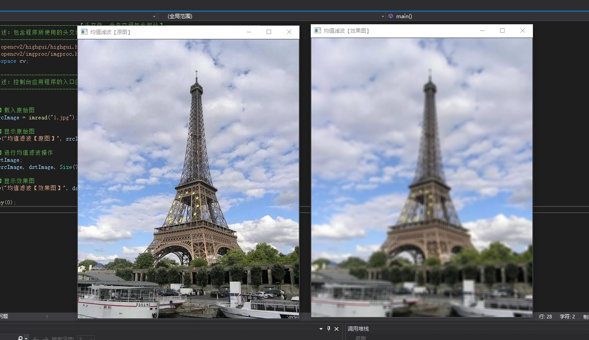
<center> 图2 均值滤波 </center>

（3）高斯滤波 在OpenCV中使用高斯滤波——GaussianBlur函数 GaussianBlur函数的作用是用高斯滤波器来模糊一张图片，对输入的图像src进行高斯滤波后用dst输出。它将源图像和指定的高斯核函数做卷积运算，并且支持就地过滤（In-placefiltering）。 
```cpp
void GaussianBlur(InputArray src,OutputArray dst, Size ksize, double sigmaX, double sigmaY=0, intborderType=BORDER_DEFAULT )
```

第一个参数，InputArray类型的src，输入图像，即源图像，填Mat类的对象即可。它可以是单独的任意通道数的图片，但需要注意，图片深度应该为CV_8U,CV_16U, CV_16S, CV_32F 以及 CV_64F之一。

第二个参数，OutputArray类型的dst，即目标图像，需要和源图片有一样的尺寸和类型。比如可以用Mat::Clone，以源图片为模板，来初始化得到如假包换的目标图。

第三个参数，Size类型的ksize高斯内核的大小。其中ksize.width和ksize.height可以不同，但他们都必须为正数和奇数。或者，它们可以是零的，它们都是由sigma计算而来。

第四个参数，double类型的sigmaX，表示高斯核函数在X方向的的标准偏差。第五个参数，double类型的sigmaY，表示高斯核函数在Y方向的的标准偏差。若sigmaY为零，就将它设为sigmaX，如果sigmaX和sigmaY都是0，那么就由ksize.width和ksize.height计算出来。

第六个参数，int类型的borderType，用于推断图像外部像素的某种边界模式。有默认值BORDER_DEFAULT。

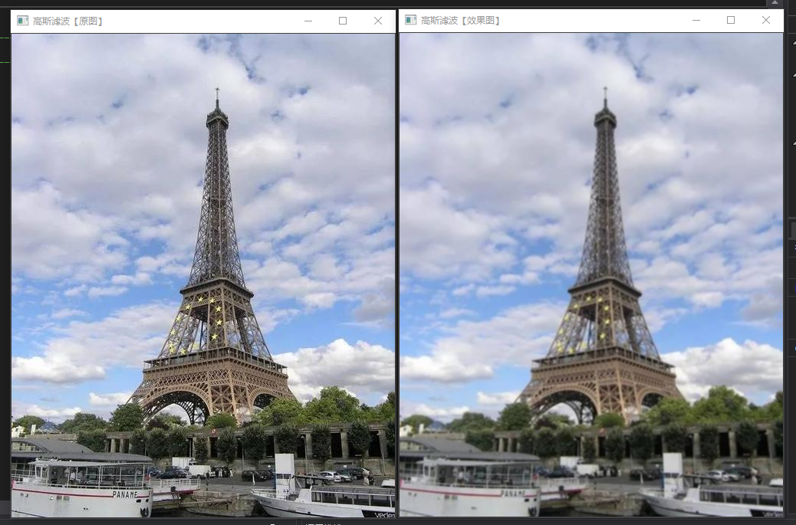
<center> 图3 高斯滤波 </center>

```cpp
#include "opencv2/core/core.hpp" 
#include "opencv2/highgui/highgui.hpp" 
#include "opencv2/imgproc/imgproc.hpp" 
using namespace cv; 

//-----------------------------------【main( )函数】--------------------------------------------
//	描述：控制台应用程序的入口函数，我们的程序从这里开始
//-----------------------------------------------------------------------------------------------
int main( )
{ 
	// 载入原图
	Mat image=imread("1.jpg"); 

	//创建窗口
	namedWindow( "高斯滤波【原图】" ); 
	namedWindow( "高斯滤波【效果图】"); 

	//显示原图
	imshow( "高斯滤波【原图】", image ); 

	//进行高斯滤波操作
	Mat out; 
	GaussianBlur( image, out, Size( 5, 5 ), 0, 0 ); 

	//显示效果图
	imshow( "高斯滤波【效果图】" ,out ); 

	waitKey( 0 );     
} 
```

通过滚动条控制模糊程度，调节方框滤波、均值滤波、高斯滤波的内核值，改善其模糊度

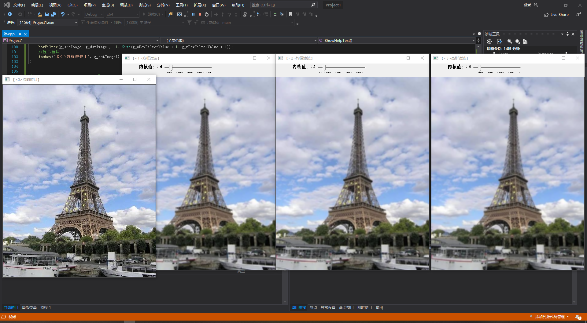
<center> 图4  调节内核值的综合滤波 </center>

## 6.2 非线性滤波

非线性滤波： 中值滤波、双边滤波。
1、主要函数说明：

（1）中值滤波——medianBlur函数 medianBlur函数使用中值滤波器来平滑（模糊）处理一张图片，从src输入，而结果从dst输出。且对于多通道图片，每一个通道都单独进行处理，并且支持就地操作（In-placeoperation）。 函数原型： C++: void medianBlur(InputArray src,OutputArray dst, int ksize)

参数详解：

第一个参数，InputArray类型的src，函数的输入参数，填1、3或者4通道的Mat类型的图像；当ksize为3或者5的时候，图像深度需为CV_8U，CV_16U，或CV_32F其中之一，而对于较大孔径尺寸的图片，它只能是CV_8U。

第二个参数，OutputArray类型的dst，即目标图像，函数的输出参数，需要和源图片有一样的尺寸和类型。我们可以用Mat::Clone，以源图片为模板，来初始化得到如假包换的目标图。

第三个参数，int类型的ksize，孔径的线性尺寸（aperture linear size），注意这个参数必须是大于1的奇数，比如：3，5，7，9 ...
```cpp
#include "opencv2/core/core.hpp" 
#include "opencv2/highgui/highgui.hpp" 
#include "opencv2/imgproc/imgproc.hpp" 

//-----------------------------------【命名空间声明部分】---------------------------------------
//	描述：包含程序所使用的命名空间
//-----------------------------------------------------------------------------------------------  
using namespace cv;

//-----------------------------------【main( )函数】--------------------------------------------
//	描述：控制台应用程序的入口函数，我们的程序从这里开始
//-----------------------------------------------------------------------------------------------
int main()
{
	// 载入原图
	Mat image = imread("1.jpg");

	//创建窗口
	namedWindow("中值滤波【原图】");
	namedWindow("中值滤波【效果图】");

	//显示原图
	imshow("中值滤波【原图】", image);

	//进行中值滤波操作
	Mat out;
	medianBlur(image, out, 7);

	//显示效果图
	imshow("中值滤波【效果图】", out);

	waitKey(0);
}
```
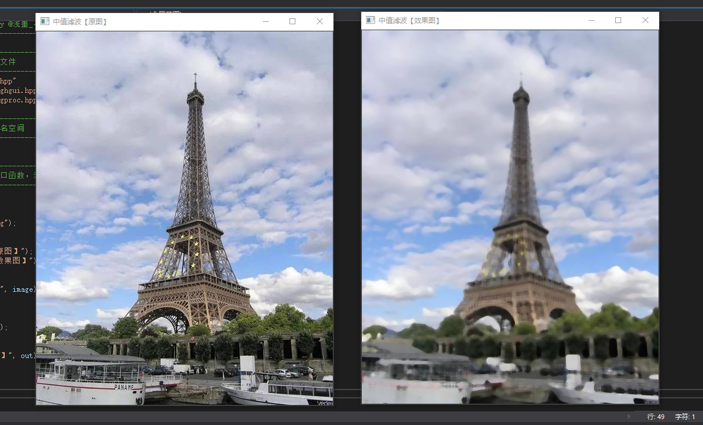
<center>图5 中值滤波 </center>


（2） 双边滤波——bilateralFilter函数

用双边滤波器来处理一张图片，由src输入图片，结果于dst输出。

函数原型： C++: void bilateralFilter(InputArray src, OutputArraydst, int d, double sigmaColor, double sigmaSpace, int borderType=BORDER_DEFAULT)

第一个参数，InputArray类型的src，输入图像，即源图像，需要为8位或者浮点型单通道、三通道的图像。

第二个参数，OutputArray类型的dst，即目标图像，需要和源图片有一样的尺寸和类型。

第三个参数，int类型的d，表示在过滤过程中每个像素邻域的直径。如果这个值我们设其为非正数，那么OpenCV会从第五个参数sigmaSpace来计算出它来。

第四个参数，double类型的sigmaColor，颜色空间滤波器的sigma值。这个参数的值越大，就表明该像素邻域内有更宽广的颜色会被混合到一起，产生较大的半相等颜色区域。

第五个参数，double类型的sigmaSpace坐标空间中滤波器的sigma值，坐标空间的标注方差。他的数值越大，意味着越远的像素会相互影响，从而使更大的区域足够相似的颜色获取相同的颜色。当d>0，d指定了邻域大小且与sigmaSpace无关。否则，d正比于sigmaSpace。

第六个参数，int类型的borderType，用于推断图像外部像素的某种边界模式。注意它有默认值BORDER_DEFAULT。
```cpp

#include "opencv2/core/core.hpp" 
#include "opencv2/highgui/highgui.hpp" 
#include "opencv2/imgproc/imgproc.hpp" 
//	描述：包含程序所使用的命名空间
//-----------------------------------------------------------------------------------------------  
using namespace cv; 

//-----------------------------------【main( )函数】--------------------------------------------
//	描述：控制台应用程序的入口函数，我们的程序从这里开始
//-----------------------------------------------------------------------------------------------
int main( )
{ 
	// 载入原图
	Mat image=imread("1.jpg"); 

	//创建窗口
	namedWindow( "双边滤波【原图】" ); 
	namedWindow( "双边滤波【效果图】"); 

	//显示原图
	imshow( "双边滤波【原图】", image ); 

	//进行双边滤波操作
	Mat out; 
	bilateralFilter ( image, out, 25, 25*2, 25/2 ); 

	//显示效果图
	imshow( "双边滤波【效果图】" ,out ); 

	waitKey( 0 );     
} 
```
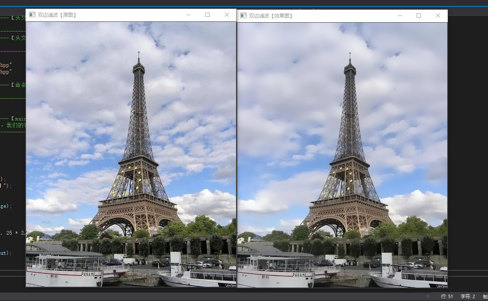
<center>图6 双边滤波</center>

## 6.3 形态学图像处理：膨胀与腐蚀
1.形态学概述

形态学（morphology）一词通常表示生物学的一个分支，该分支主要研究动植物的形态和结构。而我们图像处理中指的形态学，往往表示的是数学形态学。下面一起来了解数学形态学的概念。数学形态学（Mathematical morphology） 是一门建立在格论和拓扑学基础之上的图像分析学科，是数学形态学图像处理的基本理论。其基本的运算包括：二值腐蚀和膨胀、二值开闭运算、骨架抽取、极限腐蚀、击中击不中变换、形态学梯度、Top-hat变换、颗粒分析、流域变换、灰值腐蚀和膨胀、灰值开闭运算、灰值形态学梯度等。 简单来讲，形态学操作就是基于形状的一系列图像处理操作。OpenCV为进行图像的形态学变换提供了快捷、方便的函数。最基本的形态学操作有二种，他们是：膨胀与腐蚀(Dilation与Erosion)。膨胀与腐蚀能实现多种多样的功能，主要如下：消除噪声分割(isolate)出独立的图像元素，在图像中连接(join)相邻的元素。寻找图像中的明显的极大值区域或极小值区域求出图像的梯度.

(1)膨胀就是求局部最大值的操作。按数学方面来说，膨胀或者腐蚀操作就是将图像（或图像的一部分区域，我们称之为A）与核（我们称之为B）进行卷积。核可以是任何的形状和大小，它拥有一个单独定义出来的参考点，我们称其为锚点（anchorpoint）。多数情况下，核是一个小的中间带有参考点和实心正方形或者圆。

(2)腐蚀和膨胀是相反的一对操作，所以腐蚀就是求局部最小值的操作。

2、主要函数说明：

1、形态学膨胀——dilate函数 erode函数，使用像素邻域内的局部极大运算符来膨胀一张图片，从src输入，由dst输出。支持就地（in-place）操作。 函数原型：
```cpp
 void dilate(

InputArray src,

OutputArray dst,

InputArray kernel,

Point anchor=Point(-1,-1),

int iterations=1,

int borderType=BORDER_CONSTANT,

const Scalar& borderValue=morphologyDefaultBorderValue() 

);
```
```cpp
#include <opencv2/core/core.hpp>
#include <opencv2/highgui/highgui.hpp>
#include <opencv2/imgproc/imgproc.hpp>
#include <iostream>

//-----------------------------------【命名空间声明部分】---------------------------------------
//	描述：包含程序所使用的命名空间
//-----------------------------------------------------------------------------------------------  
using namespace std;
using namespace cv;

//-----------------------------------【main( )函数】--------------------------------------------
//	描述：控制台应用程序的入口函数，我们的程序从这里开始
//-----------------------------------------------------------------------------------------------
int main(   )
{

	//载入原图  
	Mat image = imread("1.jpg");

	//创建窗口  
	namedWindow("【原图】膨胀操作");
	namedWindow("【效果图】膨胀操作");

	//显示原图
	imshow("【原图】膨胀操作", image);

	//进行膨胀操作 
	Mat element = getStructuringElement(MORPH_RECT, Size(15, 15));
	Mat out;
	dilate(image, out, element);

	//显示效果图 
	imshow("【效果图】膨胀操作", out);

	waitKey(0); 

	return 0;
}
```

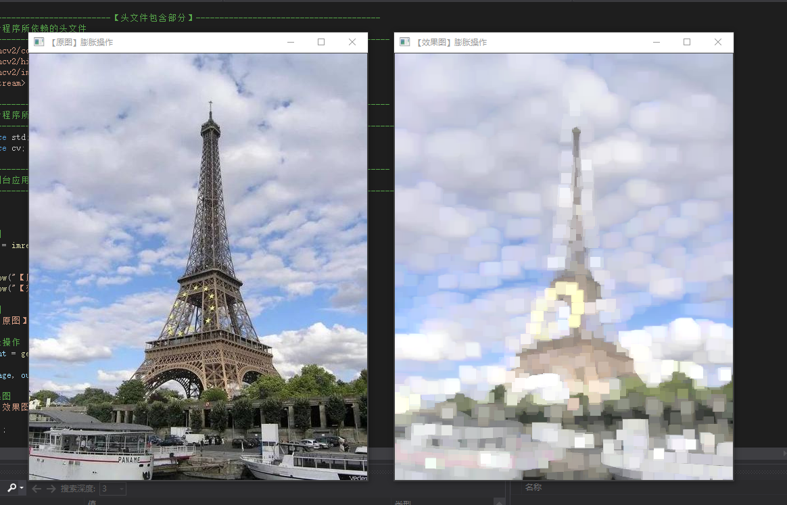
<center>图7 膨胀操作 </center>
参数详解：

第一个参数，InputArray类型的src，输入图像，即源图像，填Mat类的对象即可。图像通道的数量可以是任意的，但图像深度应为CV_8U，CV_16U，CV_16S，CV_32F或 CV_64F其中之一。

第二个参数，OutputArray类型的dst，即目标图像，需要和源图片有一样的尺寸和类型。

第三个参数，InputArray类型的kernel，膨胀操作的核。若为NULL时，表示的是使用参考点位于中心3x3的核。

形态学腐蚀——erode函数

2、erode函数，使用像素邻域内的局部极小运算符来腐蚀一张图片，从src输入，由dst输出。支持就地（in-place）操作。
```cpp
void erode(

InputArray src,

OutputArray dst,

InputArray kernel,

Point anchor=Point(-1,-1),

int iterations=1,

int borderType=BORDER_CONSTANT,

const Scalar& borderValue=morphologyDefaultBorderValue()

); 
```
代码分析：
```cpp
#include <opencv2/highgui/highgui.hpp>
#include <opencv2/imgproc/imgproc.hpp>
using namespace cv;

//-----------------------------------【main( )函数】--------------------------------------------
//	描述：控制台应用程序的入口函数，我们的程序从这里开始
//-----------------------------------------------------------------------------------------------
int main()
{
	//载入原图  
	Mat srcImage = imread("1.jpg");
	//显示原图
	imshow("【原图】腐蚀操作", srcImage);
	//进行腐蚀操作 
	Mat element = getStructuringElement(MORPH_RECT, Size(15, 15));
	Mat dstImage;
	erode(srcImage, dstImage, element);
	//显示效果图 
	imshow("【效果图】腐蚀操作", dstImage);
	waitKey(0);

	return 0;
}
```
参数详解：

第一个参数，InputArray类型的src，输入图像，即源图像，填Mat类的对象即可。图像通道的数量可以是任意的，但图像深度应为CV_8U，CV_16U，CV_16S，CV_32F或 CV_64F其中之一。

第二个参数，OutputArray类型的dst，即目标图像，需要和源图片有一样的尺寸和类型。

第三个参数，InputArray类型的kernel，腐蚀操作的内核。若为NULL时，表示的是使用参考点位于中心3x3的核。我们一般使用函数 getStructuringElement配合这个参数的使用。getStructuringElement函数会返回指定形状和尺寸的结构元素（内核矩阵）。（具体看上文中浅出部分dilate函数的第三个参数讲解部分）第四个参数，Point类型的anchor，锚的位置，其有默认值（-1，-1），表示锚位于单位（element）的中心，我们一般不用管它。

第五个参数，int类型的iterations，迭代使用erode（）函数的次数，默认值为1。

第六个参数，int类型的borderType，用于推断图像外部像素的某种边界模式。注意它有默认值BORDER_DEFAULT。

第七个参数，const Scalar&类型的borderValue，当边界为常数时的边界值，有默认值morphologyDefaultBorderValue()，一般我们不用去管他。需要用到它时，可以看官方文档中的createMorphologyFilter()函数得到更详细的解释。
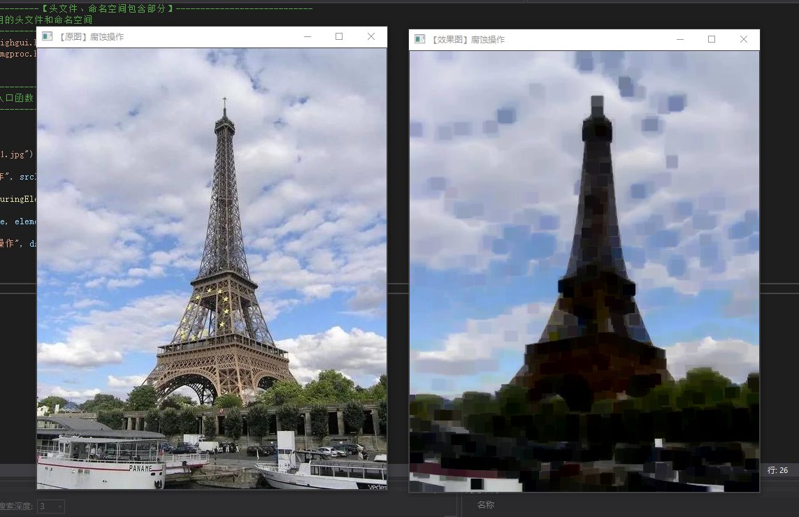
<center>图8  腐蚀操作 </center>

## 6.4 开/闭运算、形态学梯度、顶帽、黑帽

开运算(Opening Operation)——————先腐蚀后膨胀的过程
闭运算(Closing Operation)——————先膨胀后腐蚀的过程

```cpp
#include <opencv2/opencv.hpp>
#include <opencv2/highgui/highgui.hpp>
#include <opencv2/imgproc/imgproc.hpp>
using namespace cv;

//-----------------------------------【main( )函数】--------------------------------------------
//		描述：控制台应用程序的入口函数，我们的程序从这里开始
//-----------------------------------------------------------------------------------------------
int main()
{
	//载入原始图   
	Mat image = imread("1.jpg");  //工程目录下应该有一张名为1.jpg的素材图
	//创建窗口   
	namedWindow("【原始图】开运算");
	namedWindow("【效果图】开运算");
	//显示原始图  
	imshow("【原始图】开运算", image);
	//定义核
	Mat element = getStructuringElement(MORPH_RECT, Size(15, 15));
	//进行形态学操作
	morphologyEx(image, image, MORPH_OPEN, element);
	//显示效果图  
	imshow("【效果图】开运算", image);

	waitKey(0);

	return 0;
}
```

<center>图9  开运算 </center>

```cpp
#include <opencv2/opencv.hpp>
#include <opencv2/highgui/highgui.hpp>
#include <opencv2/imgproc/imgproc.hpp>
using namespace cv;


//-----------------------------------【main( )函数】------------------------------------------
//		描述：控制台应用程序的入口函数，我们的程序从这里开始
//-----------------------------------------------------------------------------------------------
int main()
{
	//载入原始图   
	Mat image = imread("1.jpg");  //工程目录下应该有一张名为1.jpg的素材图
	//创建窗口   
	namedWindow("【原始图】闭运算");
	namedWindow("【效果图】闭运算");
	//显示原始图  
	imshow("【原始图】闭运算", image);
	//定义核
	Mat element = getStructuringElement(MORPH_RECT, Size(15, 15));
	//进行形态学操作
	morphologyEx(image, image, MORPH_CLOSE, element);
	//显示效果图  
	imshow("【效果图】闭运算", image);

	waitKey(0);

	return 0;
}
```
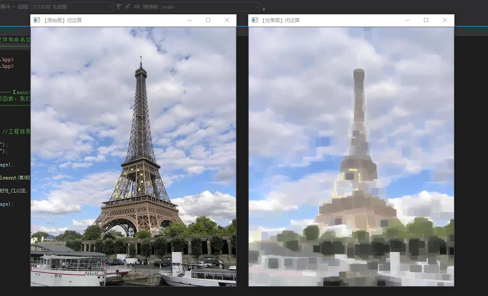
<center>图10  闭运算 </center>

形态学梯度(Morphological Gradient)————膨胀图与腐蚀图之差

$$ dst=morph-grad(src,element)=dilate(src,element)-erode(src,element)$$

```cpp
#include <opencv2/opencv.hpp>
#include <opencv2/highgui/highgui.hpp>
#include <opencv2/imgproc/imgproc.hpp>
using namespace cv;


//-----------------------------------【main( )函数】------------------------------------------
//		描述：控制台应用程序的入口函数，我们的程序从这里开始
//-----------------------------------------------------------------------------------------------
int main()
{
	//载入原始图   
	Mat image = imread("1.jpg");  //工程目录下应该有一张名为1.jpg的素材图
	//创建窗口   
	namedWindow("【原始图】形态学梯度");
	namedWindow("【效果图】形态学梯度");
	//显示原始图  
	imshow("【原始图】形态学梯度", image);
	//定义核
	Mat element = getStructuringElement(MORPH_RECT, Size(15, 15));
	//进行形态学操作
	morphologyEx(image, image, MORPH_GRADIENT, element);
	//显示效果图  
	imshow("【效果图】形态学梯度", image);

	waitKey(0);

	return 0;
}
```
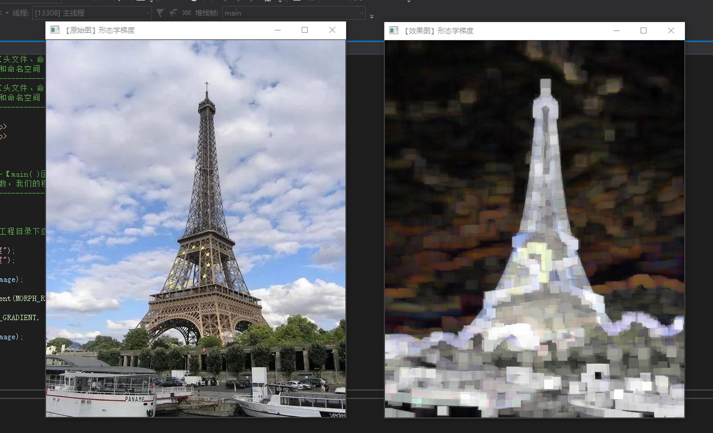
<center>图11 形态学梯度</center>

黑帽( Black Hat)运算是闭运算的结果图与原图像之差。数学表达式为:
$$dst-blackhat (src, element)-close (src, element)- sre$$
黑帽运算后的效果图突出了比原图轮廓周围的区域更暗的区域，且这一操作
和选择的核的大小相关。

```cpp
#include <opencv2/opencv.hpp>
#include <opencv2/highgui/highgui.hpp>
#include <opencv2/imgproc/imgproc.hpp>
using namespace cv;

int main()
{
	//载入原始图   
	Mat image = imread("1.jpg");  //工程目录下应该有一张名为1.jpg的素材图
	//创建窗口   
	namedWindow("【原始图】黑帽运算");
	namedWindow("【效果图】黑帽运算");
	//显示原始图  
	imshow("【原始图】黑帽运算", image);
	//定义核
	Mat element = getStructuringElement(MORPH_RECT, Size(15, 15));
	//进行形态学操作
	morphologyEx(image, image, MORPH_BLACKHAT, element);
	//显示效果图  
	imshow("【效果图】黑帽运算", image);

	waitKey(0);

	return 0;
}
```

<center>图12 黑帽效果图</center>

顶帽运算(Top Hat)又常常被译为”礼帽“运算，是原图像与上文刚刚介绍
的“开运算”的结果图之差，数学表达式如下:
$$
dst-tophat (src, element)=src-open (src, element)
$$
因为开运算带来的结果是放大了裂縫或者局部低亮度的区域。因此，从原图
中减去开运算后的图，得到的效果图突出了比原图轮廓周围的区域更明亮的区域，
且这一-操作 与选择的核的大小相关。
顶帽运算往往用来分离比邻近点亮一些的斑块。 在一幅图像具有大幅的背景，而微小物品比较有规律的情况下，可以使用顶帽运算进行背景提取。

```cpp
#include <opencv2/opencv.hpp>
#include <opencv2/highgui/highgui.hpp>
#include <opencv2/imgproc/imgproc.hpp>
using namespace cv;


int main()
{
	//载入原始图   
	Mat image = imread("1.jpg");  //工程目录下应该有一张名为1.jpg的素材图
	//创建窗口   
	namedWindow("【原始图】顶帽运算");
	namedWindow("【效果图】顶帽运算");
	//显示原始图  
	imshow("【原始图】顶帽运算", image);
	//定义核
	Mat element = getStructuringElement(MORPH_RECT, Size(15, 15));
	//进行形态学操作
	morphologyEx(image, image, MORPH_TOPHAT, element);
	//显示效果图  
	imshow("【效果图】顶帽运算", image);

	waitKey(0);

	return 0;
}
```
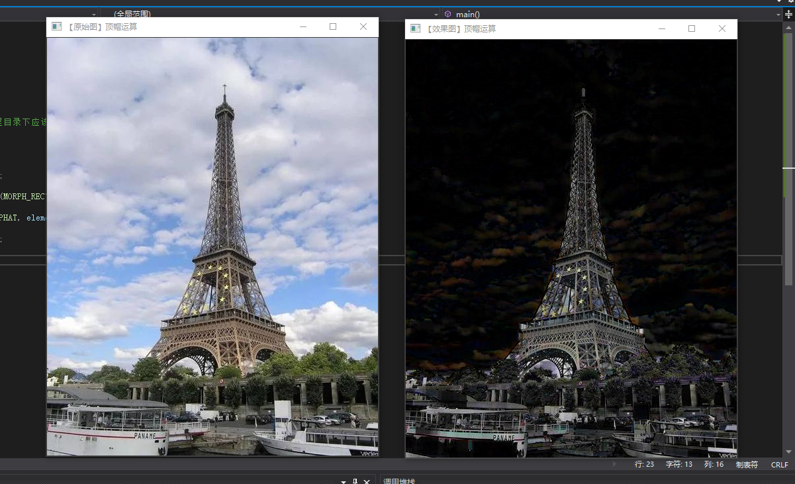
<center>图13 顶帽效果图</center>

## 6.5 OpenCV漫水填充算法—————Floodfill
1、程序分析：漫水填充

所谓漫水填充，简单来说，就是自动选中了和种子点相连的区域，接着将该区域替换成指定的颜色，这是个非常有用的功能,经常用来标记或者分离图像的一部分进行处理或分析。漫水填充也可以用来从输入图像获取掩码区域,掩码会加速处理过程,或者只处理掩码指定的像素点.以此填充算法为基础，类似photoshop的魔术棒选择工具就很容易实现了。漫水填充（FloodFill）是查找和种子点联通的颜色相同的点，魔术棒选择工具则是查找和种子点联通的颜色相近的点，将和初始种子像素颜色相近的点压进栈作为新种子在OpenCV中，漫水填充是填充算法中最通用的方法。且在OpenCV 2.X中，使用C++重写过的FloodFill函数有两个版本。一个不带掩膜mask的版本，和一个带mask的版本。这个掩膜mask，就是用于进一步控制哪些区域将被填充颜色（比如说当对同一图像进行多次填充时）。这两个版本的FloodFill，都必须在图像中选择一个种子点，然后把临近区域所有相似点填充上同样的颜色，不同的是，不一定将所有的邻近像素点都染上同一颜色，漫水填充操作的结果总是某个连续的区域。当邻近像素点位于给定的范围（从loDiff到upDiff）内或在原始seedPoint像素值范围内时，FloodFill函数就会为这个点涂上颜色。

2、主要函数说明：floodFill函数

函数原型：

int floodFill(InputOutputArray image, Point seedPoint, Scalar newVal, Rect* rect=0, Scalar loDiff=Scalar(), Scalar upDiff=Scalar(), int flags=4 )1

参数详解：

第一个参数，InputOutputArray类型的image, 输入/输出1通道或3通道，8位或浮点图像，具体参数由之后的参数具体指明。

第二个参数， InputOutputArray类型的mask，这是第二个版本的floodFill独享的参数，表示操作掩模,。它应该为单通道、8位、长和宽上都比输入图像 image 大两个像素点的图像。第二个版本的floodFill需要使用以及更新掩膜，所以这个mask参数我们一定要将其准备好并填在此处。需要注意的是，漫水填充不会填充掩膜mask的非零像素区域。例如，一个边缘检测算子的输出可以用来作为掩膜，以防止填充到边缘。同样的，也可以在多次的函数调用中使用同一个掩膜，以保证填充的区域不会重叠。另外需要注意的是，掩膜mask会比需填充的图像大，所以 mask 中与输入图像(x,y)像素点相对应的点的坐标为(x+1,y+1)。

第三个参数，Point类型的seedPoint，漫水填充算法的起始点。

第四个参数，Scalar类型的newVal，像素点被染色的值，即在重绘区域像素的新值。

第五个参数，Rect*类型的rect，有默认值0，一个可选的参数，用于设置floodFill函数将要重绘区域的最小边界矩形区域。

第六个参数，Scalar类型的loDiff，有默认值Scalar( )，表示当前观察像素值与其部件邻域像素值或者待加入该部件的种子像素之间的亮度或颜色之负差（lower brightness/color difference）的最大值。

第七个参数，Scalar类型的upDiff，有默认值Scalar( )，表示当前观察像素值与其部件邻域像素值或者待加入该部件的种子像素之间的亮度或颜色之正差（lower brightness/color difference）的最大值。

第八个参数，int类型的flags，操作标志符，此参数包含三个部分，比较复杂

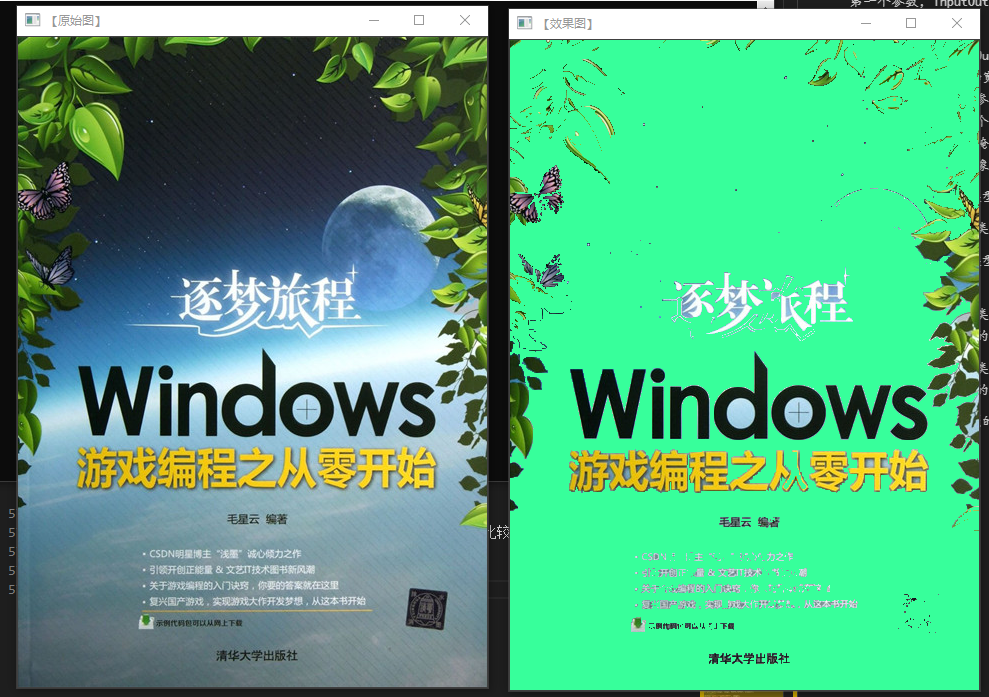
<center>图14 漫水填充效果图</center>


-----

# <center> Chapter 7  </center>


## 7.1 直方图均衡化


<center>图15 直方图均衡化效果图</center>

## 7.2 HoughLines函数用法示例
1、HoughLines变换程序分析：
2、主要函数说明：HoughLines函数

此函数可以找出采用标准霍夫变换的二值图像线条。在OpenCV中，我们可以用其来调用标准霍夫变换SHT和多尺度霍夫变换MSHT的OpenCV内建算法。
```cpp
void HoughLines(InputArray image, OutputArray lines, double rho, double theta, int threshold, double srn=0, double stn=0 )
```
    第一个参数，InputArray类型的image，输入图像，即源图像，需为8位的单通道二进制图像，可以将任意的源图载入进来后由函数修改成此格式后，再填在这里。
    第二个参数，InputArray类型的lines，经过调用HoughLines函数后储存了霍夫线变换检测到线条的输出矢量。每一条线由具有两个元素的矢量表示，其中，是离坐标原点((0,0)（也就是图像的左上角）的距离。 是弧度线条旋转角度（0垂直线，π/2水平线）。
    第三个参数，double类型的rho，以像素为单位的距离精度。另一种形容方式是直线搜索时的进步尺寸的单位半径。PS:Latex中/rho就表示 。
    第四个参数，double类型的theta，以弧度为单位的角度精度。另一种形容方式是直线搜索时的进步尺寸的单位角度。
    第五个参数，int类型的threshold，累加平面的阈值参数，即识别某部分为图中的一条直线时它在累加平面中必须达到的值。大于阈值threshold的线段才可以被检测通过并返回到结果中。
    第六个参数，double类型的srn，有默认值0。对于多尺度的霍夫变换，这是第三个参数进步尺寸rho的除数距离。粗略的累加器进步尺寸直接是第三个参数rho，而精确的累加器进步尺寸为rho/srn。
    第七个参数，double类型的stn，有默认值0，对于多尺度霍夫变换，srn表示第四个参数进步尺寸的单位角度theta的除数距离。且如果srn和stn同时为0，就表示使用经典的霍夫变换。否则，这两个参数应该都为正数。


<center>图16 霍夫变效果图</center>

## 多种重映射

```cpp

#include "opencv2/highgui/highgui.hpp"
#include "opencv2/imgproc/imgproc.hpp"
#include <iostream>
using namespace cv;
using namespace std;


//-----------------------------------【宏定义部分】-------------------------------------------- 
//  描述：定义一些辅助宏 
//------------------------------------------------------------------------------------------------ 
#define WINDOW_NAME "【程序窗口】"        //为窗口标题定义的宏 


//-----------------------------------【全局变量声明部分】--------------------------------------
//          描述：全局变量的声明
//-----------------------------------------------------------------------------------------------
Mat g_srcImage, g_dstImage;
Mat g_map_x, g_map_y;


//-----------------------------------【全局函数声明部分】--------------------------------------
//          描述：全局函数的声明
//-----------------------------------------------------------------------------------------------
int update_map(int key);
static void ShowHelpText();//输出帮助文字

//-----------------------------------【main( )函数】--------------------------------------------
//          描述：控制台应用程序的入口函数，我们的程序从这里开始执行
//-----------------------------------------------------------------------------------------------
int main(int argc, char** argv)
{
	//改变console字体颜色
	system("color 5F");

	//显示帮助文字
	ShowHelpText();

	//【1】载入原始图
	g_srcImage = imread("1.jpg", 1);
	if (!g_srcImage.data) { printf("读取图片错误，请确定目录下是否有imread函数指定的图片存在~！ \n"); return false; }
	imshow("原始图", g_srcImage);

	//【2】创建和原始图一样的效果图，x重映射图，y重映射图
	g_dstImage.create(g_srcImage.size(), g_srcImage.type());
	g_map_x.create(g_srcImage.size(), CV_32FC1);
	g_map_y.create(g_srcImage.size(), CV_32FC1);

	//【3】创建窗口并显示
	namedWindow(WINDOW_NAME, WINDOW_AUTOSIZE);
	imshow(WINDOW_NAME, g_srcImage);

	//【4】轮询按键，更新map_x和map_y的值，进行重映射操作并显示效果图
	while (1)
	{
		//获取键盘按键  
		int key = waitKey(0);

		//判断ESC是否按下，若按下便退出  
		if ((key & 255) == 27)
		{
			cout << "程序退出...........\n";
			break;
		}

		//根据按下的键盘按键来更新 map_x & map_y的值. 然后调用remap( )进行重映射
		update_map(key);
		//此句代码的OpenCV2版为：
		//remap( g_srcImage, g_dstImage, g_map_x, g_map_y, CV_INTER_LINEAR, BORDER_CONSTANT, Scalar(0,0, 0) );
		//此句代码的OpenCV3版为：
		remap(g_srcImage, g_dstImage, g_map_x, g_map_y, INTER_LINEAR, BORDER_CONSTANT, Scalar(0, 0, 0));

		//显示效果图
		imshow(WINDOW_NAME, g_dstImage);
	}
	return 0;
}

//-----------------------------------【update_map( )函数】--------------------------------
//          描述：根据按键来更新map_x与map_x的值
//----------------------------------------------------------------------------------------------
int update_map(int key)
{
	//双层循环，遍历每一个像素点
	for (int j = 0; j < g_srcImage.rows; j++)
	{
		for (int i = 0; i < g_srcImage.cols; i++)
		{
			switch (key)
			{
			case '1': // 键盘【1】键按下，进行第一种重映射操作
				if (i > g_srcImage.cols * 0.25 && i < g_srcImage.cols * 0.75 && j > g_srcImage.rows * 0.25 && j < g_srcImage.rows * 0.75)
				{
					g_map_x.at<float>(j, i) = static_cast<float>(2 * (i - g_srcImage.cols * 0.25) + 0.5);
					g_map_y.at<float>(j, i) = static_cast<float>(2 * (j - g_srcImage.rows * 0.25) + 0.5);
				}
				else
				{
					g_map_x.at<float>(j, i) = 0;
					g_map_y.at<float>(j, i) = 0;
				}
				break;
			case '2':// 键盘【2】键按下，进行第二种重映射操作
				g_map_x.at<float>(j, i) = static_cast<float>(i);
				g_map_y.at<float>(j, i) = static_cast<float>(g_srcImage.rows - j);
				break;
			case '3':// 键盘【3】键按下，进行第三种重映射操作
				g_map_x.at<float>(j, i) = static_cast<float>(g_srcImage.cols - i);
				g_map_y.at<float>(j, i) = static_cast<float>(j);
				break;
			case '4':// 键盘【4】键按下，进行第四种重映射操作
				g_map_x.at<float>(j, i) = static_cast<float>(g_srcImage.cols - i);
				g_map_y.at<float>(j, i) = static_cast<float>(g_srcImage.rows - j);
				break;
			}
		}
	}
	return 1;
}

//-----------------------------------【ShowHelpText( )函数】----------------------------------  
//      描述：输出一些帮助信息  
//----------------------------------------------------------------------------------------------  
static void ShowHelpText()
{

	//输出一些帮助信息  
	printf("\n\t欢迎来到重映射示例程序~\n\n");
	printf("\n\t按键操作说明: \n\n"
		"\t\t键盘按键【ESC】- 退出程序\n"
		"\t\t键盘按键【1】-  第一种映射方式\n"
		"\t\t键盘按键【2】- 第二种映射方式\n"
		"\t\t键盘按键【3】- 第三种映射方式\n"
		"\t\t键盘按键【4】- 第四种映射方式\n");
}
```

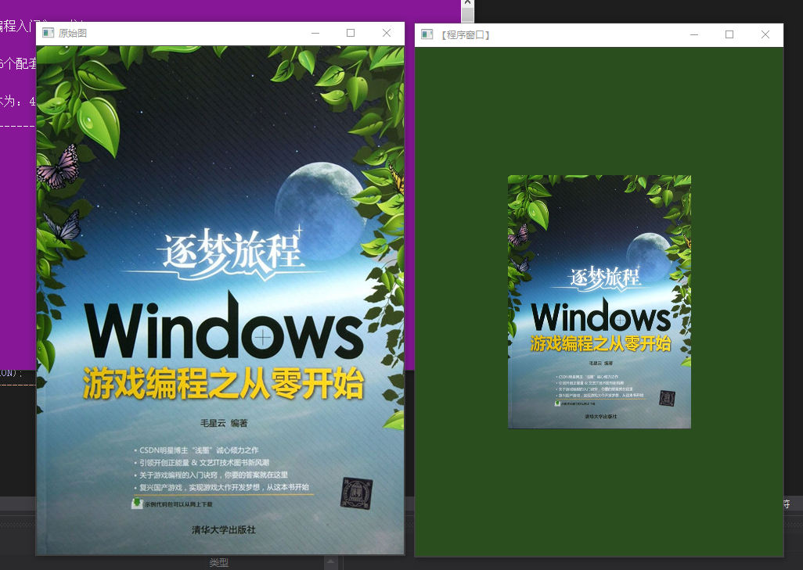
<center>图17 第一种映射效果图</center>


<center>图18 第二种映射效果图</center>

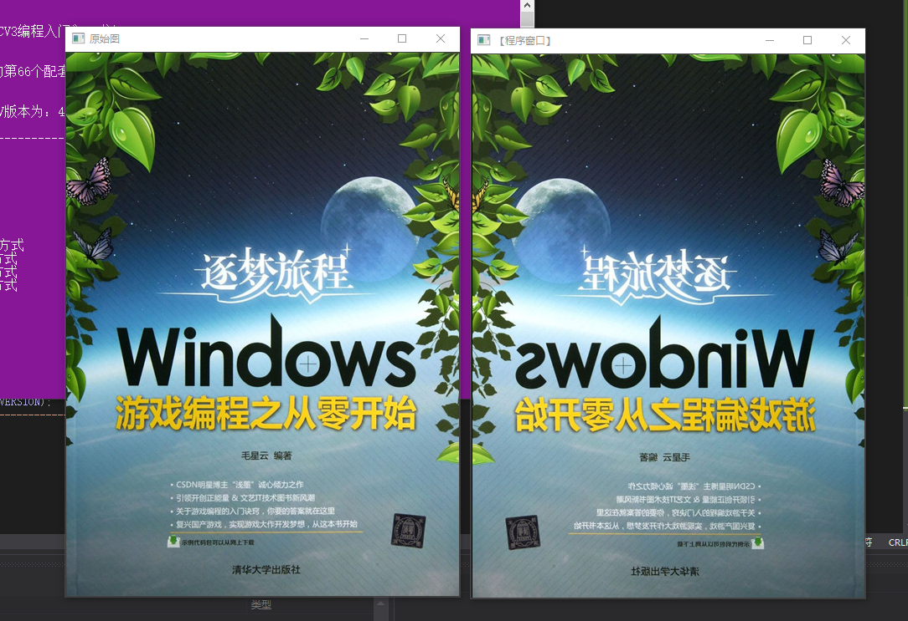
<center>图19 第三种映射效果图</center>


<center>图20 第四种映射效果图</center>

---
# <center>Chapter 8 </center>

## 1.基础轮廓查找

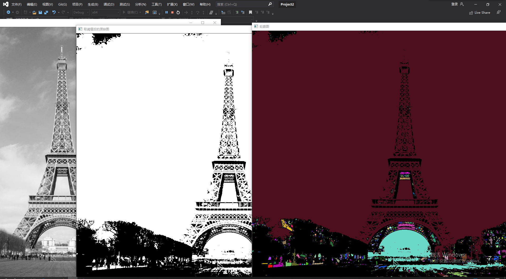
<center>图21 基础轮廓查找效果图</center>
轮廓查找是基于图像边缘提取的基础寻找对象轮廓的方法，所以边缘提取的阈值选定会影响最终轮廓发现结果


## 2.凸包检测基础

凸包(Convex Hull)是一个计算几何（图形学）中的概念，它的严格的数学定义为：在一个向量空间V中，对于给定集合X，所有包含X的凸集的交集S被称为X的凸包。
  

 在图像处理过程中，我们常常需要寻找图像中包围某个物体的凸包。凸包跟多边形逼近很像，只不过它是包围物体最外层的一个凸集，这个凸集是所有能包围这个物体的凸集的交集

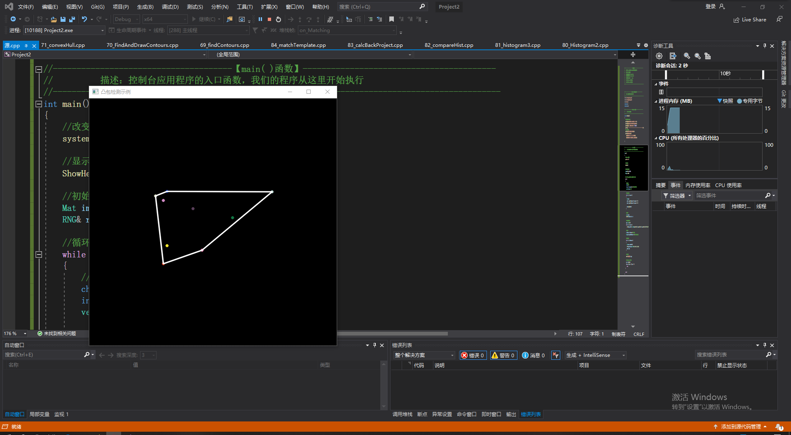
<center>图22 基础轮廓查找效果图</center>

## 3.分水岭算法

分水岭算法是一种图像区域分割法，在分割的过程中，它会把跟临近像素间的相似性作为重要的参考依据，从而将在空间位置上相近并且灰度值相近（求梯度）的像素点互相连接起来构成一个封闭的轮廓。分水岭算法常用的操作步骤：彩色图像灰度化，然后再求梯度图，最后在梯度图的基础上进行分水岭算法，求得分段图像的边缘线。

```cpp
#include "opencv2/imgproc/imgproc.hpp"
#include "opencv2/highgui/highgui.hpp"
#include <iostream>
using namespace cv;
using namespace std;

//-----------------------------------【宏定义部分】-------------------------------------------- 
//  描述：定义一些辅助宏 
//------------------------------------------------------------------------------------------------ 
#define WINDOW_NAME1 "【程序窗口1】"        //为窗口标题定义的宏 
#define WINDOW_NAME2 "【分水岭算法效果图】"        //为窗口标题定义的宏

//-----------------------------------【全局函变量声明部分】--------------------------------------
//		描述：全局变量的声明
//-----------------------------------------------------------------------------------------------
Mat g_maskImage, g_srcImage;
Point prevPt(-1, -1);

//-----------------------------------【全局函数声明部分】--------------------------------------
//		描述：全局函数的声明
//-----------------------------------------------------------------------------------------------
static void ShowHelpText();
static void on_Mouse( int event, int x, int y, int flags, void* );


//-----------------------------------【main( )函数】--------------------------------------------
//		描述：控制台应用程序的入口函数，我们的程序从这里开始执行
//-----------------------------------------------------------------------------------------------
int main( int argc, char** argv )
{	
	//【0】改变console字体颜色
	system("color 6F"); 

	//【0】显示帮助文字
	ShowHelpText( );

	//【1】载入原图并显示，初始化掩膜和灰度图
	g_srcImage = imread("1.jpg", 1);
	imshow( WINDOW_NAME1, g_srcImage );
	Mat srcImage,grayImage;
	g_srcImage.copyTo(srcImage);
	cvtColor(g_srcImage, g_maskImage, COLOR_BGR2GRAY);
	cvtColor(g_maskImage, grayImage, COLOR_GRAY2BGR);
	g_maskImage = Scalar::all(0);

	//【2】设置鼠标回调函数
	setMouseCallback( WINDOW_NAME1, on_Mouse, 0 );

	//【3】轮询按键，进行处理
	while(1)
	{
		//获取键值
		int c = waitKey(0);

		//若按键键值为ESC时，退出
		if( (char)c == 27 )
			break;

		//按键键值为2时，恢复源图
		if( (char)c == '2' )
		{
			g_maskImage = Scalar::all(0);
			srcImage.copyTo(g_srcImage);
			imshow( "image", g_srcImage );
		}

		//若检测到按键值为1或者空格，则进行处理
		if( (char)c == '1' || (char)c == ' ' )
		{
			//定义一些参数
			int i, j, compCount = 0;
			vector<vector<Point> > contours;
			vector<Vec4i> hierarchy;

			//寻找轮廓
			findContours(g_maskImage, contours, hierarchy, RETR_CCOMP, CHAIN_APPROX_SIMPLE);

			//轮廓为空时的处理
			if( contours.empty() )
				continue;

			//拷贝掩膜
			Mat maskImage(g_maskImage.size(), CV_32S);
			maskImage = Scalar::all(0);

			//循环绘制出轮廓
			for( int index = 0; index >= 0; index = hierarchy[index][0], compCount++ )
				drawContours(maskImage, contours, index, Scalar::all(compCount+1), -1, 8, hierarchy, INT_MAX);

			//compCount为零时的处理
			if( compCount == 0 )
				continue;

			//生成随机颜色
			vector<Vec3b> colorTab;
			for( i = 0; i < compCount; i++ )
			{
				int b = theRNG().uniform(0, 255);
				int g = theRNG().uniform(0, 255);
				int r = theRNG().uniform(0, 255);

				colorTab.push_back(Vec3b((uchar)b, (uchar)g, (uchar)r));
			}

			//计算处理时间并输出到窗口中
			double dTime = (double)getTickCount();
			watershed( srcImage, maskImage );
			dTime = (double)getTickCount() - dTime;
			printf( "\t处理时间 = %gms\n", dTime*1000./getTickFrequency() );

			//双层循环，将分水岭图像遍历存入watershedImage中
			Mat watershedImage(maskImage.size(), CV_8UC3);
			for( i = 0; i < maskImage.rows; i++ )
				for( j = 0; j < maskImage.cols; j++ )
				{
					int index = maskImage.at<int>(i,j);
					if( index == -1 )
						watershedImage.at<Vec3b>(i,j) = Vec3b(255,255,255);
					else if( index <= 0 || index > compCount )
						watershedImage.at<Vec3b>(i,j) = Vec3b(0,0,0);
					else
						watershedImage.at<Vec3b>(i,j) = colorTab[index - 1];
				}

				//混合灰度图和分水岭效果图并显示最终的窗口
				watershedImage = watershedImage*0.5 + grayImage*0.5;
				imshow( WINDOW_NAME2, watershedImage );
		}
	}

	return 0;
}


//-----------------------------------【onMouse( )函数】---------------------------------------
//		描述：鼠标消息回调函数
//-----------------------------------------------------------------------------------------------
static void on_Mouse( int event, int x, int y, int flags, void* )
{
	//处理鼠标不在窗口中的情况
	if( x < 0 || x >= g_srcImage.cols || y < 0 || y >= g_srcImage.rows )
		return;

	//处理鼠标左键相关消息
	if( event == EVENT_LBUTTONUP || !(flags & EVENT_FLAG_LBUTTON) )
		prevPt = Point(-1,-1);
	else if( event == EVENT_LBUTTONDOWN )
		prevPt = Point(x,y);

	//鼠标左键按下并移动，绘制出白色线条
	else if( event == EVENT_MOUSEMOVE && (flags & EVENT_FLAG_LBUTTON) )
	{
		Point pt(x, y);
		if( prevPt.x < 0 )
			prevPt = pt;
		line( g_maskImage, prevPt, pt, Scalar::all(255), 5, 8, 0 );
		line( g_srcImage, prevPt, pt, Scalar::all(255), 5, 8, 0 );
		prevPt = pt;
		imshow(WINDOW_NAME1, g_srcImage);
	}
}


//-----------------------------------【ShowHelpText( )函数】----------------------------------  
//      描述：输出一些帮助信息  
//----------------------------------------------------------------------------------------------  
static void ShowHelpText()  
{  
	
	//输出一些帮助信息  
	printf(  "\n\n\n\t欢迎来到【分水岭算法】示例程序~\n\n");  
	printf(  "\t请先用鼠标在图片窗口中标记出大致的区域，\n\n\t然后再按键【1】或者【SPACE】启动算法。"
		"\n\n\t按键操作说明: \n\n"  
		"\t\t键盘按键【1】或者【SPACE】- 运行的分水岭分割算法\n"  
		"\t\t键盘按键【2】- 恢复原始图片\n"  
		"\t\t键盘按键【ESC】- 退出程序\n\n\n");  
}  
```

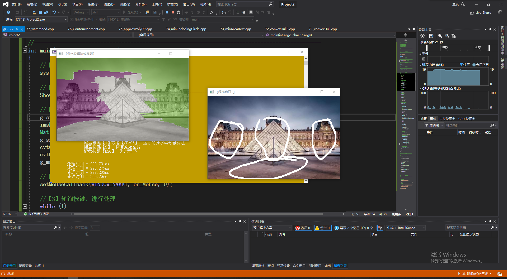
<center>图23 分水岭算法效果图</center>


----
#  <center>Chapter 9 </center>

## 9.1 二维直方图的绘制 

```cpp
#include "opencv2/highgui/highgui.hpp"
#include "opencv2/imgproc/imgproc.hpp"
using namespace cv;


//-----------------------------------【ShowHelpText( )函数】-----------------------------
//		 描述：输出一些帮助信息
//----------------------------------------------------------------------------------------------
void ShowHelpText()
{
	//输出欢迎信息和OpenCV版本
	printf("\n\n\t\t\t非常感谢购买《OpenCV3编程入门》一书！\n");
	printf("\n\n\t\t\t此为本书OpenCV3版的第79个配套示例程序\n");
	printf("\n\n\t\t\t   当前使用的OpenCV版本为：" CV_VERSION );
	printf("\n\n  ----------------------------------------------------------------------------\n");
}


//--------------------------------------【main( )函数】-----------------------------------------
//          描述：控制台应用程序的入口函数，我们的程序从这里开始执行
//-----------------------------------------------------------------------------------------------
int main( )
{

	//【1】载入源图，转化为HSV颜色模型
	Mat srcImage, hsvImage;
	srcImage=imread("1.jpg");
	cvtColor(srcImage,hsvImage, COLOR_BGR2HSV);

	system("color 2F");
	ShowHelpText();

	//【2】参数准备
	//将色调量化为30个等级，将饱和度量化为32个等级
	int hueBinNum = 30;//色调的直方图直条数量
	int saturationBinNum = 32;//饱和度的直方图直条数量
	int histSize[ ] = {hueBinNum, saturationBinNum};
	// 定义色调的变化范围为0到179
	float hueRanges[] = { 0, 180 };
	//定义饱和度的变化范围为0（黑、白、灰）到255（纯光谱颜色）
	float saturationRanges[] = { 0, 256 };
	const float* ranges[] = { hueRanges, saturationRanges };
	MatND dstHist;
	//参数准备，calcHist函数中将计算第0通道和第1通道的直方图
	int channels[] = {0, 1};

	//【3】正式调用calcHist，进行直方图计算
	calcHist( &hsvImage,//输入的数组
		1, //数组个数为1
		channels,//通道索引
		Mat(), //不使用掩膜
		dstHist, //输出的目标直方图
		2, //需要计算的直方图的维度为2
		histSize, //存放每个维度的直方图尺寸的数组
		ranges,//每一维数值的取值范围数组
		true, // 指示直方图是否均匀的标识符，true表示均匀的直方图
		false );//累计标识符，false表示直方图在配置阶段会被清零

	//【4】为绘制直方图准备参数
	double maxValue=0;//最大值
	minMaxLoc(dstHist, 0, &maxValue, 0, 0);//查找数组和子数组的全局最小值和最大值存入maxValue中
	int scale = 10;
	Mat histImg = Mat::zeros(saturationBinNum*scale, hueBinNum*10, CV_8UC3);

	//【5】双层循环，进行直方图绘制
	for( int hue = 0; hue < hueBinNum; hue++ )
		for( int saturation = 0; saturation < saturationBinNum; saturation++ )
		{
			float binValue = dstHist.at<float>(hue, saturation);//直方图组距的值
			int intensity = cvRound(binValue*255/maxValue);//强度

			//正式进行绘制
			rectangle( histImg, Point(hue*scale, saturation*scale),
				Point( (hue+1)*scale - 1, (saturation+1)*scale - 1),
				Scalar::all(intensity),FILLED );
		}

		//【6】显示效果图
		imshow( "素材图", srcImage );
		imshow( "H-S 直方图", histImg );

		waitKey();
}
```

<center> 图23 二维直方图的绘制</center>

## 9.2 反向投影
反向投影是一种记录给定图像中的像素点如何适应直方图模型像素分布的方式，简单来讲，反向投影就是首先计算某一特征的直方图模型，然后使用模型去寻找图像中存在的特征。反向投影在某一位置的值就是原图对应位置像素值在原图像中的总数目。

- 对测试图像中的每个像素p(i,j),获取色调数据并找到该色调(hi,j,si,j)在直方图的bin的位置
- 查询模型直方图中对应bin的数值
- 将此数值存储在新的反射投影图像中。也可以先归一化直方图数值到0∼255范围，这样可以直接显示反射投影图像（单通道图像）
- 通过对测试图像中的每个像素采用以上步骤，可以得到最终的反射投影图像使用统计学语言进行分析，反向投影中存储的数值代表了测试图像中该像素属于皮肤区域的概率
```cpp
#include "opencv2/imgproc/imgproc.hpp"
#include "opencv2/highgui/highgui.hpp"
using namespace cv;


//-----------------------------------【宏定义部分】-------------------------------------------- 
//  描述：定义一些辅助宏 
//------------------------------------------------------------------------------------------------ 
#define WINDOW_NAME1 "【原始图】"        //为窗口标题定义的宏 

Mat g_srcImage; Mat g_hsvImage; Mat g_hueImage;
int g_bins = 30;//直方图组距

//-----------------------------------【全局函数声明部分】--------------------------------------
//          描述：全局函数声明
//-----------------------------------------------------------------------------------------------
static void ShowHelpText();
void on_BinChange(int, void* );

//--------------------------------------【main( )函数】-----------------------------------------
//          描述：控制台应用程序的入口函数，我们的程序从这里开始执行
//-----------------------------------------------------------------------------------------------
int main( )
{
	//【0】改变console字体颜色
	system("color 6F"); 

	//【0】显示帮助文字
	ShowHelpText();

	//【1】读取源图像，并转换到 HSV 空间
	g_srcImage = imread( "1.jpg", 1 );
	if(!g_srcImage.data ) { printf("读取图片错误，请确定目录下是否有imread函数指定图片存在~！ \n"); return false; } 
	cvtColor( g_srcImage, g_hsvImage, COLOR_BGR2HSV );

	//【2】分离 Hue 色调通道
	g_hueImage.create( g_hsvImage.size(), g_hsvImage.depth() );
	int ch[ ] = { 0, 0 };
	mixChannels( &g_hsvImage, 1, &g_hueImage, 1, ch, 1 );

	//【3】创建 Trackbar 来输入bin的数目
	namedWindow( WINDOW_NAME1 , WINDOW_AUTOSIZE );
	createTrackbar("色调组距 ", WINDOW_NAME1 , &g_bins, 180, on_BinChange );
	on_BinChange(0, 0);//进行一次初始化

	//【4】显示效果图
	imshow( WINDOW_NAME1 , g_srcImage );

	// 等待用户按键
	waitKey(0);
	return 0;
}


//-----------------------------------【on_HoughLines( )函数】--------------------------------
//          描述：响应滑动条移动消息的回调函数
//---------------------------------------------------------------------------------------------
void on_BinChange(int, void* )
{
	//【1】参数准备
	MatND hist;
	int histSize = MAX( g_bins, 2 );
	float hue_range[] = { 0, 180 };
	const float* ranges = { hue_range };

	//【2】计算直方图并归一化
	calcHist( &g_hueImage, 1, 0, Mat(), hist, 1, &histSize, &ranges, true, false );
	normalize( hist, hist, 0, 255, NORM_MINMAX, -1, Mat() );

	//【3】计算反向投影
	MatND backproj;
	calcBackProject( &g_hueImage, 1, 0, hist, backproj, &ranges, 1, true );

	//【4】显示反向投影
	imshow( "反向投影图", backproj );

	//【5】绘制直方图的参数准备
	int w = 400; int h = 400;
	int bin_w = cvRound( (double) w / histSize );
	Mat histImg = Mat::zeros( w, h, CV_8UC3 );

	//【6】绘制直方图
	for( int i = 0; i < g_bins; i ++ )
	{ rectangle( histImg, Point( i*bin_w, h ), Point( (i+1)*bin_w, h - cvRound( hist.at<float>(i)*h/255.0 ) ), Scalar( 100, 123, 255 ), -1 ); }

	//【7】显示直方图窗口
	imshow( "直方图", histImg );
}


//-----------------------------------【ShowHelpText( )函数】----------------------------------
//          描述：输出一些帮助信息
static void ShowHelpText()
{


	//输出一些帮助信息
	printf("\n\n\t欢迎来到【反向投影】示例程序\n\n"); 
	printf("\n\t请调整滑动条观察图像效果\n\n");

}
```

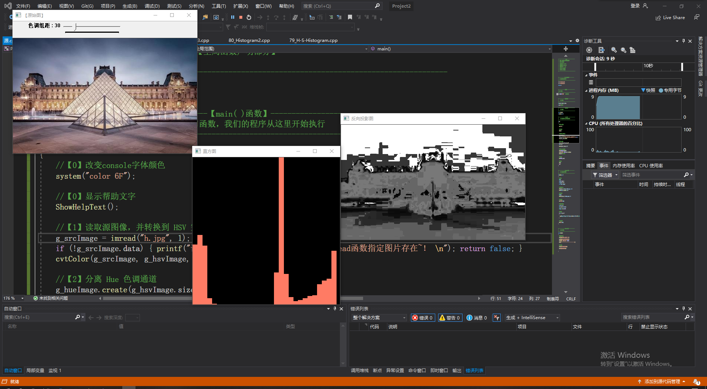
<center>图24 反向投影效果图</center>

## 9.3  模板匹配

opencv官网对模板匹配的解释是：
模板匹配是一种用于在较大图像中搜索和查找模板图像位置的方法。为此，OpenCV带有一个函数cv2.matchTemplate（）。它只是将模板图​​像滑动到输入图像上（就像在2D卷积中一样），然后在模板图像下比较模板和输入图像的补丁。OpenCV中实现了几种比较方法。（您可以检查文档以了解更多详细信息）。它返回一个灰度图像，其中每个像素表示该像素的邻域与模板匹配多少。

关于参数 method：
- CV_TM_SQDIFF 平方差匹配法：该方法采用平方差来进行匹配；最好的匹配值为0；匹配越差，匹配值越大。
- CV_TM_CCORR 相关匹配法：该方法采用乘法操作；数值越大表明匹配程度越好。
- CV_TM_CCOEFF 相关系数匹配法：1表示完美的匹配；-1表示最差的匹配。
- CV_TM_SQDIFF_NORMED 归一化平方差匹配法
- CV_TM_CCORR_NORMED 归一化相关匹配法
- CV_TM_CCOEFF_NORMED 归一化相关系数匹配法

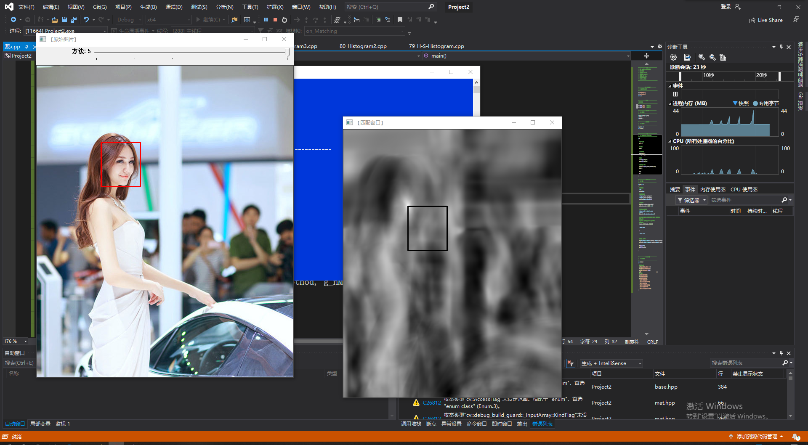
<center>图25 模板匹配 </center>


---
# <center>心得体会</center>
---
1.在漫水填充这个实验中，我的图片一直出不来，最后发现是imread（）函数中的参数问题，将199删除即可以运行成功。其他的程序我都能成功运行。这次课我学到了opencv中的一些图像处理的方法及原理。


2.霍夫变换主要用来从图像中分离出具有某种同样特征的几何形状（如，直线，圆等）。图像的特征提取指的是使用计算机提取图像信息，决定每个图像的点是否属于一个图像特征，它是处理图像中比较重要的一步，如果连图像的特征都提取不了，那么我们做图像分析就没有意义了。

3.直方图均衡化是灰度变换的一个重要应用，它高效且易于实现，广泛应用于图像增强处理中。图像的像素灰度变化是随机的，直方图的图形高低不齐，直方图均衡化就是用一定的算法使直方图大致平和。
均衡化处理后的图象只能是近似均匀分布。均衡化图象的动态范围扩大了，但其本质是扩大了量化间隔，而量化级别反而减少了，因此，原来灰度不同的象素经处理后可能变的相同，形成了一片的相同灰度的区域，各区域之间有明显的边界，从而出现了伪轮廓。
如果原始图像对比度本来就很高，如果再均衡化则灰度调和，对比度降低。在泛白缓和的图像中，均衡化会合并一些象素灰度，从而增大对比度。均衡化后的图片如果再对其均衡化，则图像不会有任何变化。
灰度直方图均衡化的算法，简单地说，就是把直方图的每个灰度级进行归一化处理，求每种灰度的累积分布，得到一个映射的灰度映射表，然后根据相应的灰度值来修正原图中的每个像素。

经典的直方图均衡化算法可能存在以下一些不足：
- 输出图像的实际灰度变化范围很难达到图像格式所允许的最大灰度变化范围。
- 输出图像的灰度分布直方图虽然接近均匀分布, 但其值与理想值1/n仍有可能存在较大的差异, 并非是最佳值。
- 输出图像的灰度级有可能被过多地合并。由于灰度的吞噬也易造成图像信息的丢失。

4.模板匹配就是模板在待检测的图像上从左至右，从上至下的滑动，模板从源图像左上角开始每次以模板的左上角像素点为单位从左至右，从上至下移动，每到达一个像素点，就会以这个像素点为左上角顶点从源图像中截取出与模板一样大小的图像与模板进行像素比较运算

许多数学公式，其中涉及到的知识对高数有很高的要求，在理解公式时有很大的压力，以后要加强对数学的学习，为接下来的学习打好基础，想要学好编程，数学能力是必不可少的一环，课上学到了直方图，直方图均衡化，边缘检测和Hough变换的原理与代码实现，进一步加深了对opencv的理解。