# 第六章

## 线性滤波

### 平滑处理

平滑处理也成为模糊处理，是一种简单且使用频率很高的图像处理方法，最常见的是用来减少图像上的噪点或者失真

### 滤波器

滤波器的品种有很多，最常见的是接下来五类常用的图像平滑处理的操作方法

方框滤波---BoxBlur函数
均值滤波(领域平均滤波)---Blur函数
高斯滤波---GaussianBlur函数
中值滤波---medianBlur函数
双边滤波---bilaterlFilter函数

### 领域算子与线性领域滤波

领域算子是利用给定像素周围的像素值的决定此像素的最终输出算子。像素的输出值取决于输入像素的加权和

### 方框滤波(box Filter)

```c++

//--------------------------------------【程序说明】-------------------------------------------
//		程序说明：《OpenCV3编程入门》OpenCV3版书本配套示例程序31
//		程序描述：方框滤波boxFilter函数的使用示例程序
//		开发测试所用操作系统： Windows 7 64bit
//		开发测试所用IDE版本：Visual Studio 2010
//		开发测试所用OpenCV版本：	3.0 beta
//		2014年11月 Created by @浅墨_毛星云
//		2014年12月 Revised by @浅墨_毛星云
//------------------------------------------------------------------------------------------------


//---------------------------------【头文件、命名空间包含部分】-------------------------------
//		描述：包含程序所使用的头文件和命名空间
//------------------------------------------------------------------------------------------------
#include "opencv2/core/core.hpp" 
#include "opencv2/highgui/highgui.hpp" 
#include "opencv2/imgproc/imgproc.hpp" 
using namespace cv;

//-----------------------------------【main( )函数】--------------------------------------------
//	描述：控制台应用程序的入口函数，我们的程序从这里开始
//-----------------------------------------------------------------------------------------------
int main()
{
	// 载入原图
	Mat image = imread("D:/image/1.jpg");

	//创建窗口
	namedWindow("方框滤波【原图】");
	namedWindow("方框滤波【效果图】");

	//显示原图
	imshow("方框滤波【原图】", image);

	//进行方框滤波操作
	Mat out;
	boxFilter(image, out, -1, Size(5, 5));

	//显示效果图
	imshow("方框滤波【效果图】", out);

	waitKey(0);
}
```
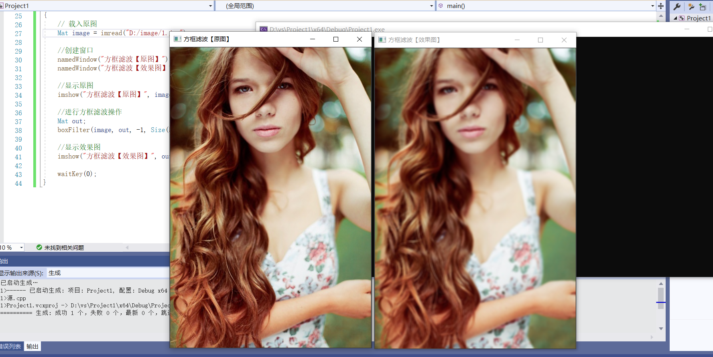

### 均值滤波

```c++

//--------------------------------------【程序说明】-------------------------------------------
//		程序说明：《OpenCV3编程入门》OpenCV3版书本配套示例程序32
//		程序描述：均值滤波blur函数的使用示例程序
//		开发测试所用操作系统： Windows 7 64bit
//		开发测试所用IDE版本：Visual Studio 2010
//		开发测试所用OpenCV版本：	3.0 beta
//		2014年11月 Created by @浅墨_毛星云
//		2014年12月 Revised by @浅墨_毛星云
//------------------------------------------------------------------------------------------------


//---------------------------------【头文件、命名空间包含部分】-------------------------------
//		描述：包含程序所使用的头文件和命名空间
//-----------------------------------------------------------------------------------------------
#include "opencv2/highgui/highgui.hpp" 
#include "opencv2/imgproc/imgproc.hpp" 
using namespace cv;

//-----------------------------------【main( )函数】--------------------------------------------
//		描述：控制台应用程序的入口函数，我们的程序从这里开始
//-----------------------------------------------------------------------------------------------
int main()
{
	//【1】载入原始图
	Mat srcImage = imread("D:/image/1.jpg");

	//【2】显示原始图
	imshow("均值滤波【原图】", srcImage);

	//【3】进行均值滤波操作
	Mat dstImage;
	blur(srcImage, dstImage, Size(7, 7));

	//【4】显示效果图
	imshow("均值滤波【效果图】", dstImage);

	waitKey(0);
}
```

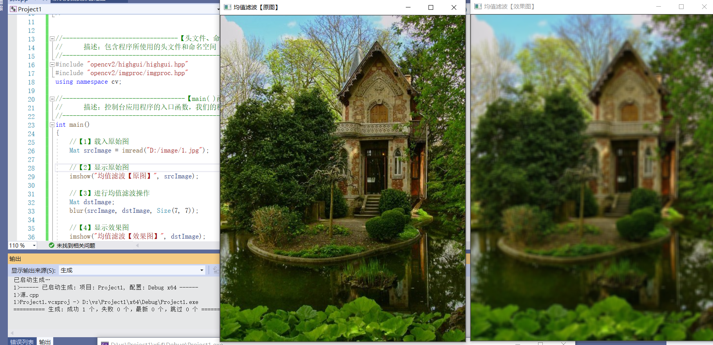

### 高斯滤波

```c++

//--------------------------------------【程序说明】-------------------------------------------
//		程序说明：《OpenCV3编程入门》OpenCV3版书本配套示例程序33
//		程序描述：高斯滤波GaussianBlur函数的使用示例程序
//		开发测试所用操作系统： Windows 7 64bit
//		开发测试所用IDE版本：Visual Studio 2010
//		开发测试所用OpenCV版本：	3.0 beta
//		2014年11月 Created by @浅墨_毛星云
//		2014年12月 Revised by @浅墨_毛星云
//------------------------------------------------------------------------------------------------


//---------------------------------【头文件、命名空间包含部分】-------------------------------
//		描述：包含程序所使用的头文件和命名空间
//------------------------------------------------------------------------------------------------
#include "opencv2/core/core.hpp" 
#include "opencv2/highgui/highgui.hpp" 
#include "opencv2/imgproc/imgproc.hpp" 
using namespace cv;

//-----------------------------------【main( )函数】--------------------------------------------
//	描述：控制台应用程序的入口函数，我们的程序从这里开始
//-----------------------------------------------------------------------------------------------
int main()
{
	// 载入原图
	Mat image = imread("D:/image/1.jpg");

	//创建窗口
	namedWindow("高斯滤波【原图】");
	namedWindow("高斯滤波【效果图】");

	//显示原图
	imshow("高斯滤波【原图】", image);

	//进行高斯滤波操作
	Mat out;
	GaussianBlur(image, out, Size(5, 5), 0, 0);

	//显示效果图
	imshow("高斯滤波【效果图】", out);

	waitKey(0);
}
```

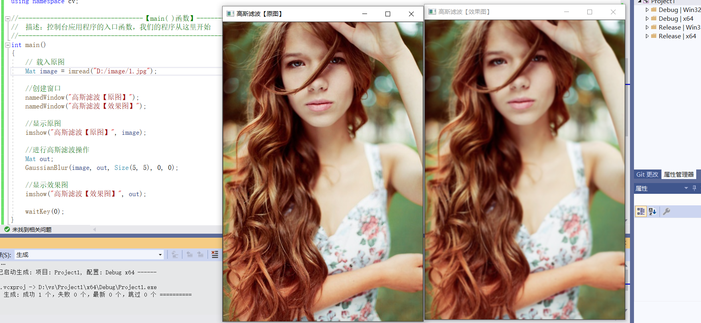

### 综合示例对比

```c++
//--------------------------------------【程序说明】-------------------------------------------
//		程序说明：《OpenCV3编程入门》OpenCV3版书本配套示例程序34
//		程序描述：线性图像滤波综合示例
//		开发测试所用操作系统： Windows 7 64bit
//		开发测试所用IDE版本：Visual Studio 2010
//		开发测试所用OpenCV版本：	3.0 beta
//		2014年11月 Created by @浅墨_毛星云
//		2014年12月 Revised by @浅墨_毛星云
//------------------------------------------------------------------------------------------------


//---------------------------------【头文件、命名空间包含部分】-------------------------------
//		描述：包含程序所使用的头文件和命名空间
//------------------------------------------------------------------------------------------------
#include <opencv2/core/core.hpp>
#include <opencv2/highgui/highgui.hpp>
#include <opencv2/imgproc/imgproc.hpp>
#include <iostream>

using namespace std;
using namespace cv;


//-----------------------------------【全局变量声明部分】--------------------------------------
//	描述：全局变量声明
//-----------------------------------------------------------------------------------------------
Mat g_srcImage, g_dstImage1, g_dstImage2, g_dstImage3;//存储图片的Mat类型
int g_nBoxFilterValue = 3;  //方框滤波参数值
int g_nMeanBlurValue = 3;  //均值滤波参数值
int g_nGaussianBlurValue = 3;  //高斯滤波参数值


//-----------------------------------【全局函数声明部分】--------------------------------------
//	描述：全局函数声明
//-----------------------------------------------------------------------------------------------
//四个轨迹条的回调函数
static void on_BoxFilter(int, void*);		//均值滤波
static void on_MeanBlur(int, void*);		//均值滤波
static void on_GaussianBlur(int, void*);			//高斯滤波
void ShowHelpText();


//-----------------------------------【main( )函数】--------------------------------------------
//	描述：控制台应用程序的入口函数，我们的程序从这里开始
//-----------------------------------------------------------------------------------------------
int main()
{
	//改变console字体颜色
	system("color 5F");

	//输出帮助文字
	ShowHelpText();

	// 载入原图
	g_srcImage = imread("D:/image/1.jpg", 1);
	if (!g_srcImage.data) { printf("Oh，no，读取srcImage错误~！ \n"); return false; }

	//克隆原图到三个Mat类型中
	g_dstImage1 = g_srcImage.clone();
	g_dstImage2 = g_srcImage.clone();
	g_dstImage3 = g_srcImage.clone();

	//显示原图
	namedWindow("【<0>原图窗口】", 1);
	imshow("【<0>原图窗口】", g_srcImage);


	//=================【<1>方框滤波】==================
	//创建窗口
	namedWindow("【<1>方框滤波】", 1);
	//创建轨迹条
	createTrackbar("内核值：", "【<1>方框滤波】", &g_nBoxFilterValue, 40, on_BoxFilter);
	on_BoxFilter(g_nBoxFilterValue, 0);
	//================================================

	//=================【<2>均值滤波】==================
	//创建窗口
	namedWindow("【<2>均值滤波】", 1);
	//创建轨迹条
	createTrackbar("内核值：", "【<2>均值滤波】", &g_nMeanBlurValue, 40, on_MeanBlur);
	on_MeanBlur(g_nMeanBlurValue, 0);
	//================================================

	//=================【<3>高斯滤波】=====================
	//创建窗口
	namedWindow("【<3>高斯滤波】", 1);
	//创建轨迹条
	createTrackbar("内核值：", "【<3>高斯滤波】", &g_nGaussianBlurValue, 40, on_GaussianBlur);
	on_GaussianBlur(g_nGaussianBlurValue, 0);
	//================================================


	//输出一些帮助信息
	cout << endl << "\t运行成功，请调整滚动条观察图像效果~\n\n"
		<< "\t按下“q”键时，程序退出。\n";

	//按下“q”键时，程序退出
	while (char(waitKey(1)) != 'q') {}

	return 0;
}


//-----------------------------【on_BoxFilter( )函数】------------------------------------
//	描述：方框滤波操作的回调函数
//-----------------------------------------------------------------------------------------------
static void on_BoxFilter(int, void*)
{
	//方框滤波操作
	boxFilter(g_srcImage, g_dstImage1, -1, Size(g_nBoxFilterValue + 1, g_nBoxFilterValue + 1));
	//显示窗口
	imshow("【<1>方框滤波】", g_dstImage1);
}


//-----------------------------【on_MeanBlur( )函数】------------------------------------
//	描述：均值滤波操作的回调函数
//-----------------------------------------------------------------------------------------------
static void on_MeanBlur(int, void*)
{
	//均值滤波操作
	blur(g_srcImage, g_dstImage2, Size(g_nMeanBlurValue + 1, g_nMeanBlurValue + 1), Point(-1, -1));
	//显示窗口
	imshow("【<2>均值滤波】", g_dstImage2);
}


//-----------------------------【ContrastAndBright( )函数】------------------------------------
//	描述：高斯滤波操作的回调函数
//-----------------------------------------------------------------------------------------------
static void on_GaussianBlur(int, void*)
{
	//高斯滤波操作
	GaussianBlur(g_srcImage, g_dstImage3, Size(g_nGaussianBlurValue * 2 + 1, g_nGaussianBlurValue * 2 + 1), 0, 0);
	//显示窗口
	imshow("【<3>高斯滤波】", g_dstImage3);
}


//-----------------------------------【ShowHelpText( )函数】----------------------------------
//		 描述：输出一些帮助信息
//----------------------------------------------------------------------------------------------
void ShowHelpText()
{
	//输出欢迎信息和OpenCV版本
	printf("\n\n\t\t\t非常感谢购买《OpenCV3编程入门》一书！\n");
	printf("\n\n\t\t\t此为本书OpenCV3版的第34个配套示例程序\n");
	printf("\n\n\t\t\t   当前使用的OpenCV版本为：" CV_VERSION);
	printf("\n\n  ----------------------------------------------------------------------------\n");
}

```

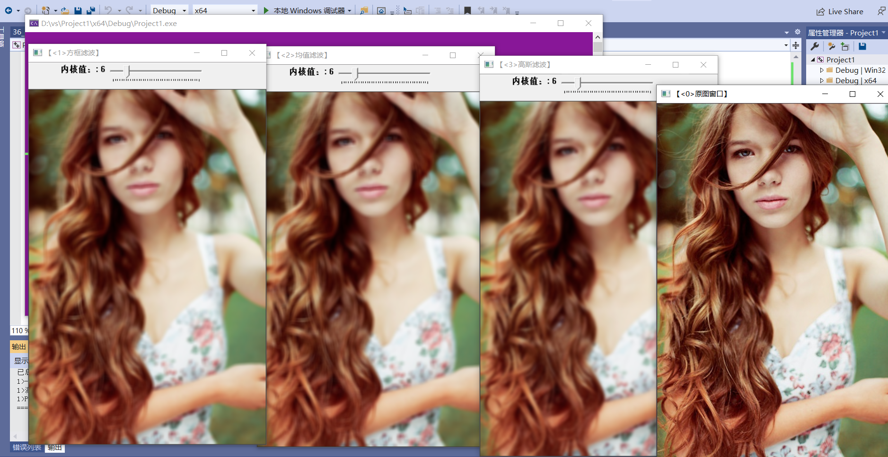
### 中值滤波

```c++


//--------------------------------------【程序说明】-------------------------------------------
//		程序说明：《OpenCV3编程入门》OpenCV3版书本配套示例程序35
//		程序描述：中值滤波medianBlur函数的使用示例程序
//		开发测试所用操作系统： Windows 7 64bit
//		开发测试所用IDE版本：Visual Studio 2010
//		开发测试所用OpenCV版本：	3.0 beta
//		2014年11月 Created by @浅墨_毛星云
//		2014年12月 Revised by @浅墨_毛星云
//------------------------------------------------------------------------------------------------

//-----------------------------------【头文件包含部分】---------------------------------------
//	描述：包含程序所依赖的头文件
//---------------------------------------------------------------------------------------------- 
#include "opencv2/core/core.hpp" 
#include "opencv2/highgui/highgui.hpp" 
#include "opencv2/imgproc/imgproc.hpp" 

//-----------------------------------【命名空间声明部分】---------------------------------------
//	描述：包含程序所使用的命名空间
//-----------------------------------------------------------------------------------------------  
using namespace cv;

//-----------------------------------【main( )函数】--------------------------------------------
//	描述：控制台应用程序的入口函数，我们的程序从这里开始
//-----------------------------------------------------------------------------------------------
int main()
{
	// 载入原图
	Mat image = imread("D:/image/1.jpg");

	//创建窗口
	namedWindow("中值滤波【原图】");
	namedWindow("中值滤波【效果图】");

	//显示原图
	imshow("中值滤波【原图】", image);

	//进行中值滤波操作
	Mat out;
	medianBlur(image, out, 7);

	//显示效果图
	imshow("中值滤波【效果图】", out);

	waitKey(0);
}
```


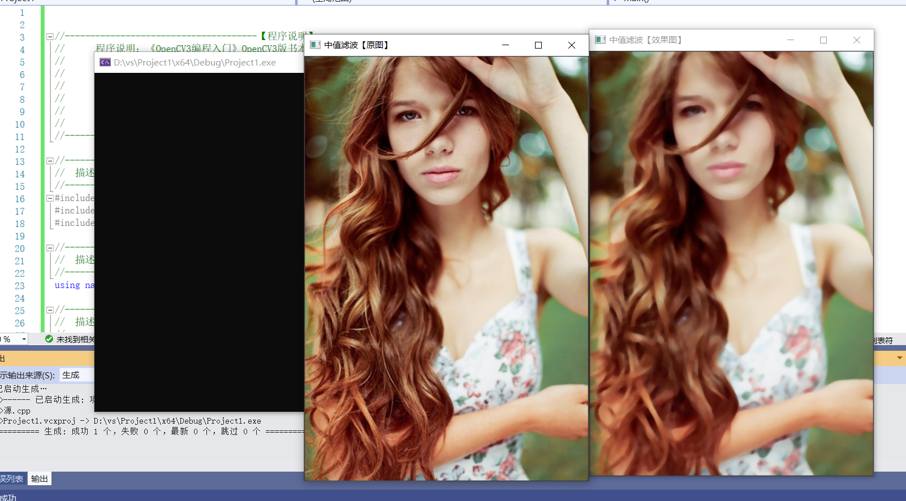

### 双边滤波

```c++
//--------------------------------------【程序说明】-------------------------------------------
//		程序说明：《OpenCV3编程入门》OpenCV3版书本配套示例程序36
//		程序描述：双边滤波bilateralFilter函数的使用示例程序
//		开发测试所用操作系统： Windows 7 64bit
//		开发测试所用IDE版本：Visual Studio 2010
//		开发测试所用OpenCV版本：	3.0 beta
//		2014年11月 Created by @浅墨_毛星云
//		2014年12月 Revised by @浅墨_毛星云
//------------------------------------------------------------------------------------------------


//-----------------------------------【头文件包含部分】---------------------------------------
//	描述：包含程序所依赖的头文件
//---------------------------------------------------------------------------------------------- 
#include "opencv2/core/core.hpp" 
#include "opencv2/highgui/highgui.hpp" 
#include "opencv2/imgproc/imgproc.hpp" 

//-----------------------------------【命名空间声明部分】---------------------------------------
//	描述：包含程序所使用的命名空间
//-----------------------------------------------------------------------------------------------  
using namespace cv;

//-----------------------------------【main( )函数】--------------------------------------------
//	描述：控制台应用程序的入口函数，我们的程序从这里开始
//-----------------------------------------------------------------------------------------------
int main()
{
	// 载入原图
	Mat image = imread("D:/image/1.jpg");

	//创建窗口
	namedWindow("双边滤波【原图】");
	namedWindow("双边滤波【效果图】");

	//显示原图
	imshow("双边滤波【原图】", image);

	//进行双边滤波操作
	Mat out;
	bilateralFilter(image, out, 25, 25 * 2, 25 / 2);

	//显示效果图
	imshow("双边滤波【效果图】", out);

	waitKey(0);
}
```

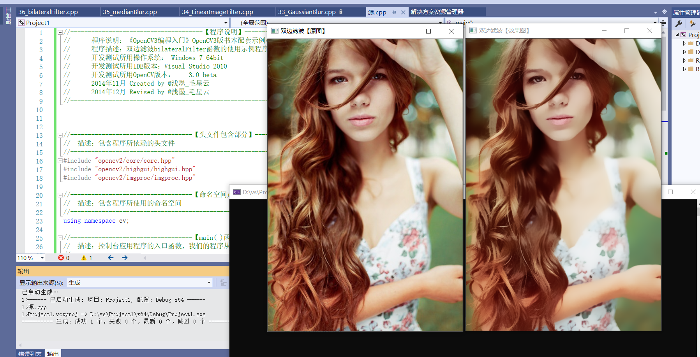

### 图像滤波综述

```c++

//--------------------------------------【程序说明】-------------------------------------------
//		程序说明：《OpenCV3编程入门》OpenCV3版书本配套示例程序37
//		程序描述：五种图像滤波综合示例
//		开发测试所用操作系统： Windows 7 64bit
//		开发测试所用IDE版本：Visual Studio 2010
//		开发测试所用OpenCV版本：	3.0 beta
//		2014年11月 Created by @浅墨_毛星云
//		2014年12月 Revised by @浅墨_毛星云
//------------------------------------------------------------------------------------------------

//-----------------------------------【头文件包含部分】---------------------------------------
//		描述：包含程序所依赖的头文件
//---------------------------------------------------------------------------------------------- 
#include <opencv2/core/core.hpp>
#include <opencv2/highgui/highgui.hpp>
#include <opencv2/imgproc/imgproc.hpp>
#include <iostream>

//-----------------------------------【命名空间声明部分】---------------------------------------
//		描述：包含程序所使用的命名空间
//-----------------------------------------------------------------------------------------------  
using namespace std;
using namespace cv;


//-----------------------------------【全局变量声明部分】--------------------------------------
//		描述：全局变量声明
//-----------------------------------------------------------------------------------------------
Mat g_srcImage, g_dstImage1, g_dstImage2, g_dstImage3, g_dstImage4, g_dstImage5;
int g_nBoxFilterValue = 6;  //方框滤波内核值
int g_nMeanBlurValue = 10;  //均值滤波内核值
int g_nGaussianBlurValue = 6;  //高斯滤波内核值
int g_nMedianBlurValue = 10;  //中值滤波参数值
int g_nBilateralFilterValue = 10;  //双边滤波参数值


//-----------------------------------【全局函数声明部分】--------------------------------------
//		描述：全局函数声明
//-----------------------------------------------------------------------------------------------
//轨迹条回调函数
static void on_BoxFilter(int, void*);		//方框滤波
static void on_MeanBlur(int, void*);		//均值块滤波器
static void on_GaussianBlur(int, void*);			//高斯滤波器
static void on_MedianBlur(int, void*);			//中值滤波器
static void on_BilateralFilter(int, void*);			//双边滤波器
void ShowHelpText();


//-----------------------------------【main( )函数】--------------------------------------------
//		描述：控制台应用程序的入口函数，我们的程序从这里开始
//-----------------------------------------------------------------------------------------------
int main()
{
	system("color 4F");

	ShowHelpText();

	// 载入原图
	g_srcImage = imread("D:/image/1.jpg", 1);
	if (!g_srcImage.data) { printf("读取srcImage错误~！ \n"); return false; }

	//克隆原图到四个Mat类型中
	g_dstImage1 = g_srcImage.clone();
	g_dstImage2 = g_srcImage.clone();
	g_dstImage3 = g_srcImage.clone();
	g_dstImage4 = g_srcImage.clone();
	g_dstImage5 = g_srcImage.clone();

	//显示原图
	namedWindow("【<0>原图窗口】", 1);
	imshow("【<0>原图窗口】", g_srcImage);


	//=================【<1>方框滤波】=========================
	//创建窗口
	namedWindow("【<1>方框滤波】", 1);
	//创建轨迹条
	createTrackbar("内核值：", "【<1>方框滤波】", &g_nBoxFilterValue, 50, on_BoxFilter);
	on_MeanBlur(g_nBoxFilterValue, 0);
	imshow("【<1>方框滤波】", g_dstImage1);
	//=====================================================


	//=================【<2>均值滤波】==========================
	//创建窗口
	namedWindow("【<2>均值滤波】", 1);
	//创建轨迹条
	createTrackbar("内核值：", "【<2>均值滤波】", &g_nMeanBlurValue, 50, on_MeanBlur);
	on_MeanBlur(g_nMeanBlurValue, 0);
	//======================================================


	//=================【<3>高斯滤波】===========================
	//创建窗口
	namedWindow("【<3>高斯滤波】", 1);
	//创建轨迹条
	createTrackbar("内核值：", "【<3>高斯滤波】", &g_nGaussianBlurValue, 50, on_GaussianBlur);
	on_GaussianBlur(g_nGaussianBlurValue, 0);
	//=======================================================


	//=================【<4>中值滤波】===========================
	//创建窗口
	namedWindow("【<4>中值滤波】", 1);
	//创建轨迹条
	createTrackbar("参数值：", "【<4>中值滤波】", &g_nMedianBlurValue, 50, on_MedianBlur);
	on_MedianBlur(g_nMedianBlurValue, 0);
	//=======================================================


	//=================【<5>双边滤波】===========================
	//创建窗口
	namedWindow("【<5>双边滤波】", 1);
	//创建轨迹条
	createTrackbar("参数值：", "【<5>双边滤波】", &g_nBilateralFilterValue, 50, on_BilateralFilter);
	on_BilateralFilter(g_nBilateralFilterValue, 0);
	//=======================================================


	//输出一些帮助信息
	cout << endl << "\t运行成功，请调整滚动条观察图像效果~\n\n"
		<< "\t按下“q”键时，程序退出。\n";
	while (char(waitKey(1)) != 'q') {}

	return 0;
}

//-----------------------------【on_BoxFilter( )函数】------------------------------------
//		描述：方框滤波操作的回调函数
//-----------------------------------------------------------------------------------------------
static void on_BoxFilter(int, void*)
{
	//方框滤波操作
	boxFilter(g_srcImage, g_dstImage1, -1, Size(g_nBoxFilterValue + 1, g_nBoxFilterValue + 1));
	//显示窗口
	imshow("【<1>方框滤波】", g_dstImage1);
}

//-----------------------------【on_MeanBlur( )函数】------------------------------------
//		描述：均值滤波操作的回调函数
//-----------------------------------------------------------------------------------------------
static void on_MeanBlur(int, void*)
{
	blur(g_srcImage, g_dstImage2, Size(g_nMeanBlurValue + 1, g_nMeanBlurValue + 1), Point(-1, -1));
	imshow("【<2>均值滤波】", g_dstImage2);

}

//-----------------------------【on_GaussianBlur( )函数】------------------------------------
//		描述：高斯滤波操作的回调函数
//-----------------------------------------------------------------------------------------------
static void on_GaussianBlur(int, void*)
{
	GaussianBlur(g_srcImage, g_dstImage3, Size(g_nGaussianBlurValue * 2 + 1, g_nGaussianBlurValue * 2 + 1), 0, 0);
	imshow("【<3>高斯滤波】", g_dstImage3);
}


//-----------------------------【on_MedianBlur( )函数】------------------------------------
//		描述：中值滤波操作的回调函数
//-----------------------------------------------------------------------------------------------
static void on_MedianBlur(int, void*)
{
	medianBlur(g_srcImage, g_dstImage4, g_nMedianBlurValue * 2 + 1);
	imshow("【<4>中值滤波】", g_dstImage4);
}


//-----------------------------【on_BilateralFilter( )函数】------------------------------------
//		描述：双边滤波操作的回调函数
//-----------------------------------------------------------------------------------------------
static void on_BilateralFilter(int, void*)
{
	bilateralFilter(g_srcImage, g_dstImage5, g_nBilateralFilterValue, g_nBilateralFilterValue * 2, g_nBilateralFilterValue / 2);
	imshow("【<5>双边滤波】", g_dstImage5);
}

//-----------------------------------【ShowHelpText( )函数】-----------------------------
//		 描述：输出一些帮助信息
//----------------------------------------------------------------------------------------------
void ShowHelpText()
{
	//输出欢迎信息和OpenCV版本
	printf("\n\n\t\t\t非常感谢购买《OpenCV3编程入门》一书！\n");
	printf("\n\n\t\t\t此为本书OpenCV3版的第37个配套示例程序\n");
	printf("\n\n\t\t\t   当前使用的OpenCV版本为：" CV_VERSION);
	printf("\n\n  ----------------------------------------------------------------------------\n");
}


```
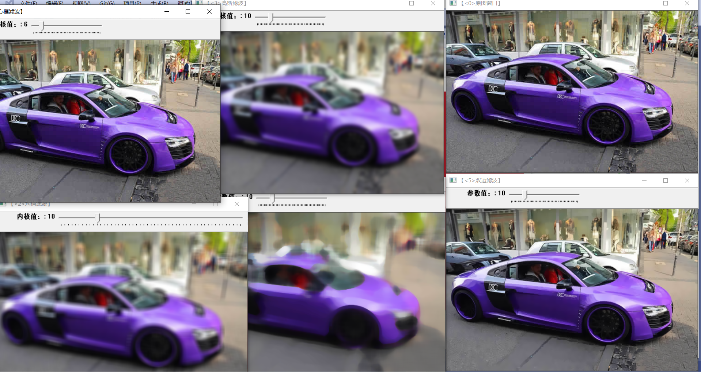

### 膨胀操作

```c++

//--------------------------------------【程序说明】-------------------------------------------
//		程序说明：《OpenCV3编程入门》OpenCV3版书本配套示例程序38
//		程序描述：图像膨胀dilate函数用法示例
//		开发测试所用操作系统： Windows 7 64bit
//		开发测试所用IDE版本：Visual Studio 2010
//		开发测试所用OpenCV版本：	3.0 beta
//		2014年11月 Created by @浅墨_毛星云
//		2014年12月 Revised by @浅墨_毛星云
//------------------------------------------------------------------------------------------------

//-----------------------------------【头文件包含部分】---------------------------------------
//	描述：包含程序所依赖的头文件
//---------------------------------------------------------------------------------------------- 
#include <opencv2/core/core.hpp>
#include <opencv2/highgui/highgui.hpp>
#include <opencv2/imgproc/imgproc.hpp>
#include <iostream>

//-----------------------------------【命名空间声明部分】---------------------------------------
//	描述：包含程序所使用的命名空间
//-----------------------------------------------------------------------------------------------  
using namespace std;
using namespace cv;

//-----------------------------------【main( )函数】--------------------------------------------
//	描述：控制台应用程序的入口函数，我们的程序从这里开始
//-----------------------------------------------------------------------------------------------
int main(   )
{

	//载入原图  
	Mat image = imread("D/image/1.jpg");

	//创建窗口  
	namedWindow("【原图】膨胀操作");
	namedWindow("【效果图】膨胀操作");

	//显示原图
	imshow("【原图】膨胀操作", image);

	//进行膨胀操作 
	Mat element = getStructuringElement(MORPH_RECT, Size(15, 15));
	Mat out;
	dilate(image, out, element);

	//显示效果图 
	imshow("【效果图】膨胀操作", out);

	waitKey(0); 

	return 0;
}
```
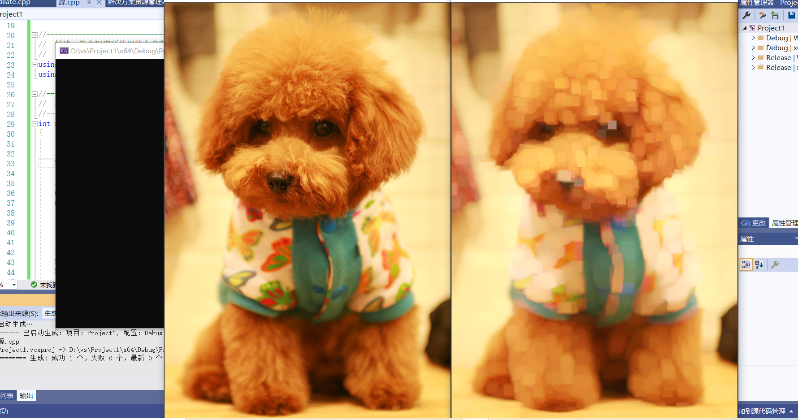

### 腐蚀操作

```c++
//--------------------------------------【程序说明】-------------------------------------------
//		程序说明：《OpenCV3编程入门》OpenCV3版书本配套示例程序39
//		程序描述：图像腐蚀erode函数用法示例
//		开发测试所用操作系统： Windows 7 64bit
//		开发测试所用IDE版本：Visual Studio 2010
//		开发测试所用OpenCV版本：	3.0 beta
//		2014年11月 Created by @浅墨_毛星云
//		2014年12月 Revised by @浅墨_毛星云
//------------------------------------------------------------------------------------------------

//---------------------------------【头文件、命名空间包含部分】----------------------------
//		描述：包含程序所使用的头文件和命名空间
//------------------------------------------------------------------------------------------------
#include <opencv2/highgui/highgui.hpp>
#include <opencv2/imgproc/imgproc.hpp>
using namespace cv;

//-----------------------------------【main( )函数】--------------------------------------------
//	描述：控制台应用程序的入口函数，我们的程序从这里开始
//-----------------------------------------------------------------------------------------------
int main()
{
	//载入原图  
	Mat srcImage = imread("D:/image/1.jpg");
	//显示原图
	imshow("【原图】腐蚀操作", srcImage);
	//进行腐蚀操作 
	Mat element = getStructuringElement(MORPH_RECT, Size(15, 15));
	Mat dstImage;
	erode(srcImage, dstImage, element);
	//显示效果图 
	imshow("【效果图】腐蚀操作", dstImage);
	waitKey(0);

	return 0;
}
```
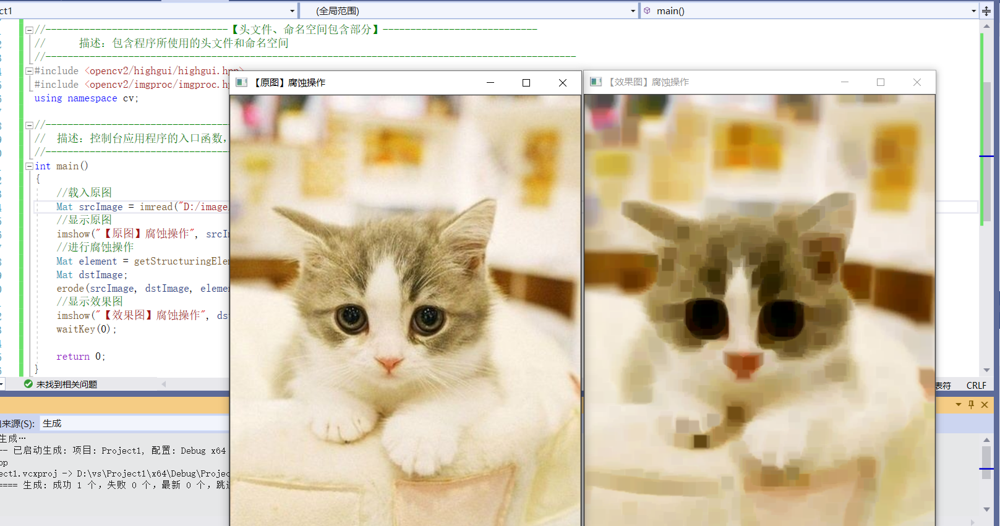

### 综述体验腐蚀操作及其膨胀操作(使用轨迹条)

```c++
//--------------------------------------【程序说明】-------------------------------------------
//		程序说明：《OpenCV3编程入门》OpenCV3版书本配套示例程序40
//		程序描述：图像腐蚀与膨胀综合示例
//		开发测试所用操作系统： Windows 7 64bit
//		开发测试所用IDE版本：Visual Studio 2010
//		开发测试所用OpenCV版本：	3.0 beta
//		2014年11月 Created by @浅墨_毛星云
//		2014年12月 Revised by @浅墨_毛星云
//------------------------------------------------------------------------------------------------


//---------------------------------【头文件、命名空间包含部分】-----------------------------
//		描述：包含程序所使用的头文件和命名空间
//------------------------------------------------------------------------------------------------
#include <opencv2/opencv.hpp>
#include <opencv2/highgui/highgui.hpp>
#include <opencv2/imgproc/imgproc.hpp>
#include <iostream>
using namespace std;
using namespace cv;


//-----------------------------------【全局变量声明部分】--------------------------------------
//		描述：全局变量声明
//-----------------------------------------------------------------------------------------------
Mat g_srcImage, g_dstImage;//原始图和效果图
int g_nTrackbarNumer = 0;//0表示腐蚀erode, 1表示膨胀dilate
int g_nStructElementSize = 3; //结构元素(内核矩阵)的尺寸


//-----------------------------------【全局函数声明部分】--------------------------------------
//		描述：全局函数声明
//-----------------------------------------------------------------------------------------------
void Process();//膨胀和腐蚀的处理函数
void on_TrackbarNumChange(int, void*);//回调函数
void on_ElementSizeChange(int, void*);//回调函数
void ShowHelpText();

//-----------------------------------【main( )函数】--------------------------------------------
//		描述：控制台应用程序的入口函数，我们的程序从这里开始
//-----------------------------------------------------------------------------------------------
int main()
{
	//改变console字体颜色
	system("color 2F");

	//载入原图
	g_srcImage = imread("D:/image/1.jpg");
	if (!g_srcImage.data) { printf("读取srcImage错误~！ \n"); return false; }

	ShowHelpText();

	//显示原始图
	namedWindow("【原始图】");
	imshow("【原始图】", g_srcImage);

	//进行初次腐蚀操作并显示效果图
	namedWindow("【效果图】");
	//获取自定义核
	Mat element = getStructuringElement(MORPH_RECT, Size(2 * g_nStructElementSize + 1, 2 * g_nStructElementSize + 1), Point(g_nStructElementSize, g_nStructElementSize));
	erode(g_srcImage, g_dstImage, element);
	imshow("【效果图】", g_dstImage);

	//创建轨迹条
	createTrackbar("腐蚀/膨胀", "【效果图】", &g_nTrackbarNumer, 1, on_TrackbarNumChange);
	createTrackbar("内核尺寸", "【效果图】", &g_nStructElementSize, 21, on_ElementSizeChange);

	//输出一些帮助信息
	cout << endl << "\t运行成功，请调整滚动条观察图像效果~\n\n"
		<< "\t按下“q”键时，程序退出。\n";

	//轮询获取按键信息，若下q键，程序退出
	while (char(waitKey(1)) != 'q') {}

	return 0;
}

//-----------------------------【Process( )函数】------------------------------------
//		描述：进行自定义的腐蚀和膨胀操作
//-----------------------------------------------------------------------------------------
void Process()
{
	//获取自定义核
	Mat element = getStructuringElement(MORPH_RECT, Size(2 * g_nStructElementSize + 1, 2 * g_nStructElementSize + 1), Point(g_nStructElementSize, g_nStructElementSize));

	//进行腐蚀或膨胀操作
	if (g_nTrackbarNumer == 0) {
		erode(g_srcImage, g_dstImage, element);
	}
	else {
		dilate(g_srcImage, g_dstImage, element);
	}

	//显示效果图
	imshow("【效果图】", g_dstImage);
}


//-----------------------------【on_TrackbarNumChange( )函数】------------------------------------
//		描述：腐蚀和膨胀之间切换开关的回调函数
//-----------------------------------------------------------------------------------------------------
void on_TrackbarNumChange(int, void*)
{
	//腐蚀和膨胀之间效果已经切换，回调函数体内需调用一次Process函数，使改变后的效果立即生效并显示出来
	Process();
}


//-----------------------------【on_ElementSizeChange( )函数】-------------------------------------
//		描述：腐蚀和膨胀操作内核改变时的回调函数
//-----------------------------------------------------------------------------------------------------
void on_ElementSizeChange(int, void*)
{
	//内核尺寸已改变，回调函数体内需调用一次Process函数，使改变后的效果立即生效并显示出来
	Process();
}


//-----------------------------------【ShowHelpText( )函数】-----------------------------
//		 描述：输出一些帮助信息
//----------------------------------------------------------------------------------------------
void ShowHelpText()
{
	//输出欢迎信息和OpenCV版本
	printf("\n\n\t\t\t非常感谢购买《OpenCV3编程入门》一书！\n");
	printf("\n\n\t\t\t此为本书OpenCV3版的第40个配套示例程序\n");
	printf("\n\n\t\t\t   当前使用的OpenCV版本为：" CV_VERSION);
	printf("\n\n  ----------------------------------------------------------------------------\n");
}

```
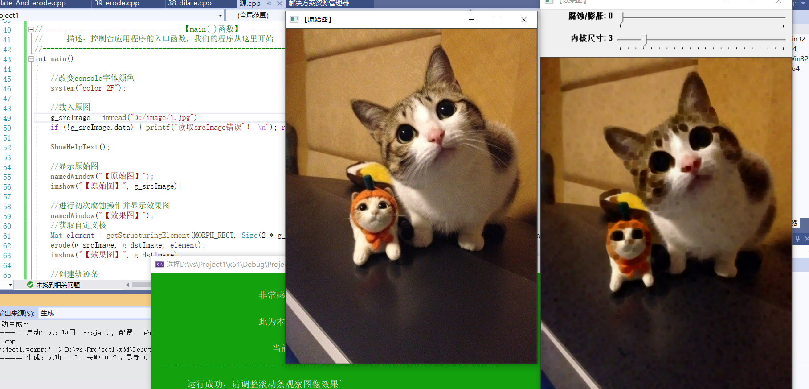

### 形态学滤波

#### 用morphologyEx进行图像膨胀

```c++

//--------------------------------------【程序说明】-------------------------------------------
//		程序说明：《OpenCV3编程入门》OpenCV3版书本配套示例程序41
//		程序描述：用morphologyEx进行图像膨胀
//		开发测试所用操作系统： Windows 7 64bit
//		开发测试所用IDE版本：Visual Studio 2010
//		开发测试所用OpenCV版本：	3.0 beta
//		2014年11月 Created by @浅墨_毛星云
//		2014年12月 Revised by @浅墨_毛星云
//------------------------------------------------------------------------------------------------

//---------------------------------【头文件、命名空间包含部分】----------------------------
//		描述：包含程序所使用的头文件和命名空间
//------------------------------------------------------------------------------------------------
#include <opencv2/opencv.hpp>
#include <opencv2/highgui/highgui.hpp>
#include <opencv2/imgproc/imgproc.hpp>
using namespace cv;


//-----------------------------------【main( )函数】--------------------------------------------
//		描述：控制台应用程序的入口函数，我们的程序从这里开始
//-----------------------------------------------------------------------------------------------
int main()
{
	//载入原始图   
	Mat image = imread("D:/image/1.jpg");  //工程目录下应该有一张名为1.jpg的素材图
	//创建窗口   
	namedWindow("【原始图】膨胀");
	namedWindow("【效果图】膨胀");
	//显示原始图  
	imshow("【原始图】膨胀", image);
	//定义核
	Mat element = getStructuringElement(MORPH_RECT, Size(15, 15));
	//进行形态学操作
	morphologyEx(image, image, MORPH_DILATE, element);
	//显示效果图  
	imshow("【效果图】膨胀", image);

	waitKey(0);

	return 0;
}
```

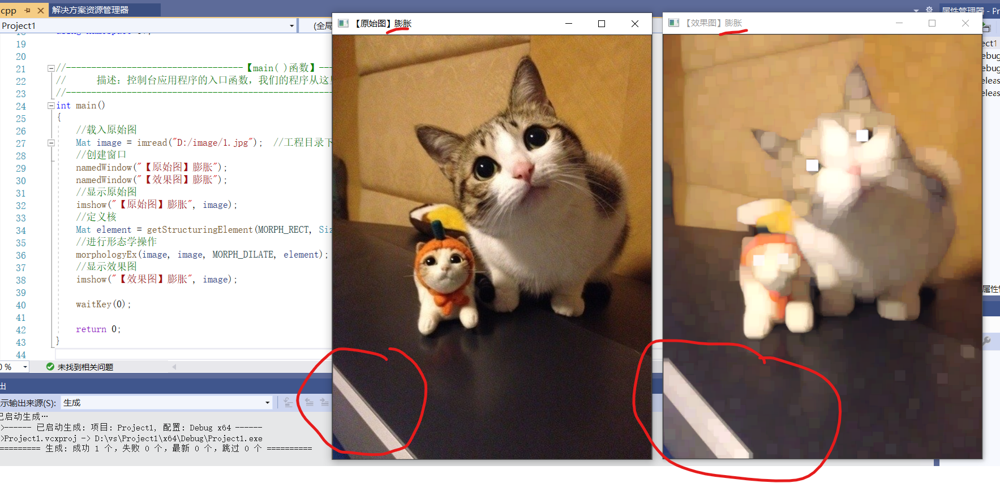
开始没有理解膨胀，但是老师讲到这条线的变化，理解了

#### 用morphologyEx进行图像腐蚀

```c++
//--------------------------------------【程序说明】-------------------------------------------
//		程序说明：《OpenCV3编程入门》OpenCV3版书本配套示例程序42
//		程序描述：用morphologyEx进行图像腐蚀
//		开发测试所用操作系统： Windows 7 64bit
//		开发测试所用IDE版本：Visual Studio 2010
//		开发测试所用OpenCV版本：	3.0 beta
//		2014年11月 Created by @浅墨_毛星云
//		2014年12月 Revised by @浅墨_毛星云
//------------------------------------------------------------------------------------------------


//-----------------------------------【头文件包含部分】---------------------------------------
//		描述：包含程序所依赖的头文件
//---------------------------------------------------------------------------------------------- 
#include <opencv2/opencv.hpp>
#include <opencv2/highgui/highgui.hpp>
#include <opencv2/imgproc/imgproc.hpp>

//-----------------------------------【命名空间声明部分】---------------------------------------
//		描述：包含程序所使用的命名空间
//----------------------------------------------------------------------------------------------- 
using namespace cv;
//-----------------------------------【main( )函数】--------------------------------------------
//		描述：控制台应用程序的入口函数，我们的程序从这里开始
//-----------------------------------------------------------------------------------------------
int main()
{
	//载入原始图   
	Mat image = imread("D:/image/1.jpg");  //工程目录下应该有一张名为1.jpg的素材图
	//创建窗口   
	namedWindow("【原始图】腐蚀");
	namedWindow("【效果图】腐蚀");
	//显示原始图  
	imshow("【原始图】腐蚀", image);
	//定义核
	Mat element = getStructuringElement(MORPH_RECT, Size(15, 15));
	//进行形态学操作
	morphologyEx(image, image, MORPH_ERODE, element);
	//显示效果图  
	imshow("【效果图】腐蚀", image);

	waitKey(0);

	return 0;
}

```

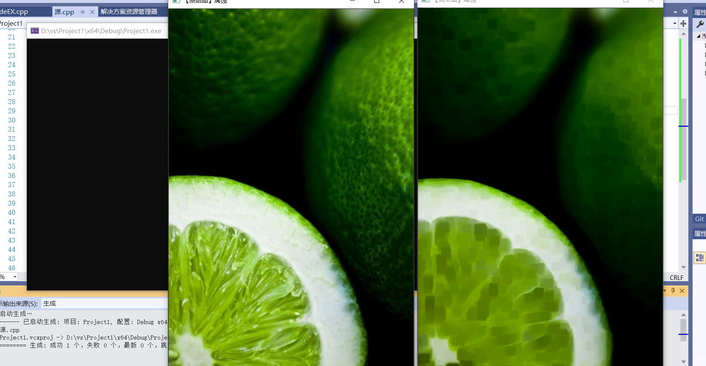

### 用morphologyEx进行图像开运算

```c++

//--------------------------------------【程序说明】-------------------------------------------
//		程序说明：《OpenCV3编程入门》OpenCV3版书本配套示例程序43
//		程序描述：用morphologyEx进行图像形态学开运算用法示例
//		开发测试所用操作系统： Windows 7 64bit
//		开发测试所用IDE版本：Visual Studio 2010
//		开发测试所用OpenCV版本：	3.0 beta
//		2014年11月 Created by @浅墨_毛星云
//		2014年12月 Revised by @浅墨_毛星云
//------------------------------------------------------------------------------------------------


//---------------------------------【头文件、命名空间包含部分】----------------------------
//		描述：包含程序所使用的头文件和命名空间
//------------------------------------------------------------------------------------------------
#include <opencv2/opencv.hpp>
#include <opencv2/highgui/highgui.hpp>
#include <opencv2/imgproc/imgproc.hpp>
using namespace cv;

//-----------------------------------【main( )函数】--------------------------------------------
//		描述：控制台应用程序的入口函数，我们的程序从这里开始
//-----------------------------------------------------------------------------------------------
int main()
{
	//载入原始图   
	Mat image = imread("D:/image/1.jpg");  //工程目录下应该有一张名为1.jpg的素材图
	//创建窗口   
	namedWindow("【原始图】开运算");
	namedWindow("【效果图】开运算");
	//显示原始图  
	imshow("【原始图】开运算", image);
	//定义核
	Mat element = getStructuringElement(MORPH_RECT, Size(15, 15));
	//进行形态学操作
	morphologyEx(image, image, MORPH_OPEN, element);
	//显示效果图  
	imshow("【效果图】开运算", image);

	waitKey(0);

	return 0;
}

```


### 用morphologyEx进行图像闭运算

```c++

//--------------------------------------【程序说明】-------------------------------------------
//		程序说明：《OpenCV3编程入门》OpenCV3版书本配套示例程序44
//		程序描述：用morphologyEx进行图像闭运算
//		开发测试所用操作系统： Windows 7 64bit
//		开发测试所用IDE版本：Visual Studio 2010
//		开发测试所用OpenCV版本：	3.0 beta
//		2014年11月 Created by @浅墨_毛星云
//		2014年12月 Revised by @浅墨_毛星云
//------------------------------------------------------------------------------------------------


//---------------------------------【头文件、命名空间包含部分】----------------------------
//		描述：包含程序所使用的头文件和命名空间
//------------------------------------------------------------------------------------------------
#include <opencv2/opencv.hpp>
#include <opencv2/highgui/highgui.hpp>
#include <opencv2/imgproc/imgproc.hpp>
using namespace cv;


//-----------------------------------【main( )函数】------------------------------------------
//		描述：控制台应用程序的入口函数，我们的程序从这里开始
//-----------------------------------------------------------------------------------------------
int main()
{
	//载入原始图   
	Mat image = imread("D:/image/1.jpg");  //工程目录下应该有一张名为1.jpg的素材图
	//创建窗口   
	namedWindow("【原始图】闭运算");
	namedWindow("【效果图】闭运算");
	//显示原始图  
	imshow("【原始图】闭运算", image);
	//定义核
	Mat element = getStructuringElement(MORPH_RECT, Size(15, 15));
	//进行形态学操作
	morphologyEx(image, image, MORPH_CLOSE, element);
	//显示效果图  
	imshow("【效果图】闭运算", image);

	waitKey(0);

	return 0;
}

```
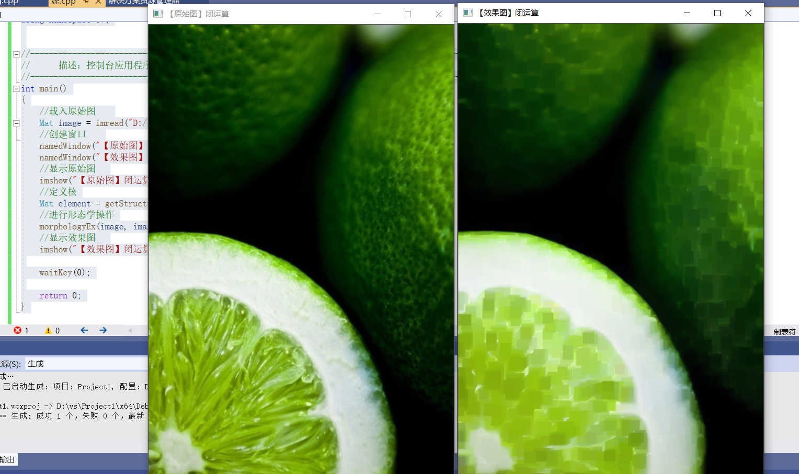

#### 形态学梯度

```c++

//--------------------------------------【程序说明】-------------------------------------------
//		程序说明：《OpenCV3编程入门》OpenCV3版书本配套示例程序45
//		程序描述：用morphologyEx进行形态学梯度运算
//		开发测试所用操作系统： Windows 7 64bit
//		开发测试所用IDE版本：Visual Studio 2010
//		开发测试所用OpenCV版本：	3.0 beta
//		2014年11月 Created by @浅墨_毛星云
//		2014年12月 Revised by @浅墨_毛星云
//------------------------------------------------------------------------------------------------


//---------------------------------【头文件、命名空间包含部分】----------------------------
//		描述：包含程序所使用的头文件和命名空间
//------------------------------------------------------------------------------------------------
#include <opencv2/opencv.hpp>
#include <opencv2/highgui/highgui.hpp>
#include <opencv2/imgproc/imgproc.hpp>
using namespace cv;


//-----------------------------------【main( )函数】------------------------------------------
//		描述：控制台应用程序的入口函数，我们的程序从这里开始
//-----------------------------------------------------------------------------------------------
int main()
{
	//载入原始图   
	Mat image = imread("D:/image/1.jpg");  //工程目录下应该有一张名为1.jpg的素材图
	//创建窗口   
	namedWindow("【原始图】形态学梯度");
	namedWindow("【效果图】形态学梯度");
	//显示原始图  
	imshow("【原始图】形态学梯度", image);
	//定义核
	Mat element = getStructuringElement(MORPH_RECT, Size(15, 15));
	//进行形态学操作
	morphologyEx(image, image, MORPH_GRADIENT, element);
	//显示效果图  
	imshow("【效果图】形态学梯度", image);

	waitKey(0);

	return 0;
}

```
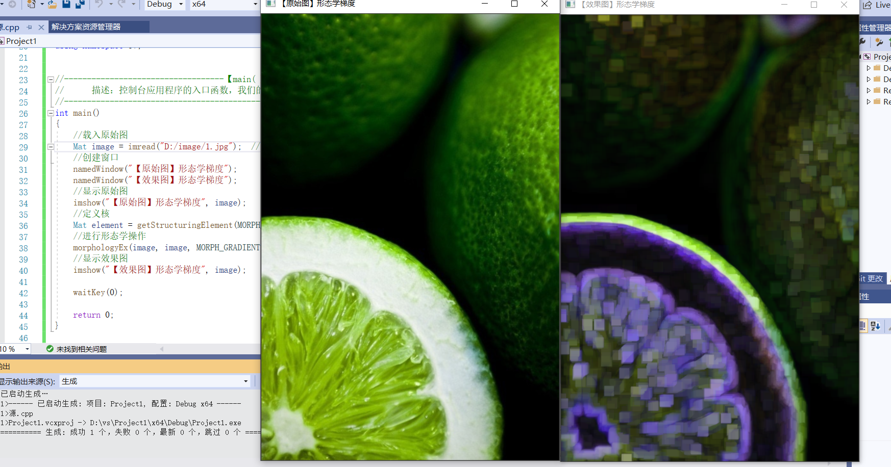

#### 顶帽运算

```c++
//--------------------------------------【程序说明】-------------------------------------------
//		程序说明：《OpenCV3编程入门》OpenCV3版书本配套示例程序46
//		程序描述：用morphologyEx进行形态学顶帽运算
//		开发测试所用操作系统： Windows 7 64bit
//		开发测试所用IDE版本：Visual Studio 2010
//		开发测试所用OpenCV版本：	3.0 beta
//		2014年11月 Created by @浅墨_毛星云
//		2014年12月 Revised by @浅墨_毛星云
//------------------------------------------------------------------------------------------------


//---------------------------------【头文件、命名空间包含部分】----------------------------
//		描述：包含程序所使用的头文件和命名空间
//------------------------------------------------------------------------------------------------
#include <opencv2/opencv.hpp>
#include <opencv2/highgui/highgui.hpp>
#include <opencv2/imgproc/imgproc.hpp>
using namespace cv;


//-----------------------------------【main( )函数】------------------------------------------
//		描述：控制台应用程序的入口函数，我们的程序从这里开始
//-----------------------------------------------------------------------------------------------
int main()
{
	//载入原始图   
	Mat image = imread("D:/image/1.jpg");  //工程目录下应该有一张名为1.jpg的素材图
	//创建窗口   
	namedWindow("【原始图】顶帽运算");
	namedWindow("【效果图】顶帽运算");
	//显示原始图  
	imshow("【原始图】顶帽运算", image);
	//定义核
	Mat element = getStructuringElement(MORPH_RECT, Size(15, 15));
	//进行形态学操作
	morphologyEx(image, image, MORPH_TOPHAT, element);
	//显示效果图  
	imshow("【效果图】顶帽运算", image);

	waitKey(0);

	return 0;
}

```
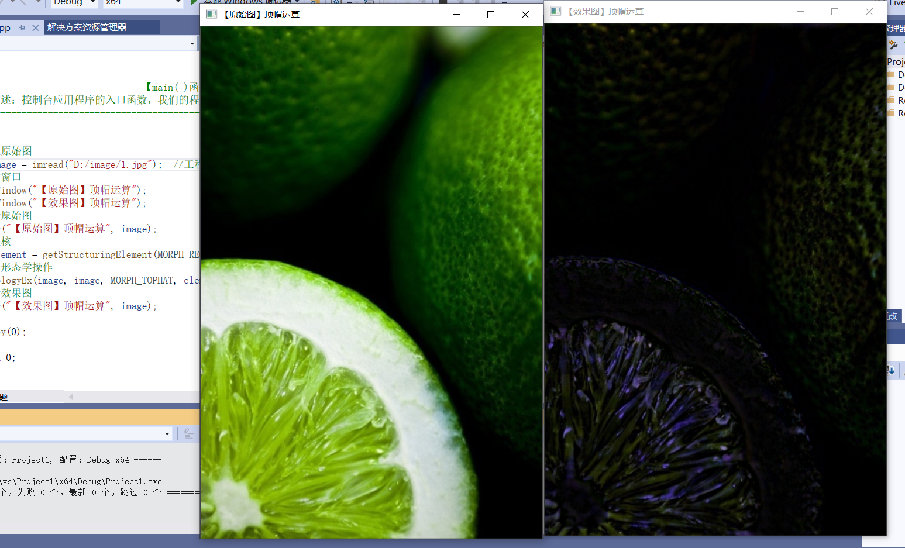

#### 黑帽运算

```c++


//--------------------------------------【程序说明】-------------------------------------------
//		程序说明：《OpenCV3编程入门》OpenCV3版书本配套示例程序47
//		程序描述：用morphologyEx进行形态学黑帽运算
//		开发测试所用操作系统： Windows 7 64bit
//		开发测试所用IDE版本：Visual Studio 2010
//		开发测试所用OpenCV版本：	3.0 beta
//		2014年11月 Created by @浅墨_毛星云
//		2014年12月 Revised by @浅墨_毛星云
//------------------------------------------------------------------------------------------------


//---------------------------------【头文件、命名空间包含部分】----------------------------
//		描述：包含程序所使用的头文件和命名空间
//------------------------------------------------------------------------------------------------
#include <opencv2/opencv.hpp>
#include <opencv2/highgui/highgui.hpp>
#include <opencv2/imgproc/imgproc.hpp>
using namespace cv;


//-----------------------------------【main( )函数】--------------------------------------------
//		描述：控制台应用程序的入口函数，我们的程序从这里开始
//-----------------------------------------------------------------------------------------------
int main()
{
	//载入原始图   
	Mat image = imread("D:/image/1.jpg");  //工程目录下应该有一张名为1.jpg的素材图
	//创建窗口   
	namedWindow("【原始图】黑帽运算");
	namedWindow("【效果图】黑帽运算");
	//显示原始图  
	imshow("【原始图】黑帽运算", image);
	//定义核
	Mat element = getStructuringElement(MORPH_RECT, Size(15, 15));
	//进行形态学操作
	morphologyEx(image, image, MORPH_BLACKHAT, element);
	//显示效果图  
	imshow("【效果图】黑帽运算", image);

	waitKey(0);

	return 0;
}

```

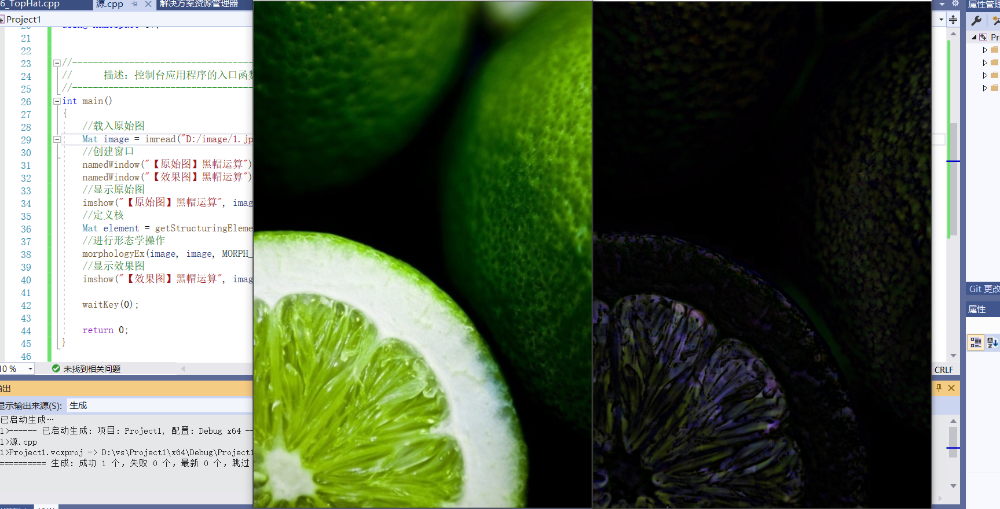

#### 综述

```c++

//--------------------------------------【程序说明】-------------------------------------------
//		程序说明：《OpenCV3编程入门》OpenCV3版书本配套示例程序48
//		程序描述：形态学图像处理——开运算、闭运算、形态学梯度、顶帽、黑帽
//		开发测试所用操作系统： Windows 7 64bit
//		开发测试所用IDE版本：Visual Studio 2010
//		开发测试所用OpenCV版本：	3.0 beta
//		2014年11月 Created by @浅墨_毛星云
//		2014年12月 Revised by @浅墨_毛星云
//------------------------------------------------------------------------------------------------


//---------------------------------【头文件、命名空间包含部分】----------------------------
//		描述：包含程序所使用的头文件和命名空间
//------------------------------------------------------------------------------------------------
#include <opencv2/opencv.hpp>
#include <opencv2/highgui/highgui.hpp>
#include <opencv2/imgproc/imgproc.hpp>
using namespace std;
using namespace cv;


//-----------------------------------【全局变量声明部分】-----------------------------------
//		描述：全局变量声明
//-----------------------------------------------------------------------------------------------
Mat g_srcImage, g_dstImage;//原始图和效果图
int g_nElementShape = MORPH_RECT;//元素结构的形状

//变量接收的TrackBar位置参数
int g_nMaxIterationNum = 10;
int g_nOpenCloseNum = 0;
int g_nErodeDilateNum = 0;
int g_nTopBlackHatNum = 0;


//-----------------------------------【全局函数声明部分】--------------------------------------
//		描述：全局函数声明
//-----------------------------------------------------------------------------------------------
static void on_OpenClose(int, void*);//回调函数
static void on_ErodeDilate(int, void*);//回调函数
static void on_TopBlackHat(int, void*);//回调函数
static void ShowHelpText();


//-----------------------------------【main( )函数】--------------------------------------------
//		描述：控制台应用程序的入口函数，我们的程序从这里开始
//-----------------------------------------------------------------------------------------------
int main()
{
	//改变console字体颜色
	system("color 2F");

	ShowHelpText();

	//载入原图
	g_srcImage = imread("D:/image/1.jpg");
	if (!g_srcImage.data) { printf("Oh，no，读取srcImage错误~！ \n"); return false; }

	//显示原始图
	namedWindow("【原始图】");
	imshow("【原始图】", g_srcImage);

	//创建三个窗口
	namedWindow("【开运算/闭运算】", 1);
	namedWindow("【腐蚀/膨胀】", 1);
	namedWindow("【顶帽/黑帽】", 1);

	//参数赋值
	g_nOpenCloseNum = 9;
	g_nErodeDilateNum = 9;
	g_nTopBlackHatNum = 2;

	//分别为三个窗口创建滚动条
	createTrackbar("迭代值", "【开运算/闭运算】", &g_nOpenCloseNum, g_nMaxIterationNum * 2 + 1, on_OpenClose);
	createTrackbar("迭代值", "【腐蚀/膨胀】", &g_nErodeDilateNum, g_nMaxIterationNum * 2 + 1, on_ErodeDilate);
	createTrackbar("迭代值", "【顶帽/黑帽】", &g_nTopBlackHatNum, g_nMaxIterationNum * 2 + 1, on_TopBlackHat);

	//轮询获取按键信息
	while (1)
	{
		int c;

		//执行回调函数
		on_OpenClose(g_nOpenCloseNum, 0);
		on_ErodeDilate(g_nErodeDilateNum, 0);
		on_TopBlackHat(g_nTopBlackHatNum, 0);

		//获取按键
		c = waitKey(0);

		//按下键盘按键Q或者ESC，程序退出
		if ((char)c == 'q' || (char)c == 27)
			break;
		//按下键盘按键1，使用椭圆(Elliptic)结构元素结构元素MORPH_ELLIPSE
		if ((char)c == 49)//键盘按键1的ASII码为49
			g_nElementShape = MORPH_ELLIPSE;
		//按下键盘按键2，使用矩形(Rectangle)结构元素MORPH_RECT
		else if ((char)c == 50)//键盘按键2的ASII码为50
			g_nElementShape = MORPH_RECT;
		//按下键盘按键3，使用十字形(Cross-shaped)结构元素MORPH_CROSS
		else if ((char)c == 51)//键盘按键3的ASII码为51
			g_nElementShape = MORPH_CROSS;
		//按下键盘按键space，在矩形、椭圆、十字形结构元素中循环
		else if ((char)c == ' ')
			g_nElementShape = (g_nElementShape + 1) % 3;
	}

	return 0;
}


//-----------------------------------【on_OpenClose( )函数】----------------------------------
//		描述：【开运算/闭运算】窗口的回调函数
//-----------------------------------------------------------------------------------------------
static void on_OpenClose(int, void*)
{
	//偏移量的定义
	int offset = g_nOpenCloseNum - g_nMaxIterationNum;//偏移量
	int Absolute_offset = offset > 0 ? offset : -offset;//偏移量绝对值
	//自定义核
	Mat element = getStructuringElement(g_nElementShape, Size(Absolute_offset * 2 + 1, Absolute_offset * 2 + 1), Point(Absolute_offset, Absolute_offset));
	//进行操作
	if (offset < 0)
		//此句代码的OpenCV2版为：
		//morphologyEx(g_srcImage, g_dstImage, CV_MOP_OPEN, element);
		//此句代码的OpenCV3版为:
		morphologyEx(g_srcImage, g_dstImage, MORPH_OPEN, element);
	else
		//此句代码的OpenCV2版为：
		//morphologyEx(g_srcImage, g_dstImage, CV_MOP_CLOSE, element);
		//此句代码的OpenCV3版为:
		morphologyEx(g_srcImage, g_dstImage, MORPH_CLOSE, element);


	//显示图像
	imshow("【开运算/闭运算】", g_dstImage);
}


//-----------------------------------【on_ErodeDilate( )函数】----------------------------------
//		描述：【腐蚀/膨胀】窗口的回调函数
//-----------------------------------------------------------------------------------------------
static void on_ErodeDilate(int, void*)
{
	//偏移量的定义
	int offset = g_nErodeDilateNum - g_nMaxIterationNum;	//偏移量
	int Absolute_offset = offset > 0 ? offset : -offset;//偏移量绝对值
	//自定义核
	Mat element = getStructuringElement(g_nElementShape, Size(Absolute_offset * 2 + 1, Absolute_offset * 2 + 1), Point(Absolute_offset, Absolute_offset));
	//进行操作
	if (offset < 0)
		erode(g_srcImage, g_dstImage, element);
	else
		dilate(g_srcImage, g_dstImage, element);
	//显示图像
	imshow("【腐蚀/膨胀】", g_dstImage);
}


//-----------------------------------【on_TopBlackHat( )函数】--------------------------------
//		描述：【顶帽运算/黑帽运算】窗口的回调函数
//----------------------------------------------------------------------------------------------
static void on_TopBlackHat(int, void*)
{
	//偏移量的定义
	int offset = g_nTopBlackHatNum - g_nMaxIterationNum;//偏移量
	int Absolute_offset = offset > 0 ? offset : -offset;//偏移量绝对值
	//自定义核
	Mat element = getStructuringElement(g_nElementShape, Size(Absolute_offset * 2 + 1, Absolute_offset * 2 + 1), Point(Absolute_offset, Absolute_offset));
	//进行操作
	if (offset < 0)
		morphologyEx(g_srcImage, g_dstImage, MORPH_TOPHAT, element);
	else
		morphologyEx(g_srcImage, g_dstImage, MORPH_BLACKHAT, element);
	//显示图像
	imshow("【顶帽/黑帽】", g_dstImage);
}

//-----------------------------------【ShowHelpText( )函数】----------------------------------
//		描述：输出一些帮助信息
//----------------------------------------------------------------------------------------------
static void ShowHelpText()
{
	//输出欢迎信息和OpenCV版本
	printf("\n\n\t\t\t非常感谢购买《OpenCV3编程入门》一书！\n");
	printf("\n\n\t\t\t此为本书OpenCV3版的第48个配套示例程序\n");
	printf("\n\n\t\t\t   当前使用的OpenCV版本为：" CV_VERSION);
	printf("\n\n  ----------------------------------------------------------------------------\n");

	//输出一些帮助信息
	printf("\n\t请调整滚动条观察图像效果\n\n");
	printf("\n\t按键操作说明: \n\n"
		"\t\t键盘按键【ESC】或者【Q】- 退出程序\n"
		"\t\t键盘按键【1】- 使用椭圆(Elliptic)结构元素\n"
		"\t\t键盘按键【2】- 使用矩形(Rectangle )结构元素\n"
		"\t\t键盘按键【3】- 使用十字型(Cross-shaped)结构元素\n"
		"\t\t键盘按键【空格SPACE】- 在矩形、椭圆、十字形结构元素中循环\n");
}
```


### 漫水填充

```c++

//--------------------------------------【程序说明】-------------------------------------------
//		程序说明：《OpenCV3编程入门》OpenCV3版书本配套示例程序49
//		程序描述：漫水填充floodFill函数用法示例
//		开发测试所用操作系统： Windows 7 64bit
//		开发测试所用IDE版本：Visual Studio 2010
//		开发测试所用OpenCV版本：	3.0 beta
//		2014年11月 Created by @浅墨_毛星云
//		2014年12月 Revised by @浅墨_毛星云
//------------------------------------------------------------------------------------------------


//---------------------------------【头文件、命名空间包含部分】----------------------------
//		描述：包含程序所使用的头文件和命名空间
//------------------------------------------------------------------------------------------------
#include <opencv2/opencv.hpp>  
#include <opencv2/imgproc/imgproc.hpp>  
using namespace cv;


//-----------------------------------【main( )函数】--------------------------------------------  
//      描述：控制台应用程序的入口函数，我们的程序从这里开始  
//----------------------------------------------------------------------------------------------- 
int main()
{
	Mat src = imread("D:/image/1.jpg");
	imshow("【原始图】", src);
	Rect ccomp;
	floodFill(src, Point(50, 300), Scalar(155, 255, 55), &ccomp, Scalar(20, 20, 20), Scalar(20, 20, 20));
	imshow("【效果图】", src);
	waitKey(0);
	return 0;
}
```

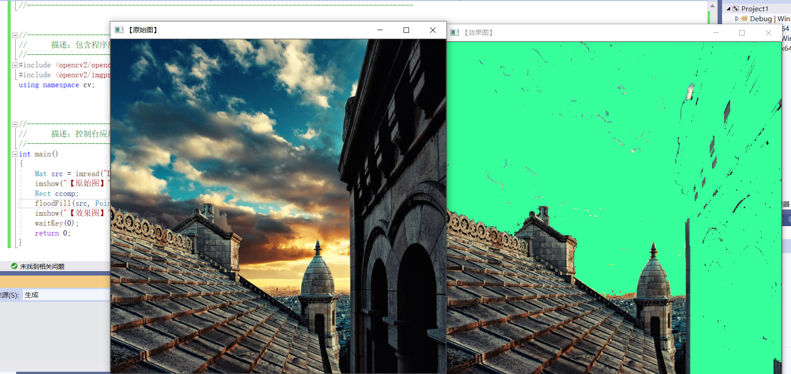

### 漫水填充算法综合示例

```c++

//--------------------------------------【程序说明】-------------------------------------------
//		程序说明：《OpenCV3编程入门》OpenCV3版书本配套示例程序50
//		程序描述：漫水填充算法综合示例
//		开发测试所用操作系统： Windows 7 64bit
//		开发测试所用IDE版本：Visual Studio 2010
//		开发测试所用OpenCV版本：	3.0 beta
//		2014年11月 Created by @浅墨_毛星云
//		2014年12月 Revised by @浅墨_毛星云
//------------------------------------------------------------------------------------------------


//---------------------------------【头文件、命名空间包含部分】----------------------------
//		描述：包含程序所使用的头文件和命名空间
//------------------------------------------------------------------------------------------------
#include "opencv2/imgproc/imgproc.hpp"
#include "opencv2/highgui/highgui.hpp"
#include <iostream>
using namespace cv;
using namespace std;


//-----------------------------------【全局变量声明部分】--------------------------------------  
//      描述：全局变量声明  
//-----------------------------------------------------------------------------------------------  
Mat g_srcImage, g_dstImage, g_grayImage, g_maskImage;//定义原始图、目标图、灰度图、掩模图
int g_nFillMode = 1;//漫水填充的模式
int g_nLowDifference = 20, g_nUpDifference = 20;//负差最大值、正差最大值
int g_nConnectivity = 4;//表示floodFill函数标识符低八位的连通值
int g_bIsColor = true;//是否为彩色图的标识符布尔值
bool g_bUseMask = false;//是否显示掩膜窗口的布尔值
int g_nNewMaskVal = 255;//新的重新绘制的像素值


//-----------------------------------【ShowHelpText( )函数】----------------------------------  
//      描述：输出一些帮助信息  
//----------------------------------------------------------------------------------------------  
static void ShowHelpText()
{
	//输出欢迎信息和OpenCV版本
	printf("\n\n\t\t\t非常感谢购买《OpenCV3编程入门》一书！\n");
	printf("\n\n\t\t\t此为本书OpenCV3版的第50个配套示例程序\n");
	printf("\n\n\t\t\t   当前使用的OpenCV版本为：" CV_VERSION);
	printf("\n\n  ----------------------------------------------------------------------------\n");

	//输出一些帮助信息  
	printf("\n\n\t欢迎来到漫水填充示例程序~");
	printf("\n\n\t本示例根据鼠标选取的点搜索图像中与之颜色相近的点，并用不同颜色标注。");

	printf("\n\n\t按键操作说明: \n\n"
		"\t\t鼠标点击图中区域- 进行漫水填充操作\n"
		"\t\t键盘按键【ESC】- 退出程序\n"
		"\t\t键盘按键【1】-  切换彩色图/灰度图模式\n"
		"\t\t键盘按键【2】- 显示/隐藏掩膜窗口\n"
		"\t\t键盘按键【3】- 恢复原始图像\n"
		"\t\t键盘按键【4】- 使用空范围的漫水填充\n"
		"\t\t键盘按键【5】- 使用渐变、固定范围的漫水填充\n"
		"\t\t键盘按键【6】- 使用渐变、浮动范围的漫水填充\n"
		"\t\t键盘按键【7】- 操作标志符的低八位使用4位的连接模式\n"
		"\t\t键盘按键【8】- 操作标志符的低八位使用8位的连接模式\n\n");
}


//-----------------------------------【onMouse( )函数】--------------------------------------  
//      描述：鼠标消息onMouse回调函数
//---------------------------------------------------------------------------------------------
static void onMouse(int event, int x, int y, int, void*)
{
	// 若鼠标左键没有按下，便返回
	//此句代码的OpenCV2版为：
	//if( event != CV_EVENT_LBUTTONDOWN )
	//此句代码的OpenCV3版为：
	if (event != EVENT_LBUTTONDOWN)
		return;

	//-------------------【<1>调用floodFill函数之前的参数准备部分】---------------
	Point seed = Point(x, y);
	int LowDifference = g_nFillMode == 0 ? 0 : g_nLowDifference;//空范围的漫水填充，此值设为0，否则设为全局的g_nLowDifference
	int UpDifference = g_nFillMode == 0 ? 0 : g_nUpDifference;//空范围的漫水填充，此值设为0，否则设为全局的g_nUpDifference

	//标识符的0~7位为g_nConnectivity，8~15位为g_nNewMaskVal左移8位的值，16~23位为CV_FLOODFILL_FIXED_RANGE或者0。
	//此句代码的OpenCV2版为：
	//int flags = g_nConnectivity + (g_nNewMaskVal << 8) +(g_nFillMode == 1 ? CV_FLOODFILL_FIXED_RANGE : 0);
	//此句代码的OpenCV3版为：
	int flags = g_nConnectivity + (g_nNewMaskVal << 8) + (g_nFillMode == 1 ? FLOODFILL_FIXED_RANGE : 0);

	//随机生成bgr值
	int b = (unsigned)theRNG() & 255;//随机返回一个0~255之间的值
	int g = (unsigned)theRNG() & 255;//随机返回一个0~255之间的值
	int r = (unsigned)theRNG() & 255;//随机返回一个0~255之间的值
	Rect ccomp;//定义重绘区域的最小边界矩形区域

	Scalar newVal = g_bIsColor ? Scalar(b, g, r) : Scalar(r * 0.299 + g * 0.587 + b * 0.114);//在重绘区域像素的新值，若是彩色图模式，取Scalar(b, g, r)；若是灰度图模式，取Scalar(r*0.299 + g*0.587 + b*0.114)

	Mat dst = g_bIsColor ? g_dstImage : g_grayImage;//目标图的赋值
	int area;

	//--------------------【<2>正式调用floodFill函数】-----------------------------
	if (g_bUseMask)
	{
		//此句代码的OpenCV2版为：
		//threshold(g_maskImage, g_maskImage, 1, 128, CV_THRESH_BINARY);
		//此句代码的OpenCV3版为：
		threshold(g_maskImage, g_maskImage, 1, 128, THRESH_BINARY);
		area = floodFill(dst, g_maskImage, seed, newVal, &ccomp, Scalar(LowDifference, LowDifference, LowDifference),
			Scalar(UpDifference, UpDifference, UpDifference), flags);
		imshow("mask", g_maskImage);
	}
	else
	{
		area = floodFill(dst, seed, newVal, &ccomp, Scalar(LowDifference, LowDifference, LowDifference),
			Scalar(UpDifference, UpDifference, UpDifference), flags);
	}

	imshow("效果图", dst);
	cout << area << " 个像素被重绘\n";
}


//-----------------------------------【main( )函数】--------------------------------------------  
//      描述：控制台应用程序的入口函数，我们的程序从这里开始  
//-----------------------------------------------------------------------------------------------  
int main(int argc, char** argv)
{
	//改变console字体颜色  
	system("color 2F");

	//载入原图
	g_srcImage = imread("D:/image/1.jpg", 1);

	if (!g_srcImage.data) { printf("读取图片image0错误~！ \n"); return false; }

	//显示帮助文字
	ShowHelpText();

	g_srcImage.copyTo(g_dstImage);//拷贝源图到目标图
	cvtColor(g_srcImage, g_grayImage, COLOR_BGR2GRAY);//转换三通道的image0到灰度图
	g_maskImage.create(g_srcImage.rows + 2, g_srcImage.cols + 2, CV_8UC1);//利用image0的尺寸来初始化掩膜mask

	//此句代码的OpenCV2版为：
	//namedWindow( "效果图",CV_WINDOW_AUTOSIZE );
	//此句代码的OpenCV2版为：
	namedWindow("效果图", WINDOW_AUTOSIZE);


	//创建Trackbar
	createTrackbar("负差最大值", "效果图", &g_nLowDifference, 255, 0);
	createTrackbar("正差最大值", "效果图", &g_nUpDifference, 255, 0);

	//鼠标回调函数
	setMouseCallback("效果图", onMouse, 0);

	//循环轮询按键
	while (1)
	{
		//先显示效果图
		imshow("效果图", g_bIsColor ? g_dstImage : g_grayImage);

		//获取键盘按键
		int c = waitKey(0);
		//判断ESC是否按下，若按下便退出
		if ((c & 255) == 27)
		{
			cout << "程序退出...........\n";
			break;
		}

		//根据按键的不同，进行各种操作
		switch ((char)c)
		{
			//如果键盘“1”被按下，效果图在在灰度图，彩色图之间互换
		case '1':
			if (g_bIsColor)//若原来为彩色，转为灰度图，并且将掩膜mask所有元素设置为0
			{
				cout << "键盘“1”被按下，切换彩色/灰度模式，当前操作为将【彩色模式】切换为【灰度模式】\n";
				cvtColor(g_srcImage, g_grayImage, COLOR_BGR2GRAY);
				g_maskImage = Scalar::all(0);	//将mask所有元素设置为0
				g_bIsColor = false;	//将标识符置为false，表示当前图像不为彩色，而是灰度
			}
			else//若原来为灰度图，便将原来的彩图image0再次拷贝给image，并且将掩膜mask所有元素设置为0
			{
				cout << "键盘“1”被按下，切换彩色/灰度模式，当前操作为将【彩色模式】切换为【灰度模式】\n";
				g_srcImage.copyTo(g_dstImage);
				g_maskImage = Scalar::all(0);
				g_bIsColor = true;//将标识符置为true，表示当前图像模式为彩色
			}
			break;
			//如果键盘按键“2”被按下，显示/隐藏掩膜窗口
		case '2':
			if (g_bUseMask)
			{
				destroyWindow("mask");
				g_bUseMask = false;
			}
			else
			{
				namedWindow("mask", 0);
				g_maskImage = Scalar::all(0);
				imshow("mask", g_maskImage);
				g_bUseMask = true;
			}
			break;
			//如果键盘按键“3”被按下，恢复原始图像
		case '3':
			cout << "按键“3”被按下，恢复原始图像\n";
			g_srcImage.copyTo(g_dstImage);
			cvtColor(g_dstImage, g_grayImage, COLOR_BGR2GRAY);
			g_maskImage = Scalar::all(0);
			break;
			//如果键盘按键“4”被按下，使用空范围的漫水填充
		case '4':
			cout << "按键“4”被按下，使用空范围的漫水填充\n";
			g_nFillMode = 0;
			break;
			//如果键盘按键“5”被按下，使用渐变、固定范围的漫水填充
		case '5':
			cout << "按键“5”被按下，使用渐变、固定范围的漫水填充\n";
			g_nFillMode = 1;
			break;
			//如果键盘按键“6”被按下，使用渐变、浮动范围的漫水填充
		case '6':
			cout << "按键“6”被按下，使用渐变、浮动范围的漫水填充\n";
			g_nFillMode = 2;
			break;
			//如果键盘按键“7”被按下，操作标志符的低八位使用4位的连接模式
		case '7':
			cout << "按键“7”被按下，操作标志符的低八位使用4位的连接模式\n";
			g_nConnectivity = 4;
			break;
			//如果键盘按键“8”被按下，操作标志符的低八位使用8位的连接模式
		case '8':
			cout << "按键“8”被按下，操作标志符的低八位使用8位的连接模式\n";
			g_nConnectivity = 8;
			break;
		}
	}

	return 0;
}

```
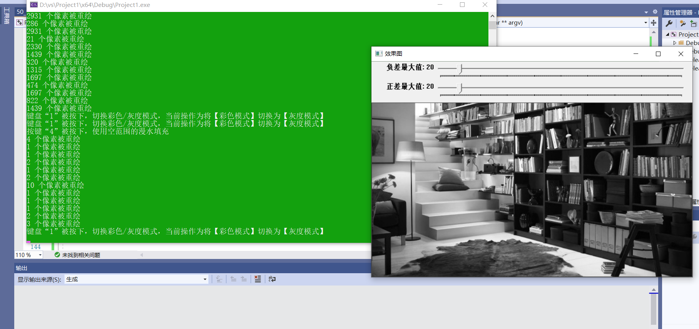

#### resize函数用法

```c++
//--------------------------------------【程序说明】-------------------------------------------
//		程序说明：《OpenCV3编程入门》OpenCV3版书本配套示例程序51
//		程序描述：resize函数用法示例
//		开发测试所用操作系统： Windows 7 64bit
//		开发测试所用IDE版本：Visual Studio 2010
//		开发测试所用OpenCV版本：	3.0 beta
//		2014年11月 Created by @浅墨_毛星云
//		2014年12月 Revised by @浅墨_毛星云
//------------------------------------------------------------------------------------------------


//---------------------------------【头文件、命名空间包含部分】----------------------------
//		描述：包含程序所使用的头文件和命名空间
//------------------------------------------------------------------------------------------------
#include <opencv2/opencv.hpp>
#include <opencv2/imgproc/imgproc.hpp>
using namespace cv;

//-----------------------------------【main( )函数】--------------------------------------------
//		描述：控制台应用程序的入口函数，我们的程序从这里开始
//-----------------------------------------------------------------------------------------------
int main()
{
	//载入原始图   
	Mat srcImage = imread("D:/image/1.jpg");  //工程目录下应该有一张名为1.jpg的素材图
	Mat tmpImage, dstImage1, dstImage2;//临时变量和目标图的定义
	tmpImage = srcImage;//将原始图赋给临时变量

	//显示原始图  
	imshow("【原始图】", srcImage);

	//进行尺寸调整操作
	resize(tmpImage, dstImage1, Size(tmpImage.cols / 2, tmpImage.rows / 2), (0, 0), (0, 0), 3);
	resize(tmpImage, dstImage2, Size(tmpImage.cols * 2, tmpImage.rows * 2), (0, 0), (0, 0), 3);

	//显示效果图  
	imshow("【效果图】之一", dstImage1);
	imshow("【效果图】之二", dstImage2);

	waitKey(0);
	return 0;
}

```
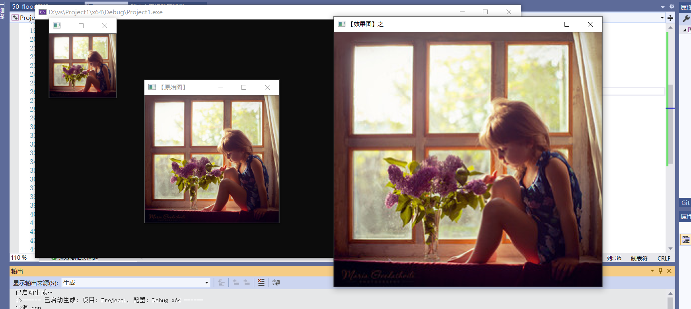

#### pyrUp函数用法

```c++
//--------------------------------------【程序说明】-------------------------------------------
//		程序说明：《OpenCV3编程入门》OpenCV3版书本配套示例程序52
//		程序描述：pyrUp函数用法示例
//		开发测试所用操作系统： Windows 7 64bit
//		开发测试所用IDE版本：Visual Studio 2010
//		开发测试所用OpenCV版本：	3.0 beta
//		2014年11月 Created by @浅墨_毛星云
//		2014年12月 Revised by @浅墨_毛星云
//------------------------------------------------------------------------------------------------


//---------------------------------【头文件、命名空间包含部分】----------------------------
//		描述：包含程序所使用的头文件和命名空间
//------------------------------------------------------------------------------------------------
#include <opencv2/opencv.hpp>
#include <opencv2/imgproc/imgproc.hpp>
using namespace cv;


//-----------------------------------【main( )函数】------------------------------------------
//		描述：控制台应用程序的入口函数，我们的程序从这里开始
//-----------------------------------------------------------------------------------------------
int main()
{
	//载入原始图   
	Mat srcImage = imread("D:/image/1.jpg");  //工程目录下应该有一张名为1.jpg的素材图
	Mat tmpImage, dstImage;//临时变量和目标图的定义
	tmpImage = srcImage;//将原始图赋给临时变量

	//显示原始图  
	imshow("【原始图】", srcImage);
	//进行向上取样操作
	pyrUp(tmpImage, dstImage, Size(tmpImage.cols * 2, tmpImage.rows * 2));
	//显示效果图  
	imshow("【效果图】", dstImage);

	waitKey(0);

	return 0;
}

```
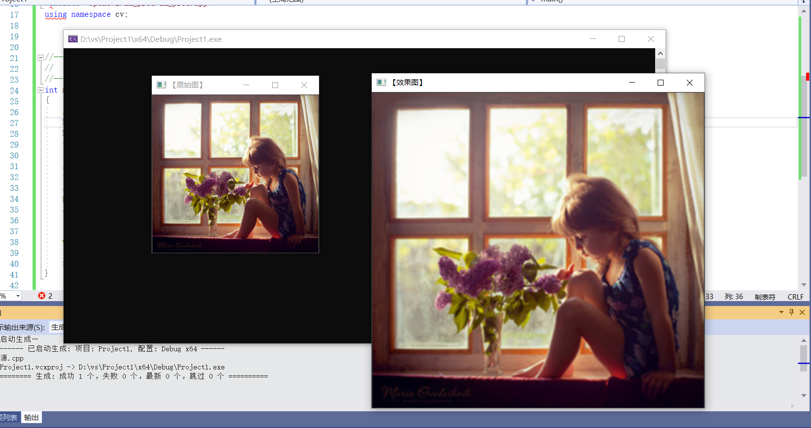

#### pyrDown函数用法示例

```c++

//--------------------------------------【程序说明】-------------------------------------------
//		程序说明：《OpenCV3编程入门》OpenCV3版书本配套示例程序53
//		程序描述：pyrDown函数用法示例
//		开发测试所用操作系统： Windows 7 64bit
//		开发测试所用IDE版本：Visual Studio 2010
//		开发测试所用OpenCV版本：	3.0 beta
//		2014年11月 Created by @浅墨_毛星云
//		2014年12月 Revised by @浅墨_毛星云
//------------------------------------------------------------------------------------------------


//---------------------------------【头文件、命名空间包含部分】----------------------------
//		描述：包含程序所使用的头文件和命名空间
//------------------------------------------------------------------------------------------------
#include <opencv2/opencv.hpp>
#include <opencv2/imgproc/imgproc.hpp>
using namespace cv;

//-----------------------------------【main( )函数】-----------------------------------------
//		描述：控制台应用程序的入口函数，我们的程序从这里开始
//-----------------------------------------------------------------------------------------------
int main()
{
	//载入原始图   
	Mat srcImage = imread("D:/image/1.jpg");  //工程目录下应该有一张名为1.jpg的素材图
	Mat tmpImage, dstImage;//临时变量和目标图的定义
	tmpImage = srcImage;//将原始图赋给临时变量

	//显示原始图  
	imshow("【原始图】", srcImage);
	//进行向下取样操作
	pyrDown(tmpImage, dstImage, Size(tmpImage.cols / 2, tmpImage.rows / 2));
	//显示效果图  
	imshow("【效果图】", dstImage);

	waitKey(0);

	return 0;
}

```


#### 图像金字塔和resize综合示例
```c++

//--------------------------------------【程序说明】-------------------------------------------
//		程序说明：《OpenCV3编程入门》OpenCV3版书本配套示例程序54
//		程序描述：图像金字塔和resize综合示例
//		开发测试所用操作系统： Windows 7 64bit
//		开发测试所用IDE版本：Visual Studio 2010
//		开发测试所用OpenCV版本：	3.0 beta
//		2014年11月 Created by @浅墨_毛星云
//		2014年12月 Revised by @浅墨_毛星云
//------------------------------------------------------------------------------------------------


//---------------------------------【头文件、命名空间包含部分】----------------------------
//		描述：包含程序所使用的头文件和命名空间
//------------------------------------------------------------------------------------------------
#include <opencv2/opencv.hpp>
#include <opencv2/highgui/highgui.hpp>
#include <opencv2/imgproc/imgproc.hpp>
using namespace std;
using namespace cv;


//-----------------------------------【宏定义部分】--------------------------------------------
//	描述：定义一些辅助宏
//------------------------------------------------------------------------------------------------
#define WINDOW_NAME "【程序窗口】"		//为窗口标题定义的宏


//-----------------------------------【全局变量声明部分】--------------------------------------
//		描述：全局变量声明
//-----------------------------------------------------------------------------------------------
Mat g_srcImage, g_dstImage, g_tmpImage;


//-----------------------------------【全局函数声明部分】--------------------------------------
//		描述：全局函数声明
//-----------------------------------------------------------------------------------------------
static void ShowHelpText();

//-----------------------------------【main( )函数】--------------------------------------------
//		描述：控制台应用程序的入口函数，我们的程序从这里开始
//-----------------------------------------------------------------------------------------------
int main()
{
	//改变console字体颜色
	system("color 2F");

	//显示帮助文字
	ShowHelpText();

	//载入原图
	g_srcImage = imread("D:/image/1.jpg");//工程目录下需要有一张名为1.jpg的测试图像，且其尺寸需被2的N次方整除，N为可以缩放的次数
	if (!g_srcImage.data) { printf("Oh，no，读取srcImage错误~！ \n"); return false; }

	// 创建显示窗口
	namedWindow(WINDOW_NAME, WINDOW_AUTOSIZE);
	imshow(WINDOW_NAME, g_srcImage);

	//参数赋值
	g_tmpImage = g_srcImage;
	g_dstImage = g_tmpImage;

	int key = 0;

	//轮询获取按键信息
	while (1)
	{
		key = waitKey(9);//读取键值到key变量中

		//根据key变量的值，进行不同的操作
		switch (key)
		{
			//======================【程序退出相关键值处理】=======================  
		case 27://按键ESC
			return 0;
			break;

		case 'q'://按键Q
			return 0;
			break;

			//======================【图片放大相关键值处理】=======================  
		case 'a'://按键A按下，调用pyrUp函数
			pyrUp(g_tmpImage, g_dstImage, Size(g_tmpImage.cols * 2, g_tmpImage.rows * 2));
			printf(">检测到按键【A】被按下，开始进行基于【pyrUp】函数的图片放大：图片尺寸×2 \n");
			break;

		case 'w'://按键W按下，调用resize函数
			resize(g_tmpImage, g_dstImage, Size(g_tmpImage.cols * 2, g_tmpImage.rows * 2));
			printf(">检测到按键【W】被按下，开始进行基于【resize】函数的图片放大：图片尺寸×2 \n");
			break;

		case '1'://按键1按下，调用resize函数
			resize(g_tmpImage, g_dstImage, Size(g_tmpImage.cols * 2, g_tmpImage.rows * 2));
			printf(">检测到按键【1】被按下，开始进行基于【resize】函数的图片放大：图片尺寸×2 \n");
			break;

		case '3': //按键3按下，调用pyrUp函数
			pyrUp(g_tmpImage, g_dstImage, Size(g_tmpImage.cols * 2, g_tmpImage.rows * 2));
			printf(">检测到按键【3】被按下，开始进行基于【pyrUp】函数的图片放大：图片尺寸×2 \n");
			break;
			//======================【图片缩小相关键值处理】=======================  
		case 'd': //按键D按下，调用pyrDown函数
			pyrDown(g_tmpImage, g_dstImage, Size(g_tmpImage.cols / 2, g_tmpImage.rows / 2));
			printf(">检测到按键【D】被按下，开始进行基于【pyrDown】函数的图片缩小：图片尺寸/2\n");
			break;

		case  's': //按键S按下，调用resize函数
			resize(g_tmpImage, g_dstImage, Size(g_tmpImage.cols / 2, g_tmpImage.rows / 2));
			printf(">检测到按键【S】被按下，开始进行基于【resize】函数的图片缩小：图片尺寸/2\n");
			break;

		case '2'://按键2按下，调用resize函数
			resize(g_tmpImage, g_dstImage, Size(g_tmpImage.cols / 2, g_tmpImage.rows / 2));
			printf(">检测到按键【2】被按下，开始进行基于【resize】函数的图片缩小：图片尺寸/2\n");
			break;

		case '4': //按键4按下，调用pyrDown函数
			pyrDown(g_tmpImage, g_dstImage, Size(g_tmpImage.cols / 2, g_tmpImage.rows / 2));
			printf(">检测到按键【4】被按下，开始进行基于【pyrDown】函数的图片缩小：图片尺寸/2\n");
			break;
		}

		//经过操作后，显示变化后的图
		imshow(WINDOW_NAME, g_dstImage);

		//将g_dstImage赋给g_tmpImage，方便下一次循环
		g_tmpImage = g_dstImage;
	}

	return 0;
}

//-----------------------------------【ShowHelpText( )函数】----------------------------------
//		描述：输出一些帮助信息
//----------------------------------------------------------------------------------------------
static void ShowHelpText()
{

	//输出欢迎信息和OpenCV版本
	printf("\n\n\t\t\t非常感谢购买《OpenCV3编程入门》一书！\n");
	printf("\n\n\t\t\t此为本书OpenCV3版的第54个配套示例程序\n");
	printf("\n\n\t\t\t   当前使用的OpenCV版本为：" CV_VERSION);
	printf("\n\n  ----------------------------------------------------------------------------\n");

	//输出一些帮助信息
	printf("\n\t欢迎来到OpenCV图像金字塔和resize示例程序~\n\n");
	printf("\n\n\t按键操作说明: \n\n"
		"\t\t键盘按键【ESC】或者【Q】- 退出程序\n"
		"\t\t键盘按键【1】或者【W】- 进行基于【resize】函数的图片放大\n"
		"\t\t键盘按键【2】或者【S】- 进行基于【resize】函数的图片缩小\n"
		"\t\t键盘按键【3】或者【A】- 进行基于【pyrUp】函数的图片放大\n"
		"\t\t键盘按键【4】或者【D】- 进行基于【pyrDown】函数的图片缩小\n"
	);
}
```
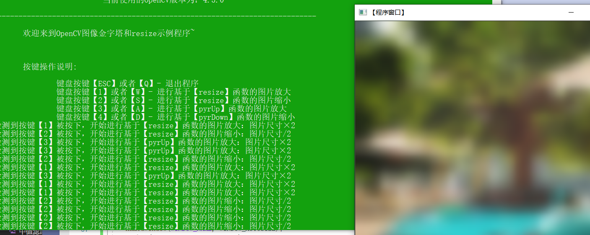

#### 基本阈值操作

```c++

//--------------------------------------【程序说明】-------------------------------------------
//		程序说明：《OpenCV3编程入门》OpenCV3版书本配套示例程序55
//		程序描述：OpenCV基本阈值操作
//		开发测试所用操作系统： Windows 7 64bit
//		开发测试所用IDE版本：Visual Studio 2010
//		开发测试所用OpenCV版本：	3.0 beta
//		2014年11月 Created by @浅墨_毛星云
//		2014年12月 Revised by @浅墨_毛星云
//------------------------------------------------------------------------------------------------


//---------------------------------【头文件、命名空间包含部分】----------------------------
//		描述：包含程序所使用的头文件和命名空间
//------------------------------------------------------------------------------------------------
#include "opencv2/imgproc/imgproc.hpp"
#include "opencv2/highgui/highgui.hpp"
#include <iostream>
using namespace cv;
using namespace std;

//-----------------------------------【宏定义部分】-------------------------------------------- 
//		描述：定义一些辅助宏 
//------------------------------------------------------------------------------------------------ 
#define WINDOW_NAME "【程序窗口】"        //为窗口标题定义的宏 


//-----------------------------------【全局变量声明部分】--------------------------------------
//		描述：全局变量的声明
//-----------------------------------------------------------------------------------------------
int g_nThresholdValue = 100;
int g_nThresholdType = 3;
Mat g_srcImage, g_grayImage, g_dstImage;

//-----------------------------------【全局函数声明部分】--------------------------------------
//		描述：全局函数的声明
//-----------------------------------------------------------------------------------------------
static void ShowHelpText();//输出帮助文字
void on_Threshold(int, void*);//回调函数


//-----------------------------------【main( )函数】--------------------------------------------
//		描述：控制台应用程序的入口函数，我们的程序从这里开始执行
//-----------------------------------------------------------------------------------------------
int main()
{
	//【0】改变console字体颜色
	system("color 1F");

	//【0】显示欢迎和帮助文字
	ShowHelpText();

	//【1】读入源图片
	g_srcImage = imread("D:/image/1.jpg");
	if (!g_srcImage.data) { printf("读取图片错误，请确定目录下是否有imread函数指定的图片存在~！ \n"); return false; }
	imshow("原始图", g_srcImage);

	//【2】存留一份原图的灰度图
	cvtColor(g_srcImage, g_grayImage, COLOR_RGB2GRAY);

	//【3】创建窗口并显示原始图
	namedWindow(WINDOW_NAME, WINDOW_AUTOSIZE);

	//【4】创建滑动条来控制阈值
	createTrackbar("模式",
		WINDOW_NAME, &g_nThresholdType,
		4, on_Threshold);

	createTrackbar("参数值",
		WINDOW_NAME, &g_nThresholdValue,
		255, on_Threshold);

	//【5】初始化自定义的阈值回调函数
	on_Threshold(0, 0);

	// 【6】轮询等待用户按键，如果ESC键按下则退出程序
	while (1)
	{
		int key;
		key = waitKey(20);
		if ((char)key == 27) { break; }
	}

}

//-----------------------------------【on_Threshold( )函数】------------------------------------
//		描述：自定义的阈值回调函数
//-----------------------------------------------------------------------------------------------
void on_Threshold(int, void*)
{
	//调用阈值函数
	threshold(g_grayImage, g_dstImage, g_nThresholdValue, 255, g_nThresholdType);

	//更新效果图
	imshow(WINDOW_NAME, g_dstImage);
}

//-----------------------------------【ShowHelpText( )函数】----------------------------------  
//      描述：输出一些帮助信息  
//----------------------------------------------------------------------------------------------  
static void ShowHelpText()
{
	//输出欢迎信息和OpenCV版本
	printf("\n\n\t\t\t非常感谢购买《OpenCV3编程入门》一书！\n");
	printf("\n\n\t\t\t此为本书OpenCV3版的第55个配套示例程序\n");
	printf("\n\n\t\t\t   当前使用的OpenCV版本为：" CV_VERSION);
	printf("\n\n  ----------------------------------------------------------------------------\n");

	//输出一些帮助信息  
	printf("\n\t欢迎来到【基本阈值操作】示例程序~\n\n");
	printf("\n\t按键操作说明: \n\n"
		"\t\t键盘按键【ESC】- 退出程序\n"
		"\t\t滚动条模式0- 二进制阈值\n"
		"\t\t滚动条模式1- 反二进制阈值\n"
		"\t\t滚动条模式2- 截断阈值\n"
		"\t\t滚动条模式3- 反阈值化为0\n"
		"\t\t滚动条模式4- 阈值化为0\n");
}

```

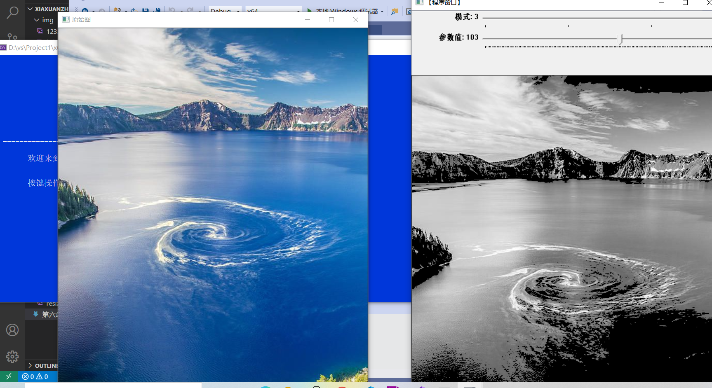

## 总结及其心得体会

学习了线性滤波，这些其实都是很基本的操作，把函数一些传入参数学习了，其实用多了就很好掌握了，后面一章就会反复用到这章的内容
基本阀值操作其实就是对图像做出取舍与决策，剔除一些低于或者高于一定值的像素
形态学滤波相比线性滤波难理解些，特别是开始并不理解膨胀操作，之后听老师讲演示那只猫的图片，旁边那条先变粗了理解了，基本熟悉了函数，和一些效果