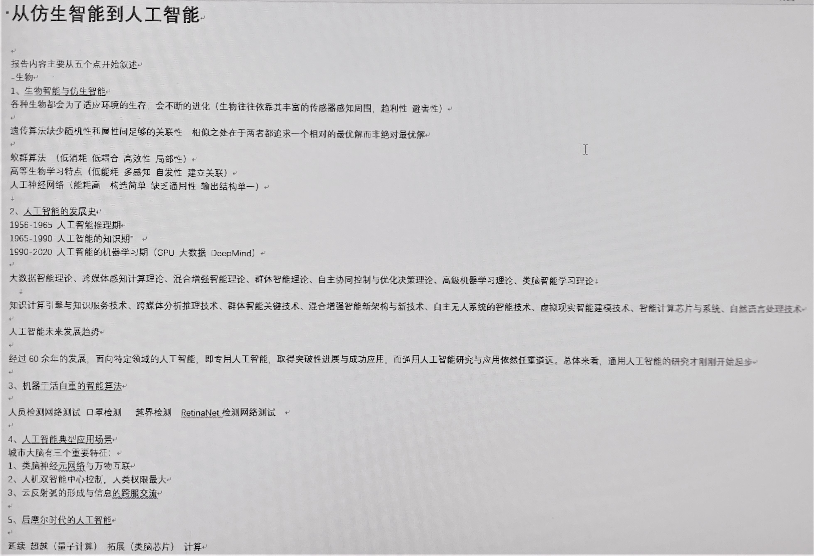
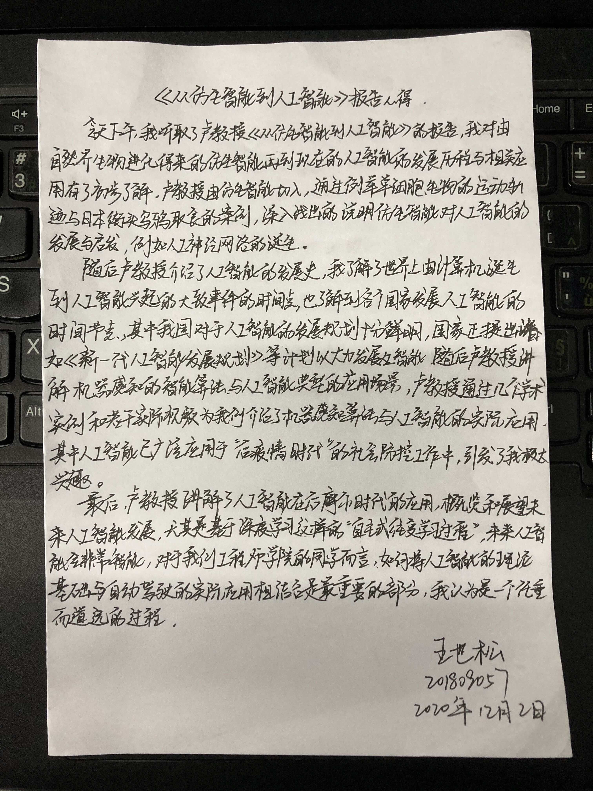

201809057 王世松 《从仿生智能到人工智能》报告心得

## 《从仿生智能到人工智能》报告

## 报告笔记
##### 龚老师，我是在卢涛教授进行报告讲述时用word文档进行快速记录。

&nbsp; 听取了卢涛教授的报告，我对由自然界生物进化得来仿生智能再到现在的人工智能的发展历程与相关应用有了初步的了解。卢教授由仿生智能切入。通过例举单细胞生物的运行轨迹与日本街头乌鸦取食的案例，深入浅出的说明了仿生智能对发展人工智能的启发与影响，例如人工神经网络的诞生。
&nbsp; 随后卢教授介绍了人工智能的发展史，我了解了世界由计算机诞生到人工智能诞生到兴起的大致大事件时间线，也了解到了各个国家发展人工智能的时间节点，其中我国对于人工智能的规划与发展十分鲜明，国家正提出许多计划以大力发展人工智能，例如国务院《新一代人工智能发展规划》当中提到的基础理论与技术体系。随后卢教授讲解了机器感知的智能算法与人工智能典型的应用场景，卢教授通过几个实例和若干个详细的视频为我们介绍了机器感知算法与人工智能的实际应用，其中人工智能已广泛应用于“后疫情时代”的社会防控工作中，比如检测人员受否佩戴口罩、体温是否正常等，引发了我的兴趣。
&nbsp;  最后，卢涛教授讲解了人工智能在后摩尔时代的应用，概览和展望未来人工智能的发展，尤其是基于深度学习这样的“自主往复式学习”过程，未来的人工智能会非常智能。对于工程师学院的同学，如何将人工智能的理论基础与自动驾驶甚至智能汽车的研发相关联是最主要的部分，卢教授包括提问的同学谈到了人工智能在自动驾驶领域的实际应用，我认为这是个任重道远的过程。

## 手写心得
