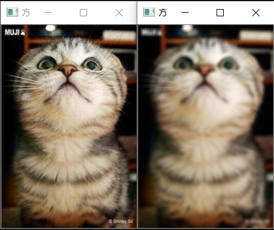
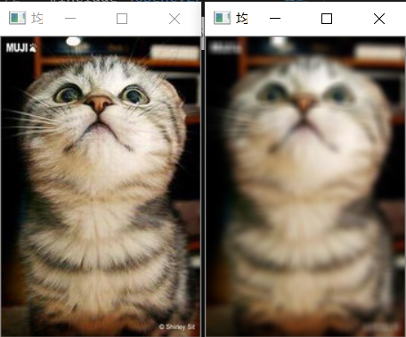
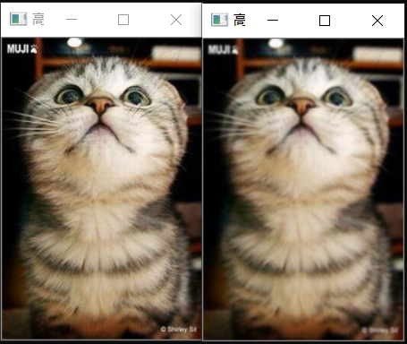
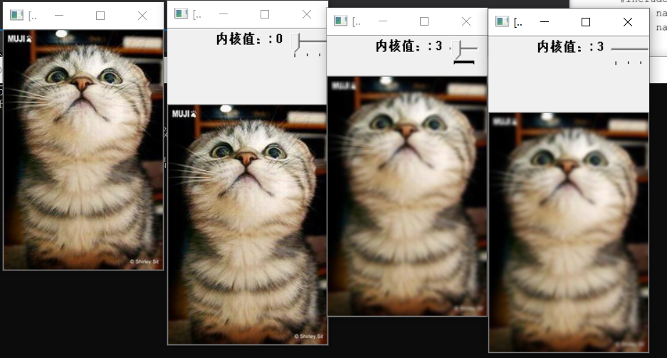
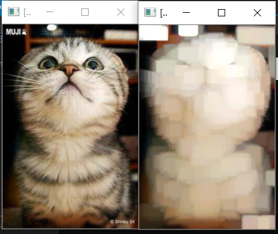
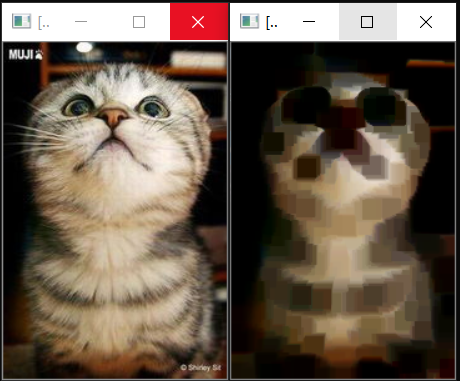
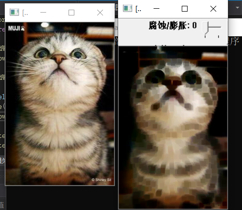

># 第三次作业 图像处理
>>## 6.1 线性滤波：方框滤波、均值滤波、高斯滤波
>>>6.1.1 平滑处理

  平滑处理（smoothing）也称模糊处理（布鲁日你个），是一种简单且使用频率很高的图像处理方法。常用来减少图像上的噪点或者失真，在涉及到降低图像分辨率时，平滑处理是非常好用的方法。
  >>>6.1.2 图像滤波与滤波器

   图像滤波的两个目的：一是抽出对象的特征作为图像识别的特征模式；另一个是为适应图像处理的要求，消除图像数字化时所混入的噪声。滤波处理的两个要求是：一是不能损坏图像的轮廓及边缘等重要信息；二是使图像清晰视觉效果好。

   关于滤波器，形象地将它比喻成一个包含加权系数的窗口，当使用这个滤波器平滑处理图像时，就把这个窗口放到图像上，透过这个窗口来看我们得到的图像 。

   滤波器的种类：
   * 方框滤波——BoxBlur函数
   * 均值滤波（领域平均滤波）——Blur函数
   * 高斯滤波——GaussianBlur函数
   * 中值滤波——medianBlur函数
   * 双边滤波——bilateralFilter函数
  >>>6.1.3线型滤波器的简介

  线型滤波器经常用于剔除输入信号中不想要的频率或者从许多频率中选择一个想要的频率。

  常见的线型滤波器如下：
  * 低通滤波器：允许低频率通过；
  * 高通滤波器：允许高频率通过；
  * 带通滤波器：允许一定范围频率通过；
  * 带阻滤波器：阻止一定范围频率通过并且允许其他频率通过；
  * 全通滤波器：允许所有频率通过，仅仅改变相位关系；
  * 陷波滤波器：阻止一个狭窄频率范围通过，是一种特殊的带阻滤波器。
  
>>>6.1.4 滤波和模糊

滤波可分低通滤波和高通滤波两种。而高斯滤波是指用高斯函数作为滤波函数的滤波操作，至于是不是模糊，要看是高斯低通还是高斯高通，低通就是模糊，高通就是锐化。

高斯滤波是指用高斯函数作为滤波函数的滤波操作。

高斯模糊就是高斯低通滤波。
>>>6.1.5 领域算子与线性领域滤波

邻域算子（局部算子）是利用给定像素周围的像素值的决定此像素的最终输出值的一种算子。而线性邻域滤波是一种常用的邻域算子，像素的输出值取决于输入像素的加权和。

邻域算子除了用于局部色调调整以外，还可以用于图像滤波，实现图像的平滑和锐化，图像边缘增强或者图像噪声的去除。本篇文章，我们介绍的主角是线性邻域滤波算子，即用不同的权重去结合一个小邻域内的像素，来得到应有的处理效果。
>>>6.1.6方框滤波

方框滤波（box Filter）被封装在一个名为boxblur的函数中，即boxblur函数的作用是使用方框滤波器（box filter）来模糊一张图片，从src输入，从dst输出。

函数原型如下：

[cpp] view plain copy
C++: void boxFilter(InputArray src,OutputArray dst, int ddepth, Size ksize, Point anchor=Point(-1,-1), boolnormalize=true, int borderType=BORDER_DEFAULT )  

参数详解：

第一个参数，InputArray类型的src，输入图像，即源图像，填Mat类的对象即可。该函数对通道是独立处理的，且可以处理任意通道数的图片，但需要注意，待处理的图片深度应该为CV_8U, CV_16U, CV_16S, CV_32F 以及 CV_64F之一。
第二个参数，OutputArray类型的dst，即目标图像，需要和源图片有一样的尺寸和类型。
第三个参数，int类型的ddepth，输出图像的深度，-1代表使用原图深度，即src.depth()。
第四个参数，Size类型（对Size类型稍后有讲解）的ksize，内核的大小。一般这样写Size( w,h )来表示内核的大小( 其中，w 为像素宽度， h为像素高度)。Size（3,3）就表示3x3的核大小，Size（5,5）就表示5x5的核大小
第五个参数，Point类型的anchor，表示锚点（即被平滑的那个点），注意他有默认值Point(-1,-1)。如果这个点坐标是负值的话，就表示取核的中心为锚点，所以默认值Point(-1,-1)表示这个锚点在核的中心。
第六个参数，bool类型的normalize，默认值为true，一个标识符，表示内核是否被其区域归一化（normalized）了。
第七个参数，int类型的borderType，用于推断图像外部像素的某种边界模式。有默认值BORDER_DEFAULT，我们一般不去管它。
>>>6.1.7 均值滤波

均值滤波，是最简单的一种滤波操作，输出图像的每一个像素是核窗口内输入图像对应像素的像素的平均值( 所有像素加权系数相等)，其实说白了它就是归一化后的方框滤波。

均值滤波是典型的线性滤波算法，主要方法为邻域平均法，即用一片图像区域的各个像素的均值来代替原图像中的各个像素值。一般需要在图像上对目标像素给出一个模板（内核），该模板包括了其周围的临近像素（比如以目标像素为中心的周围8（3x3-1）个像素，构成一个滤波模板，即去掉目标像素本身）。

均值滤波本身存在着固有的缺陷，即它不能很好地保护图像细节，在图像去噪的同时也破坏了图像的细节部分，从而使图像变得模糊，不能很好地去除噪声点。

blur函数的原型：

[cpp] view plain copy
C++: void blur(InputArray src, OutputArraydst, Size ksize, Point anchor=Point(-1,-1), int borderType=BORDER_DEFAULT )  

第一个参数，InputArray类型的src，输入图像，即源图像，填Mat类的对象即可。该函数对通道是独立处理的，且可以处理任意通道数的图片，但需要注意，待处理的图片深度应该为CV_8U, CV_16U, CV_16S, CV_32F 以及 CV_64F之一。
第二个参数，OutputArray类型的dst，即目标图像，需要和源图片有一样的尺寸和类型。比如可以用Mat::Clone，以源图片为模板，来初始化得到如假包换的目标图。
第三个参数，Size类型（对Size类型稍后有讲解）的ksize，内核的大小。一般这样写Size( w,h )来表示内核的大小( 其中，w 为像素宽度， h为像素高度)。Size（3,3）就表示3x3的核大小，Size（5,5）就表示5x5的核大小
第四个参数，Point类型的anchor，表示锚点（即被平滑的那个点），注意他有默认值Point(-1,-1)。如果这个点坐标是负值的话，就表示取核的中心为锚点，所以默认值Point(-1,-1)表示这个锚点在核的中心。
第五个参数，int类型的borderType，用于推断图像外部像素的某种边界模式。
>>>6.1.8 高斯滤波

高斯滤波是一种线性平滑滤波，适用于消除高斯噪声，广泛应用于图像处理的减噪过程。通俗的讲，高斯滤波就是对整幅图像进行加权平均的过程，每一个像素点的值，都由其本身和邻域内的其他像素值经过加权平均后得到。高斯滤波的具体操作是：用一个模板（或称卷积、掩模）扫描图像中的每一个像素，用模板确定的邻域内像素的加权平均灰度值去替代模板中心像素点的值。

大家常常说高斯滤波最有用的滤波操作，虽然它用起来，效率往往不是最高的。

高斯模糊技术生成的图像，其视觉效果就像是经过一个半透明屏幕在观察图像，这与镜头焦外成像效果散景以及普通照明阴影中的效果都明显不同。高斯平滑也用于计算机视觉算法中的预先处理阶段，以增强图像在不同比例大小下的图像效果（参见尺度空间表示以及尺度空间实现）。从数学的角度来看，图像的高斯模糊过程就是图像与正态分布做卷积。由于正态分布又叫作高斯分布，所以这项技术就叫作高斯模糊。

GaussianBlur函数的作用是用高斯滤波器来模糊一张图片，对输入的图像src进行高斯滤波后用dst输出。它将源图像和指定的高斯核函数做卷积运算，并且支持就地过滤（In-placefiltering）。

[cpp] view plain copy
C++: void GaussianBlur(InputArray src,OutputArray dst, Size ksize, double sigmaX, double sigmaY=0, intborderType=BORDER_DEFAULT )  

第一个参数，InputArray类型的src，输入图像，即源图像，填Mat类的对象即可。它可以是单独的任意通道数的图片，但需要注意，图片深度应该为CV_8U,CV_16U, CV_16S, CV_32F 以及 CV_64F之一。
第二个参数，OutputArray类型的dst，即目标图像，需要和源图片有一样的尺寸和类型。比如可以用Mat::Clone，以源图片为模板，来初始化得到如假包换的目标图。
第三个参数，Size类型的ksize高斯内核的大小。其中ksize.width和ksize.height可以不同，但他们都必须为正数和奇数。或者，它们可以是零的，它们都是由sigma计算而来。
第四个参数，double类型的sigmaX，表示高斯核函数在X方向的的标准偏差。
第五个参数，double类型的sigmaY，表示高斯核函数在Y方向的的标准偏差。若sigmaY为零，就将它设为sigmaX，如果sigmaX和sigmaY都是0，那么就由ksize.width和ksize.height计算出来。
为了结果的正确性着想，最好是把第三个参数Size，第四个参数sigmaX和第五个参数sigmaY全部指定到。
第六个参数，int类型的borderType，用于推断图像外部像素的某种边界模式。
>>>6.1.11 线性滤波核心API函数
* 方框滤波：boxFiltter函数
  
结果如下：

* 均值滤波：blur函数
  
结果如下：

* 高斯滤波：GaussianBlur函数

结果如下：

>>>6.1.12 图像线性滤波综合示例

结果如下：原图，方框滤波，均值滤波，高斯滤波

 
>>6.3形态学滤波（1）：腐蚀与膨胀
>>>6.3.1 形态学概述

简单来讲，形态学操作就是基于形状的一系列图像处理操作。通过将 结构元素 作用于输入图像来产生输出图像。

最基本的形态学操作有二：腐蚀与膨胀(Erosion 与 Dilation)。 他们的运用广泛:

* 消除噪声
* 分割(isolate)独立的图像元素，以及连接(join)相邻的元素。
* 寻找图像中的明显的极大值区域或极小值区域。
* 求出图像的梯度。
>>>6.3.2膨胀

膨胀就是求局部最大值的操作。从数学角度来说，膨胀或者腐蚀操作就是将图像与核进行卷积。核可以是任何形状和大小，它拥有一个单独定义出来的参考点，称其为锚点。

此操作将图像 A 与任意形状的内核 (B)，通常为正方形或圆形,进行卷积。

内核 B 有一个可定义的 锚点, 通常定义为内核中心点。

进行膨胀操作时，将内核 B 划过图像,将内核 B 覆盖区域的最大相素值提取，并代替锚点位置的相素。显然，这一最大化操作将会导致图像中的亮区开始”扩展” (因此有了术语膨胀 dilation )。
>>>6.3.3腐蚀

腐蚀在形态学操作家族里是膨胀操作的孪生姐妹。它提取的是内核覆盖下的相素最小值。

进行腐蚀操作时，将内核 B 划过图像,将内核 B 覆盖区域的最小相素值提取，并代替锚点位置的相素。

以与膨胀相同的图像作为样本,我们使用腐蚀操作。

>>>6.3.4 相关OpenCV源码分析

erode和dilate这两个函数内部就是调用了morphOp，只是调用morphOp时，第一个参数标识符不同：一个为MORPH_ERODE(腐蚀)，一个为MORPH_DILATE(膨胀)
>>>6.3.5 相关核心API函数讲解

* 膨胀：dilate函数

dilate函数使用像素领域内的局部极大运算符来膨胀一幅图像，从src输入，由dst输出。

膨胀结果如下：

* 腐蚀：erode函数

erode函数使用像素领域内的局部绩效运算符来腐蚀一幅图像，从src输入，由dst输出。

腐蚀结果如下：

>>> 6.3.6 综合示例：腐蚀与膨胀

此示例程序中的效果图窗口中有两个滑动条，第一个滑动条“腐蚀/膨胀”用于在腐蚀/膨胀之间进行切换；第二个滚动条“内核尺寸”用于调节形态学操作时的内核尺寸，以得到效果不同的图像。

运行截图如下：

># 小结

在本节课中学习了各种利用OpenCV进行图像处理的方法。包括属于线性过滤的方框滤波、均值滤波与高斯滤波；属于非线性滤波的中值滤波、双边滤波；两种基本形态学操作——膨胀与腐蚀。