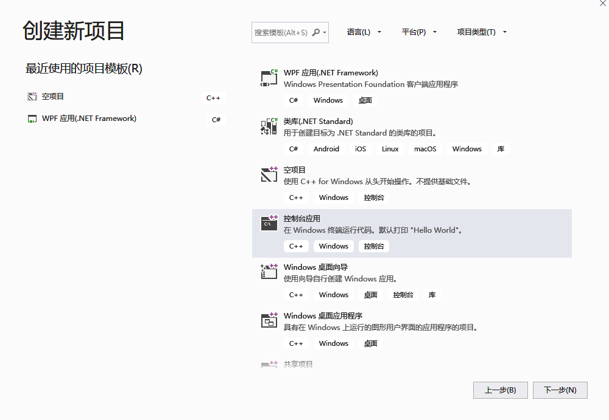
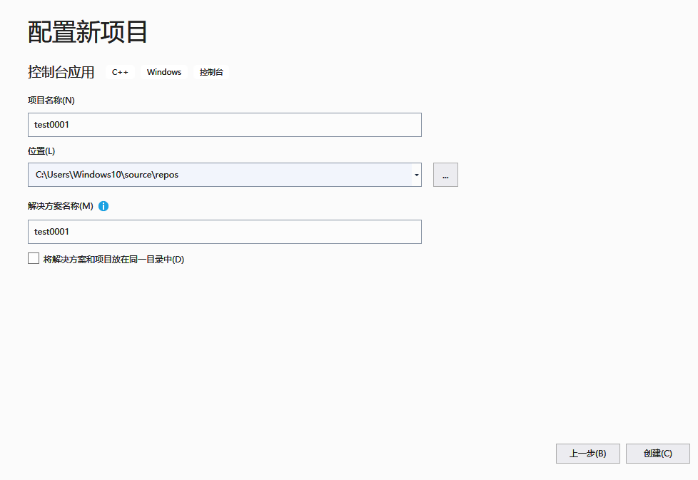
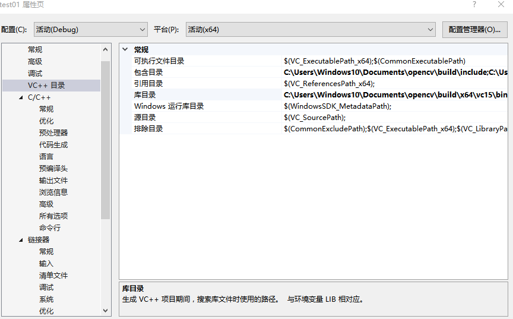
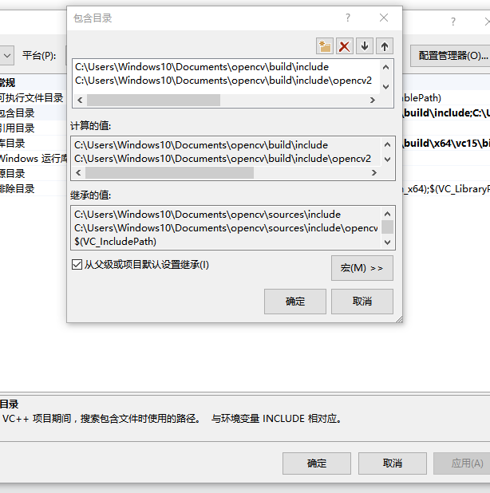
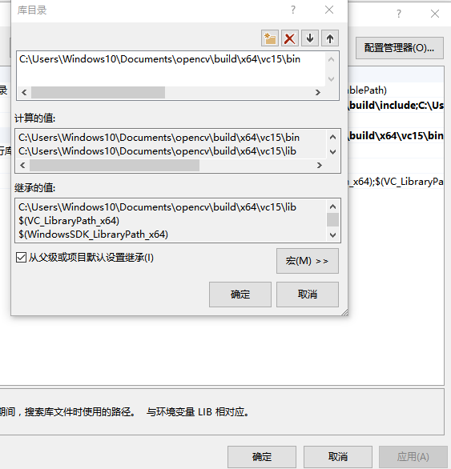
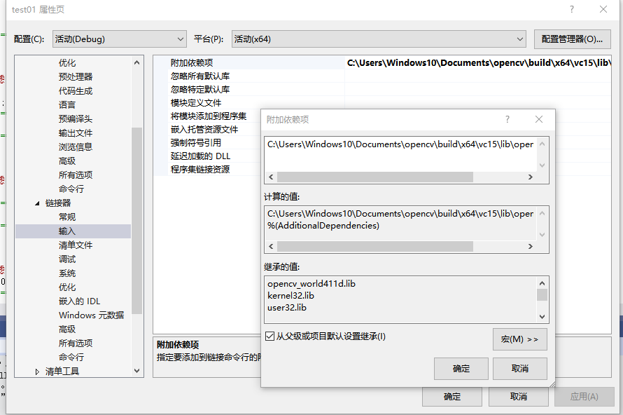

## 第一次作业
### 一.环境
vs2019社区版、win10 64位操作系统
### 二.OpenCV配置步骤
1、安装vs2019 Community
下载地址：
[huat]<https://visualstudio.microsoft.com/>

安装后打开，启动界面如下：

2.安装opencv，我的安装目录是  C:\Users\Windows10\Documents\opencv\build\x64\vc15\bin

3.在高级系统属性设置中改变环境设置

同时改变改变Windows10和系统变量中的用户变量中Path的值为：C:\Users\Windows10\Documents\opencv\build\x64\vc15\bin

4.将C:\Users\Windows10\Documents\opencv\build\x64\vc15\bin目录下面的 opencv_world411.dll和opencv_world411d.dll文件复制到 C:\Windows\SysWOW64这个文件夹
5.将bin目录里面的opencv_ffmpeg411_64.dll复制到C:\Windows\System32这个文件夹
## 三.在vs 2019中新建项目
1.选择路径“File->New->Project”：依次选择Language为C++，Platform为Windows，Project type为desktop,

2.选择Windows Desktop Wizard，并选择Next,

3.点击Create,并下弹出的对话框中选择，Application type 为Console, 选择Empty Project,

4.点击OK，在Source files里面右键，添加New item:添加test01.cpp源文件。
右键test01这个项目,选择属性:

## 四.VS配置步骤
1.包含目录中加入
#### C:\Users\Windows10\Documents\opencv\build\include
C:\Users\Windows10\Documents\opencv\build\include\opencv2

2.库目录的加入
C:\Users\Windows10\Documents\opencv\build\x64\vc15\bin

3. 链接器->输入->附加依赖项中加入
   C:\Users\Windows10\Documents\opencv\build\x64\vc15\lib\opencv_world411d.lib

   
## 五.测试代码
#include <iostream>
#include <opencv2/opencv.hpp>

using namespace cv;

int main()
{
	Mat img = imread("D:\\Works\\Data\\Bear\\001.jpg");

	imshow("test01", img);

	waitKey(0);
}

## 六.总结
  通过本次课程，我知道了如何配置搭建环境。在配置环境的过程中，我也遇到了很多问题要复制很多路径，错了一个路径之后就运行不出来程序，所以在今后的学习过程中我应该更加细心。最开始运行时，每次新建工程都要重新配置环境，有点麻烦，最后我保存好所有路径之后对电脑进行了一次重启，然后就不用再进行配置了，因此省下了不少时间。在今后的学习过程中，我会更加努力。